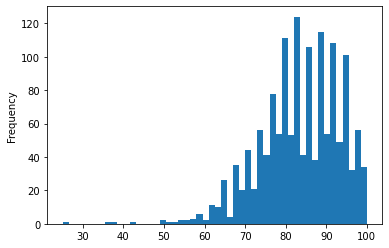
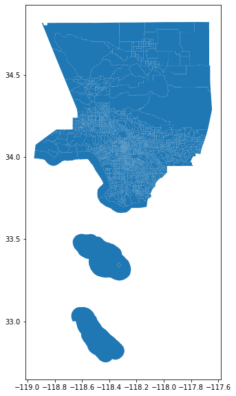
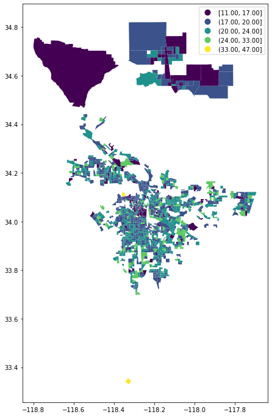
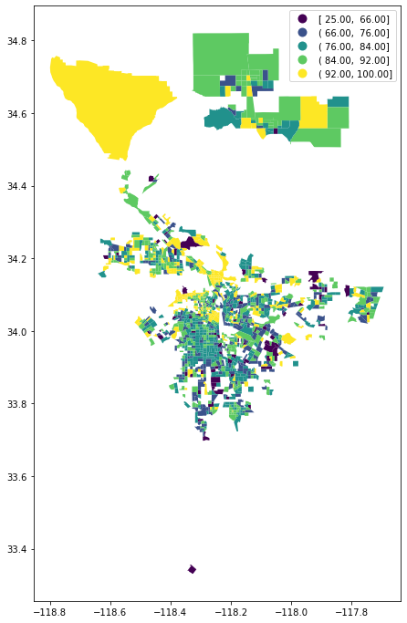
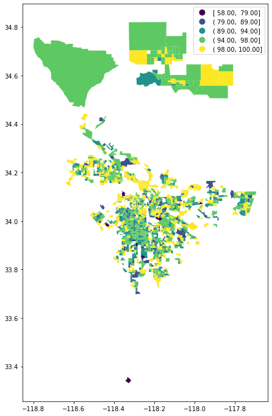

```python
import pandas as pd
```


```python
df = pd.read_csv('data/amiaffordability.csv')
```


```python
df.shape
```


    (2347, 16)


```python
df.head
```


    <bound method NDFrame.head of         Geo_FIPS             Geo_NAME  \
    0     6037101110    Census Tract 11.1   
    1     6037101122   Census Tract 11.22   
    2     6037101210    Census Tract 12.1   
    3     6037101220    Census Tract 12.2   
    4     6037101300      Census Tract 13   
    ...          ...                  ...   
    2342  6037980033  Census Tract 800.33   
    2343  6037990100     Census Tract 901   
    2344  6037990200     Census Tract 902   
    2345  6037990300     Census Tract 903   
    2346  6037999999  Census Tract 999.99   
    
                                                  Geo_QNAME  Geo_NATION  \
    0     Census Tract 11.1, Los Angeles County, California           0   
    1     Census Tract 11.22, Los Angeles County, Califo...           0   
    2     Census Tract 12.1, Los Angeles County, California           0   
    3     Census Tract 12.2, Los Angeles County, California           0   
    4       Census Tract 13, Los Angeles County, California           0   
    ...                                                 ...         ...   
    2342  Census Tract 800.33, Los Angeles County, Calif...           0   
    2343   Census Tract 901, Los Angeles County, California           0   
    2344   Census Tract 902, Los Angeles County, California           0   
    2345   Census Tract 903, Los Angeles County, California           0   
    2346  Census Tract 999.99, Los Angeles County, Calif...           0   
    
          Geo_STATE  Geo_COUNTY  Geo_CT  Geo_CBSA  Geo_CITIES  Geo_PHA  \
    0             6          37  101110       NaN         NaN      NaN   
    1             6          37  101122       NaN         NaN      NaN   
    2             6          37  101210       NaN         NaN      NaN   
    3             6          37  101220       NaN         NaN      NaN   
    4             6          37  101300       NaN         NaN      NaN   
    ...         ...         ...     ...       ...         ...      ...   
    2342          6          37  980033       NaN         NaN      NaN   
    2343          6          37  990100       NaN         NaN      NaN   
    2344          6          37  990200       NaN         NaN      NaN   
    2345          6          37  990300       NaN         NaN      NaN   
    2346          6          37  999999       NaN         NaN      NaN   
    
          Geo_ZIPCODES  Geo_TCD  Geo_PROJECTS  ALL_HUD_A008_001  ALL_HUD_A008_002  \
    0              NaN      NaN           NaN              21.0              89.0   
    1              NaN      NaN           NaN               NaN               NaN   
    2              NaN      NaN           NaN              21.0              86.0   
    3              NaN      NaN           NaN              19.0              94.0   
    4              NaN      NaN           NaN               NaN               NaN   
    ...            ...      ...           ...               ...               ...   
    2342           NaN      NaN           NaN               NaN               NaN   
    2343           NaN      NaN           NaN               NaN               NaN   
    2344           NaN      NaN           NaN               NaN               NaN   
    2345           NaN      NaN           NaN               NaN               NaN   
    2346           NaN      NaN           NaN              22.0              85.0   
    
          ALL_HUD_A008_003  
    0                 96.0  
    1                  NaN  
    2                 97.0  
    3                 99.0  
    4                  NaN  
    ...                ...  
    2342               NaN  
    2343               NaN  
    2344               NaN  
    2345               NaN  
    2346              94.0  
    
    [2347 rows x 16 columns]>


```python
pd.set_option('display.max_columns', None)
pd.set_option('display.max_rows', None)
```


```python
df.sample()
```


<div>
<style scoped>
    .dataframe tbody tr th:only-of-type {
        vertical-align: middle;
    }

    .dataframe tbody tr th {
        vertical-align: top;
    }

    .dataframe thead th {
        text-align: right;
    }
</style>
<table border="1" class="dataframe">
  <thead>
    <tr style="text-align: right;">
      <th></th>
      <th>Geo_FIPS</th>
      <th>Geo_NAME</th>
      <th>Geo_QNAME</th>
      <th>Geo_NATION</th>
      <th>Geo_STATE</th>
      <th>Geo_COUNTY</th>
      <th>Geo_CT</th>
      <th>Geo_CBSA</th>
      <th>Geo_CITIES</th>
      <th>Geo_PHA</th>
      <th>Geo_ZIPCODES</th>
      <th>Geo_TCD</th>
      <th>Geo_PROJECTS</th>
      <th>ALL_HUD_A008_001</th>
      <th>ALL_HUD_A008_002</th>
      <th>ALL_HUD_A008_003</th>
    </tr>
  </thead>
  <tbody>
    <tr>
      <th>592</th>
      <td>6037211804</td>
      <td>Census Tract 118.04</td>
      <td>Census Tract 118.04, Los Angeles County, Calif...</td>
      <td>0</td>
      <td>6</td>
      <td>37</td>
      <td>211804</td>
      <td>NaN</td>
      <td>NaN</td>
      <td>NaN</td>
      <td>NaN</td>
      <td>NaN</td>
      <td>NaN</td>
      <td>NaN</td>
      <td>NaN</td>
      <td>NaN</td>
    </tr>
  </tbody>
</table>
</div>


```python
df.info(verbose=True, null_counts=True)
```

    <class 'pandas.core.frame.DataFrame'>
    RangeIndex: 2347 entries, 0 to 2346
    Data columns (total 16 columns):
     #   Column            Non-Null Count  Dtype  
    ---  ------            --------------  -----  
     0   Geo_FIPS          2347 non-null   int64  
     1   Geo_NAME          2347 non-null   object 
     2   Geo_QNAME         2347 non-null   object 
     3   Geo_NATION        2347 non-null   int64  
     4   Geo_STATE         2347 non-null   int64  
     5   Geo_COUNTY        2347 non-null   int64  
     6   Geo_CT            2347 non-null   int64  
     7   Geo_CBSA          0 non-null      float64
     8   Geo_CITIES        0 non-null      float64
     9   Geo_PHA           0 non-null      float64
     10  Geo_ZIPCODES      0 non-null      float64
     11  Geo_TCD           0 non-null      float64
     12  Geo_PROJECTS      0 non-null      float64
     13  ALL_HUD_A008_001  1445 non-null   float64
     14  ALL_HUD_A008_002  1445 non-null   float64
     15  ALL_HUD_A008_003  1445 non-null   float64
    dtypes: float64(9), int64(5), object(2)
    memory usage: 293.5+ KB


```python
df.Geo_FIPS.head()
```


    0    6037101110
    1    6037101122
    2    6037101210
    3    6037101220
    4    6037101300
    Name: Geo_FIPS, dtype: int64


```python
df = pd.read_csv(
    'data/amiaffordability.csv',
    dtype=
    {
        'Geo_FIPS':str,
        'Geo_STATE':str,
        'Geo_COUNTY': str
    }
)
```


```python
df.head
```


    <bound method NDFrame.head of          Geo_FIPS             Geo_NAME  \
    0     06037101110    Census Tract 11.1   
    1     06037101122   Census Tract 11.22   
    2     06037101210    Census Tract 12.1   
    3     06037101220    Census Tract 12.2   
    4     06037101300      Census Tract 13   
    5     06037101400      Census Tract 14   
    6     06037102103   Census Tract 21.03   
    7     06037102104   Census Tract 21.04   
    8     06037102105   Census Tract 21.05   
    9     06037102107   Census Tract 21.07   
    10    06037103101   Census Tract 31.01   
    11    06037103102   Census Tract 31.02   
    12    06037103200      Census Tract 32   
    13    06037103300      Census Tract 33   
    14    06037103400      Census Tract 34   
    15    06037104103   Census Tract 41.03   
    16    06037104105   Census Tract 41.05   
    17    06037104108   Census Tract 41.08   
    18    06037104124   Census Tract 41.24   
    19    06037104201   Census Tract 42.01   
    20    06037104203   Census Tract 42.03   
    21    06037104204   Census Tract 42.04   
    22    06037104310    Census Tract 43.1   
    23    06037104320    Census Tract 43.2   
    24    06037104401   Census Tract 44.01   
    25    06037104403   Census Tract 44.03   
    26    06037104404   Census Tract 44.04   
    27    06037104500      Census Tract 45   
    28    06037104610    Census Tract 46.1   
    29    06037104620    Census Tract 46.2   
    30    06037104701   Census Tract 47.01   
    31    06037104703   Census Tract 47.03   
    32    06037104704   Census Tract 47.04   
    33    06037104810    Census Tract 48.1   
    34    06037104821   Census Tract 48.21   
    35    06037104822   Census Tract 48.22   
    36    06037106010    Census Tract 60.1   
    37    06037106020    Census Tract 60.2   
    38    06037106111   Census Tract 61.11   
    39    06037106112   Census Tract 61.12   
    40    06037106113   Census Tract 61.13   
    41    06037106114   Census Tract 61.14   
    42    06037106403   Census Tract 64.03   
    43    06037106405   Census Tract 64.05   
    44    06037106406   Census Tract 64.06   
    45    06037106407   Census Tract 64.07   
    46    06037106408   Census Tract 64.08   
    47    06037106510    Census Tract 65.1   
    48    06037106520    Census Tract 65.2   
    49    06037106603   Census Tract 66.03   
    50    06037106604   Census Tract 66.04   
    51    06037106641   Census Tract 66.41   
    52    06037106642   Census Tract 66.42   
    53    06037106643   Census Tract 66.43   
    54    06037106645   Census Tract 66.45   
    55    06037106646   Census Tract 66.46   
    56    06037106648   Census Tract 66.48   
    57    06037106649   Census Tract 66.49   
    58    06037107010    Census Tract 70.1   
    59    06037107020    Census Tract 70.2   
    60    06037108101   Census Tract 81.01   
    61    06037108102   Census Tract 81.02   
    62    06037108103   Census Tract 81.03   
    63    06037108104   Census Tract 81.04   
    64    06037108201   Census Tract 82.01   
    65    06037108202   Census Tract 82.02   
    66    06037109100      Census Tract 91   
    67    06037109200      Census Tract 92   
    68    06037109300      Census Tract 93   
    69    06037109400      Census Tract 94   
    70    06037109500      Census Tract 95   
    71    06037109601   Census Tract 96.01   
    72    06037109603   Census Tract 96.03   
    73    06037109604   Census Tract 96.04   
    74    06037109700      Census Tract 97   
    75    06037109800      Census Tract 98   
    76    06037111100     Census Tract 111   
    77    06037111201  Census Tract 112.01   
    78    06037111202  Census Tract 112.02   
    79    06037111204  Census Tract 112.04   
    80    06037111205  Census Tract 112.05   
    81    06037111206  Census Tract 112.06   
    82    06037111301  Census Tract 113.01   
    83    06037111302  Census Tract 113.02   
    84    06037111400     Census Tract 114   
    85    06037113101  Census Tract 131.01   
    86    06037113102  Census Tract 131.02   
    87    06037113211  Census Tract 132.11   
    88    06037113212  Census Tract 132.12   
    89    06037113213  Census Tract 132.13   
    90    06037113231  Census Tract 132.31   
    91    06037113232  Census Tract 132.32   
    92    06037113233  Census Tract 132.33   
    93    06037113234  Census Tract 132.34   
    94    06037113235  Census Tract 132.35   
    95    06037113237  Census Tract 132.37   
    96    06037113301  Census Tract 133.01   
    97    06037113303  Census Tract 133.03   
    98    06037113321  Census Tract 133.21   
    99    06037113322  Census Tract 133.22   
    100   06037113401  Census Tract 134.01   
    101   06037113421  Census Tract 134.21   
    102   06037113422  Census Tract 134.22   
    103   06037115101  Census Tract 151.01   
    104   06037115103  Census Tract 151.03   
    105   06037115104  Census Tract 151.04   
    106   06037115201  Census Tract 152.01   
    107   06037115202  Census Tract 152.02   
    108   06037115301  Census Tract 153.01   
    109   06037115302  Census Tract 153.02   
    110   06037115401  Census Tract 154.01   
    111   06037115403  Census Tract 154.03   
    112   06037115404  Census Tract 154.04   
    113   06037117101  Census Tract 171.01   
    114   06037117102  Census Tract 171.02   
    115   06037117201  Census Tract 172.01   
    116   06037117202  Census Tract 172.02   
    117   06037117301  Census Tract 173.01   
    118   06037117302  Census Tract 173.02   
    119   06037117303  Census Tract 173.03   
    120   06037117404  Census Tract 174.04   
    121   06037117405  Census Tract 174.05   
    122   06037117407  Census Tract 174.07   
    123   06037117408  Census Tract 174.08   
    124   06037117510   Census Tract 175.1   
    125   06037117520   Census Tract 175.2   
    126   06037117530   Census Tract 175.3   
    127   06037119001  Census Tract 190.01   
    128   06037119002  Census Tract 190.02   
    129   06037119201  Census Tract 192.01   
    130   06037119202  Census Tract 192.02   
    131   06037119310   Census Tract 193.1   
    132   06037119320   Census Tract 193.2   
    133   06037119340   Census Tract 193.4   
    134   06037119341  Census Tract 193.41   
    135   06037119342  Census Tract 193.42   
    136   06037119400     Census Tract 194   
    137   06037119700     Census Tract 197   
    138   06037119800     Census Tract 198   
    139   06037119900     Census Tract 199   
    140   06037120010   Census Tract 200.1   
    141   06037120020   Census Tract 200.2   
    142   06037120030   Census Tract 200.3   
    143   06037120103  Census Tract 201.03   
    144   06037120104  Census Tract 201.04   
    145   06037120105  Census Tract 201.05   
    146   06037120106  Census Tract 201.06   
    147   06037120107  Census Tract 201.07   
    148   06037120108  Census Tract 201.08   
    149   06037120300     Census Tract 203   
    150   06037120400     Census Tract 204   
    151   06037121010   Census Tract 210.1   
    152   06037121020   Census Tract 210.2   
    153   06037121101  Census Tract 211.01   
    154   06037121102  Census Tract 211.02   
    155   06037121210   Census Tract 212.1   
    156   06037121221  Census Tract 212.21   
    157   06037121222  Census Tract 212.22   
    158   06037121600     Census Tract 216   
    159   06037121801  Census Tract 218.01   
    160   06037121802  Census Tract 218.02   
    161   06037121900     Census Tract 219   
    162   06037122000     Census Tract 220   
    163   06037122120   Census Tract 221.2   
    164   06037122121  Census Tract 221.21   
    165   06037122122  Census Tract 221.22   
    166   06037122200     Census Tract 222   
    167   06037122410   Census Tract 224.1   
    168   06037122420   Census Tract 224.2   
    169   06037123010   Census Tract 230.1   
    170   06037123020   Census Tract 230.2   
    171   06037123103  Census Tract 231.03   
    172   06037123104  Census Tract 231.04   
    173   06037123203  Census Tract 232.03   
    174   06037123204  Census Tract 232.04   
    175   06037123205  Census Tract 232.05   
    176   06037123206  Census Tract 232.06   
    177   06037123301  Census Tract 233.01   
    178   06037123303  Census Tract 233.03   
    179   06037123304  Census Tract 233.04   
    180   06037123410   Census Tract 234.1   
    181   06037123420   Census Tract 234.2   
    182   06037123510   Census Tract 235.1   
    183   06037123520   Census Tract 235.2   
    184   06037123601  Census Tract 236.01   
    185   06037123602  Census Tract 236.02   
    186   06037123700     Census Tract 237   
    187   06037123800     Census Tract 238   
    188   06037123901  Census Tract 239.01   
    189   06037123902  Census Tract 239.02   
    190   06037124000     Census Tract 240   
    191   06037124102  Census Tract 241.02   
    192   06037124103  Census Tract 241.03   
    193   06037124104  Census Tract 241.04   
    194   06037124105  Census Tract 241.05   
    195   06037124201  Census Tract 242.01   
    196   06037124203  Census Tract 242.03   
    197   06037124204  Census Tract 242.04   
    198   06037124300     Census Tract 243   
    199   06037124400     Census Tract 244   
    200   06037124500     Census Tract 245   
    201   06037124600     Census Tract 246   
    202   06037124700     Census Tract 247   
    203   06037124902  Census Tract 249.02   
    204   06037124903  Census Tract 249.03   
    205   06037125100     Census Tract 251   
    206   06037125200     Census Tract 252   
    207   06037125310   Census Tract 253.1   
    208   06037125320   Census Tract 253.2   
    209   06037125401  Census Tract 254.01   
    210   06037125402  Census Tract 254.02   
    211   06037125501  Census Tract 255.01   
    212   06037125502  Census Tract 255.02   
    213   06037125600     Census Tract 256   
    214   06037127102  Census Tract 271.02   
    215   06037127103  Census Tract 271.03   
    216   06037127104  Census Tract 271.04   
    217   06037127210   Census Tract 272.1   
    218   06037127220   Census Tract 272.2   
    219   06037127300     Census Tract 273   
    220   06037127400     Census Tract 274   
    221   06037127520   Census Tract 275.2   
    222   06037127603  Census Tract 276.03   
    223   06037127604  Census Tract 276.04   
    224   06037127605  Census Tract 276.05   
    225   06037127606  Census Tract 276.06   
    226   06037127711  Census Tract 277.11   
    227   06037127712  Census Tract 277.12   
    228   06037127803  Census Tract 278.03   
    229   06037127804  Census Tract 278.04   
    230   06037127805  Census Tract 278.05   
    231   06037127806  Census Tract 278.06   
    232   06037127910   Census Tract 279.1   
    233   06037127920   Census Tract 279.2   
    234   06037128101  Census Tract 281.01   
    235   06037128102  Census Tract 281.02   
    236   06037128210   Census Tract 282.1   
    237   06037128220   Census Tract 282.2   
    238   06037128302  Census Tract 283.02   
    239   06037128303  Census Tract 283.03   
    240   06037128400     Census Tract 284   
    241   06037128500     Census Tract 285   
    242   06037128601  Census Tract 286.01   
    243   06037128602  Census Tract 286.02   
    244   06037128702  Census Tract 287.02   
    245   06037128801  Census Tract 288.01   
    246   06037128802  Census Tract 288.02   
    247   06037128910   Census Tract 289.1   
    248   06037131010   Census Tract 310.1   
    249   06037131020   Census Tract 310.2   
    250   06037131100     Census Tract 311   
    251   06037131200     Census Tract 312   
    252   06037131300     Census Tract 313   
    253   06037131400     Census Tract 314   
    254   06037131600     Census Tract 316   
    255   06037131701  Census Tract 317.01   
    256   06037131702  Census Tract 317.02   
    257   06037131800     Census Tract 318   
    258   06037131900     Census Tract 319   
    259   06037132001  Census Tract 320.01   
    260   06037132002  Census Tract 320.02   
    261   06037132101  Census Tract 321.01   
    262   06037132102  Census Tract 321.02   
    263   06037132300     Census Tract 323   
    264   06037132501  Census Tract 325.01   
    265   06037132502  Census Tract 325.02   
    266   06037132700     Census Tract 327   
    267   06037132900     Census Tract 329   
    268   06037133000     Census Tract 330   
    269   06037133100     Census Tract 331   
    270   06037134001  Census Tract 340.01   
    271   06037134002  Census Tract 340.02   
    272   06037134101  Census Tract 341.01   
    273   06037134103  Census Tract 341.03   
    274   06037134104  Census Tract 341.04   
    275   06037134201  Census Tract 342.01   
    276   06037134302  Census Tract 343.02   
    277   06037134303  Census Tract 343.03   
    278   06037134304  Census Tract 343.04   
    279   06037134305  Census Tract 343.05   
    280   06037134306  Census Tract 343.06   
    281   06037134421  Census Tract 344.21   
    282   06037134422  Census Tract 344.22   
    283   06037134423  Census Tract 344.23   
    284   06037134424  Census Tract 344.24   
    285   06037134520   Census Tract 345.2   
    286   06037134521  Census Tract 345.21   
    287   06037134522  Census Tract 345.22   
    288   06037134710   Census Tract 347.1   
    289   06037134720   Census Tract 347.2   
    290   06037134800     Census Tract 348   
    291   06037134901  Census Tract 349.01   
    292   06037134903  Census Tract 349.03   
    293   06037134904  Census Tract 349.04   
    294   06037134905  Census Tract 349.05   
    295   06037135102  Census Tract 351.02   
    296   06037135111  Census Tract 351.11   
    297   06037135113  Census Tract 351.13   
    298   06037135114  Census Tract 351.14   
    299   06037135201  Census Tract 352.01   
    300   06037135202  Census Tract 352.02   
    301   06037135203  Census Tract 352.03   
    302   06037137000     Census Tract 370   
    303   06037137103  Census Tract 371.03   
    304   06037137104  Census Tract 371.04   
    305   06037137201  Census Tract 372.01   
    306   06037137301  Census Tract 373.01   
    307   06037137302  Census Tract 373.02   
    308   06037137401  Census Tract 374.01   
    309   06037137402  Census Tract 374.02   
    310   06037137501  Census Tract 375.01   
    311   06037137502  Census Tract 375.02   
    312   06037137504  Census Tract 375.04   
    313   06037138000     Census Tract 380   
    314   06037139001  Census Tract 390.01   
    315   06037139200     Census Tract 392   
    316   06037139301  Census Tract 393.01   
    317   06037139302  Census Tract 393.02   
    318   06037139303  Census Tract 393.03   
    319   06037139401  Census Tract 394.01   
    320   06037139402  Census Tract 394.02   
    321   06037139502  Census Tract 395.02   
    322   06037139503  Census Tract 395.03   
    323   06037139504  Census Tract 395.04   
    324   06037139600     Census Tract 396   
    325   06037139701  Census Tract 397.01   
    326   06037139702  Census Tract 397.02   
    327   06037139703  Census Tract 397.03   
    328   06037139801  Census Tract 398.01   
    329   06037139802  Census Tract 398.02   
    330   06037141101  Census Tract 411.01   
    331   06037141102  Census Tract 411.02   
    332   06037141201  Census Tract 412.01   
    333   06037141202  Census Tract 412.02   
    334   06037141302  Census Tract 413.02   
    335   06037141303  Census Tract 413.03   
    336   06037141304  Census Tract 413.04   
    337   06037141400     Census Tract 414   
    338   06037141500     Census Tract 415   
    339   06037141600     Census Tract 416   
    340   06037141700     Census Tract 417   
    341   06037143100     Census Tract 431   
    342   06037143200     Census Tract 432   
    343   06037143300     Census Tract 433   
    344   06037143400     Census Tract 434   
    345   06037143500     Census Tract 435   
    346   06037143602  Census Tract 436.02   
    347   06037143603  Census Tract 436.03   
    348   06037143604  Census Tract 436.04   
    349   06037143700     Census Tract 437   
    350   06037143800     Census Tract 438   
    351   06037143901  Census Tract 439.01   
    352   06037143902  Census Tract 439.02   
    353   06037181000     Census Tract 810   
    354   06037181300     Census Tract 813   
    355   06037181400     Census Tract 814   
    356   06037181500     Census Tract 815   
    357   06037181600     Census Tract 816   
    358   06037183101  Census Tract 831.01   
    359   06037183103  Census Tract 831.03   
    360   06037183104  Census Tract 831.04   
    361   06037183220   Census Tract 832.2   
    362   06037183221  Census Tract 832.21   
    363   06037183222  Census Tract 832.22   
    364   06037183300     Census Tract 833   
    365   06037183401  Census Tract 834.01   
    366   06037183402  Census Tract 834.02   
    367   06037183510   Census Tract 835.1   
    368   06037183520   Census Tract 835.2   
    369   06037183610   Census Tract 836.1   
    370   06037183620   Census Tract 836.2   
    371   06037183701  Census Tract 837.01   
    372   06037183702  Census Tract 837.02   
    373   06037183810   Census Tract 838.1   
    374   06037183820   Census Tract 838.2   
    375   06037185100     Census Tract 851   
    376   06037185202  Census Tract 852.02   
    377   06037185203  Census Tract 852.03   
    378   06037185204  Census Tract 852.04   
    379   06037185310   Census Tract 853.1   
    380   06037185320   Census Tract 853.2   
    381   06037186100     Census Tract 861   
    382   06037186201  Census Tract 862.01   
    383   06037186202  Census Tract 862.02   
    384   06037186203  Census Tract 862.03   
    385   06037186301  Census Tract 863.01   
    386   06037186302  Census Tract 863.02   
    387   06037186401  Census Tract 864.01   
    388   06037186403  Census Tract 864.03   
    389   06037186404  Census Tract 864.04   
    390   06037187101  Census Tract 871.01   
    391   06037187102  Census Tract 871.02   
    392   06037187200     Census Tract 872   
    393   06037187300     Census Tract 873   
    394   06037188100     Census Tract 881   
    395   06037188201  Census Tract 882.01   
    396   06037188202  Census Tract 882.02   
    397   06037188300     Census Tract 883   
    398   06037189101  Census Tract 891.01   
    399   06037189102  Census Tract 891.02   
    400   06037189201  Census Tract 892.01   
    401   06037189202  Census Tract 892.02   
    402   06037189300     Census Tract 893   
    403   06037189400     Census Tract 894   
    404   06037189500     Census Tract 895   
    405   06037189600     Census Tract 896   
    406   06037189701  Census Tract 897.01   
    407   06037189702  Census Tract 897.02   
    408   06037189800     Census Tract 898   
    409   06037189902  Census Tract 899.02   
    410   06037189903  Census Tract 899.03   
    411   06037189904  Census Tract 899.04   
    412   06037189905  Census Tract 899.05   
    413   06037190100     Census Tract 901   
    414   06037190201  Census Tract 902.01   
    415   06037190202  Census Tract 902.02   
    416   06037190301  Census Tract 903.01   
    417   06037190401  Census Tract 904.01   
    418   06037190402  Census Tract 904.02   
    419   06037190510   Census Tract 905.1   
    420   06037190520   Census Tract 905.2   
    421   06037190700     Census Tract 907   
    422   06037190801  Census Tract 908.01   
    423   06037190802  Census Tract 908.02   
    424   06037190901  Census Tract 909.01   
    425   06037190902  Census Tract 909.02   
    426   06037191000     Census Tract 910   
    427   06037191110   Census Tract 911.1   
    428   06037191120   Census Tract 911.2   
    429   06037191201  Census Tract 912.01   
    430   06037191203  Census Tract 912.03   
    431   06037191204  Census Tract 912.04   
    432   06037191301  Census Tract 913.01   
    433   06037191302  Census Tract 913.02   
    434   06037191410   Census Tract 914.1   
    435   06037191420   Census Tract 914.2   
    436   06037191500     Census Tract 915   
    437   06037191610   Census Tract 916.1   
    438   06037191620   Census Tract 916.2   
    439   06037191710   Census Tract 917.1   
    440   06037191720   Census Tract 917.2   
    441   06037191810   Census Tract 918.1   
    442   06037191820   Census Tract 918.2   
    443   06037191901  Census Tract 919.01   
    444   06037191902  Census Tract 919.02   
    445   06037192001  Census Tract 920.01   
    446   06037192002  Census Tract 920.02   
    447   06037192300     Census Tract 923   
    448   06037192410   Census Tract 924.1   
    449   06037192420   Census Tract 924.2   
    450   06037192510   Census Tract 925.1   
    451   06037192520   Census Tract 925.2   
    452   06037192610   Census Tract 926.1   
    453   06037192620   Census Tract 926.2   
    454   06037192700     Census Tract 927   
    455   06037194101  Census Tract 941.01   
    456   06037194102  Census Tract 941.02   
    457   06037194200     Census Tract 942   
    458   06037194300     Census Tract 943   
    459   06037194401  Census Tract 944.01   
    460   06037194402  Census Tract 944.02   
    461   06037194500     Census Tract 945   
    462   06037195100     Census Tract 951   
    463   06037195201  Census Tract 952.01   
    464   06037195202  Census Tract 952.02   
    465   06037195300     Census Tract 953   
    466   06037195400     Census Tract 954   
    467   06037195500     Census Tract 955   
    468   06037195600     Census Tract 956   
    469   06037195710   Census Tract 957.1   
    470   06037195720   Census Tract 957.2   
    471   06037195802  Census Tract 958.02   
    472   06037195803  Census Tract 958.03   
    473   06037195804  Census Tract 958.04   
    474   06037195901  Census Tract 959.01   
    475   06037195902  Census Tract 959.02   
    476   06037195903  Census Tract 959.03   
    477   06037197200     Census Tract 972   
    478   06037197300     Census Tract 973   
    479   06037197410   Census Tract 974.1   
    480   06037197420   Census Tract 974.2   
    481   06037197500     Census Tract 975   
    482   06037197600     Census Tract 976   
    483   06037197700     Census Tract 977   
    484   06037199000     Census Tract 990   
    485   06037199110   Census Tract 991.1   
    486   06037199120   Census Tract 991.2   
    487   06037199201  Census Tract 992.01   
    488   06037199202  Census Tract 992.02   
    489   06037199300     Census Tract 993   
    490   06037199400     Census Tract 994   
    491   06037199700     Census Tract 997   
    492   06037199800     Census Tract 998   
    493   06037199900     Census Tract 999   
    494   06037201110    Census Tract 11.1   
    495   06037201120    Census Tract 11.2   
    496   06037201200      Census Tract 12   
    497   06037201301   Census Tract 13.01   
    498   06037201302   Census Tract 13.02   
    499   06037201401   Census Tract 14.01   
    500   06037201402   Census Tract 14.02   
    501   06037201501   Census Tract 15.01   
    502   06037201503   Census Tract 15.03   
    503   06037201504   Census Tract 15.04   
    504   06037201601   Census Tract 16.01   
    505   06037201602   Census Tract 16.02   
    506   06037201700      Census Tract 17   
    507   06037203100      Census Tract 31   
    508   06037203200      Census Tract 32   
    509   06037203300      Census Tract 33   
    510   06037203500      Census Tract 35   
    511   06037203600      Census Tract 36   
    512   06037203710    Census Tract 37.1   
    513   06037203720    Census Tract 37.2   
    514   06037203800      Census Tract 38   
    515   06037203900      Census Tract 39   
    516   06037204110    Census Tract 41.1   
    517   06037204120    Census Tract 41.2   
    518   06037204200      Census Tract 42   
    519   06037204300      Census Tract 43   
    520   06037204410    Census Tract 44.1   
    521   06037204420    Census Tract 44.2   
    522   06037204600      Census Tract 46   
    523   06037204700      Census Tract 47   
    524   06037204810    Census Tract 48.1   
    525   06037204820    Census Tract 48.2   
    526   06037204910    Census Tract 49.1   
    527   06037204920    Census Tract 49.2   
    528   06037205110    Census Tract 51.1   
    529   06037205120    Census Tract 51.2   
    530   06037206010    Census Tract 60.1   
    531   06037206020    Census Tract 60.2   
    532   06037206031   Census Tract 60.31   
    533   06037206032   Census Tract 60.32   
    534   06037206050    Census Tract 60.5   
    535   06037206200      Census Tract 62   
    536   06037206300      Census Tract 63   
    537   06037207101   Census Tract 71.01   
    538   06037207102   Census Tract 71.02   
    539   06037207103   Census Tract 71.03   
    540   06037207301   Census Tract 73.01   
    541   06037207302   Census Tract 73.02   
    542   06037207400      Census Tract 74   
    543   06037207501   Census Tract 75.01   
    544   06037207502   Census Tract 75.02   
    545   06037207710    Census Tract 77.1   
    546   06037207900      Census Tract 79   
    547   06037208000      Census Tract 80   
    548   06037208301   Census Tract 83.01   
    549   06037208302   Census Tract 83.02   
    550   06037208401   Census Tract 84.01   
    551   06037208402   Census Tract 84.02   
    552   06037208501   Census Tract 85.01   
    553   06037208502   Census Tract 85.02   
    554   06037208610    Census Tract 86.1   
    555   06037208620    Census Tract 86.2   
    556   06037208710    Census Tract 87.1   
    557   06037208720    Census Tract 87.2   
    558   06037208801   Census Tract 88.01   
    559   06037208802   Census Tract 88.02   
    560   06037208902   Census Tract 89.02   
    561   06037208903   Census Tract 89.03   
    562   06037208904   Census Tract 89.04   
    563   06037209102   Census Tract 91.02   
    564   06037209103   Census Tract 91.03   
    565   06037209104   Census Tract 91.04   
    566   06037209200      Census Tract 92   
    567   06037209300      Census Tract 93   
    568   06037209401   Census Tract 94.01   
    569   06037209402   Census Tract 94.02   
    570   06037209403   Census Tract 94.03   
    571   06037209510    Census Tract 95.1   
    572   06037209520    Census Tract 95.2   
    573   06037209810    Census Tract 98.1   
    574   06037209820    Census Tract 98.2   
    575   06037210010   Census Tract 100.1   
    576   06037211000     Census Tract 110   
    577   06037211120   Census Tract 111.2   
    578   06037211121  Census Tract 111.21   
    579   06037211122  Census Tract 111.22   
    580   06037211201  Census Tract 112.01   
    581   06037211202  Census Tract 112.02   
    582   06037211310   Census Tract 113.1   
    583   06037211320   Census Tract 113.2   
    584   06037211410   Census Tract 114.1   
    585   06037211420   Census Tract 114.2   
    586   06037211500     Census Tract 115   
    587   06037211701  Census Tract 117.01   
    588   06037211703  Census Tract 117.03   
    589   06037211704  Census Tract 117.04   
    590   06037211802  Census Tract 118.02   
    591   06037211803  Census Tract 118.03   
    592   06037211804  Census Tract 118.04   
    593   06037211910   Census Tract 119.1   
    594   06037211921  Census Tract 119.21   
    595   06037211922  Census Tract 119.22   
    596   06037212101  Census Tract 121.01   
    597   06037212102  Census Tract 121.02   
    598   06037212202  Census Tract 122.02   
    599   06037212203  Census Tract 122.03   
    600   06037212204  Census Tract 122.04   
    601   06037212303  Census Tract 123.03   
    602   06037212304  Census Tract 123.04   
    603   06037212305  Census Tract 123.05   
    604   06037212306  Census Tract 123.06   
    605   06037212410   Census Tract 124.1   
    606   06037212420   Census Tract 124.2   
    607   06037212501  Census Tract 125.01   
    608   06037212502  Census Tract 125.02   
    609   06037212610   Census Tract 126.1   
    610   06037212620   Census Tract 126.2   
    611   06037212701  Census Tract 127.01   
    612   06037212702  Census Tract 127.02   
    613   06037212800     Census Tract 128   
    614   06037212900     Census Tract 129   
    615   06037213100     Census Tract 131   
    616   06037213201  Census Tract 132.01   
    617   06037213202  Census Tract 132.02   
    618   06037213310   Census Tract 133.1   
    619   06037213320   Census Tract 133.2   
    620   06037213401  Census Tract 134.01   
    621   06037213402  Census Tract 134.02   
    622   06037214000     Census Tract 140   
    623   06037214100     Census Tract 141   
    624   06037214400     Census Tract 144   
    625   06037214501  Census Tract 145.01   
    626   06037214502  Census Tract 145.02   
    627   06037214503  Census Tract 145.03   
    628   06037214600     Census Tract 146   
    629   06037214700     Census Tract 147   
    630   06037214800     Census Tract 148   
    631   06037214901  Census Tract 149.01   
    632   06037214902  Census Tract 149.02   
    633   06037215101  Census Tract 151.01   
    634   06037215102  Census Tract 151.02   
    635   06037216100     Census Tract 161   
    636   06037216200     Census Tract 162   
    637   06037216300     Census Tract 163   
    638   06037216401  Census Tract 164.01   
    639   06037216402  Census Tract 164.02   
    640   06037216700     Census Tract 167   
    641   06037216800     Census Tract 168   
    642   06037216900     Census Tract 169   
    643   06037217001  Census Tract 170.01   
    644   06037217002  Census Tract 170.02   
    645   06037217100     Census Tract 171   
    646   06037217200     Census Tract 172   
    647   06037218110   Census Tract 181.1   
    648   06037218120   Census Tract 181.2   
    649   06037218210   Census Tract 182.1   
    650   06037218220   Census Tract 182.2   
    651   06037218300     Census Tract 183   
    652   06037218400     Census Tract 184   
    653   06037218500     Census Tract 185   
    654   06037218600     Census Tract 186   
    655   06037218701  Census Tract 187.01   
    656   06037218702  Census Tract 187.02   
    657   06037218800     Census Tract 188   
    658   06037218900     Census Tract 189   
    659   06037219010   Census Tract 190.1   
    660   06037219020   Census Tract 190.2   
    661   06037219300     Census Tract 193   
    662   06037219500     Census Tract 195   
    663   06037219700     Census Tract 197   
    664   06037219800     Census Tract 198   
    665   06037219901  Census Tract 199.01   
    666   06037219902  Census Tract 199.02   
    667   06037220000     Census Tract 200   
    668   06037220100     Census Tract 201   
    669   06037221110   Census Tract 211.1   
    670   06037221120   Census Tract 211.2   
    671   06037221210   Census Tract 212.1   
    672   06037221220   Census Tract 212.2   
    673   06037221302  Census Tract 213.02   
    674   06037221303  Census Tract 213.03   
    675   06037221304  Census Tract 213.04   
    676   06037221401  Census Tract 214.01   
    677   06037221402  Census Tract 214.02   
    678   06037221500     Census Tract 215   
    679   06037221601  Census Tract 216.01   
    680   06037221602  Census Tract 216.02   
    681   06037221710   Census Tract 217.1   
    682   06037221810   Census Tract 218.1   
    683   06037221820   Census Tract 218.2   
    684   06037221900     Census Tract 219   
    685   06037222001  Census Tract 220.01   
    686   06037222002  Census Tract 220.02   
    687   06037222100     Census Tract 221   
    688   06037222200     Census Tract 222   
    689   06037222500     Census Tract 225   
    690   06037222600     Census Tract 226   
    691   06037222700     Census Tract 227   
    692   06037224010   Census Tract 240.1   
    693   06037224020   Census Tract 240.2   
    694   06037224200     Census Tract 242   
    695   06037224310   Census Tract 243.1   
    696   06037224320   Census Tract 243.2   
    697   06037224410   Census Tract 244.1   
    698   06037224420   Census Tract 244.2   
    699   06037224600     Census Tract 246   
    700   06037224700     Census Tract 247   
    701   06037226001  Census Tract 260.01   
    702   06037226002  Census Tract 260.02   
    703   06037226410   Census Tract 264.1   
    704   06037226420   Census Tract 264.2   
    705   06037226700     Census Tract 267   
    706   06037227010   Census Tract 270.1   
    707   06037227020   Census Tract 270.2   
    708   06037228100     Census Tract 281   
    709   06037228210   Census Tract 282.1   
    710   06037228220   Census Tract 282.2   
    711   06037228310   Census Tract 283.1   
    712   06037228320   Census Tract 283.2   
    713   06037228410   Census Tract 284.1   
    714   06037228420   Census Tract 284.2   
    715   06037228500     Census Tract 285   
    716   06037228600     Census Tract 286   
    717   06037228710   Census Tract 287.1   
    718   06037228720   Census Tract 287.2   
    719   06037228800     Census Tract 288   
    720   06037228900     Census Tract 289   
    721   06037229100     Census Tract 291   
    722   06037229200     Census Tract 292   
    723   06037229300     Census Tract 293   
    724   06037229410   Census Tract 294.1   
    725   06037229420   Census Tract 294.2   
    726   06037231100     Census Tract 311   
    727   06037231210   Census Tract 312.1   
    728   06037231220   Census Tract 312.2   
    729   06037231300     Census Tract 313   
    730   06037231400     Census Tract 314   
    731   06037231500     Census Tract 315   
    732   06037231600     Census Tract 316   
    733   06037231710   Census Tract 317.1   
    734   06037231720   Census Tract 317.2   
    735   06037231800     Census Tract 318   
    736   06037231900     Census Tract 319   
    737   06037232110   Census Tract 321.1   
    738   06037232120   Census Tract 321.2   
    739   06037232200     Census Tract 322   
    740   06037232300     Census Tract 323   
    741   06037232400     Census Tract 324   
    742   06037232500     Census Tract 325   
    743   06037232600     Census Tract 326   
    744   06037232700     Census Tract 327   
    745   06037232800     Census Tract 328   
    746   06037234000     Census Tract 340   
    747   06037234200     Census Tract 342   
    748   06037234300     Census Tract 343   
    749   06037234501  Census Tract 345.01   
    750   06037234502  Census Tract 345.02   
    751   06037234600     Census Tract 346   
    752   06037234700     Census Tract 347   
    753   06037234800     Census Tract 348   
    754   06037234901  Census Tract 349.01   
    755   06037234902  Census Tract 349.02   
    756   06037235100     Census Tract 351   
    757   06037235201  Census Tract 352.01   
    758   06037235202  Census Tract 352.02   
    759   06037236000     Census Tract 360   
    760   06037236100     Census Tract 361   
    761   06037236202  Census Tract 362.02   
    762   06037236203  Census Tract 362.03   
    763   06037236204  Census Tract 362.04   
    764   06037236400     Census Tract 364   
    765   06037237101  Census Tract 371.01   
    766   06037237102  Census Tract 371.02   
    767   06037237201  Census Tract 372.01   
    768   06037237202  Census Tract 372.02   
    769   06037237300     Census Tract 373   
    770   06037237401  Census Tract 374.01   
    771   06037237402  Census Tract 374.02   
    772   06037237500     Census Tract 375   
    773   06037237600     Census Tract 376   
    774   06037237710   Census Tract 377.1   
    775   06037237720   Census Tract 377.2   
    776   06037237800     Census Tract 378   
    777   06037237900     Census Tract 379   
    778   06037238000     Census Tract 380   
    779   06037238100     Census Tract 381   
    780   06037238200     Census Tract 382   
    781   06037238310   Census Tract 383.1   
    782   06037238320   Census Tract 383.2   
    783   06037238400     Census Tract 384   
    784   06037239201  Census Tract 392.01   
    785   06037239202  Census Tract 392.02   
    786   06037239310   Census Tract 393.1   
    787   06037239320   Census Tract 393.2   
    788   06037239330   Census Tract 393.3   
    789   06037239501  Census Tract 395.01   
    790   06037239502  Census Tract 395.02   
    791   06037239601  Census Tract 396.01   
    792   06037239602  Census Tract 396.02   
    793   06037239701  Census Tract 397.01   
    794   06037239702  Census Tract 397.02   
    795   06037239801  Census Tract 398.01   
    796   06037239802  Census Tract 398.02   
    797   06037240010   Census Tract 400.1   
    798   06037240020   Census Tract 400.2   
    799   06037240200     Census Tract 402   
    800   06037240300     Census Tract 403   
    801   06037240401  Census Tract 404.01   
    802   06037240402  Census Tract 404.02   
    803   06037240500     Census Tract 405   
    804   06037240600     Census Tract 406   
    805   06037240700     Census Tract 407   
    806   06037240800     Census Tract 408   
    807   06037240900     Census Tract 409   
    808   06037241001  Census Tract 410.01   
    809   06037241002  Census Tract 410.02   
    810   06037241110   Census Tract 411.1   
    811   06037241120   Census Tract 411.2   
    812   06037241201  Census Tract 412.01   
    813   06037241202  Census Tract 412.02   
    814   06037241300     Census Tract 413   
    815   06037241400     Census Tract 414   
    816   06037242000     Census Tract 420   
    817   06037242100     Census Tract 421   
    818   06037242200     Census Tract 422   
    819   06037242300     Census Tract 423   
    820   06037242600     Census Tract 426   
    821   06037242700     Census Tract 427   
    822   06037243000     Census Tract 430   
    823   06037243100     Census Tract 431   
    824   06037261101  Census Tract 611.01   
    825   06037261102  Census Tract 611.02   
    826   06037261200     Census Tract 612   
    827   06037262100     Census Tract 621   
    828   06037262200     Census Tract 622   
    829   06037262301  Census Tract 623.01   
    830   06037262302  Census Tract 623.02   
    831   06037262303  Census Tract 623.03   
    832   06037262400     Census Tract 624   
    833   06037262501  Census Tract 625.01   
    834   06037262601  Census Tract 626.01   
    835   06037262604  Census Tract 626.04   
    836   06037262704  Census Tract 627.04   
    837   06037262706  Census Tract 627.06   
    838   06037262802  Census Tract 628.02   
    839   06037264000     Census Tract 640   
    840   06037264102  Census Tract 641.02   
    841   06037264103  Census Tract 641.03   
    842   06037264301  Census Tract 643.01   
    843   06037264302  Census Tract 643.02   
    844   06037265100     Census Tract 651   
    845   06037265201  Census Tract 652.01   
    846   06037265202  Census Tract 652.02   
    847   06037265301  Census Tract 653.01   
    848   06037265303  Census Tract 653.03   
    849   06037265304  Census Tract 653.04   
    850   06037265305  Census Tract 653.05   
    851   06037265410   Census Tract 654.1   
    852   06037265420   Census Tract 654.2   
    853   06037265510   Census Tract 655.1   
    854   06037265520   Census Tract 655.2   
    855   06037265601  Census Tract 656.01   
    856   06037265602  Census Tract 656.02   
    857   06037265700     Census Tract 657   
    858   06037267100     Census Tract 671   
    859   06037267200     Census Tract 672   
    860   06037267300     Census Tract 673   
    861   06037267402  Census Tract 674.02   
    862   06037267403  Census Tract 674.03   
    863   06037267404  Census Tract 674.04   
    864   06037267501  Census Tract 675.01   
    865   06037267502  Census Tract 675.02   
    866   06037267600     Census Tract 676   
    867   06037267700     Census Tract 677   
    868   06037267800     Census Tract 678   
    869   06037267901  Census Tract 679.01   
    870   06037267902  Census Tract 679.02   
    871   06037269000     Census Tract 690   
    872   06037269100     Census Tract 691   
    873   06037269300     Census Tract 693   
    874   06037269500     Census Tract 695   
    875   06037269601  Census Tract 696.01   
    876   06037269602  Census Tract 696.02   
    877   06037269700     Census Tract 697   
    878   06037269800     Census Tract 698   
    879   06037269903  Census Tract 699.03   
    880   06037269904  Census Tract 699.04   
    881   06037269905  Census Tract 699.05   
    882   06037269906  Census Tract 699.06   
    883   06037269907  Census Tract 699.07   
    884   06037270100     Census Tract 701   
    885   06037270200     Census Tract 702   
    886   06037270300     Census Tract 703   
    887   06037271100     Census Tract 711   
    888   06037271200     Census Tract 712   
    889   06037271300     Census Tract 713   
    890   06037271400     Census Tract 714   
    891   06037271500     Census Tract 715   
    892   06037271600     Census Tract 716   
    893   06037271701  Census Tract 717.01   
    894   06037271702  Census Tract 717.02   
    895   06037271801  Census Tract 718.01   
    896   06037271802  Census Tract 718.02   
    897   06037271901  Census Tract 719.01   
    898   06037271902  Census Tract 719.02   
    899   06037272100     Census Tract 721   
    900   06037272201  Census Tract 722.01   
    901   06037272202  Census Tract 722.02   
    902   06037272301  Census Tract 723.01   
    903   06037272302  Census Tract 723.02   
    904   06037273100     Census Tract 731   
    905   06037273200     Census Tract 732   
    906   06037273300     Census Tract 733   
    907   06037273402  Census Tract 734.02   
    908   06037273502  Census Tract 735.02   
    909   06037273600     Census Tract 736   
    910   06037273700     Census Tract 737   
    911   06037273800     Census Tract 738   
    912   06037273902  Census Tract 739.02   
    913   06037274100     Census Tract 741   
    914   06037274202  Census Tract 742.02   
    915   06037275101  Census Tract 751.01   
    916   06037275102  Census Tract 751.02   
    917   06037275200     Census Tract 752   
    918   06037275302  Census Tract 753.02   
    919   06037275311  Census Tract 753.11   
    920   06037275400     Census Tract 754   
    921   06037275500     Census Tract 755   
    922   06037275602  Census Tract 756.02   
    923   06037275603  Census Tract 756.03   
    924   06037276000     Census Tract 760   
    925   06037276100     Census Tract 761   
    926   06037276400     Census Tract 764   
    927   06037276500     Census Tract 765   
    928   06037276601  Census Tract 766.01   
    929   06037276603  Census Tract 766.03   
    930   06037276604  Census Tract 766.04   
    931   06037277000     Census Tract 770   
    932   06037277100     Census Tract 771   
    933   06037277200     Census Tract 772   
    934   06037277400     Census Tract 774   
    935   06037278001  Census Tract 780.01   
    936   06037278102  Census Tract 781.02   
    937   06037291110   Census Tract 911.1   
    938   06037291120   Census Tract 911.2   
    939   06037291130   Census Tract 911.3   
    940   06037291210   Census Tract 912.1   
    941   06037291220   Census Tract 912.2   
    942   06037291300     Census Tract 913   
    943   06037292000     Census Tract 920   
    944   06037293201  Census Tract 932.01   
    945   06037293202  Census Tract 932.02   
    946   06037293301  Census Tract 933.01   
    947   06037293302  Census Tract 933.02   
    948   06037293304  Census Tract 933.04   
    949   06037293306  Census Tract 933.06   
    950   06037293307  Census Tract 933.07   
    951   06037294110   Census Tract 941.1   
    952   06037294120   Census Tract 941.2   
    953   06037294200     Census Tract 942   
    954   06037294301  Census Tract 943.01   
    955   06037294302  Census Tract 943.02   
    956   06037294410   Census Tract 944.1   
    957   06037294421  Census Tract 944.21   
    958   06037294510   Census Tract 945.1   
    959   06037294520   Census Tract 945.2   
    960   06037294610   Census Tract 946.1   
    961   06037294620   Census Tract 946.2   
    962   06037294701  Census Tract 947.01   
    963   06037294810   Census Tract 948.1   
    964   06037294820   Census Tract 948.2   
    965   06037294830   Census Tract 948.3   
    966   06037294900     Census Tract 949   
    967   06037295103  Census Tract 951.03   
    968   06037296210   Census Tract 962.1   
    969   06037296220   Census Tract 962.2   
    970   06037296300     Census Tract 963   
    971   06037296401  Census Tract 964.01   
    972   06037296402  Census Tract 964.02   
    973   06037296500     Census Tract 965   
    974   06037296600     Census Tract 966   
    975   06037296901  Census Tract 969.01   
    976   06037296902  Census Tract 969.02   
    977   06037297000     Census Tract 970   
    978   06037297110   Census Tract 971.1   
    979   06037297120   Census Tract 971.2   
    980   06037297201  Census Tract 972.01   
    981   06037297202  Census Tract 972.02   
    982   06037297300     Census Tract 973   
    983   06037297400     Census Tract 974   
    984   06037297500     Census Tract 975   
    985   06037297601  Census Tract 976.01   
    986   06037297602  Census Tract 976.02   
    987   06037300100       Census Tract 1   
    988   06037300200       Census Tract 2   
    989   06037300301    Census Tract 3.01   
    990   06037300400       Census Tract 4   
    991   06037300501    Census Tract 5.01   
    992   06037300502    Census Tract 5.02   
    993   06037300600       Census Tract 6   
    994   06037300701    Census Tract 7.01   
    995   06037300702    Census Tract 7.02   
    996   06037300800       Census Tract 8   
    997   06037300901    Census Tract 9.01   
    998   06037300902    Census Tract 9.02   
    999   06037301000      Census Tract 10   
    1000  06037301100      Census Tract 11   
    1001  06037301203   Census Tract 12.03   
    1002  06037301204   Census Tract 12.04   
    1003  06037301205   Census Tract 12.05   
    1004  06037301206   Census Tract 12.06   
    1005  06037301300      Census Tract 13   
    1006  06037301400      Census Tract 14   
    1007  06037301501   Census Tract 15.01   
    1008  06037301502   Census Tract 15.02   
    1009  06037301601   Census Tract 16.01   
    1010  06037301602   Census Tract 16.02   
    1011  06037301701   Census Tract 17.01   
    1012  06037301702   Census Tract 17.02   
    1013  06037301801   Census Tract 18.01   
    1014  06037301802   Census Tract 18.02   
    1015  06037301900      Census Tract 19   
    1016  06037302002   Census Tract 20.02   
    1017  06037302003   Census Tract 20.03   
    1018  06037302004   Census Tract 20.04   
    1019  06037302102   Census Tract 21.02   
    1020  06037302103   Census Tract 21.03   
    1021  06037302104   Census Tract 21.04   
    1022  06037302201   Census Tract 22.01   
    1023  06037302202   Census Tract 22.02   
    1024  06037302301   Census Tract 23.01   
    1025  06037302302   Census Tract 23.02   
    1026  06037302401   Census Tract 24.01   
    1027  06037302503   Census Tract 25.03   
    1028  06037302504   Census Tract 25.04   
    1029  06037302505   Census Tract 25.05   
    1030  06037302506   Census Tract 25.06   
    1031  06037310100     Census Tract 101   
    1032  06037310201  Census Tract 102.01   
    1033  06037310202  Census Tract 102.02   
    1034  06037310300     Census Tract 103   
    1035  06037310400     Census Tract 104   
    1036  06037310501  Census Tract 105.01   
    1037  06037310601  Census Tract 106.01   
    1038  06037310602  Census Tract 106.02   
    1039  06037310701  Census Tract 107.01   
    1040  06037310702  Census Tract 107.02   
    1041  06037310703  Census Tract 107.03   
    1042  06037310800     Census Tract 108   
    1043  06037310900     Census Tract 109   
    1044  06037311000     Census Tract 110   
    1045  06037311100     Census Tract 111   
    1046  06037311200     Census Tract 112   
    1047  06037311300     Census Tract 113   
    1048  06037311400     Census Tract 114   
    1049  06037311500     Census Tract 115   
    1050  06037311600     Census Tract 116   
    1051  06037311700     Census Tract 117   
    1052  06037311801  Census Tract 118.01   
    1053  06037311802  Census Tract 118.02   
    1054  06037320000     Census Tract 200   
    1055  06037320100     Census Tract 201   
    1056  06037320201  Census Tract 202.01   
    1057  06037320202  Census Tract 202.02   
    1058  06037320300     Census Tract 203   
    1059  06037400204    Census Tract 2.04   
    1060  06037400205    Census Tract 2.05   
    1061  06037400206    Census Tract 2.06   
    1062  06037400207    Census Tract 2.07   
    1063  06037400302    Census Tract 3.02   
    1064  06037400304    Census Tract 3.04   
    1065  06037400402    Census Tract 4.02   
    1066  06037400403    Census Tract 4.03   
    1067  06037400404    Census Tract 4.04   
    1068  06037400501    Census Tract 5.01   
    1069  06037400602    Census Tract 6.02   
    1070  06037400603    Census Tract 6.03   
    1071  06037400604    Census Tract 6.04   
    1072  06037400800       Census Tract 8   
    1073  06037400900       Census Tract 9   
    1074  06037401001   Census Tract 10.01   
    1075  06037401002   Census Tract 10.02   
    1076  06037401101   Census Tract 11.01   
    1077  06037401102   Census Tract 11.02   
    1078  06037401201   Census Tract 12.01   
    1079  06037401202   Census Tract 12.02   
    1080  06037401203   Census Tract 12.03   
    1081  06037401303   Census Tract 13.03   
    1082  06037401304   Census Tract 13.04   
    1083  06037401311   Census Tract 13.11   
    1084  06037401312   Census Tract 13.12   
    1085  06037401500      Census Tract 15   
    1086  06037401601   Census Tract 16.01   
    1087  06037401602   Census Tract 16.02   
    1088  06037401603   Census Tract 16.03   
    1089  06037401701   Census Tract 17.01   
    1090  06037401703   Census Tract 17.03   
    1091  06037401704   Census Tract 17.04   
    1092  06037401800      Census Tract 18   
    1093  06037401901   Census Tract 19.01   
    1094  06037401902   Census Tract 19.02   
    1095  06037402001   Census Tract 20.01   
    1096  06037402002   Census Tract 20.02   
    1097  06037402101   Census Tract 21.01   
    1098  06037402102   Census Tract 21.02   
    1099  06037402200      Census Tract 22   
    1100  06037402301   Census Tract 23.01   
    1101  06037402303   Census Tract 23.03   
    1102  06037402304   Census Tract 23.04   
    1103  06037402402   Census Tract 24.02   
    1104  06037402403   Census Tract 24.03   
    1105  06037402404   Census Tract 24.04   
    1106  06037402405   Census Tract 24.05   
    1107  06037402406   Census Tract 24.06   
    1108  06037402501   Census Tract 25.01   
    1109  06037402502   Census Tract 25.02   
    1110  06037402600      Census Tract 26   
    1111  06037402702   Census Tract 27.02   
    1112  06037402703   Census Tract 27.03   
    1113  06037402705   Census Tract 27.05   
    1114  06037402706   Census Tract 27.06   
    1115  06037402801   Census Tract 28.01   
    1116  06037402803   Census Tract 28.03   
    1117  06037402804   Census Tract 28.04   
    1118  06037402902   Census Tract 29.02   
    1119  06037402903   Census Tract 29.03   
    1120  06037402904   Census Tract 29.04   
    1121  06037403000      Census Tract 30   
    1122  06037403200      Census Tract 32   
    1123  06037403303   Census Tract 33.03   
    1124  06037403304   Census Tract 33.04   
    1125  06037403305   Census Tract 33.05   
    1126  06037403312   Census Tract 33.12   
    1127  06037403316   Census Tract 33.16   
    1128  06037403317   Census Tract 33.17   
    1129  06037403318   Census Tract 33.18   
    1130  06037403319   Census Tract 33.19   
    1131  06037403320    Census Tract 33.2   
    1132  06037403321   Census Tract 33.21   
    1133  06037403322   Census Tract 33.22   
    1134  06037403323   Census Tract 33.23   
    1135  06037403324   Census Tract 33.24   
    1136  06037403325   Census Tract 33.25   
    1137  06037403401   Census Tract 34.01   
    1138  06037403402   Census Tract 34.02   
    1139  06037403403   Census Tract 34.03   
    1140  06037403404   Census Tract 34.04   
    1141  06037403405   Census Tract 34.05   
    1142  06037403406   Census Tract 34.06   
    1143  06037403407   Census Tract 34.07   
    1144  06037403408   Census Tract 34.08   
    1145  06037403500      Census Tract 35   
    1146  06037403600      Census Tract 36   
    1147  06037403702   Census Tract 37.02   
    1148  06037403703   Census Tract 37.03   
    1149  06037403721   Census Tract 37.21   
    1150  06037403722   Census Tract 37.22   
    1151  06037403801   Census Tract 38.01   
    1152  06037403802   Census Tract 38.02   
    1153  06037403901   Census Tract 39.01   
    1154  06037403902   Census Tract 39.02   
    1155  06037404000      Census Tract 40   
    1156  06037404100      Census Tract 41   
    1157  06037404201   Census Tract 42.01   
    1158  06037404202   Census Tract 42.02   
    1159  06037404301   Census Tract 43.01   
    1160  06037404302   Census Tract 43.02   
    1161  06037404401   Census Tract 44.01   
    1162  06037404402   Census Tract 44.02   
    1163  06037404501   Census Tract 45.01   
    1164  06037404503   Census Tract 45.03   
    1165  06037404504   Census Tract 45.04   
    1166  06037404600      Census Tract 46   
    1167  06037404701   Census Tract 47.01   
    1168  06037404702   Census Tract 47.02   
    1169  06037404703   Census Tract 47.03   
    1170  06037404801   Census Tract 48.01   
    1171  06037404802   Census Tract 48.02   
    1172  06037404803   Census Tract 48.03   
    1173  06037404901   Census Tract 49.01   
    1174  06037404902   Census Tract 49.02   
    1175  06037404903   Census Tract 49.03   
    1176  06037405001   Census Tract 50.01   
    1177  06037405002   Census Tract 50.02   
    1178  06037405101   Census Tract 51.01   
    1179  06037405102   Census Tract 51.02   
    1180  06037405201   Census Tract 52.01   
    1181  06037405202   Census Tract 52.02   
    1182  06037405203   Census Tract 52.03   
    1183  06037405301   Census Tract 53.01   
    1184  06037405302   Census Tract 53.02   
    1185  06037405400      Census Tract 54   
    1186  06037405500      Census Tract 55   
    1187  06037405600      Census Tract 56   
    1188  06037405701   Census Tract 57.01   
    1189  06037405702   Census Tract 57.02   
    1190  06037405800      Census Tract 58   
    1191  06037405900      Census Tract 59   
    1192  06037406000      Census Tract 60   
    1193  06037406101   Census Tract 61.01   
    1194  06037406102   Census Tract 61.02   
    1195  06037406200      Census Tract 62   
    1196  06037406300      Census Tract 63   
    1197  06037406402   Census Tract 64.02   
    1198  06037406411   Census Tract 64.11   
    1199  06037406412   Census Tract 64.12   
    1200  06037406500      Census Tract 65   
    1201  06037406601   Census Tract 66.01   
    1202  06037406602   Census Tract 66.02   
    1203  06037406701   Census Tract 67.01   
    1204  06037406702   Census Tract 67.02   
    1205  06037406800      Census Tract 68   
    1206  06037406901   Census Tract 69.01   
    1207  06037406902   Census Tract 69.02   
    1208  06037407001   Census Tract 70.01   
    1209  06037407002   Census Tract 70.02   
    1210  06037407101   Census Tract 71.01   
    1211  06037407102   Census Tract 71.02   
    1212  06037407200      Census Tract 72   
    1213  06037407301   Census Tract 73.01   
    1214  06037407302   Census Tract 73.02   
    1215  06037407400      Census Tract 74   
    1216  06037407501   Census Tract 75.01   
    1217  06037407502   Census Tract 75.02   
    1218  06037407601   Census Tract 76.01   
    1219  06037407602   Census Tract 76.02   
    1220  06037407701   Census Tract 77.01   
    1221  06037407702   Census Tract 77.02   
    1222  06037407801   Census Tract 78.01   
    1223  06037407802   Census Tract 78.02   
    1224  06037407900      Census Tract 79   
    1225  06037408003   Census Tract 80.03   
    1226  06037408004   Census Tract 80.04   
    1227  06037408005   Census Tract 80.05   
    1228  06037408006   Census Tract 80.06   
    1229  06037408133   Census Tract 81.33   
    1230  06037408134   Census Tract 81.34   
    1231  06037408135   Census Tract 81.35   
    1232  06037408136   Census Tract 81.36   
    1233  06037408137   Census Tract 81.37   
    1234  06037408138   Census Tract 81.38   
    1235  06037408139   Census Tract 81.39   
    1236  06037408140    Census Tract 81.4   
    1237  06037408141   Census Tract 81.41   
    1238  06037408202   Census Tract 82.02   
    1239  06037408211   Census Tract 82.11   
    1240  06037408212   Census Tract 82.12   
    1241  06037408301   Census Tract 83.01   
    1242  06037408302   Census Tract 83.02   
    1243  06037408303   Census Tract 83.03   
    1244  06037408401   Census Tract 84.01   
    1245  06037408402   Census Tract 84.02   
    1246  06037408501   Census Tract 85.01   
    1247  06037408503   Census Tract 85.03   
    1248  06037408504   Census Tract 85.04   
    1249  06037408505   Census Tract 85.05   
    1250  06037408623   Census Tract 86.23   
    1251  06037408624   Census Tract 86.24   
    1252  06037408625   Census Tract 86.25   
    1253  06037408626   Census Tract 86.26   
    1254  06037408627   Census Tract 86.27   
    1255  06037408628   Census Tract 86.28   
    1256  06037408629   Census Tract 86.29   
    1257  06037408630    Census Tract 86.3   
    1258  06037408631   Census Tract 86.31   
    1259  06037408703   Census Tract 87.03   
    1260  06037408704   Census Tract 87.04   
    1261  06037408705   Census Tract 87.05   
    1262  06037408706   Census Tract 87.06   
    1263  06037408722   Census Tract 87.22   
    1264  06037408723   Census Tract 87.23   
    1265  06037408724   Census Tract 87.24   
    1266  06037408800      Census Tract 88   
    1267  06037430002  Census Tract 300.02   
    1268  06037430003  Census Tract 300.03   
    1269  06037430101  Census Tract 301.01   
    1270  06037430102  Census Tract 301.02   
    1271  06037430200     Census Tract 302   
    1272  06037430301  Census Tract 303.01   
    1273  06037430302  Census Tract 303.02   
    1274  06037430400     Census Tract 304   
    1275  06037430501  Census Tract 305.01   
    1276  06037430502  Census Tract 305.02   
    1277  06037430600     Census Tract 306   
    1278  06037430701  Census Tract 307.01   
    1279  06037430721  Census Tract 307.21   
    1280  06037430723  Census Tract 307.23   
    1281  06037430724  Census Tract 307.24   
    1282  06037430801  Census Tract 308.01   
    1283  06037430802  Census Tract 308.02   
    1284  06037430803  Census Tract 308.03   
    1285  06037430901  Census Tract 309.01   
    1286  06037430902  Census Tract 309.02   
    1287  06037431001  Census Tract 310.01   
    1288  06037431002  Census Tract 310.02   
    1289  06037431100     Census Tract 311   
    1290  06037431200     Census Tract 312   
    1291  06037431300     Census Tract 313   
    1292  06037431400     Census Tract 314   
    1293  06037431501  Census Tract 315.01   
    1294  06037431502  Census Tract 315.02   
    1295  06037431600     Census Tract 316   
    1296  06037431700     Census Tract 317   
    1297  06037431800     Census Tract 318   
    1298  06037431900     Census Tract 319   
    1299  06037432000     Census Tract 320   
    1300  06037432101  Census Tract 321.01   
    1301  06037432102  Census Tract 321.02   
    1302  06037432201  Census Tract 322.01   
    1303  06037432202  Census Tract 322.02   
    1304  06037432300     Census Tract 323   
    1305  06037432401  Census Tract 324.01   
    1306  06037432402  Census Tract 324.02   
    1307  06037432500     Census Tract 325   
    1308  06037432601  Census Tract 326.01   
    1309  06037432602  Census Tract 326.02   
    1310  06037432700     Census Tract 327   
    1311  06037432801  Census Tract 328.01   
    1312  06037432802  Census Tract 328.02   
    1313  06037432901  Census Tract 329.01   
    1314  06037432902  Census Tract 329.02   
    1315  06037433101  Census Tract 331.01   
    1316  06037433102  Census Tract 331.02   
    1317  06037433200     Census Tract 332   
    1318  06037433302  Census Tract 333.02   
    1319  06037433304  Census Tract 333.04   
    1320  06037433305  Census Tract 333.05   
    1321  06037433306  Census Tract 333.06   
    1322  06037433307  Census Tract 333.07   
    1323  06037433401  Census Tract 334.01   
    1324  06037433402  Census Tract 334.02   
    1325  06037433403  Census Tract 334.03   
    1326  06037433501  Census Tract 335.01   
    1327  06037433503  Census Tract 335.03   
    1328  06037433504  Census Tract 335.04   
    1329  06037433601  Census Tract 336.01   
    1330  06037433602  Census Tract 336.02   
    1331  06037433700     Census Tract 337   
    1332  06037433801  Census Tract 338.01   
    1333  06037433802  Census Tract 338.02   
    1334  06037433901  Census Tract 339.01   
    1335  06037433902  Census Tract 339.02   
    1336  06037434001  Census Tract 340.01   
    1337  06037434003  Census Tract 340.03   
    1338  06037434004  Census Tract 340.04   
    1339  06037460000     Census Tract 600   
    1340  06037460100     Census Tract 601   
    1341  06037460200     Census Tract 602   
    1342  06037460301  Census Tract 603.01   
    1343  06037460302  Census Tract 603.02   
    1344  06037460401  Census Tract 604.01   
    1345  06037460501  Census Tract 605.01   
    1346  06037460502  Census Tract 605.02   
    1347  06037460600     Census Tract 606   
    1348  06037460700     Census Tract 607   
    1349  06037460800     Census Tract 608   
    1350  06037460900     Census Tract 609   
    1351  06037461000     Census Tract 610   
    1352  06037461100     Census Tract 611   
    1353  06037461200     Census Tract 612   
    1354  06037461300     Census Tract 613   
    1355  06037461400     Census Tract 614   
    1356  06037461501  Census Tract 615.01   
    1357  06037461502  Census Tract 615.02   
    1358  06037461600     Census Tract 616   
    1359  06037461700     Census Tract 617   
    1360  06037461901  Census Tract 619.01   
    1361  06037461902  Census Tract 619.02   
    1362  06037462001  Census Tract 620.01   
    1363  06037462002  Census Tract 620.02   
    1364  06037462100     Census Tract 621   
    1365  06037462201  Census Tract 622.01   
    1366  06037462202  Census Tract 622.02   
    1367  06037462301  Census Tract 623.01   
    1368  06037462302  Census Tract 623.02   
    1369  06037462400     Census Tract 624   
    1370  06037462500     Census Tract 625   
    1371  06037462600     Census Tract 626   
    1372  06037462700     Census Tract 627   
    1373  06037462800     Census Tract 628   
    1374  06037462900     Census Tract 629   
    1375  06037463000     Census Tract 630   
    1376  06037463101  Census Tract 631.01   
    1377  06037463102  Census Tract 631.02   
    1378  06037463200     Census Tract 632   
    1379  06037463300     Census Tract 633   
    1380  06037463400     Census Tract 634   
    1381  06037463500     Census Tract 635   
    1382  06037463601  Census Tract 636.01   
    1383  06037463602  Census Tract 636.02   
    1384  06037463700     Census Tract 637   
    1385  06037463800     Census Tract 638   
    1386  06037463900     Census Tract 639   
    1387  06037464000     Census Tract 640   
    1388  06037464100     Census Tract 641   
    1389  06037464200     Census Tract 642   
    1390  06037480002  Census Tract 800.02   
    1391  06037480011  Census Tract 800.11   
    1392  06037480012  Census Tract 800.12   
    1393  06037480101  Census Tract 801.01   
    1394  06037480102  Census Tract 801.02   
    1395  06037480201  Census Tract 802.01   
    1396  06037480202  Census Tract 802.02   
    1397  06037480302  Census Tract 803.02   
    1398  06037480303  Census Tract 803.03   
    1399  06037480304  Census Tract 803.04   
    1400  06037480400     Census Tract 804   
    1401  06037480500     Census Tract 805   
    1402  06037480600     Census Tract 806   
    1403  06037480702  Census Tract 807.02   
    1404  06037480703  Census Tract 807.03   
    1405  06037480704  Census Tract 807.04   
    1406  06037480802  Census Tract 808.02   
    1407  06037480803  Census Tract 808.03   
    1408  06037480804  Census Tract 808.04   
    1409  06037480901  Census Tract 809.01   
    1410  06037480902  Census Tract 809.02   
    1411  06037480903  Census Tract 809.03   
    1412  06037481001  Census Tract 810.01   
    1413  06037481002  Census Tract 810.02   
    1414  06037481101  Census Tract 811.01   
    1415  06037481102  Census Tract 811.02   
    1416  06037481103  Census Tract 811.03   
    1417  06037481201  Census Tract 812.01   
    1418  06037481202  Census Tract 812.02   
    1419  06037481300     Census Tract 813   
    1420  06037481401  Census Tract 814.01   
    1421  06037481402  Census Tract 814.02   
    1422  06037481500     Census Tract 815   
    1423  06037481603  Census Tract 816.03   
    1424  06037481604  Census Tract 816.04   
    1425  06037481605  Census Tract 816.05   
    1426  06037481606  Census Tract 816.06   
    1427  06037481711  Census Tract 817.11   
    1428  06037481712  Census Tract 817.12   
    1429  06037481713  Census Tract 817.13   
    1430  06037481714  Census Tract 817.14   
    1431  06037481800     Census Tract 818   
    1432  06037481901  Census Tract 819.01   
    1433  06037481902  Census Tract 819.02   
    1434  06037482001  Census Tract 820.01   
    1435  06037482002  Census Tract 820.02   
    1436  06037482101  Census Tract 821.01   
    1437  06037482102  Census Tract 821.02   
    1438  06037482201  Census Tract 822.01   
    1439  06037482202  Census Tract 822.02   
    1440  06037482301  Census Tract 823.01   
    1441  06037482303  Census Tract 823.03   
    1442  06037482304  Census Tract 823.04   
    1443  06037482401  Census Tract 824.01   
    1444  06037482402  Census Tract 824.02   
    1445  06037482502  Census Tract 825.02   
    1446  06037482503  Census Tract 825.03   
    1447  06037482521  Census Tract 825.21   
    1448  06037482522  Census Tract 825.22   
    1449  06037482600     Census Tract 826   
    1450  06037482701  Census Tract 827.01   
    1451  06037482702  Census Tract 827.02   
    1452  06037482800     Census Tract 828   
    1453  06037500100       Census Tract 1   
    1454  06037500201    Census Tract 2.01   
    1455  06037500202    Census Tract 2.02   
    1456  06037500300       Census Tract 3   
    1457  06037500402    Census Tract 4.02   
    1458  06037500403    Census Tract 4.03   
    1459  06037500404    Census Tract 4.04   
    1460  06037500500       Census Tract 5   
    1461  06037500600       Census Tract 6   
    1462  06037500700       Census Tract 7   
    1463  06037500800       Census Tract 8   
    1464  06037500900       Census Tract 9   
    1465  06037501001   Census Tract 10.01   
    1466  06037501002   Census Tract 10.02   
    1467  06037501200      Census Tract 12   
    1468  06037501300      Census Tract 13   
    1469  06037501400      Census Tract 14   
    1470  06037501501   Census Tract 15.01   
    1471  06037501503   Census Tract 15.03   
    1472  06037501504   Census Tract 15.04   
    1473  06037501600      Census Tract 16   
    1474  06037501700      Census Tract 17   
    1475  06037501802   Census Tract 18.02   
    1476  06037501803   Census Tract 18.03   
    1477  06037501804   Census Tract 18.04   
    1478  06037501900      Census Tract 19   
    1479  06037502003   Census Tract 20.03   
    1480  06037502004   Census Tract 20.04   
    1481  06037502005   Census Tract 20.05   
    1482  06037502100      Census Tract 21   
    1483  06037502200      Census Tract 22   
    1484  06037502301   Census Tract 23.01   
    1485  06037502302   Census Tract 23.02   
    1486  06037502401   Census Tract 24.01   
    1487  06037502402   Census Tract 24.02   
    1488  06037502500      Census Tract 25   
    1489  06037502601   Census Tract 26.01   
    1490  06037502602   Census Tract 26.02   
    1491  06037502700      Census Tract 27   
    1492  06037502801   Census Tract 28.01   
    1493  06037502802   Census Tract 28.02   
    1494  06037502901   Census Tract 29.01   
    1495  06037502902   Census Tract 29.02   
    1496  06037503000      Census Tract 30   
    1497  06037503103   Census Tract 31.03   
    1498  06037503104   Census Tract 31.04   
    1499  06037503105   Census Tract 31.05   
    1500  06037503106   Census Tract 31.06   
    1501  06037503201   Census Tract 32.01   
    1502  06037503202   Census Tract 32.02   
    1503  06037503301   Census Tract 33.01   
    1504  06037503302   Census Tract 33.02   
    1505  06037503401   Census Tract 34.01   
    1506  06037503402   Census Tract 34.02   
    1507  06037503501   Census Tract 35.01   
    1508  06037503502   Census Tract 35.02   
    1509  06037503601   Census Tract 36.01   
    1510  06037503602   Census Tract 36.02   
    1511  06037503701   Census Tract 37.01   
    1512  06037503702   Census Tract 37.02   
    1513  06037503703   Census Tract 37.03   
    1514  06037503801   Census Tract 38.01   
    1515  06037503802   Census Tract 38.02   
    1516  06037503901   Census Tract 39.01   
    1517  06037503902   Census Tract 39.02   
    1518  06037504001   Census Tract 40.01   
    1519  06037504002   Census Tract 40.02   
    1520  06037504101   Census Tract 41.01   
    1521  06037504102   Census Tract 41.02   
    1522  06037530003  Census Tract 300.03   
    1523  06037530004  Census Tract 300.04   
    1524  06037530005  Census Tract 300.05   
    1525  06037530006  Census Tract 300.06   
    1526  06037530101  Census Tract 301.01   
    1527  06037530102  Census Tract 301.02   
    1528  06037530202  Census Tract 302.02   
    1529  06037530203  Census Tract 302.03   
    1530  06037530204  Census Tract 302.04   
    1531  06037530301  Census Tract 303.01   
    1532  06037530302  Census Tract 303.02   
    1533  06037530400     Census Tract 304   
    1534  06037530500     Census Tract 305   
    1535  06037530601  Census Tract 306.01   
    1536  06037530602  Census Tract 306.02   
    1537  06037530700     Census Tract 307   
    1538  06037530801  Census Tract 308.01   
    1539  06037530802  Census Tract 308.02   
    1540  06037530901  Census Tract 309.01   
    1541  06037530902  Census Tract 309.02   
    1542  06037531000     Census Tract 310   
    1543  06037531101  Census Tract 311.01   
    1544  06037531102  Census Tract 311.02   
    1545  06037531201  Census Tract 312.01   
    1546  06037531202  Census Tract 312.02   
    1547  06037531301  Census Tract 313.01   
    1548  06037531302  Census Tract 313.02   
    1549  06037531502  Census Tract 315.02   
    1550  06037531503  Census Tract 315.03   
    1551  06037531504  Census Tract 315.04   
    1552  06037531602  Census Tract 316.02   
    1553  06037531603  Census Tract 316.03   
    1554  06037531604  Census Tract 316.04   
    1555  06037531701  Census Tract 317.01   
    1556  06037531702  Census Tract 317.02   
    1557  06037531800     Census Tract 318   
    1558  06037531901  Census Tract 319.01   
    1559  06037531902  Census Tract 319.02   
    1560  06037532001  Census Tract 320.01   
    1561  06037532002  Census Tract 320.02   
    1562  06037532101  Census Tract 321.01   
    1563  06037532102  Census Tract 321.02   
    1564  06037532200     Census Tract 322   
    1565  06037532302  Census Tract 323.02   
    1566  06037532303  Census Tract 323.03   
    1567  06037532304  Census Tract 323.04   
    1568  06037532400     Census Tract 324   
    1569  06037532500     Census Tract 325   
    1570  06037532603  Census Tract 326.03   
    1571  06037532604  Census Tract 326.04   
    1572  06037532605  Census Tract 326.05   
    1573  06037532606  Census Tract 326.06   
    1574  06037532700     Census Tract 327   
    1575  06037532800     Census Tract 328   
    1576  06037532900     Census Tract 329   
    1577  06037533001  Census Tract 330.01   
    1578  06037533002  Census Tract 330.02   
    1579  06037533103  Census Tract 331.03   
    1580  06037533104  Census Tract 331.04   
    1581  06037533105  Census Tract 331.05   
    1582  06037533106  Census Tract 331.06   
    1583  06037533107  Census Tract 331.07   
    1584  06037533201  Census Tract 332.01   
    1585  06037533202  Census Tract 332.02   
    1586  06037533203  Census Tract 332.03   
    1587  06037533300     Census Tract 333   
    1588  06037533401  Census Tract 334.01   
    1589  06037533402  Census Tract 334.02   
    1590  06037533403  Census Tract 334.03   
    1591  06037533501  Census Tract 335.01   
    1592  06037533502  Census Tract 335.02   
    1593  06037533503  Census Tract 335.03   
    1594  06037533601  Census Tract 336.01   
    1595  06037533602  Census Tract 336.02   
    1596  06037533603  Census Tract 336.03   
    1597  06037533701  Census Tract 337.01   
    1598  06037533702  Census Tract 337.02   
    1599  06037533703  Census Tract 337.03   
    1600  06037533803  Census Tract 338.03   
    1601  06037533804  Census Tract 338.04   
    1602  06037533805  Census Tract 338.05   
    1603  06037533806  Census Tract 338.06   
    1604  06037533901  Census Tract 339.01   
    1605  06037533902  Census Tract 339.02   
    1606  06037534001  Census Tract 340.01   
    1607  06037534002  Census Tract 340.02   
    1608  06037534101  Census Tract 341.01   
    1609  06037534102  Census Tract 341.02   
    1610  06037534201  Census Tract 342.01   
    1611  06037534202  Census Tract 342.02   
    1612  06037534203  Census Tract 342.03   
    1613  06037534301  Census Tract 343.01   
    1614  06037534302  Census Tract 343.02   
    1615  06037534403  Census Tract 344.03   
    1616  06037534404  Census Tract 344.04   
    1617  06037534405  Census Tract 344.05   
    1618  06037534406  Census Tract 344.06   
    1619  06037534501  Census Tract 345.01   
    1620  06037534502  Census Tract 345.02   
    1621  06037534700     Census Tract 347   
    1622  06037534802  Census Tract 348.02   
    1623  06037534803  Census Tract 348.03   
    1624  06037534804  Census Tract 348.04   
    1625  06037534900     Census Tract 349   
    1626  06037535001  Census Tract 350.01   
    1627  06037535002  Census Tract 350.02   
    1628  06037535101  Census Tract 351.01   
    1629  06037535102  Census Tract 351.02   
    1630  06037535200     Census Tract 352   
    1631  06037535300     Census Tract 353   
    1632  06037535400     Census Tract 354   
    1633  06037535501  Census Tract 355.01   
    1634  06037535502  Census Tract 355.02   
    1635  06037535503  Census Tract 355.03   
    1636  06037535603  Census Tract 356.03   
    1637  06037535604  Census Tract 356.04   
    1638  06037535605  Census Tract 356.05   
    1639  06037535606  Census Tract 356.06   
    1640  06037535607  Census Tract 356.07   
    1641  06037535701  Census Tract 357.01   
    1642  06037535702  Census Tract 357.02   
    1643  06037535802  Census Tract 358.02   
    1644  06037535803  Census Tract 358.03   
    1645  06037535804  Census Tract 358.04   
    1646  06037535901  Census Tract 359.01   
    1647  06037535902  Census Tract 359.02   
    1648  06037536000     Census Tract 360   
    1649  06037536102  Census Tract 361.02   
    1650  06037536103  Census Tract 361.03   
    1651  06037536104  Census Tract 361.04   
    1652  06037536200     Census Tract 362   
    1653  06037540000     Census Tract 400   
    1654  06037540101  Census Tract 401.01   
    1655  06037540102  Census Tract 401.02   
    1656  06037540201  Census Tract 402.01   
    1657  06037540202  Census Tract 402.02   
    1658  06037540203  Census Tract 402.03   
    1659  06037540300     Census Tract 403   
    1660  06037540400     Census Tract 404   
    1661  06037540501  Census Tract 405.01   
    1662  06037540502  Census Tract 405.02   
    1663  06037540600     Census Tract 406   
    1664  06037540700     Census Tract 407   
    1665  06037540800     Census Tract 408   
    1666  06037540901  Census Tract 409.01   
    1667  06037540902  Census Tract 409.02   
    1668  06037541001  Census Tract 410.01   
    1669  06037541002  Census Tract 410.02   
    1670  06037541100     Census Tract 411   
    1671  06037541200     Census Tract 412   
    1672  06037541300     Census Tract 413   
    1673  06037541400     Census Tract 414   
    1674  06037541500     Census Tract 415   
    1675  06037541603  Census Tract 416.03   
    1676  06037541604  Census Tract 416.04   
    1677  06037541605  Census Tract 416.05   
    1678  06037541606  Census Tract 416.06   
    1679  06037541700     Census Tract 417   
    1680  06037541801  Census Tract 418.01   
    1681  06037541802  Census Tract 418.02   
    1682  06037542000     Census Tract 420   
    1683  06037542103  Census Tract 421.03   
    1684  06037542104  Census Tract 421.04   
    1685  06037542105  Census Tract 421.05   
    1686  06037542106  Census Tract 421.06   
    1687  06037542200     Census Tract 422   
    1688  06037542401  Census Tract 424.01   
    1689  06037542402  Census Tract 424.02   
    1690  06037542501  Census Tract 425.01   
    1691  06037542502  Census Tract 425.02   
    1692  06037542601  Census Tract 426.01   
    1693  06037542602  Census Tract 426.02   
    1694  06037542700     Census Tract 427   
    1695  06037542800     Census Tract 428   
    1696  06037542900     Census Tract 429   
    1697  06037543000     Census Tract 430   
    1698  06037543100     Census Tract 431   
    1699  06037543201  Census Tract 432.01   
    1700  06037543202  Census Tract 432.02   
    1701  06037543304  Census Tract 433.04   
    1702  06037543305  Census Tract 433.05   
    1703  06037543306  Census Tract 433.06   
    1704  06037543321  Census Tract 433.21   
    1705  06037543322  Census Tract 433.22   
    1706  06037543400     Census Tract 434   
    1707  06037543501  Census Tract 435.01   
    1708  06037543502  Census Tract 435.02   
    1709  06037543503  Census Tract 435.03   
    1710  06037543601  Census Tract 436.01   
    1711  06037543602  Census Tract 436.02   
    1712  06037543603  Census Tract 436.03   
    1713  06037543604  Census Tract 436.04   
    1714  06037543701  Census Tract 437.01   
    1715  06037543702  Census Tract 437.02   
    1716  06037543703  Census Tract 437.03   
    1717  06037543801  Census Tract 438.01   
    1718  06037543802  Census Tract 438.02   
    1719  06037543903  Census Tract 439.03   
    1720  06037543905  Census Tract 439.05   
    1721  06037544001  Census Tract 440.01   
    1722  06037544002  Census Tract 440.02   
    1723  06037550000     Census Tract 500   
    1724  06037550100     Census Tract 501   
    1725  06037550201  Census Tract 502.01   
    1726  06037550202  Census Tract 502.02   
    1727  06037550300     Census Tract 503   
    1728  06037550400     Census Tract 504   
    1729  06037550500     Census Tract 505   
    1730  06037550601  Census Tract 506.01   
    1731  06037550602  Census Tract 506.02   
    1732  06037550700     Census Tract 507   
    1733  06037550800     Census Tract 508   
    1734  06037550901  Census Tract 509.01   
    1735  06037550902  Census Tract 509.02   
    1736  06037551000     Census Tract 510   
    1737  06037551101  Census Tract 511.01   
    1738  06037551102  Census Tract 511.02   
    1739  06037551201  Census Tract 512.01   
    1740  06037551202  Census Tract 512.02   
    1741  06037551300     Census Tract 513   
    1742  06037551401  Census Tract 514.01   
    1743  06037551402  Census Tract 514.02   
    1744  06037551501  Census Tract 515.01   
    1745  06037551502  Census Tract 515.02   
    1746  06037551600     Census Tract 516   
    1747  06037551700     Census Tract 517   
    1748  06037551800     Census Tract 518   
    1749  06037551900     Census Tract 519   
    1750  06037552001  Census Tract 520.01   
    1751  06037552002  Census Tract 520.02   
    1752  06037552100     Census Tract 521   
    1753  06037552200     Census Tract 522   
    1754  06037552301  Census Tract 523.01   
    1755  06037552302  Census Tract 523.02   
    1756  06037552400     Census Tract 524   
    1757  06037552601  Census Tract 526.01   
    1758  06037552602  Census Tract 526.02   
    1759  06037552700     Census Tract 527   
    1760  06037552800     Census Tract 528   
    1761  06037552900     Census Tract 529   
    1762  06037553000     Census Tract 530   
    1763  06037553100     Census Tract 531   
    1764  06037553200     Census Tract 532   
    1765  06037553300     Census Tract 533   
    1766  06037553400     Census Tract 534   
    1767  06037553502  Census Tract 535.02   
    1768  06037553503  Census Tract 535.03   
    1769  06037553504  Census Tract 535.04   
    1770  06037553601  Census Tract 536.01   
    1771  06037553602  Census Tract 536.02   
    1772  06037553701  Census Tract 537.01   
    1773  06037553702  Census Tract 537.02   
    1774  06037553801  Census Tract 538.01   
    1775  06037553802  Census Tract 538.02   
    1776  06037553901  Census Tract 539.01   
    1777  06037553902  Census Tract 539.02   
    1778  06037554001  Census Tract 540.01   
    1779  06037554002  Census Tract 540.02   
    1780  06037554101  Census Tract 541.01   
    1781  06037554103  Census Tract 541.03   
    1782  06037554104  Census Tract 541.04   
    1783  06037554105  Census Tract 541.05   
    1784  06037554201  Census Tract 542.01   
    1785  06037554203  Census Tract 542.03   
    1786  06037554204  Census Tract 542.04   
    1787  06037554301  Census Tract 543.01   
    1788  06037554302  Census Tract 543.02   
    1789  06037554403  Census Tract 544.03   
    1790  06037554404  Census Tract 544.04   
    1791  06037554405  Census Tract 544.05   
    1792  06037554406  Census Tract 544.06   
    1793  06037554511  Census Tract 545.11   
    1794  06037554512  Census Tract 545.12   
    1795  06037554513  Census Tract 545.13   
    1796  06037554514  Census Tract 545.14   
    1797  06037554515  Census Tract 545.15   
    1798  06037554516  Census Tract 545.16   
    1799  06037554517  Census Tract 545.17   
    1800  06037554518  Census Tract 545.18   
    1801  06037554519  Census Tract 545.19   
    1802  06037554521  Census Tract 545.21   
    1803  06037554522  Census Tract 545.22   
    1804  06037554600     Census Tract 546   
    1805  06037554700     Census Tract 547   
    1806  06037554801  Census Tract 548.01   
    1807  06037554802  Census Tract 548.02   
    1808  06037554900     Census Tract 549   
    1809  06037555001  Census Tract 550.01   
    1810  06037555002  Census Tract 550.02   
    1811  06037555102  Census Tract 551.02   
    1812  06037555103  Census Tract 551.03   
    1813  06037555104  Census Tract 551.04   
    1814  06037555202  Census Tract 552.02   
    1815  06037555211  Census Tract 552.11   
    1816  06037555212  Census Tract 552.12   
    1817  06037570001  Census Tract 700.01   
    1818  06037570002  Census Tract 700.02   
    1819  06037570003  Census Tract 700.03   
    1820  06037570100     Census Tract 701   
    1821  06037570202  Census Tract 702.02   
    1822  06037570203  Census Tract 702.03   
    1823  06037570204  Census Tract 702.04   
    1824  06037570301  Census Tract 703.01   
    1825  06037570303  Census Tract 703.03   
    1826  06037570304  Census Tract 703.04   
    1827  06037570402  Census Tract 704.02   
    1828  06037570403  Census Tract 704.03   
    1829  06037570404  Census Tract 704.04   
    1830  06037570501  Census Tract 705.01   
    1831  06037570502  Census Tract 705.02   
    1832  06037570601  Census Tract 706.01   
    1833  06037570602  Census Tract 706.02   
    1834  06037570603  Census Tract 706.03   
    1835  06037570701  Census Tract 707.01   
    1836  06037570702  Census Tract 707.02   
    1837  06037570800     Census Tract 708   
    1838  06037570901  Census Tract 709.01   
    1839  06037570902  Census Tract 709.02   
    1840  06037571000     Census Tract 710   
    1841  06037571101  Census Tract 711.01   
    1842  06037571102  Census Tract 711.02   
    1843  06037571200     Census Tract 712   
    1844  06037571300     Census Tract 713   
    1845  06037571400     Census Tract 714   
    1846  06037571502  Census Tract 715.02   
    1847  06037571503  Census Tract 715.03   
    1848  06037571504  Census Tract 715.04   
    1849  06037571600     Census Tract 716   
    1850  06037571701  Census Tract 717.01   
    1851  06037571703  Census Tract 717.03   
    1852  06037571704  Census Tract 717.04   
    1853  06037571800     Census Tract 718   
    1854  06037571900     Census Tract 719   
    1855  06037572001  Census Tract 720.01   
    1856  06037572002  Census Tract 720.02   
    1857  06037572100     Census Tract 721   
    1858  06037572201  Census Tract 722.01   
    1859  06037572202  Census Tract 722.02   
    1860  06037572301  Census Tract 723.01   
    1861  06037572302  Census Tract 723.02   
    1862  06037572400     Census Tract 724   
    1863  06037572500     Census Tract 725   
    1864  06037572600     Census Tract 726   
    1865  06037572700     Census Tract 727   
    1866  06037572800     Census Tract 728   
    1867  06037572900     Census Tract 729   
    1868  06037573002  Census Tract 730.02   
    1869  06037573003  Census Tract 730.03   
    1870  06037573004  Census Tract 730.04   
    1871  06037573100     Census Tract 731   
    1872  06037573201  Census Tract 732.01   
    1873  06037573202  Census Tract 732.02   
    1874  06037573300     Census Tract 733   
    1875  06037573401  Census Tract 734.01   
    1876  06037573402  Census Tract 734.02   
    1877  06037573403  Census Tract 734.03   
    1878  06037573601  Census Tract 736.01   
    1879  06037573700     Census Tract 737   
    1880  06037573800     Census Tract 738   
    1881  06037573902  Census Tract 739.02   
    1882  06037574000     Census Tract 740   
    1883  06037574100     Census Tract 741   
    1884  06037574201  Census Tract 742.01   
    1885  06037574202  Census Tract 742.02   
    1886  06037574300     Census Tract 743   
    1887  06037574400     Census Tract 744   
    1888  06037574500     Census Tract 745   
    1889  06037574601  Census Tract 746.01   
    1890  06037574602  Census Tract 746.02   
    1891  06037574700     Census Tract 747   
    1892  06037574800     Census Tract 748   
    1893  06037574901  Census Tract 749.01   
    1894  06037574902  Census Tract 749.02   
    1895  06037575001  Census Tract 750.01   
    1896  06037575002  Census Tract 750.02   
    1897  06037575101  Census Tract 751.01   
    1898  06037575102  Census Tract 751.02   
    1899  06037575103  Census Tract 751.03   
    1900  06037575201  Census Tract 752.01   
    1901  06037575202  Census Tract 752.02   
    1902  06037575300     Census Tract 753   
    1903  06037575401  Census Tract 754.01   
    1904  06037575402  Census Tract 754.02   
    1905  06037575500     Census Tract 755   
    1906  06037575801  Census Tract 758.01   
    1907  06037575802  Census Tract 758.02   
    1908  06037575803  Census Tract 758.03   
    1909  06037575901  Census Tract 759.01   
    1910  06037575902  Census Tract 759.02   
    1911  06037576001  Census Tract 760.01   
    1912  06037576200     Census Tract 762   
    1913  06037576301  Census Tract 763.01   
    1914  06037576302  Census Tract 763.02   
    1915  06037576401  Census Tract 764.01   
    1916  06037576402  Census Tract 764.02   
    1917  06037576403  Census Tract 764.03   
    1918  06037576501  Census Tract 765.01   
    1919  06037576502  Census Tract 765.02   
    1920  06037576503  Census Tract 765.03   
    1921  06037576601  Census Tract 766.01   
    1922  06037576602  Census Tract 766.02   
    1923  06037576700     Census Tract 767   
    1924  06037576801  Census Tract 768.01   
    1925  06037576802  Census Tract 768.02   
    1926  06037576901  Census Tract 769.01   
    1927  06037576903  Census Tract 769.03   
    1928  06037576904  Census Tract 769.04   
    1929  06037577000     Census Tract 770   
    1930  06037577100     Census Tract 771   
    1931  06037577200     Census Tract 772   
    1932  06037577300     Census Tract 773   
    1933  06037577400     Census Tract 774   
    1934  06037577501  Census Tract 775.01   
    1935  06037577504  Census Tract 775.04   
    1936  06037577602  Census Tract 776.02   
    1937  06037577603  Census Tract 776.03   
    1938  06037577604  Census Tract 776.04   
    1939  06037599000     Census Tract 990   
    1940  06037599100     Census Tract 991   
    1941  06037600100       Census Tract 1   
    1942  06037600201    Census Tract 2.01   
    1943  06037600202    Census Tract 2.02   
    1944  06037600302    Census Tract 3.02   
    1945  06037600303    Census Tract 3.03   
    1946  06037600304    Census Tract 3.04   
    1947  06037600400       Census Tract 4   
    1948  06037600501    Census Tract 5.01   
    1949  06037600502    Census Tract 5.02   
    1950  06037600601    Census Tract 6.01   
    1951  06037600602    Census Tract 6.02   
    1952  06037600702    Census Tract 7.02   
    1953  06037600703    Census Tract 7.03   
    1954  06037600704    Census Tract 7.04   
    1955  06037600801    Census Tract 8.01   
    1956  06037600802    Census Tract 8.02   
    1957  06037600902    Census Tract 9.02   
    1958  06037600911    Census Tract 9.11   
    1959  06037600912    Census Tract 9.12   
    1960  06037601001   Census Tract 10.01   
    1961  06037601002   Census Tract 10.02   
    1962  06037601100      Census Tract 11   
    1963  06037601202   Census Tract 12.02   
    1964  06037601211   Census Tract 12.11   
    1965  06037601212   Census Tract 12.12   
    1966  06037601301   Census Tract 13.01   
    1967  06037601302   Census Tract 13.02   
    1968  06037601303   Census Tract 13.03   
    1969  06037601401   Census Tract 14.01   
    1970  06037601402   Census Tract 14.02   
    1971  06037601501   Census Tract 15.01   
    1972  06037601502   Census Tract 15.02   
    1973  06037601600      Census Tract 16   
    1974  06037601700      Census Tract 17   
    1975  06037601801   Census Tract 18.01   
    1976  06037601802   Census Tract 18.02   
    1977  06037601900      Census Tract 19   
    1978  06037602002   Census Tract 20.02   
    1979  06037602003   Census Tract 20.03   
    1980  06037602004   Census Tract 20.04   
    1981  06037602103   Census Tract 21.03   
    1982  06037602104   Census Tract 21.04   
    1983  06037602105   Census Tract 21.05   
    1984  06037602106   Census Tract 21.06   
    1985  06037602200      Census Tract 22   
    1986  06037602301   Census Tract 23.01   
    1987  06037602302   Census Tract 23.02   
    1988  06037602402   Census Tract 24.02   
    1989  06037602403   Census Tract 24.03   
    1990  06037602404   Census Tract 24.04   
    1991  06037602504   Census Tract 25.04   
    1992  06037602505   Census Tract 25.05   
    1993  06037602506   Census Tract 25.06   
    1994  06037602507   Census Tract 25.07   
    1995  06037602508   Census Tract 25.08   
    1996  06037602509   Census Tract 25.09   
    1997  06037602600      Census Tract 26   
    1998  06037602700      Census Tract 27   
    1999  06037602801   Census Tract 28.01   
    2000  06037602802   Census Tract 28.02   
    2001  06037602900      Census Tract 29   
    2002  06037603001   Census Tract 30.01   
    2003  06037603004   Census Tract 30.04   
    2004  06037603005   Census Tract 30.05   
    2005  06037603006   Census Tract 30.06   
    2006  06037603101   Census Tract 31.01   
    2007  06037603102   Census Tract 31.02   
    2008  06037603200      Census Tract 32   
    2009  06037603301   Census Tract 33.01   
    2010  06037603302   Census Tract 33.02   
    2011  06037603400      Census Tract 34   
    2012  06037603500      Census Tract 35   
    2013  06037603600      Census Tract 36   
    2014  06037603702   Census Tract 37.02   
    2015  06037603703   Census Tract 37.03   
    2016  06037603704   Census Tract 37.04   
    2017  06037603801   Census Tract 38.01   
    2018  06037603802   Census Tract 38.02   
    2019  06037603900      Census Tract 39   
    2020  06037604001   Census Tract 40.01   
    2021  06037604002   Census Tract 40.02   
    2022  06037604100      Census Tract 41   
    2023  06037609900      Census Tract 99   
    2024  06037620001  Census Tract 200.01   
    2025  06037620002  Census Tract 200.02   
    2026  06037620101  Census Tract 201.01   
    2027  06037620102  Census Tract 201.02   
    2028  06037620201  Census Tract 202.01   
    2029  06037620301  Census Tract 203.01   
    2030  06037620303  Census Tract 203.03   
    2031  06037620305  Census Tract 203.05   
    2032  06037620400     Census Tract 204   
    2033  06037620501  Census Tract 205.01   
    2034  06037620521  Census Tract 205.21   
    2035  06037620522  Census Tract 205.22   
    2036  06037620601  Census Tract 206.01   
    2037  06037620602  Census Tract 206.02   
    2038  06037620701  Census Tract 207.01   
    2039  06037620702  Census Tract 207.02   
    2040  06037620800     Census Tract 208   
    2041  06037620901  Census Tract 209.01   
    2042  06037620904  Census Tract 209.04   
    2043  06037621001  Census Tract 210.01   
    2044  06037621002  Census Tract 210.02   
    2045  06037621004  Census Tract 210.04   
    2046  06037621102  Census Tract 211.02   
    2047  06037621104  Census Tract 211.04   
    2048  06037621201  Census Tract 212.01   
    2049  06037621204  Census Tract 212.04   
    2050  06037621301  Census Tract 213.01   
    2051  06037621324  Census Tract 213.24   
    2052  06037621326  Census Tract 213.26   
    2053  06037621400     Census Tract 214   
    2054  06037650001  Census Tract 500.01   
    2055  06037650003  Census Tract 500.03   
    2056  06037650004  Census Tract 500.04   
    2057  06037650101  Census Tract 501.01   
    2058  06037650102  Census Tract 501.02   
    2059  06037650200     Census Tract 502   
    2060  06037650300     Census Tract 503   
    2061  06037650401  Census Tract 504.01   
    2062  06037650501  Census Tract 505.01   
    2063  06037650502  Census Tract 505.02   
    2064  06037650602  Census Tract 506.02   
    2065  06037650603  Census Tract 506.03   
    2066  06037650604  Census Tract 506.04   
    2067  06037650605  Census Tract 506.05   
    2068  06037650701  Census Tract 507.01   
    2069  06037650702  Census Tract 507.02   
    2070  06037650800     Census Tract 508   
    2071  06037650901  Census Tract 509.01   
    2072  06037650902  Census Tract 509.02   
    2073  06037651001  Census Tract 510.01   
    2074  06037651002  Census Tract 510.02   
    2075  06037651101  Census Tract 511.01   
    2076  06037651102  Census Tract 511.02   
    2077  06037651201  Census Tract 512.01   
    2078  06037651221  Census Tract 512.21   
    2079  06037651222  Census Tract 512.22   
    2080  06037651302  Census Tract 513.02   
    2081  06037651304  Census Tract 513.04   
    2082  06037651401  Census Tract 514.01   
    2083  06037651402  Census Tract 514.02   
    2084  06037670001  Census Tract 700.01   
    2085  06037670002  Census Tract 700.02   
    2086  06037670003  Census Tract 700.03   
    2087  06037670100     Census Tract 701   
    2088  06037670201  Census Tract 702.01   
    2089  06037670202  Census Tract 702.02   
    2090  06037670324  Census Tract 703.24   
    2091  06037670326  Census Tract 703.26   
    2092  06037670328  Census Tract 703.28   
    2093  06037670403  Census Tract 704.03   
    2094  06037670405  Census Tract 704.05   
    2095  06037670406  Census Tract 704.06   
    2096  06037670407  Census Tract 704.07   
    2097  06037670411  Census Tract 704.11   
    2098  06037670413  Census Tract 704.13   
    2099  06037670416  Census Tract 704.16   
    2100  06037670500     Census Tract 705   
    2101  06037670602  Census Tract 706.02   
    2102  06037670701  Census Tract 707.01   
    2103  06037670702  Census Tract 707.02   
    2104  06037700101    Census Tract 1.01   
    2105  06037700102    Census Tract 1.02   
    2106  06037700200       Census Tract 2   
    2107  06037700300       Census Tract 3   
    2108  06037700400       Census Tract 4   
    2109  06037700501    Census Tract 5.01   
    2110  06037700502    Census Tract 5.02   
    2111  06037700600       Census Tract 6   
    2112  06037700700       Census Tract 7   
    2113  06037700801    Census Tract 8.01   
    2114  06037700802    Census Tract 8.02   
    2115  06037700901    Census Tract 9.01   
    2116  06037700902    Census Tract 9.02   
    2117  06037701000      Census Tract 10   
    2118  06037701100      Census Tract 11   
    2119  06037701201   Census Tract 12.01   
    2120  06037701202   Census Tract 12.02   
    2121  06037701302   Census Tract 13.02   
    2122  06037701304   Census Tract 13.04   
    2123  06037701402   Census Tract 14.02   
    2124  06037701501   Census Tract 15.01   
    2125  06037701502   Census Tract 15.02   
    2126  06037701601   Census Tract 16.01   
    2127  06037701602   Census Tract 16.02   
    2128  06037701701   Census Tract 17.01   
    2129  06037701702   Census Tract 17.02   
    2130  06037701801   Census Tract 18.01   
    2131  06037701802   Census Tract 18.02   
    2132  06037701902   Census Tract 19.02   
    2133  06037702002   Census Tract 20.02   
    2134  06037702102   Census Tract 21.02   
    2135  06037702201   Census Tract 22.01   
    2136  06037702202   Census Tract 22.02   
    2137  06037702300      Census Tract 23   
    2138  06037702400      Census Tract 24   
    2139  06037702501   Census Tract 25.01   
    2140  06037702502   Census Tract 25.02   
    2141  06037702600      Census Tract 26   
    2142  06037702700      Census Tract 27   
    2143  06037702801   Census Tract 28.01   
    2144  06037702802   Census Tract 28.02   
    2145  06037702803   Census Tract 28.03   
    2146  06037702901   Census Tract 29.01   
    2147  06037703001   Census Tract 30.01   
    2148  06037703002   Census Tract 30.02   
    2149  06037703100      Census Tract 31   
    2150  06037703200      Census Tract 32   
    2151  06037800101    Census Tract 1.01   
    2152  06037800102    Census Tract 1.02   
    2153  06037800202    Census Tract 2.02   
    2154  06037800203    Census Tract 2.03   
    2155  06037800204    Census Tract 2.04   
    2156  06037800324    Census Tract 3.24   
    2157  06037800325    Census Tract 3.25   
    2158  06037800326    Census Tract 3.26   
    2159  06037800327    Census Tract 3.27   
    2160  06037800328    Census Tract 3.28   
    2161  06037800329    Census Tract 3.29   
    2162  06037800330     Census Tract 3.3   
    2163  06037800331    Census Tract 3.31   
    2164  06037800332    Census Tract 3.32   
    2165  06037800406    Census Tract 4.06   
    2166  06037800408    Census Tract 4.08   
    2167  06037800410     Census Tract 4.1   
    2168  06037800504    Census Tract 5.04   
    2169  06037800506    Census Tract 5.06   
    2170  06037900102    Census Tract 1.02   
    2171  06037900103    Census Tract 1.03   
    2172  06037900104    Census Tract 1.04   
    2173  06037900201    Census Tract 2.01   
    2174  06037900300       Census Tract 3   
    2175  06037900501    Census Tract 5.01   
    2176  06037900504    Census Tract 5.04   
    2177  06037900505    Census Tract 5.05   
    2178  06037900506    Census Tract 5.06   
    2179  06037900507    Census Tract 5.07   
    2180  06037900508    Census Tract 5.08   
    2181  06037900602    Census Tract 6.02   
    2182  06037900605    Census Tract 6.05   
    2183  06037900606    Census Tract 6.06   
    2184  06037900607    Census Tract 6.07   
    2185  06037900608    Census Tract 6.08   
    2186  06037900609    Census Tract 6.09   
    2187  06037900701    Census Tract 7.01   
    2188  06037900703    Census Tract 7.03   
    2189  06037900704    Census Tract 7.04   
    2190  06037900705    Census Tract 7.05   
    2191  06037900803    Census Tract 8.03   
    2192  06037900804    Census Tract 8.04   
    2193  06037900805    Census Tract 8.05   
    2194  06037900806    Census Tract 8.06   
    2195  06037900900       Census Tract 9   
    2196  06037901003   Census Tract 10.03   
    2197  06037901004   Census Tract 10.04   
    2198  06037901007   Census Tract 10.07   
    2199  06037901008   Census Tract 10.08   
    2200  06037901009   Census Tract 10.09   
    2201  06037901010    Census Tract 10.1   
    2202  06037901011   Census Tract 10.11   
    2203  06037901101   Census Tract 11.01   
    2204  06037901102   Census Tract 11.02   
    2205  06037901205   Census Tract 12.05   
    2206  06037901209   Census Tract 12.09   
    2207  06037901210    Census Tract 12.1   
    2208  06037901213   Census Tract 12.13   
    2209  06037910001  Census Tract 100.01   
    2210  06037910002  Census Tract 100.02   
    2211  06037910101  Census Tract 101.01   
    2212  06037910201  Census Tract 102.01   
    2213  06037910202  Census Tract 102.02   
    2214  06037910205  Census Tract 102.05   
    2215  06037910206  Census Tract 102.06   
    2216  06037910207  Census Tract 102.07   
    2217  06037910208  Census Tract 102.08   
    2218  06037910209  Census Tract 102.09   
    2219  06037910210   Census Tract 102.1   
    2220  06037910301  Census Tract 103.01   
    2221  06037910302  Census Tract 103.02   
    2222  06037910401  Census Tract 104.01   
    2223  06037910402  Census Tract 104.02   
    2224  06037910403  Census Tract 104.03   
    2225  06037910404  Census Tract 104.04   
    2226  06037910501  Census Tract 105.01   
    2227  06037910502  Census Tract 105.02   
    2228  06037910504  Census Tract 105.04   
    2229  06037910505  Census Tract 105.05   
    2230  06037910601  Census Tract 106.01   
    2231  06037910602  Census Tract 106.02   
    2232  06037910603  Census Tract 106.03   
    2233  06037910605  Census Tract 106.05   
    2234  06037910606  Census Tract 106.06   
    2235  06037910705  Census Tract 107.05   
    2236  06037910706  Census Tract 107.06   
    2237  06037910707  Census Tract 107.07   
    2238  06037910709  Census Tract 107.09   
    2239  06037910711  Census Tract 107.11   
    2240  06037910712  Census Tract 107.12   
    2241  06037910713  Census Tract 107.13   
    2242  06037910714  Census Tract 107.14   
    2243  06037910715  Census Tract 107.15   
    2244  06037910716  Census Tract 107.16   
    2245  06037910804  Census Tract 108.04   
    2246  06037910805  Census Tract 108.05   
    2247  06037910807  Census Tract 108.07   
    2248  06037910808  Census Tract 108.08   
    2249  06037910809  Census Tract 108.09   
    2250  06037910810   Census Tract 108.1   
    2251  06037910811  Census Tract 108.11   
    2252  06037910812  Census Tract 108.12   
    2253  06037910813  Census Tract 108.13   
    2254  06037911001  Census Tract 110.01   
    2255  06037920011  Census Tract 200.11   
    2256  06037920012  Census Tract 200.12   
    2257  06037920013  Census Tract 200.13   
    2258  06037920015  Census Tract 200.15   
    2259  06037920016  Census Tract 200.16   
    2260  06037920017  Census Tract 200.17   
    2261  06037920018  Census Tract 200.18   
    2262  06037920020   Census Tract 200.2   
    2263  06037920023  Census Tract 200.23   
    2264  06037920026  Census Tract 200.26   
    2265  06037920028  Census Tract 200.28   
    2266  06037920029  Census Tract 200.29   
    2267  06037920030   Census Tract 200.3   
    2268  06037920031  Census Tract 200.31   
    2269  06037920032  Census Tract 200.32   
    2270  06037920033  Census Tract 200.33   
    2271  06037920034  Census Tract 200.34   
    2272  06037920035  Census Tract 200.35   
    2273  06037920036  Census Tract 200.36   
    2274  06037920037  Census Tract 200.37   
    2275  06037920038  Census Tract 200.38   
    2276  06037920039  Census Tract 200.39   
    2277  06037920040   Census Tract 200.4   
    2278  06037920041  Census Tract 200.41   
    2279  06037920042  Census Tract 200.42   
    2280  06037920043  Census Tract 200.43   
    2281  06037920044  Census Tract 200.44   
    2282  06037920045  Census Tract 200.45   
    2283  06037920102  Census Tract 201.02   
    2284  06037920104  Census Tract 201.04   
    2285  06037920106  Census Tract 201.06   
    2286  06037920107  Census Tract 201.07   
    2287  06037920108  Census Tract 201.08   
    2288  06037920109  Census Tract 201.09   
    2289  06037920110   Census Tract 201.1   
    2290  06037920111  Census Tract 201.11   
    2291  06037920112  Census Tract 201.12   
    2292  06037920114  Census Tract 201.14   
    2293  06037920115  Census Tract 201.15   
    2294  06037920116  Census Tract 201.16   
    2295  06037920118  Census Tract 201.18   
    2296  06037920119  Census Tract 201.19   
    2297  06037920200     Census Tract 202   
    2298  06037920303  Census Tract 203.03   
    2299  06037920312  Census Tract 203.12   
    2300  06037920313  Census Tract 203.13   
    2301  06037920314  Census Tract 203.14   
    2302  06037920322  Census Tract 203.22   
    2303  06037920326  Census Tract 203.26   
    2304  06037920328  Census Tract 203.28   
    2305  06037920329  Census Tract 203.29   
    2306  06037920330   Census Tract 203.3   
    2307  06037920331  Census Tract 203.31   
    2308  06037920332  Census Tract 203.32   
    2309  06037920334  Census Tract 203.34   
    2310  06037920336  Census Tract 203.36   
    2311  06037920337  Census Tract 203.37   
    2312  06037920338  Census Tract 203.38   
    2313  06037920339  Census Tract 203.39   
    2314  06037930101  Census Tract 301.01   
    2315  06037930200     Census Tract 302   
    2316  06037930301  Census Tract 303.01   
    2317  06037980001  Census Tract 800.01   
    2318  06037980002  Census Tract 800.02   
    2319  06037980003  Census Tract 800.03   
    2320  06037980004  Census Tract 800.04   
    2321  06037980005  Census Tract 800.05   
    2322  06037980006  Census Tract 800.06   
    2323  06037980007  Census Tract 800.07   
    2324  06037980008  Census Tract 800.08   
    2325  06037980009  Census Tract 800.09   
    2326  06037980010   Census Tract 800.1   
    2327  06037980013  Census Tract 800.13   
    2328  06037980014  Census Tract 800.14   
    2329  06037980015  Census Tract 800.15   
    2330  06037980018  Census Tract 800.18   
    2331  06037980019  Census Tract 800.19   
    2332  06037980020   Census Tract 800.2   
    2333  06037980021  Census Tract 800.21   
    2334  06037980022  Census Tract 800.22   
    2335  06037980023  Census Tract 800.23   
    2336  06037980024  Census Tract 800.24   
    2337  06037980025  Census Tract 800.25   
    2338  06037980026  Census Tract 800.26   
    2339  06037980028  Census Tract 800.28   
    2340  06037980030   Census Tract 800.3   
    2341  06037980031  Census Tract 800.31   
    2342  06037980033  Census Tract 800.33   
    2343  06037990100     Census Tract 901   
    2344  06037990200     Census Tract 902   
    2345  06037990300     Census Tract 903   
    2346  06037999999  Census Tract 999.99   
    
                                                  Geo_QNAME  Geo_NATION Geo_STATE  \
    0     Census Tract 11.1, Los Angeles County, California           0        06   
    1     Census Tract 11.22, Los Angeles County, Califo...           0        06   
    2     Census Tract 12.1, Los Angeles County, California           0        06   
    3     Census Tract 12.2, Los Angeles County, California           0        06   
    4       Census Tract 13, Los Angeles County, California           0        06   
    5       Census Tract 14, Los Angeles County, California           0        06   
    6     Census Tract 21.03, Los Angeles County, Califo...           0        06   
    7     Census Tract 21.04, Los Angeles County, Califo...           0        06   
    8     Census Tract 21.05, Los Angeles County, Califo...           0        06   
    9     Census Tract 21.07, Los Angeles County, Califo...           0        06   
    10    Census Tract 31.01, Los Angeles County, Califo...           0        06   
    11    Census Tract 31.02, Los Angeles County, Califo...           0        06   
    12      Census Tract 32, Los Angeles County, California           0        06   
    13      Census Tract 33, Los Angeles County, California           0        06   
    14      Census Tract 34, Los Angeles County, California           0        06   
    15    Census Tract 41.03, Los Angeles County, Califo...           0        06   
    16    Census Tract 41.05, Los Angeles County, Califo...           0        06   
    17    Census Tract 41.08, Los Angeles County, Califo...           0        06   
    18    Census Tract 41.24, Los Angeles County, Califo...           0        06   
    19    Census Tract 42.01, Los Angeles County, Califo...           0        06   
    20    Census Tract 42.03, Los Angeles County, Califo...           0        06   
    21    Census Tract 42.04, Los Angeles County, Califo...           0        06   
    22    Census Tract 43.1, Los Angeles County, California           0        06   
    23    Census Tract 43.2, Los Angeles County, California           0        06   
    24    Census Tract 44.01, Los Angeles County, Califo...           0        06   
    25    Census Tract 44.03, Los Angeles County, Califo...           0        06   
    26    Census Tract 44.04, Los Angeles County, Califo...           0        06   
    27      Census Tract 45, Los Angeles County, California           0        06   
    28    Census Tract 46.1, Los Angeles County, California           0        06   
    29    Census Tract 46.2, Los Angeles County, California           0        06   
    30    Census Tract 47.01, Los Angeles County, Califo...           0        06   
    31    Census Tract 47.03, Los Angeles County, Califo...           0        06   
    32    Census Tract 47.04, Los Angeles County, Califo...           0        06   
    33    Census Tract 48.1, Los Angeles County, California           0        06   
    34    Census Tract 48.21, Los Angeles County, Califo...           0        06   
    35    Census Tract 48.22, Los Angeles County, Califo...           0        06   
    36    Census Tract 60.1, Los Angeles County, California           0        06   
    37    Census Tract 60.2, Los Angeles County, California           0        06   
    38    Census Tract 61.11, Los Angeles County, Califo...           0        06   
    39    Census Tract 61.12, Los Angeles County, Califo...           0        06   
    40    Census Tract 61.13, Los Angeles County, Califo...           0        06   
    41    Census Tract 61.14, Los Angeles County, Califo...           0        06   
    42    Census Tract 64.03, Los Angeles County, Califo...           0        06   
    43    Census Tract 64.05, Los Angeles County, Califo...           0        06   
    44    Census Tract 64.06, Los Angeles County, Califo...           0        06   
    45    Census Tract 64.07, Los Angeles County, Califo...           0        06   
    46    Census Tract 64.08, Los Angeles County, Califo...           0        06   
    47    Census Tract 65.1, Los Angeles County, California           0        06   
    48    Census Tract 65.2, Los Angeles County, California           0        06   
    49    Census Tract 66.03, Los Angeles County, Califo...           0        06   
    50    Census Tract 66.04, Los Angeles County, Califo...           0        06   
    51    Census Tract 66.41, Los Angeles County, Califo...           0        06   
    52    Census Tract 66.42, Los Angeles County, Califo...           0        06   
    53    Census Tract 66.43, Los Angeles County, Califo...           0        06   
    54    Census Tract 66.45, Los Angeles County, Califo...           0        06   
    55    Census Tract 66.46, Los Angeles County, Califo...           0        06   
    56    Census Tract 66.48, Los Angeles County, Califo...           0        06   
    57    Census Tract 66.49, Los Angeles County, Califo...           0        06   
    58    Census Tract 70.1, Los Angeles County, California           0        06   
    59    Census Tract 70.2, Los Angeles County, California           0        06   
    60    Census Tract 81.01, Los Angeles County, Califo...           0        06   
    61    Census Tract 81.02, Los Angeles County, Califo...           0        06   
    62    Census Tract 81.03, Los Angeles County, Califo...           0        06   
    63    Census Tract 81.04, Los Angeles County, Califo...           0        06   
    64    Census Tract 82.01, Los Angeles County, Califo...           0        06   
    65    Census Tract 82.02, Los Angeles County, Califo...           0        06   
    66      Census Tract 91, Los Angeles County, California           0        06   
    67      Census Tract 92, Los Angeles County, California           0        06   
    68      Census Tract 93, Los Angeles County, California           0        06   
    69      Census Tract 94, Los Angeles County, California           0        06   
    70      Census Tract 95, Los Angeles County, California           0        06   
    71    Census Tract 96.01, Los Angeles County, Califo...           0        06   
    72    Census Tract 96.03, Los Angeles County, Califo...           0        06   
    73    Census Tract 96.04, Los Angeles County, Califo...           0        06   
    74      Census Tract 97, Los Angeles County, California           0        06   
    75      Census Tract 98, Los Angeles County, California           0        06   
    76     Census Tract 111, Los Angeles County, California           0        06   
    77    Census Tract 112.01, Los Angeles County, Calif...           0        06   
    78    Census Tract 112.02, Los Angeles County, Calif...           0        06   
    79    Census Tract 112.04, Los Angeles County, Calif...           0        06   
    80    Census Tract 112.05, Los Angeles County, Calif...           0        06   
    81    Census Tract 112.06, Los Angeles County, Calif...           0        06   
    82    Census Tract 113.01, Los Angeles County, Calif...           0        06   
    83    Census Tract 113.02, Los Angeles County, Calif...           0        06   
    84     Census Tract 114, Los Angeles County, California           0        06   
    85    Census Tract 131.01, Los Angeles County, Calif...           0        06   
    86    Census Tract 131.02, Los Angeles County, Calif...           0        06   
    87    Census Tract 132.11, Los Angeles County, Calif...           0        06   
    88    Census Tract 132.12, Los Angeles County, Calif...           0        06   
    89    Census Tract 132.13, Los Angeles County, Calif...           0        06   
    90    Census Tract 132.31, Los Angeles County, Calif...           0        06   
    91    Census Tract 132.32, Los Angeles County, Calif...           0        06   
    92    Census Tract 132.33, Los Angeles County, Calif...           0        06   
    93    Census Tract 132.34, Los Angeles County, Calif...           0        06   
    94    Census Tract 132.35, Los Angeles County, Calif...           0        06   
    95    Census Tract 132.37, Los Angeles County, Calif...           0        06   
    96    Census Tract 133.01, Los Angeles County, Calif...           0        06   
    97    Census Tract 133.03, Los Angeles County, Calif...           0        06   
    98    Census Tract 133.21, Los Angeles County, Calif...           0        06   
    99    Census Tract 133.22, Los Angeles County, Calif...           0        06   
    100   Census Tract 134.01, Los Angeles County, Calif...           0        06   
    101   Census Tract 134.21, Los Angeles County, Calif...           0        06   
    102   Census Tract 134.22, Los Angeles County, Calif...           0        06   
    103   Census Tract 151.01, Los Angeles County, Calif...           0        06   
    104   Census Tract 151.03, Los Angeles County, Calif...           0        06   
    105   Census Tract 151.04, Los Angeles County, Calif...           0        06   
    106   Census Tract 152.01, Los Angeles County, Calif...           0        06   
    107   Census Tract 152.02, Los Angeles County, Calif...           0        06   
    108   Census Tract 153.01, Los Angeles County, Calif...           0        06   
    109   Census Tract 153.02, Los Angeles County, Calif...           0        06   
    110   Census Tract 154.01, Los Angeles County, Calif...           0        06   
    111   Census Tract 154.03, Los Angeles County, Calif...           0        06   
    112   Census Tract 154.04, Los Angeles County, Calif...           0        06   
    113   Census Tract 171.01, Los Angeles County, Calif...           0        06   
    114   Census Tract 171.02, Los Angeles County, Calif...           0        06   
    115   Census Tract 172.01, Los Angeles County, Calif...           0        06   
    116   Census Tract 172.02, Los Angeles County, Calif...           0        06   
    117   Census Tract 173.01, Los Angeles County, Calif...           0        06   
    118   Census Tract 173.02, Los Angeles County, Calif...           0        06   
    119   Census Tract 173.03, Los Angeles County, Calif...           0        06   
    120   Census Tract 174.04, Los Angeles County, Calif...           0        06   
    121   Census Tract 174.05, Los Angeles County, Calif...           0        06   
    122   Census Tract 174.07, Los Angeles County, Calif...           0        06   
    123   Census Tract 174.08, Los Angeles County, Calif...           0        06   
    124   Census Tract 175.1, Los Angeles County, Califo...           0        06   
    125   Census Tract 175.2, Los Angeles County, Califo...           0        06   
    126   Census Tract 175.3, Los Angeles County, Califo...           0        06   
    127   Census Tract 190.01, Los Angeles County, Calif...           0        06   
    128   Census Tract 190.02, Los Angeles County, Calif...           0        06   
    129   Census Tract 192.01, Los Angeles County, Calif...           0        06   
    130   Census Tract 192.02, Los Angeles County, Calif...           0        06   
    131   Census Tract 193.1, Los Angeles County, Califo...           0        06   
    132   Census Tract 193.2, Los Angeles County, Califo...           0        06   
    133   Census Tract 193.4, Los Angeles County, Califo...           0        06   
    134   Census Tract 193.41, Los Angeles County, Calif...           0        06   
    135   Census Tract 193.42, Los Angeles County, Calif...           0        06   
    136    Census Tract 194, Los Angeles County, California           0        06   
    137    Census Tract 197, Los Angeles County, California           0        06   
    138    Census Tract 198, Los Angeles County, California           0        06   
    139    Census Tract 199, Los Angeles County, California           0        06   
    140   Census Tract 200.1, Los Angeles County, Califo...           0        06   
    141   Census Tract 200.2, Los Angeles County, Califo...           0        06   
    142   Census Tract 200.3, Los Angeles County, Califo...           0        06   
    143   Census Tract 201.03, Los Angeles County, Calif...           0        06   
    144   Census Tract 201.04, Los Angeles County, Calif...           0        06   
    145   Census Tract 201.05, Los Angeles County, Calif...           0        06   
    146   Census Tract 201.06, Los Angeles County, Calif...           0        06   
    147   Census Tract 201.07, Los Angeles County, Calif...           0        06   
    148   Census Tract 201.08, Los Angeles County, Calif...           0        06   
    149    Census Tract 203, Los Angeles County, California           0        06   
    150    Census Tract 204, Los Angeles County, California           0        06   
    151   Census Tract 210.1, Los Angeles County, Califo...           0        06   
    152   Census Tract 210.2, Los Angeles County, Califo...           0        06   
    153   Census Tract 211.01, Los Angeles County, Calif...           0        06   
    154   Census Tract 211.02, Los Angeles County, Calif...           0        06   
    155   Census Tract 212.1, Los Angeles County, Califo...           0        06   
    156   Census Tract 212.21, Los Angeles County, Calif...           0        06   
    157   Census Tract 212.22, Los Angeles County, Calif...           0        06   
    158    Census Tract 216, Los Angeles County, California           0        06   
    159   Census Tract 218.01, Los Angeles County, Calif...           0        06   
    160   Census Tract 218.02, Los Angeles County, Calif...           0        06   
    161    Census Tract 219, Los Angeles County, California           0        06   
    162    Census Tract 220, Los Angeles County, California           0        06   
    163   Census Tract 221.2, Los Angeles County, Califo...           0        06   
    164   Census Tract 221.21, Los Angeles County, Calif...           0        06   
    165   Census Tract 221.22, Los Angeles County, Calif...           0        06   
    166    Census Tract 222, Los Angeles County, California           0        06   
    167   Census Tract 224.1, Los Angeles County, Califo...           0        06   
    168   Census Tract 224.2, Los Angeles County, Califo...           0        06   
    169   Census Tract 230.1, Los Angeles County, Califo...           0        06   
    170   Census Tract 230.2, Los Angeles County, Califo...           0        06   
    171   Census Tract 231.03, Los Angeles County, Calif...           0        06   
    172   Census Tract 231.04, Los Angeles County, Calif...           0        06   
    173   Census Tract 232.03, Los Angeles County, Calif...           0        06   
    174   Census Tract 232.04, Los Angeles County, Calif...           0        06   
    175   Census Tract 232.05, Los Angeles County, Calif...           0        06   
    176   Census Tract 232.06, Los Angeles County, Calif...           0        06   
    177   Census Tract 233.01, Los Angeles County, Calif...           0        06   
    178   Census Tract 233.03, Los Angeles County, Calif...           0        06   
    179   Census Tract 233.04, Los Angeles County, Calif...           0        06   
    180   Census Tract 234.1, Los Angeles County, Califo...           0        06   
    181   Census Tract 234.2, Los Angeles County, Califo...           0        06   
    182   Census Tract 235.1, Los Angeles County, Califo...           0        06   
    183   Census Tract 235.2, Los Angeles County, Califo...           0        06   
    184   Census Tract 236.01, Los Angeles County, Calif...           0        06   
    185   Census Tract 236.02, Los Angeles County, Calif...           0        06   
    186    Census Tract 237, Los Angeles County, California           0        06   
    187    Census Tract 238, Los Angeles County, California           0        06   
    188   Census Tract 239.01, Los Angeles County, Calif...           0        06   
    189   Census Tract 239.02, Los Angeles County, Calif...           0        06   
    190    Census Tract 240, Los Angeles County, California           0        06   
    191   Census Tract 241.02, Los Angeles County, Calif...           0        06   
    192   Census Tract 241.03, Los Angeles County, Calif...           0        06   
    193   Census Tract 241.04, Los Angeles County, Calif...           0        06   
    194   Census Tract 241.05, Los Angeles County, Calif...           0        06   
    195   Census Tract 242.01, Los Angeles County, Calif...           0        06   
    196   Census Tract 242.03, Los Angeles County, Calif...           0        06   
    197   Census Tract 242.04, Los Angeles County, Calif...           0        06   
    198    Census Tract 243, Los Angeles County, California           0        06   
    199    Census Tract 244, Los Angeles County, California           0        06   
    200    Census Tract 245, Los Angeles County, California           0        06   
    201    Census Tract 246, Los Angeles County, California           0        06   
    202    Census Tract 247, Los Angeles County, California           0        06   
    203   Census Tract 249.02, Los Angeles County, Calif...           0        06   
    204   Census Tract 249.03, Los Angeles County, Calif...           0        06   
    205    Census Tract 251, Los Angeles County, California           0        06   
    206    Census Tract 252, Los Angeles County, California           0        06   
    207   Census Tract 253.1, Los Angeles County, Califo...           0        06   
    208   Census Tract 253.2, Los Angeles County, Califo...           0        06   
    209   Census Tract 254.01, Los Angeles County, Calif...           0        06   
    210   Census Tract 254.02, Los Angeles County, Calif...           0        06   
    211   Census Tract 255.01, Los Angeles County, Calif...           0        06   
    212   Census Tract 255.02, Los Angeles County, Calif...           0        06   
    213    Census Tract 256, Los Angeles County, California           0        06   
    214   Census Tract 271.02, Los Angeles County, Calif...           0        06   
    215   Census Tract 271.03, Los Angeles County, Calif...           0        06   
    216   Census Tract 271.04, Los Angeles County, Calif...           0        06   
    217   Census Tract 272.1, Los Angeles County, Califo...           0        06   
    218   Census Tract 272.2, Los Angeles County, Califo...           0        06   
    219    Census Tract 273, Los Angeles County, California           0        06   
    220    Census Tract 274, Los Angeles County, California           0        06   
    221   Census Tract 275.2, Los Angeles County, Califo...           0        06   
    222   Census Tract 276.03, Los Angeles County, Calif...           0        06   
    223   Census Tract 276.04, Los Angeles County, Calif...           0        06   
    224   Census Tract 276.05, Los Angeles County, Calif...           0        06   
    225   Census Tract 276.06, Los Angeles County, Calif...           0        06   
    226   Census Tract 277.11, Los Angeles County, Calif...           0        06   
    227   Census Tract 277.12, Los Angeles County, Calif...           0        06   
    228   Census Tract 278.03, Los Angeles County, Calif...           0        06   
    229   Census Tract 278.04, Los Angeles County, Calif...           0        06   
    230   Census Tract 278.05, Los Angeles County, Calif...           0        06   
    231   Census Tract 278.06, Los Angeles County, Calif...           0        06   
    232   Census Tract 279.1, Los Angeles County, Califo...           0        06   
    233   Census Tract 279.2, Los Angeles County, Califo...           0        06   
    234   Census Tract 281.01, Los Angeles County, Calif...           0        06   
    235   Census Tract 281.02, Los Angeles County, Calif...           0        06   
    236   Census Tract 282.1, Los Angeles County, Califo...           0        06   
    237   Census Tract 282.2, Los Angeles County, Califo...           0        06   
    238   Census Tract 283.02, Los Angeles County, Calif...           0        06   
    239   Census Tract 283.03, Los Angeles County, Calif...           0        06   
    240    Census Tract 284, Los Angeles County, California           0        06   
    241    Census Tract 285, Los Angeles County, California           0        06   
    242   Census Tract 286.01, Los Angeles County, Calif...           0        06   
    243   Census Tract 286.02, Los Angeles County, Calif...           0        06   
    244   Census Tract 287.02, Los Angeles County, Calif...           0        06   
    245   Census Tract 288.01, Los Angeles County, Calif...           0        06   
    246   Census Tract 288.02, Los Angeles County, Calif...           0        06   
    247   Census Tract 289.1, Los Angeles County, Califo...           0        06   
    248   Census Tract 310.1, Los Angeles County, Califo...           0        06   
    249   Census Tract 310.2, Los Angeles County, Califo...           0        06   
    250    Census Tract 311, Los Angeles County, California           0        06   
    251    Census Tract 312, Los Angeles County, California           0        06   
    252    Census Tract 313, Los Angeles County, California           0        06   
    253    Census Tract 314, Los Angeles County, California           0        06   
    254    Census Tract 316, Los Angeles County, California           0        06   
    255   Census Tract 317.01, Los Angeles County, Calif...           0        06   
    256   Census Tract 317.02, Los Angeles County, Calif...           0        06   
    257    Census Tract 318, Los Angeles County, California           0        06   
    258    Census Tract 319, Los Angeles County, California           0        06   
    259   Census Tract 320.01, Los Angeles County, Calif...           0        06   
    260   Census Tract 320.02, Los Angeles County, Calif...           0        06   
    261   Census Tract 321.01, Los Angeles County, Calif...           0        06   
    262   Census Tract 321.02, Los Angeles County, Calif...           0        06   
    263    Census Tract 323, Los Angeles County, California           0        06   
    264   Census Tract 325.01, Los Angeles County, Calif...           0        06   
    265   Census Tract 325.02, Los Angeles County, Calif...           0        06   
    266    Census Tract 327, Los Angeles County, California           0        06   
    267    Census Tract 329, Los Angeles County, California           0        06   
    268    Census Tract 330, Los Angeles County, California           0        06   
    269    Census Tract 331, Los Angeles County, California           0        06   
    270   Census Tract 340.01, Los Angeles County, Calif...           0        06   
    271   Census Tract 340.02, Los Angeles County, Calif...           0        06   
    272   Census Tract 341.01, Los Angeles County, Calif...           0        06   
    273   Census Tract 341.03, Los Angeles County, Calif...           0        06   
    274   Census Tract 341.04, Los Angeles County, Calif...           0        06   
    275   Census Tract 342.01, Los Angeles County, Calif...           0        06   
    276   Census Tract 343.02, Los Angeles County, Calif...           0        06   
    277   Census Tract 343.03, Los Angeles County, Calif...           0        06   
    278   Census Tract 343.04, Los Angeles County, Calif...           0        06   
    279   Census Tract 343.05, Los Angeles County, Calif...           0        06   
    280   Census Tract 343.06, Los Angeles County, Calif...           0        06   
    281   Census Tract 344.21, Los Angeles County, Calif...           0        06   
    282   Census Tract 344.22, Los Angeles County, Calif...           0        06   
    283   Census Tract 344.23, Los Angeles County, Calif...           0        06   
    284   Census Tract 344.24, Los Angeles County, Calif...           0        06   
    285   Census Tract 345.2, Los Angeles County, Califo...           0        06   
    286   Census Tract 345.21, Los Angeles County, Calif...           0        06   
    287   Census Tract 345.22, Los Angeles County, Calif...           0        06   
    288   Census Tract 347.1, Los Angeles County, Califo...           0        06   
    289   Census Tract 347.2, Los Angeles County, Califo...           0        06   
    290    Census Tract 348, Los Angeles County, California           0        06   
    291   Census Tract 349.01, Los Angeles County, Calif...           0        06   
    292   Census Tract 349.03, Los Angeles County, Calif...           0        06   
    293   Census Tract 349.04, Los Angeles County, Calif...           0        06   
    294   Census Tract 349.05, Los Angeles County, Calif...           0        06   
    295   Census Tract 351.02, Los Angeles County, Calif...           0        06   
    296   Census Tract 351.11, Los Angeles County, Calif...           0        06   
    297   Census Tract 351.13, Los Angeles County, Calif...           0        06   
    298   Census Tract 351.14, Los Angeles County, Calif...           0        06   
    299   Census Tract 352.01, Los Angeles County, Calif...           0        06   
    300   Census Tract 352.02, Los Angeles County, Calif...           0        06   
    301   Census Tract 352.03, Los Angeles County, Calif...           0        06   
    302    Census Tract 370, Los Angeles County, California           0        06   
    303   Census Tract 371.03, Los Angeles County, Calif...           0        06   
    304   Census Tract 371.04, Los Angeles County, Calif...           0        06   
    305   Census Tract 372.01, Los Angeles County, Calif...           0        06   
    306   Census Tract 373.01, Los Angeles County, Calif...           0        06   
    307   Census Tract 373.02, Los Angeles County, Calif...           0        06   
    308   Census Tract 374.01, Los Angeles County, Calif...           0        06   
    309   Census Tract 374.02, Los Angeles County, Calif...           0        06   
    310   Census Tract 375.01, Los Angeles County, Calif...           0        06   
    311   Census Tract 375.02, Los Angeles County, Calif...           0        06   
    312   Census Tract 375.04, Los Angeles County, Calif...           0        06   
    313    Census Tract 380, Los Angeles County, California           0        06   
    314   Census Tract 390.01, Los Angeles County, Calif...           0        06   
    315    Census Tract 392, Los Angeles County, California           0        06   
    316   Census Tract 393.01, Los Angeles County, Calif...           0        06   
    317   Census Tract 393.02, Los Angeles County, Calif...           0        06   
    318   Census Tract 393.03, Los Angeles County, Calif...           0        06   
    319   Census Tract 394.01, Los Angeles County, Calif...           0        06   
    320   Census Tract 394.02, Los Angeles County, Calif...           0        06   
    321   Census Tract 395.02, Los Angeles County, Calif...           0        06   
    322   Census Tract 395.03, Los Angeles County, Calif...           0        06   
    323   Census Tract 395.04, Los Angeles County, Calif...           0        06   
    324    Census Tract 396, Los Angeles County, California           0        06   
    325   Census Tract 397.01, Los Angeles County, Calif...           0        06   
    326   Census Tract 397.02, Los Angeles County, Calif...           0        06   
    327   Census Tract 397.03, Los Angeles County, Calif...           0        06   
    328   Census Tract 398.01, Los Angeles County, Calif...           0        06   
    329   Census Tract 398.02, Los Angeles County, Calif...           0        06   
    330   Census Tract 411.01, Los Angeles County, Calif...           0        06   
    331   Census Tract 411.02, Los Angeles County, Calif...           0        06   
    332   Census Tract 412.01, Los Angeles County, Calif...           0        06   
    333   Census Tract 412.02, Los Angeles County, Calif...           0        06   
    334   Census Tract 413.02, Los Angeles County, Calif...           0        06   
    335   Census Tract 413.03, Los Angeles County, Calif...           0        06   
    336   Census Tract 413.04, Los Angeles County, Calif...           0        06   
    337    Census Tract 414, Los Angeles County, California           0        06   
    338    Census Tract 415, Los Angeles County, California           0        06   
    339    Census Tract 416, Los Angeles County, California           0        06   
    340    Census Tract 417, Los Angeles County, California           0        06   
    341    Census Tract 431, Los Angeles County, California           0        06   
    342    Census Tract 432, Los Angeles County, California           0        06   
    343    Census Tract 433, Los Angeles County, California           0        06   
    344    Census Tract 434, Los Angeles County, California           0        06   
    345    Census Tract 435, Los Angeles County, California           0        06   
    346   Census Tract 436.02, Los Angeles County, Calif...           0        06   
    347   Census Tract 436.03, Los Angeles County, Calif...           0        06   
    348   Census Tract 436.04, Los Angeles County, Calif...           0        06   
    349    Census Tract 437, Los Angeles County, California           0        06   
    350    Census Tract 438, Los Angeles County, California           0        06   
    351   Census Tract 439.01, Los Angeles County, Calif...           0        06   
    352   Census Tract 439.02, Los Angeles County, Calif...           0        06   
    353    Census Tract 810, Los Angeles County, California           0        06   
    354    Census Tract 813, Los Angeles County, California           0        06   
    355    Census Tract 814, Los Angeles County, California           0        06   
    356    Census Tract 815, Los Angeles County, California           0        06   
    357    Census Tract 816, Los Angeles County, California           0        06   
    358   Census Tract 831.01, Los Angeles County, Calif...           0        06   
    359   Census Tract 831.03, Los Angeles County, Calif...           0        06   
    360   Census Tract 831.04, Los Angeles County, Calif...           0        06   
    361   Census Tract 832.2, Los Angeles County, Califo...           0        06   
    362   Census Tract 832.21, Los Angeles County, Calif...           0        06   
    363   Census Tract 832.22, Los Angeles County, Calif...           0        06   
    364    Census Tract 833, Los Angeles County, California           0        06   
    365   Census Tract 834.01, Los Angeles County, Calif...           0        06   
    366   Census Tract 834.02, Los Angeles County, Calif...           0        06   
    367   Census Tract 835.1, Los Angeles County, Califo...           0        06   
    368   Census Tract 835.2, Los Angeles County, Califo...           0        06   
    369   Census Tract 836.1, Los Angeles County, Califo...           0        06   
    370   Census Tract 836.2, Los Angeles County, Califo...           0        06   
    371   Census Tract 837.01, Los Angeles County, Calif...           0        06   
    372   Census Tract 837.02, Los Angeles County, Calif...           0        06   
    373   Census Tract 838.1, Los Angeles County, Califo...           0        06   
    374   Census Tract 838.2, Los Angeles County, Califo...           0        06   
    375    Census Tract 851, Los Angeles County, California           0        06   
    376   Census Tract 852.02, Los Angeles County, Calif...           0        06   
    377   Census Tract 852.03, Los Angeles County, Calif...           0        06   
    378   Census Tract 852.04, Los Angeles County, Calif...           0        06   
    379   Census Tract 853.1, Los Angeles County, Califo...           0        06   
    380   Census Tract 853.2, Los Angeles County, Califo...           0        06   
    381    Census Tract 861, Los Angeles County, California           0        06   
    382   Census Tract 862.01, Los Angeles County, Calif...           0        06   
    383   Census Tract 862.02, Los Angeles County, Calif...           0        06   
    384   Census Tract 862.03, Los Angeles County, Calif...           0        06   
    385   Census Tract 863.01, Los Angeles County, Calif...           0        06   
    386   Census Tract 863.02, Los Angeles County, Calif...           0        06   
    387   Census Tract 864.01, Los Angeles County, Calif...           0        06   
    388   Census Tract 864.03, Los Angeles County, Calif...           0        06   
    389   Census Tract 864.04, Los Angeles County, Calif...           0        06   
    390   Census Tract 871.01, Los Angeles County, Calif...           0        06   
    391   Census Tract 871.02, Los Angeles County, Calif...           0        06   
    392    Census Tract 872, Los Angeles County, California           0        06   
    393    Census Tract 873, Los Angeles County, California           0        06   
    394    Census Tract 881, Los Angeles County, California           0        06   
    395   Census Tract 882.01, Los Angeles County, Calif...           0        06   
    396   Census Tract 882.02, Los Angeles County, Calif...           0        06   
    397    Census Tract 883, Los Angeles County, California           0        06   
    398   Census Tract 891.01, Los Angeles County, Calif...           0        06   
    399   Census Tract 891.02, Los Angeles County, Calif...           0        06   
    400   Census Tract 892.01, Los Angeles County, Calif...           0        06   
    401   Census Tract 892.02, Los Angeles County, Calif...           0        06   
    402    Census Tract 893, Los Angeles County, California           0        06   
    403    Census Tract 894, Los Angeles County, California           0        06   
    404    Census Tract 895, Los Angeles County, California           0        06   
    405    Census Tract 896, Los Angeles County, California           0        06   
    406   Census Tract 897.01, Los Angeles County, Calif...           0        06   
    407   Census Tract 897.02, Los Angeles County, Calif...           0        06   
    408    Census Tract 898, Los Angeles County, California           0        06   
    409   Census Tract 899.02, Los Angeles County, Calif...           0        06   
    410   Census Tract 899.03, Los Angeles County, Calif...           0        06   
    411   Census Tract 899.04, Los Angeles County, Calif...           0        06   
    412   Census Tract 899.05, Los Angeles County, Calif...           0        06   
    413    Census Tract 901, Los Angeles County, California           0        06   
    414   Census Tract 902.01, Los Angeles County, Calif...           0        06   
    415   Census Tract 902.02, Los Angeles County, Calif...           0        06   
    416   Census Tract 903.01, Los Angeles County, Calif...           0        06   
    417   Census Tract 904.01, Los Angeles County, Calif...           0        06   
    418   Census Tract 904.02, Los Angeles County, Calif...           0        06   
    419   Census Tract 905.1, Los Angeles County, Califo...           0        06   
    420   Census Tract 905.2, Los Angeles County, Califo...           0        06   
    421    Census Tract 907, Los Angeles County, California           0        06   
    422   Census Tract 908.01, Los Angeles County, Calif...           0        06   
    423   Census Tract 908.02, Los Angeles County, Calif...           0        06   
    424   Census Tract 909.01, Los Angeles County, Calif...           0        06   
    425   Census Tract 909.02, Los Angeles County, Calif...           0        06   
    426    Census Tract 910, Los Angeles County, California           0        06   
    427   Census Tract 911.1, Los Angeles County, Califo...           0        06   
    428   Census Tract 911.2, Los Angeles County, Califo...           0        06   
    429   Census Tract 912.01, Los Angeles County, Calif...           0        06   
    430   Census Tract 912.03, Los Angeles County, Calif...           0        06   
    431   Census Tract 912.04, Los Angeles County, Calif...           0        06   
    432   Census Tract 913.01, Los Angeles County, Calif...           0        06   
    433   Census Tract 913.02, Los Angeles County, Calif...           0        06   
    434   Census Tract 914.1, Los Angeles County, Califo...           0        06   
    435   Census Tract 914.2, Los Angeles County, Califo...           0        06   
    436    Census Tract 915, Los Angeles County, California           0        06   
    437   Census Tract 916.1, Los Angeles County, Califo...           0        06   
    438   Census Tract 916.2, Los Angeles County, Califo...           0        06   
    439   Census Tract 917.1, Los Angeles County, Califo...           0        06   
    440   Census Tract 917.2, Los Angeles County, Califo...           0        06   
    441   Census Tract 918.1, Los Angeles County, Califo...           0        06   
    442   Census Tract 918.2, Los Angeles County, Califo...           0        06   
    443   Census Tract 919.01, Los Angeles County, Calif...           0        06   
    444   Census Tract 919.02, Los Angeles County, Calif...           0        06   
    445   Census Tract 920.01, Los Angeles County, Calif...           0        06   
    446   Census Tract 920.02, Los Angeles County, Calif...           0        06   
    447    Census Tract 923, Los Angeles County, California           0        06   
    448   Census Tract 924.1, Los Angeles County, Califo...           0        06   
    449   Census Tract 924.2, Los Angeles County, Califo...           0        06   
    450   Census Tract 925.1, Los Angeles County, Califo...           0        06   
    451   Census Tract 925.2, Los Angeles County, Califo...           0        06   
    452   Census Tract 926.1, Los Angeles County, Califo...           0        06   
    453   Census Tract 926.2, Los Angeles County, Califo...           0        06   
    454    Census Tract 927, Los Angeles County, California           0        06   
    455   Census Tract 941.01, Los Angeles County, Calif...           0        06   
    456   Census Tract 941.02, Los Angeles County, Calif...           0        06   
    457    Census Tract 942, Los Angeles County, California           0        06   
    458    Census Tract 943, Los Angeles County, California           0        06   
    459   Census Tract 944.01, Los Angeles County, Calif...           0        06   
    460   Census Tract 944.02, Los Angeles County, Calif...           0        06   
    461    Census Tract 945, Los Angeles County, California           0        06   
    462    Census Tract 951, Los Angeles County, California           0        06   
    463   Census Tract 952.01, Los Angeles County, Calif...           0        06   
    464   Census Tract 952.02, Los Angeles County, Calif...           0        06   
    465    Census Tract 953, Los Angeles County, California           0        06   
    466    Census Tract 954, Los Angeles County, California           0        06   
    467    Census Tract 955, Los Angeles County, California           0        06   
    468    Census Tract 956, Los Angeles County, California           0        06   
    469   Census Tract 957.1, Los Angeles County, Califo...           0        06   
    470   Census Tract 957.2, Los Angeles County, Califo...           0        06   
    471   Census Tract 958.02, Los Angeles County, Calif...           0        06   
    472   Census Tract 958.03, Los Angeles County, Calif...           0        06   
    473   Census Tract 958.04, Los Angeles County, Calif...           0        06   
    474   Census Tract 959.01, Los Angeles County, Calif...           0        06   
    475   Census Tract 959.02, Los Angeles County, Calif...           0        06   
    476   Census Tract 959.03, Los Angeles County, Calif...           0        06   
    477    Census Tract 972, Los Angeles County, California           0        06   
    478    Census Tract 973, Los Angeles County, California           0        06   
    479   Census Tract 974.1, Los Angeles County, Califo...           0        06   
    480   Census Tract 974.2, Los Angeles County, Califo...           0        06   
    481    Census Tract 975, Los Angeles County, California           0        06   
    482    Census Tract 976, Los Angeles County, California           0        06   
    483    Census Tract 977, Los Angeles County, California           0        06   
    484    Census Tract 990, Los Angeles County, California           0        06   
    485   Census Tract 991.1, Los Angeles County, Califo...           0        06   
    486   Census Tract 991.2, Los Angeles County, Califo...           0        06   
    487   Census Tract 992.01, Los Angeles County, Calif...           0        06   
    488   Census Tract 992.02, Los Angeles County, Calif...           0        06   
    489    Census Tract 993, Los Angeles County, California           0        06   
    490    Census Tract 994, Los Angeles County, California           0        06   
    491    Census Tract 997, Los Angeles County, California           0        06   
    492    Census Tract 998, Los Angeles County, California           0        06   
    493    Census Tract 999, Los Angeles County, California           0        06   
    494   Census Tract 11.1, Los Angeles County, California           0        06   
    495   Census Tract 11.2, Los Angeles County, California           0        06   
    496     Census Tract 12, Los Angeles County, California           0        06   
    497   Census Tract 13.01, Los Angeles County, Califo...           0        06   
    498   Census Tract 13.02, Los Angeles County, Califo...           0        06   
    499   Census Tract 14.01, Los Angeles County, Califo...           0        06   
    500   Census Tract 14.02, Los Angeles County, Califo...           0        06   
    501   Census Tract 15.01, Los Angeles County, Califo...           0        06   
    502   Census Tract 15.03, Los Angeles County, Califo...           0        06   
    503   Census Tract 15.04, Los Angeles County, Califo...           0        06   
    504   Census Tract 16.01, Los Angeles County, Califo...           0        06   
    505   Census Tract 16.02, Los Angeles County, Califo...           0        06   
    506     Census Tract 17, Los Angeles County, California           0        06   
    507     Census Tract 31, Los Angeles County, California           0        06   
    508     Census Tract 32, Los Angeles County, California           0        06   
    509     Census Tract 33, Los Angeles County, California           0        06   
    510     Census Tract 35, Los Angeles County, California           0        06   
    511     Census Tract 36, Los Angeles County, California           0        06   
    512   Census Tract 37.1, Los Angeles County, California           0        06   
    513   Census Tract 37.2, Los Angeles County, California           0        06   
    514     Census Tract 38, Los Angeles County, California           0        06   
    515     Census Tract 39, Los Angeles County, California           0        06   
    516   Census Tract 41.1, Los Angeles County, California           0        06   
    517   Census Tract 41.2, Los Angeles County, California           0        06   
    518     Census Tract 42, Los Angeles County, California           0        06   
    519     Census Tract 43, Los Angeles County, California           0        06   
    520   Census Tract 44.1, Los Angeles County, California           0        06   
    521   Census Tract 44.2, Los Angeles County, California           0        06   
    522     Census Tract 46, Los Angeles County, California           0        06   
    523     Census Tract 47, Los Angeles County, California           0        06   
    524   Census Tract 48.1, Los Angeles County, California           0        06   
    525   Census Tract 48.2, Los Angeles County, California           0        06   
    526   Census Tract 49.1, Los Angeles County, California           0        06   
    527   Census Tract 49.2, Los Angeles County, California           0        06   
    528   Census Tract 51.1, Los Angeles County, California           0        06   
    529   Census Tract 51.2, Los Angeles County, California           0        06   
    530   Census Tract 60.1, Los Angeles County, California           0        06   
    531   Census Tract 60.2, Los Angeles County, California           0        06   
    532   Census Tract 60.31, Los Angeles County, Califo...           0        06   
    533   Census Tract 60.32, Los Angeles County, Califo...           0        06   
    534   Census Tract 60.5, Los Angeles County, California           0        06   
    535     Census Tract 62, Los Angeles County, California           0        06   
    536     Census Tract 63, Los Angeles County, California           0        06   
    537   Census Tract 71.01, Los Angeles County, Califo...           0        06   
    538   Census Tract 71.02, Los Angeles County, Califo...           0        06   
    539   Census Tract 71.03, Los Angeles County, Califo...           0        06   
    540   Census Tract 73.01, Los Angeles County, Califo...           0        06   
    541   Census Tract 73.02, Los Angeles County, Califo...           0        06   
    542     Census Tract 74, Los Angeles County, California           0        06   
    543   Census Tract 75.01, Los Angeles County, Califo...           0        06   
    544   Census Tract 75.02, Los Angeles County, Califo...           0        06   
    545   Census Tract 77.1, Los Angeles County, California           0        06   
    546     Census Tract 79, Los Angeles County, California           0        06   
    547     Census Tract 80, Los Angeles County, California           0        06   
    548   Census Tract 83.01, Los Angeles County, Califo...           0        06   
    549   Census Tract 83.02, Los Angeles County, Califo...           0        06   
    550   Census Tract 84.01, Los Angeles County, Califo...           0        06   
    551   Census Tract 84.02, Los Angeles County, Califo...           0        06   
    552   Census Tract 85.01, Los Angeles County, Califo...           0        06   
    553   Census Tract 85.02, Los Angeles County, Califo...           0        06   
    554   Census Tract 86.1, Los Angeles County, California           0        06   
    555   Census Tract 86.2, Los Angeles County, California           0        06   
    556   Census Tract 87.1, Los Angeles County, California           0        06   
    557   Census Tract 87.2, Los Angeles County, California           0        06   
    558   Census Tract 88.01, Los Angeles County, Califo...           0        06   
    559   Census Tract 88.02, Los Angeles County, Califo...           0        06   
    560   Census Tract 89.02, Los Angeles County, Califo...           0        06   
    561   Census Tract 89.03, Los Angeles County, Califo...           0        06   
    562   Census Tract 89.04, Los Angeles County, Califo...           0        06   
    563   Census Tract 91.02, Los Angeles County, Califo...           0        06   
    564   Census Tract 91.03, Los Angeles County, Califo...           0        06   
    565   Census Tract 91.04, Los Angeles County, Califo...           0        06   
    566     Census Tract 92, Los Angeles County, California           0        06   
    567     Census Tract 93, Los Angeles County, California           0        06   
    568   Census Tract 94.01, Los Angeles County, Califo...           0        06   
    569   Census Tract 94.02, Los Angeles County, Califo...           0        06   
    570   Census Tract 94.03, Los Angeles County, Califo...           0        06   
    571   Census Tract 95.1, Los Angeles County, California           0        06   
    572   Census Tract 95.2, Los Angeles County, California           0        06   
    573   Census Tract 98.1, Los Angeles County, California           0        06   
    574   Census Tract 98.2, Los Angeles County, California           0        06   
    575   Census Tract 100.1, Los Angeles County, Califo...           0        06   
    576    Census Tract 110, Los Angeles County, California           0        06   
    577   Census Tract 111.2, Los Angeles County, Califo...           0        06   
    578   Census Tract 111.21, Los Angeles County, Calif...           0        06   
    579   Census Tract 111.22, Los Angeles County, Calif...           0        06   
    580   Census Tract 112.01, Los Angeles County, Calif...           0        06   
    581   Census Tract 112.02, Los Angeles County, Calif...           0        06   
    582   Census Tract 113.1, Los Angeles County, Califo...           0        06   
    583   Census Tract 113.2, Los Angeles County, Califo...           0        06   
    584   Census Tract 114.1, Los Angeles County, Califo...           0        06   
    585   Census Tract 114.2, Los Angeles County, Califo...           0        06   
    586    Census Tract 115, Los Angeles County, California           0        06   
    587   Census Tract 117.01, Los Angeles County, Calif...           0        06   
    588   Census Tract 117.03, Los Angeles County, Calif...           0        06   
    589   Census Tract 117.04, Los Angeles County, Calif...           0        06   
    590   Census Tract 118.02, Los Angeles County, Calif...           0        06   
    591   Census Tract 118.03, Los Angeles County, Calif...           0        06   
    592   Census Tract 118.04, Los Angeles County, Calif...           0        06   
    593   Census Tract 119.1, Los Angeles County, Califo...           0        06   
    594   Census Tract 119.21, Los Angeles County, Calif...           0        06   
    595   Census Tract 119.22, Los Angeles County, Calif...           0        06   
    596   Census Tract 121.01, Los Angeles County, Calif...           0        06   
    597   Census Tract 121.02, Los Angeles County, Calif...           0        06   
    598   Census Tract 122.02, Los Angeles County, Calif...           0        06   
    599   Census Tract 122.03, Los Angeles County, Calif...           0        06   
    600   Census Tract 122.04, Los Angeles County, Calif...           0        06   
    601   Census Tract 123.03, Los Angeles County, Calif...           0        06   
    602   Census Tract 123.04, Los Angeles County, Calif...           0        06   
    603   Census Tract 123.05, Los Angeles County, Calif...           0        06   
    604   Census Tract 123.06, Los Angeles County, Calif...           0        06   
    605   Census Tract 124.1, Los Angeles County, Califo...           0        06   
    606   Census Tract 124.2, Los Angeles County, Califo...           0        06   
    607   Census Tract 125.01, Los Angeles County, Calif...           0        06   
    608   Census Tract 125.02, Los Angeles County, Calif...           0        06   
    609   Census Tract 126.1, Los Angeles County, Califo...           0        06   
    610   Census Tract 126.2, Los Angeles County, Califo...           0        06   
    611   Census Tract 127.01, Los Angeles County, Calif...           0        06   
    612   Census Tract 127.02, Los Angeles County, Calif...           0        06   
    613    Census Tract 128, Los Angeles County, California           0        06   
    614    Census Tract 129, Los Angeles County, California           0        06   
    615    Census Tract 131, Los Angeles County, California           0        06   
    616   Census Tract 132.01, Los Angeles County, Calif...           0        06   
    617   Census Tract 132.02, Los Angeles County, Calif...           0        06   
    618   Census Tract 133.1, Los Angeles County, Califo...           0        06   
    619   Census Tract 133.2, Los Angeles County, Califo...           0        06   
    620   Census Tract 134.01, Los Angeles County, Calif...           0        06   
    621   Census Tract 134.02, Los Angeles County, Calif...           0        06   
    622    Census Tract 140, Los Angeles County, California           0        06   
    623    Census Tract 141, Los Angeles County, California           0        06   
    624    Census Tract 144, Los Angeles County, California           0        06   
    625   Census Tract 145.01, Los Angeles County, Calif...           0        06   
    626   Census Tract 145.02, Los Angeles County, Calif...           0        06   
    627   Census Tract 145.03, Los Angeles County, Calif...           0        06   
    628    Census Tract 146, Los Angeles County, California           0        06   
    629    Census Tract 147, Los Angeles County, California           0        06   
    630    Census Tract 148, Los Angeles County, California           0        06   
    631   Census Tract 149.01, Los Angeles County, Calif...           0        06   
    632   Census Tract 149.02, Los Angeles County, Calif...           0        06   
    633   Census Tract 151.01, Los Angeles County, Calif...           0        06   
    634   Census Tract 151.02, Los Angeles County, Calif...           0        06   
    635    Census Tract 161, Los Angeles County, California           0        06   
    636    Census Tract 162, Los Angeles County, California           0        06   
    637    Census Tract 163, Los Angeles County, California           0        06   
    638   Census Tract 164.01, Los Angeles County, Calif...           0        06   
    639   Census Tract 164.02, Los Angeles County, Calif...           0        06   
    640    Census Tract 167, Los Angeles County, California           0        06   
    641    Census Tract 168, Los Angeles County, California           0        06   
    642    Census Tract 169, Los Angeles County, California           0        06   
    643   Census Tract 170.01, Los Angeles County, Calif...           0        06   
    644   Census Tract 170.02, Los Angeles County, Calif...           0        06   
    645    Census Tract 171, Los Angeles County, California           0        06   
    646    Census Tract 172, Los Angeles County, California           0        06   
    647   Census Tract 181.1, Los Angeles County, Califo...           0        06   
    648   Census Tract 181.2, Los Angeles County, Califo...           0        06   
    649   Census Tract 182.1, Los Angeles County, Califo...           0        06   
    650   Census Tract 182.2, Los Angeles County, Califo...           0        06   
    651    Census Tract 183, Los Angeles County, California           0        06   
    652    Census Tract 184, Los Angeles County, California           0        06   
    653    Census Tract 185, Los Angeles County, California           0        06   
    654    Census Tract 186, Los Angeles County, California           0        06   
    655   Census Tract 187.01, Los Angeles County, Calif...           0        06   
    656   Census Tract 187.02, Los Angeles County, Calif...           0        06   
    657    Census Tract 188, Los Angeles County, California           0        06   
    658    Census Tract 189, Los Angeles County, California           0        06   
    659   Census Tract 190.1, Los Angeles County, Califo...           0        06   
    660   Census Tract 190.2, Los Angeles County, Califo...           0        06   
    661    Census Tract 193, Los Angeles County, California           0        06   
    662    Census Tract 195, Los Angeles County, California           0        06   
    663    Census Tract 197, Los Angeles County, California           0        06   
    664    Census Tract 198, Los Angeles County, California           0        06   
    665   Census Tract 199.01, Los Angeles County, Calif...           0        06   
    666   Census Tract 199.02, Los Angeles County, Calif...           0        06   
    667    Census Tract 200, Los Angeles County, California           0        06   
    668    Census Tract 201, Los Angeles County, California           0        06   
    669   Census Tract 211.1, Los Angeles County, Califo...           0        06   
    670   Census Tract 211.2, Los Angeles County, Califo...           0        06   
    671   Census Tract 212.1, Los Angeles County, Califo...           0        06   
    672   Census Tract 212.2, Los Angeles County, Califo...           0        06   
    673   Census Tract 213.02, Los Angeles County, Calif...           0        06   
    674   Census Tract 213.03, Los Angeles County, Calif...           0        06   
    675   Census Tract 213.04, Los Angeles County, Calif...           0        06   
    676   Census Tract 214.01, Los Angeles County, Calif...           0        06   
    677   Census Tract 214.02, Los Angeles County, Calif...           0        06   
    678    Census Tract 215, Los Angeles County, California           0        06   
    679   Census Tract 216.01, Los Angeles County, Calif...           0        06   
    680   Census Tract 216.02, Los Angeles County, Calif...           0        06   
    681   Census Tract 217.1, Los Angeles County, Califo...           0        06   
    682   Census Tract 218.1, Los Angeles County, Califo...           0        06   
    683   Census Tract 218.2, Los Angeles County, Califo...           0        06   
    684    Census Tract 219, Los Angeles County, California           0        06   
    685   Census Tract 220.01, Los Angeles County, Calif...           0        06   
    686   Census Tract 220.02, Los Angeles County, Calif...           0        06   
    687    Census Tract 221, Los Angeles County, California           0        06   
    688    Census Tract 222, Los Angeles County, California           0        06   
    689    Census Tract 225, Los Angeles County, California           0        06   
    690    Census Tract 226, Los Angeles County, California           0        06   
    691    Census Tract 227, Los Angeles County, California           0        06   
    692   Census Tract 240.1, Los Angeles County, Califo...           0        06   
    693   Census Tract 240.2, Los Angeles County, Califo...           0        06   
    694    Census Tract 242, Los Angeles County, California           0        06   
    695   Census Tract 243.1, Los Angeles County, Califo...           0        06   
    696   Census Tract 243.2, Los Angeles County, Califo...           0        06   
    697   Census Tract 244.1, Los Angeles County, Califo...           0        06   
    698   Census Tract 244.2, Los Angeles County, Califo...           0        06   
    699    Census Tract 246, Los Angeles County, California           0        06   
    700    Census Tract 247, Los Angeles County, California           0        06   
    701   Census Tract 260.01, Los Angeles County, Calif...           0        06   
    702   Census Tract 260.02, Los Angeles County, Calif...           0        06   
    703   Census Tract 264.1, Los Angeles County, Califo...           0        06   
    704   Census Tract 264.2, Los Angeles County, Califo...           0        06   
    705    Census Tract 267, Los Angeles County, California           0        06   
    706   Census Tract 270.1, Los Angeles County, Califo...           0        06   
    707   Census Tract 270.2, Los Angeles County, Califo...           0        06   
    708    Census Tract 281, Los Angeles County, California           0        06   
    709   Census Tract 282.1, Los Angeles County, Califo...           0        06   
    710   Census Tract 282.2, Los Angeles County, Califo...           0        06   
    711   Census Tract 283.1, Los Angeles County, Califo...           0        06   
    712   Census Tract 283.2, Los Angeles County, Califo...           0        06   
    713   Census Tract 284.1, Los Angeles County, Califo...           0        06   
    714   Census Tract 284.2, Los Angeles County, Califo...           0        06   
    715    Census Tract 285, Los Angeles County, California           0        06   
    716    Census Tract 286, Los Angeles County, California           0        06   
    717   Census Tract 287.1, Los Angeles County, Califo...           0        06   
    718   Census Tract 287.2, Los Angeles County, Califo...           0        06   
    719    Census Tract 288, Los Angeles County, California           0        06   
    720    Census Tract 289, Los Angeles County, California           0        06   
    721    Census Tract 291, Los Angeles County, California           0        06   
    722    Census Tract 292, Los Angeles County, California           0        06   
    723    Census Tract 293, Los Angeles County, California           0        06   
    724   Census Tract 294.1, Los Angeles County, Califo...           0        06   
    725   Census Tract 294.2, Los Angeles County, Califo...           0        06   
    726    Census Tract 311, Los Angeles County, California           0        06   
    727   Census Tract 312.1, Los Angeles County, Califo...           0        06   
    728   Census Tract 312.2, Los Angeles County, Califo...           0        06   
    729    Census Tract 313, Los Angeles County, California           0        06   
    730    Census Tract 314, Los Angeles County, California           0        06   
    731    Census Tract 315, Los Angeles County, California           0        06   
    732    Census Tract 316, Los Angeles County, California           0        06   
    733   Census Tract 317.1, Los Angeles County, Califo...           0        06   
    734   Census Tract 317.2, Los Angeles County, Califo...           0        06   
    735    Census Tract 318, Los Angeles County, California           0        06   
    736    Census Tract 319, Los Angeles County, California           0        06   
    737   Census Tract 321.1, Los Angeles County, Califo...           0        06   
    738   Census Tract 321.2, Los Angeles County, Califo...           0        06   
    739    Census Tract 322, Los Angeles County, California           0        06   
    740    Census Tract 323, Los Angeles County, California           0        06   
    741    Census Tract 324, Los Angeles County, California           0        06   
    742    Census Tract 325, Los Angeles County, California           0        06   
    743    Census Tract 326, Los Angeles County, California           0        06   
    744    Census Tract 327, Los Angeles County, California           0        06   
    745    Census Tract 328, Los Angeles County, California           0        06   
    746    Census Tract 340, Los Angeles County, California           0        06   
    747    Census Tract 342, Los Angeles County, California           0        06   
    748    Census Tract 343, Los Angeles County, California           0        06   
    749   Census Tract 345.01, Los Angeles County, Calif...           0        06   
    750   Census Tract 345.02, Los Angeles County, Calif...           0        06   
    751    Census Tract 346, Los Angeles County, California           0        06   
    752    Census Tract 347, Los Angeles County, California           0        06   
    753    Census Tract 348, Los Angeles County, California           0        06   
    754   Census Tract 349.01, Los Angeles County, Calif...           0        06   
    755   Census Tract 349.02, Los Angeles County, Calif...           0        06   
    756    Census Tract 351, Los Angeles County, California           0        06   
    757   Census Tract 352.01, Los Angeles County, Calif...           0        06   
    758   Census Tract 352.02, Los Angeles County, Calif...           0        06   
    759    Census Tract 360, Los Angeles County, California           0        06   
    760    Census Tract 361, Los Angeles County, California           0        06   
    761   Census Tract 362.02, Los Angeles County, Calif...           0        06   
    762   Census Tract 362.03, Los Angeles County, Calif...           0        06   
    763   Census Tract 362.04, Los Angeles County, Calif...           0        06   
    764    Census Tract 364, Los Angeles County, California           0        06   
    765   Census Tract 371.01, Los Angeles County, Calif...           0        06   
    766   Census Tract 371.02, Los Angeles County, Calif...           0        06   
    767   Census Tract 372.01, Los Angeles County, Calif...           0        06   
    768   Census Tract 372.02, Los Angeles County, Calif...           0        06   
    769    Census Tract 373, Los Angeles County, California           0        06   
    770   Census Tract 374.01, Los Angeles County, Calif...           0        06   
    771   Census Tract 374.02, Los Angeles County, Calif...           0        06   
    772    Census Tract 375, Los Angeles County, California           0        06   
    773    Census Tract 376, Los Angeles County, California           0        06   
    774   Census Tract 377.1, Los Angeles County, Califo...           0        06   
    775   Census Tract 377.2, Los Angeles County, Califo...           0        06   
    776    Census Tract 378, Los Angeles County, California           0        06   
    777    Census Tract 379, Los Angeles County, California           0        06   
    778    Census Tract 380, Los Angeles County, California           0        06   
    779    Census Tract 381, Los Angeles County, California           0        06   
    780    Census Tract 382, Los Angeles County, California           0        06   
    781   Census Tract 383.1, Los Angeles County, Califo...           0        06   
    782   Census Tract 383.2, Los Angeles County, Califo...           0        06   
    783    Census Tract 384, Los Angeles County, California           0        06   
    784   Census Tract 392.01, Los Angeles County, Calif...           0        06   
    785   Census Tract 392.02, Los Angeles County, Calif...           0        06   
    786   Census Tract 393.1, Los Angeles County, Califo...           0        06   
    787   Census Tract 393.2, Los Angeles County, Califo...           0        06   
    788   Census Tract 393.3, Los Angeles County, Califo...           0        06   
    789   Census Tract 395.01, Los Angeles County, Calif...           0        06   
    790   Census Tract 395.02, Los Angeles County, Calif...           0        06   
    791   Census Tract 396.01, Los Angeles County, Calif...           0        06   
    792   Census Tract 396.02, Los Angeles County, Calif...           0        06   
    793   Census Tract 397.01, Los Angeles County, Calif...           0        06   
    794   Census Tract 397.02, Los Angeles County, Calif...           0        06   
    795   Census Tract 398.01, Los Angeles County, Calif...           0        06   
    796   Census Tract 398.02, Los Angeles County, Calif...           0        06   
    797   Census Tract 400.1, Los Angeles County, Califo...           0        06   
    798   Census Tract 400.2, Los Angeles County, Califo...           0        06   
    799    Census Tract 402, Los Angeles County, California           0        06   
    800    Census Tract 403, Los Angeles County, California           0        06   
    801   Census Tract 404.01, Los Angeles County, Calif...           0        06   
    802   Census Tract 404.02, Los Angeles County, Calif...           0        06   
    803    Census Tract 405, Los Angeles County, California           0        06   
    804    Census Tract 406, Los Angeles County, California           0        06   
    805    Census Tract 407, Los Angeles County, California           0        06   
    806    Census Tract 408, Los Angeles County, California           0        06   
    807    Census Tract 409, Los Angeles County, California           0        06   
    808   Census Tract 410.01, Los Angeles County, Calif...           0        06   
    809   Census Tract 410.02, Los Angeles County, Calif...           0        06   
    810   Census Tract 411.1, Los Angeles County, Califo...           0        06   
    811   Census Tract 411.2, Los Angeles County, Califo...           0        06   
    812   Census Tract 412.01, Los Angeles County, Calif...           0        06   
    813   Census Tract 412.02, Los Angeles County, Calif...           0        06   
    814    Census Tract 413, Los Angeles County, California           0        06   
    815    Census Tract 414, Los Angeles County, California           0        06   
    816    Census Tract 420, Los Angeles County, California           0        06   
    817    Census Tract 421, Los Angeles County, California           0        06   
    818    Census Tract 422, Los Angeles County, California           0        06   
    819    Census Tract 423, Los Angeles County, California           0        06   
    820    Census Tract 426, Los Angeles County, California           0        06   
    821    Census Tract 427, Los Angeles County, California           0        06   
    822    Census Tract 430, Los Angeles County, California           0        06   
    823    Census Tract 431, Los Angeles County, California           0        06   
    824   Census Tract 611.01, Los Angeles County, Calif...           0        06   
    825   Census Tract 611.02, Los Angeles County, Calif...           0        06   
    826    Census Tract 612, Los Angeles County, California           0        06   
    827    Census Tract 621, Los Angeles County, California           0        06   
    828    Census Tract 622, Los Angeles County, California           0        06   
    829   Census Tract 623.01, Los Angeles County, Calif...           0        06   
    830   Census Tract 623.02, Los Angeles County, Calif...           0        06   
    831   Census Tract 623.03, Los Angeles County, Calif...           0        06   
    832    Census Tract 624, Los Angeles County, California           0        06   
    833   Census Tract 625.01, Los Angeles County, Calif...           0        06   
    834   Census Tract 626.01, Los Angeles County, Calif...           0        06   
    835   Census Tract 626.04, Los Angeles County, Calif...           0        06   
    836   Census Tract 627.04, Los Angeles County, Calif...           0        06   
    837   Census Tract 627.06, Los Angeles County, Calif...           0        06   
    838   Census Tract 628.02, Los Angeles County, Calif...           0        06   
    839    Census Tract 640, Los Angeles County, California           0        06   
    840   Census Tract 641.02, Los Angeles County, Calif...           0        06   
    841   Census Tract 641.03, Los Angeles County, Calif...           0        06   
    842   Census Tract 643.01, Los Angeles County, Calif...           0        06   
    843   Census Tract 643.02, Los Angeles County, Calif...           0        06   
    844    Census Tract 651, Los Angeles County, California           0        06   
    845   Census Tract 652.01, Los Angeles County, Calif...           0        06   
    846   Census Tract 652.02, Los Angeles County, Calif...           0        06   
    847   Census Tract 653.01, Los Angeles County, Calif...           0        06   
    848   Census Tract 653.03, Los Angeles County, Calif...           0        06   
    849   Census Tract 653.04, Los Angeles County, Calif...           0        06   
    850   Census Tract 653.05, Los Angeles County, Calif...           0        06   
    851   Census Tract 654.1, Los Angeles County, Califo...           0        06   
    852   Census Tract 654.2, Los Angeles County, Califo...           0        06   
    853   Census Tract 655.1, Los Angeles County, Califo...           0        06   
    854   Census Tract 655.2, Los Angeles County, Califo...           0        06   
    855   Census Tract 656.01, Los Angeles County, Calif...           0        06   
    856   Census Tract 656.02, Los Angeles County, Calif...           0        06   
    857    Census Tract 657, Los Angeles County, California           0        06   
    858    Census Tract 671, Los Angeles County, California           0        06   
    859    Census Tract 672, Los Angeles County, California           0        06   
    860    Census Tract 673, Los Angeles County, California           0        06   
    861   Census Tract 674.02, Los Angeles County, Calif...           0        06   
    862   Census Tract 674.03, Los Angeles County, Calif...           0        06   
    863   Census Tract 674.04, Los Angeles County, Calif...           0        06   
    864   Census Tract 675.01, Los Angeles County, Calif...           0        06   
    865   Census Tract 675.02, Los Angeles County, Calif...           0        06   
    866    Census Tract 676, Los Angeles County, California           0        06   
    867    Census Tract 677, Los Angeles County, California           0        06   
    868    Census Tract 678, Los Angeles County, California           0        06   
    869   Census Tract 679.01, Los Angeles County, Calif...           0        06   
    870   Census Tract 679.02, Los Angeles County, Calif...           0        06   
    871    Census Tract 690, Los Angeles County, California           0        06   
    872    Census Tract 691, Los Angeles County, California           0        06   
    873    Census Tract 693, Los Angeles County, California           0        06   
    874    Census Tract 695, Los Angeles County, California           0        06   
    875   Census Tract 696.01, Los Angeles County, Calif...           0        06   
    876   Census Tract 696.02, Los Angeles County, Calif...           0        06   
    877    Census Tract 697, Los Angeles County, California           0        06   
    878    Census Tract 698, Los Angeles County, California           0        06   
    879   Census Tract 699.03, Los Angeles County, Calif...           0        06   
    880   Census Tract 699.04, Los Angeles County, Calif...           0        06   
    881   Census Tract 699.05, Los Angeles County, Calif...           0        06   
    882   Census Tract 699.06, Los Angeles County, Calif...           0        06   
    883   Census Tract 699.07, Los Angeles County, Calif...           0        06   
    884    Census Tract 701, Los Angeles County, California           0        06   
    885    Census Tract 702, Los Angeles County, California           0        06   
    886    Census Tract 703, Los Angeles County, California           0        06   
    887    Census Tract 711, Los Angeles County, California           0        06   
    888    Census Tract 712, Los Angeles County, California           0        06   
    889    Census Tract 713, Los Angeles County, California           0        06   
    890    Census Tract 714, Los Angeles County, California           0        06   
    891    Census Tract 715, Los Angeles County, California           0        06   
    892    Census Tract 716, Los Angeles County, California           0        06   
    893   Census Tract 717.01, Los Angeles County, Calif...           0        06   
    894   Census Tract 717.02, Los Angeles County, Calif...           0        06   
    895   Census Tract 718.01, Los Angeles County, Calif...           0        06   
    896   Census Tract 718.02, Los Angeles County, Calif...           0        06   
    897   Census Tract 719.01, Los Angeles County, Calif...           0        06   
    898   Census Tract 719.02, Los Angeles County, Calif...           0        06   
    899    Census Tract 721, Los Angeles County, California           0        06   
    900   Census Tract 722.01, Los Angeles County, Calif...           0        06   
    901   Census Tract 722.02, Los Angeles County, Calif...           0        06   
    902   Census Tract 723.01, Los Angeles County, Calif...           0        06   
    903   Census Tract 723.02, Los Angeles County, Calif...           0        06   
    904    Census Tract 731, Los Angeles County, California           0        06   
    905    Census Tract 732, Los Angeles County, California           0        06   
    906    Census Tract 733, Los Angeles County, California           0        06   
    907   Census Tract 734.02, Los Angeles County, Calif...           0        06   
    908   Census Tract 735.02, Los Angeles County, Calif...           0        06   
    909    Census Tract 736, Los Angeles County, California           0        06   
    910    Census Tract 737, Los Angeles County, California           0        06   
    911    Census Tract 738, Los Angeles County, California           0        06   
    912   Census Tract 739.02, Los Angeles County, Calif...           0        06   
    913    Census Tract 741, Los Angeles County, California           0        06   
    914   Census Tract 742.02, Los Angeles County, Calif...           0        06   
    915   Census Tract 751.01, Los Angeles County, Calif...           0        06   
    916   Census Tract 751.02, Los Angeles County, Calif...           0        06   
    917    Census Tract 752, Los Angeles County, California           0        06   
    918   Census Tract 753.02, Los Angeles County, Calif...           0        06   
    919   Census Tract 753.11, Los Angeles County, Calif...           0        06   
    920    Census Tract 754, Los Angeles County, California           0        06   
    921    Census Tract 755, Los Angeles County, California           0        06   
    922   Census Tract 756.02, Los Angeles County, Calif...           0        06   
    923   Census Tract 756.03, Los Angeles County, Calif...           0        06   
    924    Census Tract 760, Los Angeles County, California           0        06   
    925    Census Tract 761, Los Angeles County, California           0        06   
    926    Census Tract 764, Los Angeles County, California           0        06   
    927    Census Tract 765, Los Angeles County, California           0        06   
    928   Census Tract 766.01, Los Angeles County, Calif...           0        06   
    929   Census Tract 766.03, Los Angeles County, Calif...           0        06   
    930   Census Tract 766.04, Los Angeles County, Calif...           0        06   
    931    Census Tract 770, Los Angeles County, California           0        06   
    932    Census Tract 771, Los Angeles County, California           0        06   
    933    Census Tract 772, Los Angeles County, California           0        06   
    934    Census Tract 774, Los Angeles County, California           0        06   
    935   Census Tract 780.01, Los Angeles County, Calif...           0        06   
    936   Census Tract 781.02, Los Angeles County, Calif...           0        06   
    937   Census Tract 911.1, Los Angeles County, Califo...           0        06   
    938   Census Tract 911.2, Los Angeles County, Califo...           0        06   
    939   Census Tract 911.3, Los Angeles County, Califo...           0        06   
    940   Census Tract 912.1, Los Angeles County, Califo...           0        06   
    941   Census Tract 912.2, Los Angeles County, Califo...           0        06   
    942    Census Tract 913, Los Angeles County, California           0        06   
    943    Census Tract 920, Los Angeles County, California           0        06   
    944   Census Tract 932.01, Los Angeles County, Calif...           0        06   
    945   Census Tract 932.02, Los Angeles County, Calif...           0        06   
    946   Census Tract 933.01, Los Angeles County, Calif...           0        06   
    947   Census Tract 933.02, Los Angeles County, Calif...           0        06   
    948   Census Tract 933.04, Los Angeles County, Calif...           0        06   
    949   Census Tract 933.06, Los Angeles County, Calif...           0        06   
    950   Census Tract 933.07, Los Angeles County, Calif...           0        06   
    951   Census Tract 941.1, Los Angeles County, Califo...           0        06   
    952   Census Tract 941.2, Los Angeles County, Califo...           0        06   
    953    Census Tract 942, Los Angeles County, California           0        06   
    954   Census Tract 943.01, Los Angeles County, Calif...           0        06   
    955   Census Tract 943.02, Los Angeles County, Calif...           0        06   
    956   Census Tract 944.1, Los Angeles County, Califo...           0        06   
    957   Census Tract 944.21, Los Angeles County, Calif...           0        06   
    958   Census Tract 945.1, Los Angeles County, Califo...           0        06   
    959   Census Tract 945.2, Los Angeles County, Califo...           0        06   
    960   Census Tract 946.1, Los Angeles County, Califo...           0        06   
    961   Census Tract 946.2, Los Angeles County, Califo...           0        06   
    962   Census Tract 947.01, Los Angeles County, Calif...           0        06   
    963   Census Tract 948.1, Los Angeles County, Califo...           0        06   
    964   Census Tract 948.2, Los Angeles County, Califo...           0        06   
    965   Census Tract 948.3, Los Angeles County, Califo...           0        06   
    966    Census Tract 949, Los Angeles County, California           0        06   
    967   Census Tract 951.03, Los Angeles County, Calif...           0        06   
    968   Census Tract 962.1, Los Angeles County, Califo...           0        06   
    969   Census Tract 962.2, Los Angeles County, Califo...           0        06   
    970    Census Tract 963, Los Angeles County, California           0        06   
    971   Census Tract 964.01, Los Angeles County, Calif...           0        06   
    972   Census Tract 964.02, Los Angeles County, Calif...           0        06   
    973    Census Tract 965, Los Angeles County, California           0        06   
    974    Census Tract 966, Los Angeles County, California           0        06   
    975   Census Tract 969.01, Los Angeles County, Calif...           0        06   
    976   Census Tract 969.02, Los Angeles County, Calif...           0        06   
    977    Census Tract 970, Los Angeles County, California           0        06   
    978   Census Tract 971.1, Los Angeles County, Califo...           0        06   
    979   Census Tract 971.2, Los Angeles County, Califo...           0        06   
    980   Census Tract 972.01, Los Angeles County, Calif...           0        06   
    981   Census Tract 972.02, Los Angeles County, Calif...           0        06   
    982    Census Tract 973, Los Angeles County, California           0        06   
    983    Census Tract 974, Los Angeles County, California           0        06   
    984    Census Tract 975, Los Angeles County, California           0        06   
    985   Census Tract 976.01, Los Angeles County, Calif...           0        06   
    986   Census Tract 976.02, Los Angeles County, Calif...           0        06   
    987      Census Tract 1, Los Angeles County, California           0        06   
    988      Census Tract 2, Los Angeles County, California           0        06   
    989   Census Tract 3.01, Los Angeles County, California           0        06   
    990      Census Tract 4, Los Angeles County, California           0        06   
    991   Census Tract 5.01, Los Angeles County, California           0        06   
    992   Census Tract 5.02, Los Angeles County, California           0        06   
    993      Census Tract 6, Los Angeles County, California           0        06   
    994   Census Tract 7.01, Los Angeles County, California           0        06   
    995   Census Tract 7.02, Los Angeles County, California           0        06   
    996      Census Tract 8, Los Angeles County, California           0        06   
    997   Census Tract 9.01, Los Angeles County, California           0        06   
    998   Census Tract 9.02, Los Angeles County, California           0        06   
    999     Census Tract 10, Los Angeles County, California           0        06   
    1000    Census Tract 11, Los Angeles County, California           0        06   
    1001  Census Tract 12.03, Los Angeles County, Califo...           0        06   
    1002  Census Tract 12.04, Los Angeles County, Califo...           0        06   
    1003  Census Tract 12.05, Los Angeles County, Califo...           0        06   
    1004  Census Tract 12.06, Los Angeles County, Califo...           0        06   
    1005    Census Tract 13, Los Angeles County, California           0        06   
    1006    Census Tract 14, Los Angeles County, California           0        06   
    1007  Census Tract 15.01, Los Angeles County, Califo...           0        06   
    1008  Census Tract 15.02, Los Angeles County, Califo...           0        06   
    1009  Census Tract 16.01, Los Angeles County, Califo...           0        06   
    1010  Census Tract 16.02, Los Angeles County, Califo...           0        06   
    1011  Census Tract 17.01, Los Angeles County, Califo...           0        06   
    1012  Census Tract 17.02, Los Angeles County, Califo...           0        06   
    1013  Census Tract 18.01, Los Angeles County, Califo...           0        06   
    1014  Census Tract 18.02, Los Angeles County, Califo...           0        06   
    1015    Census Tract 19, Los Angeles County, California           0        06   
    1016  Census Tract 20.02, Los Angeles County, Califo...           0        06   
    1017  Census Tract 20.03, Los Angeles County, Califo...           0        06   
    1018  Census Tract 20.04, Los Angeles County, Califo...           0        06   
    1019  Census Tract 21.02, Los Angeles County, Califo...           0        06   
    1020  Census Tract 21.03, Los Angeles County, Califo...           0        06   
    1021  Census Tract 21.04, Los Angeles County, Califo...           0        06   
    1022  Census Tract 22.01, Los Angeles County, Califo...           0        06   
    1023  Census Tract 22.02, Los Angeles County, Califo...           0        06   
    1024  Census Tract 23.01, Los Angeles County, Califo...           0        06   
    1025  Census Tract 23.02, Los Angeles County, Califo...           0        06   
    1026  Census Tract 24.01, Los Angeles County, Califo...           0        06   
    1027  Census Tract 25.03, Los Angeles County, Califo...           0        06   
    1028  Census Tract 25.04, Los Angeles County, Califo...           0        06   
    1029  Census Tract 25.05, Los Angeles County, Califo...           0        06   
    1030  Census Tract 25.06, Los Angeles County, Califo...           0        06   
    1031   Census Tract 101, Los Angeles County, California           0        06   
    1032  Census Tract 102.01, Los Angeles County, Calif...           0        06   
    1033  Census Tract 102.02, Los Angeles County, Calif...           0        06   
    1034   Census Tract 103, Los Angeles County, California           0        06   
    1035   Census Tract 104, Los Angeles County, California           0        06   
    1036  Census Tract 105.01, Los Angeles County, Calif...           0        06   
    1037  Census Tract 106.01, Los Angeles County, Calif...           0        06   
    1038  Census Tract 106.02, Los Angeles County, Calif...           0        06   
    1039  Census Tract 107.01, Los Angeles County, Calif...           0        06   
    1040  Census Tract 107.02, Los Angeles County, Calif...           0        06   
    1041  Census Tract 107.03, Los Angeles County, Calif...           0        06   
    1042   Census Tract 108, Los Angeles County, California           0        06   
    1043   Census Tract 109, Los Angeles County, California           0        06   
    1044   Census Tract 110, Los Angeles County, California           0        06   
    1045   Census Tract 111, Los Angeles County, California           0        06   
    1046   Census Tract 112, Los Angeles County, California           0        06   
    1047   Census Tract 113, Los Angeles County, California           0        06   
    1048   Census Tract 114, Los Angeles County, California           0        06   
    1049   Census Tract 115, Los Angeles County, California           0        06   
    1050   Census Tract 116, Los Angeles County, California           0        06   
    1051   Census Tract 117, Los Angeles County, California           0        06   
    1052  Census Tract 118.01, Los Angeles County, Calif...           0        06   
    1053  Census Tract 118.02, Los Angeles County, Calif...           0        06   
    1054   Census Tract 200, Los Angeles County, California           0        06   
    1055   Census Tract 201, Los Angeles County, California           0        06   
    1056  Census Tract 202.01, Los Angeles County, Calif...           0        06   
    1057  Census Tract 202.02, Los Angeles County, Calif...           0        06   
    1058   Census Tract 203, Los Angeles County, California           0        06   
    1059  Census Tract 2.04, Los Angeles County, California           0        06   
    1060  Census Tract 2.05, Los Angeles County, California           0        06   
    1061  Census Tract 2.06, Los Angeles County, California           0        06   
    1062  Census Tract 2.07, Los Angeles County, California           0        06   
    1063  Census Tract 3.02, Los Angeles County, California           0        06   
    1064  Census Tract 3.04, Los Angeles County, California           0        06   
    1065  Census Tract 4.02, Los Angeles County, California           0        06   
    1066  Census Tract 4.03, Los Angeles County, California           0        06   
    1067  Census Tract 4.04, Los Angeles County, California           0        06   
    1068  Census Tract 5.01, Los Angeles County, California           0        06   
    1069  Census Tract 6.02, Los Angeles County, California           0        06   
    1070  Census Tract 6.03, Los Angeles County, California           0        06   
    1071  Census Tract 6.04, Los Angeles County, California           0        06   
    1072     Census Tract 8, Los Angeles County, California           0        06   
    1073     Census Tract 9, Los Angeles County, California           0        06   
    1074  Census Tract 10.01, Los Angeles County, Califo...           0        06   
    1075  Census Tract 10.02, Los Angeles County, Califo...           0        06   
    1076  Census Tract 11.01, Los Angeles County, Califo...           0        06   
    1077  Census Tract 11.02, Los Angeles County, Califo...           0        06   
    1078  Census Tract 12.01, Los Angeles County, Califo...           0        06   
    1079  Census Tract 12.02, Los Angeles County, Califo...           0        06   
    1080  Census Tract 12.03, Los Angeles County, Califo...           0        06   
    1081  Census Tract 13.03, Los Angeles County, Califo...           0        06   
    1082  Census Tract 13.04, Los Angeles County, Califo...           0        06   
    1083  Census Tract 13.11, Los Angeles County, Califo...           0        06   
    1084  Census Tract 13.12, Los Angeles County, Califo...           0        06   
    1085    Census Tract 15, Los Angeles County, California           0        06   
    1086  Census Tract 16.01, Los Angeles County, Califo...           0        06   
    1087  Census Tract 16.02, Los Angeles County, Califo...           0        06   
    1088  Census Tract 16.03, Los Angeles County, Califo...           0        06   
    1089  Census Tract 17.01, Los Angeles County, Califo...           0        06   
    1090  Census Tract 17.03, Los Angeles County, Califo...           0        06   
    1091  Census Tract 17.04, Los Angeles County, Califo...           0        06   
    1092    Census Tract 18, Los Angeles County, California           0        06   
    1093  Census Tract 19.01, Los Angeles County, Califo...           0        06   
    1094  Census Tract 19.02, Los Angeles County, Califo...           0        06   
    1095  Census Tract 20.01, Los Angeles County, Califo...           0        06   
    1096  Census Tract 20.02, Los Angeles County, Califo...           0        06   
    1097  Census Tract 21.01, Los Angeles County, Califo...           0        06   
    1098  Census Tract 21.02, Los Angeles County, Califo...           0        06   
    1099    Census Tract 22, Los Angeles County, California           0        06   
    1100  Census Tract 23.01, Los Angeles County, Califo...           0        06   
    1101  Census Tract 23.03, Los Angeles County, Califo...           0        06   
    1102  Census Tract 23.04, Los Angeles County, Califo...           0        06   
    1103  Census Tract 24.02, Los Angeles County, Califo...           0        06   
    1104  Census Tract 24.03, Los Angeles County, Califo...           0        06   
    1105  Census Tract 24.04, Los Angeles County, Califo...           0        06   
    1106  Census Tract 24.05, Los Angeles County, Califo...           0        06   
    1107  Census Tract 24.06, Los Angeles County, Califo...           0        06   
    1108  Census Tract 25.01, Los Angeles County, Califo...           0        06   
    1109  Census Tract 25.02, Los Angeles County, Califo...           0        06   
    1110    Census Tract 26, Los Angeles County, California           0        06   
    1111  Census Tract 27.02, Los Angeles County, Califo...           0        06   
    1112  Census Tract 27.03, Los Angeles County, Califo...           0        06   
    1113  Census Tract 27.05, Los Angeles County, Califo...           0        06   
    1114  Census Tract 27.06, Los Angeles County, Califo...           0        06   
    1115  Census Tract 28.01, Los Angeles County, Califo...           0        06   
    1116  Census Tract 28.03, Los Angeles County, Califo...           0        06   
    1117  Census Tract 28.04, Los Angeles County, Califo...           0        06   
    1118  Census Tract 29.02, Los Angeles County, Califo...           0        06   
    1119  Census Tract 29.03, Los Angeles County, Califo...           0        06   
    1120  Census Tract 29.04, Los Angeles County, Califo...           0        06   
    1121    Census Tract 30, Los Angeles County, California           0        06   
    1122    Census Tract 32, Los Angeles County, California           0        06   
    1123  Census Tract 33.03, Los Angeles County, Califo...           0        06   
    1124  Census Tract 33.04, Los Angeles County, Califo...           0        06   
    1125  Census Tract 33.05, Los Angeles County, Califo...           0        06   
    1126  Census Tract 33.12, Los Angeles County, Califo...           0        06   
    1127  Census Tract 33.16, Los Angeles County, Califo...           0        06   
    1128  Census Tract 33.17, Los Angeles County, Califo...           0        06   
    1129  Census Tract 33.18, Los Angeles County, Califo...           0        06   
    1130  Census Tract 33.19, Los Angeles County, Califo...           0        06   
    1131  Census Tract 33.2, Los Angeles County, California           0        06   
    1132  Census Tract 33.21, Los Angeles County, Califo...           0        06   
    1133  Census Tract 33.22, Los Angeles County, Califo...           0        06   
    1134  Census Tract 33.23, Los Angeles County, Califo...           0        06   
    1135  Census Tract 33.24, Los Angeles County, Califo...           0        06   
    1136  Census Tract 33.25, Los Angeles County, Califo...           0        06   
    1137  Census Tract 34.01, Los Angeles County, Califo...           0        06   
    1138  Census Tract 34.02, Los Angeles County, Califo...           0        06   
    1139  Census Tract 34.03, Los Angeles County, Califo...           0        06   
    1140  Census Tract 34.04, Los Angeles County, Califo...           0        06   
    1141  Census Tract 34.05, Los Angeles County, Califo...           0        06   
    1142  Census Tract 34.06, Los Angeles County, Califo...           0        06   
    1143  Census Tract 34.07, Los Angeles County, Califo...           0        06   
    1144  Census Tract 34.08, Los Angeles County, Califo...           0        06   
    1145    Census Tract 35, Los Angeles County, California           0        06   
    1146    Census Tract 36, Los Angeles County, California           0        06   
    1147  Census Tract 37.02, Los Angeles County, Califo...           0        06   
    1148  Census Tract 37.03, Los Angeles County, Califo...           0        06   
    1149  Census Tract 37.21, Los Angeles County, Califo...           0        06   
    1150  Census Tract 37.22, Los Angeles County, Califo...           0        06   
    1151  Census Tract 38.01, Los Angeles County, Califo...           0        06   
    1152  Census Tract 38.02, Los Angeles County, Califo...           0        06   
    1153  Census Tract 39.01, Los Angeles County, Califo...           0        06   
    1154  Census Tract 39.02, Los Angeles County, Califo...           0        06   
    1155    Census Tract 40, Los Angeles County, California           0        06   
    1156    Census Tract 41, Los Angeles County, California           0        06   
    1157  Census Tract 42.01, Los Angeles County, Califo...           0        06   
    1158  Census Tract 42.02, Los Angeles County, Califo...           0        06   
    1159  Census Tract 43.01, Los Angeles County, Califo...           0        06   
    1160  Census Tract 43.02, Los Angeles County, Califo...           0        06   
    1161  Census Tract 44.01, Los Angeles County, Califo...           0        06   
    1162  Census Tract 44.02, Los Angeles County, Califo...           0        06   
    1163  Census Tract 45.01, Los Angeles County, Califo...           0        06   
    1164  Census Tract 45.03, Los Angeles County, Califo...           0        06   
    1165  Census Tract 45.04, Los Angeles County, Califo...           0        06   
    1166    Census Tract 46, Los Angeles County, California           0        06   
    1167  Census Tract 47.01, Los Angeles County, Califo...           0        06   
    1168  Census Tract 47.02, Los Angeles County, Califo...           0        06   
    1169  Census Tract 47.03, Los Angeles County, Califo...           0        06   
    1170  Census Tract 48.01, Los Angeles County, Califo...           0        06   
    1171  Census Tract 48.02, Los Angeles County, Califo...           0        06   
    1172  Census Tract 48.03, Los Angeles County, Califo...           0        06   
    1173  Census Tract 49.01, Los Angeles County, Califo...           0        06   
    1174  Census Tract 49.02, Los Angeles County, Califo...           0        06   
    1175  Census Tract 49.03, Los Angeles County, Califo...           0        06   
    1176  Census Tract 50.01, Los Angeles County, Califo...           0        06   
    1177  Census Tract 50.02, Los Angeles County, Califo...           0        06   
    1178  Census Tract 51.01, Los Angeles County, Califo...           0        06   
    1179  Census Tract 51.02, Los Angeles County, Califo...           0        06   
    1180  Census Tract 52.01, Los Angeles County, Califo...           0        06   
    1181  Census Tract 52.02, Los Angeles County, Califo...           0        06   
    1182  Census Tract 52.03, Los Angeles County, Califo...           0        06   
    1183  Census Tract 53.01, Los Angeles County, Califo...           0        06   
    1184  Census Tract 53.02, Los Angeles County, Califo...           0        06   
    1185    Census Tract 54, Los Angeles County, California           0        06   
    1186    Census Tract 55, Los Angeles County, California           0        06   
    1187    Census Tract 56, Los Angeles County, California           0        06   
    1188  Census Tract 57.01, Los Angeles County, Califo...           0        06   
    1189  Census Tract 57.02, Los Angeles County, Califo...           0        06   
    1190    Census Tract 58, Los Angeles County, California           0        06   
    1191    Census Tract 59, Los Angeles County, California           0        06   
    1192    Census Tract 60, Los Angeles County, California           0        06   
    1193  Census Tract 61.01, Los Angeles County, Califo...           0        06   
    1194  Census Tract 61.02, Los Angeles County, Califo...           0        06   
    1195    Census Tract 62, Los Angeles County, California           0        06   
    1196    Census Tract 63, Los Angeles County, California           0        06   
    1197  Census Tract 64.02, Los Angeles County, Califo...           0        06   
    1198  Census Tract 64.11, Los Angeles County, Califo...           0        06   
    1199  Census Tract 64.12, Los Angeles County, Califo...           0        06   
    1200    Census Tract 65, Los Angeles County, California           0        06   
    1201  Census Tract 66.01, Los Angeles County, Califo...           0        06   
    1202  Census Tract 66.02, Los Angeles County, Califo...           0        06   
    1203  Census Tract 67.01, Los Angeles County, Califo...           0        06   
    1204  Census Tract 67.02, Los Angeles County, Califo...           0        06   
    1205    Census Tract 68, Los Angeles County, California           0        06   
    1206  Census Tract 69.01, Los Angeles County, Califo...           0        06   
    1207  Census Tract 69.02, Los Angeles County, Califo...           0        06   
    1208  Census Tract 70.01, Los Angeles County, Califo...           0        06   
    1209  Census Tract 70.02, Los Angeles County, Califo...           0        06   
    1210  Census Tract 71.01, Los Angeles County, Califo...           0        06   
    1211  Census Tract 71.02, Los Angeles County, Califo...           0        06   
    1212    Census Tract 72, Los Angeles County, California           0        06   
    1213  Census Tract 73.01, Los Angeles County, Califo...           0        06   
    1214  Census Tract 73.02, Los Angeles County, Califo...           0        06   
    1215    Census Tract 74, Los Angeles County, California           0        06   
    1216  Census Tract 75.01, Los Angeles County, Califo...           0        06   
    1217  Census Tract 75.02, Los Angeles County, Califo...           0        06   
    1218  Census Tract 76.01, Los Angeles County, Califo...           0        06   
    1219  Census Tract 76.02, Los Angeles County, Califo...           0        06   
    1220  Census Tract 77.01, Los Angeles County, Califo...           0        06   
    1221  Census Tract 77.02, Los Angeles County, Califo...           0        06   
    1222  Census Tract 78.01, Los Angeles County, Califo...           0        06   
    1223  Census Tract 78.02, Los Angeles County, Califo...           0        06   
    1224    Census Tract 79, Los Angeles County, California           0        06   
    1225  Census Tract 80.03, Los Angeles County, Califo...           0        06   
    1226  Census Tract 80.04, Los Angeles County, Califo...           0        06   
    1227  Census Tract 80.05, Los Angeles County, Califo...           0        06   
    1228  Census Tract 80.06, Los Angeles County, Califo...           0        06   
    1229  Census Tract 81.33, Los Angeles County, Califo...           0        06   
    1230  Census Tract 81.34, Los Angeles County, Califo...           0        06   
    1231  Census Tract 81.35, Los Angeles County, Califo...           0        06   
    1232  Census Tract 81.36, Los Angeles County, Califo...           0        06   
    1233  Census Tract 81.37, Los Angeles County, Califo...           0        06   
    1234  Census Tract 81.38, Los Angeles County, Califo...           0        06   
    1235  Census Tract 81.39, Los Angeles County, Califo...           0        06   
    1236  Census Tract 81.4, Los Angeles County, California           0        06   
    1237  Census Tract 81.41, Los Angeles County, Califo...           0        06   
    1238  Census Tract 82.02, Los Angeles County, Califo...           0        06   
    1239  Census Tract 82.11, Los Angeles County, Califo...           0        06   
    1240  Census Tract 82.12, Los Angeles County, Califo...           0        06   
    1241  Census Tract 83.01, Los Angeles County, Califo...           0        06   
    1242  Census Tract 83.02, Los Angeles County, Califo...           0        06   
    1243  Census Tract 83.03, Los Angeles County, Califo...           0        06   
    1244  Census Tract 84.01, Los Angeles County, Califo...           0        06   
    1245  Census Tract 84.02, Los Angeles County, Califo...           0        06   
    1246  Census Tract 85.01, Los Angeles County, Califo...           0        06   
    1247  Census Tract 85.03, Los Angeles County, Califo...           0        06   
    1248  Census Tract 85.04, Los Angeles County, Califo...           0        06   
    1249  Census Tract 85.05, Los Angeles County, Califo...           0        06   
    1250  Census Tract 86.23, Los Angeles County, Califo...           0        06   
    1251  Census Tract 86.24, Los Angeles County, Califo...           0        06   
    1252  Census Tract 86.25, Los Angeles County, Califo...           0        06   
    1253  Census Tract 86.26, Los Angeles County, Califo...           0        06   
    1254  Census Tract 86.27, Los Angeles County, Califo...           0        06   
    1255  Census Tract 86.28, Los Angeles County, Califo...           0        06   
    1256  Census Tract 86.29, Los Angeles County, Califo...           0        06   
    1257  Census Tract 86.3, Los Angeles County, California           0        06   
    1258  Census Tract 86.31, Los Angeles County, Califo...           0        06   
    1259  Census Tract 87.03, Los Angeles County, Califo...           0        06   
    1260  Census Tract 87.04, Los Angeles County, Califo...           0        06   
    1261  Census Tract 87.05, Los Angeles County, Califo...           0        06   
    1262  Census Tract 87.06, Los Angeles County, Califo...           0        06   
    1263  Census Tract 87.22, Los Angeles County, Califo...           0        06   
    1264  Census Tract 87.23, Los Angeles County, Califo...           0        06   
    1265  Census Tract 87.24, Los Angeles County, Califo...           0        06   
    1266    Census Tract 88, Los Angeles County, California           0        06   
    1267  Census Tract 300.02, Los Angeles County, Calif...           0        06   
    1268  Census Tract 300.03, Los Angeles County, Calif...           0        06   
    1269  Census Tract 301.01, Los Angeles County, Calif...           0        06   
    1270  Census Tract 301.02, Los Angeles County, Calif...           0        06   
    1271   Census Tract 302, Los Angeles County, California           0        06   
    1272  Census Tract 303.01, Los Angeles County, Calif...           0        06   
    1273  Census Tract 303.02, Los Angeles County, Calif...           0        06   
    1274   Census Tract 304, Los Angeles County, California           0        06   
    1275  Census Tract 305.01, Los Angeles County, Calif...           0        06   
    1276  Census Tract 305.02, Los Angeles County, Calif...           0        06   
    1277   Census Tract 306, Los Angeles County, California           0        06   
    1278  Census Tract 307.01, Los Angeles County, Calif...           0        06   
    1279  Census Tract 307.21, Los Angeles County, Calif...           0        06   
    1280  Census Tract 307.23, Los Angeles County, Calif...           0        06   
    1281  Census Tract 307.24, Los Angeles County, Calif...           0        06   
    1282  Census Tract 308.01, Los Angeles County, Calif...           0        06   
    1283  Census Tract 308.02, Los Angeles County, Calif...           0        06   
    1284  Census Tract 308.03, Los Angeles County, Calif...           0        06   
    1285  Census Tract 309.01, Los Angeles County, Calif...           0        06   
    1286  Census Tract 309.02, Los Angeles County, Calif...           0        06   
    1287  Census Tract 310.01, Los Angeles County, Calif...           0        06   
    1288  Census Tract 310.02, Los Angeles County, Calif...           0        06   
    1289   Census Tract 311, Los Angeles County, California           0        06   
    1290   Census Tract 312, Los Angeles County, California           0        06   
    1291   Census Tract 313, Los Angeles County, California           0        06   
    1292   Census Tract 314, Los Angeles County, California           0        06   
    1293  Census Tract 315.01, Los Angeles County, Calif...           0        06   
    1294  Census Tract 315.02, Los Angeles County, Calif...           0        06   
    1295   Census Tract 316, Los Angeles County, California           0        06   
    1296   Census Tract 317, Los Angeles County, California           0        06   
    1297   Census Tract 318, Los Angeles County, California           0        06   
    1298   Census Tract 319, Los Angeles County, California           0        06   
    1299   Census Tract 320, Los Angeles County, California           0        06   
    1300  Census Tract 321.01, Los Angeles County, Calif...           0        06   
    1301  Census Tract 321.02, Los Angeles County, Calif...           0        06   
    1302  Census Tract 322.01, Los Angeles County, Calif...           0        06   
    1303  Census Tract 322.02, Los Angeles County, Calif...           0        06   
    1304   Census Tract 323, Los Angeles County, California           0        06   
    1305  Census Tract 324.01, Los Angeles County, Calif...           0        06   
    1306  Census Tract 324.02, Los Angeles County, Calif...           0        06   
    1307   Census Tract 325, Los Angeles County, California           0        06   
    1308  Census Tract 326.01, Los Angeles County, Calif...           0        06   
    1309  Census Tract 326.02, Los Angeles County, Calif...           0        06   
    1310   Census Tract 327, Los Angeles County, California           0        06   
    1311  Census Tract 328.01, Los Angeles County, Calif...           0        06   
    1312  Census Tract 328.02, Los Angeles County, Calif...           0        06   
    1313  Census Tract 329.01, Los Angeles County, Calif...           0        06   
    1314  Census Tract 329.02, Los Angeles County, Calif...           0        06   
    1315  Census Tract 331.01, Los Angeles County, Calif...           0        06   
    1316  Census Tract 331.02, Los Angeles County, Calif...           0        06   
    1317   Census Tract 332, Los Angeles County, California           0        06   
    1318  Census Tract 333.02, Los Angeles County, Calif...           0        06   
    1319  Census Tract 333.04, Los Angeles County, Calif...           0        06   
    1320  Census Tract 333.05, Los Angeles County, Calif...           0        06   
    1321  Census Tract 333.06, Los Angeles County, Calif...           0        06   
    1322  Census Tract 333.07, Los Angeles County, Calif...           0        06   
    1323  Census Tract 334.01, Los Angeles County, Calif...           0        06   
    1324  Census Tract 334.02, Los Angeles County, Calif...           0        06   
    1325  Census Tract 334.03, Los Angeles County, Calif...           0        06   
    1326  Census Tract 335.01, Los Angeles County, Calif...           0        06   
    1327  Census Tract 335.03, Los Angeles County, Calif...           0        06   
    1328  Census Tract 335.04, Los Angeles County, Calif...           0        06   
    1329  Census Tract 336.01, Los Angeles County, Calif...           0        06   
    1330  Census Tract 336.02, Los Angeles County, Calif...           0        06   
    1331   Census Tract 337, Los Angeles County, California           0        06   
    1332  Census Tract 338.01, Los Angeles County, Calif...           0        06   
    1333  Census Tract 338.02, Los Angeles County, Calif...           0        06   
    1334  Census Tract 339.01, Los Angeles County, Calif...           0        06   
    1335  Census Tract 339.02, Los Angeles County, Calif...           0        06   
    1336  Census Tract 340.01, Los Angeles County, Calif...           0        06   
    1337  Census Tract 340.03, Los Angeles County, Calif...           0        06   
    1338  Census Tract 340.04, Los Angeles County, Calif...           0        06   
    1339   Census Tract 600, Los Angeles County, California           0        06   
    1340   Census Tract 601, Los Angeles County, California           0        06   
    1341   Census Tract 602, Los Angeles County, California           0        06   
    1342  Census Tract 603.01, Los Angeles County, Calif...           0        06   
    1343  Census Tract 603.02, Los Angeles County, Calif...           0        06   
    1344  Census Tract 604.01, Los Angeles County, Calif...           0        06   
    1345  Census Tract 605.01, Los Angeles County, Calif...           0        06   
    1346  Census Tract 605.02, Los Angeles County, Calif...           0        06   
    1347   Census Tract 606, Los Angeles County, California           0        06   
    1348   Census Tract 607, Los Angeles County, California           0        06   
    1349   Census Tract 608, Los Angeles County, California           0        06   
    1350   Census Tract 609, Los Angeles County, California           0        06   
    1351   Census Tract 610, Los Angeles County, California           0        06   
    1352   Census Tract 611, Los Angeles County, California           0        06   
    1353   Census Tract 612, Los Angeles County, California           0        06   
    1354   Census Tract 613, Los Angeles County, California           0        06   
    1355   Census Tract 614, Los Angeles County, California           0        06   
    1356  Census Tract 615.01, Los Angeles County, Calif...           0        06   
    1357  Census Tract 615.02, Los Angeles County, Calif...           0        06   
    1358   Census Tract 616, Los Angeles County, California           0        06   
    1359   Census Tract 617, Los Angeles County, California           0        06   
    1360  Census Tract 619.01, Los Angeles County, Calif...           0        06   
    1361  Census Tract 619.02, Los Angeles County, Calif...           0        06   
    1362  Census Tract 620.01, Los Angeles County, Calif...           0        06   
    1363  Census Tract 620.02, Los Angeles County, Calif...           0        06   
    1364   Census Tract 621, Los Angeles County, California           0        06   
    1365  Census Tract 622.01, Los Angeles County, Calif...           0        06   
    1366  Census Tract 622.02, Los Angeles County, Calif...           0        06   
    1367  Census Tract 623.01, Los Angeles County, Calif...           0        06   
    1368  Census Tract 623.02, Los Angeles County, Calif...           0        06   
    1369   Census Tract 624, Los Angeles County, California           0        06   
    1370   Census Tract 625, Los Angeles County, California           0        06   
    1371   Census Tract 626, Los Angeles County, California           0        06   
    1372   Census Tract 627, Los Angeles County, California           0        06   
    1373   Census Tract 628, Los Angeles County, California           0        06   
    1374   Census Tract 629, Los Angeles County, California           0        06   
    1375   Census Tract 630, Los Angeles County, California           0        06   
    1376  Census Tract 631.01, Los Angeles County, Calif...           0        06   
    1377  Census Tract 631.02, Los Angeles County, Calif...           0        06   
    1378   Census Tract 632, Los Angeles County, California           0        06   
    1379   Census Tract 633, Los Angeles County, California           0        06   
    1380   Census Tract 634, Los Angeles County, California           0        06   
    1381   Census Tract 635, Los Angeles County, California           0        06   
    1382  Census Tract 636.01, Los Angeles County, Calif...           0        06   
    1383  Census Tract 636.02, Los Angeles County, Calif...           0        06   
    1384   Census Tract 637, Los Angeles County, California           0        06   
    1385   Census Tract 638, Los Angeles County, California           0        06   
    1386   Census Tract 639, Los Angeles County, California           0        06   
    1387   Census Tract 640, Los Angeles County, California           0        06   
    1388   Census Tract 641, Los Angeles County, California           0        06   
    1389   Census Tract 642, Los Angeles County, California           0        06   
    1390  Census Tract 800.02, Los Angeles County, Calif...           0        06   
    1391  Census Tract 800.11, Los Angeles County, Calif...           0        06   
    1392  Census Tract 800.12, Los Angeles County, Calif...           0        06   
    1393  Census Tract 801.01, Los Angeles County, Calif...           0        06   
    1394  Census Tract 801.02, Los Angeles County, Calif...           0        06   
    1395  Census Tract 802.01, Los Angeles County, Calif...           0        06   
    1396  Census Tract 802.02, Los Angeles County, Calif...           0        06   
    1397  Census Tract 803.02, Los Angeles County, Calif...           0        06   
    1398  Census Tract 803.03, Los Angeles County, Calif...           0        06   
    1399  Census Tract 803.04, Los Angeles County, Calif...           0        06   
    1400   Census Tract 804, Los Angeles County, California           0        06   
    1401   Census Tract 805, Los Angeles County, California           0        06   
    1402   Census Tract 806, Los Angeles County, California           0        06   
    1403  Census Tract 807.02, Los Angeles County, Calif...           0        06   
    1404  Census Tract 807.03, Los Angeles County, Calif...           0        06   
    1405  Census Tract 807.04, Los Angeles County, Calif...           0        06   
    1406  Census Tract 808.02, Los Angeles County, Calif...           0        06   
    1407  Census Tract 808.03, Los Angeles County, Calif...           0        06   
    1408  Census Tract 808.04, Los Angeles County, Calif...           0        06   
    1409  Census Tract 809.01, Los Angeles County, Calif...           0        06   
    1410  Census Tract 809.02, Los Angeles County, Calif...           0        06   
    1411  Census Tract 809.03, Los Angeles County, Calif...           0        06   
    1412  Census Tract 810.01, Los Angeles County, Calif...           0        06   
    1413  Census Tract 810.02, Los Angeles County, Calif...           0        06   
    1414  Census Tract 811.01, Los Angeles County, Calif...           0        06   
    1415  Census Tract 811.02, Los Angeles County, Calif...           0        06   
    1416  Census Tract 811.03, Los Angeles County, Calif...           0        06   
    1417  Census Tract 812.01, Los Angeles County, Calif...           0        06   
    1418  Census Tract 812.02, Los Angeles County, Calif...           0        06   
    1419   Census Tract 813, Los Angeles County, California           0        06   
    1420  Census Tract 814.01, Los Angeles County, Calif...           0        06   
    1421  Census Tract 814.02, Los Angeles County, Calif...           0        06   
    1422   Census Tract 815, Los Angeles County, California           0        06   
    1423  Census Tract 816.03, Los Angeles County, Calif...           0        06   
    1424  Census Tract 816.04, Los Angeles County, Calif...           0        06   
    1425  Census Tract 816.05, Los Angeles County, Calif...           0        06   
    1426  Census Tract 816.06, Los Angeles County, Calif...           0        06   
    1427  Census Tract 817.11, Los Angeles County, Calif...           0        06   
    1428  Census Tract 817.12, Los Angeles County, Calif...           0        06   
    1429  Census Tract 817.13, Los Angeles County, Calif...           0        06   
    1430  Census Tract 817.14, Los Angeles County, Calif...           0        06   
    1431   Census Tract 818, Los Angeles County, California           0        06   
    1432  Census Tract 819.01, Los Angeles County, Calif...           0        06   
    1433  Census Tract 819.02, Los Angeles County, Calif...           0        06   
    1434  Census Tract 820.01, Los Angeles County, Calif...           0        06   
    1435  Census Tract 820.02, Los Angeles County, Calif...           0        06   
    1436  Census Tract 821.01, Los Angeles County, Calif...           0        06   
    1437  Census Tract 821.02, Los Angeles County, Calif...           0        06   
    1438  Census Tract 822.01, Los Angeles County, Calif...           0        06   
    1439  Census Tract 822.02, Los Angeles County, Calif...           0        06   
    1440  Census Tract 823.01, Los Angeles County, Calif...           0        06   
    1441  Census Tract 823.03, Los Angeles County, Calif...           0        06   
    1442  Census Tract 823.04, Los Angeles County, Calif...           0        06   
    1443  Census Tract 824.01, Los Angeles County, Calif...           0        06   
    1444  Census Tract 824.02, Los Angeles County, Calif...           0        06   
    1445  Census Tract 825.02, Los Angeles County, Calif...           0        06   
    1446  Census Tract 825.03, Los Angeles County, Calif...           0        06   
    1447  Census Tract 825.21, Los Angeles County, Calif...           0        06   
    1448  Census Tract 825.22, Los Angeles County, Calif...           0        06   
    1449   Census Tract 826, Los Angeles County, California           0        06   
    1450  Census Tract 827.01, Los Angeles County, Calif...           0        06   
    1451  Census Tract 827.02, Los Angeles County, Calif...           0        06   
    1452   Census Tract 828, Los Angeles County, California           0        06   
    1453     Census Tract 1, Los Angeles County, California           0        06   
    1454  Census Tract 2.01, Los Angeles County, California           0        06   
    1455  Census Tract 2.02, Los Angeles County, California           0        06   
    1456     Census Tract 3, Los Angeles County, California           0        06   
    1457  Census Tract 4.02, Los Angeles County, California           0        06   
    1458  Census Tract 4.03, Los Angeles County, California           0        06   
    1459  Census Tract 4.04, Los Angeles County, California           0        06   
    1460     Census Tract 5, Los Angeles County, California           0        06   
    1461     Census Tract 6, Los Angeles County, California           0        06   
    1462     Census Tract 7, Los Angeles County, California           0        06   
    1463     Census Tract 8, Los Angeles County, California           0        06   
    1464     Census Tract 9, Los Angeles County, California           0        06   
    1465  Census Tract 10.01, Los Angeles County, Califo...           0        06   
    1466  Census Tract 10.02, Los Angeles County, Califo...           0        06   
    1467    Census Tract 12, Los Angeles County, California           0        06   
    1468    Census Tract 13, Los Angeles County, California           0        06   
    1469    Census Tract 14, Los Angeles County, California           0        06   
    1470  Census Tract 15.01, Los Angeles County, Califo...           0        06   
    1471  Census Tract 15.03, Los Angeles County, Califo...           0        06   
    1472  Census Tract 15.04, Los Angeles County, Califo...           0        06   
    1473    Census Tract 16, Los Angeles County, California           0        06   
    1474    Census Tract 17, Los Angeles County, California           0        06   
    1475  Census Tract 18.02, Los Angeles County, Califo...           0        06   
    1476  Census Tract 18.03, Los Angeles County, Califo...           0        06   
    1477  Census Tract 18.04, Los Angeles County, Califo...           0        06   
    1478    Census Tract 19, Los Angeles County, California           0        06   
    1479  Census Tract 20.03, Los Angeles County, Califo...           0        06   
    1480  Census Tract 20.04, Los Angeles County, Califo...           0        06   
    1481  Census Tract 20.05, Los Angeles County, Califo...           0        06   
    1482    Census Tract 21, Los Angeles County, California           0        06   
    1483    Census Tract 22, Los Angeles County, California           0        06   
    1484  Census Tract 23.01, Los Angeles County, Califo...           0        06   
    1485  Census Tract 23.02, Los Angeles County, Califo...           0        06   
    1486  Census Tract 24.01, Los Angeles County, Califo...           0        06   
    1487  Census Tract 24.02, Los Angeles County, Califo...           0        06   
    1488    Census Tract 25, Los Angeles County, California           0        06   
    1489  Census Tract 26.01, Los Angeles County, Califo...           0        06   
    1490  Census Tract 26.02, Los Angeles County, Califo...           0        06   
    1491    Census Tract 27, Los Angeles County, California           0        06   
    1492  Census Tract 28.01, Los Angeles County, Califo...           0        06   
    1493  Census Tract 28.02, Los Angeles County, Califo...           0        06   
    1494  Census Tract 29.01, Los Angeles County, Califo...           0        06   
    1495  Census Tract 29.02, Los Angeles County, Califo...           0        06   
    1496    Census Tract 30, Los Angeles County, California           0        06   
    1497  Census Tract 31.03, Los Angeles County, Califo...           0        06   
    1498  Census Tract 31.04, Los Angeles County, Califo...           0        06   
    1499  Census Tract 31.05, Los Angeles County, Califo...           0        06   
    1500  Census Tract 31.06, Los Angeles County, Califo...           0        06   
    1501  Census Tract 32.01, Los Angeles County, Califo...           0        06   
    1502  Census Tract 32.02, Los Angeles County, Califo...           0        06   
    1503  Census Tract 33.01, Los Angeles County, Califo...           0        06   
    1504  Census Tract 33.02, Los Angeles County, Califo...           0        06   
    1505  Census Tract 34.01, Los Angeles County, Califo...           0        06   
    1506  Census Tract 34.02, Los Angeles County, Califo...           0        06   
    1507  Census Tract 35.01, Los Angeles County, Califo...           0        06   
    1508  Census Tract 35.02, Los Angeles County, Califo...           0        06   
    1509  Census Tract 36.01, Los Angeles County, Califo...           0        06   
    1510  Census Tract 36.02, Los Angeles County, Califo...           0        06   
    1511  Census Tract 37.01, Los Angeles County, Califo...           0        06   
    1512  Census Tract 37.02, Los Angeles County, Califo...           0        06   
    1513  Census Tract 37.03, Los Angeles County, Califo...           0        06   
    1514  Census Tract 38.01, Los Angeles County, Califo...           0        06   
    1515  Census Tract 38.02, Los Angeles County, Califo...           0        06   
    1516  Census Tract 39.01, Los Angeles County, Califo...           0        06   
    1517  Census Tract 39.02, Los Angeles County, Califo...           0        06   
    1518  Census Tract 40.01, Los Angeles County, Califo...           0        06   
    1519  Census Tract 40.02, Los Angeles County, Califo...           0        06   
    1520  Census Tract 41.01, Los Angeles County, Califo...           0        06   
    1521  Census Tract 41.02, Los Angeles County, Califo...           0        06   
    1522  Census Tract 300.03, Los Angeles County, Calif...           0        06   
    1523  Census Tract 300.04, Los Angeles County, Calif...           0        06   
    1524  Census Tract 300.05, Los Angeles County, Calif...           0        06   
    1525  Census Tract 300.06, Los Angeles County, Calif...           0        06   
    1526  Census Tract 301.01, Los Angeles County, Calif...           0        06   
    1527  Census Tract 301.02, Los Angeles County, Calif...           0        06   
    1528  Census Tract 302.02, Los Angeles County, Calif...           0        06   
    1529  Census Tract 302.03, Los Angeles County, Calif...           0        06   
    1530  Census Tract 302.04, Los Angeles County, Calif...           0        06   
    1531  Census Tract 303.01, Los Angeles County, Calif...           0        06   
    1532  Census Tract 303.02, Los Angeles County, Calif...           0        06   
    1533   Census Tract 304, Los Angeles County, California           0        06   
    1534   Census Tract 305, Los Angeles County, California           0        06   
    1535  Census Tract 306.01, Los Angeles County, Calif...           0        06   
    1536  Census Tract 306.02, Los Angeles County, Calif...           0        06   
    1537   Census Tract 307, Los Angeles County, California           0        06   
    1538  Census Tract 308.01, Los Angeles County, Calif...           0        06   
    1539  Census Tract 308.02, Los Angeles County, Calif...           0        06   
    1540  Census Tract 309.01, Los Angeles County, Calif...           0        06   
    1541  Census Tract 309.02, Los Angeles County, Calif...           0        06   
    1542   Census Tract 310, Los Angeles County, California           0        06   
    1543  Census Tract 311.01, Los Angeles County, Calif...           0        06   
    1544  Census Tract 311.02, Los Angeles County, Calif...           0        06   
    1545  Census Tract 312.01, Los Angeles County, Calif...           0        06   
    1546  Census Tract 312.02, Los Angeles County, Calif...           0        06   
    1547  Census Tract 313.01, Los Angeles County, Calif...           0        06   
    1548  Census Tract 313.02, Los Angeles County, Calif...           0        06   
    1549  Census Tract 315.02, Los Angeles County, Calif...           0        06   
    1550  Census Tract 315.03, Los Angeles County, Calif...           0        06   
    1551  Census Tract 315.04, Los Angeles County, Calif...           0        06   
    1552  Census Tract 316.02, Los Angeles County, Calif...           0        06   
    1553  Census Tract 316.03, Los Angeles County, Calif...           0        06   
    1554  Census Tract 316.04, Los Angeles County, Calif...           0        06   
    1555  Census Tract 317.01, Los Angeles County, Calif...           0        06   
    1556  Census Tract 317.02, Los Angeles County, Calif...           0        06   
    1557   Census Tract 318, Los Angeles County, California           0        06   
    1558  Census Tract 319.01, Los Angeles County, Calif...           0        06   
    1559  Census Tract 319.02, Los Angeles County, Calif...           0        06   
    1560  Census Tract 320.01, Los Angeles County, Calif...           0        06   
    1561  Census Tract 320.02, Los Angeles County, Calif...           0        06   
    1562  Census Tract 321.01, Los Angeles County, Calif...           0        06   
    1563  Census Tract 321.02, Los Angeles County, Calif...           0        06   
    1564   Census Tract 322, Los Angeles County, California           0        06   
    1565  Census Tract 323.02, Los Angeles County, Calif...           0        06   
    1566  Census Tract 323.03, Los Angeles County, Calif...           0        06   
    1567  Census Tract 323.04, Los Angeles County, Calif...           0        06   
    1568   Census Tract 324, Los Angeles County, California           0        06   
    1569   Census Tract 325, Los Angeles County, California           0        06   
    1570  Census Tract 326.03, Los Angeles County, Calif...           0        06   
    1571  Census Tract 326.04, Los Angeles County, Calif...           0        06   
    1572  Census Tract 326.05, Los Angeles County, Calif...           0        06   
    1573  Census Tract 326.06, Los Angeles County, Calif...           0        06   
    1574   Census Tract 327, Los Angeles County, California           0        06   
    1575   Census Tract 328, Los Angeles County, California           0        06   
    1576   Census Tract 329, Los Angeles County, California           0        06   
    1577  Census Tract 330.01, Los Angeles County, Calif...           0        06   
    1578  Census Tract 330.02, Los Angeles County, Calif...           0        06   
    1579  Census Tract 331.03, Los Angeles County, Calif...           0        06   
    1580  Census Tract 331.04, Los Angeles County, Calif...           0        06   
    1581  Census Tract 331.05, Los Angeles County, Calif...           0        06   
    1582  Census Tract 331.06, Los Angeles County, Calif...           0        06   
    1583  Census Tract 331.07, Los Angeles County, Calif...           0        06   
    1584  Census Tract 332.01, Los Angeles County, Calif...           0        06   
    1585  Census Tract 332.02, Los Angeles County, Calif...           0        06   
    1586  Census Tract 332.03, Los Angeles County, Calif...           0        06   
    1587   Census Tract 333, Los Angeles County, California           0        06   
    1588  Census Tract 334.01, Los Angeles County, Calif...           0        06   
    1589  Census Tract 334.02, Los Angeles County, Calif...           0        06   
    1590  Census Tract 334.03, Los Angeles County, Calif...           0        06   
    1591  Census Tract 335.01, Los Angeles County, Calif...           0        06   
    1592  Census Tract 335.02, Los Angeles County, Calif...           0        06   
    1593  Census Tract 335.03, Los Angeles County, Calif...           0        06   
    1594  Census Tract 336.01, Los Angeles County, Calif...           0        06   
    1595  Census Tract 336.02, Los Angeles County, Calif...           0        06   
    1596  Census Tract 336.03, Los Angeles County, Calif...           0        06   
    1597  Census Tract 337.01, Los Angeles County, Calif...           0        06   
    1598  Census Tract 337.02, Los Angeles County, Calif...           0        06   
    1599  Census Tract 337.03, Los Angeles County, Calif...           0        06   
    1600  Census Tract 338.03, Los Angeles County, Calif...           0        06   
    1601  Census Tract 338.04, Los Angeles County, Calif...           0        06   
    1602  Census Tract 338.05, Los Angeles County, Calif...           0        06   
    1603  Census Tract 338.06, Los Angeles County, Calif...           0        06   
    1604  Census Tract 339.01, Los Angeles County, Calif...           0        06   
    1605  Census Tract 339.02, Los Angeles County, Calif...           0        06   
    1606  Census Tract 340.01, Los Angeles County, Calif...           0        06   
    1607  Census Tract 340.02, Los Angeles County, Calif...           0        06   
    1608  Census Tract 341.01, Los Angeles County, Calif...           0        06   
    1609  Census Tract 341.02, Los Angeles County, Calif...           0        06   
    1610  Census Tract 342.01, Los Angeles County, Calif...           0        06   
    1611  Census Tract 342.02, Los Angeles County, Calif...           0        06   
    1612  Census Tract 342.03, Los Angeles County, Calif...           0        06   
    1613  Census Tract 343.01, Los Angeles County, Calif...           0        06   
    1614  Census Tract 343.02, Los Angeles County, Calif...           0        06   
    1615  Census Tract 344.03, Los Angeles County, Calif...           0        06   
    1616  Census Tract 344.04, Los Angeles County, Calif...           0        06   
    1617  Census Tract 344.05, Los Angeles County, Calif...           0        06   
    1618  Census Tract 344.06, Los Angeles County, Calif...           0        06   
    1619  Census Tract 345.01, Los Angeles County, Calif...           0        06   
    1620  Census Tract 345.02, Los Angeles County, Calif...           0        06   
    1621   Census Tract 347, Los Angeles County, California           0        06   
    1622  Census Tract 348.02, Los Angeles County, Calif...           0        06   
    1623  Census Tract 348.03, Los Angeles County, Calif...           0        06   
    1624  Census Tract 348.04, Los Angeles County, Calif...           0        06   
    1625   Census Tract 349, Los Angeles County, California           0        06   
    1626  Census Tract 350.01, Los Angeles County, Calif...           0        06   
    1627  Census Tract 350.02, Los Angeles County, Calif...           0        06   
    1628  Census Tract 351.01, Los Angeles County, Calif...           0        06   
    1629  Census Tract 351.02, Los Angeles County, Calif...           0        06   
    1630   Census Tract 352, Los Angeles County, California           0        06   
    1631   Census Tract 353, Los Angeles County, California           0        06   
    1632   Census Tract 354, Los Angeles County, California           0        06   
    1633  Census Tract 355.01, Los Angeles County, Calif...           0        06   
    1634  Census Tract 355.02, Los Angeles County, Calif...           0        06   
    1635  Census Tract 355.03, Los Angeles County, Calif...           0        06   
    1636  Census Tract 356.03, Los Angeles County, Calif...           0        06   
    1637  Census Tract 356.04, Los Angeles County, Calif...           0        06   
    1638  Census Tract 356.05, Los Angeles County, Calif...           0        06   
    1639  Census Tract 356.06, Los Angeles County, Calif...           0        06   
    1640  Census Tract 356.07, Los Angeles County, Calif...           0        06   
    1641  Census Tract 357.01, Los Angeles County, Calif...           0        06   
    1642  Census Tract 357.02, Los Angeles County, Calif...           0        06   
    1643  Census Tract 358.02, Los Angeles County, Calif...           0        06   
    1644  Census Tract 358.03, Los Angeles County, Calif...           0        06   
    1645  Census Tract 358.04, Los Angeles County, Calif...           0        06   
    1646  Census Tract 359.01, Los Angeles County, Calif...           0        06   
    1647  Census Tract 359.02, Los Angeles County, Calif...           0        06   
    1648   Census Tract 360, Los Angeles County, California           0        06   
    1649  Census Tract 361.02, Los Angeles County, Calif...           0        06   
    1650  Census Tract 361.03, Los Angeles County, Calif...           0        06   
    1651  Census Tract 361.04, Los Angeles County, Calif...           0        06   
    1652   Census Tract 362, Los Angeles County, California           0        06   
    1653   Census Tract 400, Los Angeles County, California           0        06   
    1654  Census Tract 401.01, Los Angeles County, Calif...           0        06   
    1655  Census Tract 401.02, Los Angeles County, Calif...           0        06   
    1656  Census Tract 402.01, Los Angeles County, Calif...           0        06   
    1657  Census Tract 402.02, Los Angeles County, Calif...           0        06   
    1658  Census Tract 402.03, Los Angeles County, Calif...           0        06   
    1659   Census Tract 403, Los Angeles County, California           0        06   
    1660   Census Tract 404, Los Angeles County, California           0        06   
    1661  Census Tract 405.01, Los Angeles County, Calif...           0        06   
    1662  Census Tract 405.02, Los Angeles County, Calif...           0        06   
    1663   Census Tract 406, Los Angeles County, California           0        06   
    1664   Census Tract 407, Los Angeles County, California           0        06   
    1665   Census Tract 408, Los Angeles County, California           0        06   
    1666  Census Tract 409.01, Los Angeles County, Calif...           0        06   
    1667  Census Tract 409.02, Los Angeles County, Calif...           0        06   
    1668  Census Tract 410.01, Los Angeles County, Calif...           0        06   
    1669  Census Tract 410.02, Los Angeles County, Calif...           0        06   
    1670   Census Tract 411, Los Angeles County, California           0        06   
    1671   Census Tract 412, Los Angeles County, California           0        06   
    1672   Census Tract 413, Los Angeles County, California           0        06   
    1673   Census Tract 414, Los Angeles County, California           0        06   
    1674   Census Tract 415, Los Angeles County, California           0        06   
    1675  Census Tract 416.03, Los Angeles County, Calif...           0        06   
    1676  Census Tract 416.04, Los Angeles County, Calif...           0        06   
    1677  Census Tract 416.05, Los Angeles County, Calif...           0        06   
    1678  Census Tract 416.06, Los Angeles County, Calif...           0        06   
    1679   Census Tract 417, Los Angeles County, California           0        06   
    1680  Census Tract 418.01, Los Angeles County, Calif...           0        06   
    1681  Census Tract 418.02, Los Angeles County, Calif...           0        06   
    1682   Census Tract 420, Los Angeles County, California           0        06   
    1683  Census Tract 421.03, Los Angeles County, Calif...           0        06   
    1684  Census Tract 421.04, Los Angeles County, Calif...           0        06   
    1685  Census Tract 421.05, Los Angeles County, Calif...           0        06   
    1686  Census Tract 421.06, Los Angeles County, Calif...           0        06   
    1687   Census Tract 422, Los Angeles County, California           0        06   
    1688  Census Tract 424.01, Los Angeles County, Calif...           0        06   
    1689  Census Tract 424.02, Los Angeles County, Calif...           0        06   
    1690  Census Tract 425.01, Los Angeles County, Calif...           0        06   
    1691  Census Tract 425.02, Los Angeles County, Calif...           0        06   
    1692  Census Tract 426.01, Los Angeles County, Calif...           0        06   
    1693  Census Tract 426.02, Los Angeles County, Calif...           0        06   
    1694   Census Tract 427, Los Angeles County, California           0        06   
    1695   Census Tract 428, Los Angeles County, California           0        06   
    1696   Census Tract 429, Los Angeles County, California           0        06   
    1697   Census Tract 430, Los Angeles County, California           0        06   
    1698   Census Tract 431, Los Angeles County, California           0        06   
    1699  Census Tract 432.01, Los Angeles County, Calif...           0        06   
    1700  Census Tract 432.02, Los Angeles County, Calif...           0        06   
    1701  Census Tract 433.04, Los Angeles County, Calif...           0        06   
    1702  Census Tract 433.05, Los Angeles County, Calif...           0        06   
    1703  Census Tract 433.06, Los Angeles County, Calif...           0        06   
    1704  Census Tract 433.21, Los Angeles County, Calif...           0        06   
    1705  Census Tract 433.22, Los Angeles County, Calif...           0        06   
    1706   Census Tract 434, Los Angeles County, California           0        06   
    1707  Census Tract 435.01, Los Angeles County, Calif...           0        06   
    1708  Census Tract 435.02, Los Angeles County, Calif...           0        06   
    1709  Census Tract 435.03, Los Angeles County, Calif...           0        06   
    1710  Census Tract 436.01, Los Angeles County, Calif...           0        06   
    1711  Census Tract 436.02, Los Angeles County, Calif...           0        06   
    1712  Census Tract 436.03, Los Angeles County, Calif...           0        06   
    1713  Census Tract 436.04, Los Angeles County, Calif...           0        06   
    1714  Census Tract 437.01, Los Angeles County, Calif...           0        06   
    1715  Census Tract 437.02, Los Angeles County, Calif...           0        06   
    1716  Census Tract 437.03, Los Angeles County, Calif...           0        06   
    1717  Census Tract 438.01, Los Angeles County, Calif...           0        06   
    1718  Census Tract 438.02, Los Angeles County, Calif...           0        06   
    1719  Census Tract 439.03, Los Angeles County, Calif...           0        06   
    1720  Census Tract 439.05, Los Angeles County, Calif...           0        06   
    1721  Census Tract 440.01, Los Angeles County, Calif...           0        06   
    1722  Census Tract 440.02, Los Angeles County, Calif...           0        06   
    1723   Census Tract 500, Los Angeles County, California           0        06   
    1724   Census Tract 501, Los Angeles County, California           0        06   
    1725  Census Tract 502.01, Los Angeles County, Calif...           0        06   
    1726  Census Tract 502.02, Los Angeles County, Calif...           0        06   
    1727   Census Tract 503, Los Angeles County, California           0        06   
    1728   Census Tract 504, Los Angeles County, California           0        06   
    1729   Census Tract 505, Los Angeles County, California           0        06   
    1730  Census Tract 506.01, Los Angeles County, Calif...           0        06   
    1731  Census Tract 506.02, Los Angeles County, Calif...           0        06   
    1732   Census Tract 507, Los Angeles County, California           0        06   
    1733   Census Tract 508, Los Angeles County, California           0        06   
    1734  Census Tract 509.01, Los Angeles County, Calif...           0        06   
    1735  Census Tract 509.02, Los Angeles County, Calif...           0        06   
    1736   Census Tract 510, Los Angeles County, California           0        06   
    1737  Census Tract 511.01, Los Angeles County, Calif...           0        06   
    1738  Census Tract 511.02, Los Angeles County, Calif...           0        06   
    1739  Census Tract 512.01, Los Angeles County, Calif...           0        06   
    1740  Census Tract 512.02, Los Angeles County, Calif...           0        06   
    1741   Census Tract 513, Los Angeles County, California           0        06   
    1742  Census Tract 514.01, Los Angeles County, Calif...           0        06   
    1743  Census Tract 514.02, Los Angeles County, Calif...           0        06   
    1744  Census Tract 515.01, Los Angeles County, Calif...           0        06   
    1745  Census Tract 515.02, Los Angeles County, Calif...           0        06   
    1746   Census Tract 516, Los Angeles County, California           0        06   
    1747   Census Tract 517, Los Angeles County, California           0        06   
    1748   Census Tract 518, Los Angeles County, California           0        06   
    1749   Census Tract 519, Los Angeles County, California           0        06   
    1750  Census Tract 520.01, Los Angeles County, Calif...           0        06   
    1751  Census Tract 520.02, Los Angeles County, Calif...           0        06   
    1752   Census Tract 521, Los Angeles County, California           0        06   
    1753   Census Tract 522, Los Angeles County, California           0        06   
    1754  Census Tract 523.01, Los Angeles County, Calif...           0        06   
    1755  Census Tract 523.02, Los Angeles County, Calif...           0        06   
    1756   Census Tract 524, Los Angeles County, California           0        06   
    1757  Census Tract 526.01, Los Angeles County, Calif...           0        06   
    1758  Census Tract 526.02, Los Angeles County, Calif...           0        06   
    1759   Census Tract 527, Los Angeles County, California           0        06   
    1760   Census Tract 528, Los Angeles County, California           0        06   
    1761   Census Tract 529, Los Angeles County, California           0        06   
    1762   Census Tract 530, Los Angeles County, California           0        06   
    1763   Census Tract 531, Los Angeles County, California           0        06   
    1764   Census Tract 532, Los Angeles County, California           0        06   
    1765   Census Tract 533, Los Angeles County, California           0        06   
    1766   Census Tract 534, Los Angeles County, California           0        06   
    1767  Census Tract 535.02, Los Angeles County, Calif...           0        06   
    1768  Census Tract 535.03, Los Angeles County, Calif...           0        06   
    1769  Census Tract 535.04, Los Angeles County, Calif...           0        06   
    1770  Census Tract 536.01, Los Angeles County, Calif...           0        06   
    1771  Census Tract 536.02, Los Angeles County, Calif...           0        06   
    1772  Census Tract 537.01, Los Angeles County, Calif...           0        06   
    1773  Census Tract 537.02, Los Angeles County, Calif...           0        06   
    1774  Census Tract 538.01, Los Angeles County, Calif...           0        06   
    1775  Census Tract 538.02, Los Angeles County, Calif...           0        06   
    1776  Census Tract 539.01, Los Angeles County, Calif...           0        06   
    1777  Census Tract 539.02, Los Angeles County, Calif...           0        06   
    1778  Census Tract 540.01, Los Angeles County, Calif...           0        06   
    1779  Census Tract 540.02, Los Angeles County, Calif...           0        06   
    1780  Census Tract 541.01, Los Angeles County, Calif...           0        06   
    1781  Census Tract 541.03, Los Angeles County, Calif...           0        06   
    1782  Census Tract 541.04, Los Angeles County, Calif...           0        06   
    1783  Census Tract 541.05, Los Angeles County, Calif...           0        06   
    1784  Census Tract 542.01, Los Angeles County, Calif...           0        06   
    1785  Census Tract 542.03, Los Angeles County, Calif...           0        06   
    1786  Census Tract 542.04, Los Angeles County, Calif...           0        06   
    1787  Census Tract 543.01, Los Angeles County, Calif...           0        06   
    1788  Census Tract 543.02, Los Angeles County, Calif...           0        06   
    1789  Census Tract 544.03, Los Angeles County, Calif...           0        06   
    1790  Census Tract 544.04, Los Angeles County, Calif...           0        06   
    1791  Census Tract 544.05, Los Angeles County, Calif...           0        06   
    1792  Census Tract 544.06, Los Angeles County, Calif...           0        06   
    1793  Census Tract 545.11, Los Angeles County, Calif...           0        06   
    1794  Census Tract 545.12, Los Angeles County, Calif...           0        06   
    1795  Census Tract 545.13, Los Angeles County, Calif...           0        06   
    1796  Census Tract 545.14, Los Angeles County, Calif...           0        06   
    1797  Census Tract 545.15, Los Angeles County, Calif...           0        06   
    1798  Census Tract 545.16, Los Angeles County, Calif...           0        06   
    1799  Census Tract 545.17, Los Angeles County, Calif...           0        06   
    1800  Census Tract 545.18, Los Angeles County, Calif...           0        06   
    1801  Census Tract 545.19, Los Angeles County, Calif...           0        06   
    1802  Census Tract 545.21, Los Angeles County, Calif...           0        06   
    1803  Census Tract 545.22, Los Angeles County, Calif...           0        06   
    1804   Census Tract 546, Los Angeles County, California           0        06   
    1805   Census Tract 547, Los Angeles County, California           0        06   
    1806  Census Tract 548.01, Los Angeles County, Calif...           0        06   
    1807  Census Tract 548.02, Los Angeles County, Calif...           0        06   
    1808   Census Tract 549, Los Angeles County, California           0        06   
    1809  Census Tract 550.01, Los Angeles County, Calif...           0        06   
    1810  Census Tract 550.02, Los Angeles County, Calif...           0        06   
    1811  Census Tract 551.02, Los Angeles County, Calif...           0        06   
    1812  Census Tract 551.03, Los Angeles County, Calif...           0        06   
    1813  Census Tract 551.04, Los Angeles County, Calif...           0        06   
    1814  Census Tract 552.02, Los Angeles County, Calif...           0        06   
    1815  Census Tract 552.11, Los Angeles County, Calif...           0        06   
    1816  Census Tract 552.12, Los Angeles County, Calif...           0        06   
    1817  Census Tract 700.01, Los Angeles County, Calif...           0        06   
    1818  Census Tract 700.02, Los Angeles County, Calif...           0        06   
    1819  Census Tract 700.03, Los Angeles County, Calif...           0        06   
    1820   Census Tract 701, Los Angeles County, California           0        06   
    1821  Census Tract 702.02, Los Angeles County, Calif...           0        06   
    1822  Census Tract 702.03, Los Angeles County, Calif...           0        06   
    1823  Census Tract 702.04, Los Angeles County, Calif...           0        06   
    1824  Census Tract 703.01, Los Angeles County, Calif...           0        06   
    1825  Census Tract 703.03, Los Angeles County, Calif...           0        06   
    1826  Census Tract 703.04, Los Angeles County, Calif...           0        06   
    1827  Census Tract 704.02, Los Angeles County, Calif...           0        06   
    1828  Census Tract 704.03, Los Angeles County, Calif...           0        06   
    1829  Census Tract 704.04, Los Angeles County, Calif...           0        06   
    1830  Census Tract 705.01, Los Angeles County, Calif...           0        06   
    1831  Census Tract 705.02, Los Angeles County, Calif...           0        06   
    1832  Census Tract 706.01, Los Angeles County, Calif...           0        06   
    1833  Census Tract 706.02, Los Angeles County, Calif...           0        06   
    1834  Census Tract 706.03, Los Angeles County, Calif...           0        06   
    1835  Census Tract 707.01, Los Angeles County, Calif...           0        06   
    1836  Census Tract 707.02, Los Angeles County, Calif...           0        06   
    1837   Census Tract 708, Los Angeles County, California           0        06   
    1838  Census Tract 709.01, Los Angeles County, Calif...           0        06   
    1839  Census Tract 709.02, Los Angeles County, Calif...           0        06   
    1840   Census Tract 710, Los Angeles County, California           0        06   
    1841  Census Tract 711.01, Los Angeles County, Calif...           0        06   
    1842  Census Tract 711.02, Los Angeles County, Calif...           0        06   
    1843   Census Tract 712, Los Angeles County, California           0        06   
    1844   Census Tract 713, Los Angeles County, California           0        06   
    1845   Census Tract 714, Los Angeles County, California           0        06   
    1846  Census Tract 715.02, Los Angeles County, Calif...           0        06   
    1847  Census Tract 715.03, Los Angeles County, Calif...           0        06   
    1848  Census Tract 715.04, Los Angeles County, Calif...           0        06   
    1849   Census Tract 716, Los Angeles County, California           0        06   
    1850  Census Tract 717.01, Los Angeles County, Calif...           0        06   
    1851  Census Tract 717.03, Los Angeles County, Calif...           0        06   
    1852  Census Tract 717.04, Los Angeles County, Calif...           0        06   
    1853   Census Tract 718, Los Angeles County, California           0        06   
    1854   Census Tract 719, Los Angeles County, California           0        06   
    1855  Census Tract 720.01, Los Angeles County, Calif...           0        06   
    1856  Census Tract 720.02, Los Angeles County, Calif...           0        06   
    1857   Census Tract 721, Los Angeles County, California           0        06   
    1858  Census Tract 722.01, Los Angeles County, Calif...           0        06   
    1859  Census Tract 722.02, Los Angeles County, Calif...           0        06   
    1860  Census Tract 723.01, Los Angeles County, Calif...           0        06   
    1861  Census Tract 723.02, Los Angeles County, Calif...           0        06   
    1862   Census Tract 724, Los Angeles County, California           0        06   
    1863   Census Tract 725, Los Angeles County, California           0        06   
    1864   Census Tract 726, Los Angeles County, California           0        06   
    1865   Census Tract 727, Los Angeles County, California           0        06   
    1866   Census Tract 728, Los Angeles County, California           0        06   
    1867   Census Tract 729, Los Angeles County, California           0        06   
    1868  Census Tract 730.02, Los Angeles County, Calif...           0        06   
    1869  Census Tract 730.03, Los Angeles County, Calif...           0        06   
    1870  Census Tract 730.04, Los Angeles County, Calif...           0        06   
    1871   Census Tract 731, Los Angeles County, California           0        06   
    1872  Census Tract 732.01, Los Angeles County, Calif...           0        06   
    1873  Census Tract 732.02, Los Angeles County, Calif...           0        06   
    1874   Census Tract 733, Los Angeles County, California           0        06   
    1875  Census Tract 734.01, Los Angeles County, Calif...           0        06   
    1876  Census Tract 734.02, Los Angeles County, Calif...           0        06   
    1877  Census Tract 734.03, Los Angeles County, Calif...           0        06   
    1878  Census Tract 736.01, Los Angeles County, Calif...           0        06   
    1879   Census Tract 737, Los Angeles County, California           0        06   
    1880   Census Tract 738, Los Angeles County, California           0        06   
    1881  Census Tract 739.02, Los Angeles County, Calif...           0        06   
    1882   Census Tract 740, Los Angeles County, California           0        06   
    1883   Census Tract 741, Los Angeles County, California           0        06   
    1884  Census Tract 742.01, Los Angeles County, Calif...           0        06   
    1885  Census Tract 742.02, Los Angeles County, Calif...           0        06   
    1886   Census Tract 743, Los Angeles County, California           0        06   
    1887   Census Tract 744, Los Angeles County, California           0        06   
    1888   Census Tract 745, Los Angeles County, California           0        06   
    1889  Census Tract 746.01, Los Angeles County, Calif...           0        06   
    1890  Census Tract 746.02, Los Angeles County, Calif...           0        06   
    1891   Census Tract 747, Los Angeles County, California           0        06   
    1892   Census Tract 748, Los Angeles County, California           0        06   
    1893  Census Tract 749.01, Los Angeles County, Calif...           0        06   
    1894  Census Tract 749.02, Los Angeles County, Calif...           0        06   
    1895  Census Tract 750.01, Los Angeles County, Calif...           0        06   
    1896  Census Tract 750.02, Los Angeles County, Calif...           0        06   
    1897  Census Tract 751.01, Los Angeles County, Calif...           0        06   
    1898  Census Tract 751.02, Los Angeles County, Calif...           0        06   
    1899  Census Tract 751.03, Los Angeles County, Calif...           0        06   
    1900  Census Tract 752.01, Los Angeles County, Calif...           0        06   
    1901  Census Tract 752.02, Los Angeles County, Calif...           0        06   
    1902   Census Tract 753, Los Angeles County, California           0        06   
    1903  Census Tract 754.01, Los Angeles County, Calif...           0        06   
    1904  Census Tract 754.02, Los Angeles County, Calif...           0        06   
    1905   Census Tract 755, Los Angeles County, California           0        06   
    1906  Census Tract 758.01, Los Angeles County, Calif...           0        06   
    1907  Census Tract 758.02, Los Angeles County, Calif...           0        06   
    1908  Census Tract 758.03, Los Angeles County, Calif...           0        06   
    1909  Census Tract 759.01, Los Angeles County, Calif...           0        06   
    1910  Census Tract 759.02, Los Angeles County, Calif...           0        06   
    1911  Census Tract 760.01, Los Angeles County, Calif...           0        06   
    1912   Census Tract 762, Los Angeles County, California           0        06   
    1913  Census Tract 763.01, Los Angeles County, Calif...           0        06   
    1914  Census Tract 763.02, Los Angeles County, Calif...           0        06   
    1915  Census Tract 764.01, Los Angeles County, Calif...           0        06   
    1916  Census Tract 764.02, Los Angeles County, Calif...           0        06   
    1917  Census Tract 764.03, Los Angeles County, Calif...           0        06   
    1918  Census Tract 765.01, Los Angeles County, Calif...           0        06   
    1919  Census Tract 765.02, Los Angeles County, Calif...           0        06   
    1920  Census Tract 765.03, Los Angeles County, Calif...           0        06   
    1921  Census Tract 766.01, Los Angeles County, Calif...           0        06   
    1922  Census Tract 766.02, Los Angeles County, Calif...           0        06   
    1923   Census Tract 767, Los Angeles County, California           0        06   
    1924  Census Tract 768.01, Los Angeles County, Calif...           0        06   
    1925  Census Tract 768.02, Los Angeles County, Calif...           0        06   
    1926  Census Tract 769.01, Los Angeles County, Calif...           0        06   
    1927  Census Tract 769.03, Los Angeles County, Calif...           0        06   
    1928  Census Tract 769.04, Los Angeles County, Calif...           0        06   
    1929   Census Tract 770, Los Angeles County, California           0        06   
    1930   Census Tract 771, Los Angeles County, California           0        06   
    1931   Census Tract 772, Los Angeles County, California           0        06   
    1932   Census Tract 773, Los Angeles County, California           0        06   
    1933   Census Tract 774, Los Angeles County, California           0        06   
    1934  Census Tract 775.01, Los Angeles County, Calif...           0        06   
    1935  Census Tract 775.04, Los Angeles County, Calif...           0        06   
    1936  Census Tract 776.02, Los Angeles County, Calif...           0        06   
    1937  Census Tract 776.03, Los Angeles County, Calif...           0        06   
    1938  Census Tract 776.04, Los Angeles County, Calif...           0        06   
    1939   Census Tract 990, Los Angeles County, California           0        06   
    1940   Census Tract 991, Los Angeles County, California           0        06   
    1941     Census Tract 1, Los Angeles County, California           0        06   
    1942  Census Tract 2.01, Los Angeles County, California           0        06   
    1943  Census Tract 2.02, Los Angeles County, California           0        06   
    1944  Census Tract 3.02, Los Angeles County, California           0        06   
    1945  Census Tract 3.03, Los Angeles County, California           0        06   
    1946  Census Tract 3.04, Los Angeles County, California           0        06   
    1947     Census Tract 4, Los Angeles County, California           0        06   
    1948  Census Tract 5.01, Los Angeles County, California           0        06   
    1949  Census Tract 5.02, Los Angeles County, California           0        06   
    1950  Census Tract 6.01, Los Angeles County, California           0        06   
    1951  Census Tract 6.02, Los Angeles County, California           0        06   
    1952  Census Tract 7.02, Los Angeles County, California           0        06   
    1953  Census Tract 7.03, Los Angeles County, California           0        06   
    1954  Census Tract 7.04, Los Angeles County, California           0        06   
    1955  Census Tract 8.01, Los Angeles County, California           0        06   
    1956  Census Tract 8.02, Los Angeles County, California           0        06   
    1957  Census Tract 9.02, Los Angeles County, California           0        06   
    1958  Census Tract 9.11, Los Angeles County, California           0        06   
    1959  Census Tract 9.12, Los Angeles County, California           0        06   
    1960  Census Tract 10.01, Los Angeles County, Califo...           0        06   
    1961  Census Tract 10.02, Los Angeles County, Califo...           0        06   
    1962    Census Tract 11, Los Angeles County, California           0        06   
    1963  Census Tract 12.02, Los Angeles County, Califo...           0        06   
    1964  Census Tract 12.11, Los Angeles County, Califo...           0        06   
    1965  Census Tract 12.12, Los Angeles County, Califo...           0        06   
    1966  Census Tract 13.01, Los Angeles County, Califo...           0        06   
    1967  Census Tract 13.02, Los Angeles County, Califo...           0        06   
    1968  Census Tract 13.03, Los Angeles County, Califo...           0        06   
    1969  Census Tract 14.01, Los Angeles County, Califo...           0        06   
    1970  Census Tract 14.02, Los Angeles County, Califo...           0        06   
    1971  Census Tract 15.01, Los Angeles County, Califo...           0        06   
    1972  Census Tract 15.02, Los Angeles County, Califo...           0        06   
    1973    Census Tract 16, Los Angeles County, California           0        06   
    1974    Census Tract 17, Los Angeles County, California           0        06   
    1975  Census Tract 18.01, Los Angeles County, Califo...           0        06   
    1976  Census Tract 18.02, Los Angeles County, Califo...           0        06   
    1977    Census Tract 19, Los Angeles County, California           0        06   
    1978  Census Tract 20.02, Los Angeles County, Califo...           0        06   
    1979  Census Tract 20.03, Los Angeles County, Califo...           0        06   
    1980  Census Tract 20.04, Los Angeles County, Califo...           0        06   
    1981  Census Tract 21.03, Los Angeles County, Califo...           0        06   
    1982  Census Tract 21.04, Los Angeles County, Califo...           0        06   
    1983  Census Tract 21.05, Los Angeles County, Califo...           0        06   
    1984  Census Tract 21.06, Los Angeles County, Califo...           0        06   
    1985    Census Tract 22, Los Angeles County, California           0        06   
    1986  Census Tract 23.01, Los Angeles County, Califo...           0        06   
    1987  Census Tract 23.02, Los Angeles County, Califo...           0        06   
    1988  Census Tract 24.02, Los Angeles County, Califo...           0        06   
    1989  Census Tract 24.03, Los Angeles County, Califo...           0        06   
    1990  Census Tract 24.04, Los Angeles County, Califo...           0        06   
    1991  Census Tract 25.04, Los Angeles County, Califo...           0        06   
    1992  Census Tract 25.05, Los Angeles County, Califo...           0        06   
    1993  Census Tract 25.06, Los Angeles County, Califo...           0        06   
    1994  Census Tract 25.07, Los Angeles County, Califo...           0        06   
    1995  Census Tract 25.08, Los Angeles County, Califo...           0        06   
    1996  Census Tract 25.09, Los Angeles County, Califo...           0        06   
    1997    Census Tract 26, Los Angeles County, California           0        06   
    1998    Census Tract 27, Los Angeles County, California           0        06   
    1999  Census Tract 28.01, Los Angeles County, Califo...           0        06   
    2000  Census Tract 28.02, Los Angeles County, Califo...           0        06   
    2001    Census Tract 29, Los Angeles County, California           0        06   
    2002  Census Tract 30.01, Los Angeles County, Califo...           0        06   
    2003  Census Tract 30.04, Los Angeles County, Califo...           0        06   
    2004  Census Tract 30.05, Los Angeles County, Califo...           0        06   
    2005  Census Tract 30.06, Los Angeles County, Califo...           0        06   
    2006  Census Tract 31.01, Los Angeles County, Califo...           0        06   
    2007  Census Tract 31.02, Los Angeles County, Califo...           0        06   
    2008    Census Tract 32, Los Angeles County, California           0        06   
    2009  Census Tract 33.01, Los Angeles County, Califo...           0        06   
    2010  Census Tract 33.02, Los Angeles County, Califo...           0        06   
    2011    Census Tract 34, Los Angeles County, California           0        06   
    2012    Census Tract 35, Los Angeles County, California           0        06   
    2013    Census Tract 36, Los Angeles County, California           0        06   
    2014  Census Tract 37.02, Los Angeles County, Califo...           0        06   
    2015  Census Tract 37.03, Los Angeles County, Califo...           0        06   
    2016  Census Tract 37.04, Los Angeles County, Califo...           0        06   
    2017  Census Tract 38.01, Los Angeles County, Califo...           0        06   
    2018  Census Tract 38.02, Los Angeles County, Califo...           0        06   
    2019    Census Tract 39, Los Angeles County, California           0        06   
    2020  Census Tract 40.01, Los Angeles County, Califo...           0        06   
    2021  Census Tract 40.02, Los Angeles County, Califo...           0        06   
    2022    Census Tract 41, Los Angeles County, California           0        06   
    2023    Census Tract 99, Los Angeles County, California           0        06   
    2024  Census Tract 200.01, Los Angeles County, Calif...           0        06   
    2025  Census Tract 200.02, Los Angeles County, Calif...           0        06   
    2026  Census Tract 201.01, Los Angeles County, Calif...           0        06   
    2027  Census Tract 201.02, Los Angeles County, Calif...           0        06   
    2028  Census Tract 202.01, Los Angeles County, Calif...           0        06   
    2029  Census Tract 203.01, Los Angeles County, Calif...           0        06   
    2030  Census Tract 203.03, Los Angeles County, Calif...           0        06   
    2031  Census Tract 203.05, Los Angeles County, Calif...           0        06   
    2032   Census Tract 204, Los Angeles County, California           0        06   
    2033  Census Tract 205.01, Los Angeles County, Calif...           0        06   
    2034  Census Tract 205.21, Los Angeles County, Calif...           0        06   
    2035  Census Tract 205.22, Los Angeles County, Calif...           0        06   
    2036  Census Tract 206.01, Los Angeles County, Calif...           0        06   
    2037  Census Tract 206.02, Los Angeles County, Calif...           0        06   
    2038  Census Tract 207.01, Los Angeles County, Calif...           0        06   
    2039  Census Tract 207.02, Los Angeles County, Calif...           0        06   
    2040   Census Tract 208, Los Angeles County, California           0        06   
    2041  Census Tract 209.01, Los Angeles County, Calif...           0        06   
    2042  Census Tract 209.04, Los Angeles County, Calif...           0        06   
    2043  Census Tract 210.01, Los Angeles County, Calif...           0        06   
    2044  Census Tract 210.02, Los Angeles County, Calif...           0        06   
    2045  Census Tract 210.04, Los Angeles County, Calif...           0        06   
    2046  Census Tract 211.02, Los Angeles County, Calif...           0        06   
    2047  Census Tract 211.04, Los Angeles County, Calif...           0        06   
    2048  Census Tract 212.01, Los Angeles County, Calif...           0        06   
    2049  Census Tract 212.04, Los Angeles County, Calif...           0        06   
    2050  Census Tract 213.01, Los Angeles County, Calif...           0        06   
    2051  Census Tract 213.24, Los Angeles County, Calif...           0        06   
    2052  Census Tract 213.26, Los Angeles County, Calif...           0        06   
    2053   Census Tract 214, Los Angeles County, California           0        06   
    2054  Census Tract 500.01, Los Angeles County, Calif...           0        06   
    2055  Census Tract 500.03, Los Angeles County, Calif...           0        06   
    2056  Census Tract 500.04, Los Angeles County, Calif...           0        06   
    2057  Census Tract 501.01, Los Angeles County, Calif...           0        06   
    2058  Census Tract 501.02, Los Angeles County, Calif...           0        06   
    2059   Census Tract 502, Los Angeles County, California           0        06   
    2060   Census Tract 503, Los Angeles County, California           0        06   
    2061  Census Tract 504.01, Los Angeles County, Calif...           0        06   
    2062  Census Tract 505.01, Los Angeles County, Calif...           0        06   
    2063  Census Tract 505.02, Los Angeles County, Calif...           0        06   
    2064  Census Tract 506.02, Los Angeles County, Calif...           0        06   
    2065  Census Tract 506.03, Los Angeles County, Calif...           0        06   
    2066  Census Tract 506.04, Los Angeles County, Calif...           0        06   
    2067  Census Tract 506.05, Los Angeles County, Calif...           0        06   
    2068  Census Tract 507.01, Los Angeles County, Calif...           0        06   
    2069  Census Tract 507.02, Los Angeles County, Calif...           0        06   
    2070   Census Tract 508, Los Angeles County, California           0        06   
    2071  Census Tract 509.01, Los Angeles County, Calif...           0        06   
    2072  Census Tract 509.02, Los Angeles County, Calif...           0        06   
    2073  Census Tract 510.01, Los Angeles County, Calif...           0        06   
    2074  Census Tract 510.02, Los Angeles County, Calif...           0        06   
    2075  Census Tract 511.01, Los Angeles County, Calif...           0        06   
    2076  Census Tract 511.02, Los Angeles County, Calif...           0        06   
    2077  Census Tract 512.01, Los Angeles County, Calif...           0        06   
    2078  Census Tract 512.21, Los Angeles County, Calif...           0        06   
    2079  Census Tract 512.22, Los Angeles County, Calif...           0        06   
    2080  Census Tract 513.02, Los Angeles County, Calif...           0        06   
    2081  Census Tract 513.04, Los Angeles County, Calif...           0        06   
    2082  Census Tract 514.01, Los Angeles County, Calif...           0        06   
    2083  Census Tract 514.02, Los Angeles County, Calif...           0        06   
    2084  Census Tract 700.01, Los Angeles County, Calif...           0        06   
    2085  Census Tract 700.02, Los Angeles County, Calif...           0        06   
    2086  Census Tract 700.03, Los Angeles County, Calif...           0        06   
    2087   Census Tract 701, Los Angeles County, California           0        06   
    2088  Census Tract 702.01, Los Angeles County, Calif...           0        06   
    2089  Census Tract 702.02, Los Angeles County, Calif...           0        06   
    2090  Census Tract 703.24, Los Angeles County, Calif...           0        06   
    2091  Census Tract 703.26, Los Angeles County, Calif...           0        06   
    2092  Census Tract 703.28, Los Angeles County, Calif...           0        06   
    2093  Census Tract 704.03, Los Angeles County, Calif...           0        06   
    2094  Census Tract 704.05, Los Angeles County, Calif...           0        06   
    2095  Census Tract 704.06, Los Angeles County, Calif...           0        06   
    2096  Census Tract 704.07, Los Angeles County, Calif...           0        06   
    2097  Census Tract 704.11, Los Angeles County, Calif...           0        06   
    2098  Census Tract 704.13, Los Angeles County, Calif...           0        06   
    2099  Census Tract 704.16, Los Angeles County, Calif...           0        06   
    2100   Census Tract 705, Los Angeles County, California           0        06   
    2101  Census Tract 706.02, Los Angeles County, Calif...           0        06   
    2102  Census Tract 707.01, Los Angeles County, Calif...           0        06   
    2103  Census Tract 707.02, Los Angeles County, Calif...           0        06   
    2104  Census Tract 1.01, Los Angeles County, California           0        06   
    2105  Census Tract 1.02, Los Angeles County, California           0        06   
    2106     Census Tract 2, Los Angeles County, California           0        06   
    2107     Census Tract 3, Los Angeles County, California           0        06   
    2108     Census Tract 4, Los Angeles County, California           0        06   
    2109  Census Tract 5.01, Los Angeles County, California           0        06   
    2110  Census Tract 5.02, Los Angeles County, California           0        06   
    2111     Census Tract 6, Los Angeles County, California           0        06   
    2112     Census Tract 7, Los Angeles County, California           0        06   
    2113  Census Tract 8.01, Los Angeles County, California           0        06   
    2114  Census Tract 8.02, Los Angeles County, California           0        06   
    2115  Census Tract 9.01, Los Angeles County, California           0        06   
    2116  Census Tract 9.02, Los Angeles County, California           0        06   
    2117    Census Tract 10, Los Angeles County, California           0        06   
    2118    Census Tract 11, Los Angeles County, California           0        06   
    2119  Census Tract 12.01, Los Angeles County, Califo...           0        06   
    2120  Census Tract 12.02, Los Angeles County, Califo...           0        06   
    2121  Census Tract 13.02, Los Angeles County, Califo...           0        06   
    2122  Census Tract 13.04, Los Angeles County, Califo...           0        06   
    2123  Census Tract 14.02, Los Angeles County, Califo...           0        06   
    2124  Census Tract 15.01, Los Angeles County, Califo...           0        06   
    2125  Census Tract 15.02, Los Angeles County, Califo...           0        06   
    2126  Census Tract 16.01, Los Angeles County, Califo...           0        06   
    2127  Census Tract 16.02, Los Angeles County, Califo...           0        06   
    2128  Census Tract 17.01, Los Angeles County, Califo...           0        06   
    2129  Census Tract 17.02, Los Angeles County, Califo...           0        06   
    2130  Census Tract 18.01, Los Angeles County, Califo...           0        06   
    2131  Census Tract 18.02, Los Angeles County, Califo...           0        06   
    2132  Census Tract 19.02, Los Angeles County, Califo...           0        06   
    2133  Census Tract 20.02, Los Angeles County, Califo...           0        06   
    2134  Census Tract 21.02, Los Angeles County, Califo...           0        06   
    2135  Census Tract 22.01, Los Angeles County, Califo...           0        06   
    2136  Census Tract 22.02, Los Angeles County, Califo...           0        06   
    2137    Census Tract 23, Los Angeles County, California           0        06   
    2138    Census Tract 24, Los Angeles County, California           0        06   
    2139  Census Tract 25.01, Los Angeles County, Califo...           0        06   
    2140  Census Tract 25.02, Los Angeles County, Califo...           0        06   
    2141    Census Tract 26, Los Angeles County, California           0        06   
    2142    Census Tract 27, Los Angeles County, California           0        06   
    2143  Census Tract 28.01, Los Angeles County, Califo...           0        06   
    2144  Census Tract 28.02, Los Angeles County, Califo...           0        06   
    2145  Census Tract 28.03, Los Angeles County, Califo...           0        06   
    2146  Census Tract 29.01, Los Angeles County, Califo...           0        06   
    2147  Census Tract 30.01, Los Angeles County, Califo...           0        06   
    2148  Census Tract 30.02, Los Angeles County, Califo...           0        06   
    2149    Census Tract 31, Los Angeles County, California           0        06   
    2150    Census Tract 32, Los Angeles County, California           0        06   
    2151  Census Tract 1.01, Los Angeles County, California           0        06   
    2152  Census Tract 1.02, Los Angeles County, California           0        06   
    2153  Census Tract 2.02, Los Angeles County, California           0        06   
    2154  Census Tract 2.03, Los Angeles County, California           0        06   
    2155  Census Tract 2.04, Los Angeles County, California           0        06   
    2156  Census Tract 3.24, Los Angeles County, California           0        06   
    2157  Census Tract 3.25, Los Angeles County, California           0        06   
    2158  Census Tract 3.26, Los Angeles County, California           0        06   
    2159  Census Tract 3.27, Los Angeles County, California           0        06   
    2160  Census Tract 3.28, Los Angeles County, California           0        06   
    2161  Census Tract 3.29, Los Angeles County, California           0        06   
    2162   Census Tract 3.3, Los Angeles County, California           0        06   
    2163  Census Tract 3.31, Los Angeles County, California           0        06   
    2164  Census Tract 3.32, Los Angeles County, California           0        06   
    2165  Census Tract 4.06, Los Angeles County, California           0        06   
    2166  Census Tract 4.08, Los Angeles County, California           0        06   
    2167   Census Tract 4.1, Los Angeles County, California           0        06   
    2168  Census Tract 5.04, Los Angeles County, California           0        06   
    2169  Census Tract 5.06, Los Angeles County, California           0        06   
    2170  Census Tract 1.02, Los Angeles County, California           0        06   
    2171  Census Tract 1.03, Los Angeles County, California           0        06   
    2172  Census Tract 1.04, Los Angeles County, California           0        06   
    2173  Census Tract 2.01, Los Angeles County, California           0        06   
    2174     Census Tract 3, Los Angeles County, California           0        06   
    2175  Census Tract 5.01, Los Angeles County, California           0        06   
    2176  Census Tract 5.04, Los Angeles County, California           0        06   
    2177  Census Tract 5.05, Los Angeles County, California           0        06   
    2178  Census Tract 5.06, Los Angeles County, California           0        06   
    2179  Census Tract 5.07, Los Angeles County, California           0        06   
    2180  Census Tract 5.08, Los Angeles County, California           0        06   
    2181  Census Tract 6.02, Los Angeles County, California           0        06   
    2182  Census Tract 6.05, Los Angeles County, California           0        06   
    2183  Census Tract 6.06, Los Angeles County, California           0        06   
    2184  Census Tract 6.07, Los Angeles County, California           0        06   
    2185  Census Tract 6.08, Los Angeles County, California           0        06   
    2186  Census Tract 6.09, Los Angeles County, California           0        06   
    2187  Census Tract 7.01, Los Angeles County, California           0        06   
    2188  Census Tract 7.03, Los Angeles County, California           0        06   
    2189  Census Tract 7.04, Los Angeles County, California           0        06   
    2190  Census Tract 7.05, Los Angeles County, California           0        06   
    2191  Census Tract 8.03, Los Angeles County, California           0        06   
    2192  Census Tract 8.04, Los Angeles County, California           0        06   
    2193  Census Tract 8.05, Los Angeles County, California           0        06   
    2194  Census Tract 8.06, Los Angeles County, California           0        06   
    2195     Census Tract 9, Los Angeles County, California           0        06   
    2196  Census Tract 10.03, Los Angeles County, Califo...           0        06   
    2197  Census Tract 10.04, Los Angeles County, Califo...           0        06   
    2198  Census Tract 10.07, Los Angeles County, Califo...           0        06   
    2199  Census Tract 10.08, Los Angeles County, Califo...           0        06   
    2200  Census Tract 10.09, Los Angeles County, Califo...           0        06   
    2201  Census Tract 10.1, Los Angeles County, California           0        06   
    2202  Census Tract 10.11, Los Angeles County, Califo...           0        06   
    2203  Census Tract 11.01, Los Angeles County, Califo...           0        06   
    2204  Census Tract 11.02, Los Angeles County, Califo...           0        06   
    2205  Census Tract 12.05, Los Angeles County, Califo...           0        06   
    2206  Census Tract 12.09, Los Angeles County, Califo...           0        06   
    2207  Census Tract 12.1, Los Angeles County, California           0        06   
    2208  Census Tract 12.13, Los Angeles County, Califo...           0        06   
    2209  Census Tract 100.01, Los Angeles County, Calif...           0        06   
    2210  Census Tract 100.02, Los Angeles County, Calif...           0        06   
    2211  Census Tract 101.01, Los Angeles County, Calif...           0        06   
    2212  Census Tract 102.01, Los Angeles County, Calif...           0        06   
    2213  Census Tract 102.02, Los Angeles County, Calif...           0        06   
    2214  Census Tract 102.05, Los Angeles County, Calif...           0        06   
    2215  Census Tract 102.06, Los Angeles County, Calif...           0        06   
    2216  Census Tract 102.07, Los Angeles County, Calif...           0        06   
    2217  Census Tract 102.08, Los Angeles County, Calif...           0        06   
    2218  Census Tract 102.09, Los Angeles County, Calif...           0        06   
    2219  Census Tract 102.1, Los Angeles County, Califo...           0        06   
    2220  Census Tract 103.01, Los Angeles County, Calif...           0        06   
    2221  Census Tract 103.02, Los Angeles County, Calif...           0        06   
    2222  Census Tract 104.01, Los Angeles County, Calif...           0        06   
    2223  Census Tract 104.02, Los Angeles County, Calif...           0        06   
    2224  Census Tract 104.03, Los Angeles County, Calif...           0        06   
    2225  Census Tract 104.04, Los Angeles County, Calif...           0        06   
    2226  Census Tract 105.01, Los Angeles County, Calif...           0        06   
    2227  Census Tract 105.02, Los Angeles County, Calif...           0        06   
    2228  Census Tract 105.04, Los Angeles County, Calif...           0        06   
    2229  Census Tract 105.05, Los Angeles County, Calif...           0        06   
    2230  Census Tract 106.01, Los Angeles County, Calif...           0        06   
    2231  Census Tract 106.02, Los Angeles County, Calif...           0        06   
    2232  Census Tract 106.03, Los Angeles County, Calif...           0        06   
    2233  Census Tract 106.05, Los Angeles County, Calif...           0        06   
    2234  Census Tract 106.06, Los Angeles County, Calif...           0        06   
    2235  Census Tract 107.05, Los Angeles County, Calif...           0        06   
    2236  Census Tract 107.06, Los Angeles County, Calif...           0        06   
    2237  Census Tract 107.07, Los Angeles County, Calif...           0        06   
    2238  Census Tract 107.09, Los Angeles County, Calif...           0        06   
    2239  Census Tract 107.11, Los Angeles County, Calif...           0        06   
    2240  Census Tract 107.12, Los Angeles County, Calif...           0        06   
    2241  Census Tract 107.13, Los Angeles County, Calif...           0        06   
    2242  Census Tract 107.14, Los Angeles County, Calif...           0        06   
    2243  Census Tract 107.15, Los Angeles County, Calif...           0        06   
    2244  Census Tract 107.16, Los Angeles County, Calif...           0        06   
    2245  Census Tract 108.04, Los Angeles County, Calif...           0        06   
    2246  Census Tract 108.05, Los Angeles County, Calif...           0        06   
    2247  Census Tract 108.07, Los Angeles County, Calif...           0        06   
    2248  Census Tract 108.08, Los Angeles County, Calif...           0        06   
    2249  Census Tract 108.09, Los Angeles County, Calif...           0        06   
    2250  Census Tract 108.1, Los Angeles County, Califo...           0        06   
    2251  Census Tract 108.11, Los Angeles County, Calif...           0        06   
    2252  Census Tract 108.12, Los Angeles County, Calif...           0        06   
    2253  Census Tract 108.13, Los Angeles County, Calif...           0        06   
    2254  Census Tract 110.01, Los Angeles County, Calif...           0        06   
    2255  Census Tract 200.11, Los Angeles County, Calif...           0        06   
    2256  Census Tract 200.12, Los Angeles County, Calif...           0        06   
    2257  Census Tract 200.13, Los Angeles County, Calif...           0        06   
    2258  Census Tract 200.15, Los Angeles County, Calif...           0        06   
    2259  Census Tract 200.16, Los Angeles County, Calif...           0        06   
    2260  Census Tract 200.17, Los Angeles County, Calif...           0        06   
    2261  Census Tract 200.18, Los Angeles County, Calif...           0        06   
    2262  Census Tract 200.2, Los Angeles County, Califo...           0        06   
    2263  Census Tract 200.23, Los Angeles County, Calif...           0        06   
    2264  Census Tract 200.26, Los Angeles County, Calif...           0        06   
    2265  Census Tract 200.28, Los Angeles County, Calif...           0        06   
    2266  Census Tract 200.29, Los Angeles County, Calif...           0        06   
    2267  Census Tract 200.3, Los Angeles County, Califo...           0        06   
    2268  Census Tract 200.31, Los Angeles County, Calif...           0        06   
    2269  Census Tract 200.32, Los Angeles County, Calif...           0        06   
    2270  Census Tract 200.33, Los Angeles County, Calif...           0        06   
    2271  Census Tract 200.34, Los Angeles County, Calif...           0        06   
    2272  Census Tract 200.35, Los Angeles County, Calif...           0        06   
    2273  Census Tract 200.36, Los Angeles County, Calif...           0        06   
    2274  Census Tract 200.37, Los Angeles County, Calif...           0        06   
    2275  Census Tract 200.38, Los Angeles County, Calif...           0        06   
    2276  Census Tract 200.39, Los Angeles County, Calif...           0        06   
    2277  Census Tract 200.4, Los Angeles County, Califo...           0        06   
    2278  Census Tract 200.41, Los Angeles County, Calif...           0        06   
    2279  Census Tract 200.42, Los Angeles County, Calif...           0        06   
    2280  Census Tract 200.43, Los Angeles County, Calif...           0        06   
    2281  Census Tract 200.44, Los Angeles County, Calif...           0        06   
    2282  Census Tract 200.45, Los Angeles County, Calif...           0        06   
    2283  Census Tract 201.02, Los Angeles County, Calif...           0        06   
    2284  Census Tract 201.04, Los Angeles County, Calif...           0        06   
    2285  Census Tract 201.06, Los Angeles County, Calif...           0        06   
    2286  Census Tract 201.07, Los Angeles County, Calif...           0        06   
    2287  Census Tract 201.08, Los Angeles County, Calif...           0        06   
    2288  Census Tract 201.09, Los Angeles County, Calif...           0        06   
    2289  Census Tract 201.1, Los Angeles County, Califo...           0        06   
    2290  Census Tract 201.11, Los Angeles County, Calif...           0        06   
    2291  Census Tract 201.12, Los Angeles County, Calif...           0        06   
    2292  Census Tract 201.14, Los Angeles County, Calif...           0        06   
    2293  Census Tract 201.15, Los Angeles County, Calif...           0        06   
    2294  Census Tract 201.16, Los Angeles County, Calif...           0        06   
    2295  Census Tract 201.18, Los Angeles County, Calif...           0        06   
    2296  Census Tract 201.19, Los Angeles County, Calif...           0        06   
    2297   Census Tract 202, Los Angeles County, California           0        06   
    2298  Census Tract 203.03, Los Angeles County, Calif...           0        06   
    2299  Census Tract 203.12, Los Angeles County, Calif...           0        06   
    2300  Census Tract 203.13, Los Angeles County, Calif...           0        06   
    2301  Census Tract 203.14, Los Angeles County, Calif...           0        06   
    2302  Census Tract 203.22, Los Angeles County, Calif...           0        06   
    2303  Census Tract 203.26, Los Angeles County, Calif...           0        06   
    2304  Census Tract 203.28, Los Angeles County, Calif...           0        06   
    2305  Census Tract 203.29, Los Angeles County, Calif...           0        06   
    2306  Census Tract 203.3, Los Angeles County, Califo...           0        06   
    2307  Census Tract 203.31, Los Angeles County, Calif...           0        06   
    2308  Census Tract 203.32, Los Angeles County, Calif...           0        06   
    2309  Census Tract 203.34, Los Angeles County, Calif...           0        06   
    2310  Census Tract 203.36, Los Angeles County, Calif...           0        06   
    2311  Census Tract 203.37, Los Angeles County, Calif...           0        06   
    2312  Census Tract 203.38, Los Angeles County, Calif...           0        06   
    2313  Census Tract 203.39, Los Angeles County, Calif...           0        06   
    2314  Census Tract 301.01, Los Angeles County, Calif...           0        06   
    2315   Census Tract 302, Los Angeles County, California           0        06   
    2316  Census Tract 303.01, Los Angeles County, Calif...           0        06   
    2317  Census Tract 800.01, Los Angeles County, Calif...           0        06   
    2318  Census Tract 800.02, Los Angeles County, Calif...           0        06   
    2319  Census Tract 800.03, Los Angeles County, Calif...           0        06   
    2320  Census Tract 800.04, Los Angeles County, Calif...           0        06   
    2321  Census Tract 800.05, Los Angeles County, Calif...           0        06   
    2322  Census Tract 800.06, Los Angeles County, Calif...           0        06   
    2323  Census Tract 800.07, Los Angeles County, Calif...           0        06   
    2324  Census Tract 800.08, Los Angeles County, Calif...           0        06   
    2325  Census Tract 800.09, Los Angeles County, Calif...           0        06   
    2326  Census Tract 800.1, Los Angeles County, Califo...           0        06   
    2327  Census Tract 800.13, Los Angeles County, Calif...           0        06   
    2328  Census Tract 800.14, Los Angeles County, Calif...           0        06   
    2329  Census Tract 800.15, Los Angeles County, Calif...           0        06   
    2330  Census Tract 800.18, Los Angeles County, Calif...           0        06   
    2331  Census Tract 800.19, Los Angeles County, Calif...           0        06   
    2332  Census Tract 800.2, Los Angeles County, Califo...           0        06   
    2333  Census Tract 800.21, Los Angeles County, Calif...           0        06   
    2334  Census Tract 800.22, Los Angeles County, Calif...           0        06   
    2335  Census Tract 800.23, Los Angeles County, Calif...           0        06   
    2336  Census Tract 800.24, Los Angeles County, Calif...           0        06   
    2337  Census Tract 800.25, Los Angeles County, Calif...           0        06   
    2338  Census Tract 800.26, Los Angeles County, Calif...           0        06   
    2339  Census Tract 800.28, Los Angeles County, Calif...           0        06   
    2340  Census Tract 800.3, Los Angeles County, Califo...           0        06   
    2341  Census Tract 800.31, Los Angeles County, Calif...           0        06   
    2342  Census Tract 800.33, Los Angeles County, Calif...           0        06   
    2343   Census Tract 901, Los Angeles County, California           0        06   
    2344   Census Tract 902, Los Angeles County, California           0        06   
    2345   Census Tract 903, Los Angeles County, California           0        06   
    2346  Census Tract 999.99, Los Angeles County, Calif...           0        06   
    
         Geo_COUNTY  Geo_CT  Geo_CBSA  Geo_CITIES  Geo_PHA  Geo_ZIPCODES  Geo_TCD  \
    0           037  101110       NaN         NaN      NaN           NaN      NaN   
    1           037  101122       NaN         NaN      NaN           NaN      NaN   
    2           037  101210       NaN         NaN      NaN           NaN      NaN   
    3           037  101220       NaN         NaN      NaN           NaN      NaN   
    4           037  101300       NaN         NaN      NaN           NaN      NaN   
    5           037  101400       NaN         NaN      NaN           NaN      NaN   
    6           037  102103       NaN         NaN      NaN           NaN      NaN   
    7           037  102104       NaN         NaN      NaN           NaN      NaN   
    8           037  102105       NaN         NaN      NaN           NaN      NaN   
    9           037  102107       NaN         NaN      NaN           NaN      NaN   
    10          037  103101       NaN         NaN      NaN           NaN      NaN   
    11          037  103102       NaN         NaN      NaN           NaN      NaN   
    12          037  103200       NaN         NaN      NaN           NaN      NaN   
    13          037  103300       NaN         NaN      NaN           NaN      NaN   
    14          037  103400       NaN         NaN      NaN           NaN      NaN   
    15          037  104103       NaN         NaN      NaN           NaN      NaN   
    16          037  104105       NaN         NaN      NaN           NaN      NaN   
    17          037  104108       NaN         NaN      NaN           NaN      NaN   
    18          037  104124       NaN         NaN      NaN           NaN      NaN   
    19          037  104201       NaN         NaN      NaN           NaN      NaN   
    20          037  104203       NaN         NaN      NaN           NaN      NaN   
    21          037  104204       NaN         NaN      NaN           NaN      NaN   
    22          037  104310       NaN         NaN      NaN           NaN      NaN   
    23          037  104320       NaN         NaN      NaN           NaN      NaN   
    24          037  104401       NaN         NaN      NaN           NaN      NaN   
    25          037  104403       NaN         NaN      NaN           NaN      NaN   
    26          037  104404       NaN         NaN      NaN           NaN      NaN   
    27          037  104500       NaN         NaN      NaN           NaN      NaN   
    28          037  104610       NaN         NaN      NaN           NaN      NaN   
    29          037  104620       NaN         NaN      NaN           NaN      NaN   
    30          037  104701       NaN         NaN      NaN           NaN      NaN   
    31          037  104703       NaN         NaN      NaN           NaN      NaN   
    32          037  104704       NaN         NaN      NaN           NaN      NaN   
    33          037  104810       NaN         NaN      NaN           NaN      NaN   
    34          037  104821       NaN         NaN      NaN           NaN      NaN   
    35          037  104822       NaN         NaN      NaN           NaN      NaN   
    36          037  106010       NaN         NaN      NaN           NaN      NaN   
    37          037  106020       NaN         NaN      NaN           NaN      NaN   
    38          037  106111       NaN         NaN      NaN           NaN      NaN   
    39          037  106112       NaN         NaN      NaN           NaN      NaN   
    40          037  106113       NaN         NaN      NaN           NaN      NaN   
    41          037  106114       NaN         NaN      NaN           NaN      NaN   
    42          037  106403       NaN         NaN      NaN           NaN      NaN   
    43          037  106405       NaN         NaN      NaN           NaN      NaN   
    44          037  106406       NaN         NaN      NaN           NaN      NaN   
    45          037  106407       NaN         NaN      NaN           NaN      NaN   
    46          037  106408       NaN         NaN      NaN           NaN      NaN   
    47          037  106510       NaN         NaN      NaN           NaN      NaN   
    48          037  106520       NaN         NaN      NaN           NaN      NaN   
    49          037  106603       NaN         NaN      NaN           NaN      NaN   
    50          037  106604       NaN         NaN      NaN           NaN      NaN   
    51          037  106641       NaN         NaN      NaN           NaN      NaN   
    52          037  106642       NaN         NaN      NaN           NaN      NaN   
    53          037  106643       NaN         NaN      NaN           NaN      NaN   
    54          037  106645       NaN         NaN      NaN           NaN      NaN   
    55          037  106646       NaN         NaN      NaN           NaN      NaN   
    56          037  106648       NaN         NaN      NaN           NaN      NaN   
    57          037  106649       NaN         NaN      NaN           NaN      NaN   
    58          037  107010       NaN         NaN      NaN           NaN      NaN   
    59          037  107020       NaN         NaN      NaN           NaN      NaN   
    60          037  108101       NaN         NaN      NaN           NaN      NaN   
    61          037  108102       NaN         NaN      NaN           NaN      NaN   
    62          037  108103       NaN         NaN      NaN           NaN      NaN   
    63          037  108104       NaN         NaN      NaN           NaN      NaN   
    64          037  108201       NaN         NaN      NaN           NaN      NaN   
    65          037  108202       NaN         NaN      NaN           NaN      NaN   
    66          037  109100       NaN         NaN      NaN           NaN      NaN   
    67          037  109200       NaN         NaN      NaN           NaN      NaN   
    68          037  109300       NaN         NaN      NaN           NaN      NaN   
    69          037  109400       NaN         NaN      NaN           NaN      NaN   
    70          037  109500       NaN         NaN      NaN           NaN      NaN   
    71          037  109601       NaN         NaN      NaN           NaN      NaN   
    72          037  109603       NaN         NaN      NaN           NaN      NaN   
    73          037  109604       NaN         NaN      NaN           NaN      NaN   
    74          037  109700       NaN         NaN      NaN           NaN      NaN   
    75          037  109800       NaN         NaN      NaN           NaN      NaN   
    76          037  111100       NaN         NaN      NaN           NaN      NaN   
    77          037  111201       NaN         NaN      NaN           NaN      NaN   
    78          037  111202       NaN         NaN      NaN           NaN      NaN   
    79          037  111204       NaN         NaN      NaN           NaN      NaN   
    80          037  111205       NaN         NaN      NaN           NaN      NaN   
    81          037  111206       NaN         NaN      NaN           NaN      NaN   
    82          037  111301       NaN         NaN      NaN           NaN      NaN   
    83          037  111302       NaN         NaN      NaN           NaN      NaN   
    84          037  111400       NaN         NaN      NaN           NaN      NaN   
    85          037  113101       NaN         NaN      NaN           NaN      NaN   
    86          037  113102       NaN         NaN      NaN           NaN      NaN   
    87          037  113211       NaN         NaN      NaN           NaN      NaN   
    88          037  113212       NaN         NaN      NaN           NaN      NaN   
    89          037  113213       NaN         NaN      NaN           NaN      NaN   
    90          037  113231       NaN         NaN      NaN           NaN      NaN   
    91          037  113232       NaN         NaN      NaN           NaN      NaN   
    92          037  113233       NaN         NaN      NaN           NaN      NaN   
    93          037  113234       NaN         NaN      NaN           NaN      NaN   
    94          037  113235       NaN         NaN      NaN           NaN      NaN   
    95          037  113237       NaN         NaN      NaN           NaN      NaN   
    96          037  113301       NaN         NaN      NaN           NaN      NaN   
    97          037  113303       NaN         NaN      NaN           NaN      NaN   
    98          037  113321       NaN         NaN      NaN           NaN      NaN   
    99          037  113322       NaN         NaN      NaN           NaN      NaN   
    100         037  113401       NaN         NaN      NaN           NaN      NaN   
    101         037  113421       NaN         NaN      NaN           NaN      NaN   
    102         037  113422       NaN         NaN      NaN           NaN      NaN   
    103         037  115101       NaN         NaN      NaN           NaN      NaN   
    104         037  115103       NaN         NaN      NaN           NaN      NaN   
    105         037  115104       NaN         NaN      NaN           NaN      NaN   
    106         037  115201       NaN         NaN      NaN           NaN      NaN   
    107         037  115202       NaN         NaN      NaN           NaN      NaN   
    108         037  115301       NaN         NaN      NaN           NaN      NaN   
    109         037  115302       NaN         NaN      NaN           NaN      NaN   
    110         037  115401       NaN         NaN      NaN           NaN      NaN   
    111         037  115403       NaN         NaN      NaN           NaN      NaN   
    112         037  115404       NaN         NaN      NaN           NaN      NaN   
    113         037  117101       NaN         NaN      NaN           NaN      NaN   
    114         037  117102       NaN         NaN      NaN           NaN      NaN   
    115         037  117201       NaN         NaN      NaN           NaN      NaN   
    116         037  117202       NaN         NaN      NaN           NaN      NaN   
    117         037  117301       NaN         NaN      NaN           NaN      NaN   
    118         037  117302       NaN         NaN      NaN           NaN      NaN   
    119         037  117303       NaN         NaN      NaN           NaN      NaN   
    120         037  117404       NaN         NaN      NaN           NaN      NaN   
    121         037  117405       NaN         NaN      NaN           NaN      NaN   
    122         037  117407       NaN         NaN      NaN           NaN      NaN   
    123         037  117408       NaN         NaN      NaN           NaN      NaN   
    124         037  117510       NaN         NaN      NaN           NaN      NaN   
    125         037  117520       NaN         NaN      NaN           NaN      NaN   
    126         037  117530       NaN         NaN      NaN           NaN      NaN   
    127         037  119001       NaN         NaN      NaN           NaN      NaN   
    128         037  119002       NaN         NaN      NaN           NaN      NaN   
    129         037  119201       NaN         NaN      NaN           NaN      NaN   
    130         037  119202       NaN         NaN      NaN           NaN      NaN   
    131         037  119310       NaN         NaN      NaN           NaN      NaN   
    132         037  119320       NaN         NaN      NaN           NaN      NaN   
    133         037  119340       NaN         NaN      NaN           NaN      NaN   
    134         037  119341       NaN         NaN      NaN           NaN      NaN   
    135         037  119342       NaN         NaN      NaN           NaN      NaN   
    136         037  119400       NaN         NaN      NaN           NaN      NaN   
    137         037  119700       NaN         NaN      NaN           NaN      NaN   
    138         037  119800       NaN         NaN      NaN           NaN      NaN   
    139         037  119900       NaN         NaN      NaN           NaN      NaN   
    140         037  120010       NaN         NaN      NaN           NaN      NaN   
    141         037  120020       NaN         NaN      NaN           NaN      NaN   
    142         037  120030       NaN         NaN      NaN           NaN      NaN   
    143         037  120103       NaN         NaN      NaN           NaN      NaN   
    144         037  120104       NaN         NaN      NaN           NaN      NaN   
    145         037  120105       NaN         NaN      NaN           NaN      NaN   
    146         037  120106       NaN         NaN      NaN           NaN      NaN   
    147         037  120107       NaN         NaN      NaN           NaN      NaN   
    148         037  120108       NaN         NaN      NaN           NaN      NaN   
    149         037  120300       NaN         NaN      NaN           NaN      NaN   
    150         037  120400       NaN         NaN      NaN           NaN      NaN   
    151         037  121010       NaN         NaN      NaN           NaN      NaN   
    152         037  121020       NaN         NaN      NaN           NaN      NaN   
    153         037  121101       NaN         NaN      NaN           NaN      NaN   
    154         037  121102       NaN         NaN      NaN           NaN      NaN   
    155         037  121210       NaN         NaN      NaN           NaN      NaN   
    156         037  121221       NaN         NaN      NaN           NaN      NaN   
    157         037  121222       NaN         NaN      NaN           NaN      NaN   
    158         037  121600       NaN         NaN      NaN           NaN      NaN   
    159         037  121801       NaN         NaN      NaN           NaN      NaN   
    160         037  121802       NaN         NaN      NaN           NaN      NaN   
    161         037  121900       NaN         NaN      NaN           NaN      NaN   
    162         037  122000       NaN         NaN      NaN           NaN      NaN   
    163         037  122120       NaN         NaN      NaN           NaN      NaN   
    164         037  122121       NaN         NaN      NaN           NaN      NaN   
    165         037  122122       NaN         NaN      NaN           NaN      NaN   
    166         037  122200       NaN         NaN      NaN           NaN      NaN   
    167         037  122410       NaN         NaN      NaN           NaN      NaN   
    168         037  122420       NaN         NaN      NaN           NaN      NaN   
    169         037  123010       NaN         NaN      NaN           NaN      NaN   
    170         037  123020       NaN         NaN      NaN           NaN      NaN   
    171         037  123103       NaN         NaN      NaN           NaN      NaN   
    172         037  123104       NaN         NaN      NaN           NaN      NaN   
    173         037  123203       NaN         NaN      NaN           NaN      NaN   
    174         037  123204       NaN         NaN      NaN           NaN      NaN   
    175         037  123205       NaN         NaN      NaN           NaN      NaN   
    176         037  123206       NaN         NaN      NaN           NaN      NaN   
    177         037  123301       NaN         NaN      NaN           NaN      NaN   
    178         037  123303       NaN         NaN      NaN           NaN      NaN   
    179         037  123304       NaN         NaN      NaN           NaN      NaN   
    180         037  123410       NaN         NaN      NaN           NaN      NaN   
    181         037  123420       NaN         NaN      NaN           NaN      NaN   
    182         037  123510       NaN         NaN      NaN           NaN      NaN   
    183         037  123520       NaN         NaN      NaN           NaN      NaN   
    184         037  123601       NaN         NaN      NaN           NaN      NaN   
    185         037  123602       NaN         NaN      NaN           NaN      NaN   
    186         037  123700       NaN         NaN      NaN           NaN      NaN   
    187         037  123800       NaN         NaN      NaN           NaN      NaN   
    188         037  123901       NaN         NaN      NaN           NaN      NaN   
    189         037  123902       NaN         NaN      NaN           NaN      NaN   
    190         037  124000       NaN         NaN      NaN           NaN      NaN   
    191         037  124102       NaN         NaN      NaN           NaN      NaN   
    192         037  124103       NaN         NaN      NaN           NaN      NaN   
    193         037  124104       NaN         NaN      NaN           NaN      NaN   
    194         037  124105       NaN         NaN      NaN           NaN      NaN   
    195         037  124201       NaN         NaN      NaN           NaN      NaN   
    196         037  124203       NaN         NaN      NaN           NaN      NaN   
    197         037  124204       NaN         NaN      NaN           NaN      NaN   
    198         037  124300       NaN         NaN      NaN           NaN      NaN   
    199         037  124400       NaN         NaN      NaN           NaN      NaN   
    200         037  124500       NaN         NaN      NaN           NaN      NaN   
    201         037  124600       NaN         NaN      NaN           NaN      NaN   
    202         037  124700       NaN         NaN      NaN           NaN      NaN   
    203         037  124902       NaN         NaN      NaN           NaN      NaN   
    204         037  124903       NaN         NaN      NaN           NaN      NaN   
    205         037  125100       NaN         NaN      NaN           NaN      NaN   
    206         037  125200       NaN         NaN      NaN           NaN      NaN   
    207         037  125310       NaN         NaN      NaN           NaN      NaN   
    208         037  125320       NaN         NaN      NaN           NaN      NaN   
    209         037  125401       NaN         NaN      NaN           NaN      NaN   
    210         037  125402       NaN         NaN      NaN           NaN      NaN   
    211         037  125501       NaN         NaN      NaN           NaN      NaN   
    212         037  125502       NaN         NaN      NaN           NaN      NaN   
    213         037  125600       NaN         NaN      NaN           NaN      NaN   
    214         037  127102       NaN         NaN      NaN           NaN      NaN   
    215         037  127103       NaN         NaN      NaN           NaN      NaN   
    216         037  127104       NaN         NaN      NaN           NaN      NaN   
    217         037  127210       NaN         NaN      NaN           NaN      NaN   
    218         037  127220       NaN         NaN      NaN           NaN      NaN   
    219         037  127300       NaN         NaN      NaN           NaN      NaN   
    220         037  127400       NaN         NaN      NaN           NaN      NaN   
    221         037  127520       NaN         NaN      NaN           NaN      NaN   
    222         037  127603       NaN         NaN      NaN           NaN      NaN   
    223         037  127604       NaN         NaN      NaN           NaN      NaN   
    224         037  127605       NaN         NaN      NaN           NaN      NaN   
    225         037  127606       NaN         NaN      NaN           NaN      NaN   
    226         037  127711       NaN         NaN      NaN           NaN      NaN   
    227         037  127712       NaN         NaN      NaN           NaN      NaN   
    228         037  127803       NaN         NaN      NaN           NaN      NaN   
    229         037  127804       NaN         NaN      NaN           NaN      NaN   
    230         037  127805       NaN         NaN      NaN           NaN      NaN   
    231         037  127806       NaN         NaN      NaN           NaN      NaN   
    232         037  127910       NaN         NaN      NaN           NaN      NaN   
    233         037  127920       NaN         NaN      NaN           NaN      NaN   
    234         037  128101       NaN         NaN      NaN           NaN      NaN   
    235         037  128102       NaN         NaN      NaN           NaN      NaN   
    236         037  128210       NaN         NaN      NaN           NaN      NaN   
    237         037  128220       NaN         NaN      NaN           NaN      NaN   
    238         037  128302       NaN         NaN      NaN           NaN      NaN   
    239         037  128303       NaN         NaN      NaN           NaN      NaN   
    240         037  128400       NaN         NaN      NaN           NaN      NaN   
    241         037  128500       NaN         NaN      NaN           NaN      NaN   
    242         037  128601       NaN         NaN      NaN           NaN      NaN   
    243         037  128602       NaN         NaN      NaN           NaN      NaN   
    244         037  128702       NaN         NaN      NaN           NaN      NaN   
    245         037  128801       NaN         NaN      NaN           NaN      NaN   
    246         037  128802       NaN         NaN      NaN           NaN      NaN   
    247         037  128910       NaN         NaN      NaN           NaN      NaN   
    248         037  131010       NaN         NaN      NaN           NaN      NaN   
    249         037  131020       NaN         NaN      NaN           NaN      NaN   
    250         037  131100       NaN         NaN      NaN           NaN      NaN   
    251         037  131200       NaN         NaN      NaN           NaN      NaN   
    252         037  131300       NaN         NaN      NaN           NaN      NaN   
    253         037  131400       NaN         NaN      NaN           NaN      NaN   
    254         037  131600       NaN         NaN      NaN           NaN      NaN   
    255         037  131701       NaN         NaN      NaN           NaN      NaN   
    256         037  131702       NaN         NaN      NaN           NaN      NaN   
    257         037  131800       NaN         NaN      NaN           NaN      NaN   
    258         037  131900       NaN         NaN      NaN           NaN      NaN   
    259         037  132001       NaN         NaN      NaN           NaN      NaN   
    260         037  132002       NaN         NaN      NaN           NaN      NaN   
    261         037  132101       NaN         NaN      NaN           NaN      NaN   
    262         037  132102       NaN         NaN      NaN           NaN      NaN   
    263         037  132300       NaN         NaN      NaN           NaN      NaN   
    264         037  132501       NaN         NaN      NaN           NaN      NaN   
    265         037  132502       NaN         NaN      NaN           NaN      NaN   
    266         037  132700       NaN         NaN      NaN           NaN      NaN   
    267         037  132900       NaN         NaN      NaN           NaN      NaN   
    268         037  133000       NaN         NaN      NaN           NaN      NaN   
    269         037  133100       NaN         NaN      NaN           NaN      NaN   
    270         037  134001       NaN         NaN      NaN           NaN      NaN   
    271         037  134002       NaN         NaN      NaN           NaN      NaN   
    272         037  134101       NaN         NaN      NaN           NaN      NaN   
    273         037  134103       NaN         NaN      NaN           NaN      NaN   
    274         037  134104       NaN         NaN      NaN           NaN      NaN   
    275         037  134201       NaN         NaN      NaN           NaN      NaN   
    276         037  134302       NaN         NaN      NaN           NaN      NaN   
    277         037  134303       NaN         NaN      NaN           NaN      NaN   
    278         037  134304       NaN         NaN      NaN           NaN      NaN   
    279         037  134305       NaN         NaN      NaN           NaN      NaN   
    280         037  134306       NaN         NaN      NaN           NaN      NaN   
    281         037  134421       NaN         NaN      NaN           NaN      NaN   
    282         037  134422       NaN         NaN      NaN           NaN      NaN   
    283         037  134423       NaN         NaN      NaN           NaN      NaN   
    284         037  134424       NaN         NaN      NaN           NaN      NaN   
    285         037  134520       NaN         NaN      NaN           NaN      NaN   
    286         037  134521       NaN         NaN      NaN           NaN      NaN   
    287         037  134522       NaN         NaN      NaN           NaN      NaN   
    288         037  134710       NaN         NaN      NaN           NaN      NaN   
    289         037  134720       NaN         NaN      NaN           NaN      NaN   
    290         037  134800       NaN         NaN      NaN           NaN      NaN   
    291         037  134901       NaN         NaN      NaN           NaN      NaN   
    292         037  134903       NaN         NaN      NaN           NaN      NaN   
    293         037  134904       NaN         NaN      NaN           NaN      NaN   
    294         037  134905       NaN         NaN      NaN           NaN      NaN   
    295         037  135102       NaN         NaN      NaN           NaN      NaN   
    296         037  135111       NaN         NaN      NaN           NaN      NaN   
    297         037  135113       NaN         NaN      NaN           NaN      NaN   
    298         037  135114       NaN         NaN      NaN           NaN      NaN   
    299         037  135201       NaN         NaN      NaN           NaN      NaN   
    300         037  135202       NaN         NaN      NaN           NaN      NaN   
    301         037  135203       NaN         NaN      NaN           NaN      NaN   
    302         037  137000       NaN         NaN      NaN           NaN      NaN   
    303         037  137103       NaN         NaN      NaN           NaN      NaN   
    304         037  137104       NaN         NaN      NaN           NaN      NaN   
    305         037  137201       NaN         NaN      NaN           NaN      NaN   
    306         037  137301       NaN         NaN      NaN           NaN      NaN   
    307         037  137302       NaN         NaN      NaN           NaN      NaN   
    308         037  137401       NaN         NaN      NaN           NaN      NaN   
    309         037  137402       NaN         NaN      NaN           NaN      NaN   
    310         037  137501       NaN         NaN      NaN           NaN      NaN   
    311         037  137502       NaN         NaN      NaN           NaN      NaN   
    312         037  137504       NaN         NaN      NaN           NaN      NaN   
    313         037  138000       NaN         NaN      NaN           NaN      NaN   
    314         037  139001       NaN         NaN      NaN           NaN      NaN   
    315         037  139200       NaN         NaN      NaN           NaN      NaN   
    316         037  139301       NaN         NaN      NaN           NaN      NaN   
    317         037  139302       NaN         NaN      NaN           NaN      NaN   
    318         037  139303       NaN         NaN      NaN           NaN      NaN   
    319         037  139401       NaN         NaN      NaN           NaN      NaN   
    320         037  139402       NaN         NaN      NaN           NaN      NaN   
    321         037  139502       NaN         NaN      NaN           NaN      NaN   
    322         037  139503       NaN         NaN      NaN           NaN      NaN   
    323         037  139504       NaN         NaN      NaN           NaN      NaN   
    324         037  139600       NaN         NaN      NaN           NaN      NaN   
    325         037  139701       NaN         NaN      NaN           NaN      NaN   
    326         037  139702       NaN         NaN      NaN           NaN      NaN   
    327         037  139703       NaN         NaN      NaN           NaN      NaN   
    328         037  139801       NaN         NaN      NaN           NaN      NaN   
    329         037  139802       NaN         NaN      NaN           NaN      NaN   
    330         037  141101       NaN         NaN      NaN           NaN      NaN   
    331         037  141102       NaN         NaN      NaN           NaN      NaN   
    332         037  141201       NaN         NaN      NaN           NaN      NaN   
    333         037  141202       NaN         NaN      NaN           NaN      NaN   
    334         037  141302       NaN         NaN      NaN           NaN      NaN   
    335         037  141303       NaN         NaN      NaN           NaN      NaN   
    336         037  141304       NaN         NaN      NaN           NaN      NaN   
    337         037  141400       NaN         NaN      NaN           NaN      NaN   
    338         037  141500       NaN         NaN      NaN           NaN      NaN   
    339         037  141600       NaN         NaN      NaN           NaN      NaN   
    340         037  141700       NaN         NaN      NaN           NaN      NaN   
    341         037  143100       NaN         NaN      NaN           NaN      NaN   
    342         037  143200       NaN         NaN      NaN           NaN      NaN   
    343         037  143300       NaN         NaN      NaN           NaN      NaN   
    344         037  143400       NaN         NaN      NaN           NaN      NaN   
    345         037  143500       NaN         NaN      NaN           NaN      NaN   
    346         037  143602       NaN         NaN      NaN           NaN      NaN   
    347         037  143603       NaN         NaN      NaN           NaN      NaN   
    348         037  143604       NaN         NaN      NaN           NaN      NaN   
    349         037  143700       NaN         NaN      NaN           NaN      NaN   
    350         037  143800       NaN         NaN      NaN           NaN      NaN   
    351         037  143901       NaN         NaN      NaN           NaN      NaN   
    352         037  143902       NaN         NaN      NaN           NaN      NaN   
    353         037  181000       NaN         NaN      NaN           NaN      NaN   
    354         037  181300       NaN         NaN      NaN           NaN      NaN   
    355         037  181400       NaN         NaN      NaN           NaN      NaN   
    356         037  181500       NaN         NaN      NaN           NaN      NaN   
    357         037  181600       NaN         NaN      NaN           NaN      NaN   
    358         037  183101       NaN         NaN      NaN           NaN      NaN   
    359         037  183103       NaN         NaN      NaN           NaN      NaN   
    360         037  183104       NaN         NaN      NaN           NaN      NaN   
    361         037  183220       NaN         NaN      NaN           NaN      NaN   
    362         037  183221       NaN         NaN      NaN           NaN      NaN   
    363         037  183222       NaN         NaN      NaN           NaN      NaN   
    364         037  183300       NaN         NaN      NaN           NaN      NaN   
    365         037  183401       NaN         NaN      NaN           NaN      NaN   
    366         037  183402       NaN         NaN      NaN           NaN      NaN   
    367         037  183510       NaN         NaN      NaN           NaN      NaN   
    368         037  183520       NaN         NaN      NaN           NaN      NaN   
    369         037  183610       NaN         NaN      NaN           NaN      NaN   
    370         037  183620       NaN         NaN      NaN           NaN      NaN   
    371         037  183701       NaN         NaN      NaN           NaN      NaN   
    372         037  183702       NaN         NaN      NaN           NaN      NaN   
    373         037  183810       NaN         NaN      NaN           NaN      NaN   
    374         037  183820       NaN         NaN      NaN           NaN      NaN   
    375         037  185100       NaN         NaN      NaN           NaN      NaN   
    376         037  185202       NaN         NaN      NaN           NaN      NaN   
    377         037  185203       NaN         NaN      NaN           NaN      NaN   
    378         037  185204       NaN         NaN      NaN           NaN      NaN   
    379         037  185310       NaN         NaN      NaN           NaN      NaN   
    380         037  185320       NaN         NaN      NaN           NaN      NaN   
    381         037  186100       NaN         NaN      NaN           NaN      NaN   
    382         037  186201       NaN         NaN      NaN           NaN      NaN   
    383         037  186202       NaN         NaN      NaN           NaN      NaN   
    384         037  186203       NaN         NaN      NaN           NaN      NaN   
    385         037  186301       NaN         NaN      NaN           NaN      NaN   
    386         037  186302       NaN         NaN      NaN           NaN      NaN   
    387         037  186401       NaN         NaN      NaN           NaN      NaN   
    388         037  186403       NaN         NaN      NaN           NaN      NaN   
    389         037  186404       NaN         NaN      NaN           NaN      NaN   
    390         037  187101       NaN         NaN      NaN           NaN      NaN   
    391         037  187102       NaN         NaN      NaN           NaN      NaN   
    392         037  187200       NaN         NaN      NaN           NaN      NaN   
    393         037  187300       NaN         NaN      NaN           NaN      NaN   
    394         037  188100       NaN         NaN      NaN           NaN      NaN   
    395         037  188201       NaN         NaN      NaN           NaN      NaN   
    396         037  188202       NaN         NaN      NaN           NaN      NaN   
    397         037  188300       NaN         NaN      NaN           NaN      NaN   
    398         037  189101       NaN         NaN      NaN           NaN      NaN   
    399         037  189102       NaN         NaN      NaN           NaN      NaN   
    400         037  189201       NaN         NaN      NaN           NaN      NaN   
    401         037  189202       NaN         NaN      NaN           NaN      NaN   
    402         037  189300       NaN         NaN      NaN           NaN      NaN   
    403         037  189400       NaN         NaN      NaN           NaN      NaN   
    404         037  189500       NaN         NaN      NaN           NaN      NaN   
    405         037  189600       NaN         NaN      NaN           NaN      NaN   
    406         037  189701       NaN         NaN      NaN           NaN      NaN   
    407         037  189702       NaN         NaN      NaN           NaN      NaN   
    408         037  189800       NaN         NaN      NaN           NaN      NaN   
    409         037  189902       NaN         NaN      NaN           NaN      NaN   
    410         037  189903       NaN         NaN      NaN           NaN      NaN   
    411         037  189904       NaN         NaN      NaN           NaN      NaN   
    412         037  189905       NaN         NaN      NaN           NaN      NaN   
    413         037  190100       NaN         NaN      NaN           NaN      NaN   
    414         037  190201       NaN         NaN      NaN           NaN      NaN   
    415         037  190202       NaN         NaN      NaN           NaN      NaN   
    416         037  190301       NaN         NaN      NaN           NaN      NaN   
    417         037  190401       NaN         NaN      NaN           NaN      NaN   
    418         037  190402       NaN         NaN      NaN           NaN      NaN   
    419         037  190510       NaN         NaN      NaN           NaN      NaN   
    420         037  190520       NaN         NaN      NaN           NaN      NaN   
    421         037  190700       NaN         NaN      NaN           NaN      NaN   
    422         037  190801       NaN         NaN      NaN           NaN      NaN   
    423         037  190802       NaN         NaN      NaN           NaN      NaN   
    424         037  190901       NaN         NaN      NaN           NaN      NaN   
    425         037  190902       NaN         NaN      NaN           NaN      NaN   
    426         037  191000       NaN         NaN      NaN           NaN      NaN   
    427         037  191110       NaN         NaN      NaN           NaN      NaN   
    428         037  191120       NaN         NaN      NaN           NaN      NaN   
    429         037  191201       NaN         NaN      NaN           NaN      NaN   
    430         037  191203       NaN         NaN      NaN           NaN      NaN   
    431         037  191204       NaN         NaN      NaN           NaN      NaN   
    432         037  191301       NaN         NaN      NaN           NaN      NaN   
    433         037  191302       NaN         NaN      NaN           NaN      NaN   
    434         037  191410       NaN         NaN      NaN           NaN      NaN   
    435         037  191420       NaN         NaN      NaN           NaN      NaN   
    436         037  191500       NaN         NaN      NaN           NaN      NaN   
    437         037  191610       NaN         NaN      NaN           NaN      NaN   
    438         037  191620       NaN         NaN      NaN           NaN      NaN   
    439         037  191710       NaN         NaN      NaN           NaN      NaN   
    440         037  191720       NaN         NaN      NaN           NaN      NaN   
    441         037  191810       NaN         NaN      NaN           NaN      NaN   
    442         037  191820       NaN         NaN      NaN           NaN      NaN   
    443         037  191901       NaN         NaN      NaN           NaN      NaN   
    444         037  191902       NaN         NaN      NaN           NaN      NaN   
    445         037  192001       NaN         NaN      NaN           NaN      NaN   
    446         037  192002       NaN         NaN      NaN           NaN      NaN   
    447         037  192300       NaN         NaN      NaN           NaN      NaN   
    448         037  192410       NaN         NaN      NaN           NaN      NaN   
    449         037  192420       NaN         NaN      NaN           NaN      NaN   
    450         037  192510       NaN         NaN      NaN           NaN      NaN   
    451         037  192520       NaN         NaN      NaN           NaN      NaN   
    452         037  192610       NaN         NaN      NaN           NaN      NaN   
    453         037  192620       NaN         NaN      NaN           NaN      NaN   
    454         037  192700       NaN         NaN      NaN           NaN      NaN   
    455         037  194101       NaN         NaN      NaN           NaN      NaN   
    456         037  194102       NaN         NaN      NaN           NaN      NaN   
    457         037  194200       NaN         NaN      NaN           NaN      NaN   
    458         037  194300       NaN         NaN      NaN           NaN      NaN   
    459         037  194401       NaN         NaN      NaN           NaN      NaN   
    460         037  194402       NaN         NaN      NaN           NaN      NaN   
    461         037  194500       NaN         NaN      NaN           NaN      NaN   
    462         037  195100       NaN         NaN      NaN           NaN      NaN   
    463         037  195201       NaN         NaN      NaN           NaN      NaN   
    464         037  195202       NaN         NaN      NaN           NaN      NaN   
    465         037  195300       NaN         NaN      NaN           NaN      NaN   
    466         037  195400       NaN         NaN      NaN           NaN      NaN   
    467         037  195500       NaN         NaN      NaN           NaN      NaN   
    468         037  195600       NaN         NaN      NaN           NaN      NaN   
    469         037  195710       NaN         NaN      NaN           NaN      NaN   
    470         037  195720       NaN         NaN      NaN           NaN      NaN   
    471         037  195802       NaN         NaN      NaN           NaN      NaN   
    472         037  195803       NaN         NaN      NaN           NaN      NaN   
    473         037  195804       NaN         NaN      NaN           NaN      NaN   
    474         037  195901       NaN         NaN      NaN           NaN      NaN   
    475         037  195902       NaN         NaN      NaN           NaN      NaN   
    476         037  195903       NaN         NaN      NaN           NaN      NaN   
    477         037  197200       NaN         NaN      NaN           NaN      NaN   
    478         037  197300       NaN         NaN      NaN           NaN      NaN   
    479         037  197410       NaN         NaN      NaN           NaN      NaN   
    480         037  197420       NaN         NaN      NaN           NaN      NaN   
    481         037  197500       NaN         NaN      NaN           NaN      NaN   
    482         037  197600       NaN         NaN      NaN           NaN      NaN   
    483         037  197700       NaN         NaN      NaN           NaN      NaN   
    484         037  199000       NaN         NaN      NaN           NaN      NaN   
    485         037  199110       NaN         NaN      NaN           NaN      NaN   
    486         037  199120       NaN         NaN      NaN           NaN      NaN   
    487         037  199201       NaN         NaN      NaN           NaN      NaN   
    488         037  199202       NaN         NaN      NaN           NaN      NaN   
    489         037  199300       NaN         NaN      NaN           NaN      NaN   
    490         037  199400       NaN         NaN      NaN           NaN      NaN   
    491         037  199700       NaN         NaN      NaN           NaN      NaN   
    492         037  199800       NaN         NaN      NaN           NaN      NaN   
    493         037  199900       NaN         NaN      NaN           NaN      NaN   
    494         037  201110       NaN         NaN      NaN           NaN      NaN   
    495         037  201120       NaN         NaN      NaN           NaN      NaN   
    496         037  201200       NaN         NaN      NaN           NaN      NaN   
    497         037  201301       NaN         NaN      NaN           NaN      NaN   
    498         037  201302       NaN         NaN      NaN           NaN      NaN   
    499         037  201401       NaN         NaN      NaN           NaN      NaN   
    500         037  201402       NaN         NaN      NaN           NaN      NaN   
    501         037  201501       NaN         NaN      NaN           NaN      NaN   
    502         037  201503       NaN         NaN      NaN           NaN      NaN   
    503         037  201504       NaN         NaN      NaN           NaN      NaN   
    504         037  201601       NaN         NaN      NaN           NaN      NaN   
    505         037  201602       NaN         NaN      NaN           NaN      NaN   
    506         037  201700       NaN         NaN      NaN           NaN      NaN   
    507         037  203100       NaN         NaN      NaN           NaN      NaN   
    508         037  203200       NaN         NaN      NaN           NaN      NaN   
    509         037  203300       NaN         NaN      NaN           NaN      NaN   
    510         037  203500       NaN         NaN      NaN           NaN      NaN   
    511         037  203600       NaN         NaN      NaN           NaN      NaN   
    512         037  203710       NaN         NaN      NaN           NaN      NaN   
    513         037  203720       NaN         NaN      NaN           NaN      NaN   
    514         037  203800       NaN         NaN      NaN           NaN      NaN   
    515         037  203900       NaN         NaN      NaN           NaN      NaN   
    516         037  204110       NaN         NaN      NaN           NaN      NaN   
    517         037  204120       NaN         NaN      NaN           NaN      NaN   
    518         037  204200       NaN         NaN      NaN           NaN      NaN   
    519         037  204300       NaN         NaN      NaN           NaN      NaN   
    520         037  204410       NaN         NaN      NaN           NaN      NaN   
    521         037  204420       NaN         NaN      NaN           NaN      NaN   
    522         037  204600       NaN         NaN      NaN           NaN      NaN   
    523         037  204700       NaN         NaN      NaN           NaN      NaN   
    524         037  204810       NaN         NaN      NaN           NaN      NaN   
    525         037  204820       NaN         NaN      NaN           NaN      NaN   
    526         037  204910       NaN         NaN      NaN           NaN      NaN   
    527         037  204920       NaN         NaN      NaN           NaN      NaN   
    528         037  205110       NaN         NaN      NaN           NaN      NaN   
    529         037  205120       NaN         NaN      NaN           NaN      NaN   
    530         037  206010       NaN         NaN      NaN           NaN      NaN   
    531         037  206020       NaN         NaN      NaN           NaN      NaN   
    532         037  206031       NaN         NaN      NaN           NaN      NaN   
    533         037  206032       NaN         NaN      NaN           NaN      NaN   
    534         037  206050       NaN         NaN      NaN           NaN      NaN   
    535         037  206200       NaN         NaN      NaN           NaN      NaN   
    536         037  206300       NaN         NaN      NaN           NaN      NaN   
    537         037  207101       NaN         NaN      NaN           NaN      NaN   
    538         037  207102       NaN         NaN      NaN           NaN      NaN   
    539         037  207103       NaN         NaN      NaN           NaN      NaN   
    540         037  207301       NaN         NaN      NaN           NaN      NaN   
    541         037  207302       NaN         NaN      NaN           NaN      NaN   
    542         037  207400       NaN         NaN      NaN           NaN      NaN   
    543         037  207501       NaN         NaN      NaN           NaN      NaN   
    544         037  207502       NaN         NaN      NaN           NaN      NaN   
    545         037  207710       NaN         NaN      NaN           NaN      NaN   
    546         037  207900       NaN         NaN      NaN           NaN      NaN   
    547         037  208000       NaN         NaN      NaN           NaN      NaN   
    548         037  208301       NaN         NaN      NaN           NaN      NaN   
    549         037  208302       NaN         NaN      NaN           NaN      NaN   
    550         037  208401       NaN         NaN      NaN           NaN      NaN   
    551         037  208402       NaN         NaN      NaN           NaN      NaN   
    552         037  208501       NaN         NaN      NaN           NaN      NaN   
    553         037  208502       NaN         NaN      NaN           NaN      NaN   
    554         037  208610       NaN         NaN      NaN           NaN      NaN   
    555         037  208620       NaN         NaN      NaN           NaN      NaN   
    556         037  208710       NaN         NaN      NaN           NaN      NaN   
    557         037  208720       NaN         NaN      NaN           NaN      NaN   
    558         037  208801       NaN         NaN      NaN           NaN      NaN   
    559         037  208802       NaN         NaN      NaN           NaN      NaN   
    560         037  208902       NaN         NaN      NaN           NaN      NaN   
    561         037  208903       NaN         NaN      NaN           NaN      NaN   
    562         037  208904       NaN         NaN      NaN           NaN      NaN   
    563         037  209102       NaN         NaN      NaN           NaN      NaN   
    564         037  209103       NaN         NaN      NaN           NaN      NaN   
    565         037  209104       NaN         NaN      NaN           NaN      NaN   
    566         037  209200       NaN         NaN      NaN           NaN      NaN   
    567         037  209300       NaN         NaN      NaN           NaN      NaN   
    568         037  209401       NaN         NaN      NaN           NaN      NaN   
    569         037  209402       NaN         NaN      NaN           NaN      NaN   
    570         037  209403       NaN         NaN      NaN           NaN      NaN   
    571         037  209510       NaN         NaN      NaN           NaN      NaN   
    572         037  209520       NaN         NaN      NaN           NaN      NaN   
    573         037  209810       NaN         NaN      NaN           NaN      NaN   
    574         037  209820       NaN         NaN      NaN           NaN      NaN   
    575         037  210010       NaN         NaN      NaN           NaN      NaN   
    576         037  211000       NaN         NaN      NaN           NaN      NaN   
    577         037  211120       NaN         NaN      NaN           NaN      NaN   
    578         037  211121       NaN         NaN      NaN           NaN      NaN   
    579         037  211122       NaN         NaN      NaN           NaN      NaN   
    580         037  211201       NaN         NaN      NaN           NaN      NaN   
    581         037  211202       NaN         NaN      NaN           NaN      NaN   
    582         037  211310       NaN         NaN      NaN           NaN      NaN   
    583         037  211320       NaN         NaN      NaN           NaN      NaN   
    584         037  211410       NaN         NaN      NaN           NaN      NaN   
    585         037  211420       NaN         NaN      NaN           NaN      NaN   
    586         037  211500       NaN         NaN      NaN           NaN      NaN   
    587         037  211701       NaN         NaN      NaN           NaN      NaN   
    588         037  211703       NaN         NaN      NaN           NaN      NaN   
    589         037  211704       NaN         NaN      NaN           NaN      NaN   
    590         037  211802       NaN         NaN      NaN           NaN      NaN   
    591         037  211803       NaN         NaN      NaN           NaN      NaN   
    592         037  211804       NaN         NaN      NaN           NaN      NaN   
    593         037  211910       NaN         NaN      NaN           NaN      NaN   
    594         037  211921       NaN         NaN      NaN           NaN      NaN   
    595         037  211922       NaN         NaN      NaN           NaN      NaN   
    596         037  212101       NaN         NaN      NaN           NaN      NaN   
    597         037  212102       NaN         NaN      NaN           NaN      NaN   
    598         037  212202       NaN         NaN      NaN           NaN      NaN   
    599         037  212203       NaN         NaN      NaN           NaN      NaN   
    600         037  212204       NaN         NaN      NaN           NaN      NaN   
    601         037  212303       NaN         NaN      NaN           NaN      NaN   
    602         037  212304       NaN         NaN      NaN           NaN      NaN   
    603         037  212305       NaN         NaN      NaN           NaN      NaN   
    604         037  212306       NaN         NaN      NaN           NaN      NaN   
    605         037  212410       NaN         NaN      NaN           NaN      NaN   
    606         037  212420       NaN         NaN      NaN           NaN      NaN   
    607         037  212501       NaN         NaN      NaN           NaN      NaN   
    608         037  212502       NaN         NaN      NaN           NaN      NaN   
    609         037  212610       NaN         NaN      NaN           NaN      NaN   
    610         037  212620       NaN         NaN      NaN           NaN      NaN   
    611         037  212701       NaN         NaN      NaN           NaN      NaN   
    612         037  212702       NaN         NaN      NaN           NaN      NaN   
    613         037  212800       NaN         NaN      NaN           NaN      NaN   
    614         037  212900       NaN         NaN      NaN           NaN      NaN   
    615         037  213100       NaN         NaN      NaN           NaN      NaN   
    616         037  213201       NaN         NaN      NaN           NaN      NaN   
    617         037  213202       NaN         NaN      NaN           NaN      NaN   
    618         037  213310       NaN         NaN      NaN           NaN      NaN   
    619         037  213320       NaN         NaN      NaN           NaN      NaN   
    620         037  213401       NaN         NaN      NaN           NaN      NaN   
    621         037  213402       NaN         NaN      NaN           NaN      NaN   
    622         037  214000       NaN         NaN      NaN           NaN      NaN   
    623         037  214100       NaN         NaN      NaN           NaN      NaN   
    624         037  214400       NaN         NaN      NaN           NaN      NaN   
    625         037  214501       NaN         NaN      NaN           NaN      NaN   
    626         037  214502       NaN         NaN      NaN           NaN      NaN   
    627         037  214503       NaN         NaN      NaN           NaN      NaN   
    628         037  214600       NaN         NaN      NaN           NaN      NaN   
    629         037  214700       NaN         NaN      NaN           NaN      NaN   
    630         037  214800       NaN         NaN      NaN           NaN      NaN   
    631         037  214901       NaN         NaN      NaN           NaN      NaN   
    632         037  214902       NaN         NaN      NaN           NaN      NaN   
    633         037  215101       NaN         NaN      NaN           NaN      NaN   
    634         037  215102       NaN         NaN      NaN           NaN      NaN   
    635         037  216100       NaN         NaN      NaN           NaN      NaN   
    636         037  216200       NaN         NaN      NaN           NaN      NaN   
    637         037  216300       NaN         NaN      NaN           NaN      NaN   
    638         037  216401       NaN         NaN      NaN           NaN      NaN   
    639         037  216402       NaN         NaN      NaN           NaN      NaN   
    640         037  216700       NaN         NaN      NaN           NaN      NaN   
    641         037  216800       NaN         NaN      NaN           NaN      NaN   
    642         037  216900       NaN         NaN      NaN           NaN      NaN   
    643         037  217001       NaN         NaN      NaN           NaN      NaN   
    644         037  217002       NaN         NaN      NaN           NaN      NaN   
    645         037  217100       NaN         NaN      NaN           NaN      NaN   
    646         037  217200       NaN         NaN      NaN           NaN      NaN   
    647         037  218110       NaN         NaN      NaN           NaN      NaN   
    648         037  218120       NaN         NaN      NaN           NaN      NaN   
    649         037  218210       NaN         NaN      NaN           NaN      NaN   
    650         037  218220       NaN         NaN      NaN           NaN      NaN   
    651         037  218300       NaN         NaN      NaN           NaN      NaN   
    652         037  218400       NaN         NaN      NaN           NaN      NaN   
    653         037  218500       NaN         NaN      NaN           NaN      NaN   
    654         037  218600       NaN         NaN      NaN           NaN      NaN   
    655         037  218701       NaN         NaN      NaN           NaN      NaN   
    656         037  218702       NaN         NaN      NaN           NaN      NaN   
    657         037  218800       NaN         NaN      NaN           NaN      NaN   
    658         037  218900       NaN         NaN      NaN           NaN      NaN   
    659         037  219010       NaN         NaN      NaN           NaN      NaN   
    660         037  219020       NaN         NaN      NaN           NaN      NaN   
    661         037  219300       NaN         NaN      NaN           NaN      NaN   
    662         037  219500       NaN         NaN      NaN           NaN      NaN   
    663         037  219700       NaN         NaN      NaN           NaN      NaN   
    664         037  219800       NaN         NaN      NaN           NaN      NaN   
    665         037  219901       NaN         NaN      NaN           NaN      NaN   
    666         037  219902       NaN         NaN      NaN           NaN      NaN   
    667         037  220000       NaN         NaN      NaN           NaN      NaN   
    668         037  220100       NaN         NaN      NaN           NaN      NaN   
    669         037  221110       NaN         NaN      NaN           NaN      NaN   
    670         037  221120       NaN         NaN      NaN           NaN      NaN   
    671         037  221210       NaN         NaN      NaN           NaN      NaN   
    672         037  221220       NaN         NaN      NaN           NaN      NaN   
    673         037  221302       NaN         NaN      NaN           NaN      NaN   
    674         037  221303       NaN         NaN      NaN           NaN      NaN   
    675         037  221304       NaN         NaN      NaN           NaN      NaN   
    676         037  221401       NaN         NaN      NaN           NaN      NaN   
    677         037  221402       NaN         NaN      NaN           NaN      NaN   
    678         037  221500       NaN         NaN      NaN           NaN      NaN   
    679         037  221601       NaN         NaN      NaN           NaN      NaN   
    680         037  221602       NaN         NaN      NaN           NaN      NaN   
    681         037  221710       NaN         NaN      NaN           NaN      NaN   
    682         037  221810       NaN         NaN      NaN           NaN      NaN   
    683         037  221820       NaN         NaN      NaN           NaN      NaN   
    684         037  221900       NaN         NaN      NaN           NaN      NaN   
    685         037  222001       NaN         NaN      NaN           NaN      NaN   
    686         037  222002       NaN         NaN      NaN           NaN      NaN   
    687         037  222100       NaN         NaN      NaN           NaN      NaN   
    688         037  222200       NaN         NaN      NaN           NaN      NaN   
    689         037  222500       NaN         NaN      NaN           NaN      NaN   
    690         037  222600       NaN         NaN      NaN           NaN      NaN   
    691         037  222700       NaN         NaN      NaN           NaN      NaN   
    692         037  224010       NaN         NaN      NaN           NaN      NaN   
    693         037  224020       NaN         NaN      NaN           NaN      NaN   
    694         037  224200       NaN         NaN      NaN           NaN      NaN   
    695         037  224310       NaN         NaN      NaN           NaN      NaN   
    696         037  224320       NaN         NaN      NaN           NaN      NaN   
    697         037  224410       NaN         NaN      NaN           NaN      NaN   
    698         037  224420       NaN         NaN      NaN           NaN      NaN   
    699         037  224600       NaN         NaN      NaN           NaN      NaN   
    700         037  224700       NaN         NaN      NaN           NaN      NaN   
    701         037  226001       NaN         NaN      NaN           NaN      NaN   
    702         037  226002       NaN         NaN      NaN           NaN      NaN   
    703         037  226410       NaN         NaN      NaN           NaN      NaN   
    704         037  226420       NaN         NaN      NaN           NaN      NaN   
    705         037  226700       NaN         NaN      NaN           NaN      NaN   
    706         037  227010       NaN         NaN      NaN           NaN      NaN   
    707         037  227020       NaN         NaN      NaN           NaN      NaN   
    708         037  228100       NaN         NaN      NaN           NaN      NaN   
    709         037  228210       NaN         NaN      NaN           NaN      NaN   
    710         037  228220       NaN         NaN      NaN           NaN      NaN   
    711         037  228310       NaN         NaN      NaN           NaN      NaN   
    712         037  228320       NaN         NaN      NaN           NaN      NaN   
    713         037  228410       NaN         NaN      NaN           NaN      NaN   
    714         037  228420       NaN         NaN      NaN           NaN      NaN   
    715         037  228500       NaN         NaN      NaN           NaN      NaN   
    716         037  228600       NaN         NaN      NaN           NaN      NaN   
    717         037  228710       NaN         NaN      NaN           NaN      NaN   
    718         037  228720       NaN         NaN      NaN           NaN      NaN   
    719         037  228800       NaN         NaN      NaN           NaN      NaN   
    720         037  228900       NaN         NaN      NaN           NaN      NaN   
    721         037  229100       NaN         NaN      NaN           NaN      NaN   
    722         037  229200       NaN         NaN      NaN           NaN      NaN   
    723         037  229300       NaN         NaN      NaN           NaN      NaN   
    724         037  229410       NaN         NaN      NaN           NaN      NaN   
    725         037  229420       NaN         NaN      NaN           NaN      NaN   
    726         037  231100       NaN         NaN      NaN           NaN      NaN   
    727         037  231210       NaN         NaN      NaN           NaN      NaN   
    728         037  231220       NaN         NaN      NaN           NaN      NaN   
    729         037  231300       NaN         NaN      NaN           NaN      NaN   
    730         037  231400       NaN         NaN      NaN           NaN      NaN   
    731         037  231500       NaN         NaN      NaN           NaN      NaN   
    732         037  231600       NaN         NaN      NaN           NaN      NaN   
    733         037  231710       NaN         NaN      NaN           NaN      NaN   
    734         037  231720       NaN         NaN      NaN           NaN      NaN   
    735         037  231800       NaN         NaN      NaN           NaN      NaN   
    736         037  231900       NaN         NaN      NaN           NaN      NaN   
    737         037  232110       NaN         NaN      NaN           NaN      NaN   
    738         037  232120       NaN         NaN      NaN           NaN      NaN   
    739         037  232200       NaN         NaN      NaN           NaN      NaN   
    740         037  232300       NaN         NaN      NaN           NaN      NaN   
    741         037  232400       NaN         NaN      NaN           NaN      NaN   
    742         037  232500       NaN         NaN      NaN           NaN      NaN   
    743         037  232600       NaN         NaN      NaN           NaN      NaN   
    744         037  232700       NaN         NaN      NaN           NaN      NaN   
    745         037  232800       NaN         NaN      NaN           NaN      NaN   
    746         037  234000       NaN         NaN      NaN           NaN      NaN   
    747         037  234200       NaN         NaN      NaN           NaN      NaN   
    748         037  234300       NaN         NaN      NaN           NaN      NaN   
    749         037  234501       NaN         NaN      NaN           NaN      NaN   
    750         037  234502       NaN         NaN      NaN           NaN      NaN   
    751         037  234600       NaN         NaN      NaN           NaN      NaN   
    752         037  234700       NaN         NaN      NaN           NaN      NaN   
    753         037  234800       NaN         NaN      NaN           NaN      NaN   
    754         037  234901       NaN         NaN      NaN           NaN      NaN   
    755         037  234902       NaN         NaN      NaN           NaN      NaN   
    756         037  235100       NaN         NaN      NaN           NaN      NaN   
    757         037  235201       NaN         NaN      NaN           NaN      NaN   
    758         037  235202       NaN         NaN      NaN           NaN      NaN   
    759         037  236000       NaN         NaN      NaN           NaN      NaN   
    760         037  236100       NaN         NaN      NaN           NaN      NaN   
    761         037  236202       NaN         NaN      NaN           NaN      NaN   
    762         037  236203       NaN         NaN      NaN           NaN      NaN   
    763         037  236204       NaN         NaN      NaN           NaN      NaN   
    764         037  236400       NaN         NaN      NaN           NaN      NaN   
    765         037  237101       NaN         NaN      NaN           NaN      NaN   
    766         037  237102       NaN         NaN      NaN           NaN      NaN   
    767         037  237201       NaN         NaN      NaN           NaN      NaN   
    768         037  237202       NaN         NaN      NaN           NaN      NaN   
    769         037  237300       NaN         NaN      NaN           NaN      NaN   
    770         037  237401       NaN         NaN      NaN           NaN      NaN   
    771         037  237402       NaN         NaN      NaN           NaN      NaN   
    772         037  237500       NaN         NaN      NaN           NaN      NaN   
    773         037  237600       NaN         NaN      NaN           NaN      NaN   
    774         037  237710       NaN         NaN      NaN           NaN      NaN   
    775         037  237720       NaN         NaN      NaN           NaN      NaN   
    776         037  237800       NaN         NaN      NaN           NaN      NaN   
    777         037  237900       NaN         NaN      NaN           NaN      NaN   
    778         037  238000       NaN         NaN      NaN           NaN      NaN   
    779         037  238100       NaN         NaN      NaN           NaN      NaN   
    780         037  238200       NaN         NaN      NaN           NaN      NaN   
    781         037  238310       NaN         NaN      NaN           NaN      NaN   
    782         037  238320       NaN         NaN      NaN           NaN      NaN   
    783         037  238400       NaN         NaN      NaN           NaN      NaN   
    784         037  239201       NaN         NaN      NaN           NaN      NaN   
    785         037  239202       NaN         NaN      NaN           NaN      NaN   
    786         037  239310       NaN         NaN      NaN           NaN      NaN   
    787         037  239320       NaN         NaN      NaN           NaN      NaN   
    788         037  239330       NaN         NaN      NaN           NaN      NaN   
    789         037  239501       NaN         NaN      NaN           NaN      NaN   
    790         037  239502       NaN         NaN      NaN           NaN      NaN   
    791         037  239601       NaN         NaN      NaN           NaN      NaN   
    792         037  239602       NaN         NaN      NaN           NaN      NaN   
    793         037  239701       NaN         NaN      NaN           NaN      NaN   
    794         037  239702       NaN         NaN      NaN           NaN      NaN   
    795         037  239801       NaN         NaN      NaN           NaN      NaN   
    796         037  239802       NaN         NaN      NaN           NaN      NaN   
    797         037  240010       NaN         NaN      NaN           NaN      NaN   
    798         037  240020       NaN         NaN      NaN           NaN      NaN   
    799         037  240200       NaN         NaN      NaN           NaN      NaN   
    800         037  240300       NaN         NaN      NaN           NaN      NaN   
    801         037  240401       NaN         NaN      NaN           NaN      NaN   
    802         037  240402       NaN         NaN      NaN           NaN      NaN   
    803         037  240500       NaN         NaN      NaN           NaN      NaN   
    804         037  240600       NaN         NaN      NaN           NaN      NaN   
    805         037  240700       NaN         NaN      NaN           NaN      NaN   
    806         037  240800       NaN         NaN      NaN           NaN      NaN   
    807         037  240900       NaN         NaN      NaN           NaN      NaN   
    808         037  241001       NaN         NaN      NaN           NaN      NaN   
    809         037  241002       NaN         NaN      NaN           NaN      NaN   
    810         037  241110       NaN         NaN      NaN           NaN      NaN   
    811         037  241120       NaN         NaN      NaN           NaN      NaN   
    812         037  241201       NaN         NaN      NaN           NaN      NaN   
    813         037  241202       NaN         NaN      NaN           NaN      NaN   
    814         037  241300       NaN         NaN      NaN           NaN      NaN   
    815         037  241400       NaN         NaN      NaN           NaN      NaN   
    816         037  242000       NaN         NaN      NaN           NaN      NaN   
    817         037  242100       NaN         NaN      NaN           NaN      NaN   
    818         037  242200       NaN         NaN      NaN           NaN      NaN   
    819         037  242300       NaN         NaN      NaN           NaN      NaN   
    820         037  242600       NaN         NaN      NaN           NaN      NaN   
    821         037  242700       NaN         NaN      NaN           NaN      NaN   
    822         037  243000       NaN         NaN      NaN           NaN      NaN   
    823         037  243100       NaN         NaN      NaN           NaN      NaN   
    824         037  261101       NaN         NaN      NaN           NaN      NaN   
    825         037  261102       NaN         NaN      NaN           NaN      NaN   
    826         037  261200       NaN         NaN      NaN           NaN      NaN   
    827         037  262100       NaN         NaN      NaN           NaN      NaN   
    828         037  262200       NaN         NaN      NaN           NaN      NaN   
    829         037  262301       NaN         NaN      NaN           NaN      NaN   
    830         037  262302       NaN         NaN      NaN           NaN      NaN   
    831         037  262303       NaN         NaN      NaN           NaN      NaN   
    832         037  262400       NaN         NaN      NaN           NaN      NaN   
    833         037  262501       NaN         NaN      NaN           NaN      NaN   
    834         037  262601       NaN         NaN      NaN           NaN      NaN   
    835         037  262604       NaN         NaN      NaN           NaN      NaN   
    836         037  262704       NaN         NaN      NaN           NaN      NaN   
    837         037  262706       NaN         NaN      NaN           NaN      NaN   
    838         037  262802       NaN         NaN      NaN           NaN      NaN   
    839         037  264000       NaN         NaN      NaN           NaN      NaN   
    840         037  264102       NaN         NaN      NaN           NaN      NaN   
    841         037  264103       NaN         NaN      NaN           NaN      NaN   
    842         037  264301       NaN         NaN      NaN           NaN      NaN   
    843         037  264302       NaN         NaN      NaN           NaN      NaN   
    844         037  265100       NaN         NaN      NaN           NaN      NaN   
    845         037  265201       NaN         NaN      NaN           NaN      NaN   
    846         037  265202       NaN         NaN      NaN           NaN      NaN   
    847         037  265301       NaN         NaN      NaN           NaN      NaN   
    848         037  265303       NaN         NaN      NaN           NaN      NaN   
    849         037  265304       NaN         NaN      NaN           NaN      NaN   
    850         037  265305       NaN         NaN      NaN           NaN      NaN   
    851         037  265410       NaN         NaN      NaN           NaN      NaN   
    852         037  265420       NaN         NaN      NaN           NaN      NaN   
    853         037  265510       NaN         NaN      NaN           NaN      NaN   
    854         037  265520       NaN         NaN      NaN           NaN      NaN   
    855         037  265601       NaN         NaN      NaN           NaN      NaN   
    856         037  265602       NaN         NaN      NaN           NaN      NaN   
    857         037  265700       NaN         NaN      NaN           NaN      NaN   
    858         037  267100       NaN         NaN      NaN           NaN      NaN   
    859         037  267200       NaN         NaN      NaN           NaN      NaN   
    860         037  267300       NaN         NaN      NaN           NaN      NaN   
    861         037  267402       NaN         NaN      NaN           NaN      NaN   
    862         037  267403       NaN         NaN      NaN           NaN      NaN   
    863         037  267404       NaN         NaN      NaN           NaN      NaN   
    864         037  267501       NaN         NaN      NaN           NaN      NaN   
    865         037  267502       NaN         NaN      NaN           NaN      NaN   
    866         037  267600       NaN         NaN      NaN           NaN      NaN   
    867         037  267700       NaN         NaN      NaN           NaN      NaN   
    868         037  267800       NaN         NaN      NaN           NaN      NaN   
    869         037  267901       NaN         NaN      NaN           NaN      NaN   
    870         037  267902       NaN         NaN      NaN           NaN      NaN   
    871         037  269000       NaN         NaN      NaN           NaN      NaN   
    872         037  269100       NaN         NaN      NaN           NaN      NaN   
    873         037  269300       NaN         NaN      NaN           NaN      NaN   
    874         037  269500       NaN         NaN      NaN           NaN      NaN   
    875         037  269601       NaN         NaN      NaN           NaN      NaN   
    876         037  269602       NaN         NaN      NaN           NaN      NaN   
    877         037  269700       NaN         NaN      NaN           NaN      NaN   
    878         037  269800       NaN         NaN      NaN           NaN      NaN   
    879         037  269903       NaN         NaN      NaN           NaN      NaN   
    880         037  269904       NaN         NaN      NaN           NaN      NaN   
    881         037  269905       NaN         NaN      NaN           NaN      NaN   
    882         037  269906       NaN         NaN      NaN           NaN      NaN   
    883         037  269907       NaN         NaN      NaN           NaN      NaN   
    884         037  270100       NaN         NaN      NaN           NaN      NaN   
    885         037  270200       NaN         NaN      NaN           NaN      NaN   
    886         037  270300       NaN         NaN      NaN           NaN      NaN   
    887         037  271100       NaN         NaN      NaN           NaN      NaN   
    888         037  271200       NaN         NaN      NaN           NaN      NaN   
    889         037  271300       NaN         NaN      NaN           NaN      NaN   
    890         037  271400       NaN         NaN      NaN           NaN      NaN   
    891         037  271500       NaN         NaN      NaN           NaN      NaN   
    892         037  271600       NaN         NaN      NaN           NaN      NaN   
    893         037  271701       NaN         NaN      NaN           NaN      NaN   
    894         037  271702       NaN         NaN      NaN           NaN      NaN   
    895         037  271801       NaN         NaN      NaN           NaN      NaN   
    896         037  271802       NaN         NaN      NaN           NaN      NaN   
    897         037  271901       NaN         NaN      NaN           NaN      NaN   
    898         037  271902       NaN         NaN      NaN           NaN      NaN   
    899         037  272100       NaN         NaN      NaN           NaN      NaN   
    900         037  272201       NaN         NaN      NaN           NaN      NaN   
    901         037  272202       NaN         NaN      NaN           NaN      NaN   
    902         037  272301       NaN         NaN      NaN           NaN      NaN   
    903         037  272302       NaN         NaN      NaN           NaN      NaN   
    904         037  273100       NaN         NaN      NaN           NaN      NaN   
    905         037  273200       NaN         NaN      NaN           NaN      NaN   
    906         037  273300       NaN         NaN      NaN           NaN      NaN   
    907         037  273402       NaN         NaN      NaN           NaN      NaN   
    908         037  273502       NaN         NaN      NaN           NaN      NaN   
    909         037  273600       NaN         NaN      NaN           NaN      NaN   
    910         037  273700       NaN         NaN      NaN           NaN      NaN   
    911         037  273800       NaN         NaN      NaN           NaN      NaN   
    912         037  273902       NaN         NaN      NaN           NaN      NaN   
    913         037  274100       NaN         NaN      NaN           NaN      NaN   
    914         037  274202       NaN         NaN      NaN           NaN      NaN   
    915         037  275101       NaN         NaN      NaN           NaN      NaN   
    916         037  275102       NaN         NaN      NaN           NaN      NaN   
    917         037  275200       NaN         NaN      NaN           NaN      NaN   
    918         037  275302       NaN         NaN      NaN           NaN      NaN   
    919         037  275311       NaN         NaN      NaN           NaN      NaN   
    920         037  275400       NaN         NaN      NaN           NaN      NaN   
    921         037  275500       NaN         NaN      NaN           NaN      NaN   
    922         037  275602       NaN         NaN      NaN           NaN      NaN   
    923         037  275603       NaN         NaN      NaN           NaN      NaN   
    924         037  276000       NaN         NaN      NaN           NaN      NaN   
    925         037  276100       NaN         NaN      NaN           NaN      NaN   
    926         037  276400       NaN         NaN      NaN           NaN      NaN   
    927         037  276500       NaN         NaN      NaN           NaN      NaN   
    928         037  276601       NaN         NaN      NaN           NaN      NaN   
    929         037  276603       NaN         NaN      NaN           NaN      NaN   
    930         037  276604       NaN         NaN      NaN           NaN      NaN   
    931         037  277000       NaN         NaN      NaN           NaN      NaN   
    932         037  277100       NaN         NaN      NaN           NaN      NaN   
    933         037  277200       NaN         NaN      NaN           NaN      NaN   
    934         037  277400       NaN         NaN      NaN           NaN      NaN   
    935         037  278001       NaN         NaN      NaN           NaN      NaN   
    936         037  278102       NaN         NaN      NaN           NaN      NaN   
    937         037  291110       NaN         NaN      NaN           NaN      NaN   
    938         037  291120       NaN         NaN      NaN           NaN      NaN   
    939         037  291130       NaN         NaN      NaN           NaN      NaN   
    940         037  291210       NaN         NaN      NaN           NaN      NaN   
    941         037  291220       NaN         NaN      NaN           NaN      NaN   
    942         037  291300       NaN         NaN      NaN           NaN      NaN   
    943         037  292000       NaN         NaN      NaN           NaN      NaN   
    944         037  293201       NaN         NaN      NaN           NaN      NaN   
    945         037  293202       NaN         NaN      NaN           NaN      NaN   
    946         037  293301       NaN         NaN      NaN           NaN      NaN   
    947         037  293302       NaN         NaN      NaN           NaN      NaN   
    948         037  293304       NaN         NaN      NaN           NaN      NaN   
    949         037  293306       NaN         NaN      NaN           NaN      NaN   
    950         037  293307       NaN         NaN      NaN           NaN      NaN   
    951         037  294110       NaN         NaN      NaN           NaN      NaN   
    952         037  294120       NaN         NaN      NaN           NaN      NaN   
    953         037  294200       NaN         NaN      NaN           NaN      NaN   
    954         037  294301       NaN         NaN      NaN           NaN      NaN   
    955         037  294302       NaN         NaN      NaN           NaN      NaN   
    956         037  294410       NaN         NaN      NaN           NaN      NaN   
    957         037  294421       NaN         NaN      NaN           NaN      NaN   
    958         037  294510       NaN         NaN      NaN           NaN      NaN   
    959         037  294520       NaN         NaN      NaN           NaN      NaN   
    960         037  294610       NaN         NaN      NaN           NaN      NaN   
    961         037  294620       NaN         NaN      NaN           NaN      NaN   
    962         037  294701       NaN         NaN      NaN           NaN      NaN   
    963         037  294810       NaN         NaN      NaN           NaN      NaN   
    964         037  294820       NaN         NaN      NaN           NaN      NaN   
    965         037  294830       NaN         NaN      NaN           NaN      NaN   
    966         037  294900       NaN         NaN      NaN           NaN      NaN   
    967         037  295103       NaN         NaN      NaN           NaN      NaN   
    968         037  296210       NaN         NaN      NaN           NaN      NaN   
    969         037  296220       NaN         NaN      NaN           NaN      NaN   
    970         037  296300       NaN         NaN      NaN           NaN      NaN   
    971         037  296401       NaN         NaN      NaN           NaN      NaN   
    972         037  296402       NaN         NaN      NaN           NaN      NaN   
    973         037  296500       NaN         NaN      NaN           NaN      NaN   
    974         037  296600       NaN         NaN      NaN           NaN      NaN   
    975         037  296901       NaN         NaN      NaN           NaN      NaN   
    976         037  296902       NaN         NaN      NaN           NaN      NaN   
    977         037  297000       NaN         NaN      NaN           NaN      NaN   
    978         037  297110       NaN         NaN      NaN           NaN      NaN   
    979         037  297120       NaN         NaN      NaN           NaN      NaN   
    980         037  297201       NaN         NaN      NaN           NaN      NaN   
    981         037  297202       NaN         NaN      NaN           NaN      NaN   
    982         037  297300       NaN         NaN      NaN           NaN      NaN   
    983         037  297400       NaN         NaN      NaN           NaN      NaN   
    984         037  297500       NaN         NaN      NaN           NaN      NaN   
    985         037  297601       NaN         NaN      NaN           NaN      NaN   
    986         037  297602       NaN         NaN      NaN           NaN      NaN   
    987         037  300100       NaN         NaN      NaN           NaN      NaN   
    988         037  300200       NaN         NaN      NaN           NaN      NaN   
    989         037  300301       NaN         NaN      NaN           NaN      NaN   
    990         037  300400       NaN         NaN      NaN           NaN      NaN   
    991         037  300501       NaN         NaN      NaN           NaN      NaN   
    992         037  300502       NaN         NaN      NaN           NaN      NaN   
    993         037  300600       NaN         NaN      NaN           NaN      NaN   
    994         037  300701       NaN         NaN      NaN           NaN      NaN   
    995         037  300702       NaN         NaN      NaN           NaN      NaN   
    996         037  300800       NaN         NaN      NaN           NaN      NaN   
    997         037  300901       NaN         NaN      NaN           NaN      NaN   
    998         037  300902       NaN         NaN      NaN           NaN      NaN   
    999         037  301000       NaN         NaN      NaN           NaN      NaN   
    1000        037  301100       NaN         NaN      NaN           NaN      NaN   
    1001        037  301203       NaN         NaN      NaN           NaN      NaN   
    1002        037  301204       NaN         NaN      NaN           NaN      NaN   
    1003        037  301205       NaN         NaN      NaN           NaN      NaN   
    1004        037  301206       NaN         NaN      NaN           NaN      NaN   
    1005        037  301300       NaN         NaN      NaN           NaN      NaN   
    1006        037  301400       NaN         NaN      NaN           NaN      NaN   
    1007        037  301501       NaN         NaN      NaN           NaN      NaN   
    1008        037  301502       NaN         NaN      NaN           NaN      NaN   
    1009        037  301601       NaN         NaN      NaN           NaN      NaN   
    1010        037  301602       NaN         NaN      NaN           NaN      NaN   
    1011        037  301701       NaN         NaN      NaN           NaN      NaN   
    1012        037  301702       NaN         NaN      NaN           NaN      NaN   
    1013        037  301801       NaN         NaN      NaN           NaN      NaN   
    1014        037  301802       NaN         NaN      NaN           NaN      NaN   
    1015        037  301900       NaN         NaN      NaN           NaN      NaN   
    1016        037  302002       NaN         NaN      NaN           NaN      NaN   
    1017        037  302003       NaN         NaN      NaN           NaN      NaN   
    1018        037  302004       NaN         NaN      NaN           NaN      NaN   
    1019        037  302102       NaN         NaN      NaN           NaN      NaN   
    1020        037  302103       NaN         NaN      NaN           NaN      NaN   
    1021        037  302104       NaN         NaN      NaN           NaN      NaN   
    1022        037  302201       NaN         NaN      NaN           NaN      NaN   
    1023        037  302202       NaN         NaN      NaN           NaN      NaN   
    1024        037  302301       NaN         NaN      NaN           NaN      NaN   
    1025        037  302302       NaN         NaN      NaN           NaN      NaN   
    1026        037  302401       NaN         NaN      NaN           NaN      NaN   
    1027        037  302503       NaN         NaN      NaN           NaN      NaN   
    1028        037  302504       NaN         NaN      NaN           NaN      NaN   
    1029        037  302505       NaN         NaN      NaN           NaN      NaN   
    1030        037  302506       NaN         NaN      NaN           NaN      NaN   
    1031        037  310100       NaN         NaN      NaN           NaN      NaN   
    1032        037  310201       NaN         NaN      NaN           NaN      NaN   
    1033        037  310202       NaN         NaN      NaN           NaN      NaN   
    1034        037  310300       NaN         NaN      NaN           NaN      NaN   
    1035        037  310400       NaN         NaN      NaN           NaN      NaN   
    1036        037  310501       NaN         NaN      NaN           NaN      NaN   
    1037        037  310601       NaN         NaN      NaN           NaN      NaN   
    1038        037  310602       NaN         NaN      NaN           NaN      NaN   
    1039        037  310701       NaN         NaN      NaN           NaN      NaN   
    1040        037  310702       NaN         NaN      NaN           NaN      NaN   
    1041        037  310703       NaN         NaN      NaN           NaN      NaN   
    1042        037  310800       NaN         NaN      NaN           NaN      NaN   
    1043        037  310900       NaN         NaN      NaN           NaN      NaN   
    1044        037  311000       NaN         NaN      NaN           NaN      NaN   
    1045        037  311100       NaN         NaN      NaN           NaN      NaN   
    1046        037  311200       NaN         NaN      NaN           NaN      NaN   
    1047        037  311300       NaN         NaN      NaN           NaN      NaN   
    1048        037  311400       NaN         NaN      NaN           NaN      NaN   
    1049        037  311500       NaN         NaN      NaN           NaN      NaN   
    1050        037  311600       NaN         NaN      NaN           NaN      NaN   
    1051        037  311700       NaN         NaN      NaN           NaN      NaN   
    1052        037  311801       NaN         NaN      NaN           NaN      NaN   
    1053        037  311802       NaN         NaN      NaN           NaN      NaN   
    1054        037  320000       NaN         NaN      NaN           NaN      NaN   
    1055        037  320100       NaN         NaN      NaN           NaN      NaN   
    1056        037  320201       NaN         NaN      NaN           NaN      NaN   
    1057        037  320202       NaN         NaN      NaN           NaN      NaN   
    1058        037  320300       NaN         NaN      NaN           NaN      NaN   
    1059        037  400204       NaN         NaN      NaN           NaN      NaN   
    1060        037  400205       NaN         NaN      NaN           NaN      NaN   
    1061        037  400206       NaN         NaN      NaN           NaN      NaN   
    1062        037  400207       NaN         NaN      NaN           NaN      NaN   
    1063        037  400302       NaN         NaN      NaN           NaN      NaN   
    1064        037  400304       NaN         NaN      NaN           NaN      NaN   
    1065        037  400402       NaN         NaN      NaN           NaN      NaN   
    1066        037  400403       NaN         NaN      NaN           NaN      NaN   
    1067        037  400404       NaN         NaN      NaN           NaN      NaN   
    1068        037  400501       NaN         NaN      NaN           NaN      NaN   
    1069        037  400602       NaN         NaN      NaN           NaN      NaN   
    1070        037  400603       NaN         NaN      NaN           NaN      NaN   
    1071        037  400604       NaN         NaN      NaN           NaN      NaN   
    1072        037  400800       NaN         NaN      NaN           NaN      NaN   
    1073        037  400900       NaN         NaN      NaN           NaN      NaN   
    1074        037  401001       NaN         NaN      NaN           NaN      NaN   
    1075        037  401002       NaN         NaN      NaN           NaN      NaN   
    1076        037  401101       NaN         NaN      NaN           NaN      NaN   
    1077        037  401102       NaN         NaN      NaN           NaN      NaN   
    1078        037  401201       NaN         NaN      NaN           NaN      NaN   
    1079        037  401202       NaN         NaN      NaN           NaN      NaN   
    1080        037  401203       NaN         NaN      NaN           NaN      NaN   
    1081        037  401303       NaN         NaN      NaN           NaN      NaN   
    1082        037  401304       NaN         NaN      NaN           NaN      NaN   
    1083        037  401311       NaN         NaN      NaN           NaN      NaN   
    1084        037  401312       NaN         NaN      NaN           NaN      NaN   
    1085        037  401500       NaN         NaN      NaN           NaN      NaN   
    1086        037  401601       NaN         NaN      NaN           NaN      NaN   
    1087        037  401602       NaN         NaN      NaN           NaN      NaN   
    1088        037  401603       NaN         NaN      NaN           NaN      NaN   
    1089        037  401701       NaN         NaN      NaN           NaN      NaN   
    1090        037  401703       NaN         NaN      NaN           NaN      NaN   
    1091        037  401704       NaN         NaN      NaN           NaN      NaN   
    1092        037  401800       NaN         NaN      NaN           NaN      NaN   
    1093        037  401901       NaN         NaN      NaN           NaN      NaN   
    1094        037  401902       NaN         NaN      NaN           NaN      NaN   
    1095        037  402001       NaN         NaN      NaN           NaN      NaN   
    1096        037  402002       NaN         NaN      NaN           NaN      NaN   
    1097        037  402101       NaN         NaN      NaN           NaN      NaN   
    1098        037  402102       NaN         NaN      NaN           NaN      NaN   
    1099        037  402200       NaN         NaN      NaN           NaN      NaN   
    1100        037  402301       NaN         NaN      NaN           NaN      NaN   
    1101        037  402303       NaN         NaN      NaN           NaN      NaN   
    1102        037  402304       NaN         NaN      NaN           NaN      NaN   
    1103        037  402402       NaN         NaN      NaN           NaN      NaN   
    1104        037  402403       NaN         NaN      NaN           NaN      NaN   
    1105        037  402404       NaN         NaN      NaN           NaN      NaN   
    1106        037  402405       NaN         NaN      NaN           NaN      NaN   
    1107        037  402406       NaN         NaN      NaN           NaN      NaN   
    1108        037  402501       NaN         NaN      NaN           NaN      NaN   
    1109        037  402502       NaN         NaN      NaN           NaN      NaN   
    1110        037  402600       NaN         NaN      NaN           NaN      NaN   
    1111        037  402702       NaN         NaN      NaN           NaN      NaN   
    1112        037  402703       NaN         NaN      NaN           NaN      NaN   
    1113        037  402705       NaN         NaN      NaN           NaN      NaN   
    1114        037  402706       NaN         NaN      NaN           NaN      NaN   
    1115        037  402801       NaN         NaN      NaN           NaN      NaN   
    1116        037  402803       NaN         NaN      NaN           NaN      NaN   
    1117        037  402804       NaN         NaN      NaN           NaN      NaN   
    1118        037  402902       NaN         NaN      NaN           NaN      NaN   
    1119        037  402903       NaN         NaN      NaN           NaN      NaN   
    1120        037  402904       NaN         NaN      NaN           NaN      NaN   
    1121        037  403000       NaN         NaN      NaN           NaN      NaN   
    1122        037  403200       NaN         NaN      NaN           NaN      NaN   
    1123        037  403303       NaN         NaN      NaN           NaN      NaN   
    1124        037  403304       NaN         NaN      NaN           NaN      NaN   
    1125        037  403305       NaN         NaN      NaN           NaN      NaN   
    1126        037  403312       NaN         NaN      NaN           NaN      NaN   
    1127        037  403316       NaN         NaN      NaN           NaN      NaN   
    1128        037  403317       NaN         NaN      NaN           NaN      NaN   
    1129        037  403318       NaN         NaN      NaN           NaN      NaN   
    1130        037  403319       NaN         NaN      NaN           NaN      NaN   
    1131        037  403320       NaN         NaN      NaN           NaN      NaN   
    1132        037  403321       NaN         NaN      NaN           NaN      NaN   
    1133        037  403322       NaN         NaN      NaN           NaN      NaN   
    1134        037  403323       NaN         NaN      NaN           NaN      NaN   
    1135        037  403324       NaN         NaN      NaN           NaN      NaN   
    1136        037  403325       NaN         NaN      NaN           NaN      NaN   
    1137        037  403401       NaN         NaN      NaN           NaN      NaN   
    1138        037  403402       NaN         NaN      NaN           NaN      NaN   
    1139        037  403403       NaN         NaN      NaN           NaN      NaN   
    1140        037  403404       NaN         NaN      NaN           NaN      NaN   
    1141        037  403405       NaN         NaN      NaN           NaN      NaN   
    1142        037  403406       NaN         NaN      NaN           NaN      NaN   
    1143        037  403407       NaN         NaN      NaN           NaN      NaN   
    1144        037  403408       NaN         NaN      NaN           NaN      NaN   
    1145        037  403500       NaN         NaN      NaN           NaN      NaN   
    1146        037  403600       NaN         NaN      NaN           NaN      NaN   
    1147        037  403702       NaN         NaN      NaN           NaN      NaN   
    1148        037  403703       NaN         NaN      NaN           NaN      NaN   
    1149        037  403721       NaN         NaN      NaN           NaN      NaN   
    1150        037  403722       NaN         NaN      NaN           NaN      NaN   
    1151        037  403801       NaN         NaN      NaN           NaN      NaN   
    1152        037  403802       NaN         NaN      NaN           NaN      NaN   
    1153        037  403901       NaN         NaN      NaN           NaN      NaN   
    1154        037  403902       NaN         NaN      NaN           NaN      NaN   
    1155        037  404000       NaN         NaN      NaN           NaN      NaN   
    1156        037  404100       NaN         NaN      NaN           NaN      NaN   
    1157        037  404201       NaN         NaN      NaN           NaN      NaN   
    1158        037  404202       NaN         NaN      NaN           NaN      NaN   
    1159        037  404301       NaN         NaN      NaN           NaN      NaN   
    1160        037  404302       NaN         NaN      NaN           NaN      NaN   
    1161        037  404401       NaN         NaN      NaN           NaN      NaN   
    1162        037  404402       NaN         NaN      NaN           NaN      NaN   
    1163        037  404501       NaN         NaN      NaN           NaN      NaN   
    1164        037  404503       NaN         NaN      NaN           NaN      NaN   
    1165        037  404504       NaN         NaN      NaN           NaN      NaN   
    1166        037  404600       NaN         NaN      NaN           NaN      NaN   
    1167        037  404701       NaN         NaN      NaN           NaN      NaN   
    1168        037  404702       NaN         NaN      NaN           NaN      NaN   
    1169        037  404703       NaN         NaN      NaN           NaN      NaN   
    1170        037  404801       NaN         NaN      NaN           NaN      NaN   
    1171        037  404802       NaN         NaN      NaN           NaN      NaN   
    1172        037  404803       NaN         NaN      NaN           NaN      NaN   
    1173        037  404901       NaN         NaN      NaN           NaN      NaN   
    1174        037  404902       NaN         NaN      NaN           NaN      NaN   
    1175        037  404903       NaN         NaN      NaN           NaN      NaN   
    1176        037  405001       NaN         NaN      NaN           NaN      NaN   
    1177        037  405002       NaN         NaN      NaN           NaN      NaN   
    1178        037  405101       NaN         NaN      NaN           NaN      NaN   
    1179        037  405102       NaN         NaN      NaN           NaN      NaN   
    1180        037  405201       NaN         NaN      NaN           NaN      NaN   
    1181        037  405202       NaN         NaN      NaN           NaN      NaN   
    1182        037  405203       NaN         NaN      NaN           NaN      NaN   
    1183        037  405301       NaN         NaN      NaN           NaN      NaN   
    1184        037  405302       NaN         NaN      NaN           NaN      NaN   
    1185        037  405400       NaN         NaN      NaN           NaN      NaN   
    1186        037  405500       NaN         NaN      NaN           NaN      NaN   
    1187        037  405600       NaN         NaN      NaN           NaN      NaN   
    1188        037  405701       NaN         NaN      NaN           NaN      NaN   
    1189        037  405702       NaN         NaN      NaN           NaN      NaN   
    1190        037  405800       NaN         NaN      NaN           NaN      NaN   
    1191        037  405900       NaN         NaN      NaN           NaN      NaN   
    1192        037  406000       NaN         NaN      NaN           NaN      NaN   
    1193        037  406101       NaN         NaN      NaN           NaN      NaN   
    1194        037  406102       NaN         NaN      NaN           NaN      NaN   
    1195        037  406200       NaN         NaN      NaN           NaN      NaN   
    1196        037  406300       NaN         NaN      NaN           NaN      NaN   
    1197        037  406402       NaN         NaN      NaN           NaN      NaN   
    1198        037  406411       NaN         NaN      NaN           NaN      NaN   
    1199        037  406412       NaN         NaN      NaN           NaN      NaN   
    1200        037  406500       NaN         NaN      NaN           NaN      NaN   
    1201        037  406601       NaN         NaN      NaN           NaN      NaN   
    1202        037  406602       NaN         NaN      NaN           NaN      NaN   
    1203        037  406701       NaN         NaN      NaN           NaN      NaN   
    1204        037  406702       NaN         NaN      NaN           NaN      NaN   
    1205        037  406800       NaN         NaN      NaN           NaN      NaN   
    1206        037  406901       NaN         NaN      NaN           NaN      NaN   
    1207        037  406902       NaN         NaN      NaN           NaN      NaN   
    1208        037  407001       NaN         NaN      NaN           NaN      NaN   
    1209        037  407002       NaN         NaN      NaN           NaN      NaN   
    1210        037  407101       NaN         NaN      NaN           NaN      NaN   
    1211        037  407102       NaN         NaN      NaN           NaN      NaN   
    1212        037  407200       NaN         NaN      NaN           NaN      NaN   
    1213        037  407301       NaN         NaN      NaN           NaN      NaN   
    1214        037  407302       NaN         NaN      NaN           NaN      NaN   
    1215        037  407400       NaN         NaN      NaN           NaN      NaN   
    1216        037  407501       NaN         NaN      NaN           NaN      NaN   
    1217        037  407502       NaN         NaN      NaN           NaN      NaN   
    1218        037  407601       NaN         NaN      NaN           NaN      NaN   
    1219        037  407602       NaN         NaN      NaN           NaN      NaN   
    1220        037  407701       NaN         NaN      NaN           NaN      NaN   
    1221        037  407702       NaN         NaN      NaN           NaN      NaN   
    1222        037  407801       NaN         NaN      NaN           NaN      NaN   
    1223        037  407802       NaN         NaN      NaN           NaN      NaN   
    1224        037  407900       NaN         NaN      NaN           NaN      NaN   
    1225        037  408003       NaN         NaN      NaN           NaN      NaN   
    1226        037  408004       NaN         NaN      NaN           NaN      NaN   
    1227        037  408005       NaN         NaN      NaN           NaN      NaN   
    1228        037  408006       NaN         NaN      NaN           NaN      NaN   
    1229        037  408133       NaN         NaN      NaN           NaN      NaN   
    1230        037  408134       NaN         NaN      NaN           NaN      NaN   
    1231        037  408135       NaN         NaN      NaN           NaN      NaN   
    1232        037  408136       NaN         NaN      NaN           NaN      NaN   
    1233        037  408137       NaN         NaN      NaN           NaN      NaN   
    1234        037  408138       NaN         NaN      NaN           NaN      NaN   
    1235        037  408139       NaN         NaN      NaN           NaN      NaN   
    1236        037  408140       NaN         NaN      NaN           NaN      NaN   
    1237        037  408141       NaN         NaN      NaN           NaN      NaN   
    1238        037  408202       NaN         NaN      NaN           NaN      NaN   
    1239        037  408211       NaN         NaN      NaN           NaN      NaN   
    1240        037  408212       NaN         NaN      NaN           NaN      NaN   
    1241        037  408301       NaN         NaN      NaN           NaN      NaN   
    1242        037  408302       NaN         NaN      NaN           NaN      NaN   
    1243        037  408303       NaN         NaN      NaN           NaN      NaN   
    1244        037  408401       NaN         NaN      NaN           NaN      NaN   
    1245        037  408402       NaN         NaN      NaN           NaN      NaN   
    1246        037  408501       NaN         NaN      NaN           NaN      NaN   
    1247        037  408503       NaN         NaN      NaN           NaN      NaN   
    1248        037  408504       NaN         NaN      NaN           NaN      NaN   
    1249        037  408505       NaN         NaN      NaN           NaN      NaN   
    1250        037  408623       NaN         NaN      NaN           NaN      NaN   
    1251        037  408624       NaN         NaN      NaN           NaN      NaN   
    1252        037  408625       NaN         NaN      NaN           NaN      NaN   
    1253        037  408626       NaN         NaN      NaN           NaN      NaN   
    1254        037  408627       NaN         NaN      NaN           NaN      NaN   
    1255        037  408628       NaN         NaN      NaN           NaN      NaN   
    1256        037  408629       NaN         NaN      NaN           NaN      NaN   
    1257        037  408630       NaN         NaN      NaN           NaN      NaN   
    1258        037  408631       NaN         NaN      NaN           NaN      NaN   
    1259        037  408703       NaN         NaN      NaN           NaN      NaN   
    1260        037  408704       NaN         NaN      NaN           NaN      NaN   
    1261        037  408705       NaN         NaN      NaN           NaN      NaN   
    1262        037  408706       NaN         NaN      NaN           NaN      NaN   
    1263        037  408722       NaN         NaN      NaN           NaN      NaN   
    1264        037  408723       NaN         NaN      NaN           NaN      NaN   
    1265        037  408724       NaN         NaN      NaN           NaN      NaN   
    1266        037  408800       NaN         NaN      NaN           NaN      NaN   
    1267        037  430002       NaN         NaN      NaN           NaN      NaN   
    1268        037  430003       NaN         NaN      NaN           NaN      NaN   
    1269        037  430101       NaN         NaN      NaN           NaN      NaN   
    1270        037  430102       NaN         NaN      NaN           NaN      NaN   
    1271        037  430200       NaN         NaN      NaN           NaN      NaN   
    1272        037  430301       NaN         NaN      NaN           NaN      NaN   
    1273        037  430302       NaN         NaN      NaN           NaN      NaN   
    1274        037  430400       NaN         NaN      NaN           NaN      NaN   
    1275        037  430501       NaN         NaN      NaN           NaN      NaN   
    1276        037  430502       NaN         NaN      NaN           NaN      NaN   
    1277        037  430600       NaN         NaN      NaN           NaN      NaN   
    1278        037  430701       NaN         NaN      NaN           NaN      NaN   
    1279        037  430721       NaN         NaN      NaN           NaN      NaN   
    1280        037  430723       NaN         NaN      NaN           NaN      NaN   
    1281        037  430724       NaN         NaN      NaN           NaN      NaN   
    1282        037  430801       NaN         NaN      NaN           NaN      NaN   
    1283        037  430802       NaN         NaN      NaN           NaN      NaN   
    1284        037  430803       NaN         NaN      NaN           NaN      NaN   
    1285        037  430901       NaN         NaN      NaN           NaN      NaN   
    1286        037  430902       NaN         NaN      NaN           NaN      NaN   
    1287        037  431001       NaN         NaN      NaN           NaN      NaN   
    1288        037  431002       NaN         NaN      NaN           NaN      NaN   
    1289        037  431100       NaN         NaN      NaN           NaN      NaN   
    1290        037  431200       NaN         NaN      NaN           NaN      NaN   
    1291        037  431300       NaN         NaN      NaN           NaN      NaN   
    1292        037  431400       NaN         NaN      NaN           NaN      NaN   
    1293        037  431501       NaN         NaN      NaN           NaN      NaN   
    1294        037  431502       NaN         NaN      NaN           NaN      NaN   
    1295        037  431600       NaN         NaN      NaN           NaN      NaN   
    1296        037  431700       NaN         NaN      NaN           NaN      NaN   
    1297        037  431800       NaN         NaN      NaN           NaN      NaN   
    1298        037  431900       NaN         NaN      NaN           NaN      NaN   
    1299        037  432000       NaN         NaN      NaN           NaN      NaN   
    1300        037  432101       NaN         NaN      NaN           NaN      NaN   
    1301        037  432102       NaN         NaN      NaN           NaN      NaN   
    1302        037  432201       NaN         NaN      NaN           NaN      NaN   
    1303        037  432202       NaN         NaN      NaN           NaN      NaN   
    1304        037  432300       NaN         NaN      NaN           NaN      NaN   
    1305        037  432401       NaN         NaN      NaN           NaN      NaN   
    1306        037  432402       NaN         NaN      NaN           NaN      NaN   
    1307        037  432500       NaN         NaN      NaN           NaN      NaN   
    1308        037  432601       NaN         NaN      NaN           NaN      NaN   
    1309        037  432602       NaN         NaN      NaN           NaN      NaN   
    1310        037  432700       NaN         NaN      NaN           NaN      NaN   
    1311        037  432801       NaN         NaN      NaN           NaN      NaN   
    1312        037  432802       NaN         NaN      NaN           NaN      NaN   
    1313        037  432901       NaN         NaN      NaN           NaN      NaN   
    1314        037  432902       NaN         NaN      NaN           NaN      NaN   
    1315        037  433101       NaN         NaN      NaN           NaN      NaN   
    1316        037  433102       NaN         NaN      NaN           NaN      NaN   
    1317        037  433200       NaN         NaN      NaN           NaN      NaN   
    1318        037  433302       NaN         NaN      NaN           NaN      NaN   
    1319        037  433304       NaN         NaN      NaN           NaN      NaN   
    1320        037  433305       NaN         NaN      NaN           NaN      NaN   
    1321        037  433306       NaN         NaN      NaN           NaN      NaN   
    1322        037  433307       NaN         NaN      NaN           NaN      NaN   
    1323        037  433401       NaN         NaN      NaN           NaN      NaN   
    1324        037  433402       NaN         NaN      NaN           NaN      NaN   
    1325        037  433403       NaN         NaN      NaN           NaN      NaN   
    1326        037  433501       NaN         NaN      NaN           NaN      NaN   
    1327        037  433503       NaN         NaN      NaN           NaN      NaN   
    1328        037  433504       NaN         NaN      NaN           NaN      NaN   
    1329        037  433601       NaN         NaN      NaN           NaN      NaN   
    1330        037  433602       NaN         NaN      NaN           NaN      NaN   
    1331        037  433700       NaN         NaN      NaN           NaN      NaN   
    1332        037  433801       NaN         NaN      NaN           NaN      NaN   
    1333        037  433802       NaN         NaN      NaN           NaN      NaN   
    1334        037  433901       NaN         NaN      NaN           NaN      NaN   
    1335        037  433902       NaN         NaN      NaN           NaN      NaN   
    1336        037  434001       NaN         NaN      NaN           NaN      NaN   
    1337        037  434003       NaN         NaN      NaN           NaN      NaN   
    1338        037  434004       NaN         NaN      NaN           NaN      NaN   
    1339        037  460000       NaN         NaN      NaN           NaN      NaN   
    1340        037  460100       NaN         NaN      NaN           NaN      NaN   
    1341        037  460200       NaN         NaN      NaN           NaN      NaN   
    1342        037  460301       NaN         NaN      NaN           NaN      NaN   
    1343        037  460302       NaN         NaN      NaN           NaN      NaN   
    1344        037  460401       NaN         NaN      NaN           NaN      NaN   
    1345        037  460501       NaN         NaN      NaN           NaN      NaN   
    1346        037  460502       NaN         NaN      NaN           NaN      NaN   
    1347        037  460600       NaN         NaN      NaN           NaN      NaN   
    1348        037  460700       NaN         NaN      NaN           NaN      NaN   
    1349        037  460800       NaN         NaN      NaN           NaN      NaN   
    1350        037  460900       NaN         NaN      NaN           NaN      NaN   
    1351        037  461000       NaN         NaN      NaN           NaN      NaN   
    1352        037  461100       NaN         NaN      NaN           NaN      NaN   
    1353        037  461200       NaN         NaN      NaN           NaN      NaN   
    1354        037  461300       NaN         NaN      NaN           NaN      NaN   
    1355        037  461400       NaN         NaN      NaN           NaN      NaN   
    1356        037  461501       NaN         NaN      NaN           NaN      NaN   
    1357        037  461502       NaN         NaN      NaN           NaN      NaN   
    1358        037  461600       NaN         NaN      NaN           NaN      NaN   
    1359        037  461700       NaN         NaN      NaN           NaN      NaN   
    1360        037  461901       NaN         NaN      NaN           NaN      NaN   
    1361        037  461902       NaN         NaN      NaN           NaN      NaN   
    1362        037  462001       NaN         NaN      NaN           NaN      NaN   
    1363        037  462002       NaN         NaN      NaN           NaN      NaN   
    1364        037  462100       NaN         NaN      NaN           NaN      NaN   
    1365        037  462201       NaN         NaN      NaN           NaN      NaN   
    1366        037  462202       NaN         NaN      NaN           NaN      NaN   
    1367        037  462301       NaN         NaN      NaN           NaN      NaN   
    1368        037  462302       NaN         NaN      NaN           NaN      NaN   
    1369        037  462400       NaN         NaN      NaN           NaN      NaN   
    1370        037  462500       NaN         NaN      NaN           NaN      NaN   
    1371        037  462600       NaN         NaN      NaN           NaN      NaN   
    1372        037  462700       NaN         NaN      NaN           NaN      NaN   
    1373        037  462800       NaN         NaN      NaN           NaN      NaN   
    1374        037  462900       NaN         NaN      NaN           NaN      NaN   
    1375        037  463000       NaN         NaN      NaN           NaN      NaN   
    1376        037  463101       NaN         NaN      NaN           NaN      NaN   
    1377        037  463102       NaN         NaN      NaN           NaN      NaN   
    1378        037  463200       NaN         NaN      NaN           NaN      NaN   
    1379        037  463300       NaN         NaN      NaN           NaN      NaN   
    1380        037  463400       NaN         NaN      NaN           NaN      NaN   
    1381        037  463500       NaN         NaN      NaN           NaN      NaN   
    1382        037  463601       NaN         NaN      NaN           NaN      NaN   
    1383        037  463602       NaN         NaN      NaN           NaN      NaN   
    1384        037  463700       NaN         NaN      NaN           NaN      NaN   
    1385        037  463800       NaN         NaN      NaN           NaN      NaN   
    1386        037  463900       NaN         NaN      NaN           NaN      NaN   
    1387        037  464000       NaN         NaN      NaN           NaN      NaN   
    1388        037  464100       NaN         NaN      NaN           NaN      NaN   
    1389        037  464200       NaN         NaN      NaN           NaN      NaN   
    1390        037  480002       NaN         NaN      NaN           NaN      NaN   
    1391        037  480011       NaN         NaN      NaN           NaN      NaN   
    1392        037  480012       NaN         NaN      NaN           NaN      NaN   
    1393        037  480101       NaN         NaN      NaN           NaN      NaN   
    1394        037  480102       NaN         NaN      NaN           NaN      NaN   
    1395        037  480201       NaN         NaN      NaN           NaN      NaN   
    1396        037  480202       NaN         NaN      NaN           NaN      NaN   
    1397        037  480302       NaN         NaN      NaN           NaN      NaN   
    1398        037  480303       NaN         NaN      NaN           NaN      NaN   
    1399        037  480304       NaN         NaN      NaN           NaN      NaN   
    1400        037  480400       NaN         NaN      NaN           NaN      NaN   
    1401        037  480500       NaN         NaN      NaN           NaN      NaN   
    1402        037  480600       NaN         NaN      NaN           NaN      NaN   
    1403        037  480702       NaN         NaN      NaN           NaN      NaN   
    1404        037  480703       NaN         NaN      NaN           NaN      NaN   
    1405        037  480704       NaN         NaN      NaN           NaN      NaN   
    1406        037  480802       NaN         NaN      NaN           NaN      NaN   
    1407        037  480803       NaN         NaN      NaN           NaN      NaN   
    1408        037  480804       NaN         NaN      NaN           NaN      NaN   
    1409        037  480901       NaN         NaN      NaN           NaN      NaN   
    1410        037  480902       NaN         NaN      NaN           NaN      NaN   
    1411        037  480903       NaN         NaN      NaN           NaN      NaN   
    1412        037  481001       NaN         NaN      NaN           NaN      NaN   
    1413        037  481002       NaN         NaN      NaN           NaN      NaN   
    1414        037  481101       NaN         NaN      NaN           NaN      NaN   
    1415        037  481102       NaN         NaN      NaN           NaN      NaN   
    1416        037  481103       NaN         NaN      NaN           NaN      NaN   
    1417        037  481201       NaN         NaN      NaN           NaN      NaN   
    1418        037  481202       NaN         NaN      NaN           NaN      NaN   
    1419        037  481300       NaN         NaN      NaN           NaN      NaN   
    1420        037  481401       NaN         NaN      NaN           NaN      NaN   
    1421        037  481402       NaN         NaN      NaN           NaN      NaN   
    1422        037  481500       NaN         NaN      NaN           NaN      NaN   
    1423        037  481603       NaN         NaN      NaN           NaN      NaN   
    1424        037  481604       NaN         NaN      NaN           NaN      NaN   
    1425        037  481605       NaN         NaN      NaN           NaN      NaN   
    1426        037  481606       NaN         NaN      NaN           NaN      NaN   
    1427        037  481711       NaN         NaN      NaN           NaN      NaN   
    1428        037  481712       NaN         NaN      NaN           NaN      NaN   
    1429        037  481713       NaN         NaN      NaN           NaN      NaN   
    1430        037  481714       NaN         NaN      NaN           NaN      NaN   
    1431        037  481800       NaN         NaN      NaN           NaN      NaN   
    1432        037  481901       NaN         NaN      NaN           NaN      NaN   
    1433        037  481902       NaN         NaN      NaN           NaN      NaN   
    1434        037  482001       NaN         NaN      NaN           NaN      NaN   
    1435        037  482002       NaN         NaN      NaN           NaN      NaN   
    1436        037  482101       NaN         NaN      NaN           NaN      NaN   
    1437        037  482102       NaN         NaN      NaN           NaN      NaN   
    1438        037  482201       NaN         NaN      NaN           NaN      NaN   
    1439        037  482202       NaN         NaN      NaN           NaN      NaN   
    1440        037  482301       NaN         NaN      NaN           NaN      NaN   
    1441        037  482303       NaN         NaN      NaN           NaN      NaN   
    1442        037  482304       NaN         NaN      NaN           NaN      NaN   
    1443        037  482401       NaN         NaN      NaN           NaN      NaN   
    1444        037  482402       NaN         NaN      NaN           NaN      NaN   
    1445        037  482502       NaN         NaN      NaN           NaN      NaN   
    1446        037  482503       NaN         NaN      NaN           NaN      NaN   
    1447        037  482521       NaN         NaN      NaN           NaN      NaN   
    1448        037  482522       NaN         NaN      NaN           NaN      NaN   
    1449        037  482600       NaN         NaN      NaN           NaN      NaN   
    1450        037  482701       NaN         NaN      NaN           NaN      NaN   
    1451        037  482702       NaN         NaN      NaN           NaN      NaN   
    1452        037  482800       NaN         NaN      NaN           NaN      NaN   
    1453        037  500100       NaN         NaN      NaN           NaN      NaN   
    1454        037  500201       NaN         NaN      NaN           NaN      NaN   
    1455        037  500202       NaN         NaN      NaN           NaN      NaN   
    1456        037  500300       NaN         NaN      NaN           NaN      NaN   
    1457        037  500402       NaN         NaN      NaN           NaN      NaN   
    1458        037  500403       NaN         NaN      NaN           NaN      NaN   
    1459        037  500404       NaN         NaN      NaN           NaN      NaN   
    1460        037  500500       NaN         NaN      NaN           NaN      NaN   
    1461        037  500600       NaN         NaN      NaN           NaN      NaN   
    1462        037  500700       NaN         NaN      NaN           NaN      NaN   
    1463        037  500800       NaN         NaN      NaN           NaN      NaN   
    1464        037  500900       NaN         NaN      NaN           NaN      NaN   
    1465        037  501001       NaN         NaN      NaN           NaN      NaN   
    1466        037  501002       NaN         NaN      NaN           NaN      NaN   
    1467        037  501200       NaN         NaN      NaN           NaN      NaN   
    1468        037  501300       NaN         NaN      NaN           NaN      NaN   
    1469        037  501400       NaN         NaN      NaN           NaN      NaN   
    1470        037  501501       NaN         NaN      NaN           NaN      NaN   
    1471        037  501503       NaN         NaN      NaN           NaN      NaN   
    1472        037  501504       NaN         NaN      NaN           NaN      NaN   
    1473        037  501600       NaN         NaN      NaN           NaN      NaN   
    1474        037  501700       NaN         NaN      NaN           NaN      NaN   
    1475        037  501802       NaN         NaN      NaN           NaN      NaN   
    1476        037  501803       NaN         NaN      NaN           NaN      NaN   
    1477        037  501804       NaN         NaN      NaN           NaN      NaN   
    1478        037  501900       NaN         NaN      NaN           NaN      NaN   
    1479        037  502003       NaN         NaN      NaN           NaN      NaN   
    1480        037  502004       NaN         NaN      NaN           NaN      NaN   
    1481        037  502005       NaN         NaN      NaN           NaN      NaN   
    1482        037  502100       NaN         NaN      NaN           NaN      NaN   
    1483        037  502200       NaN         NaN      NaN           NaN      NaN   
    1484        037  502301       NaN         NaN      NaN           NaN      NaN   
    1485        037  502302       NaN         NaN      NaN           NaN      NaN   
    1486        037  502401       NaN         NaN      NaN           NaN      NaN   
    1487        037  502402       NaN         NaN      NaN           NaN      NaN   
    1488        037  502500       NaN         NaN      NaN           NaN      NaN   
    1489        037  502601       NaN         NaN      NaN           NaN      NaN   
    1490        037  502602       NaN         NaN      NaN           NaN      NaN   
    1491        037  502700       NaN         NaN      NaN           NaN      NaN   
    1492        037  502801       NaN         NaN      NaN           NaN      NaN   
    1493        037  502802       NaN         NaN      NaN           NaN      NaN   
    1494        037  502901       NaN         NaN      NaN           NaN      NaN   
    1495        037  502902       NaN         NaN      NaN           NaN      NaN   
    1496        037  503000       NaN         NaN      NaN           NaN      NaN   
    1497        037  503103       NaN         NaN      NaN           NaN      NaN   
    1498        037  503104       NaN         NaN      NaN           NaN      NaN   
    1499        037  503105       NaN         NaN      NaN           NaN      NaN   
    1500        037  503106       NaN         NaN      NaN           NaN      NaN   
    1501        037  503201       NaN         NaN      NaN           NaN      NaN   
    1502        037  503202       NaN         NaN      NaN           NaN      NaN   
    1503        037  503301       NaN         NaN      NaN           NaN      NaN   
    1504        037  503302       NaN         NaN      NaN           NaN      NaN   
    1505        037  503401       NaN         NaN      NaN           NaN      NaN   
    1506        037  503402       NaN         NaN      NaN           NaN      NaN   
    1507        037  503501       NaN         NaN      NaN           NaN      NaN   
    1508        037  503502       NaN         NaN      NaN           NaN      NaN   
    1509        037  503601       NaN         NaN      NaN           NaN      NaN   
    1510        037  503602       NaN         NaN      NaN           NaN      NaN   
    1511        037  503701       NaN         NaN      NaN           NaN      NaN   
    1512        037  503702       NaN         NaN      NaN           NaN      NaN   
    1513        037  503703       NaN         NaN      NaN           NaN      NaN   
    1514        037  503801       NaN         NaN      NaN           NaN      NaN   
    1515        037  503802       NaN         NaN      NaN           NaN      NaN   
    1516        037  503901       NaN         NaN      NaN           NaN      NaN   
    1517        037  503902       NaN         NaN      NaN           NaN      NaN   
    1518        037  504001       NaN         NaN      NaN           NaN      NaN   
    1519        037  504002       NaN         NaN      NaN           NaN      NaN   
    1520        037  504101       NaN         NaN      NaN           NaN      NaN   
    1521        037  504102       NaN         NaN      NaN           NaN      NaN   
    1522        037  530003       NaN         NaN      NaN           NaN      NaN   
    1523        037  530004       NaN         NaN      NaN           NaN      NaN   
    1524        037  530005       NaN         NaN      NaN           NaN      NaN   
    1525        037  530006       NaN         NaN      NaN           NaN      NaN   
    1526        037  530101       NaN         NaN      NaN           NaN      NaN   
    1527        037  530102       NaN         NaN      NaN           NaN      NaN   
    1528        037  530202       NaN         NaN      NaN           NaN      NaN   
    1529        037  530203       NaN         NaN      NaN           NaN      NaN   
    1530        037  530204       NaN         NaN      NaN           NaN      NaN   
    1531        037  530301       NaN         NaN      NaN           NaN      NaN   
    1532        037  530302       NaN         NaN      NaN           NaN      NaN   
    1533        037  530400       NaN         NaN      NaN           NaN      NaN   
    1534        037  530500       NaN         NaN      NaN           NaN      NaN   
    1535        037  530601       NaN         NaN      NaN           NaN      NaN   
    1536        037  530602       NaN         NaN      NaN           NaN      NaN   
    1537        037  530700       NaN         NaN      NaN           NaN      NaN   
    1538        037  530801       NaN         NaN      NaN           NaN      NaN   
    1539        037  530802       NaN         NaN      NaN           NaN      NaN   
    1540        037  530901       NaN         NaN      NaN           NaN      NaN   
    1541        037  530902       NaN         NaN      NaN           NaN      NaN   
    1542        037  531000       NaN         NaN      NaN           NaN      NaN   
    1543        037  531101       NaN         NaN      NaN           NaN      NaN   
    1544        037  531102       NaN         NaN      NaN           NaN      NaN   
    1545        037  531201       NaN         NaN      NaN           NaN      NaN   
    1546        037  531202       NaN         NaN      NaN           NaN      NaN   
    1547        037  531301       NaN         NaN      NaN           NaN      NaN   
    1548        037  531302       NaN         NaN      NaN           NaN      NaN   
    1549        037  531502       NaN         NaN      NaN           NaN      NaN   
    1550        037  531503       NaN         NaN      NaN           NaN      NaN   
    1551        037  531504       NaN         NaN      NaN           NaN      NaN   
    1552        037  531602       NaN         NaN      NaN           NaN      NaN   
    1553        037  531603       NaN         NaN      NaN           NaN      NaN   
    1554        037  531604       NaN         NaN      NaN           NaN      NaN   
    1555        037  531701       NaN         NaN      NaN           NaN      NaN   
    1556        037  531702       NaN         NaN      NaN           NaN      NaN   
    1557        037  531800       NaN         NaN      NaN           NaN      NaN   
    1558        037  531901       NaN         NaN      NaN           NaN      NaN   
    1559        037  531902       NaN         NaN      NaN           NaN      NaN   
    1560        037  532001       NaN         NaN      NaN           NaN      NaN   
    1561        037  532002       NaN         NaN      NaN           NaN      NaN   
    1562        037  532101       NaN         NaN      NaN           NaN      NaN   
    1563        037  532102       NaN         NaN      NaN           NaN      NaN   
    1564        037  532200       NaN         NaN      NaN           NaN      NaN   
    1565        037  532302       NaN         NaN      NaN           NaN      NaN   
    1566        037  532303       NaN         NaN      NaN           NaN      NaN   
    1567        037  532304       NaN         NaN      NaN           NaN      NaN   
    1568        037  532400       NaN         NaN      NaN           NaN      NaN   
    1569        037  532500       NaN         NaN      NaN           NaN      NaN   
    1570        037  532603       NaN         NaN      NaN           NaN      NaN   
    1571        037  532604       NaN         NaN      NaN           NaN      NaN   
    1572        037  532605       NaN         NaN      NaN           NaN      NaN   
    1573        037  532606       NaN         NaN      NaN           NaN      NaN   
    1574        037  532700       NaN         NaN      NaN           NaN      NaN   
    1575        037  532800       NaN         NaN      NaN           NaN      NaN   
    1576        037  532900       NaN         NaN      NaN           NaN      NaN   
    1577        037  533001       NaN         NaN      NaN           NaN      NaN   
    1578        037  533002       NaN         NaN      NaN           NaN      NaN   
    1579        037  533103       NaN         NaN      NaN           NaN      NaN   
    1580        037  533104       NaN         NaN      NaN           NaN      NaN   
    1581        037  533105       NaN         NaN      NaN           NaN      NaN   
    1582        037  533106       NaN         NaN      NaN           NaN      NaN   
    1583        037  533107       NaN         NaN      NaN           NaN      NaN   
    1584        037  533201       NaN         NaN      NaN           NaN      NaN   
    1585        037  533202       NaN         NaN      NaN           NaN      NaN   
    1586        037  533203       NaN         NaN      NaN           NaN      NaN   
    1587        037  533300       NaN         NaN      NaN           NaN      NaN   
    1588        037  533401       NaN         NaN      NaN           NaN      NaN   
    1589        037  533402       NaN         NaN      NaN           NaN      NaN   
    1590        037  533403       NaN         NaN      NaN           NaN      NaN   
    1591        037  533501       NaN         NaN      NaN           NaN      NaN   
    1592        037  533502       NaN         NaN      NaN           NaN      NaN   
    1593        037  533503       NaN         NaN      NaN           NaN      NaN   
    1594        037  533601       NaN         NaN      NaN           NaN      NaN   
    1595        037  533602       NaN         NaN      NaN           NaN      NaN   
    1596        037  533603       NaN         NaN      NaN           NaN      NaN   
    1597        037  533701       NaN         NaN      NaN           NaN      NaN   
    1598        037  533702       NaN         NaN      NaN           NaN      NaN   
    1599        037  533703       NaN         NaN      NaN           NaN      NaN   
    1600        037  533803       NaN         NaN      NaN           NaN      NaN   
    1601        037  533804       NaN         NaN      NaN           NaN      NaN   
    1602        037  533805       NaN         NaN      NaN           NaN      NaN   
    1603        037  533806       NaN         NaN      NaN           NaN      NaN   
    1604        037  533901       NaN         NaN      NaN           NaN      NaN   
    1605        037  533902       NaN         NaN      NaN           NaN      NaN   
    1606        037  534001       NaN         NaN      NaN           NaN      NaN   
    1607        037  534002       NaN         NaN      NaN           NaN      NaN   
    1608        037  534101       NaN         NaN      NaN           NaN      NaN   
    1609        037  534102       NaN         NaN      NaN           NaN      NaN   
    1610        037  534201       NaN         NaN      NaN           NaN      NaN   
    1611        037  534202       NaN         NaN      NaN           NaN      NaN   
    1612        037  534203       NaN         NaN      NaN           NaN      NaN   
    1613        037  534301       NaN         NaN      NaN           NaN      NaN   
    1614        037  534302       NaN         NaN      NaN           NaN      NaN   
    1615        037  534403       NaN         NaN      NaN           NaN      NaN   
    1616        037  534404       NaN         NaN      NaN           NaN      NaN   
    1617        037  534405       NaN         NaN      NaN           NaN      NaN   
    1618        037  534406       NaN         NaN      NaN           NaN      NaN   
    1619        037  534501       NaN         NaN      NaN           NaN      NaN   
    1620        037  534502       NaN         NaN      NaN           NaN      NaN   
    1621        037  534700       NaN         NaN      NaN           NaN      NaN   
    1622        037  534802       NaN         NaN      NaN           NaN      NaN   
    1623        037  534803       NaN         NaN      NaN           NaN      NaN   
    1624        037  534804       NaN         NaN      NaN           NaN      NaN   
    1625        037  534900       NaN         NaN      NaN           NaN      NaN   
    1626        037  535001       NaN         NaN      NaN           NaN      NaN   
    1627        037  535002       NaN         NaN      NaN           NaN      NaN   
    1628        037  535101       NaN         NaN      NaN           NaN      NaN   
    1629        037  535102       NaN         NaN      NaN           NaN      NaN   
    1630        037  535200       NaN         NaN      NaN           NaN      NaN   
    1631        037  535300       NaN         NaN      NaN           NaN      NaN   
    1632        037  535400       NaN         NaN      NaN           NaN      NaN   
    1633        037  535501       NaN         NaN      NaN           NaN      NaN   
    1634        037  535502       NaN         NaN      NaN           NaN      NaN   
    1635        037  535503       NaN         NaN      NaN           NaN      NaN   
    1636        037  535603       NaN         NaN      NaN           NaN      NaN   
    1637        037  535604       NaN         NaN      NaN           NaN      NaN   
    1638        037  535605       NaN         NaN      NaN           NaN      NaN   
    1639        037  535606       NaN         NaN      NaN           NaN      NaN   
    1640        037  535607       NaN         NaN      NaN           NaN      NaN   
    1641        037  535701       NaN         NaN      NaN           NaN      NaN   
    1642        037  535702       NaN         NaN      NaN           NaN      NaN   
    1643        037  535802       NaN         NaN      NaN           NaN      NaN   
    1644        037  535803       NaN         NaN      NaN           NaN      NaN   
    1645        037  535804       NaN         NaN      NaN           NaN      NaN   
    1646        037  535901       NaN         NaN      NaN           NaN      NaN   
    1647        037  535902       NaN         NaN      NaN           NaN      NaN   
    1648        037  536000       NaN         NaN      NaN           NaN      NaN   
    1649        037  536102       NaN         NaN      NaN           NaN      NaN   
    1650        037  536103       NaN         NaN      NaN           NaN      NaN   
    1651        037  536104       NaN         NaN      NaN           NaN      NaN   
    1652        037  536200       NaN         NaN      NaN           NaN      NaN   
    1653        037  540000       NaN         NaN      NaN           NaN      NaN   
    1654        037  540101       NaN         NaN      NaN           NaN      NaN   
    1655        037  540102       NaN         NaN      NaN           NaN      NaN   
    1656        037  540201       NaN         NaN      NaN           NaN      NaN   
    1657        037  540202       NaN         NaN      NaN           NaN      NaN   
    1658        037  540203       NaN         NaN      NaN           NaN      NaN   
    1659        037  540300       NaN         NaN      NaN           NaN      NaN   
    1660        037  540400       NaN         NaN      NaN           NaN      NaN   
    1661        037  540501       NaN         NaN      NaN           NaN      NaN   
    1662        037  540502       NaN         NaN      NaN           NaN      NaN   
    1663        037  540600       NaN         NaN      NaN           NaN      NaN   
    1664        037  540700       NaN         NaN      NaN           NaN      NaN   
    1665        037  540800       NaN         NaN      NaN           NaN      NaN   
    1666        037  540901       NaN         NaN      NaN           NaN      NaN   
    1667        037  540902       NaN         NaN      NaN           NaN      NaN   
    1668        037  541001       NaN         NaN      NaN           NaN      NaN   
    1669        037  541002       NaN         NaN      NaN           NaN      NaN   
    1670        037  541100       NaN         NaN      NaN           NaN      NaN   
    1671        037  541200       NaN         NaN      NaN           NaN      NaN   
    1672        037  541300       NaN         NaN      NaN           NaN      NaN   
    1673        037  541400       NaN         NaN      NaN           NaN      NaN   
    1674        037  541500       NaN         NaN      NaN           NaN      NaN   
    1675        037  541603       NaN         NaN      NaN           NaN      NaN   
    1676        037  541604       NaN         NaN      NaN           NaN      NaN   
    1677        037  541605       NaN         NaN      NaN           NaN      NaN   
    1678        037  541606       NaN         NaN      NaN           NaN      NaN   
    1679        037  541700       NaN         NaN      NaN           NaN      NaN   
    1680        037  541801       NaN         NaN      NaN           NaN      NaN   
    1681        037  541802       NaN         NaN      NaN           NaN      NaN   
    1682        037  542000       NaN         NaN      NaN           NaN      NaN   
    1683        037  542103       NaN         NaN      NaN           NaN      NaN   
    1684        037  542104       NaN         NaN      NaN           NaN      NaN   
    1685        037  542105       NaN         NaN      NaN           NaN      NaN   
    1686        037  542106       NaN         NaN      NaN           NaN      NaN   
    1687        037  542200       NaN         NaN      NaN           NaN      NaN   
    1688        037  542401       NaN         NaN      NaN           NaN      NaN   
    1689        037  542402       NaN         NaN      NaN           NaN      NaN   
    1690        037  542501       NaN         NaN      NaN           NaN      NaN   
    1691        037  542502       NaN         NaN      NaN           NaN      NaN   
    1692        037  542601       NaN         NaN      NaN           NaN      NaN   
    1693        037  542602       NaN         NaN      NaN           NaN      NaN   
    1694        037  542700       NaN         NaN      NaN           NaN      NaN   
    1695        037  542800       NaN         NaN      NaN           NaN      NaN   
    1696        037  542900       NaN         NaN      NaN           NaN      NaN   
    1697        037  543000       NaN         NaN      NaN           NaN      NaN   
    1698        037  543100       NaN         NaN      NaN           NaN      NaN   
    1699        037  543201       NaN         NaN      NaN           NaN      NaN   
    1700        037  543202       NaN         NaN      NaN           NaN      NaN   
    1701        037  543304       NaN         NaN      NaN           NaN      NaN   
    1702        037  543305       NaN         NaN      NaN           NaN      NaN   
    1703        037  543306       NaN         NaN      NaN           NaN      NaN   
    1704        037  543321       NaN         NaN      NaN           NaN      NaN   
    1705        037  543322       NaN         NaN      NaN           NaN      NaN   
    1706        037  543400       NaN         NaN      NaN           NaN      NaN   
    1707        037  543501       NaN         NaN      NaN           NaN      NaN   
    1708        037  543502       NaN         NaN      NaN           NaN      NaN   
    1709        037  543503       NaN         NaN      NaN           NaN      NaN   
    1710        037  543601       NaN         NaN      NaN           NaN      NaN   
    1711        037  543602       NaN         NaN      NaN           NaN      NaN   
    1712        037  543603       NaN         NaN      NaN           NaN      NaN   
    1713        037  543604       NaN         NaN      NaN           NaN      NaN   
    1714        037  543701       NaN         NaN      NaN           NaN      NaN   
    1715        037  543702       NaN         NaN      NaN           NaN      NaN   
    1716        037  543703       NaN         NaN      NaN           NaN      NaN   
    1717        037  543801       NaN         NaN      NaN           NaN      NaN   
    1718        037  543802       NaN         NaN      NaN           NaN      NaN   
    1719        037  543903       NaN         NaN      NaN           NaN      NaN   
    1720        037  543905       NaN         NaN      NaN           NaN      NaN   
    1721        037  544001       NaN         NaN      NaN           NaN      NaN   
    1722        037  544002       NaN         NaN      NaN           NaN      NaN   
    1723        037  550000       NaN         NaN      NaN           NaN      NaN   
    1724        037  550100       NaN         NaN      NaN           NaN      NaN   
    1725        037  550201       NaN         NaN      NaN           NaN      NaN   
    1726        037  550202       NaN         NaN      NaN           NaN      NaN   
    1727        037  550300       NaN         NaN      NaN           NaN      NaN   
    1728        037  550400       NaN         NaN      NaN           NaN      NaN   
    1729        037  550500       NaN         NaN      NaN           NaN      NaN   
    1730        037  550601       NaN         NaN      NaN           NaN      NaN   
    1731        037  550602       NaN         NaN      NaN           NaN      NaN   
    1732        037  550700       NaN         NaN      NaN           NaN      NaN   
    1733        037  550800       NaN         NaN      NaN           NaN      NaN   
    1734        037  550901       NaN         NaN      NaN           NaN      NaN   
    1735        037  550902       NaN         NaN      NaN           NaN      NaN   
    1736        037  551000       NaN         NaN      NaN           NaN      NaN   
    1737        037  551101       NaN         NaN      NaN           NaN      NaN   
    1738        037  551102       NaN         NaN      NaN           NaN      NaN   
    1739        037  551201       NaN         NaN      NaN           NaN      NaN   
    1740        037  551202       NaN         NaN      NaN           NaN      NaN   
    1741        037  551300       NaN         NaN      NaN           NaN      NaN   
    1742        037  551401       NaN         NaN      NaN           NaN      NaN   
    1743        037  551402       NaN         NaN      NaN           NaN      NaN   
    1744        037  551501       NaN         NaN      NaN           NaN      NaN   
    1745        037  551502       NaN         NaN      NaN           NaN      NaN   
    1746        037  551600       NaN         NaN      NaN           NaN      NaN   
    1747        037  551700       NaN         NaN      NaN           NaN      NaN   
    1748        037  551800       NaN         NaN      NaN           NaN      NaN   
    1749        037  551900       NaN         NaN      NaN           NaN      NaN   
    1750        037  552001       NaN         NaN      NaN           NaN      NaN   
    1751        037  552002       NaN         NaN      NaN           NaN      NaN   
    1752        037  552100       NaN         NaN      NaN           NaN      NaN   
    1753        037  552200       NaN         NaN      NaN           NaN      NaN   
    1754        037  552301       NaN         NaN      NaN           NaN      NaN   
    1755        037  552302       NaN         NaN      NaN           NaN      NaN   
    1756        037  552400       NaN         NaN      NaN           NaN      NaN   
    1757        037  552601       NaN         NaN      NaN           NaN      NaN   
    1758        037  552602       NaN         NaN      NaN           NaN      NaN   
    1759        037  552700       NaN         NaN      NaN           NaN      NaN   
    1760        037  552800       NaN         NaN      NaN           NaN      NaN   
    1761        037  552900       NaN         NaN      NaN           NaN      NaN   
    1762        037  553000       NaN         NaN      NaN           NaN      NaN   
    1763        037  553100       NaN         NaN      NaN           NaN      NaN   
    1764        037  553200       NaN         NaN      NaN           NaN      NaN   
    1765        037  553300       NaN         NaN      NaN           NaN      NaN   
    1766        037  553400       NaN         NaN      NaN           NaN      NaN   
    1767        037  553502       NaN         NaN      NaN           NaN      NaN   
    1768        037  553503       NaN         NaN      NaN           NaN      NaN   
    1769        037  553504       NaN         NaN      NaN           NaN      NaN   
    1770        037  553601       NaN         NaN      NaN           NaN      NaN   
    1771        037  553602       NaN         NaN      NaN           NaN      NaN   
    1772        037  553701       NaN         NaN      NaN           NaN      NaN   
    1773        037  553702       NaN         NaN      NaN           NaN      NaN   
    1774        037  553801       NaN         NaN      NaN           NaN      NaN   
    1775        037  553802       NaN         NaN      NaN           NaN      NaN   
    1776        037  553901       NaN         NaN      NaN           NaN      NaN   
    1777        037  553902       NaN         NaN      NaN           NaN      NaN   
    1778        037  554001       NaN         NaN      NaN           NaN      NaN   
    1779        037  554002       NaN         NaN      NaN           NaN      NaN   
    1780        037  554101       NaN         NaN      NaN           NaN      NaN   
    1781        037  554103       NaN         NaN      NaN           NaN      NaN   
    1782        037  554104       NaN         NaN      NaN           NaN      NaN   
    1783        037  554105       NaN         NaN      NaN           NaN      NaN   
    1784        037  554201       NaN         NaN      NaN           NaN      NaN   
    1785        037  554203       NaN         NaN      NaN           NaN      NaN   
    1786        037  554204       NaN         NaN      NaN           NaN      NaN   
    1787        037  554301       NaN         NaN      NaN           NaN      NaN   
    1788        037  554302       NaN         NaN      NaN           NaN      NaN   
    1789        037  554403       NaN         NaN      NaN           NaN      NaN   
    1790        037  554404       NaN         NaN      NaN           NaN      NaN   
    1791        037  554405       NaN         NaN      NaN           NaN      NaN   
    1792        037  554406       NaN         NaN      NaN           NaN      NaN   
    1793        037  554511       NaN         NaN      NaN           NaN      NaN   
    1794        037  554512       NaN         NaN      NaN           NaN      NaN   
    1795        037  554513       NaN         NaN      NaN           NaN      NaN   
    1796        037  554514       NaN         NaN      NaN           NaN      NaN   
    1797        037  554515       NaN         NaN      NaN           NaN      NaN   
    1798        037  554516       NaN         NaN      NaN           NaN      NaN   
    1799        037  554517       NaN         NaN      NaN           NaN      NaN   
    1800        037  554518       NaN         NaN      NaN           NaN      NaN   
    1801        037  554519       NaN         NaN      NaN           NaN      NaN   
    1802        037  554521       NaN         NaN      NaN           NaN      NaN   
    1803        037  554522       NaN         NaN      NaN           NaN      NaN   
    1804        037  554600       NaN         NaN      NaN           NaN      NaN   
    1805        037  554700       NaN         NaN      NaN           NaN      NaN   
    1806        037  554801       NaN         NaN      NaN           NaN      NaN   
    1807        037  554802       NaN         NaN      NaN           NaN      NaN   
    1808        037  554900       NaN         NaN      NaN           NaN      NaN   
    1809        037  555001       NaN         NaN      NaN           NaN      NaN   
    1810        037  555002       NaN         NaN      NaN           NaN      NaN   
    1811        037  555102       NaN         NaN      NaN           NaN      NaN   
    1812        037  555103       NaN         NaN      NaN           NaN      NaN   
    1813        037  555104       NaN         NaN      NaN           NaN      NaN   
    1814        037  555202       NaN         NaN      NaN           NaN      NaN   
    1815        037  555211       NaN         NaN      NaN           NaN      NaN   
    1816        037  555212       NaN         NaN      NaN           NaN      NaN   
    1817        037  570001       NaN         NaN      NaN           NaN      NaN   
    1818        037  570002       NaN         NaN      NaN           NaN      NaN   
    1819        037  570003       NaN         NaN      NaN           NaN      NaN   
    1820        037  570100       NaN         NaN      NaN           NaN      NaN   
    1821        037  570202       NaN         NaN      NaN           NaN      NaN   
    1822        037  570203       NaN         NaN      NaN           NaN      NaN   
    1823        037  570204       NaN         NaN      NaN           NaN      NaN   
    1824        037  570301       NaN         NaN      NaN           NaN      NaN   
    1825        037  570303       NaN         NaN      NaN           NaN      NaN   
    1826        037  570304       NaN         NaN      NaN           NaN      NaN   
    1827        037  570402       NaN         NaN      NaN           NaN      NaN   
    1828        037  570403       NaN         NaN      NaN           NaN      NaN   
    1829        037  570404       NaN         NaN      NaN           NaN      NaN   
    1830        037  570501       NaN         NaN      NaN           NaN      NaN   
    1831        037  570502       NaN         NaN      NaN           NaN      NaN   
    1832        037  570601       NaN         NaN      NaN           NaN      NaN   
    1833        037  570602       NaN         NaN      NaN           NaN      NaN   
    1834        037  570603       NaN         NaN      NaN           NaN      NaN   
    1835        037  570701       NaN         NaN      NaN           NaN      NaN   
    1836        037  570702       NaN         NaN      NaN           NaN      NaN   
    1837        037  570800       NaN         NaN      NaN           NaN      NaN   
    1838        037  570901       NaN         NaN      NaN           NaN      NaN   
    1839        037  570902       NaN         NaN      NaN           NaN      NaN   
    1840        037  571000       NaN         NaN      NaN           NaN      NaN   
    1841        037  571101       NaN         NaN      NaN           NaN      NaN   
    1842        037  571102       NaN         NaN      NaN           NaN      NaN   
    1843        037  571200       NaN         NaN      NaN           NaN      NaN   
    1844        037  571300       NaN         NaN      NaN           NaN      NaN   
    1845        037  571400       NaN         NaN      NaN           NaN      NaN   
    1846        037  571502       NaN         NaN      NaN           NaN      NaN   
    1847        037  571503       NaN         NaN      NaN           NaN      NaN   
    1848        037  571504       NaN         NaN      NaN           NaN      NaN   
    1849        037  571600       NaN         NaN      NaN           NaN      NaN   
    1850        037  571701       NaN         NaN      NaN           NaN      NaN   
    1851        037  571703       NaN         NaN      NaN           NaN      NaN   
    1852        037  571704       NaN         NaN      NaN           NaN      NaN   
    1853        037  571800       NaN         NaN      NaN           NaN      NaN   
    1854        037  571900       NaN         NaN      NaN           NaN      NaN   
    1855        037  572001       NaN         NaN      NaN           NaN      NaN   
    1856        037  572002       NaN         NaN      NaN           NaN      NaN   
    1857        037  572100       NaN         NaN      NaN           NaN      NaN   
    1858        037  572201       NaN         NaN      NaN           NaN      NaN   
    1859        037  572202       NaN         NaN      NaN           NaN      NaN   
    1860        037  572301       NaN         NaN      NaN           NaN      NaN   
    1861        037  572302       NaN         NaN      NaN           NaN      NaN   
    1862        037  572400       NaN         NaN      NaN           NaN      NaN   
    1863        037  572500       NaN         NaN      NaN           NaN      NaN   
    1864        037  572600       NaN         NaN      NaN           NaN      NaN   
    1865        037  572700       NaN         NaN      NaN           NaN      NaN   
    1866        037  572800       NaN         NaN      NaN           NaN      NaN   
    1867        037  572900       NaN         NaN      NaN           NaN      NaN   
    1868        037  573002       NaN         NaN      NaN           NaN      NaN   
    1869        037  573003       NaN         NaN      NaN           NaN      NaN   
    1870        037  573004       NaN         NaN      NaN           NaN      NaN   
    1871        037  573100       NaN         NaN      NaN           NaN      NaN   
    1872        037  573201       NaN         NaN      NaN           NaN      NaN   
    1873        037  573202       NaN         NaN      NaN           NaN      NaN   
    1874        037  573300       NaN         NaN      NaN           NaN      NaN   
    1875        037  573401       NaN         NaN      NaN           NaN      NaN   
    1876        037  573402       NaN         NaN      NaN           NaN      NaN   
    1877        037  573403       NaN         NaN      NaN           NaN      NaN   
    1878        037  573601       NaN         NaN      NaN           NaN      NaN   
    1879        037  573700       NaN         NaN      NaN           NaN      NaN   
    1880        037  573800       NaN         NaN      NaN           NaN      NaN   
    1881        037  573902       NaN         NaN      NaN           NaN      NaN   
    1882        037  574000       NaN         NaN      NaN           NaN      NaN   
    1883        037  574100       NaN         NaN      NaN           NaN      NaN   
    1884        037  574201       NaN         NaN      NaN           NaN      NaN   
    1885        037  574202       NaN         NaN      NaN           NaN      NaN   
    1886        037  574300       NaN         NaN      NaN           NaN      NaN   
    1887        037  574400       NaN         NaN      NaN           NaN      NaN   
    1888        037  574500       NaN         NaN      NaN           NaN      NaN   
    1889        037  574601       NaN         NaN      NaN           NaN      NaN   
    1890        037  574602       NaN         NaN      NaN           NaN      NaN   
    1891        037  574700       NaN         NaN      NaN           NaN      NaN   
    1892        037  574800       NaN         NaN      NaN           NaN      NaN   
    1893        037  574901       NaN         NaN      NaN           NaN      NaN   
    1894        037  574902       NaN         NaN      NaN           NaN      NaN   
    1895        037  575001       NaN         NaN      NaN           NaN      NaN   
    1896        037  575002       NaN         NaN      NaN           NaN      NaN   
    1897        037  575101       NaN         NaN      NaN           NaN      NaN   
    1898        037  575102       NaN         NaN      NaN           NaN      NaN   
    1899        037  575103       NaN         NaN      NaN           NaN      NaN   
    1900        037  575201       NaN         NaN      NaN           NaN      NaN   
    1901        037  575202       NaN         NaN      NaN           NaN      NaN   
    1902        037  575300       NaN         NaN      NaN           NaN      NaN   
    1903        037  575401       NaN         NaN      NaN           NaN      NaN   
    1904        037  575402       NaN         NaN      NaN           NaN      NaN   
    1905        037  575500       NaN         NaN      NaN           NaN      NaN   
    1906        037  575801       NaN         NaN      NaN           NaN      NaN   
    1907        037  575802       NaN         NaN      NaN           NaN      NaN   
    1908        037  575803       NaN         NaN      NaN           NaN      NaN   
    1909        037  575901       NaN         NaN      NaN           NaN      NaN   
    1910        037  575902       NaN         NaN      NaN           NaN      NaN   
    1911        037  576001       NaN         NaN      NaN           NaN      NaN   
    1912        037  576200       NaN         NaN      NaN           NaN      NaN   
    1913        037  576301       NaN         NaN      NaN           NaN      NaN   
    1914        037  576302       NaN         NaN      NaN           NaN      NaN   
    1915        037  576401       NaN         NaN      NaN           NaN      NaN   
    1916        037  576402       NaN         NaN      NaN           NaN      NaN   
    1917        037  576403       NaN         NaN      NaN           NaN      NaN   
    1918        037  576501       NaN         NaN      NaN           NaN      NaN   
    1919        037  576502       NaN         NaN      NaN           NaN      NaN   
    1920        037  576503       NaN         NaN      NaN           NaN      NaN   
    1921        037  576601       NaN         NaN      NaN           NaN      NaN   
    1922        037  576602       NaN         NaN      NaN           NaN      NaN   
    1923        037  576700       NaN         NaN      NaN           NaN      NaN   
    1924        037  576801       NaN         NaN      NaN           NaN      NaN   
    1925        037  576802       NaN         NaN      NaN           NaN      NaN   
    1926        037  576901       NaN         NaN      NaN           NaN      NaN   
    1927        037  576903       NaN         NaN      NaN           NaN      NaN   
    1928        037  576904       NaN         NaN      NaN           NaN      NaN   
    1929        037  577000       NaN         NaN      NaN           NaN      NaN   
    1930        037  577100       NaN         NaN      NaN           NaN      NaN   
    1931        037  577200       NaN         NaN      NaN           NaN      NaN   
    1932        037  577300       NaN         NaN      NaN           NaN      NaN   
    1933        037  577400       NaN         NaN      NaN           NaN      NaN   
    1934        037  577501       NaN         NaN      NaN           NaN      NaN   
    1935        037  577504       NaN         NaN      NaN           NaN      NaN   
    1936        037  577602       NaN         NaN      NaN           NaN      NaN   
    1937        037  577603       NaN         NaN      NaN           NaN      NaN   
    1938        037  577604       NaN         NaN      NaN           NaN      NaN   
    1939        037  599000       NaN         NaN      NaN           NaN      NaN   
    1940        037  599100       NaN         NaN      NaN           NaN      NaN   
    1941        037  600100       NaN         NaN      NaN           NaN      NaN   
    1942        037  600201       NaN         NaN      NaN           NaN      NaN   
    1943        037  600202       NaN         NaN      NaN           NaN      NaN   
    1944        037  600302       NaN         NaN      NaN           NaN      NaN   
    1945        037  600303       NaN         NaN      NaN           NaN      NaN   
    1946        037  600304       NaN         NaN      NaN           NaN      NaN   
    1947        037  600400       NaN         NaN      NaN           NaN      NaN   
    1948        037  600501       NaN         NaN      NaN           NaN      NaN   
    1949        037  600502       NaN         NaN      NaN           NaN      NaN   
    1950        037  600601       NaN         NaN      NaN           NaN      NaN   
    1951        037  600602       NaN         NaN      NaN           NaN      NaN   
    1952        037  600702       NaN         NaN      NaN           NaN      NaN   
    1953        037  600703       NaN         NaN      NaN           NaN      NaN   
    1954        037  600704       NaN         NaN      NaN           NaN      NaN   
    1955        037  600801       NaN         NaN      NaN           NaN      NaN   
    1956        037  600802       NaN         NaN      NaN           NaN      NaN   
    1957        037  600902       NaN         NaN      NaN           NaN      NaN   
    1958        037  600911       NaN         NaN      NaN           NaN      NaN   
    1959        037  600912       NaN         NaN      NaN           NaN      NaN   
    1960        037  601001       NaN         NaN      NaN           NaN      NaN   
    1961        037  601002       NaN         NaN      NaN           NaN      NaN   
    1962        037  601100       NaN         NaN      NaN           NaN      NaN   
    1963        037  601202       NaN         NaN      NaN           NaN      NaN   
    1964        037  601211       NaN         NaN      NaN           NaN      NaN   
    1965        037  601212       NaN         NaN      NaN           NaN      NaN   
    1966        037  601301       NaN         NaN      NaN           NaN      NaN   
    1967        037  601302       NaN         NaN      NaN           NaN      NaN   
    1968        037  601303       NaN         NaN      NaN           NaN      NaN   
    1969        037  601401       NaN         NaN      NaN           NaN      NaN   
    1970        037  601402       NaN         NaN      NaN           NaN      NaN   
    1971        037  601501       NaN         NaN      NaN           NaN      NaN   
    1972        037  601502       NaN         NaN      NaN           NaN      NaN   
    1973        037  601600       NaN         NaN      NaN           NaN      NaN   
    1974        037  601700       NaN         NaN      NaN           NaN      NaN   
    1975        037  601801       NaN         NaN      NaN           NaN      NaN   
    1976        037  601802       NaN         NaN      NaN           NaN      NaN   
    1977        037  601900       NaN         NaN      NaN           NaN      NaN   
    1978        037  602002       NaN         NaN      NaN           NaN      NaN   
    1979        037  602003       NaN         NaN      NaN           NaN      NaN   
    1980        037  602004       NaN         NaN      NaN           NaN      NaN   
    1981        037  602103       NaN         NaN      NaN           NaN      NaN   
    1982        037  602104       NaN         NaN      NaN           NaN      NaN   
    1983        037  602105       NaN         NaN      NaN           NaN      NaN   
    1984        037  602106       NaN         NaN      NaN           NaN      NaN   
    1985        037  602200       NaN         NaN      NaN           NaN      NaN   
    1986        037  602301       NaN         NaN      NaN           NaN      NaN   
    1987        037  602302       NaN         NaN      NaN           NaN      NaN   
    1988        037  602402       NaN         NaN      NaN           NaN      NaN   
    1989        037  602403       NaN         NaN      NaN           NaN      NaN   
    1990        037  602404       NaN         NaN      NaN           NaN      NaN   
    1991        037  602504       NaN         NaN      NaN           NaN      NaN   
    1992        037  602505       NaN         NaN      NaN           NaN      NaN   
    1993        037  602506       NaN         NaN      NaN           NaN      NaN   
    1994        037  602507       NaN         NaN      NaN           NaN      NaN   
    1995        037  602508       NaN         NaN      NaN           NaN      NaN   
    1996        037  602509       NaN         NaN      NaN           NaN      NaN   
    1997        037  602600       NaN         NaN      NaN           NaN      NaN   
    1998        037  602700       NaN         NaN      NaN           NaN      NaN   
    1999        037  602801       NaN         NaN      NaN           NaN      NaN   
    2000        037  602802       NaN         NaN      NaN           NaN      NaN   
    2001        037  602900       NaN         NaN      NaN           NaN      NaN   
    2002        037  603001       NaN         NaN      NaN           NaN      NaN   
    2003        037  603004       NaN         NaN      NaN           NaN      NaN   
    2004        037  603005       NaN         NaN      NaN           NaN      NaN   
    2005        037  603006       NaN         NaN      NaN           NaN      NaN   
    2006        037  603101       NaN         NaN      NaN           NaN      NaN   
    2007        037  603102       NaN         NaN      NaN           NaN      NaN   
    2008        037  603200       NaN         NaN      NaN           NaN      NaN   
    2009        037  603301       NaN         NaN      NaN           NaN      NaN   
    2010        037  603302       NaN         NaN      NaN           NaN      NaN   
    2011        037  603400       NaN         NaN      NaN           NaN      NaN   
    2012        037  603500       NaN         NaN      NaN           NaN      NaN   
    2013        037  603600       NaN         NaN      NaN           NaN      NaN   
    2014        037  603702       NaN         NaN      NaN           NaN      NaN   
    2015        037  603703       NaN         NaN      NaN           NaN      NaN   
    2016        037  603704       NaN         NaN      NaN           NaN      NaN   
    2017        037  603801       NaN         NaN      NaN           NaN      NaN   
    2018        037  603802       NaN         NaN      NaN           NaN      NaN   
    2019        037  603900       NaN         NaN      NaN           NaN      NaN   
    2020        037  604001       NaN         NaN      NaN           NaN      NaN   
    2021        037  604002       NaN         NaN      NaN           NaN      NaN   
    2022        037  604100       NaN         NaN      NaN           NaN      NaN   
    2023        037  609900       NaN         NaN      NaN           NaN      NaN   
    2024        037  620001       NaN         NaN      NaN           NaN      NaN   
    2025        037  620002       NaN         NaN      NaN           NaN      NaN   
    2026        037  620101       NaN         NaN      NaN           NaN      NaN   
    2027        037  620102       NaN         NaN      NaN           NaN      NaN   
    2028        037  620201       NaN         NaN      NaN           NaN      NaN   
    2029        037  620301       NaN         NaN      NaN           NaN      NaN   
    2030        037  620303       NaN         NaN      NaN           NaN      NaN   
    2031        037  620305       NaN         NaN      NaN           NaN      NaN   
    2032        037  620400       NaN         NaN      NaN           NaN      NaN   
    2033        037  620501       NaN         NaN      NaN           NaN      NaN   
    2034        037  620521       NaN         NaN      NaN           NaN      NaN   
    2035        037  620522       NaN         NaN      NaN           NaN      NaN   
    2036        037  620601       NaN         NaN      NaN           NaN      NaN   
    2037        037  620602       NaN         NaN      NaN           NaN      NaN   
    2038        037  620701       NaN         NaN      NaN           NaN      NaN   
    2039        037  620702       NaN         NaN      NaN           NaN      NaN   
    2040        037  620800       NaN         NaN      NaN           NaN      NaN   
    2041        037  620901       NaN         NaN      NaN           NaN      NaN   
    2042        037  620904       NaN         NaN      NaN           NaN      NaN   
    2043        037  621001       NaN         NaN      NaN           NaN      NaN   
    2044        037  621002       NaN         NaN      NaN           NaN      NaN   
    2045        037  621004       NaN         NaN      NaN           NaN      NaN   
    2046        037  621102       NaN         NaN      NaN           NaN      NaN   
    2047        037  621104       NaN         NaN      NaN           NaN      NaN   
    2048        037  621201       NaN         NaN      NaN           NaN      NaN   
    2049        037  621204       NaN         NaN      NaN           NaN      NaN   
    2050        037  621301       NaN         NaN      NaN           NaN      NaN   
    2051        037  621324       NaN         NaN      NaN           NaN      NaN   
    2052        037  621326       NaN         NaN      NaN           NaN      NaN   
    2053        037  621400       NaN         NaN      NaN           NaN      NaN   
    2054        037  650001       NaN         NaN      NaN           NaN      NaN   
    2055        037  650003       NaN         NaN      NaN           NaN      NaN   
    2056        037  650004       NaN         NaN      NaN           NaN      NaN   
    2057        037  650101       NaN         NaN      NaN           NaN      NaN   
    2058        037  650102       NaN         NaN      NaN           NaN      NaN   
    2059        037  650200       NaN         NaN      NaN           NaN      NaN   
    2060        037  650300       NaN         NaN      NaN           NaN      NaN   
    2061        037  650401       NaN         NaN      NaN           NaN      NaN   
    2062        037  650501       NaN         NaN      NaN           NaN      NaN   
    2063        037  650502       NaN         NaN      NaN           NaN      NaN   
    2064        037  650602       NaN         NaN      NaN           NaN      NaN   
    2065        037  650603       NaN         NaN      NaN           NaN      NaN   
    2066        037  650604       NaN         NaN      NaN           NaN      NaN   
    2067        037  650605       NaN         NaN      NaN           NaN      NaN   
    2068        037  650701       NaN         NaN      NaN           NaN      NaN   
    2069        037  650702       NaN         NaN      NaN           NaN      NaN   
    2070        037  650800       NaN         NaN      NaN           NaN      NaN   
    2071        037  650901       NaN         NaN      NaN           NaN      NaN   
    2072        037  650902       NaN         NaN      NaN           NaN      NaN   
    2073        037  651001       NaN         NaN      NaN           NaN      NaN   
    2074        037  651002       NaN         NaN      NaN           NaN      NaN   
    2075        037  651101       NaN         NaN      NaN           NaN      NaN   
    2076        037  651102       NaN         NaN      NaN           NaN      NaN   
    2077        037  651201       NaN         NaN      NaN           NaN      NaN   
    2078        037  651221       NaN         NaN      NaN           NaN      NaN   
    2079        037  651222       NaN         NaN      NaN           NaN      NaN   
    2080        037  651302       NaN         NaN      NaN           NaN      NaN   
    2081        037  651304       NaN         NaN      NaN           NaN      NaN   
    2082        037  651401       NaN         NaN      NaN           NaN      NaN   
    2083        037  651402       NaN         NaN      NaN           NaN      NaN   
    2084        037  670001       NaN         NaN      NaN           NaN      NaN   
    2085        037  670002       NaN         NaN      NaN           NaN      NaN   
    2086        037  670003       NaN         NaN      NaN           NaN      NaN   
    2087        037  670100       NaN         NaN      NaN           NaN      NaN   
    2088        037  670201       NaN         NaN      NaN           NaN      NaN   
    2089        037  670202       NaN         NaN      NaN           NaN      NaN   
    2090        037  670324       NaN         NaN      NaN           NaN      NaN   
    2091        037  670326       NaN         NaN      NaN           NaN      NaN   
    2092        037  670328       NaN         NaN      NaN           NaN      NaN   
    2093        037  670403       NaN         NaN      NaN           NaN      NaN   
    2094        037  670405       NaN         NaN      NaN           NaN      NaN   
    2095        037  670406       NaN         NaN      NaN           NaN      NaN   
    2096        037  670407       NaN         NaN      NaN           NaN      NaN   
    2097        037  670411       NaN         NaN      NaN           NaN      NaN   
    2098        037  670413       NaN         NaN      NaN           NaN      NaN   
    2099        037  670416       NaN         NaN      NaN           NaN      NaN   
    2100        037  670500       NaN         NaN      NaN           NaN      NaN   
    2101        037  670602       NaN         NaN      NaN           NaN      NaN   
    2102        037  670701       NaN         NaN      NaN           NaN      NaN   
    2103        037  670702       NaN         NaN      NaN           NaN      NaN   
    2104        037  700101       NaN         NaN      NaN           NaN      NaN   
    2105        037  700102       NaN         NaN      NaN           NaN      NaN   
    2106        037  700200       NaN         NaN      NaN           NaN      NaN   
    2107        037  700300       NaN         NaN      NaN           NaN      NaN   
    2108        037  700400       NaN         NaN      NaN           NaN      NaN   
    2109        037  700501       NaN         NaN      NaN           NaN      NaN   
    2110        037  700502       NaN         NaN      NaN           NaN      NaN   
    2111        037  700600       NaN         NaN      NaN           NaN      NaN   
    2112        037  700700       NaN         NaN      NaN           NaN      NaN   
    2113        037  700801       NaN         NaN      NaN           NaN      NaN   
    2114        037  700802       NaN         NaN      NaN           NaN      NaN   
    2115        037  700901       NaN         NaN      NaN           NaN      NaN   
    2116        037  700902       NaN         NaN      NaN           NaN      NaN   
    2117        037  701000       NaN         NaN      NaN           NaN      NaN   
    2118        037  701100       NaN         NaN      NaN           NaN      NaN   
    2119        037  701201       NaN         NaN      NaN           NaN      NaN   
    2120        037  701202       NaN         NaN      NaN           NaN      NaN   
    2121        037  701302       NaN         NaN      NaN           NaN      NaN   
    2122        037  701304       NaN         NaN      NaN           NaN      NaN   
    2123        037  701402       NaN         NaN      NaN           NaN      NaN   
    2124        037  701501       NaN         NaN      NaN           NaN      NaN   
    2125        037  701502       NaN         NaN      NaN           NaN      NaN   
    2126        037  701601       NaN         NaN      NaN           NaN      NaN   
    2127        037  701602       NaN         NaN      NaN           NaN      NaN   
    2128        037  701701       NaN         NaN      NaN           NaN      NaN   
    2129        037  701702       NaN         NaN      NaN           NaN      NaN   
    2130        037  701801       NaN         NaN      NaN           NaN      NaN   
    2131        037  701802       NaN         NaN      NaN           NaN      NaN   
    2132        037  701902       NaN         NaN      NaN           NaN      NaN   
    2133        037  702002       NaN         NaN      NaN           NaN      NaN   
    2134        037  702102       NaN         NaN      NaN           NaN      NaN   
    2135        037  702201       NaN         NaN      NaN           NaN      NaN   
    2136        037  702202       NaN         NaN      NaN           NaN      NaN   
    2137        037  702300       NaN         NaN      NaN           NaN      NaN   
    2138        037  702400       NaN         NaN      NaN           NaN      NaN   
    2139        037  702501       NaN         NaN      NaN           NaN      NaN   
    2140        037  702502       NaN         NaN      NaN           NaN      NaN   
    2141        037  702600       NaN         NaN      NaN           NaN      NaN   
    2142        037  702700       NaN         NaN      NaN           NaN      NaN   
    2143        037  702801       NaN         NaN      NaN           NaN      NaN   
    2144        037  702802       NaN         NaN      NaN           NaN      NaN   
    2145        037  702803       NaN         NaN      NaN           NaN      NaN   
    2146        037  702901       NaN         NaN      NaN           NaN      NaN   
    2147        037  703001       NaN         NaN      NaN           NaN      NaN   
    2148        037  703002       NaN         NaN      NaN           NaN      NaN   
    2149        037  703100       NaN         NaN      NaN           NaN      NaN   
    2150        037  703200       NaN         NaN      NaN           NaN      NaN   
    2151        037  800101       NaN         NaN      NaN           NaN      NaN   
    2152        037  800102       NaN         NaN      NaN           NaN      NaN   
    2153        037  800202       NaN         NaN      NaN           NaN      NaN   
    2154        037  800203       NaN         NaN      NaN           NaN      NaN   
    2155        037  800204       NaN         NaN      NaN           NaN      NaN   
    2156        037  800324       NaN         NaN      NaN           NaN      NaN   
    2157        037  800325       NaN         NaN      NaN           NaN      NaN   
    2158        037  800326       NaN         NaN      NaN           NaN      NaN   
    2159        037  800327       NaN         NaN      NaN           NaN      NaN   
    2160        037  800328       NaN         NaN      NaN           NaN      NaN   
    2161        037  800329       NaN         NaN      NaN           NaN      NaN   
    2162        037  800330       NaN         NaN      NaN           NaN      NaN   
    2163        037  800331       NaN         NaN      NaN           NaN      NaN   
    2164        037  800332       NaN         NaN      NaN           NaN      NaN   
    2165        037  800406       NaN         NaN      NaN           NaN      NaN   
    2166        037  800408       NaN         NaN      NaN           NaN      NaN   
    2167        037  800410       NaN         NaN      NaN           NaN      NaN   
    2168        037  800504       NaN         NaN      NaN           NaN      NaN   
    2169        037  800506       NaN         NaN      NaN           NaN      NaN   
    2170        037  900102       NaN         NaN      NaN           NaN      NaN   
    2171        037  900103       NaN         NaN      NaN           NaN      NaN   
    2172        037  900104       NaN         NaN      NaN           NaN      NaN   
    2173        037  900201       NaN         NaN      NaN           NaN      NaN   
    2174        037  900300       NaN         NaN      NaN           NaN      NaN   
    2175        037  900501       NaN         NaN      NaN           NaN      NaN   
    2176        037  900504       NaN         NaN      NaN           NaN      NaN   
    2177        037  900505       NaN         NaN      NaN           NaN      NaN   
    2178        037  900506       NaN         NaN      NaN           NaN      NaN   
    2179        037  900507       NaN         NaN      NaN           NaN      NaN   
    2180        037  900508       NaN         NaN      NaN           NaN      NaN   
    2181        037  900602       NaN         NaN      NaN           NaN      NaN   
    2182        037  900605       NaN         NaN      NaN           NaN      NaN   
    2183        037  900606       NaN         NaN      NaN           NaN      NaN   
    2184        037  900607       NaN         NaN      NaN           NaN      NaN   
    2185        037  900608       NaN         NaN      NaN           NaN      NaN   
    2186        037  900609       NaN         NaN      NaN           NaN      NaN   
    2187        037  900701       NaN         NaN      NaN           NaN      NaN   
    2188        037  900703       NaN         NaN      NaN           NaN      NaN   
    2189        037  900704       NaN         NaN      NaN           NaN      NaN   
    2190        037  900705       NaN         NaN      NaN           NaN      NaN   
    2191        037  900803       NaN         NaN      NaN           NaN      NaN   
    2192        037  900804       NaN         NaN      NaN           NaN      NaN   
    2193        037  900805       NaN         NaN      NaN           NaN      NaN   
    2194        037  900806       NaN         NaN      NaN           NaN      NaN   
    2195        037  900900       NaN         NaN      NaN           NaN      NaN   
    2196        037  901003       NaN         NaN      NaN           NaN      NaN   
    2197        037  901004       NaN         NaN      NaN           NaN      NaN   
    2198        037  901007       NaN         NaN      NaN           NaN      NaN   
    2199        037  901008       NaN         NaN      NaN           NaN      NaN   
    2200        037  901009       NaN         NaN      NaN           NaN      NaN   
    2201        037  901010       NaN         NaN      NaN           NaN      NaN   
    2202        037  901011       NaN         NaN      NaN           NaN      NaN   
    2203        037  901101       NaN         NaN      NaN           NaN      NaN   
    2204        037  901102       NaN         NaN      NaN           NaN      NaN   
    2205        037  901205       NaN         NaN      NaN           NaN      NaN   
    2206        037  901209       NaN         NaN      NaN           NaN      NaN   
    2207        037  901210       NaN         NaN      NaN           NaN      NaN   
    2208        037  901213       NaN         NaN      NaN           NaN      NaN   
    2209        037  910001       NaN         NaN      NaN           NaN      NaN   
    2210        037  910002       NaN         NaN      NaN           NaN      NaN   
    2211        037  910101       NaN         NaN      NaN           NaN      NaN   
    2212        037  910201       NaN         NaN      NaN           NaN      NaN   
    2213        037  910202       NaN         NaN      NaN           NaN      NaN   
    2214        037  910205       NaN         NaN      NaN           NaN      NaN   
    2215        037  910206       NaN         NaN      NaN           NaN      NaN   
    2216        037  910207       NaN         NaN      NaN           NaN      NaN   
    2217        037  910208       NaN         NaN      NaN           NaN      NaN   
    2218        037  910209       NaN         NaN      NaN           NaN      NaN   
    2219        037  910210       NaN         NaN      NaN           NaN      NaN   
    2220        037  910301       NaN         NaN      NaN           NaN      NaN   
    2221        037  910302       NaN         NaN      NaN           NaN      NaN   
    2222        037  910401       NaN         NaN      NaN           NaN      NaN   
    2223        037  910402       NaN         NaN      NaN           NaN      NaN   
    2224        037  910403       NaN         NaN      NaN           NaN      NaN   
    2225        037  910404       NaN         NaN      NaN           NaN      NaN   
    2226        037  910501       NaN         NaN      NaN           NaN      NaN   
    2227        037  910502       NaN         NaN      NaN           NaN      NaN   
    2228        037  910504       NaN         NaN      NaN           NaN      NaN   
    2229        037  910505       NaN         NaN      NaN           NaN      NaN   
    2230        037  910601       NaN         NaN      NaN           NaN      NaN   
    2231        037  910602       NaN         NaN      NaN           NaN      NaN   
    2232        037  910603       NaN         NaN      NaN           NaN      NaN   
    2233        037  910605       NaN         NaN      NaN           NaN      NaN   
    2234        037  910606       NaN         NaN      NaN           NaN      NaN   
    2235        037  910705       NaN         NaN      NaN           NaN      NaN   
    2236        037  910706       NaN         NaN      NaN           NaN      NaN   
    2237        037  910707       NaN         NaN      NaN           NaN      NaN   
    2238        037  910709       NaN         NaN      NaN           NaN      NaN   
    2239        037  910711       NaN         NaN      NaN           NaN      NaN   
    2240        037  910712       NaN         NaN      NaN           NaN      NaN   
    2241        037  910713       NaN         NaN      NaN           NaN      NaN   
    2242        037  910714       NaN         NaN      NaN           NaN      NaN   
    2243        037  910715       NaN         NaN      NaN           NaN      NaN   
    2244        037  910716       NaN         NaN      NaN           NaN      NaN   
    2245        037  910804       NaN         NaN      NaN           NaN      NaN   
    2246        037  910805       NaN         NaN      NaN           NaN      NaN   
    2247        037  910807       NaN         NaN      NaN           NaN      NaN   
    2248        037  910808       NaN         NaN      NaN           NaN      NaN   
    2249        037  910809       NaN         NaN      NaN           NaN      NaN   
    2250        037  910810       NaN         NaN      NaN           NaN      NaN   
    2251        037  910811       NaN         NaN      NaN           NaN      NaN   
    2252        037  910812       NaN         NaN      NaN           NaN      NaN   
    2253        037  910813       NaN         NaN      NaN           NaN      NaN   
    2254        037  911001       NaN         NaN      NaN           NaN      NaN   
    2255        037  920011       NaN         NaN      NaN           NaN      NaN   
    2256        037  920012       NaN         NaN      NaN           NaN      NaN   
    2257        037  920013       NaN         NaN      NaN           NaN      NaN   
    2258        037  920015       NaN         NaN      NaN           NaN      NaN   
    2259        037  920016       NaN         NaN      NaN           NaN      NaN   
    2260        037  920017       NaN         NaN      NaN           NaN      NaN   
    2261        037  920018       NaN         NaN      NaN           NaN      NaN   
    2262        037  920020       NaN         NaN      NaN           NaN      NaN   
    2263        037  920023       NaN         NaN      NaN           NaN      NaN   
    2264        037  920026       NaN         NaN      NaN           NaN      NaN   
    2265        037  920028       NaN         NaN      NaN           NaN      NaN   
    2266        037  920029       NaN         NaN      NaN           NaN      NaN   
    2267        037  920030       NaN         NaN      NaN           NaN      NaN   
    2268        037  920031       NaN         NaN      NaN           NaN      NaN   
    2269        037  920032       NaN         NaN      NaN           NaN      NaN   
    2270        037  920033       NaN         NaN      NaN           NaN      NaN   
    2271        037  920034       NaN         NaN      NaN           NaN      NaN   
    2272        037  920035       NaN         NaN      NaN           NaN      NaN   
    2273        037  920036       NaN         NaN      NaN           NaN      NaN   
    2274        037  920037       NaN         NaN      NaN           NaN      NaN   
    2275        037  920038       NaN         NaN      NaN           NaN      NaN   
    2276        037  920039       NaN         NaN      NaN           NaN      NaN   
    2277        037  920040       NaN         NaN      NaN           NaN      NaN   
    2278        037  920041       NaN         NaN      NaN           NaN      NaN   
    2279        037  920042       NaN         NaN      NaN           NaN      NaN   
    2280        037  920043       NaN         NaN      NaN           NaN      NaN   
    2281        037  920044       NaN         NaN      NaN           NaN      NaN   
    2282        037  920045       NaN         NaN      NaN           NaN      NaN   
    2283        037  920102       NaN         NaN      NaN           NaN      NaN   
    2284        037  920104       NaN         NaN      NaN           NaN      NaN   
    2285        037  920106       NaN         NaN      NaN           NaN      NaN   
    2286        037  920107       NaN         NaN      NaN           NaN      NaN   
    2287        037  920108       NaN         NaN      NaN           NaN      NaN   
    2288        037  920109       NaN         NaN      NaN           NaN      NaN   
    2289        037  920110       NaN         NaN      NaN           NaN      NaN   
    2290        037  920111       NaN         NaN      NaN           NaN      NaN   
    2291        037  920112       NaN         NaN      NaN           NaN      NaN   
    2292        037  920114       NaN         NaN      NaN           NaN      NaN   
    2293        037  920115       NaN         NaN      NaN           NaN      NaN   
    2294        037  920116       NaN         NaN      NaN           NaN      NaN   
    2295        037  920118       NaN         NaN      NaN           NaN      NaN   
    2296        037  920119       NaN         NaN      NaN           NaN      NaN   
    2297        037  920200       NaN         NaN      NaN           NaN      NaN   
    2298        037  920303       NaN         NaN      NaN           NaN      NaN   
    2299        037  920312       NaN         NaN      NaN           NaN      NaN   
    2300        037  920313       NaN         NaN      NaN           NaN      NaN   
    2301        037  920314       NaN         NaN      NaN           NaN      NaN   
    2302        037  920322       NaN         NaN      NaN           NaN      NaN   
    2303        037  920326       NaN         NaN      NaN           NaN      NaN   
    2304        037  920328       NaN         NaN      NaN           NaN      NaN   
    2305        037  920329       NaN         NaN      NaN           NaN      NaN   
    2306        037  920330       NaN         NaN      NaN           NaN      NaN   
    2307        037  920331       NaN         NaN      NaN           NaN      NaN   
    2308        037  920332       NaN         NaN      NaN           NaN      NaN   
    2309        037  920334       NaN         NaN      NaN           NaN      NaN   
    2310        037  920336       NaN         NaN      NaN           NaN      NaN   
    2311        037  920337       NaN         NaN      NaN           NaN      NaN   
    2312        037  920338       NaN         NaN      NaN           NaN      NaN   
    2313        037  920339       NaN         NaN      NaN           NaN      NaN   
    2314        037  930101       NaN         NaN      NaN           NaN      NaN   
    2315        037  930200       NaN         NaN      NaN           NaN      NaN   
    2316        037  930301       NaN         NaN      NaN           NaN      NaN   
    2317        037  980001       NaN         NaN      NaN           NaN      NaN   
    2318        037  980002       NaN         NaN      NaN           NaN      NaN   
    2319        037  980003       NaN         NaN      NaN           NaN      NaN   
    2320        037  980004       NaN         NaN      NaN           NaN      NaN   
    2321        037  980005       NaN         NaN      NaN           NaN      NaN   
    2322        037  980006       NaN         NaN      NaN           NaN      NaN   
    2323        037  980007       NaN         NaN      NaN           NaN      NaN   
    2324        037  980008       NaN         NaN      NaN           NaN      NaN   
    2325        037  980009       NaN         NaN      NaN           NaN      NaN   
    2326        037  980010       NaN         NaN      NaN           NaN      NaN   
    2327        037  980013       NaN         NaN      NaN           NaN      NaN   
    2328        037  980014       NaN         NaN      NaN           NaN      NaN   
    2329        037  980015       NaN         NaN      NaN           NaN      NaN   
    2330        037  980018       NaN         NaN      NaN           NaN      NaN   
    2331        037  980019       NaN         NaN      NaN           NaN      NaN   
    2332        037  980020       NaN         NaN      NaN           NaN      NaN   
    2333        037  980021       NaN         NaN      NaN           NaN      NaN   
    2334        037  980022       NaN         NaN      NaN           NaN      NaN   
    2335        037  980023       NaN         NaN      NaN           NaN      NaN   
    2336        037  980024       NaN         NaN      NaN           NaN      NaN   
    2337        037  980025       NaN         NaN      NaN           NaN      NaN   
    2338        037  980026       NaN         NaN      NaN           NaN      NaN   
    2339        037  980028       NaN         NaN      NaN           NaN      NaN   
    2340        037  980030       NaN         NaN      NaN           NaN      NaN   
    2341        037  980031       NaN         NaN      NaN           NaN      NaN   
    2342        037  980033       NaN         NaN      NaN           NaN      NaN   
    2343        037  990100       NaN         NaN      NaN           NaN      NaN   
    2344        037  990200       NaN         NaN      NaN           NaN      NaN   
    2345        037  990300       NaN         NaN      NaN           NaN      NaN   
    2346        037  999999       NaN         NaN      NaN           NaN      NaN   
    
          Geo_PROJECTS  ALL_HUD_A008_001  ALL_HUD_A008_002  ALL_HUD_A008_003  
    0              NaN              21.0              89.0              96.0  
    1              NaN               NaN               NaN               NaN  
    2              NaN              21.0              86.0              97.0  
    3              NaN              19.0              94.0              99.0  
    4              NaN               NaN               NaN               NaN  
    5              NaN              15.0             100.0             100.0  
    6              NaN              16.0             100.0             100.0  
    7              NaN               NaN               NaN               NaN  
    8              NaN               NaN               NaN               NaN  
    9              NaN              28.0              55.0              88.0  
    10             NaN               NaN               NaN               NaN  
    11             NaN              18.0              98.0             100.0  
    12             NaN              23.0              83.0              97.0  
    13             NaN               NaN               NaN               NaN  
    14             NaN              20.0              95.0              95.0  
    15             NaN               NaN               NaN               NaN  
    16             NaN              24.0              68.0              95.0  
    17             NaN              19.0              91.0              98.0  
    18             NaN               NaN               NaN               NaN  
    19             NaN               NaN               NaN               NaN  
    20             NaN              19.0              92.0              98.0  
    21             NaN              23.0              75.0              97.0  
    22             NaN               NaN               NaN               NaN  
    23             NaN              23.0              81.0              97.0  
    24             NaN               NaN               NaN               NaN  
    25             NaN               NaN               NaN               NaN  
    26             NaN               NaN               NaN               NaN  
    27             NaN               NaN               NaN               NaN  
    28             NaN               NaN               NaN               NaN  
    29             NaN               NaN               NaN               NaN  
    30             NaN              27.0              66.0              90.0  
    31             NaN              16.0              87.0              98.0  
    32             NaN              25.0              70.0              89.0  
    33             NaN               NaN               NaN               NaN  
    34             NaN              27.0              65.0              92.0  
    35             NaN              20.0              90.0              98.0  
    36             NaN               NaN               NaN               NaN  
    37             NaN               NaN               NaN               NaN  
    38             NaN               NaN               NaN               NaN  
    39             NaN              16.0              93.0              93.0  
    40             NaN               NaN               NaN               NaN  
    41             NaN              23.0              72.0              92.0  
    42             NaN               NaN               NaN               NaN  
    43             NaN              28.0              65.0              84.0  
    44             NaN               NaN               NaN               NaN  
    45             NaN              19.0              91.0              98.0  
    46             NaN              22.0              73.0              95.0  
    47             NaN              19.0              88.0              94.0  
    48             NaN              20.0              95.0              95.0  
    49             NaN               NaN               NaN               NaN  
    50             NaN              22.0              86.0             100.0  
    51             NaN               NaN               NaN               NaN  
    52             NaN               NaN               NaN               NaN  
    53             NaN               NaN               NaN               NaN  
    54             NaN               NaN               NaN               NaN  
    55             NaN               NaN               NaN               NaN  
    56             NaN              18.0              90.0              96.0  
    57             NaN               NaN               NaN               NaN  
    58             NaN              15.0              87.0             100.0  
    59             NaN              27.0              82.0              91.0  
    60             NaN               NaN               NaN               NaN  
    61             NaN               NaN               NaN               NaN  
    62             NaN               NaN               NaN               NaN  
    63             NaN               NaN               NaN               NaN  
    64             NaN               NaN               NaN               NaN  
    65             NaN               NaN               NaN               NaN  
    66             NaN               NaN               NaN               NaN  
    67             NaN               NaN               NaN               NaN  
    68             NaN               NaN               NaN               NaN  
    69             NaN               NaN               NaN               NaN  
    70             NaN               NaN               NaN               NaN  
    71             NaN               NaN               NaN               NaN  
    72             NaN              23.0              77.0              96.0  
    73             NaN               NaN               NaN               NaN  
    74             NaN               NaN               NaN               NaN  
    75             NaN              20.0              90.0             100.0  
    76             NaN               NaN               NaN               NaN  
    77             NaN               NaN               NaN               NaN  
    78             NaN              21.0              79.0             100.0  
    79             NaN               NaN               NaN               NaN  
    80             NaN               NaN               NaN               NaN  
    81             NaN               NaN               NaN               NaN  
    82             NaN              18.0              90.0              98.0  
    83             NaN              20.0              96.0             100.0  
    84             NaN              18.0              97.0             100.0  
    85             NaN               NaN               NaN               NaN  
    86             NaN               NaN               NaN               NaN  
    87             NaN               NaN               NaN               NaN  
    88             NaN               NaN               NaN               NaN  
    89             NaN               NaN               NaN               NaN  
    90             NaN               NaN               NaN               NaN  
    91             NaN               NaN               NaN               NaN  
    92             NaN              23.0              74.0              94.0  
    93             NaN              25.0              69.0              91.0  
    94             NaN               NaN               NaN               NaN  
    95             NaN              22.0              82.0             100.0  
    96             NaN               NaN               NaN               NaN  
    97             NaN               NaN               NaN               NaN  
    98             NaN              17.0              94.0             100.0  
    99             NaN               NaN               NaN               NaN  
    100            NaN              18.0              95.0             100.0  
    101            NaN              24.0              72.0              91.0  
    102            NaN              26.0              71.0              95.0  
    103            NaN              21.0              87.0             100.0  
    104            NaN               NaN               NaN               NaN  
    105            NaN              19.0              95.0              95.0  
    106            NaN              18.0              93.0              99.0  
    107            NaN              25.0              73.0              87.0  
    108            NaN               NaN               NaN               NaN  
    109            NaN              26.0              68.0              91.0  
    110            NaN              18.0              93.0             100.0  
    111            NaN              19.0              95.0             100.0  
    112            NaN              20.0              78.0             100.0  
    113            NaN              20.0              82.0             100.0  
    114            NaN               NaN               NaN               NaN  
    115            NaN              20.0              90.0              98.0  
    116            NaN              18.0              87.0              95.0  
    117            NaN              18.0              92.0              92.0  
    118            NaN              20.0              82.0              91.0  
    119            NaN               NaN               NaN               NaN  
    120            NaN              17.0              97.0             100.0  
    121            NaN              20.0              75.0              94.0  
    122            NaN              21.0              79.0              97.0  
    123            NaN              26.0              70.0              90.0  
    124            NaN              21.0              86.0              98.0  
    125            NaN              19.0              82.0              99.0  
    126            NaN              18.0              96.0             100.0  
    127            NaN               NaN               NaN               NaN  
    128            NaN               NaN               NaN               NaN  
    129            NaN              26.0              65.0              91.0  
    130            NaN               NaN               NaN               NaN  
    131            NaN              19.0              95.0              98.0  
    132            NaN              19.0              92.0             100.0  
    133            NaN              23.0              81.0              90.0  
    134            NaN              20.0              91.0              96.0  
    135            NaN              23.0              71.0              94.0  
    136            NaN               NaN               NaN               NaN  
    137            NaN              23.0              94.0              94.0  
    138            NaN               NaN               NaN               NaN  
    139            NaN               NaN               NaN               NaN  
    140            NaN               NaN               NaN               NaN  
    141            NaN              20.0              89.0              96.0  
    142            NaN              17.0              97.0             100.0  
    143            NaN              22.0              94.0             100.0  
    144            NaN              18.0              90.0              97.0  
    145            NaN              20.0              92.0              99.0  
    146            NaN              23.0              81.0             100.0  
    147            NaN              19.0              91.0              98.0  
    148            NaN              19.0              90.0              97.0  
    149            NaN              22.0              82.0              91.0  
    150            NaN              21.0              81.0              99.0  
    151            NaN              26.0              73.0              92.0  
    152            NaN              22.0              81.0             100.0  
    153            NaN              23.0              83.0              94.0  
    154            NaN              14.0              93.0              98.0  
    155            NaN              18.0              98.0             100.0  
    156            NaN               NaN               NaN               NaN  
    157            NaN              25.0              69.0              94.0  
    158            NaN               NaN               NaN               NaN  
    159            NaN              17.0              84.0              94.0  
    160            NaN              11.0             100.0             100.0  
    161            NaN              24.0              64.0              90.0  
    162            NaN              20.0              92.0             100.0  
    163            NaN              23.0              79.0              94.0  
    164            NaN              23.0              77.0              96.0  
    165            NaN              22.0              78.0              97.0  
    166            NaN              17.0              93.0             100.0  
    167            NaN              22.0              78.0              99.0  
    168            NaN               NaN               NaN               NaN  
    169            NaN              23.0              80.0              96.0  
    170            NaN               NaN               NaN               NaN  
    171            NaN              25.0              72.0              92.0  
    172            NaN              21.0              81.0              95.0  
    173            NaN              24.0              75.0              92.0  
    174            NaN              21.0              82.0              99.0  
    175            NaN              21.0              77.0              97.0  
    176            NaN              21.0              82.0              96.0  
    177            NaN              25.0              71.0              97.0  
    178            NaN              24.0              82.0              91.0  
    179            NaN              19.0              94.0              98.0  
    180            NaN              21.0              83.0              96.0  
    181            NaN              21.0              90.0              97.0  
    182            NaN              17.0              95.0             100.0  
    183            NaN              18.0              94.0             100.0  
    184            NaN              21.0              91.0              96.0  
    185            NaN              20.0              89.0              98.0  
    186            NaN              20.0              91.0              98.0  
    187            NaN              21.0              88.0              97.0  
    188            NaN              21.0              87.0              96.0  
    189            NaN              19.0              92.0             100.0  
    190            NaN              19.0              94.0             100.0  
    191            NaN              19.0              89.0              97.0  
    192            NaN              17.0              97.0             100.0  
    193            NaN              19.0              87.0             100.0  
    194            NaN              20.0              96.0              98.0  
    195            NaN              18.0              96.0             100.0  
    196            NaN              29.0              70.0              85.0  
    197            NaN              22.0              81.0              95.0  
    198            NaN              21.0              83.0              97.0  
    199            NaN              18.0              96.0              98.0  
    200            NaN              22.0              79.0              97.0  
    201            NaN               NaN               NaN               NaN  
    202            NaN              24.0              67.0              92.0  
    203            NaN              19.0              94.0              97.0  
    204            NaN              20.0              98.0              98.0  
    205            NaN              19.0              95.0             100.0  
    206            NaN              18.0             100.0             100.0  
    207            NaN              20.0              88.0              97.0  
    208            NaN              18.0              94.0              99.0  
    209            NaN              21.0              89.0              98.0  
    210            NaN              22.0              81.0              94.0  
    211            NaN              23.0              79.0              97.0  
    212            NaN              19.0              95.0             100.0  
    213            NaN               NaN               NaN               NaN  
    214            NaN              23.0              78.0              95.0  
    215            NaN              19.0              89.0             100.0  
    216            NaN              21.0              91.0              97.0  
    217            NaN              19.0              88.0              96.0  
    218            NaN              18.0              95.0             100.0  
    219            NaN              19.0              91.0              98.0  
    220            NaN              21.0              82.0              93.0  
    221            NaN              19.0              90.0              98.0  
    222            NaN              22.0              86.0              95.0  
    223            NaN              18.0              97.0             100.0  
    224            NaN              25.0              71.0              93.0  
    225            NaN              25.0              67.0              87.0  
    226            NaN              23.0              76.0             100.0  
    227            NaN              18.0              92.0              99.0  
    228            NaN              20.0              90.0              99.0  
    229            NaN              18.0              97.0             100.0  
    230            NaN              26.0              67.0              93.0  
    231            NaN              20.0              84.0             100.0  
    232            NaN              21.0              84.0              96.0  
    233            NaN              20.0              90.0              99.0  
    234            NaN              20.0              88.0             100.0  
    235            NaN              21.0              79.0              99.0  
    236            NaN              20.0              88.0              97.0  
    237            NaN              23.0              78.0              99.0  
    238            NaN              19.0              84.0              97.0  
    239            NaN              22.0              82.0              96.0  
    240            NaN               NaN               NaN               NaN  
    241            NaN              21.0              87.0              97.0  
    242            NaN              20.0              91.0              94.0  
    243            NaN              17.0              91.0             100.0  
    244            NaN              17.0              92.0             100.0  
    245            NaN              18.0             100.0             100.0  
    246            NaN              18.0              88.0             100.0  
    247            NaN              21.0              88.0              96.0  
    248            NaN              21.0              89.0              98.0  
    249            NaN              23.0              82.0              91.0  
    250            NaN               NaN               NaN               NaN  
    251            NaN               NaN               NaN               NaN  
    252            NaN               NaN               NaN               NaN  
    253            NaN              18.0              95.0              99.0  
    254            NaN              22.0              79.0              95.0  
    255            NaN              22.0              83.0              97.0  
    256            NaN              20.0              94.0             100.0  
    257            NaN              23.0              81.0             100.0  
    258            NaN               NaN               NaN               NaN  
    259            NaN               NaN               NaN               NaN  
    260            NaN               NaN               NaN               NaN  
    261            NaN              23.0              81.0              88.0  
    262            NaN              20.0              94.0              97.0  
    263            NaN              19.0              92.0              99.0  
    264            NaN              19.0              90.0             100.0  
    265            NaN              23.0              80.0              93.0  
    266            NaN              19.0              95.0             100.0  
    267            NaN               NaN               NaN               NaN  
    268            NaN               NaN               NaN               NaN  
    269            NaN              18.0              95.0              99.0  
    270            NaN              23.0              80.0              95.0  
    271            NaN              19.0              93.0              97.0  
    272            NaN               NaN               NaN               NaN  
    273            NaN              19.0              89.0             100.0  
    274            NaN              23.0              63.0              95.0  
    275            NaN               NaN               NaN               NaN  
    276            NaN               NaN               NaN               NaN  
    277            NaN              25.0              63.0             100.0  
    278            NaN               NaN               NaN               NaN  
    279            NaN              21.0              85.0              97.0  
    280            NaN              23.0              70.0              96.0  
    281            NaN               NaN               NaN               NaN  
    282            NaN               NaN               NaN               NaN  
    283            NaN               NaN               NaN               NaN  
    284            NaN               NaN               NaN               NaN  
    285            NaN              17.0              98.0             100.0  
    286            NaN               NaN               NaN               NaN  
    287            NaN              23.0              81.0             100.0  
    288            NaN              21.0              81.0              96.0  
    289            NaN              22.0              76.0              94.0  
    290            NaN              26.0              67.0              93.0  
    291            NaN              19.0              97.0             100.0  
    292            NaN              23.0              88.0             100.0  
    293            NaN              20.0              87.0              96.0  
    294            NaN               NaN               NaN               NaN  
    295            NaN               NaN               NaN               NaN  
    296            NaN               NaN               NaN               NaN  
    297            NaN               NaN               NaN               NaN  
    298            NaN              18.0              95.0             100.0  
    299            NaN               NaN               NaN               NaN  
    300            NaN               NaN               NaN               NaN  
    301            NaN               NaN               NaN               NaN  
    302            NaN               NaN               NaN               NaN  
    303            NaN               NaN               NaN               NaN  
    304            NaN               NaN               NaN               NaN  
    305            NaN              16.0             100.0             100.0  
    306            NaN               NaN               NaN               NaN  
    307            NaN               NaN               NaN               NaN  
    308            NaN               NaN               NaN               NaN  
    309            NaN              21.0              83.0             100.0  
    310            NaN               NaN               NaN               NaN  
    311            NaN               NaN               NaN               NaN  
    312            NaN               NaN               NaN               NaN  
    313            NaN               NaN               NaN               NaN  
    314            NaN               NaN               NaN               NaN  
    315            NaN              22.0              83.0             100.0  
    316            NaN               NaN               NaN               NaN  
    317            NaN              20.0              90.0              97.0  
    318            NaN              24.0              75.0              93.0  
    319            NaN              23.0              88.0              94.0  
    320            NaN               NaN               NaN               NaN  
    321            NaN               NaN               NaN               NaN  
    322            NaN              22.0              86.0              97.0  
    323            NaN              21.0              88.0              96.0  
    324            NaN              19.0              96.0              96.0  
    325            NaN               NaN               NaN               NaN  
    326            NaN               NaN               NaN               NaN  
    327            NaN               NaN               NaN               NaN  
    328            NaN               NaN               NaN               NaN  
    329            NaN               NaN               NaN               NaN  
    330            NaN               NaN               NaN               NaN  
    331            NaN               NaN               NaN               NaN  
    332            NaN               NaN               NaN               NaN  
    333            NaN               NaN               NaN               NaN  
    334            NaN              20.0              95.0             100.0  
    335            NaN              18.0              90.0             100.0  
    336            NaN              19.0              95.0             100.0  
    337            NaN               NaN               NaN               NaN  
    338            NaN               NaN               NaN               NaN  
    339            NaN               NaN               NaN               NaN  
    340            NaN               NaN               NaN               NaN  
    341            NaN               NaN               NaN               NaN  
    342            NaN               NaN               NaN               NaN  
    343            NaN               NaN               NaN               NaN  
    344            NaN               NaN               NaN               NaN  
    345            NaN               NaN               NaN               NaN  
    346            NaN               NaN               NaN               NaN  
    347            NaN               NaN               NaN               NaN  
    348            NaN               NaN               NaN               NaN  
    349            NaN               NaN               NaN               NaN  
    350            NaN               NaN               NaN               NaN  
    351            NaN               NaN               NaN               NaN  
    352            NaN               NaN               NaN               NaN  
    353            NaN              19.0              97.0             100.0  
    354            NaN               NaN               NaN               NaN  
    355            NaN               NaN               NaN               NaN  
    356            NaN               NaN               NaN               NaN  
    357            NaN              21.0              80.0              97.0  
    358            NaN              16.0              95.0             100.0  
    359            NaN              22.0              81.0              97.0  
    360            NaN               NaN               NaN               NaN  
    361            NaN              20.0              81.0             100.0  
    362            NaN               NaN               NaN               NaN  
    363            NaN              20.0              93.0              99.0  
    364            NaN              19.0              77.0              92.0  
    365            NaN               NaN               NaN               NaN  
    366            NaN               NaN               NaN               NaN  
    367            NaN               NaN               NaN               NaN  
    368            NaN               NaN               NaN               NaN  
    369            NaN              21.0              85.0              90.0  
    370            NaN              18.0              88.0             100.0  
    371            NaN              23.0              78.0              95.0  
    372            NaN              18.0              95.0              98.0  
    373            NaN              18.0              83.0             100.0  
    374            NaN              19.0              84.0              96.0  
    375            NaN              22.0              80.0              97.0  
    376            NaN              23.0              76.0              96.0  
    377            NaN              16.0             100.0             100.0  
    378            NaN               NaN               NaN               NaN  
    379            NaN               NaN               NaN               NaN  
    380            NaN              18.0              93.0             100.0  
    381            NaN              21.0              82.0             100.0  
    382            NaN              19.0              90.0              97.0  
    383            NaN              19.0              90.0              95.0  
    384            NaN               NaN               NaN               NaN  
    385            NaN              22.0              76.0              91.0  
    386            NaN               NaN               NaN               NaN  
    387            NaN              20.0              90.0              97.0  
    388            NaN              21.0              91.0              91.0  
    389            NaN               NaN               NaN               NaN  
    390            NaN               NaN               NaN               NaN  
    391            NaN              24.0              75.0              83.0  
    392            NaN              14.0             100.0             100.0  
    393            NaN              21.0              88.0             100.0  
    394            NaN              20.0              85.0             100.0  
    395            NaN               NaN               NaN               NaN  
    396            NaN               NaN               NaN               NaN  
    397            NaN               NaN               NaN               NaN  
    398            NaN              20.0              94.0              98.0  
    399            NaN              20.0              89.0              96.0  
    400            NaN              19.0              97.0              99.0  
    401            NaN               NaN               NaN               NaN  
    402            NaN               NaN               NaN               NaN  
    403            NaN               NaN               NaN               NaN  
    404            NaN              17.0              96.0             100.0  
    405            NaN               NaN               NaN               NaN  
    406            NaN               NaN               NaN               NaN  
    407            NaN               NaN               NaN               NaN  
    408            NaN              18.0              93.0              96.0  
    409            NaN              17.0              96.0              99.0  
    410            NaN              17.0             100.0             100.0  
    411            NaN              17.0             100.0             100.0  
    412            NaN              19.0              95.0              99.0  
    413            NaN              18.0              96.0             100.0  
    414            NaN              16.0              98.0             100.0  
    415            NaN              18.0              94.0              98.0  
    416            NaN              20.0              93.0              98.0  
    417            NaN              18.0              96.0             100.0  
    418            NaN              17.0              99.0             100.0  
    419            NaN              21.0              85.0              97.0  
    420            NaN              19.0              92.0              99.0  
    421            NaN              16.0              97.0             100.0  
    422            NaN              19.0              90.0              98.0  
    423            NaN              18.0              96.0              99.0  
    424            NaN              20.0              87.0              97.0  
    425            NaN              19.0              91.0              98.0  
    426            NaN              17.0              93.0             100.0  
    427            NaN              17.0              97.0             100.0  
    428            NaN              18.0              93.0              99.0  
    429            NaN              18.0              96.0              99.0  
    430            NaN              19.0              88.0              97.0  
    431            NaN              20.0              91.0              98.0  
    432            NaN              18.0              93.0              98.0  
    433            NaN              19.0              90.0             100.0  
    434            NaN              19.0              90.0              99.0  
    435            NaN              20.0              88.0              98.0  
    436            NaN              20.0              87.0              95.0  
    437            NaN              16.0              88.0             100.0  
    438            NaN              18.0              95.0              99.0  
    439            NaN              17.0              92.0              99.0  
    440            NaN              19.0              88.0             100.0  
    441            NaN              17.0              90.0              96.0  
    442            NaN              26.0              69.0              87.0  
    443            NaN              21.0              91.0              97.0  
    444            NaN               NaN               NaN               NaN  
    445            NaN              18.0              99.0             100.0  
    446            NaN               NaN               NaN               NaN  
    447            NaN               NaN               NaN               NaN  
    448            NaN              16.0              96.0             100.0  
    449            NaN               NaN               NaN               NaN  
    450            NaN              22.0              75.0             100.0  
    451            NaN              19.0              92.0              95.0  
    452            NaN              21.0              85.0              99.0  
    453            NaN              17.0              96.0              99.0  
    454            NaN              17.0              86.0              97.0  
    455            NaN              47.0              63.0              75.0  
    456            NaN               NaN               NaN               NaN  
    457            NaN              19.0              93.0             100.0  
    458            NaN               NaN               NaN               NaN  
    459            NaN              20.0              93.0             100.0  
    460            NaN              18.0              96.0             100.0  
    461            NaN              19.0              92.0              97.0  
    462            NaN               NaN               NaN               NaN  
    463            NaN              18.0              94.0             100.0  
    464            NaN              23.0              86.0              95.0  
    465            NaN              19.0              89.0             100.0  
    466            NaN              20.0              83.0              97.0  
    467            NaN              24.0              78.0              96.0  
    468            NaN              25.0              83.0              83.0  
    469            NaN              19.0              84.0              97.0  
    470            NaN              21.0              89.0              95.0  
    471            NaN              24.0              70.0              90.0  
    472            NaN              20.0              89.0             100.0  
    473            NaN              19.0              89.0             100.0  
    474            NaN              18.0              80.0             100.0  
    475            NaN               NaN               NaN               NaN  
    476            NaN              25.0              70.0              98.0  
    477            NaN               NaN               NaN               NaN  
    478            NaN              21.0              89.0              98.0  
    479            NaN              19.0              82.0             100.0  
    480            NaN              26.0              64.0              94.0  
    481            NaN              18.0              91.0              98.0  
    482            NaN               NaN               NaN               NaN  
    483            NaN              26.0              76.0              90.0  
    484            NaN              21.0              82.0              89.0  
    485            NaN              19.0              84.0             100.0  
    486            NaN              23.0              73.0              94.0  
    487            NaN              22.0              76.0              96.0  
    488            NaN              22.0              67.0              96.0  
    489            NaN              21.0              81.0             100.0  
    490            NaN              20.0              85.0              98.0  
    491            NaN              18.0              83.0             100.0  
    492            NaN              23.0              69.0             100.0  
    493            NaN              18.0              91.0              97.0  
    494            NaN              26.0              73.0              91.0  
    495            NaN              19.0              83.0              98.0  
    496            NaN              23.0              75.0              92.0  
    497            NaN              27.0              71.0              86.0  
    498            NaN              19.0              95.0             100.0  
    499            NaN              22.0              79.0              96.0  
    500            NaN              19.0              84.0              98.0  
    501            NaN              20.0              81.0              94.0  
    502            NaN              20.0              93.0              95.0  
    503            NaN              24.0              79.0             100.0  
    504            NaN              18.0              80.0             100.0  
    505            NaN              28.0              65.0              85.0  
    506            NaN              25.0              72.0              89.0  
    507            NaN              28.0              66.0              90.0  
    508            NaN              16.0              94.0              97.0  
    509            NaN              20.0              84.0              96.0  
    510            NaN              20.0              78.0              98.0  
    511            NaN              22.0              79.0              97.0  
    512            NaN              21.0              83.0              91.0  
    513            NaN              23.0              69.0             100.0  
    514            NaN              20.0              78.0              96.0  
    515            NaN               NaN               NaN               NaN  
    516            NaN              18.0              98.0             100.0  
    517            NaN              19.0              93.0             100.0  
    518            NaN              19.0              80.0              98.0  
    519            NaN              20.0              90.0             100.0  
    520            NaN              20.0              82.0              94.0  
    521            NaN              16.0              92.0              99.0  
    522            NaN              18.0              87.0              97.0  
    523            NaN              19.0              79.0             100.0  
    524            NaN              23.0              85.0             100.0  
    525            NaN               NaN               NaN               NaN  
    526            NaN              17.0              93.0             100.0  
    527            NaN              22.0              79.0              97.0  
    528            NaN               NaN               NaN               NaN  
    529            NaN              27.0              69.0              89.0  
    530            NaN              26.0              71.0              90.0  
    531            NaN               NaN               NaN               NaN  
    532            NaN               NaN               NaN               NaN  
    533            NaN              29.0              72.0              85.0  
    534            NaN              26.0              74.0              90.0  
    535            NaN              16.0              97.0             100.0  
    536            NaN              13.0              96.0              99.0  
    537            NaN              18.0              94.0              99.0  
    538            NaN              18.0              95.0              99.0  
    539            NaN              20.0              86.0             100.0  
    540            NaN              14.0              96.0              99.0  
    541            NaN              13.0              97.0             100.0  
    542            NaN               NaN               NaN               NaN  
    543            NaN               NaN               NaN               NaN  
    544            NaN              18.0              98.0             100.0  
    545            NaN              17.0              99.0             100.0  
    546            NaN              18.0              95.0             100.0  
    547            NaN              22.0              79.0              96.0  
    548            NaN               NaN               NaN               NaN  
    549            NaN              15.0              89.0              99.0  
    550            NaN              18.0              98.0             100.0  
    551            NaN              24.0              74.0              87.0  
    552            NaN              20.0              80.0              98.0  
    553            NaN              19.0              88.0              97.0  
    554            NaN              18.0              85.0              95.0  
    555            NaN              27.0              67.0              75.0  
    556            NaN              19.0              88.0             100.0  
    557            NaN              18.0              93.0              99.0  
    558            NaN              18.0              96.0             100.0  
    559            NaN              18.0              94.0              99.0  
    560            NaN               NaN               NaN               NaN  
    561            NaN              17.0              95.0             100.0  
    562            NaN              17.0              97.0              99.0  
    563            NaN              17.0              89.0              99.0  
    564            NaN              17.0              85.0              98.0  
    565            NaN               NaN               NaN               NaN  
    566            NaN              16.0              95.0              98.0  
    567            NaN              21.0              83.0              96.0  
    568            NaN              17.0              89.0              98.0  
    569            NaN              13.0             100.0             100.0  
    570            NaN              16.0              97.0             100.0  
    571            NaN              16.0              91.0             100.0  
    572            NaN               NaN               NaN               NaN  
    573            NaN              23.0              79.0              90.0  
    574            NaN              15.0             100.0             100.0  
    575            NaN              17.0              97.0             100.0  
    576            NaN               NaN               NaN               NaN  
    577            NaN              18.0              89.0              98.0  
    578            NaN              15.0              98.0             100.0  
    579            NaN              21.0              83.0              94.0  
    580            NaN               NaN               NaN               NaN  
    581            NaN               NaN               NaN               NaN  
    582            NaN              22.0              74.0              96.0  
    583            NaN              15.0              97.0             100.0  
    584            NaN               NaN               NaN               NaN  
    585            NaN              21.0              71.0             100.0  
    586            NaN              22.0              86.0              93.0  
    587            NaN              18.0              97.0              98.0  
    588            NaN              13.0             100.0             100.0  
    589            NaN              18.0              97.0             100.0  
    590            NaN              19.0              86.0             100.0  
    591            NaN              26.0              71.0              89.0  
    592            NaN               NaN               NaN               NaN  
    593            NaN              24.0              69.0              85.0  
    594            NaN               NaN               NaN               NaN  
    595            NaN              16.0              92.0             100.0  
    596            NaN              15.0             100.0             100.0  
    597            NaN              18.0              95.0             100.0  
    598            NaN              19.0              90.0              99.0  
    599            NaN              16.0              98.0              99.0  
    600            NaN              19.0              92.0              97.0  
    601            NaN              21.0              85.0             100.0  
    602            NaN              17.0              99.0             100.0  
    603            NaN              17.0              91.0              97.0  
    604            NaN              18.0              95.0             100.0  
    605            NaN              24.0              73.0             100.0  
    606            NaN              15.0             100.0             100.0  
    607            NaN               NaN               NaN               NaN  
    608            NaN               NaN               NaN               NaN  
    609            NaN              19.0              97.0              98.0  
    610            NaN              20.0              87.0              94.0  
    611            NaN               NaN               NaN               NaN  
    612            NaN               NaN               NaN               NaN  
    613            NaN              24.0              69.0              88.0  
    614            NaN              19.0              91.0              97.0  
    615            NaN               NaN               NaN               NaN  
    616            NaN              16.0              94.0              98.0  
    617            NaN              18.0              96.0              99.0  
    618            NaN              17.0              91.0             100.0  
    619            NaN              17.0              91.0              99.0  
    620            NaN              22.0              86.0              90.0  
    621            NaN              20.0              84.0              96.0  
    622            NaN               NaN               NaN               NaN  
    623            NaN               NaN               NaN               NaN  
    624            NaN               NaN               NaN               NaN  
    625            NaN               NaN               NaN               NaN  
    626            NaN               NaN               NaN               NaN  
    627            NaN               NaN               NaN               NaN  
    628            NaN               NaN               NaN               NaN  
    629            NaN               NaN               NaN               NaN  
    630            NaN               NaN               NaN               NaN  
    631            NaN               NaN               NaN               NaN  
    632            NaN               NaN               NaN               NaN  
    633            NaN               NaN               NaN               NaN  
    634            NaN              16.0             100.0             100.0  
    635            NaN               NaN               NaN               NaN  
    636            NaN              20.0              79.0             100.0  
    637            NaN              20.0              96.0              99.0  
    638            NaN              18.0              95.0             100.0  
    639            NaN               NaN               NaN               NaN  
    640            NaN              20.0              80.0              93.0  
    641            NaN               NaN               NaN               NaN  
    642            NaN              22.0              75.0              93.0  
    643            NaN              19.0              94.0              98.0  
    644            NaN              19.0              90.0             100.0  
    645            NaN              23.0              80.0              92.0  
    646            NaN              21.0              85.0              95.0  
    647            NaN              18.0              91.0              95.0  
    648            NaN              19.0              86.0              94.0  
    649            NaN              23.0              78.0              91.0  
    650            NaN              24.0              75.0              87.0  
    651            NaN              20.0              81.0              95.0  
    652            NaN              23.0              75.0              94.0  
    653            NaN              20.0              81.0              95.0  
    654            NaN              21.0              80.0              95.0  
    655            NaN              27.0              65.0              87.0  
    656            NaN              22.0              80.0              92.0  
    657            NaN              18.0              85.0              97.0  
    658            NaN              21.0              80.0              94.0  
    659            NaN              24.0              79.0              88.0  
    660            NaN              21.0              84.0              94.0  
    661            NaN              20.0              85.0              94.0  
    662            NaN              20.0              86.0              91.0  
    663            NaN              22.0              80.0              92.0  
    664            NaN              20.0              79.0              95.0  
    665            NaN              21.0              79.0              95.0  
    666            NaN              25.0              76.0              91.0  
    667            NaN              20.0              82.0              96.0  
    668            NaN              19.0              86.0              99.0  
    669            NaN              20.0              91.0              98.0  
    670            NaN              23.0              78.0              91.0  
    671            NaN              28.0              64.0              93.0  
    672            NaN              17.0              93.0              98.0  
    673            NaN              21.0              80.0              96.0  
    674            NaN              26.0              58.0              89.0  
    675            NaN              22.0              76.0              93.0  
    676            NaN              22.0              82.0              95.0  
    677            NaN              19.0              92.0              98.0  
    678            NaN              19.0              87.0              98.0  
    679            NaN              21.0              81.0             100.0  
    680            NaN              21.0              85.0              96.0  
    681            NaN              21.0              87.0              98.0  
    682            NaN              20.0              84.0              95.0  
    683            NaN              19.0              77.0              96.0  
    684            NaN              19.0              95.0              99.0  
    685            NaN              21.0              79.0              98.0  
    686            NaN              19.0              84.0              98.0  
    687            NaN              20.0              77.0              94.0  
    688            NaN              20.0              81.0              96.0  
    689            NaN              23.0              74.0              94.0  
    690            NaN              26.0              67.0              87.0  
    691            NaN               NaN               NaN               NaN  
    692            NaN              15.0              97.0             100.0  
    693            NaN              13.0              93.0             100.0  
    694            NaN              16.0              92.0             100.0  
    695            NaN              16.0              94.0              97.0  
    696            NaN              23.0              74.0              94.0  
    697            NaN              20.0              82.0              97.0  
    698            NaN              16.0              88.0              99.0  
    699            NaN              25.0              67.0              88.0  
    700            NaN              17.0              85.0              97.0  
    701            NaN              17.0              86.0              98.0  
    702            NaN              12.0              94.0             100.0  
    703            NaN              17.0              86.0             100.0  
    704            NaN              19.0              91.0              99.0  
    705            NaN              18.0              84.0              97.0  
    706            NaN              19.0              78.0             100.0  
    707            NaN              17.0              86.0             100.0  
    708            NaN              22.0              81.0              89.0  
    709            NaN              22.0              80.0              95.0  
    710            NaN              20.0              80.0              92.0  
    711            NaN              21.0              70.0             100.0  
    712            NaN              24.0              71.0              91.0  
    713            NaN              22.0              75.0             100.0  
    714            NaN              19.0              78.0             100.0  
    715            NaN              16.0              82.0              99.0  
    716            NaN              22.0              78.0              95.0  
    717            NaN              19.0              91.0              96.0  
    718            NaN              22.0              78.0              93.0  
    719            NaN              24.0              75.0              92.0  
    720            NaN              20.0              82.0              96.0  
    721            NaN              26.0              61.0              96.0  
    722            NaN              19.0              89.0              96.0  
    723            NaN              18.0              86.0              95.0  
    724            NaN              24.0              73.0              92.0  
    725            NaN              25.0              70.0              91.0  
    726            NaN              19.0              79.0              97.0  
    727            NaN              21.0              79.0              93.0  
    728            NaN              18.0              90.0              99.0  
    729            NaN              20.0              80.0              96.0  
    730            NaN              19.0              85.0              97.0  
    731            NaN              19.0              86.0              99.0  
    732            NaN              20.0              83.0              96.0  
    733            NaN              17.0              85.0              96.0  
    734            NaN              19.0              90.0              97.0  
    735            NaN              20.0              86.0              92.0  
    736            NaN              18.0              91.0              99.0  
    737            NaN              22.0              79.0              92.0  
    738            NaN              18.0              84.0              96.0  
    739            NaN              20.0              81.0              93.0  
    740            NaN              22.0              79.0              89.0  
    741            NaN              20.0              82.0              98.0  
    742            NaN              20.0              81.0              95.0  
    743            NaN              20.0              82.0              94.0  
    744            NaN              20.0              80.0              94.0  
    745            NaN              18.0              85.0              99.0  
    746            NaN              21.0              82.0              95.0  
    747            NaN              25.0              67.0              89.0  
    748            NaN              20.0              83.0              95.0  
    749            NaN              25.0              63.0              90.0  
    750            NaN              20.0              85.0              95.0  
    751            NaN              21.0              77.0              95.0  
    752            NaN              19.0              83.0              97.0  
    753            NaN              23.0              72.0              93.0  
    754            NaN              20.0              82.0              94.0  
    755            NaN              19.0              83.0              96.0  
    756            NaN              22.0              75.0              92.0  
    757            NaN              21.0              79.0              95.0  
    758            NaN              20.0              85.0              96.0  
    759            NaN              19.0              85.0              93.0  
    760            NaN              19.0              88.0              97.0  
    761            NaN              19.0              83.0              96.0  
    762            NaN              20.0              87.0              96.0  
    763            NaN              19.0              84.0              94.0  
    764            NaN              23.0              74.0              91.0  
    765            NaN              19.0              85.0              97.0  
    766            NaN              19.0              86.0              96.0  
    767            NaN              23.0              80.0              88.0  
    768            NaN              21.0              78.0              96.0  
    769            NaN              20.0              78.0              96.0  
    770            NaN              23.0              75.0              95.0  
    771            NaN              22.0              78.0              94.0  
    772            NaN              17.0              86.0              97.0  
    773            NaN              18.0              89.0              98.0  
    774            NaN              21.0              81.0              95.0  
    775            NaN              20.0              84.0              94.0  
    776            NaN              22.0              76.0              94.0  
    777            NaN              22.0              77.0              91.0  
    778            NaN              20.0              82.0              95.0  
    779            NaN              21.0              77.0              95.0  
    780            NaN              22.0              78.0              94.0  
    781            NaN              19.0              84.0              97.0  
    782            NaN              19.0              85.0              95.0  
    783            NaN              21.0              81.0              96.0  
    784            NaN              22.0              79.0              93.0  
    785            NaN              18.0              88.0              98.0  
    786            NaN              20.0              77.0              97.0  
    787            NaN              22.0              79.0              94.0  
    788            NaN              19.0              82.0              93.0  
    789            NaN              19.0              78.0              95.0  
    790            NaN              18.0              83.0              99.0  
    791            NaN              19.0              87.0              96.0  
    792            NaN              20.0              85.0              97.0  
    793            NaN              21.0              82.0              94.0  
    794            NaN              18.0              88.0              96.0  
    795            NaN              19.0              84.0              94.0  
    796            NaN              19.0              85.0              95.0  
    797            NaN              21.0              81.0              95.0  
    798            NaN              21.0              82.0              98.0  
    799            NaN              21.0              81.0              94.0  
    800            NaN              19.0              87.0              97.0  
    801            NaN              21.0              80.0              96.0  
    802            NaN              20.0              81.0              95.0  
    803            NaN              20.0              82.0              95.0  
    804            NaN              20.0              82.0              97.0  
    805            NaN              19.0              81.0              97.0  
    806            NaN              20.0              79.0              95.0  
    807            NaN              22.0              78.0              94.0  
    808            NaN              20.0              78.0              96.0  
    809            NaN              22.0              78.0              95.0  
    810            NaN              22.0              79.0              87.0  
    811            NaN              21.0              80.0              94.0  
    812            NaN              20.0              80.0              96.0  
    813            NaN              20.0              80.0              96.0  
    814            NaN              21.0              82.0              92.0  
    815            NaN              21.0              80.0              95.0  
    816            NaN              21.0              78.0              96.0  
    817            NaN              23.0              73.0              92.0  
    818            NaN              21.0              78.0              96.0  
    819            NaN              19.0              84.0              96.0  
    820            NaN              22.0              76.0              95.0  
    821            NaN              21.0              81.0              95.0  
    822            NaN              25.0              65.0              94.0  
    823            NaN              20.0              81.0              96.0  
    824            NaN               NaN               NaN               NaN  
    825            NaN               NaN               NaN               NaN  
    826            NaN               NaN               NaN               NaN  
    827            NaN               NaN               NaN               NaN  
    828            NaN               NaN               NaN               NaN  
    829            NaN               NaN               NaN               NaN  
    830            NaN               NaN               NaN               NaN  
    831            NaN               NaN               NaN               NaN  
    832            NaN               NaN               NaN               NaN  
    833            NaN               NaN               NaN               NaN  
    834            NaN               NaN               NaN               NaN  
    835            NaN               NaN               NaN               NaN  
    836            NaN               NaN               NaN               NaN  
    837            NaN               NaN               NaN               NaN  
    838            NaN               NaN               NaN               NaN  
    839            NaN               NaN               NaN               NaN  
    840            NaN               NaN               NaN               NaN  
    841            NaN               NaN               NaN               NaN  
    842            NaN               NaN               NaN               NaN  
    843            NaN               NaN               NaN               NaN  
    844            NaN               NaN               NaN               NaN  
    845            NaN               NaN               NaN               NaN  
    846            NaN               NaN               NaN               NaN  
    847            NaN               NaN               NaN               NaN  
    848            NaN               NaN               NaN               NaN  
    849            NaN               NaN               NaN               NaN  
    850            NaN               NaN               NaN               NaN  
    851            NaN               NaN               NaN               NaN  
    852            NaN               NaN               NaN               NaN  
    853            NaN               NaN               NaN               NaN  
    854            NaN               NaN               NaN               NaN  
    855            NaN               NaN               NaN               NaN  
    856            NaN               NaN               NaN               NaN  
    857            NaN               NaN               NaN               NaN  
    858            NaN               NaN               NaN               NaN  
    859            NaN               NaN               NaN               NaN  
    860            NaN               NaN               NaN               NaN  
    861            NaN               NaN               NaN               NaN  
    862            NaN               NaN               NaN               NaN  
    863            NaN               NaN               NaN               NaN  
    864            NaN               NaN               NaN               NaN  
    865            NaN               NaN               NaN               NaN  
    866            NaN               NaN               NaN               NaN  
    867            NaN               NaN               NaN               NaN  
    868            NaN              23.0              77.0             100.0  
    869            NaN               NaN               NaN               NaN  
    870            NaN               NaN               NaN               NaN  
    871            NaN               NaN               NaN               NaN  
    872            NaN               NaN               NaN               NaN  
    873            NaN               NaN               NaN               NaN  
    874            NaN               NaN               NaN               NaN  
    875            NaN              22.0              77.0              89.0  
    876            NaN              21.0              77.0              91.0  
    877            NaN              26.0              61.0              91.0  
    878            NaN               NaN               NaN               NaN  
    879            NaN              11.0             100.0             100.0  
    880            NaN               NaN               NaN               NaN  
    881            NaN               NaN               NaN               NaN  
    882            NaN               NaN               NaN               NaN  
    883            NaN               NaN               NaN               NaN  
    884            NaN               NaN               NaN               NaN  
    885            NaN              22.0              78.0              94.0  
    886            NaN              26.0              67.0              92.0  
    887            NaN               NaN               NaN               NaN  
    888            NaN               NaN               NaN               NaN  
    889            NaN               NaN               NaN               NaN  
    890            NaN               NaN               NaN               NaN  
    891            NaN               NaN               NaN               NaN  
    892            NaN               NaN               NaN               NaN  
    893            NaN               NaN               NaN               NaN  
    894            NaN               NaN               NaN               NaN  
    895            NaN              20.0              88.0             100.0  
    896            NaN              24.0              67.0             100.0  
    897            NaN               NaN               NaN               NaN  
    898            NaN               NaN               NaN               NaN  
    899            NaN               NaN               NaN               NaN  
    900            NaN              23.0              64.0             100.0  
    901            NaN               NaN               NaN               NaN  
    902            NaN               NaN               NaN               NaN  
    903            NaN              20.0              92.0              98.0  
    904            NaN              19.0              92.0             100.0  
    905            NaN              29.0              67.0              84.0  
    906            NaN              27.0              65.0              85.0  
    907            NaN              19.0              94.0             100.0  
    908            NaN              19.0              94.0             100.0  
    909            NaN               NaN               NaN               NaN  
    910            NaN               NaN               NaN               NaN  
    911            NaN               NaN               NaN               NaN  
    912            NaN               NaN               NaN               NaN  
    913            NaN              19.0              99.0              99.0  
    914            NaN              19.0              92.0              99.0  
    915            NaN               NaN               NaN               NaN  
    916            NaN              21.0              79.0              93.0  
    917            NaN              20.0              84.0              92.0  
    918            NaN              32.0              61.0              78.0  
    919            NaN               NaN               NaN               NaN  
    920            NaN              25.0              67.0              83.0  
    921            NaN              24.0              75.0              93.0  
    922            NaN              22.0              82.0             100.0  
    923            NaN               NaN               NaN               NaN  
    924            NaN               NaN               NaN               NaN  
    925            NaN              25.0              74.0              83.0  
    926            NaN               NaN               NaN               NaN  
    927            NaN               NaN               NaN               NaN  
    928            NaN               NaN               NaN               NaN  
    929            NaN               NaN               NaN               NaN  
    930            NaN               NaN               NaN               NaN  
    931            NaN               NaN               NaN               NaN  
    932            NaN               NaN               NaN               NaN  
    933            NaN              21.0              73.0              92.0  
    934            NaN               NaN               NaN               NaN  
    935            NaN               NaN               NaN               NaN  
    936            NaN               NaN               NaN               NaN  
    937            NaN              20.0              81.0              95.0  
    938            NaN              20.0              80.0              98.0  
    939            NaN              29.0              68.0              79.0  
    940            NaN              23.0              74.0              94.0  
    941            NaN              20.0              87.0              96.0  
    942            NaN              23.0              75.0              94.0  
    943            NaN              23.0              74.0              91.0  
    944            NaN              29.0              61.0              89.0  
    945            NaN              21.0              83.0              96.0  
    946            NaN               NaN               NaN               NaN  
    947            NaN              16.0              89.0             100.0  
    948            NaN              22.0              81.0              96.0  
    949            NaN               NaN               NaN               NaN  
    950            NaN              22.0              77.0              94.0  
    951            NaN              25.0              62.0             100.0  
    952            NaN              15.0              83.0             100.0  
    953            NaN              25.0              64.0             100.0  
    954            NaN               NaN               NaN               NaN  
    955            NaN              24.0              73.0              86.0  
    956            NaN              25.0              74.0              93.0  
    957            NaN              21.0              68.0             100.0  
    958            NaN              23.0              69.0              92.0  
    959            NaN              16.0              95.0             100.0  
    960            NaN              19.0              89.0             100.0  
    961            NaN              16.0              93.0             100.0  
    962            NaN              19.0              85.0              98.0  
    963            NaN              22.0              76.0              94.0  
    964            NaN              16.0              90.0              93.0  
    965            NaN              21.0              75.0              98.0  
    966            NaN              21.0              79.0              97.0  
    967            NaN               NaN               NaN               NaN  
    968            NaN              23.0              77.0              95.0  
    969            NaN              24.0              76.0              92.0  
    970            NaN              28.0              64.0              87.0  
    971            NaN               NaN               NaN               NaN  
    972            NaN              22.0              69.0             100.0  
    973            NaN              20.0              87.0              96.0  
    974            NaN              21.0              76.0              97.0  
    975            NaN              23.0              74.0              93.0  
    976            NaN              18.0              85.0              96.0  
    977            NaN              20.0              73.0             100.0  
    978            NaN              19.0              84.0              97.0  
    979            NaN              19.0              87.0              96.0  
    980            NaN              19.0              83.0              96.0  
    981            NaN              24.0              67.0             100.0  
    982            NaN               NaN               NaN               NaN  
    983            NaN               NaN               NaN               NaN  
    984            NaN               NaN               NaN               NaN  
    985            NaN              30.0              50.0              83.0  
    986            NaN              24.0              68.0              91.0  
    987            NaN               NaN               NaN               NaN  
    988            NaN              18.0              94.0             100.0  
    989            NaN               NaN               NaN               NaN  
    990            NaN               NaN               NaN               NaN  
    991            NaN               NaN               NaN               NaN  
    992            NaN              21.0              82.0              94.0  
    993            NaN              19.0              93.0              99.0  
    994            NaN               NaN               NaN               NaN  
    995            NaN               NaN               NaN               NaN  
    996            NaN              19.0             100.0             100.0  
    997            NaN               NaN               NaN               NaN  
    998            NaN               NaN               NaN               NaN  
    999            NaN              19.0              93.0             100.0  
    1000           NaN              18.0             100.0             100.0  
    1001           NaN              19.0              97.0             100.0  
    1002           NaN              19.0              93.0             100.0  
    1003           NaN               NaN               NaN               NaN  
    1004           NaN              21.0              91.0              99.0  
    1005           NaN               NaN               NaN               NaN  
    1006           NaN               NaN               NaN               NaN  
    1007           NaN               NaN               NaN               NaN  
    1008           NaN              20.0              92.0              98.0  
    1009           NaN              20.0              95.0              99.0  
    1010           NaN              17.0             100.0             100.0  
    1011           NaN              19.0              91.0             100.0  
    1012           NaN              20.0              93.0             100.0  
    1013           NaN              18.0              97.0             100.0  
    1014           NaN              19.0              96.0             100.0  
    1015           NaN              18.0              99.0              99.0  
    1016           NaN              19.0              94.0             100.0  
    1017           NaN              19.0              95.0              99.0  
    1018           NaN              19.0              96.0             100.0  
    1019           NaN              18.0              96.0             100.0  
    1020           NaN              19.0              95.0              99.0  
    1021           NaN              19.0              97.0             100.0  
    1022           NaN              19.0              97.0              99.0  
    1023           NaN              19.0              94.0              99.0  
    1024           NaN              19.0              98.0             100.0  
    1025           NaN              18.0              97.0             100.0  
    1026           NaN              20.0              94.0              99.0  
    1027           NaN              19.0              94.0             100.0  
    1028           NaN              19.0              94.0              99.0  
    1029           NaN              20.0              93.0              98.0  
    1030           NaN              20.0              89.0              98.0  
    1031           NaN               NaN               NaN               NaN  
    1032           NaN              21.0              94.0              97.0  
    1033           NaN              20.0              97.0             100.0  
    1034           NaN               NaN               NaN               NaN  
    1035           NaN              20.0              92.0             100.0  
    1036           NaN              18.0             100.0             100.0  
    1037           NaN              22.0              90.0              98.0  
    1038           NaN              24.0              79.0              93.0  
    1039           NaN              18.0              98.0             100.0  
    1040           NaN              20.0              95.0              99.0  
    1041           NaN              20.0              94.0              99.0  
    1042           NaN              20.0              89.0             100.0  
    1043           NaN              21.0              75.0             100.0  
    1044           NaN              22.0              77.0             100.0  
    1045           NaN               NaN               NaN               NaN  
    1046           NaN               NaN               NaN               NaN  
    1047           NaN               NaN               NaN               NaN  
    1048           NaN               NaN               NaN               NaN  
    1049           NaN               NaN               NaN               NaN  
    1050           NaN               NaN               NaN               NaN  
    1051           NaN               NaN               NaN               NaN  
    1052           NaN              22.0              86.0             100.0  
    1053           NaN              22.0              83.0              98.0  
    1054           NaN               NaN               NaN               NaN  
    1055           NaN               NaN               NaN               NaN  
    1056           NaN              15.0              98.0             100.0  
    1057           NaN               NaN               NaN               NaN  
    1058           NaN              21.0              89.0              97.0  
    1059           NaN               NaN               NaN               NaN  
    1060           NaN               NaN               NaN               NaN  
    1061           NaN               NaN               NaN               NaN  
    1062           NaN               NaN               NaN               NaN  
    1063           NaN              20.0              93.0             100.0  
    1064           NaN              24.0              77.0              95.0  
    1065           NaN               NaN               NaN               NaN  
    1066           NaN               NaN               NaN               NaN  
    1067           NaN               NaN               NaN               NaN  
    1068           NaN               NaN               NaN               NaN  
    1069           NaN              17.0             100.0             100.0  
    1070           NaN              27.0              57.0              86.0  
    1071           NaN               NaN               NaN               NaN  
    1072           NaN               NaN               NaN               NaN  
    1073           NaN               NaN               NaN               NaN  
    1074           NaN               NaN               NaN               NaN  
    1075           NaN              21.0              88.0             100.0  
    1076           NaN              20.0              88.0              96.0  
    1077           NaN               NaN               NaN               NaN  
    1078           NaN               NaN               NaN               NaN  
    1079           NaN               NaN               NaN               NaN  
    1080           NaN               NaN               NaN               NaN  
    1081           NaN               NaN               NaN               NaN  
    1082           NaN               NaN               NaN               NaN  
    1083           NaN              28.0              63.0              88.0  
    1084           NaN               NaN               NaN               NaN  
    1085           NaN              14.0              97.0              97.0  
    1086           NaN              20.0              91.0             100.0  
    1087           NaN              19.0              79.0              93.0  
    1088           NaN               NaN               NaN               NaN  
    1089           NaN              19.0              89.0              97.0  
    1090           NaN              19.0              86.0              98.0  
    1091           NaN              20.0              88.0              99.0  
    1092           NaN              21.0              83.0              96.0  
    1093           NaN               NaN               NaN               NaN  
    1094           NaN              26.0              68.0              89.0  
    1095           NaN              19.0              90.0              97.0  
    1096           NaN              21.0              88.0              97.0  
    1097           NaN              25.0              73.0              87.0  
    1098           NaN              22.0              76.0              95.0  
    1099           NaN              20.0              85.0              90.0  
    1100           NaN              25.0              80.0              96.0  
    1101           NaN              23.0              80.0             100.0  
    1102           NaN              20.0              75.0              88.0  
    1103           NaN              22.0              78.0              96.0  
    1104           NaN               NaN               NaN               NaN  
    1105           NaN               NaN               NaN               NaN  
    1106           NaN               NaN               NaN               NaN  
    1107           NaN              21.0              82.0              94.0  
    1108           NaN              17.0              93.0              98.0  
    1109           NaN              18.0              92.0              99.0  
    1110           NaN              19.0              93.0              99.0  
    1111           NaN              19.0              79.0              97.0  
    1112           NaN              21.0              89.0              94.0  
    1113           NaN               NaN               NaN               NaN  
    1114           NaN              21.0              82.0              96.0  
    1115           NaN              19.0              90.0             100.0  
    1116           NaN              25.0              54.0             100.0  
    1117           NaN              18.0              87.0              97.0  
    1118           NaN              17.0              96.0             100.0  
    1119           NaN              21.0              87.0              96.0  
    1120           NaN               NaN               NaN               NaN  
    1121           NaN              27.0              75.0              90.0  
    1122           NaN               NaN               NaN               NaN  
    1123           NaN               NaN               NaN               NaN  
    1124           NaN               NaN               NaN               NaN  
    1125           NaN               NaN               NaN               NaN  
    1126           NaN               NaN               NaN               NaN  
    1127           NaN              19.0              92.0             100.0  
    1128           NaN               NaN               NaN               NaN  
    1129           NaN              28.0              73.0              91.0  
    1130           NaN               NaN               NaN               NaN  
    1131           NaN               NaN               NaN               NaN  
    1132           NaN               NaN               NaN               NaN  
    1133           NaN               NaN               NaN               NaN  
    1134           NaN               NaN               NaN               NaN  
    1135           NaN               NaN               NaN               NaN  
    1136           NaN               NaN               NaN               NaN  
    1137           NaN               NaN               NaN               NaN  
    1138           NaN               NaN               NaN               NaN  
    1139           NaN               NaN               NaN               NaN  
    1140           NaN               NaN               NaN               NaN  
    1141           NaN               NaN               NaN               NaN  
    1142           NaN               NaN               NaN               NaN  
    1143           NaN               NaN               NaN               NaN  
    1144           NaN               NaN               NaN               NaN  
    1145           NaN               NaN               NaN               NaN  
    1146           NaN               NaN               NaN               NaN  
    1147           NaN               NaN               NaN               NaN  
    1148           NaN               NaN               NaN               NaN  
    1149           NaN              20.0              90.0             100.0  
    1150           NaN              21.0              84.0              94.0  
    1151           NaN              21.0              78.0              94.0  
    1152           NaN              22.0              78.0              95.0  
    1153           NaN               NaN               NaN               NaN  
    1154           NaN               NaN               NaN               NaN  
    1155           NaN              31.0              51.0              85.0  
    1156           NaN              24.0              73.0              93.0  
    1157           NaN              18.0              88.0              98.0  
    1158           NaN              21.0              79.0              97.0  
    1159           NaN              20.0              83.0              99.0  
    1160           NaN              26.0              63.0              89.0  
    1161           NaN               NaN               NaN               NaN  
    1162           NaN              26.0              57.0              93.0  
    1163           NaN              17.0              88.0              97.0  
    1164           NaN               NaN               NaN               NaN  
    1165           NaN              19.0              88.0             100.0  
    1166           NaN               NaN               NaN               NaN  
    1167           NaN              24.0              71.0              92.0  
    1168           NaN              23.0              70.0              93.0  
    1169           NaN               NaN               NaN               NaN  
    1170           NaN              20.0              88.0              99.0  
    1171           NaN              33.0              55.0              73.0  
    1172           NaN               NaN               NaN               NaN  
    1173           NaN               NaN               NaN               NaN  
    1174           NaN               NaN               NaN               NaN  
    1175           NaN               NaN               NaN               NaN  
    1176           NaN               NaN               NaN               NaN  
    1177           NaN               NaN               NaN               NaN  
    1178           NaN               NaN               NaN               NaN  
    1179           NaN              17.0              97.0             100.0  
    1180           NaN               NaN               NaN               NaN  
    1181           NaN              17.0              96.0             100.0  
    1182           NaN               NaN               NaN               NaN  
    1183           NaN              17.0              92.0              98.0  
    1184           NaN               NaN               NaN               NaN  
    1185           NaN               NaN               NaN               NaN  
    1186           NaN              19.0              79.0             100.0  
    1187           NaN              19.0              97.0             100.0  
    1188           NaN              27.0              67.0              92.0  
    1189           NaN               NaN               NaN               NaN  
    1190           NaN              24.0              67.0             100.0  
    1191           NaN               NaN               NaN               NaN  
    1192           NaN              29.0              42.0              92.0  
    1193           NaN              22.0              83.0              92.0  
    1194           NaN              19.0              84.0              96.0  
    1195           NaN              20.0              89.0              98.0  
    1196           NaN               NaN               NaN               NaN  
    1197           NaN               NaN               NaN               NaN  
    1198           NaN               NaN               NaN               NaN  
    1199           NaN              21.0              85.0             100.0  
    1200           NaN              23.0              72.0              96.0  
    1201           NaN               NaN               NaN               NaN  
    1202           NaN               NaN               NaN               NaN  
    1203           NaN               NaN               NaN               NaN  
    1204           NaN              22.0              77.0              94.0  
    1205           NaN               NaN               NaN               NaN  
    1206           NaN              19.0              89.0              97.0  
    1207           NaN              18.0              95.0             100.0  
    1208           NaN               NaN               NaN               NaN  
    1209           NaN               NaN               NaN               NaN  
    1210           NaN              18.0              73.0             100.0  
    1211           NaN              23.0              71.0              94.0  
    1212           NaN              26.0              67.0              91.0  
    1213           NaN               NaN               NaN               NaN  
    1214           NaN               NaN               NaN               NaN  
    1215           NaN               NaN               NaN               NaN  
    1216           NaN               NaN               NaN               NaN  
    1217           NaN               NaN               NaN               NaN  
    1218           NaN               NaN               NaN               NaN  
    1219           NaN               NaN               NaN               NaN  
    1220           NaN              21.0              82.0              96.0  
    1221           NaN              23.0              82.0              88.0  
    1222           NaN               NaN               NaN               NaN  
    1223           NaN               NaN               NaN               NaN  
    1224           NaN               NaN               NaN               NaN  
    1225           NaN               NaN               NaN               NaN  
    1226           NaN               NaN               NaN               NaN  
    1227           NaN               NaN               NaN               NaN  
    1228           NaN              22.0              69.0              96.0  
    1229           NaN              23.0              79.0              95.0  
    1230           NaN               NaN               NaN               NaN  
    1231           NaN              26.0              64.0              88.0  
    1232           NaN               NaN               NaN               NaN  
    1233           NaN              24.0              70.0              92.0  
    1234           NaN               NaN               NaN               NaN  
    1235           NaN               NaN               NaN               NaN  
    1236           NaN               NaN               NaN               NaN  
    1237           NaN               NaN               NaN               NaN  
    1238           NaN               NaN               NaN               NaN  
    1239           NaN               NaN               NaN               NaN  
    1240           NaN               NaN               NaN               NaN  
    1241           NaN               NaN               NaN               NaN  
    1242           NaN               NaN               NaN               NaN  
    1243           NaN               NaN               NaN               NaN  
    1244           NaN              21.0              86.0              93.0  
    1245           NaN               NaN               NaN               NaN  
    1246           NaN              16.0             100.0             100.0  
    1247           NaN               NaN               NaN               NaN  
    1248           NaN               NaN               NaN               NaN  
    1249           NaN               NaN               NaN               NaN  
    1250           NaN               NaN               NaN               NaN  
    1251           NaN               NaN               NaN               NaN  
    1252           NaN               NaN               NaN               NaN  
    1253           NaN               NaN               NaN               NaN  
    1254           NaN               NaN               NaN               NaN  
    1255           NaN              18.0              94.0             100.0  
    1256           NaN               NaN               NaN               NaN  
    1257           NaN               NaN               NaN               NaN  
    1258           NaN               NaN               NaN               NaN  
    1259           NaN               NaN               NaN               NaN  
    1260           NaN              19.0              92.0              97.0  
    1261           NaN               NaN               NaN               NaN  
    1262           NaN               NaN               NaN               NaN  
    1263           NaN               NaN               NaN               NaN  
    1264           NaN               NaN               NaN               NaN  
    1265           NaN              19.0              85.0              96.0  
    1266           NaN              21.0              86.0             100.0  
    1267           NaN               NaN               NaN               NaN  
    1268           NaN               NaN               NaN               NaN  
    1269           NaN              20.0              91.0              99.0  
    1270           NaN              18.0              93.0              99.0  
    1271           NaN               NaN               NaN               NaN  
    1272           NaN               NaN               NaN               NaN  
    1273           NaN               NaN               NaN               NaN  
    1274           NaN               NaN               NaN               NaN  
    1275           NaN               NaN               NaN               NaN  
    1276           NaN               NaN               NaN               NaN  
    1277           NaN               NaN               NaN               NaN  
    1278           NaN               NaN               NaN               NaN  
    1279           NaN               NaN               NaN               NaN  
    1280           NaN              19.0              87.0             100.0  
    1281           NaN               NaN               NaN               NaN  
    1282           NaN              21.0              71.0             100.0  
    1283           NaN               NaN               NaN               NaN  
    1284           NaN               NaN               NaN               NaN  
    1285           NaN              26.0              67.0              89.0  
    1286           NaN              22.0              91.0             100.0  
    1287           NaN              19.0              77.0             100.0  
    1288           NaN              18.0              95.0             100.0  
    1289           NaN              17.0              97.0             100.0  
    1290           NaN               NaN               NaN               NaN  
    1291           NaN               NaN               NaN               NaN  
    1292           NaN               NaN               NaN               NaN  
    1293           NaN               NaN               NaN               NaN  
    1294           NaN               NaN               NaN               NaN  
    1295           NaN              21.0              95.0             100.0  
    1296           NaN              19.0              96.0             100.0  
    1297           NaN              20.0              82.0             100.0  
    1298           NaN              26.0              75.0              94.0  
    1299           NaN              21.0              82.0             100.0  
    1300           NaN               NaN               NaN               NaN  
    1301           NaN               NaN               NaN               NaN  
    1302           NaN              22.0              89.0              94.0  
    1303           NaN              23.0              83.0              89.0  
    1304           NaN               NaN               NaN               NaN  
    1305           NaN              23.0              82.0             100.0  
    1306           NaN              20.0              95.0              97.0  
    1307           NaN              20.0              90.0              97.0  
    1308           NaN              21.0              81.0              97.0  
    1309           NaN              26.0              75.0              91.0  
    1310           NaN              22.0              80.0              97.0  
    1311           NaN              19.0              95.0             100.0  
    1312           NaN              23.0              77.0              92.0  
    1313           NaN              22.0              83.0             100.0  
    1314           NaN               NaN               NaN               NaN  
    1315           NaN              19.0             100.0             100.0  
    1316           NaN              21.0              88.0             100.0  
    1317           NaN              18.0              95.0              99.0  
    1318           NaN               NaN               NaN               NaN  
    1319           NaN              18.0              98.0              99.0  
    1320           NaN              19.0              94.0              98.0  
    1321           NaN              20.0              76.0              94.0  
    1322           NaN              27.0              60.0              87.0  
    1323           NaN              28.0              79.0              93.0  
    1324           NaN              20.0              82.0              94.0  
    1325           NaN              23.0              76.0              93.0  
    1326           NaN               NaN               NaN               NaN  
    1327           NaN               NaN               NaN               NaN  
    1328           NaN              22.0              92.0             100.0  
    1329           NaN              27.0              70.0              87.0  
    1330           NaN              23.0              80.0             100.0  
    1331           NaN               NaN               NaN               NaN  
    1332           NaN               NaN               NaN               NaN  
    1333           NaN              19.0              88.0             100.0  
    1334           NaN              23.0              80.0              93.0  
    1335           NaN              25.0              69.0              94.0  
    1336           NaN               NaN               NaN               NaN  
    1337           NaN              24.0              62.0             100.0  
    1338           NaN               NaN               NaN               NaN  
    1339           NaN               NaN               NaN               NaN  
    1340           NaN               NaN               NaN               NaN  
    1341           NaN              21.0              82.0             100.0  
    1342           NaN               NaN               NaN               NaN  
    1343           NaN              21.0              84.0             100.0  
    1344           NaN               NaN               NaN               NaN  
    1345           NaN               NaN               NaN               NaN  
    1346           NaN               NaN               NaN               NaN  
    1347           NaN               NaN               NaN               NaN  
    1348           NaN               NaN               NaN               NaN  
    1349           NaN               NaN               NaN               NaN  
    1350           NaN              23.0              78.0              91.0  
    1351           NaN              28.0              77.0              85.0  
    1352           NaN              23.0              77.0              94.0  
    1353           NaN               NaN               NaN               NaN  
    1354           NaN              19.0              98.0              99.0  
    1355           NaN              21.0              93.0             100.0  
    1356           NaN              25.0              70.0              95.0  
    1357           NaN              21.0              84.0              98.0  
    1358           NaN              26.0              63.0              91.0  
    1359           NaN               NaN               NaN               NaN  
    1360           NaN              20.0              85.0              97.0  
    1361           NaN              16.0              95.0              99.0  
    1362           NaN              21.0              85.0              97.0  
    1363           NaN              20.0              84.0              98.0  
    1364           NaN              19.0              92.0              99.0  
    1365           NaN              20.0              92.0             100.0  
    1366           NaN              24.0              77.0             100.0  
    1367           NaN              21.0              82.0             100.0  
    1368           NaN              19.0              89.0              98.0  
    1369           NaN              18.0              97.0             100.0  
    1370           NaN              21.0              90.0              97.0  
    1371           NaN               NaN               NaN               NaN  
    1372           NaN              23.0              78.0              97.0  
    1373           NaN              26.0              76.0              93.0  
    1374           NaN               NaN               NaN               NaN  
    1375           NaN               NaN               NaN               NaN  
    1376           NaN               NaN               NaN               NaN  
    1377           NaN               NaN               NaN               NaN  
    1378           NaN              27.0              59.0             100.0  
    1379           NaN               NaN               NaN               NaN  
    1380           NaN              18.0              93.0             100.0  
    1381           NaN               NaN               NaN               NaN  
    1382           NaN               NaN               NaN               NaN  
    1383           NaN              17.0              98.0             100.0  
    1384           NaN              21.0              87.0             100.0  
    1385           NaN               NaN               NaN               NaN  
    1386           NaN               NaN               NaN               NaN  
    1387           NaN               NaN               NaN               NaN  
    1388           NaN               NaN               NaN               NaN  
    1389           NaN               NaN               NaN               NaN  
    1390           NaN               NaN               NaN               NaN  
    1391           NaN               NaN               NaN               NaN  
    1392           NaN               NaN               NaN               NaN  
    1393           NaN               NaN               NaN               NaN  
    1394           NaN               NaN               NaN               NaN  
    1395           NaN               NaN               NaN               NaN  
    1396           NaN               NaN               NaN               NaN  
    1397           NaN              18.0              96.0             100.0  
    1398           NaN              19.0              91.0              97.0  
    1399           NaN              19.0              94.0             100.0  
    1400           NaN              19.0              92.0             100.0  
    1401           NaN               NaN               NaN               NaN  
    1402           NaN               NaN               NaN               NaN  
    1403           NaN               NaN               NaN               NaN  
    1404           NaN               NaN               NaN               NaN  
    1405           NaN               NaN               NaN               NaN  
    1406           NaN               NaN               NaN               NaN  
    1407           NaN               NaN               NaN               NaN  
    1408           NaN              25.0              74.0              89.0  
    1409           NaN              22.0              77.0              95.0  
    1410           NaN              23.0              74.0              91.0  
    1411           NaN              22.0              80.0              93.0  
    1412           NaN              23.0              79.0              97.0  
    1413           NaN              17.0              91.0             100.0  
    1414           NaN              29.0              75.0              90.0  
    1415           NaN              18.0              93.0             100.0  
    1416           NaN              23.0              82.0              97.0  
    1417           NaN              27.0              72.0              94.0  
    1418           NaN              21.0              83.0              92.0  
    1419           NaN               NaN               NaN               NaN  
    1420           NaN              24.0              78.0              93.0  
    1421           NaN              21.0              90.0             100.0  
    1422           NaN              24.0              71.0             100.0  
    1423           NaN              21.0              83.0              98.0  
    1424           NaN              22.0              84.0              97.0  
    1425           NaN              21.0              92.0              96.0  
    1426           NaN              21.0              90.0              98.0  
    1427           NaN              21.0              87.0              98.0  
    1428           NaN              19.0              95.0              98.0  
    1429           NaN              25.0              71.0              86.0  
    1430           NaN              18.0              96.0              99.0  
    1431           NaN               NaN               NaN               NaN  
    1432           NaN              22.0              73.0              93.0  
    1433           NaN              19.0              89.0             100.0  
    1434           NaN              18.0              91.0             100.0  
    1435           NaN              23.0              83.0              89.0  
    1436           NaN              20.0              88.0             100.0  
    1437           NaN               NaN               NaN               NaN  
    1438           NaN              17.0              97.0              99.0  
    1439           NaN              23.0              78.0              98.0  
    1440           NaN              22.0              79.0              95.0  
    1441           NaN              22.0              84.0              97.0  
    1442           NaN              26.0              77.0              90.0  
    1443           NaN              27.0              70.0              90.0  
    1444           NaN              22.0              81.0              97.0  
    1445           NaN              18.0              95.0             100.0  
    1446           NaN              24.0              76.0              91.0  
    1447           NaN              24.0              87.0              93.0  
    1448           NaN              22.0              83.0             100.0  
    1449           NaN              20.0              94.0              95.0  
    1450           NaN              22.0              75.0             100.0  
    1451           NaN               NaN               NaN               NaN  
    1452           NaN               NaN               NaN               NaN  
    1453           NaN               NaN               NaN               NaN  
    1454           NaN               NaN               NaN               NaN  
    1455           NaN               NaN               NaN               NaN  
    1456           NaN               NaN               NaN               NaN  
    1457           NaN              26.0              67.0              92.0  
    1458           NaN               NaN               NaN               NaN  
    1459           NaN              25.0              67.0             100.0  
    1460           NaN              23.0              76.0              94.0  
    1461           NaN              31.0              38.0              85.0  
    1462           NaN              23.0              74.0             100.0  
    1463           NaN               NaN               NaN               NaN  
    1464           NaN              21.0              87.0              98.0  
    1465           NaN               NaN               NaN               NaN  
    1466           NaN              23.0              64.0             100.0  
    1467           NaN              25.0              70.0              96.0  
    1468           NaN              26.0              73.0              92.0  
    1469           NaN              21.0              81.0             100.0  
    1470           NaN               NaN               NaN               NaN  
    1471           NaN              20.0              86.0              98.0  
    1472           NaN              20.0              89.0              99.0  
    1473           NaN              15.0              94.0             100.0  
    1474           NaN               NaN               NaN               NaN  
    1475           NaN               NaN               NaN               NaN  
    1476           NaN              21.0              82.0              98.0  
    1477           NaN              24.0              72.0             100.0  
    1478           NaN               NaN               NaN               NaN  
    1479           NaN              24.0              74.0              95.0  
    1480           NaN              26.0              62.0              92.0  
    1481           NaN              21.0              73.0              93.0  
    1482           NaN              20.0              90.0              98.0  
    1483           NaN               NaN               NaN               NaN  
    1484           NaN              29.0              36.0             100.0  
    1485           NaN              19.0              89.0              98.0  
    1486           NaN              18.0              94.0              99.0  
    1487           NaN               NaN               NaN               NaN  
    1488           NaN              21.0              87.0              97.0  
    1489           NaN               NaN               NaN               NaN  
    1490           NaN              22.0              75.0              95.0  
    1491           NaN              29.0              59.0              87.0  
    1492           NaN               NaN               NaN               NaN  
    1493           NaN              20.0              89.0             100.0  
    1494           NaN               NaN               NaN               NaN  
    1495           NaN              26.0              65.0              89.0  
    1496           NaN              27.0              58.0              92.0  
    1497           NaN               NaN               NaN               NaN  
    1498           NaN               NaN               NaN               NaN  
    1499           NaN               NaN               NaN               NaN  
    1500           NaN               NaN               NaN               NaN  
    1501           NaN               NaN               NaN               NaN  
    1502           NaN              19.0              94.0              99.0  
    1503           NaN               NaN               NaN               NaN  
    1504           NaN              21.0              76.0              98.0  
    1505           NaN               NaN               NaN               NaN  
    1506           NaN               NaN               NaN               NaN  
    1507           NaN              20.0              80.0              97.0  
    1508           NaN              22.0              79.0              93.0  
    1509           NaN               NaN               NaN               NaN  
    1510           NaN               NaN               NaN               NaN  
    1511           NaN              19.0              93.0              99.0  
    1512           NaN               NaN               NaN               NaN  
    1513           NaN              22.0              84.0              99.0  
    1514           NaN               NaN               NaN               NaN  
    1515           NaN               NaN               NaN               NaN  
    1516           NaN               NaN               NaN               NaN  
    1517           NaN               NaN               NaN               NaN  
    1518           NaN               NaN               NaN               NaN  
    1519           NaN               NaN               NaN               NaN  
    1520           NaN              20.0              93.0             100.0  
    1521           NaN               NaN               NaN               NaN  
    1522           NaN               NaN               NaN               NaN  
    1523           NaN              21.0              86.0             100.0  
    1524           NaN               NaN               NaN               NaN  
    1525           NaN              22.0              81.0              95.0  
    1526           NaN              20.0              91.0              98.0  
    1527           NaN              18.0              98.0             100.0  
    1528           NaN              22.0              88.0              94.0  
    1529           NaN              17.0              95.0              98.0  
    1530           NaN              22.0              72.0              97.0  
    1531           NaN              16.0              87.0             100.0  
    1532           NaN              21.0              69.0              96.0  
    1533           NaN              24.0              76.0              91.0  
    1534           NaN              19.0              89.0              99.0  
    1535           NaN               NaN               NaN               NaN  
    1536           NaN              24.0              67.0              92.0  
    1537           NaN               NaN               NaN               NaN  
    1538           NaN              20.0              83.0             100.0  
    1539           NaN              27.0              67.0              92.0  
    1540           NaN               NaN               NaN               NaN  
    1541           NaN              17.0              97.0             100.0  
    1542           NaN              20.0              80.0             100.0  
    1543           NaN              17.0              90.0             100.0  
    1544           NaN              18.0              95.0             100.0  
    1545           NaN              28.0              63.0              89.0  
    1546           NaN              21.0              79.0              92.0  
    1547           NaN              16.0              93.0             100.0  
    1548           NaN              24.0              69.0             100.0  
    1549           NaN              23.0              76.0              91.0  
    1550           NaN              18.0              88.0             100.0  
    1551           NaN              21.0              75.0              83.0  
    1552           NaN              19.0              89.0              98.0  
    1553           NaN              22.0              79.0              89.0  
    1554           NaN              22.0              70.0             100.0  
    1555           NaN              17.0              77.0             100.0  
    1556           NaN              20.0              81.0             100.0  
    1557           NaN              23.0              75.0              92.0  
    1558           NaN              23.0              68.0              95.0  
    1559           NaN               NaN               NaN               NaN  
    1560           NaN              20.0              90.0              97.0  
    1561           NaN              25.0              58.0              95.0  
    1562           NaN              23.0              72.0              97.0  
    1563           NaN              21.0              88.0             100.0  
    1564           NaN              23.0              69.0              93.0  
    1565           NaN              25.0              71.0              79.0  
    1566           NaN              23.0              81.0              95.0  
    1567           NaN              19.0              85.0              97.0  
    1568           NaN               NaN               NaN               NaN  
    1569           NaN              22.0              86.0              93.0  
    1570           NaN               NaN               NaN               NaN  
    1571           NaN              14.0              96.0             100.0  
    1572           NaN              18.0              93.0              99.0  
    1573           NaN              18.0              91.0              98.0  
    1574           NaN              18.0              64.0             100.0  
    1575           NaN              16.0              90.0              97.0  
    1576           NaN              19.0              83.0              95.0  
    1577           NaN              21.0              75.0              94.0  
    1578           NaN               NaN               NaN               NaN  
    1579           NaN              20.0              83.0              92.0  
    1580           NaN              18.0              95.0              99.0  
    1581           NaN               NaN               NaN               NaN  
    1582           NaN               NaN               NaN               NaN  
    1583           NaN              15.0              93.0             100.0  
    1584           NaN              19.0              91.0              91.0  
    1585           NaN               NaN               NaN               NaN  
    1586           NaN               NaN               NaN               NaN  
    1587           NaN               NaN               NaN               NaN  
    1588           NaN               NaN               NaN               NaN  
    1589           NaN              19.0              92.0             100.0  
    1590           NaN              19.0              91.0             100.0  
    1591           NaN               NaN               NaN               NaN  
    1592           NaN               NaN               NaN               NaN  
    1593           NaN               NaN               NaN               NaN  
    1594           NaN              21.0              79.0              96.0  
    1595           NaN              19.0              88.0             100.0  
    1596           NaN              20.0              88.0              97.0  
    1597           NaN              16.0              98.0             100.0  
    1598           NaN              18.0              88.0             100.0  
    1599           NaN              11.0             100.0             100.0  
    1600           NaN              22.0              78.0              98.0  
    1601           NaN              21.0              90.0             100.0  
    1602           NaN              28.0              64.0              73.0  
    1603           NaN               NaN               NaN               NaN  
    1604           NaN              26.0              67.0              88.0  
    1605           NaN              26.0              60.0             100.0  
    1606           NaN              24.0              67.0              95.0  
    1607           NaN              19.0              90.0             100.0  
    1608           NaN              20.0              73.0             100.0  
    1609           NaN              18.0              90.0             100.0  
    1610           NaN              19.0              86.0             100.0  
    1611           NaN              19.0              86.0              97.0  
    1612           NaN              18.0              96.0              99.0  
    1613           NaN              18.0              89.0              96.0  
    1614           NaN              20.0              83.0              93.0  
    1615           NaN              27.0              73.0              82.0  
    1616           NaN              23.0              79.0              91.0  
    1617           NaN              18.0              95.0             100.0  
    1618           NaN              22.0              76.0              93.0  
    1619           NaN               NaN               NaN               NaN  
    1620           NaN              29.0              75.0              88.0  
    1621           NaN               NaN               NaN               NaN  
    1622           NaN               NaN               NaN               NaN  
    1623           NaN              18.0              92.0             100.0  
    1624           NaN               NaN               NaN               NaN  
    1625           NaN              20.0              85.0              92.0  
    1626           NaN              20.0              80.0              93.0  
    1627           NaN              18.0              79.0             100.0  
    1628           NaN              22.0              76.0              93.0  
    1629           NaN              20.0              78.0              97.0  
    1630           NaN              21.0              78.0              96.0  
    1631           NaN              24.0              66.0              94.0  
    1632           NaN              21.0              76.0              95.0  
    1633           NaN              20.0              92.0             100.0  
    1634           NaN              22.0              76.0              94.0  
    1635           NaN               NaN               NaN               NaN  
    1636           NaN              23.0              72.0              94.0  
    1637           NaN               NaN               NaN               NaN  
    1638           NaN              18.0              92.0              99.0  
    1639           NaN               NaN               NaN               NaN  
    1640           NaN               NaN               NaN               NaN  
    1641           NaN              19.0              88.0             100.0  
    1642           NaN              19.0              88.0              96.0  
    1643           NaN              21.0              90.0              95.0  
    1644           NaN              27.0              73.0              82.0  
    1645           NaN              19.0              85.0              90.0  
    1646           NaN              22.0              86.0              93.0  
    1647           NaN               NaN               NaN               NaN  
    1648           NaN              20.0              89.0              95.0  
    1649           NaN               NaN               NaN               NaN  
    1650           NaN              21.0              86.0              94.0  
    1651           NaN               NaN               NaN               NaN  
    1652           NaN              22.0              82.0              98.0  
    1653           NaN              19.0              83.0              98.0  
    1654           NaN              25.0              65.0              94.0  
    1655           NaN              19.0              78.0              96.0  
    1656           NaN               NaN               NaN               NaN  
    1657           NaN              21.0              77.0              96.0  
    1658           NaN              18.0              88.0              98.0  
    1659           NaN               NaN               NaN               NaN  
    1660           NaN              20.0              73.0             100.0  
    1661           NaN              22.0              78.0             100.0  
    1662           NaN              19.0              81.0              98.0  
    1663           NaN              19.0              86.0              97.0  
    1664           NaN              21.0              81.0              95.0  
    1665           NaN              20.0              79.0              94.0  
    1666           NaN              24.0              75.0              91.0  
    1667           NaN              23.0              75.0              93.0  
    1668           NaN               NaN               NaN               NaN  
    1669           NaN               NaN               NaN               NaN  
    1670           NaN              21.0              75.0              96.0  
    1671           NaN              19.0              91.0              96.0  
    1672           NaN              22.0              73.0              96.0  
    1673           NaN              18.0              88.0              96.0  
    1674           NaN              23.0              75.0              91.0  
    1675           NaN               NaN               NaN               NaN  
    1676           NaN              22.0              77.0              97.0  
    1677           NaN              22.0              79.0              98.0  
    1678           NaN              24.0              82.0              94.0  
    1679           NaN              24.0              65.0              85.0  
    1680           NaN              21.0              81.0              92.0  
    1681           NaN              23.0              81.0              94.0  
    1682           NaN              20.0              76.0             100.0  
    1683           NaN              23.0              78.0              94.0  
    1684           NaN              21.0              85.0              92.0  
    1685           NaN              20.0              81.0             100.0  
    1686           NaN              20.0              84.0              97.0  
    1687           NaN              25.0              71.0              89.0  
    1688           NaN              18.0              80.0             100.0  
    1689           NaN              19.0              89.0              94.0  
    1690           NaN              20.0              79.0              98.0  
    1691           NaN              18.0              91.0              98.0  
    1692           NaN              22.0              74.0              96.0  
    1693           NaN              18.0              91.0              96.0  
    1694           NaN              21.0              76.0             100.0  
    1695           NaN              28.0              59.0              88.0  
    1696           NaN               NaN               NaN               NaN  
    1697           NaN              27.0              61.0              83.0  
    1698           NaN              24.0              77.0              90.0  
    1699           NaN              22.0              76.0              94.0  
    1700           NaN              19.0              81.0              96.0  
    1701           NaN              20.0              82.0              91.0  
    1702           NaN               NaN               NaN               NaN  
    1703           NaN              30.0              61.0              87.0  
    1704           NaN              27.0              63.0              94.0  
    1705           NaN              32.0              57.0              79.0  
    1706           NaN               NaN               NaN               NaN  
    1707           NaN              18.0              93.0              99.0  
    1708           NaN               NaN               NaN               NaN  
    1709           NaN               NaN               NaN               NaN  
    1710           NaN               NaN               NaN               NaN  
    1711           NaN               NaN               NaN               NaN  
    1712           NaN               NaN               NaN               NaN  
    1713           NaN               NaN               NaN               NaN  
    1714           NaN               NaN               NaN               NaN  
    1715           NaN               NaN               NaN               NaN  
    1716           NaN              19.0              86.0              93.0  
    1717           NaN               NaN               NaN               NaN  
    1718           NaN              19.0              91.0              98.0  
    1719           NaN              25.0              84.0              95.0  
    1720           NaN              22.0              72.0              98.0  
    1721           NaN              17.0              88.0             100.0  
    1722           NaN               NaN               NaN               NaN  
    1723           NaN              14.0             100.0             100.0  
    1724           NaN              31.0              54.0              85.0  
    1725           NaN              21.0              83.0              93.0  
    1726           NaN               NaN               NaN               NaN  
    1727           NaN               NaN               NaN               NaN  
    1728           NaN               NaN               NaN               NaN  
    1729           NaN              24.0              76.0              91.0  
    1730           NaN              22.0              78.0              97.0  
    1731           NaN               NaN               NaN               NaN  
    1732           NaN              20.0              88.0             100.0  
    1733           NaN              21.0              71.0              95.0  
    1734           NaN              23.0              81.0             100.0  
    1735           NaN              21.0              87.0              97.0  
    1736           NaN              17.0              89.0             100.0  
    1737           NaN              21.0              92.0              96.0  
    1738           NaN              21.0              76.0              96.0  
    1739           NaN               NaN               NaN               NaN  
    1740           NaN              18.0              82.0             100.0  
    1741           NaN              24.0              80.0              93.0  
    1742           NaN              22.0              76.0             100.0  
    1743           NaN               NaN               NaN               NaN  
    1744           NaN               NaN               NaN               NaN  
    1745           NaN              25.0              67.0              87.0  
    1746           NaN               NaN               NaN               NaN  
    1747           NaN              26.0              64.0              96.0  
    1748           NaN              24.0              76.0             100.0  
    1749           NaN              21.0              76.0             100.0  
    1750           NaN               NaN               NaN               NaN  
    1751           NaN              17.0              83.0             100.0  
    1752           NaN              20.0              95.0             100.0  
    1753           NaN              24.0              71.0              95.0  
    1754           NaN              21.0              89.0              94.0  
    1755           NaN              19.0              89.0             100.0  
    1756           NaN               NaN               NaN               NaN  
    1757           NaN               NaN               NaN               NaN  
    1758           NaN              25.0              69.0              92.0  
    1759           NaN              28.0              62.0              92.0  
    1760           NaN              22.0              65.0              94.0  
    1761           NaN              25.0              71.0              97.0  
    1762           NaN               NaN               NaN               NaN  
    1763           NaN               NaN               NaN               NaN  
    1764           NaN               NaN               NaN               NaN  
    1765           NaN               NaN               NaN               NaN  
    1766           NaN               NaN               NaN               NaN  
    1767           NaN              20.0              77.0             100.0  
    1768           NaN              28.0              64.0             100.0  
    1769           NaN              25.0              71.0              86.0  
    1770           NaN              24.0              71.0              91.0  
    1771           NaN              24.0              75.0             100.0  
    1772           NaN               NaN               NaN               NaN  
    1773           NaN               NaN               NaN               NaN  
    1774           NaN              22.0              70.0             100.0  
    1775           NaN              21.0              83.0              99.0  
    1776           NaN              24.0              75.0              92.0  
    1777           NaN              25.0              71.0              96.0  
    1778           NaN               NaN               NaN               NaN  
    1779           NaN              20.0              84.0              98.0  
    1780           NaN              20.0              79.0              94.0  
    1781           NaN               NaN               NaN               NaN  
    1782           NaN              23.0              93.0              93.0  
    1783           NaN              18.0              94.0             100.0  
    1784           NaN              21.0              75.0             100.0  
    1785           NaN              24.0              72.0              92.0  
    1786           NaN              20.0              91.0              98.0  
    1787           NaN              25.0              77.0              91.0  
    1788           NaN              22.0              78.0              90.0  
    1789           NaN              24.0              74.0              92.0  
    1790           NaN              19.0              85.0              97.0  
    1791           NaN              22.0              82.0              99.0  
    1792           NaN              23.0              84.0              93.0  
    1793           NaN               NaN               NaN               NaN  
    1794           NaN               NaN               NaN               NaN  
    1795           NaN               NaN               NaN               NaN  
    1796           NaN               NaN               NaN               NaN  
    1797           NaN               NaN               NaN               NaN  
    1798           NaN               NaN               NaN               NaN  
    1799           NaN               NaN               NaN               NaN  
    1800           NaN               NaN               NaN               NaN  
    1801           NaN               NaN               NaN               NaN  
    1802           NaN               NaN               NaN               NaN  
    1803           NaN               NaN               NaN               NaN  
    1804           NaN               NaN               NaN               NaN  
    1805           NaN               NaN               NaN               NaN  
    1806           NaN               NaN               NaN               NaN  
    1807           NaN               NaN               NaN               NaN  
    1808           NaN              19.0              91.0             100.0  
    1809           NaN              25.0              68.0              96.0  
    1810           NaN               NaN               NaN               NaN  
    1811           NaN              21.0              86.0              97.0  
    1812           NaN               NaN               NaN               NaN  
    1813           NaN              23.0              83.0             100.0  
    1814           NaN               NaN               NaN               NaN  
    1815           NaN              20.0              91.0              94.0  
    1816           NaN              19.0              82.0             100.0  
    1817           NaN               NaN               NaN               NaN  
    1818           NaN               NaN               NaN               NaN  
    1819           NaN               NaN               NaN               NaN  
    1820           NaN              20.0              78.0             100.0  
    1821           NaN              21.0              80.0              97.0  
    1822           NaN              21.0              81.0              95.0  
    1823           NaN              21.0              83.0              97.0  
    1824           NaN              17.0              93.0              98.0  
    1825           NaN              21.0              79.0              95.0  
    1826           NaN              21.0              86.0              94.0  
    1827           NaN              18.0              82.0              94.0  
    1828           NaN              20.0              78.0             100.0  
    1829           NaN              25.0              62.0              92.0  
    1830           NaN              23.0              80.0              92.0  
    1831           NaN              21.0              83.0              97.0  
    1832           NaN              21.0              76.0              96.0  
    1833           NaN              19.0              86.0              99.0  
    1834           NaN              21.0              74.0              96.0  
    1835           NaN              19.0              94.0              99.0  
    1836           NaN               NaN               NaN               NaN  
    1837           NaN               NaN               NaN               NaN  
    1838           NaN               NaN               NaN               NaN  
    1839           NaN               NaN               NaN               NaN  
    1840           NaN               NaN               NaN               NaN  
    1841           NaN               NaN               NaN               NaN  
    1842           NaN               NaN               NaN               NaN  
    1843           NaN              19.0              80.0              96.0  
    1844           NaN               NaN               NaN               NaN  
    1845           NaN               NaN               NaN               NaN  
    1846           NaN              19.0              90.0              99.0  
    1847           NaN              22.0              88.0              88.0  
    1848           NaN              20.0              82.0              98.0  
    1849           NaN              22.0              78.0              94.0  
    1850           NaN              24.0              72.0              95.0  
    1851           NaN              18.0              95.0              99.0  
    1852           NaN              19.0              85.0              98.0  
    1853           NaN               NaN               NaN               NaN  
    1854           NaN              21.0              79.0             100.0  
    1855           NaN              24.0              69.0             100.0  
    1856           NaN              22.0              80.0              95.0  
    1857           NaN               NaN               NaN               NaN  
    1858           NaN              22.0              82.0              99.0  
    1859           NaN               NaN               NaN               NaN  
    1860           NaN              28.0              75.0              92.0  
    1861           NaN              31.0              53.0              84.0  
    1862           NaN               NaN               NaN               NaN  
    1863           NaN              23.0              77.0              96.0  
    1864           NaN               NaN               NaN               NaN  
    1865           NaN              21.0              82.0             100.0  
    1866           NaN              21.0              81.0              94.0  
    1867           NaN              20.0              82.0             100.0  
    1868           NaN              19.0              82.0              98.0  
    1869           NaN              18.0              89.0              96.0  
    1870           NaN              20.0              78.0              97.0  
    1871           NaN              21.0              83.0              96.0  
    1872           NaN              20.0              85.0              98.0  
    1873           NaN              18.0              90.0              97.0  
    1874           NaN              21.0              85.0              97.0  
    1875           NaN               NaN               NaN               NaN  
    1876           NaN              22.0              75.0              93.0  
    1877           NaN               NaN               NaN               NaN  
    1878           NaN               NaN               NaN               NaN  
    1879           NaN               NaN               NaN               NaN  
    1880           NaN               NaN               NaN               NaN  
    1881           NaN               NaN               NaN               NaN  
    1882           NaN               NaN               NaN               NaN  
    1883           NaN               NaN               NaN               NaN  
    1884           NaN               NaN               NaN               NaN  
    1885           NaN              21.0              91.0             100.0  
    1886           NaN               NaN               NaN               NaN  
    1887           NaN               NaN               NaN               NaN  
    1888           NaN               NaN               NaN               NaN  
    1889           NaN               NaN               NaN               NaN  
    1890           NaN               NaN               NaN               NaN  
    1891           NaN               NaN               NaN               NaN  
    1892           NaN               NaN               NaN               NaN  
    1893           NaN               NaN               NaN               NaN  
    1894           NaN              24.0              64.0              96.0  
    1895           NaN              23.0              77.0              92.0  
    1896           NaN              19.0              92.0             100.0  
    1897           NaN              21.0              83.0              93.0  
    1898           NaN              21.0              84.0              97.0  
    1899           NaN              22.0              78.0              93.0  
    1900           NaN              19.0              91.0              99.0  
    1901           NaN              21.0              85.0              96.0  
    1902           NaN              21.0              83.0              95.0  
    1903           NaN              18.0              88.0              98.0  
    1904           NaN              19.0              82.0              98.0  
    1905           NaN               NaN               NaN               NaN  
    1906           NaN              18.0              85.0             100.0  
    1907           NaN              18.0              86.0              99.0  
    1908           NaN              18.0              96.0             100.0  
    1909           NaN              18.0              91.0              97.0  
    1910           NaN              19.0              91.0              99.0  
    1911           NaN              18.0              92.0             100.0  
    1912           NaN              19.0              91.0              99.0  
    1913           NaN              19.0              90.0              98.0  
    1914           NaN              19.0              90.0              98.0  
    1915           NaN              20.0              86.0              95.0  
    1916           NaN              18.0              87.0              97.0  
    1917           NaN              22.0              82.0              96.0  
    1918           NaN              21.0              80.0              94.0  
    1919           NaN              21.0              80.0              97.0  
    1920           NaN              22.0              78.0              93.0  
    1921           NaN              17.0              88.0              98.0  
    1922           NaN              20.0              80.0             100.0  
    1923           NaN               NaN               NaN               NaN  
    1924           NaN              21.0              84.0              98.0  
    1925           NaN              22.0              82.0              92.0  
    1926           NaN              21.0              80.0              94.0  
    1927           NaN              18.0              86.0              99.0  
    1928           NaN              22.0              75.0              94.0  
    1929           NaN              23.0              73.0              94.0  
    1930           NaN              18.0              92.0             100.0  
    1931           NaN               NaN               NaN               NaN  
    1932           NaN               NaN               NaN               NaN  
    1933           NaN               NaN               NaN               NaN  
    1934           NaN               NaN               NaN               NaN  
    1935           NaN               NaN               NaN               NaN  
    1936           NaN               NaN               NaN               NaN  
    1937           NaN               NaN               NaN               NaN  
    1938           NaN               NaN               NaN               NaN  
    1939           NaN              44.0              25.0              58.0  
    1940           NaN               NaN               NaN               NaN  
    1941           NaN              20.0              82.0              95.0  
    1942           NaN              21.0              78.0              94.0  
    1943           NaN              20.0              83.0              97.0  
    1944           NaN              21.0              74.0              95.0  
    1945           NaN              19.0              83.0              97.0  
    1946           NaN              18.0              83.0              96.0  
    1947           NaN              23.0              73.0              94.0  
    1948           NaN              18.0              85.0             100.0  
    1949           NaN              22.0              72.0              97.0  
    1950           NaN              21.0              85.0              98.0  
    1951           NaN              21.0              79.0              95.0  
    1952           NaN              23.0              88.0              94.0  
    1953           NaN               NaN               NaN               NaN  
    1954           NaN              25.0              74.0              91.0  
    1955           NaN              19.0              91.0              95.0  
    1956           NaN              20.0              80.0             100.0  
    1957           NaN              21.0              80.0              97.0  
    1958           NaN              22.0              72.0              97.0  
    1959           NaN              16.0              92.0             100.0  
    1960           NaN              20.0              89.0              98.0  
    1961           NaN              20.0              83.0              98.0  
    1962           NaN              20.0              84.0              93.0  
    1963           NaN               NaN               NaN               NaN  
    1964           NaN              20.0              90.0              98.0  
    1965           NaN              21.0              84.0              93.0  
    1966           NaN              19.0              85.0             100.0  
    1967           NaN              22.0              75.0              93.0  
    1968           NaN              20.0              86.0              99.0  
    1969           NaN              19.0              86.0              98.0  
    1970           NaN               NaN               NaN               NaN  
    1971           NaN              20.0              89.0              97.0  
    1972           NaN               NaN               NaN               NaN  
    1973           NaN               NaN               NaN               NaN  
    1974           NaN              22.0              81.0              90.0  
    1975           NaN               NaN               NaN               NaN  
    1976           NaN               NaN               NaN               NaN  
    1977           NaN              24.0              72.0              93.0  
    1978           NaN              20.0              70.0              97.0  
    1979           NaN              22.0              81.0              95.0  
    1980           NaN              21.0              79.0             100.0  
    1981           NaN              21.0              86.0              97.0  
    1982           NaN              22.0              80.0              97.0  
    1983           NaN              23.0              72.0             100.0  
    1984           NaN              20.0              81.0             100.0  
    1985           NaN               NaN               NaN               NaN  
    1986           NaN               NaN               NaN               NaN  
    1987           NaN               NaN               NaN               NaN  
    1988           NaN              22.0              71.0              93.0  
    1989           NaN              21.0              76.0              97.0  
    1990           NaN              20.0              87.0              94.0  
    1991           NaN              21.0              82.0              97.0  
    1992           NaN              15.0              91.0             100.0  
    1993           NaN              22.0              77.0              95.0  
    1994           NaN              20.0              78.0              96.0  
    1995           NaN              20.0              86.0              97.0  
    1996           NaN              19.0              83.0              98.0  
    1997           NaN              20.0              83.0              97.0  
    1998           NaN              21.0              83.0              93.0  
    1999           NaN              19.0              81.0              98.0  
    2000           NaN              24.0              73.0              88.0  
    2001           NaN               NaN               NaN               NaN  
    2002           NaN              25.0              69.0              91.0  
    2003           NaN               NaN               NaN               NaN  
    2004           NaN              24.0              69.0              92.0  
    2005           NaN              18.0              98.0             100.0  
    2006           NaN              28.0              63.0              84.0  
    2007           NaN              18.0              95.0             100.0  
    2008           NaN               NaN               NaN               NaN  
    2009           NaN               NaN               NaN               NaN  
    2010           NaN              26.0              80.0              93.0  
    2011           NaN              24.0              70.0              91.0  
    2012           NaN               NaN               NaN               NaN  
    2013           NaN              17.0              92.0             100.0  
    2014           NaN              20.0              93.0              93.0  
    2015           NaN               NaN               NaN               NaN  
    2016           NaN              24.0              73.0              89.0  
    2017           NaN              22.0              77.0             100.0  
    2018           NaN              28.0              70.0              89.0  
    2019           NaN              20.0              88.0              99.0  
    2020           NaN              28.0              69.0              88.0  
    2021           NaN              23.0              80.0             100.0  
    2022           NaN              30.0              65.0              82.0  
    2023           NaN               NaN               NaN               NaN  
    2024           NaN               NaN               NaN               NaN  
    2025           NaN               NaN               NaN               NaN  
    2026           NaN               NaN               NaN               NaN  
    2027           NaN               NaN               NaN               NaN  
    2028           NaN               NaN               NaN               NaN  
    2029           NaN               NaN               NaN               NaN  
    2030           NaN               NaN               NaN               NaN  
    2031           NaN               NaN               NaN               NaN  
    2032           NaN               NaN               NaN               NaN  
    2033           NaN               NaN               NaN               NaN  
    2034           NaN              25.0              71.0              90.0  
    2035           NaN              22.0              74.0              97.0  
    2036           NaN              24.0              72.0              96.0  
    2037           NaN              24.0              77.0              92.0  
    2038           NaN              20.0              88.0              99.0  
    2039           NaN               NaN               NaN               NaN  
    2040           NaN               NaN               NaN               NaN  
    2041           NaN               NaN               NaN               NaN  
    2042           NaN               NaN               NaN               NaN  
    2043           NaN               NaN               NaN               NaN  
    2044           NaN               NaN               NaN               NaN  
    2045           NaN               NaN               NaN               NaN  
    2046           NaN               NaN               NaN               NaN  
    2047           NaN               NaN               NaN               NaN  
    2048           NaN              23.0              77.0              92.0  
    2049           NaN              22.0              86.0             100.0  
    2050           NaN              25.0              78.0             100.0  
    2051           NaN               NaN               NaN               NaN  
    2052           NaN               NaN               NaN               NaN  
    2053           NaN               NaN               NaN               NaN  
    2054           NaN              21.0              87.0              99.0  
    2055           NaN              19.0              94.0             100.0  
    2056           NaN              26.0              66.0              94.0  
    2057           NaN               NaN               NaN               NaN  
    2058           NaN               NaN               NaN               NaN  
    2059           NaN               NaN               NaN               NaN  
    2060           NaN              21.0              86.0             100.0  
    2061           NaN               NaN               NaN               NaN  
    2062           NaN               NaN               NaN               NaN  
    2063           NaN               NaN               NaN               NaN  
    2064           NaN              24.0              92.0              92.0  
    2065           NaN               NaN               NaN               NaN  
    2066           NaN              19.0              93.0              98.0  
    2067           NaN               NaN               NaN               NaN  
    2068           NaN               NaN               NaN               NaN  
    2069           NaN               NaN               NaN               NaN  
    2070           NaN               NaN               NaN               NaN  
    2071           NaN              20.0              90.0              98.0  
    2072           NaN              26.0              73.0              91.0  
    2073           NaN              22.0              76.0             100.0  
    2074           NaN              25.0              76.0              88.0  
    2075           NaN               NaN               NaN               NaN  
    2076           NaN               NaN               NaN               NaN  
    2077           NaN               NaN               NaN               NaN  
    2078           NaN              21.0              87.0              98.0  
    2079           NaN               NaN               NaN               NaN  
    2080           NaN               NaN               NaN               NaN  
    2081           NaN               NaN               NaN               NaN  
    2082           NaN               NaN               NaN               NaN  
    2083           NaN              28.0              82.0              91.0  
    2084           NaN               NaN               NaN               NaN  
    2085           NaN              20.0              92.0              99.0  
    2086           NaN              17.0              92.0             100.0  
    2087           NaN              23.0              73.0              92.0  
    2088           NaN               NaN               NaN               NaN  
    2089           NaN               NaN               NaN               NaN  
    2090           NaN               NaN               NaN               NaN  
    2091           NaN               NaN               NaN               NaN  
    2092           NaN               NaN               NaN               NaN  
    2093           NaN               NaN               NaN               NaN  
    2094           NaN               NaN               NaN               NaN  
    2095           NaN               NaN               NaN               NaN  
    2096           NaN               NaN               NaN               NaN  
    2097           NaN               NaN               NaN               NaN  
    2098           NaN               NaN               NaN               NaN  
    2099           NaN               NaN               NaN               NaN  
    2100           NaN               NaN               NaN               NaN  
    2101           NaN               NaN               NaN               NaN  
    2102           NaN              22.0              78.0              92.0  
    2103           NaN               NaN               NaN               NaN  
    2104           NaN              18.0              97.0              99.0  
    2105           NaN              18.0              95.0              99.0  
    2106           NaN              18.0              98.0             100.0  
    2107           NaN              20.0              93.0             100.0  
    2108           NaN              18.0              94.0              99.0  
    2109           NaN               NaN               NaN               NaN  
    2110           NaN              18.0              95.0             100.0  
    2111           NaN               NaN               NaN               NaN  
    2112           NaN               NaN               NaN               NaN  
    2113           NaN              19.0              93.0              99.0  
    2114           NaN               NaN               NaN               NaN  
    2115           NaN               NaN               NaN               NaN  
    2116           NaN               NaN               NaN               NaN  
    2117           NaN               NaN               NaN               NaN  
    2118           NaN              25.0              72.0              87.0  
    2119           NaN               NaN               NaN               NaN  
    2120           NaN               NaN               NaN               NaN  
    2121           NaN              22.0              89.0              93.0  
    2122           NaN              17.0             100.0             100.0  
    2123           NaN              19.0              95.0              99.0  
    2124           NaN              19.0              90.0              99.0  
    2125           NaN              21.0              79.0             100.0  
    2126           NaN               NaN               NaN               NaN  
    2127           NaN              24.0              68.0              95.0  
    2128           NaN              19.0              94.0              99.0  
    2129           NaN              20.0              88.0              97.0  
    2130           NaN              23.0              78.0              91.0  
    2131           NaN              25.0              71.0              89.0  
    2132           NaN              19.0              92.0              98.0  
    2133           NaN              23.0              83.0              93.0  
    2134           NaN              21.0              89.0              97.0  
    2135           NaN              25.0              77.0              93.0  
    2136           NaN              20.0              91.0              98.0  
    2137           NaN              22.0              80.0              95.0  
    2138           NaN               NaN               NaN               NaN  
    2139           NaN               NaN               NaN               NaN  
    2140           NaN              20.0              89.0              99.0  
    2141           NaN              24.0              74.0              98.0  
    2142           NaN               NaN               NaN               NaN  
    2143           NaN               NaN               NaN               NaN  
    2144           NaN               NaN               NaN               NaN  
    2145           NaN               NaN               NaN               NaN  
    2146           NaN               NaN               NaN               NaN  
    2147           NaN              20.0              93.0             100.0  
    2148           NaN               NaN               NaN               NaN  
    2149           NaN              20.0              86.0             100.0  
    2150           NaN              22.0              79.0              97.0  
    2151           NaN               NaN               NaN               NaN  
    2152           NaN               NaN               NaN               NaN  
    2153           NaN               NaN               NaN               NaN  
    2154           NaN               NaN               NaN               NaN  
    2155           NaN               NaN               NaN               NaN  
    2156           NaN               NaN               NaN               NaN  
    2157           NaN               NaN               NaN               NaN  
    2158           NaN               NaN               NaN               NaN  
    2159           NaN               NaN               NaN               NaN  
    2160           NaN               NaN               NaN               NaN  
    2161           NaN               NaN               NaN               NaN  
    2162           NaN               NaN               NaN               NaN  
    2163           NaN               NaN               NaN               NaN  
    2164           NaN               NaN               NaN               NaN  
    2165           NaN               NaN               NaN               NaN  
    2166           NaN               NaN               NaN               NaN  
    2167           NaN               NaN               NaN               NaN  
    2168           NaN               NaN               NaN               NaN  
    2169           NaN               NaN               NaN               NaN  
    2170           NaN               NaN               NaN               NaN  
    2171           NaN              20.0              80.0              96.0  
    2172           NaN              18.0              91.0             100.0  
    2173           NaN               NaN               NaN               NaN  
    2174           NaN              17.0              86.0              98.0  
    2175           NaN              19.0              84.0              97.0  
    2176           NaN              21.0              76.0              99.0  
    2177           NaN              18.0              88.0              99.0  
    2178           NaN              18.0              88.0              98.0  
    2179           NaN              18.0              83.0              96.0  
    2180           NaN              22.0              78.0              98.0  
    2181           NaN              18.0              85.0              98.0  
    2182           NaN              21.0              75.0              97.0  
    2183           NaN              17.0              90.0              97.0  
    2184           NaN              16.0              92.0              98.0  
    2185           NaN              19.0              86.0              97.0  
    2186           NaN              17.0              87.0              97.0  
    2187           NaN              17.0              91.0              98.0  
    2188           NaN              17.0              91.0              99.0  
    2189           NaN              16.0             100.0             100.0  
    2190           NaN              18.0              90.0              97.0  
    2191           NaN              18.0              86.0              97.0  
    2192           NaN              16.0              91.0              99.0  
    2193           NaN              18.0              89.0              98.0  
    2194           NaN              17.0              94.0              99.0  
    2195           NaN              18.0              85.0              95.0  
    2196           NaN               NaN               NaN               NaN  
    2197           NaN              21.0              76.0              96.0  
    2198           NaN               NaN               NaN               NaN  
    2199           NaN              19.0              92.0             100.0  
    2200           NaN              17.0              88.0              97.0  
    2201           NaN              16.0              88.0             100.0  
    2202           NaN              23.0              73.0              94.0  
    2203           NaN              20.0              81.0              97.0  
    2204           NaN              15.0              94.0              98.0  
    2205           NaN              20.0              87.0              99.0  
    2206           NaN               NaN               NaN               NaN  
    2207           NaN               NaN               NaN               NaN  
    2208           NaN               NaN               NaN               NaN  
    2209           NaN              16.0              94.0             100.0  
    2210           NaN              18.0              89.0              95.0  
    2211           NaN              17.0              88.0              97.0  
    2212           NaN              17.0              88.0              97.0  
    2213           NaN               NaN               NaN               NaN  
    2214           NaN               NaN               NaN               NaN  
    2215           NaN              24.0              79.0              93.0  
    2216           NaN              20.0              83.0              95.0  
    2217           NaN              18.0              85.0              96.0  
    2218           NaN              22.0              74.0              96.0  
    2219           NaN              19.0              86.0              93.0  
    2220           NaN               NaN               NaN               NaN  
    2221           NaN               NaN               NaN               NaN  
    2222           NaN              18.0              96.0              98.0  
    2223           NaN              18.0              86.0              97.0  
    2224           NaN              18.0              83.0             100.0  
    2225           NaN              14.0              97.0              97.0  
    2226           NaN              15.0              92.0              99.0  
    2227           NaN              15.0              94.0              99.0  
    2228           NaN              16.0              86.0             100.0  
    2229           NaN              22.0              73.0              92.0  
    2230           NaN              15.0              92.0              97.0  
    2231           NaN              18.0              88.0             100.0  
    2232           NaN              20.0              84.0              98.0  
    2233           NaN              17.0              88.0              99.0  
    2234           NaN              16.0              88.0              96.0  
    2235           NaN              20.0              78.0              98.0  
    2236           NaN              19.0              83.0              97.0  
    2237           NaN              16.0              93.0              98.0  
    2238           NaN               NaN               NaN               NaN  
    2239           NaN              18.0              87.0             100.0  
    2240           NaN              24.0              64.0              97.0  
    2241           NaN              18.0              85.0              97.0  
    2242           NaN              20.0              80.0              93.0  
    2243           NaN              19.0              84.0              95.0  
    2244           NaN              20.0              80.0              95.0  
    2245           NaN               NaN               NaN               NaN  
    2246           NaN               NaN               NaN               NaN  
    2247           NaN               NaN               NaN               NaN  
    2248           NaN               NaN               NaN               NaN  
    2249           NaN               NaN               NaN               NaN  
    2250           NaN               NaN               NaN               NaN  
    2251           NaN               NaN               NaN               NaN  
    2252           NaN               NaN               NaN               NaN  
    2253           NaN               NaN               NaN               NaN  
    2254           NaN               NaN               NaN               NaN  
    2255           NaN               NaN               NaN               NaN  
    2256           NaN               NaN               NaN               NaN  
    2257           NaN               NaN               NaN               NaN  
    2258           NaN               NaN               NaN               NaN  
    2259           NaN               NaN               NaN               NaN  
    2260           NaN               NaN               NaN               NaN  
    2261           NaN               NaN               NaN               NaN  
    2262           NaN               NaN               NaN               NaN  
    2263           NaN               NaN               NaN               NaN  
    2264           NaN               NaN               NaN               NaN  
    2265           NaN               NaN               NaN               NaN  
    2266           NaN               NaN               NaN               NaN  
    2267           NaN               NaN               NaN               NaN  
    2268           NaN               NaN               NaN               NaN  
    2269           NaN               NaN               NaN               NaN  
    2270           NaN               NaN               NaN               NaN  
    2271           NaN               NaN               NaN               NaN  
    2272           NaN              29.0              50.0              86.0  
    2273           NaN               NaN               NaN               NaN  
    2274           NaN              22.0              74.0              91.0  
    2275           NaN              18.0              91.0              98.0  
    2276           NaN               NaN               NaN               NaN  
    2277           NaN               NaN               NaN               NaN  
    2278           NaN               NaN               NaN               NaN  
    2279           NaN              19.0              88.0              98.0  
    2280           NaN               NaN               NaN               NaN  
    2281           NaN               NaN               NaN               NaN  
    2282           NaN               NaN               NaN               NaN  
    2283           NaN              17.0              93.0              98.0  
    2284           NaN               NaN               NaN               NaN  
    2285           NaN               NaN               NaN               NaN  
    2286           NaN               NaN               NaN               NaN  
    2287           NaN               NaN               NaN               NaN  
    2288           NaN               NaN               NaN               NaN  
    2289           NaN               NaN               NaN               NaN  
    2290           NaN               NaN               NaN               NaN  
    2291           NaN              20.0              85.0             100.0  
    2292           NaN               NaN               NaN               NaN  
    2293           NaN              22.0              85.0             100.0  
    2294           NaN               NaN               NaN               NaN  
    2295           NaN               NaN               NaN               NaN  
    2296           NaN               NaN               NaN               NaN  
    2297           NaN               NaN               NaN               NaN  
    2298           NaN               NaN               NaN               NaN  
    2299           NaN              21.0              87.0              98.0  
    2300           NaN               NaN               NaN               NaN  
    2301           NaN               NaN               NaN               NaN  
    2302           NaN              20.0              90.0              98.0  
    2303           NaN               NaN               NaN               NaN  
    2304           NaN               NaN               NaN               NaN  
    2305           NaN               NaN               NaN               NaN  
    2306           NaN               NaN               NaN               NaN  
    2307           NaN              20.0              90.0              99.0  
    2308           NaN               NaN               NaN               NaN  
    2309           NaN              18.0              94.0             100.0  
    2310           NaN               NaN               NaN               NaN  
    2311           NaN               NaN               NaN               NaN  
    2312           NaN               NaN               NaN               NaN  
    2313           NaN               NaN               NaN               NaN  
    2314           NaN               NaN               NaN               NaN  
    2315           NaN               NaN               NaN               NaN  
    2316           NaN               NaN               NaN               NaN  
    2317           NaN               NaN               NaN               NaN  
    2318           NaN               NaN               NaN               NaN  
    2319           NaN               NaN               NaN               NaN  
    2320           NaN               NaN               NaN               NaN  
    2321           NaN               NaN               NaN               NaN  
    2322           NaN               NaN               NaN               NaN  
    2323           NaN               NaN               NaN               NaN  
    2324           NaN               NaN               NaN               NaN  
    2325           NaN               NaN               NaN               NaN  
    2326           NaN               NaN               NaN               NaN  
    2327           NaN               NaN               NaN               NaN  
    2328           NaN               NaN               NaN               NaN  
    2329           NaN              26.0              68.0              89.0  
    2330           NaN               NaN               NaN               NaN  
    2331           NaN               NaN               NaN               NaN  
    2332           NaN               NaN               NaN               NaN  
    2333           NaN               NaN               NaN               NaN  
    2334           NaN               NaN               NaN               NaN  
    2335           NaN               NaN               NaN               NaN  
    2336           NaN               NaN               NaN               NaN  
    2337           NaN               NaN               NaN               NaN  
    2338           NaN               NaN               NaN               NaN  
    2339           NaN               NaN               NaN               NaN  
    2340           NaN               NaN               NaN               NaN  
    2341           NaN               NaN               NaN               NaN  
    2342           NaN               NaN               NaN               NaN  
    2343           NaN               NaN               NaN               NaN  
    2344           NaN               NaN               NaN               NaN  
    2345           NaN               NaN               NaN               NaN  
    2346           NaN              22.0              85.0              94.0  >


```python
df.info(verbose=True, null_counts=True)
```

    <class 'pandas.core.frame.DataFrame'>
    RangeIndex: 2347 entries, 0 to 2346
    Data columns (total 16 columns):
     #   Column            Non-Null Count  Dtype  
    ---  ------            --------------  -----  
     0   Geo_FIPS          2347 non-null   object 
     1   Geo_NAME          2347 non-null   object 
     2   Geo_QNAME         2347 non-null   object 
     3   Geo_NATION        2347 non-null   int64  
     4   Geo_STATE         2347 non-null   object 
     5   Geo_COUNTY        2347 non-null   object 
     6   Geo_CT            2347 non-null   int64  
     7   Geo_CBSA          0 non-null      float64
     8   Geo_CITIES        0 non-null      float64
     9   Geo_PHA           0 non-null      float64
     10  Geo_ZIPCODES      0 non-null      float64
     11  Geo_TCD           0 non-null      float64
     12  Geo_PROJECTS      0 non-null      float64
     13  ALL_HUD_A008_001  1445 non-null   float64
     14  ALL_HUD_A008_002  1445 non-null   float64
     15  ALL_HUD_A008_003  1445 non-null   float64
    dtypes: float64(9), int64(2), object(5)
    memory usage: 293.5+ KB


```python
df = df.dropna(axis=1,how="all")
```


```python
df.info
```


    <bound method DataFrame.info of          Geo_FIPS             Geo_NAME  \
    0     06037101110    Census Tract 11.1   
    1     06037101122   Census Tract 11.22   
    2     06037101210    Census Tract 12.1   
    3     06037101220    Census Tract 12.2   
    4     06037101300      Census Tract 13   
    5     06037101400      Census Tract 14   
    6     06037102103   Census Tract 21.03   
    7     06037102104   Census Tract 21.04   
    8     06037102105   Census Tract 21.05   
    9     06037102107   Census Tract 21.07   
    10    06037103101   Census Tract 31.01   
    11    06037103102   Census Tract 31.02   
    12    06037103200      Census Tract 32   
    13    06037103300      Census Tract 33   
    14    06037103400      Census Tract 34   
    15    06037104103   Census Tract 41.03   
    16    06037104105   Census Tract 41.05   
    17    06037104108   Census Tract 41.08   
    18    06037104124   Census Tract 41.24   
    19    06037104201   Census Tract 42.01   
    20    06037104203   Census Tract 42.03   
    21    06037104204   Census Tract 42.04   
    22    06037104310    Census Tract 43.1   
    23    06037104320    Census Tract 43.2   
    24    06037104401   Census Tract 44.01   
    25    06037104403   Census Tract 44.03   
    26    06037104404   Census Tract 44.04   
    27    06037104500      Census Tract 45   
    28    06037104610    Census Tract 46.1   
    29    06037104620    Census Tract 46.2   
    30    06037104701   Census Tract 47.01   
    31    06037104703   Census Tract 47.03   
    32    06037104704   Census Tract 47.04   
    33    06037104810    Census Tract 48.1   
    34    06037104821   Census Tract 48.21   
    35    06037104822   Census Tract 48.22   
    36    06037106010    Census Tract 60.1   
    37    06037106020    Census Tract 60.2   
    38    06037106111   Census Tract 61.11   
    39    06037106112   Census Tract 61.12   
    40    06037106113   Census Tract 61.13   
    41    06037106114   Census Tract 61.14   
    42    06037106403   Census Tract 64.03   
    43    06037106405   Census Tract 64.05   
    44    06037106406   Census Tract 64.06   
    45    06037106407   Census Tract 64.07   
    46    06037106408   Census Tract 64.08   
    47    06037106510    Census Tract 65.1   
    48    06037106520    Census Tract 65.2   
    49    06037106603   Census Tract 66.03   
    50    06037106604   Census Tract 66.04   
    51    06037106641   Census Tract 66.41   
    52    06037106642   Census Tract 66.42   
    53    06037106643   Census Tract 66.43   
    54    06037106645   Census Tract 66.45   
    55    06037106646   Census Tract 66.46   
    56    06037106648   Census Tract 66.48   
    57    06037106649   Census Tract 66.49   
    58    06037107010    Census Tract 70.1   
    59    06037107020    Census Tract 70.2   
    60    06037108101   Census Tract 81.01   
    61    06037108102   Census Tract 81.02   
    62    06037108103   Census Tract 81.03   
    63    06037108104   Census Tract 81.04   
    64    06037108201   Census Tract 82.01   
    65    06037108202   Census Tract 82.02   
    66    06037109100      Census Tract 91   
    67    06037109200      Census Tract 92   
    68    06037109300      Census Tract 93   
    69    06037109400      Census Tract 94   
    70    06037109500      Census Tract 95   
    71    06037109601   Census Tract 96.01   
    72    06037109603   Census Tract 96.03   
    73    06037109604   Census Tract 96.04   
    74    06037109700      Census Tract 97   
    75    06037109800      Census Tract 98   
    76    06037111100     Census Tract 111   
    77    06037111201  Census Tract 112.01   
    78    06037111202  Census Tract 112.02   
    79    06037111204  Census Tract 112.04   
    80    06037111205  Census Tract 112.05   
    81    06037111206  Census Tract 112.06   
    82    06037111301  Census Tract 113.01   
    83    06037111302  Census Tract 113.02   
    84    06037111400     Census Tract 114   
    85    06037113101  Census Tract 131.01   
    86    06037113102  Census Tract 131.02   
    87    06037113211  Census Tract 132.11   
    88    06037113212  Census Tract 132.12   
    89    06037113213  Census Tract 132.13   
    90    06037113231  Census Tract 132.31   
    91    06037113232  Census Tract 132.32   
    92    06037113233  Census Tract 132.33   
    93    06037113234  Census Tract 132.34   
    94    06037113235  Census Tract 132.35   
    95    06037113237  Census Tract 132.37   
    96    06037113301  Census Tract 133.01   
    97    06037113303  Census Tract 133.03   
    98    06037113321  Census Tract 133.21   
    99    06037113322  Census Tract 133.22   
    100   06037113401  Census Tract 134.01   
    101   06037113421  Census Tract 134.21   
    102   06037113422  Census Tract 134.22   
    103   06037115101  Census Tract 151.01   
    104   06037115103  Census Tract 151.03   
    105   06037115104  Census Tract 151.04   
    106   06037115201  Census Tract 152.01   
    107   06037115202  Census Tract 152.02   
    108   06037115301  Census Tract 153.01   
    109   06037115302  Census Tract 153.02   
    110   06037115401  Census Tract 154.01   
    111   06037115403  Census Tract 154.03   
    112   06037115404  Census Tract 154.04   
    113   06037117101  Census Tract 171.01   
    114   06037117102  Census Tract 171.02   
    115   06037117201  Census Tract 172.01   
    116   06037117202  Census Tract 172.02   
    117   06037117301  Census Tract 173.01   
    118   06037117302  Census Tract 173.02   
    119   06037117303  Census Tract 173.03   
    120   06037117404  Census Tract 174.04   
    121   06037117405  Census Tract 174.05   
    122   06037117407  Census Tract 174.07   
    123   06037117408  Census Tract 174.08   
    124   06037117510   Census Tract 175.1   
    125   06037117520   Census Tract 175.2   
    126   06037117530   Census Tract 175.3   
    127   06037119001  Census Tract 190.01   
    128   06037119002  Census Tract 190.02   
    129   06037119201  Census Tract 192.01   
    130   06037119202  Census Tract 192.02   
    131   06037119310   Census Tract 193.1   
    132   06037119320   Census Tract 193.2   
    133   06037119340   Census Tract 193.4   
    134   06037119341  Census Tract 193.41   
    135   06037119342  Census Tract 193.42   
    136   06037119400     Census Tract 194   
    137   06037119700     Census Tract 197   
    138   06037119800     Census Tract 198   
    139   06037119900     Census Tract 199   
    140   06037120010   Census Tract 200.1   
    141   06037120020   Census Tract 200.2   
    142   06037120030   Census Tract 200.3   
    143   06037120103  Census Tract 201.03   
    144   06037120104  Census Tract 201.04   
    145   06037120105  Census Tract 201.05   
    146   06037120106  Census Tract 201.06   
    147   06037120107  Census Tract 201.07   
    148   06037120108  Census Tract 201.08   
    149   06037120300     Census Tract 203   
    150   06037120400     Census Tract 204   
    151   06037121010   Census Tract 210.1   
    152   06037121020   Census Tract 210.2   
    153   06037121101  Census Tract 211.01   
    154   06037121102  Census Tract 211.02   
    155   06037121210   Census Tract 212.1   
    156   06037121221  Census Tract 212.21   
    157   06037121222  Census Tract 212.22   
    158   06037121600     Census Tract 216   
    159   06037121801  Census Tract 218.01   
    160   06037121802  Census Tract 218.02   
    161   06037121900     Census Tract 219   
    162   06037122000     Census Tract 220   
    163   06037122120   Census Tract 221.2   
    164   06037122121  Census Tract 221.21   
    165   06037122122  Census Tract 221.22   
    166   06037122200     Census Tract 222   
    167   06037122410   Census Tract 224.1   
    168   06037122420   Census Tract 224.2   
    169   06037123010   Census Tract 230.1   
    170   06037123020   Census Tract 230.2   
    171   06037123103  Census Tract 231.03   
    172   06037123104  Census Tract 231.04   
    173   06037123203  Census Tract 232.03   
    174   06037123204  Census Tract 232.04   
    175   06037123205  Census Tract 232.05   
    176   06037123206  Census Tract 232.06   
    177   06037123301  Census Tract 233.01   
    178   06037123303  Census Tract 233.03   
    179   06037123304  Census Tract 233.04   
    180   06037123410   Census Tract 234.1   
    181   06037123420   Census Tract 234.2   
    182   06037123510   Census Tract 235.1   
    183   06037123520   Census Tract 235.2   
    184   06037123601  Census Tract 236.01   
    185   06037123602  Census Tract 236.02   
    186   06037123700     Census Tract 237   
    187   06037123800     Census Tract 238   
    188   06037123901  Census Tract 239.01   
    189   06037123902  Census Tract 239.02   
    190   06037124000     Census Tract 240   
    191   06037124102  Census Tract 241.02   
    192   06037124103  Census Tract 241.03   
    193   06037124104  Census Tract 241.04   
    194   06037124105  Census Tract 241.05   
    195   06037124201  Census Tract 242.01   
    196   06037124203  Census Tract 242.03   
    197   06037124204  Census Tract 242.04   
    198   06037124300     Census Tract 243   
    199   06037124400     Census Tract 244   
    200   06037124500     Census Tract 245   
    201   06037124600     Census Tract 246   
    202   06037124700     Census Tract 247   
    203   06037124902  Census Tract 249.02   
    204   06037124903  Census Tract 249.03   
    205   06037125100     Census Tract 251   
    206   06037125200     Census Tract 252   
    207   06037125310   Census Tract 253.1   
    208   06037125320   Census Tract 253.2   
    209   06037125401  Census Tract 254.01   
    210   06037125402  Census Tract 254.02   
    211   06037125501  Census Tract 255.01   
    212   06037125502  Census Tract 255.02   
    213   06037125600     Census Tract 256   
    214   06037127102  Census Tract 271.02   
    215   06037127103  Census Tract 271.03   
    216   06037127104  Census Tract 271.04   
    217   06037127210   Census Tract 272.1   
    218   06037127220   Census Tract 272.2   
    219   06037127300     Census Tract 273   
    220   06037127400     Census Tract 274   
    221   06037127520   Census Tract 275.2   
    222   06037127603  Census Tract 276.03   
    223   06037127604  Census Tract 276.04   
    224   06037127605  Census Tract 276.05   
    225   06037127606  Census Tract 276.06   
    226   06037127711  Census Tract 277.11   
    227   06037127712  Census Tract 277.12   
    228   06037127803  Census Tract 278.03   
    229   06037127804  Census Tract 278.04   
    230   06037127805  Census Tract 278.05   
    231   06037127806  Census Tract 278.06   
    232   06037127910   Census Tract 279.1   
    233   06037127920   Census Tract 279.2   
    234   06037128101  Census Tract 281.01   
    235   06037128102  Census Tract 281.02   
    236   06037128210   Census Tract 282.1   
    237   06037128220   Census Tract 282.2   
    238   06037128302  Census Tract 283.02   
    239   06037128303  Census Tract 283.03   
    240   06037128400     Census Tract 284   
    241   06037128500     Census Tract 285   
    242   06037128601  Census Tract 286.01   
    243   06037128602  Census Tract 286.02   
    244   06037128702  Census Tract 287.02   
    245   06037128801  Census Tract 288.01   
    246   06037128802  Census Tract 288.02   
    247   06037128910   Census Tract 289.1   
    248   06037131010   Census Tract 310.1   
    249   06037131020   Census Tract 310.2   
    250   06037131100     Census Tract 311   
    251   06037131200     Census Tract 312   
    252   06037131300     Census Tract 313   
    253   06037131400     Census Tract 314   
    254   06037131600     Census Tract 316   
    255   06037131701  Census Tract 317.01   
    256   06037131702  Census Tract 317.02   
    257   06037131800     Census Tract 318   
    258   06037131900     Census Tract 319   
    259   06037132001  Census Tract 320.01   
    260   06037132002  Census Tract 320.02   
    261   06037132101  Census Tract 321.01   
    262   06037132102  Census Tract 321.02   
    263   06037132300     Census Tract 323   
    264   06037132501  Census Tract 325.01   
    265   06037132502  Census Tract 325.02   
    266   06037132700     Census Tract 327   
    267   06037132900     Census Tract 329   
    268   06037133000     Census Tract 330   
    269   06037133100     Census Tract 331   
    270   06037134001  Census Tract 340.01   
    271   06037134002  Census Tract 340.02   
    272   06037134101  Census Tract 341.01   
    273   06037134103  Census Tract 341.03   
    274   06037134104  Census Tract 341.04   
    275   06037134201  Census Tract 342.01   
    276   06037134302  Census Tract 343.02   
    277   06037134303  Census Tract 343.03   
    278   06037134304  Census Tract 343.04   
    279   06037134305  Census Tract 343.05   
    280   06037134306  Census Tract 343.06   
    281   06037134421  Census Tract 344.21   
    282   06037134422  Census Tract 344.22   
    283   06037134423  Census Tract 344.23   
    284   06037134424  Census Tract 344.24   
    285   06037134520   Census Tract 345.2   
    286   06037134521  Census Tract 345.21   
    287   06037134522  Census Tract 345.22   
    288   06037134710   Census Tract 347.1   
    289   06037134720   Census Tract 347.2   
    290   06037134800     Census Tract 348   
    291   06037134901  Census Tract 349.01   
    292   06037134903  Census Tract 349.03   
    293   06037134904  Census Tract 349.04   
    294   06037134905  Census Tract 349.05   
    295   06037135102  Census Tract 351.02   
    296   06037135111  Census Tract 351.11   
    297   06037135113  Census Tract 351.13   
    298   06037135114  Census Tract 351.14   
    299   06037135201  Census Tract 352.01   
    300   06037135202  Census Tract 352.02   
    301   06037135203  Census Tract 352.03   
    302   06037137000     Census Tract 370   
    303   06037137103  Census Tract 371.03   
    304   06037137104  Census Tract 371.04   
    305   06037137201  Census Tract 372.01   
    306   06037137301  Census Tract 373.01   
    307   06037137302  Census Tract 373.02   
    308   06037137401  Census Tract 374.01   
    309   06037137402  Census Tract 374.02   
    310   06037137501  Census Tract 375.01   
    311   06037137502  Census Tract 375.02   
    312   06037137504  Census Tract 375.04   
    313   06037138000     Census Tract 380   
    314   06037139001  Census Tract 390.01   
    315   06037139200     Census Tract 392   
    316   06037139301  Census Tract 393.01   
    317   06037139302  Census Tract 393.02   
    318   06037139303  Census Tract 393.03   
    319   06037139401  Census Tract 394.01   
    320   06037139402  Census Tract 394.02   
    321   06037139502  Census Tract 395.02   
    322   06037139503  Census Tract 395.03   
    323   06037139504  Census Tract 395.04   
    324   06037139600     Census Tract 396   
    325   06037139701  Census Tract 397.01   
    326   06037139702  Census Tract 397.02   
    327   06037139703  Census Tract 397.03   
    328   06037139801  Census Tract 398.01   
    329   06037139802  Census Tract 398.02   
    330   06037141101  Census Tract 411.01   
    331   06037141102  Census Tract 411.02   
    332   06037141201  Census Tract 412.01   
    333   06037141202  Census Tract 412.02   
    334   06037141302  Census Tract 413.02   
    335   06037141303  Census Tract 413.03   
    336   06037141304  Census Tract 413.04   
    337   06037141400     Census Tract 414   
    338   06037141500     Census Tract 415   
    339   06037141600     Census Tract 416   
    340   06037141700     Census Tract 417   
    341   06037143100     Census Tract 431   
    342   06037143200     Census Tract 432   
    343   06037143300     Census Tract 433   
    344   06037143400     Census Tract 434   
    345   06037143500     Census Tract 435   
    346   06037143602  Census Tract 436.02   
    347   06037143603  Census Tract 436.03   
    348   06037143604  Census Tract 436.04   
    349   06037143700     Census Tract 437   
    350   06037143800     Census Tract 438   
    351   06037143901  Census Tract 439.01   
    352   06037143902  Census Tract 439.02   
    353   06037181000     Census Tract 810   
    354   06037181300     Census Tract 813   
    355   06037181400     Census Tract 814   
    356   06037181500     Census Tract 815   
    357   06037181600     Census Tract 816   
    358   06037183101  Census Tract 831.01   
    359   06037183103  Census Tract 831.03   
    360   06037183104  Census Tract 831.04   
    361   06037183220   Census Tract 832.2   
    362   06037183221  Census Tract 832.21   
    363   06037183222  Census Tract 832.22   
    364   06037183300     Census Tract 833   
    365   06037183401  Census Tract 834.01   
    366   06037183402  Census Tract 834.02   
    367   06037183510   Census Tract 835.1   
    368   06037183520   Census Tract 835.2   
    369   06037183610   Census Tract 836.1   
    370   06037183620   Census Tract 836.2   
    371   06037183701  Census Tract 837.01   
    372   06037183702  Census Tract 837.02   
    373   06037183810   Census Tract 838.1   
    374   06037183820   Census Tract 838.2   
    375   06037185100     Census Tract 851   
    376   06037185202  Census Tract 852.02   
    377   06037185203  Census Tract 852.03   
    378   06037185204  Census Tract 852.04   
    379   06037185310   Census Tract 853.1   
    380   06037185320   Census Tract 853.2   
    381   06037186100     Census Tract 861   
    382   06037186201  Census Tract 862.01   
    383   06037186202  Census Tract 862.02   
    384   06037186203  Census Tract 862.03   
    385   06037186301  Census Tract 863.01   
    386   06037186302  Census Tract 863.02   
    387   06037186401  Census Tract 864.01   
    388   06037186403  Census Tract 864.03   
    389   06037186404  Census Tract 864.04   
    390   06037187101  Census Tract 871.01   
    391   06037187102  Census Tract 871.02   
    392   06037187200     Census Tract 872   
    393   06037187300     Census Tract 873   
    394   06037188100     Census Tract 881   
    395   06037188201  Census Tract 882.01   
    396   06037188202  Census Tract 882.02   
    397   06037188300     Census Tract 883   
    398   06037189101  Census Tract 891.01   
    399   06037189102  Census Tract 891.02   
    400   06037189201  Census Tract 892.01   
    401   06037189202  Census Tract 892.02   
    402   06037189300     Census Tract 893   
    403   06037189400     Census Tract 894   
    404   06037189500     Census Tract 895   
    405   06037189600     Census Tract 896   
    406   06037189701  Census Tract 897.01   
    407   06037189702  Census Tract 897.02   
    408   06037189800     Census Tract 898   
    409   06037189902  Census Tract 899.02   
    410   06037189903  Census Tract 899.03   
    411   06037189904  Census Tract 899.04   
    412   06037189905  Census Tract 899.05   
    413   06037190100     Census Tract 901   
    414   06037190201  Census Tract 902.01   
    415   06037190202  Census Tract 902.02   
    416   06037190301  Census Tract 903.01   
    417   06037190401  Census Tract 904.01   
    418   06037190402  Census Tract 904.02   
    419   06037190510   Census Tract 905.1   
    420   06037190520   Census Tract 905.2   
    421   06037190700     Census Tract 907   
    422   06037190801  Census Tract 908.01   
    423   06037190802  Census Tract 908.02   
    424   06037190901  Census Tract 909.01   
    425   06037190902  Census Tract 909.02   
    426   06037191000     Census Tract 910   
    427   06037191110   Census Tract 911.1   
    428   06037191120   Census Tract 911.2   
    429   06037191201  Census Tract 912.01   
    430   06037191203  Census Tract 912.03   
    431   06037191204  Census Tract 912.04   
    432   06037191301  Census Tract 913.01   
    433   06037191302  Census Tract 913.02   
    434   06037191410   Census Tract 914.1   
    435   06037191420   Census Tract 914.2   
    436   06037191500     Census Tract 915   
    437   06037191610   Census Tract 916.1   
    438   06037191620   Census Tract 916.2   
    439   06037191710   Census Tract 917.1   
    440   06037191720   Census Tract 917.2   
    441   06037191810   Census Tract 918.1   
    442   06037191820   Census Tract 918.2   
    443   06037191901  Census Tract 919.01   
    444   06037191902  Census Tract 919.02   
    445   06037192001  Census Tract 920.01   
    446   06037192002  Census Tract 920.02   
    447   06037192300     Census Tract 923   
    448   06037192410   Census Tract 924.1   
    449   06037192420   Census Tract 924.2   
    450   06037192510   Census Tract 925.1   
    451   06037192520   Census Tract 925.2   
    452   06037192610   Census Tract 926.1   
    453   06037192620   Census Tract 926.2   
    454   06037192700     Census Tract 927   
    455   06037194101  Census Tract 941.01   
    456   06037194102  Census Tract 941.02   
    457   06037194200     Census Tract 942   
    458   06037194300     Census Tract 943   
    459   06037194401  Census Tract 944.01   
    460   06037194402  Census Tract 944.02   
    461   06037194500     Census Tract 945   
    462   06037195100     Census Tract 951   
    463   06037195201  Census Tract 952.01   
    464   06037195202  Census Tract 952.02   
    465   06037195300     Census Tract 953   
    466   06037195400     Census Tract 954   
    467   06037195500     Census Tract 955   
    468   06037195600     Census Tract 956   
    469   06037195710   Census Tract 957.1   
    470   06037195720   Census Tract 957.2   
    471   06037195802  Census Tract 958.02   
    472   06037195803  Census Tract 958.03   
    473   06037195804  Census Tract 958.04   
    474   06037195901  Census Tract 959.01   
    475   06037195902  Census Tract 959.02   
    476   06037195903  Census Tract 959.03   
    477   06037197200     Census Tract 972   
    478   06037197300     Census Tract 973   
    479   06037197410   Census Tract 974.1   
    480   06037197420   Census Tract 974.2   
    481   06037197500     Census Tract 975   
    482   06037197600     Census Tract 976   
    483   06037197700     Census Tract 977   
    484   06037199000     Census Tract 990   
    485   06037199110   Census Tract 991.1   
    486   06037199120   Census Tract 991.2   
    487   06037199201  Census Tract 992.01   
    488   06037199202  Census Tract 992.02   
    489   06037199300     Census Tract 993   
    490   06037199400     Census Tract 994   
    491   06037199700     Census Tract 997   
    492   06037199800     Census Tract 998   
    493   06037199900     Census Tract 999   
    494   06037201110    Census Tract 11.1   
    495   06037201120    Census Tract 11.2   
    496   06037201200      Census Tract 12   
    497   06037201301   Census Tract 13.01   
    498   06037201302   Census Tract 13.02   
    499   06037201401   Census Tract 14.01   
    500   06037201402   Census Tract 14.02   
    501   06037201501   Census Tract 15.01   
    502   06037201503   Census Tract 15.03   
    503   06037201504   Census Tract 15.04   
    504   06037201601   Census Tract 16.01   
    505   06037201602   Census Tract 16.02   
    506   06037201700      Census Tract 17   
    507   06037203100      Census Tract 31   
    508   06037203200      Census Tract 32   
    509   06037203300      Census Tract 33   
    510   06037203500      Census Tract 35   
    511   06037203600      Census Tract 36   
    512   06037203710    Census Tract 37.1   
    513   06037203720    Census Tract 37.2   
    514   06037203800      Census Tract 38   
    515   06037203900      Census Tract 39   
    516   06037204110    Census Tract 41.1   
    517   06037204120    Census Tract 41.2   
    518   06037204200      Census Tract 42   
    519   06037204300      Census Tract 43   
    520   06037204410    Census Tract 44.1   
    521   06037204420    Census Tract 44.2   
    522   06037204600      Census Tract 46   
    523   06037204700      Census Tract 47   
    524   06037204810    Census Tract 48.1   
    525   06037204820    Census Tract 48.2   
    526   06037204910    Census Tract 49.1   
    527   06037204920    Census Tract 49.2   
    528   06037205110    Census Tract 51.1   
    529   06037205120    Census Tract 51.2   
    530   06037206010    Census Tract 60.1   
    531   06037206020    Census Tract 60.2   
    532   06037206031   Census Tract 60.31   
    533   06037206032   Census Tract 60.32   
    534   06037206050    Census Tract 60.5   
    535   06037206200      Census Tract 62   
    536   06037206300      Census Tract 63   
    537   06037207101   Census Tract 71.01   
    538   06037207102   Census Tract 71.02   
    539   06037207103   Census Tract 71.03   
    540   06037207301   Census Tract 73.01   
    541   06037207302   Census Tract 73.02   
    542   06037207400      Census Tract 74   
    543   06037207501   Census Tract 75.01   
    544   06037207502   Census Tract 75.02   
    545   06037207710    Census Tract 77.1   
    546   06037207900      Census Tract 79   
    547   06037208000      Census Tract 80   
    548   06037208301   Census Tract 83.01   
    549   06037208302   Census Tract 83.02   
    550   06037208401   Census Tract 84.01   
    551   06037208402   Census Tract 84.02   
    552   06037208501   Census Tract 85.01   
    553   06037208502   Census Tract 85.02   
    554   06037208610    Census Tract 86.1   
    555   06037208620    Census Tract 86.2   
    556   06037208710    Census Tract 87.1   
    557   06037208720    Census Tract 87.2   
    558   06037208801   Census Tract 88.01   
    559   06037208802   Census Tract 88.02   
    560   06037208902   Census Tract 89.02   
    561   06037208903   Census Tract 89.03   
    562   06037208904   Census Tract 89.04   
    563   06037209102   Census Tract 91.02   
    564   06037209103   Census Tract 91.03   
    565   06037209104   Census Tract 91.04   
    566   06037209200      Census Tract 92   
    567   06037209300      Census Tract 93   
    568   06037209401   Census Tract 94.01   
    569   06037209402   Census Tract 94.02   
    570   06037209403   Census Tract 94.03   
    571   06037209510    Census Tract 95.1   
    572   06037209520    Census Tract 95.2   
    573   06037209810    Census Tract 98.1   
    574   06037209820    Census Tract 98.2   
    575   06037210010   Census Tract 100.1   
    576   06037211000     Census Tract 110   
    577   06037211120   Census Tract 111.2   
    578   06037211121  Census Tract 111.21   
    579   06037211122  Census Tract 111.22   
    580   06037211201  Census Tract 112.01   
    581   06037211202  Census Tract 112.02   
    582   06037211310   Census Tract 113.1   
    583   06037211320   Census Tract 113.2   
    584   06037211410   Census Tract 114.1   
    585   06037211420   Census Tract 114.2   
    586   06037211500     Census Tract 115   
    587   06037211701  Census Tract 117.01   
    588   06037211703  Census Tract 117.03   
    589   06037211704  Census Tract 117.04   
    590   06037211802  Census Tract 118.02   
    591   06037211803  Census Tract 118.03   
    592   06037211804  Census Tract 118.04   
    593   06037211910   Census Tract 119.1   
    594   06037211921  Census Tract 119.21   
    595   06037211922  Census Tract 119.22   
    596   06037212101  Census Tract 121.01   
    597   06037212102  Census Tract 121.02   
    598   06037212202  Census Tract 122.02   
    599   06037212203  Census Tract 122.03   
    600   06037212204  Census Tract 122.04   
    601   06037212303  Census Tract 123.03   
    602   06037212304  Census Tract 123.04   
    603   06037212305  Census Tract 123.05   
    604   06037212306  Census Tract 123.06   
    605   06037212410   Census Tract 124.1   
    606   06037212420   Census Tract 124.2   
    607   06037212501  Census Tract 125.01   
    608   06037212502  Census Tract 125.02   
    609   06037212610   Census Tract 126.1   
    610   06037212620   Census Tract 126.2   
    611   06037212701  Census Tract 127.01   
    612   06037212702  Census Tract 127.02   
    613   06037212800     Census Tract 128   
    614   06037212900     Census Tract 129   
    615   06037213100     Census Tract 131   
    616   06037213201  Census Tract 132.01   
    617   06037213202  Census Tract 132.02   
    618   06037213310   Census Tract 133.1   
    619   06037213320   Census Tract 133.2   
    620   06037213401  Census Tract 134.01   
    621   06037213402  Census Tract 134.02   
    622   06037214000     Census Tract 140   
    623   06037214100     Census Tract 141   
    624   06037214400     Census Tract 144   
    625   06037214501  Census Tract 145.01   
    626   06037214502  Census Tract 145.02   
    627   06037214503  Census Tract 145.03   
    628   06037214600     Census Tract 146   
    629   06037214700     Census Tract 147   
    630   06037214800     Census Tract 148   
    631   06037214901  Census Tract 149.01   
    632   06037214902  Census Tract 149.02   
    633   06037215101  Census Tract 151.01   
    634   06037215102  Census Tract 151.02   
    635   06037216100     Census Tract 161   
    636   06037216200     Census Tract 162   
    637   06037216300     Census Tract 163   
    638   06037216401  Census Tract 164.01   
    639   06037216402  Census Tract 164.02   
    640   06037216700     Census Tract 167   
    641   06037216800     Census Tract 168   
    642   06037216900     Census Tract 169   
    643   06037217001  Census Tract 170.01   
    644   06037217002  Census Tract 170.02   
    645   06037217100     Census Tract 171   
    646   06037217200     Census Tract 172   
    647   06037218110   Census Tract 181.1   
    648   06037218120   Census Tract 181.2   
    649   06037218210   Census Tract 182.1   
    650   06037218220   Census Tract 182.2   
    651   06037218300     Census Tract 183   
    652   06037218400     Census Tract 184   
    653   06037218500     Census Tract 185   
    654   06037218600     Census Tract 186   
    655   06037218701  Census Tract 187.01   
    656   06037218702  Census Tract 187.02   
    657   06037218800     Census Tract 188   
    658   06037218900     Census Tract 189   
    659   06037219010   Census Tract 190.1   
    660   06037219020   Census Tract 190.2   
    661   06037219300     Census Tract 193   
    662   06037219500     Census Tract 195   
    663   06037219700     Census Tract 197   
    664   06037219800     Census Tract 198   
    665   06037219901  Census Tract 199.01   
    666   06037219902  Census Tract 199.02   
    667   06037220000     Census Tract 200   
    668   06037220100     Census Tract 201   
    669   06037221110   Census Tract 211.1   
    670   06037221120   Census Tract 211.2   
    671   06037221210   Census Tract 212.1   
    672   06037221220   Census Tract 212.2   
    673   06037221302  Census Tract 213.02   
    674   06037221303  Census Tract 213.03   
    675   06037221304  Census Tract 213.04   
    676   06037221401  Census Tract 214.01   
    677   06037221402  Census Tract 214.02   
    678   06037221500     Census Tract 215   
    679   06037221601  Census Tract 216.01   
    680   06037221602  Census Tract 216.02   
    681   06037221710   Census Tract 217.1   
    682   06037221810   Census Tract 218.1   
    683   06037221820   Census Tract 218.2   
    684   06037221900     Census Tract 219   
    685   06037222001  Census Tract 220.01   
    686   06037222002  Census Tract 220.02   
    687   06037222100     Census Tract 221   
    688   06037222200     Census Tract 222   
    689   06037222500     Census Tract 225   
    690   06037222600     Census Tract 226   
    691   06037222700     Census Tract 227   
    692   06037224010   Census Tract 240.1   
    693   06037224020   Census Tract 240.2   
    694   06037224200     Census Tract 242   
    695   06037224310   Census Tract 243.1   
    696   06037224320   Census Tract 243.2   
    697   06037224410   Census Tract 244.1   
    698   06037224420   Census Tract 244.2   
    699   06037224600     Census Tract 246   
    700   06037224700     Census Tract 247   
    701   06037226001  Census Tract 260.01   
    702   06037226002  Census Tract 260.02   
    703   06037226410   Census Tract 264.1   
    704   06037226420   Census Tract 264.2   
    705   06037226700     Census Tract 267   
    706   06037227010   Census Tract 270.1   
    707   06037227020   Census Tract 270.2   
    708   06037228100     Census Tract 281   
    709   06037228210   Census Tract 282.1   
    710   06037228220   Census Tract 282.2   
    711   06037228310   Census Tract 283.1   
    712   06037228320   Census Tract 283.2   
    713   06037228410   Census Tract 284.1   
    714   06037228420   Census Tract 284.2   
    715   06037228500     Census Tract 285   
    716   06037228600     Census Tract 286   
    717   06037228710   Census Tract 287.1   
    718   06037228720   Census Tract 287.2   
    719   06037228800     Census Tract 288   
    720   06037228900     Census Tract 289   
    721   06037229100     Census Tract 291   
    722   06037229200     Census Tract 292   
    723   06037229300     Census Tract 293   
    724   06037229410   Census Tract 294.1   
    725   06037229420   Census Tract 294.2   
    726   06037231100     Census Tract 311   
    727   06037231210   Census Tract 312.1   
    728   06037231220   Census Tract 312.2   
    729   06037231300     Census Tract 313   
    730   06037231400     Census Tract 314   
    731   06037231500     Census Tract 315   
    732   06037231600     Census Tract 316   
    733   06037231710   Census Tract 317.1   
    734   06037231720   Census Tract 317.2   
    735   06037231800     Census Tract 318   
    736   06037231900     Census Tract 319   
    737   06037232110   Census Tract 321.1   
    738   06037232120   Census Tract 321.2   
    739   06037232200     Census Tract 322   
    740   06037232300     Census Tract 323   
    741   06037232400     Census Tract 324   
    742   06037232500     Census Tract 325   
    743   06037232600     Census Tract 326   
    744   06037232700     Census Tract 327   
    745   06037232800     Census Tract 328   
    746   06037234000     Census Tract 340   
    747   06037234200     Census Tract 342   
    748   06037234300     Census Tract 343   
    749   06037234501  Census Tract 345.01   
    750   06037234502  Census Tract 345.02   
    751   06037234600     Census Tract 346   
    752   06037234700     Census Tract 347   
    753   06037234800     Census Tract 348   
    754   06037234901  Census Tract 349.01   
    755   06037234902  Census Tract 349.02   
    756   06037235100     Census Tract 351   
    757   06037235201  Census Tract 352.01   
    758   06037235202  Census Tract 352.02   
    759   06037236000     Census Tract 360   
    760   06037236100     Census Tract 361   
    761   06037236202  Census Tract 362.02   
    762   06037236203  Census Tract 362.03   
    763   06037236204  Census Tract 362.04   
    764   06037236400     Census Tract 364   
    765   06037237101  Census Tract 371.01   
    766   06037237102  Census Tract 371.02   
    767   06037237201  Census Tract 372.01   
    768   06037237202  Census Tract 372.02   
    769   06037237300     Census Tract 373   
    770   06037237401  Census Tract 374.01   
    771   06037237402  Census Tract 374.02   
    772   06037237500     Census Tract 375   
    773   06037237600     Census Tract 376   
    774   06037237710   Census Tract 377.1   
    775   06037237720   Census Tract 377.2   
    776   06037237800     Census Tract 378   
    777   06037237900     Census Tract 379   
    778   06037238000     Census Tract 380   
    779   06037238100     Census Tract 381   
    780   06037238200     Census Tract 382   
    781   06037238310   Census Tract 383.1   
    782   06037238320   Census Tract 383.2   
    783   06037238400     Census Tract 384   
    784   06037239201  Census Tract 392.01   
    785   06037239202  Census Tract 392.02   
    786   06037239310   Census Tract 393.1   
    787   06037239320   Census Tract 393.2   
    788   06037239330   Census Tract 393.3   
    789   06037239501  Census Tract 395.01   
    790   06037239502  Census Tract 395.02   
    791   06037239601  Census Tract 396.01   
    792   06037239602  Census Tract 396.02   
    793   06037239701  Census Tract 397.01   
    794   06037239702  Census Tract 397.02   
    795   06037239801  Census Tract 398.01   
    796   06037239802  Census Tract 398.02   
    797   06037240010   Census Tract 400.1   
    798   06037240020   Census Tract 400.2   
    799   06037240200     Census Tract 402   
    800   06037240300     Census Tract 403   
    801   06037240401  Census Tract 404.01   
    802   06037240402  Census Tract 404.02   
    803   06037240500     Census Tract 405   
    804   06037240600     Census Tract 406   
    805   06037240700     Census Tract 407   
    806   06037240800     Census Tract 408   
    807   06037240900     Census Tract 409   
    808   06037241001  Census Tract 410.01   
    809   06037241002  Census Tract 410.02   
    810   06037241110   Census Tract 411.1   
    811   06037241120   Census Tract 411.2   
    812   06037241201  Census Tract 412.01   
    813   06037241202  Census Tract 412.02   
    814   06037241300     Census Tract 413   
    815   06037241400     Census Tract 414   
    816   06037242000     Census Tract 420   
    817   06037242100     Census Tract 421   
    818   06037242200     Census Tract 422   
    819   06037242300     Census Tract 423   
    820   06037242600     Census Tract 426   
    821   06037242700     Census Tract 427   
    822   06037243000     Census Tract 430   
    823   06037243100     Census Tract 431   
    824   06037261101  Census Tract 611.01   
    825   06037261102  Census Tract 611.02   
    826   06037261200     Census Tract 612   
    827   06037262100     Census Tract 621   
    828   06037262200     Census Tract 622   
    829   06037262301  Census Tract 623.01   
    830   06037262302  Census Tract 623.02   
    831   06037262303  Census Tract 623.03   
    832   06037262400     Census Tract 624   
    833   06037262501  Census Tract 625.01   
    834   06037262601  Census Tract 626.01   
    835   06037262604  Census Tract 626.04   
    836   06037262704  Census Tract 627.04   
    837   06037262706  Census Tract 627.06   
    838   06037262802  Census Tract 628.02   
    839   06037264000     Census Tract 640   
    840   06037264102  Census Tract 641.02   
    841   06037264103  Census Tract 641.03   
    842   06037264301  Census Tract 643.01   
    843   06037264302  Census Tract 643.02   
    844   06037265100     Census Tract 651   
    845   06037265201  Census Tract 652.01   
    846   06037265202  Census Tract 652.02   
    847   06037265301  Census Tract 653.01   
    848   06037265303  Census Tract 653.03   
    849   06037265304  Census Tract 653.04   
    850   06037265305  Census Tract 653.05   
    851   06037265410   Census Tract 654.1   
    852   06037265420   Census Tract 654.2   
    853   06037265510   Census Tract 655.1   
    854   06037265520   Census Tract 655.2   
    855   06037265601  Census Tract 656.01   
    856   06037265602  Census Tract 656.02   
    857   06037265700     Census Tract 657   
    858   06037267100     Census Tract 671   
    859   06037267200     Census Tract 672   
    860   06037267300     Census Tract 673   
    861   06037267402  Census Tract 674.02   
    862   06037267403  Census Tract 674.03   
    863   06037267404  Census Tract 674.04   
    864   06037267501  Census Tract 675.01   
    865   06037267502  Census Tract 675.02   
    866   06037267600     Census Tract 676   
    867   06037267700     Census Tract 677   
    868   06037267800     Census Tract 678   
    869   06037267901  Census Tract 679.01   
    870   06037267902  Census Tract 679.02   
    871   06037269000     Census Tract 690   
    872   06037269100     Census Tract 691   
    873   06037269300     Census Tract 693   
    874   06037269500     Census Tract 695   
    875   06037269601  Census Tract 696.01   
    876   06037269602  Census Tract 696.02   
    877   06037269700     Census Tract 697   
    878   06037269800     Census Tract 698   
    879   06037269903  Census Tract 699.03   
    880   06037269904  Census Tract 699.04   
    881   06037269905  Census Tract 699.05   
    882   06037269906  Census Tract 699.06   
    883   06037269907  Census Tract 699.07   
    884   06037270100     Census Tract 701   
    885   06037270200     Census Tract 702   
    886   06037270300     Census Tract 703   
    887   06037271100     Census Tract 711   
    888   06037271200     Census Tract 712   
    889   06037271300     Census Tract 713   
    890   06037271400     Census Tract 714   
    891   06037271500     Census Tract 715   
    892   06037271600     Census Tract 716   
    893   06037271701  Census Tract 717.01   
    894   06037271702  Census Tract 717.02   
    895   06037271801  Census Tract 718.01   
    896   06037271802  Census Tract 718.02   
    897   06037271901  Census Tract 719.01   
    898   06037271902  Census Tract 719.02   
    899   06037272100     Census Tract 721   
    900   06037272201  Census Tract 722.01   
    901   06037272202  Census Tract 722.02   
    902   06037272301  Census Tract 723.01   
    903   06037272302  Census Tract 723.02   
    904   06037273100     Census Tract 731   
    905   06037273200     Census Tract 732   
    906   06037273300     Census Tract 733   
    907   06037273402  Census Tract 734.02   
    908   06037273502  Census Tract 735.02   
    909   06037273600     Census Tract 736   
    910   06037273700     Census Tract 737   
    911   06037273800     Census Tract 738   
    912   06037273902  Census Tract 739.02   
    913   06037274100     Census Tract 741   
    914   06037274202  Census Tract 742.02   
    915   06037275101  Census Tract 751.01   
    916   06037275102  Census Tract 751.02   
    917   06037275200     Census Tract 752   
    918   06037275302  Census Tract 753.02   
    919   06037275311  Census Tract 753.11   
    920   06037275400     Census Tract 754   
    921   06037275500     Census Tract 755   
    922   06037275602  Census Tract 756.02   
    923   06037275603  Census Tract 756.03   
    924   06037276000     Census Tract 760   
    925   06037276100     Census Tract 761   
    926   06037276400     Census Tract 764   
    927   06037276500     Census Tract 765   
    928   06037276601  Census Tract 766.01   
    929   06037276603  Census Tract 766.03   
    930   06037276604  Census Tract 766.04   
    931   06037277000     Census Tract 770   
    932   06037277100     Census Tract 771   
    933   06037277200     Census Tract 772   
    934   06037277400     Census Tract 774   
    935   06037278001  Census Tract 780.01   
    936   06037278102  Census Tract 781.02   
    937   06037291110   Census Tract 911.1   
    938   06037291120   Census Tract 911.2   
    939   06037291130   Census Tract 911.3   
    940   06037291210   Census Tract 912.1   
    941   06037291220   Census Tract 912.2   
    942   06037291300     Census Tract 913   
    943   06037292000     Census Tract 920   
    944   06037293201  Census Tract 932.01   
    945   06037293202  Census Tract 932.02   
    946   06037293301  Census Tract 933.01   
    947   06037293302  Census Tract 933.02   
    948   06037293304  Census Tract 933.04   
    949   06037293306  Census Tract 933.06   
    950   06037293307  Census Tract 933.07   
    951   06037294110   Census Tract 941.1   
    952   06037294120   Census Tract 941.2   
    953   06037294200     Census Tract 942   
    954   06037294301  Census Tract 943.01   
    955   06037294302  Census Tract 943.02   
    956   06037294410   Census Tract 944.1   
    957   06037294421  Census Tract 944.21   
    958   06037294510   Census Tract 945.1   
    959   06037294520   Census Tract 945.2   
    960   06037294610   Census Tract 946.1   
    961   06037294620   Census Tract 946.2   
    962   06037294701  Census Tract 947.01   
    963   06037294810   Census Tract 948.1   
    964   06037294820   Census Tract 948.2   
    965   06037294830   Census Tract 948.3   
    966   06037294900     Census Tract 949   
    967   06037295103  Census Tract 951.03   
    968   06037296210   Census Tract 962.1   
    969   06037296220   Census Tract 962.2   
    970   06037296300     Census Tract 963   
    971   06037296401  Census Tract 964.01   
    972   06037296402  Census Tract 964.02   
    973   06037296500     Census Tract 965   
    974   06037296600     Census Tract 966   
    975   06037296901  Census Tract 969.01   
    976   06037296902  Census Tract 969.02   
    977   06037297000     Census Tract 970   
    978   06037297110   Census Tract 971.1   
    979   06037297120   Census Tract 971.2   
    980   06037297201  Census Tract 972.01   
    981   06037297202  Census Tract 972.02   
    982   06037297300     Census Tract 973   
    983   06037297400     Census Tract 974   
    984   06037297500     Census Tract 975   
    985   06037297601  Census Tract 976.01   
    986   06037297602  Census Tract 976.02   
    987   06037300100       Census Tract 1   
    988   06037300200       Census Tract 2   
    989   06037300301    Census Tract 3.01   
    990   06037300400       Census Tract 4   
    991   06037300501    Census Tract 5.01   
    992   06037300502    Census Tract 5.02   
    993   06037300600       Census Tract 6   
    994   06037300701    Census Tract 7.01   
    995   06037300702    Census Tract 7.02   
    996   06037300800       Census Tract 8   
    997   06037300901    Census Tract 9.01   
    998   06037300902    Census Tract 9.02   
    999   06037301000      Census Tract 10   
    1000  06037301100      Census Tract 11   
    1001  06037301203   Census Tract 12.03   
    1002  06037301204   Census Tract 12.04   
    1003  06037301205   Census Tract 12.05   
    1004  06037301206   Census Tract 12.06   
    1005  06037301300      Census Tract 13   
    1006  06037301400      Census Tract 14   
    1007  06037301501   Census Tract 15.01   
    1008  06037301502   Census Tract 15.02   
    1009  06037301601   Census Tract 16.01   
    1010  06037301602   Census Tract 16.02   
    1011  06037301701   Census Tract 17.01   
    1012  06037301702   Census Tract 17.02   
    1013  06037301801   Census Tract 18.01   
    1014  06037301802   Census Tract 18.02   
    1015  06037301900      Census Tract 19   
    1016  06037302002   Census Tract 20.02   
    1017  06037302003   Census Tract 20.03   
    1018  06037302004   Census Tract 20.04   
    1019  06037302102   Census Tract 21.02   
    1020  06037302103   Census Tract 21.03   
    1021  06037302104   Census Tract 21.04   
    1022  06037302201   Census Tract 22.01   
    1023  06037302202   Census Tract 22.02   
    1024  06037302301   Census Tract 23.01   
    1025  06037302302   Census Tract 23.02   
    1026  06037302401   Census Tract 24.01   
    1027  06037302503   Census Tract 25.03   
    1028  06037302504   Census Tract 25.04   
    1029  06037302505   Census Tract 25.05   
    1030  06037302506   Census Tract 25.06   
    1031  06037310100     Census Tract 101   
    1032  06037310201  Census Tract 102.01   
    1033  06037310202  Census Tract 102.02   
    1034  06037310300     Census Tract 103   
    1035  06037310400     Census Tract 104   
    1036  06037310501  Census Tract 105.01   
    1037  06037310601  Census Tract 106.01   
    1038  06037310602  Census Tract 106.02   
    1039  06037310701  Census Tract 107.01   
    1040  06037310702  Census Tract 107.02   
    1041  06037310703  Census Tract 107.03   
    1042  06037310800     Census Tract 108   
    1043  06037310900     Census Tract 109   
    1044  06037311000     Census Tract 110   
    1045  06037311100     Census Tract 111   
    1046  06037311200     Census Tract 112   
    1047  06037311300     Census Tract 113   
    1048  06037311400     Census Tract 114   
    1049  06037311500     Census Tract 115   
    1050  06037311600     Census Tract 116   
    1051  06037311700     Census Tract 117   
    1052  06037311801  Census Tract 118.01   
    1053  06037311802  Census Tract 118.02   
    1054  06037320000     Census Tract 200   
    1055  06037320100     Census Tract 201   
    1056  06037320201  Census Tract 202.01   
    1057  06037320202  Census Tract 202.02   
    1058  06037320300     Census Tract 203   
    1059  06037400204    Census Tract 2.04   
    1060  06037400205    Census Tract 2.05   
    1061  06037400206    Census Tract 2.06   
    1062  06037400207    Census Tract 2.07   
    1063  06037400302    Census Tract 3.02   
    1064  06037400304    Census Tract 3.04   
    1065  06037400402    Census Tract 4.02   
    1066  06037400403    Census Tract 4.03   
    1067  06037400404    Census Tract 4.04   
    1068  06037400501    Census Tract 5.01   
    1069  06037400602    Census Tract 6.02   
    1070  06037400603    Census Tract 6.03   
    1071  06037400604    Census Tract 6.04   
    1072  06037400800       Census Tract 8   
    1073  06037400900       Census Tract 9   
    1074  06037401001   Census Tract 10.01   
    1075  06037401002   Census Tract 10.02   
    1076  06037401101   Census Tract 11.01   
    1077  06037401102   Census Tract 11.02   
    1078  06037401201   Census Tract 12.01   
    1079  06037401202   Census Tract 12.02   
    1080  06037401203   Census Tract 12.03   
    1081  06037401303   Census Tract 13.03   
    1082  06037401304   Census Tract 13.04   
    1083  06037401311   Census Tract 13.11   
    1084  06037401312   Census Tract 13.12   
    1085  06037401500      Census Tract 15   
    1086  06037401601   Census Tract 16.01   
    1087  06037401602   Census Tract 16.02   
    1088  06037401603   Census Tract 16.03   
    1089  06037401701   Census Tract 17.01   
    1090  06037401703   Census Tract 17.03   
    1091  06037401704   Census Tract 17.04   
    1092  06037401800      Census Tract 18   
    1093  06037401901   Census Tract 19.01   
    1094  06037401902   Census Tract 19.02   
    1095  06037402001   Census Tract 20.01   
    1096  06037402002   Census Tract 20.02   
    1097  06037402101   Census Tract 21.01   
    1098  06037402102   Census Tract 21.02   
    1099  06037402200      Census Tract 22   
    1100  06037402301   Census Tract 23.01   
    1101  06037402303   Census Tract 23.03   
    1102  06037402304   Census Tract 23.04   
    1103  06037402402   Census Tract 24.02   
    1104  06037402403   Census Tract 24.03   
    1105  06037402404   Census Tract 24.04   
    1106  06037402405   Census Tract 24.05   
    1107  06037402406   Census Tract 24.06   
    1108  06037402501   Census Tract 25.01   
    1109  06037402502   Census Tract 25.02   
    1110  06037402600      Census Tract 26   
    1111  06037402702   Census Tract 27.02   
    1112  06037402703   Census Tract 27.03   
    1113  06037402705   Census Tract 27.05   
    1114  06037402706   Census Tract 27.06   
    1115  06037402801   Census Tract 28.01   
    1116  06037402803   Census Tract 28.03   
    1117  06037402804   Census Tract 28.04   
    1118  06037402902   Census Tract 29.02   
    1119  06037402903   Census Tract 29.03   
    1120  06037402904   Census Tract 29.04   
    1121  06037403000      Census Tract 30   
    1122  06037403200      Census Tract 32   
    1123  06037403303   Census Tract 33.03   
    1124  06037403304   Census Tract 33.04   
    1125  06037403305   Census Tract 33.05   
    1126  06037403312   Census Tract 33.12   
    1127  06037403316   Census Tract 33.16   
    1128  06037403317   Census Tract 33.17   
    1129  06037403318   Census Tract 33.18   
    1130  06037403319   Census Tract 33.19   
    1131  06037403320    Census Tract 33.2   
    1132  06037403321   Census Tract 33.21   
    1133  06037403322   Census Tract 33.22   
    1134  06037403323   Census Tract 33.23   
    1135  06037403324   Census Tract 33.24   
    1136  06037403325   Census Tract 33.25   
    1137  06037403401   Census Tract 34.01   
    1138  06037403402   Census Tract 34.02   
    1139  06037403403   Census Tract 34.03   
    1140  06037403404   Census Tract 34.04   
    1141  06037403405   Census Tract 34.05   
    1142  06037403406   Census Tract 34.06   
    1143  06037403407   Census Tract 34.07   
    1144  06037403408   Census Tract 34.08   
    1145  06037403500      Census Tract 35   
    1146  06037403600      Census Tract 36   
    1147  06037403702   Census Tract 37.02   
    1148  06037403703   Census Tract 37.03   
    1149  06037403721   Census Tract 37.21   
    1150  06037403722   Census Tract 37.22   
    1151  06037403801   Census Tract 38.01   
    1152  06037403802   Census Tract 38.02   
    1153  06037403901   Census Tract 39.01   
    1154  06037403902   Census Tract 39.02   
    1155  06037404000      Census Tract 40   
    1156  06037404100      Census Tract 41   
    1157  06037404201   Census Tract 42.01   
    1158  06037404202   Census Tract 42.02   
    1159  06037404301   Census Tract 43.01   
    1160  06037404302   Census Tract 43.02   
    1161  06037404401   Census Tract 44.01   
    1162  06037404402   Census Tract 44.02   
    1163  06037404501   Census Tract 45.01   
    1164  06037404503   Census Tract 45.03   
    1165  06037404504   Census Tract 45.04   
    1166  06037404600      Census Tract 46   
    1167  06037404701   Census Tract 47.01   
    1168  06037404702   Census Tract 47.02   
    1169  06037404703   Census Tract 47.03   
    1170  06037404801   Census Tract 48.01   
    1171  06037404802   Census Tract 48.02   
    1172  06037404803   Census Tract 48.03   
    1173  06037404901   Census Tract 49.01   
    1174  06037404902   Census Tract 49.02   
    1175  06037404903   Census Tract 49.03   
    1176  06037405001   Census Tract 50.01   
    1177  06037405002   Census Tract 50.02   
    1178  06037405101   Census Tract 51.01   
    1179  06037405102   Census Tract 51.02   
    1180  06037405201   Census Tract 52.01   
    1181  06037405202   Census Tract 52.02   
    1182  06037405203   Census Tract 52.03   
    1183  06037405301   Census Tract 53.01   
    1184  06037405302   Census Tract 53.02   
    1185  06037405400      Census Tract 54   
    1186  06037405500      Census Tract 55   
    1187  06037405600      Census Tract 56   
    1188  06037405701   Census Tract 57.01   
    1189  06037405702   Census Tract 57.02   
    1190  06037405800      Census Tract 58   
    1191  06037405900      Census Tract 59   
    1192  06037406000      Census Tract 60   
    1193  06037406101   Census Tract 61.01   
    1194  06037406102   Census Tract 61.02   
    1195  06037406200      Census Tract 62   
    1196  06037406300      Census Tract 63   
    1197  06037406402   Census Tract 64.02   
    1198  06037406411   Census Tract 64.11   
    1199  06037406412   Census Tract 64.12   
    1200  06037406500      Census Tract 65   
    1201  06037406601   Census Tract 66.01   
    1202  06037406602   Census Tract 66.02   
    1203  06037406701   Census Tract 67.01   
    1204  06037406702   Census Tract 67.02   
    1205  06037406800      Census Tract 68   
    1206  06037406901   Census Tract 69.01   
    1207  06037406902   Census Tract 69.02   
    1208  06037407001   Census Tract 70.01   
    1209  06037407002   Census Tract 70.02   
    1210  06037407101   Census Tract 71.01   
    1211  06037407102   Census Tract 71.02   
    1212  06037407200      Census Tract 72   
    1213  06037407301   Census Tract 73.01   
    1214  06037407302   Census Tract 73.02   
    1215  06037407400      Census Tract 74   
    1216  06037407501   Census Tract 75.01   
    1217  06037407502   Census Tract 75.02   
    1218  06037407601   Census Tract 76.01   
    1219  06037407602   Census Tract 76.02   
    1220  06037407701   Census Tract 77.01   
    1221  06037407702   Census Tract 77.02   
    1222  06037407801   Census Tract 78.01   
    1223  06037407802   Census Tract 78.02   
    1224  06037407900      Census Tract 79   
    1225  06037408003   Census Tract 80.03   
    1226  06037408004   Census Tract 80.04   
    1227  06037408005   Census Tract 80.05   
    1228  06037408006   Census Tract 80.06   
    1229  06037408133   Census Tract 81.33   
    1230  06037408134   Census Tract 81.34   
    1231  06037408135   Census Tract 81.35   
    1232  06037408136   Census Tract 81.36   
    1233  06037408137   Census Tract 81.37   
    1234  06037408138   Census Tract 81.38   
    1235  06037408139   Census Tract 81.39   
    1236  06037408140    Census Tract 81.4   
    1237  06037408141   Census Tract 81.41   
    1238  06037408202   Census Tract 82.02   
    1239  06037408211   Census Tract 82.11   
    1240  06037408212   Census Tract 82.12   
    1241  06037408301   Census Tract 83.01   
    1242  06037408302   Census Tract 83.02   
    1243  06037408303   Census Tract 83.03   
    1244  06037408401   Census Tract 84.01   
    1245  06037408402   Census Tract 84.02   
    1246  06037408501   Census Tract 85.01   
    1247  06037408503   Census Tract 85.03   
    1248  06037408504   Census Tract 85.04   
    1249  06037408505   Census Tract 85.05   
    1250  06037408623   Census Tract 86.23   
    1251  06037408624   Census Tract 86.24   
    1252  06037408625   Census Tract 86.25   
    1253  06037408626   Census Tract 86.26   
    1254  06037408627   Census Tract 86.27   
    1255  06037408628   Census Tract 86.28   
    1256  06037408629   Census Tract 86.29   
    1257  06037408630    Census Tract 86.3   
    1258  06037408631   Census Tract 86.31   
    1259  06037408703   Census Tract 87.03   
    1260  06037408704   Census Tract 87.04   
    1261  06037408705   Census Tract 87.05   
    1262  06037408706   Census Tract 87.06   
    1263  06037408722   Census Tract 87.22   
    1264  06037408723   Census Tract 87.23   
    1265  06037408724   Census Tract 87.24   
    1266  06037408800      Census Tract 88   
    1267  06037430002  Census Tract 300.02   
    1268  06037430003  Census Tract 300.03   
    1269  06037430101  Census Tract 301.01   
    1270  06037430102  Census Tract 301.02   
    1271  06037430200     Census Tract 302   
    1272  06037430301  Census Tract 303.01   
    1273  06037430302  Census Tract 303.02   
    1274  06037430400     Census Tract 304   
    1275  06037430501  Census Tract 305.01   
    1276  06037430502  Census Tract 305.02   
    1277  06037430600     Census Tract 306   
    1278  06037430701  Census Tract 307.01   
    1279  06037430721  Census Tract 307.21   
    1280  06037430723  Census Tract 307.23   
    1281  06037430724  Census Tract 307.24   
    1282  06037430801  Census Tract 308.01   
    1283  06037430802  Census Tract 308.02   
    1284  06037430803  Census Tract 308.03   
    1285  06037430901  Census Tract 309.01   
    1286  06037430902  Census Tract 309.02   
    1287  06037431001  Census Tract 310.01   
    1288  06037431002  Census Tract 310.02   
    1289  06037431100     Census Tract 311   
    1290  06037431200     Census Tract 312   
    1291  06037431300     Census Tract 313   
    1292  06037431400     Census Tract 314   
    1293  06037431501  Census Tract 315.01   
    1294  06037431502  Census Tract 315.02   
    1295  06037431600     Census Tract 316   
    1296  06037431700     Census Tract 317   
    1297  06037431800     Census Tract 318   
    1298  06037431900     Census Tract 319   
    1299  06037432000     Census Tract 320   
    1300  06037432101  Census Tract 321.01   
    1301  06037432102  Census Tract 321.02   
    1302  06037432201  Census Tract 322.01   
    1303  06037432202  Census Tract 322.02   
    1304  06037432300     Census Tract 323   
    1305  06037432401  Census Tract 324.01   
    1306  06037432402  Census Tract 324.02   
    1307  06037432500     Census Tract 325   
    1308  06037432601  Census Tract 326.01   
    1309  06037432602  Census Tract 326.02   
    1310  06037432700     Census Tract 327   
    1311  06037432801  Census Tract 328.01   
    1312  06037432802  Census Tract 328.02   
    1313  06037432901  Census Tract 329.01   
    1314  06037432902  Census Tract 329.02   
    1315  06037433101  Census Tract 331.01   
    1316  06037433102  Census Tract 331.02   
    1317  06037433200     Census Tract 332   
    1318  06037433302  Census Tract 333.02   
    1319  06037433304  Census Tract 333.04   
    1320  06037433305  Census Tract 333.05   
    1321  06037433306  Census Tract 333.06   
    1322  06037433307  Census Tract 333.07   
    1323  06037433401  Census Tract 334.01   
    1324  06037433402  Census Tract 334.02   
    1325  06037433403  Census Tract 334.03   
    1326  06037433501  Census Tract 335.01   
    1327  06037433503  Census Tract 335.03   
    1328  06037433504  Census Tract 335.04   
    1329  06037433601  Census Tract 336.01   
    1330  06037433602  Census Tract 336.02   
    1331  06037433700     Census Tract 337   
    1332  06037433801  Census Tract 338.01   
    1333  06037433802  Census Tract 338.02   
    1334  06037433901  Census Tract 339.01   
    1335  06037433902  Census Tract 339.02   
    1336  06037434001  Census Tract 340.01   
    1337  06037434003  Census Tract 340.03   
    1338  06037434004  Census Tract 340.04   
    1339  06037460000     Census Tract 600   
    1340  06037460100     Census Tract 601   
    1341  06037460200     Census Tract 602   
    1342  06037460301  Census Tract 603.01   
    1343  06037460302  Census Tract 603.02   
    1344  06037460401  Census Tract 604.01   
    1345  06037460501  Census Tract 605.01   
    1346  06037460502  Census Tract 605.02   
    1347  06037460600     Census Tract 606   
    1348  06037460700     Census Tract 607   
    1349  06037460800     Census Tract 608   
    1350  06037460900     Census Tract 609   
    1351  06037461000     Census Tract 610   
    1352  06037461100     Census Tract 611   
    1353  06037461200     Census Tract 612   
    1354  06037461300     Census Tract 613   
    1355  06037461400     Census Tract 614   
    1356  06037461501  Census Tract 615.01   
    1357  06037461502  Census Tract 615.02   
    1358  06037461600     Census Tract 616   
    1359  06037461700     Census Tract 617   
    1360  06037461901  Census Tract 619.01   
    1361  06037461902  Census Tract 619.02   
    1362  06037462001  Census Tract 620.01   
    1363  06037462002  Census Tract 620.02   
    1364  06037462100     Census Tract 621   
    1365  06037462201  Census Tract 622.01   
    1366  06037462202  Census Tract 622.02   
    1367  06037462301  Census Tract 623.01   
    1368  06037462302  Census Tract 623.02   
    1369  06037462400     Census Tract 624   
    1370  06037462500     Census Tract 625   
    1371  06037462600     Census Tract 626   
    1372  06037462700     Census Tract 627   
    1373  06037462800     Census Tract 628   
    1374  06037462900     Census Tract 629   
    1375  06037463000     Census Tract 630   
    1376  06037463101  Census Tract 631.01   
    1377  06037463102  Census Tract 631.02   
    1378  06037463200     Census Tract 632   
    1379  06037463300     Census Tract 633   
    1380  06037463400     Census Tract 634   
    1381  06037463500     Census Tract 635   
    1382  06037463601  Census Tract 636.01   
    1383  06037463602  Census Tract 636.02   
    1384  06037463700     Census Tract 637   
    1385  06037463800     Census Tract 638   
    1386  06037463900     Census Tract 639   
    1387  06037464000     Census Tract 640   
    1388  06037464100     Census Tract 641   
    1389  06037464200     Census Tract 642   
    1390  06037480002  Census Tract 800.02   
    1391  06037480011  Census Tract 800.11   
    1392  06037480012  Census Tract 800.12   
    1393  06037480101  Census Tract 801.01   
    1394  06037480102  Census Tract 801.02   
    1395  06037480201  Census Tract 802.01   
    1396  06037480202  Census Tract 802.02   
    1397  06037480302  Census Tract 803.02   
    1398  06037480303  Census Tract 803.03   
    1399  06037480304  Census Tract 803.04   
    1400  06037480400     Census Tract 804   
    1401  06037480500     Census Tract 805   
    1402  06037480600     Census Tract 806   
    1403  06037480702  Census Tract 807.02   
    1404  06037480703  Census Tract 807.03   
    1405  06037480704  Census Tract 807.04   
    1406  06037480802  Census Tract 808.02   
    1407  06037480803  Census Tract 808.03   
    1408  06037480804  Census Tract 808.04   
    1409  06037480901  Census Tract 809.01   
    1410  06037480902  Census Tract 809.02   
    1411  06037480903  Census Tract 809.03   
    1412  06037481001  Census Tract 810.01   
    1413  06037481002  Census Tract 810.02   
    1414  06037481101  Census Tract 811.01   
    1415  06037481102  Census Tract 811.02   
    1416  06037481103  Census Tract 811.03   
    1417  06037481201  Census Tract 812.01   
    1418  06037481202  Census Tract 812.02   
    1419  06037481300     Census Tract 813   
    1420  06037481401  Census Tract 814.01   
    1421  06037481402  Census Tract 814.02   
    1422  06037481500     Census Tract 815   
    1423  06037481603  Census Tract 816.03   
    1424  06037481604  Census Tract 816.04   
    1425  06037481605  Census Tract 816.05   
    1426  06037481606  Census Tract 816.06   
    1427  06037481711  Census Tract 817.11   
    1428  06037481712  Census Tract 817.12   
    1429  06037481713  Census Tract 817.13   
    1430  06037481714  Census Tract 817.14   
    1431  06037481800     Census Tract 818   
    1432  06037481901  Census Tract 819.01   
    1433  06037481902  Census Tract 819.02   
    1434  06037482001  Census Tract 820.01   
    1435  06037482002  Census Tract 820.02   
    1436  06037482101  Census Tract 821.01   
    1437  06037482102  Census Tract 821.02   
    1438  06037482201  Census Tract 822.01   
    1439  06037482202  Census Tract 822.02   
    1440  06037482301  Census Tract 823.01   
    1441  06037482303  Census Tract 823.03   
    1442  06037482304  Census Tract 823.04   
    1443  06037482401  Census Tract 824.01   
    1444  06037482402  Census Tract 824.02   
    1445  06037482502  Census Tract 825.02   
    1446  06037482503  Census Tract 825.03   
    1447  06037482521  Census Tract 825.21   
    1448  06037482522  Census Tract 825.22   
    1449  06037482600     Census Tract 826   
    1450  06037482701  Census Tract 827.01   
    1451  06037482702  Census Tract 827.02   
    1452  06037482800     Census Tract 828   
    1453  06037500100       Census Tract 1   
    1454  06037500201    Census Tract 2.01   
    1455  06037500202    Census Tract 2.02   
    1456  06037500300       Census Tract 3   
    1457  06037500402    Census Tract 4.02   
    1458  06037500403    Census Tract 4.03   
    1459  06037500404    Census Tract 4.04   
    1460  06037500500       Census Tract 5   
    1461  06037500600       Census Tract 6   
    1462  06037500700       Census Tract 7   
    1463  06037500800       Census Tract 8   
    1464  06037500900       Census Tract 9   
    1465  06037501001   Census Tract 10.01   
    1466  06037501002   Census Tract 10.02   
    1467  06037501200      Census Tract 12   
    1468  06037501300      Census Tract 13   
    1469  06037501400      Census Tract 14   
    1470  06037501501   Census Tract 15.01   
    1471  06037501503   Census Tract 15.03   
    1472  06037501504   Census Tract 15.04   
    1473  06037501600      Census Tract 16   
    1474  06037501700      Census Tract 17   
    1475  06037501802   Census Tract 18.02   
    1476  06037501803   Census Tract 18.03   
    1477  06037501804   Census Tract 18.04   
    1478  06037501900      Census Tract 19   
    1479  06037502003   Census Tract 20.03   
    1480  06037502004   Census Tract 20.04   
    1481  06037502005   Census Tract 20.05   
    1482  06037502100      Census Tract 21   
    1483  06037502200      Census Tract 22   
    1484  06037502301   Census Tract 23.01   
    1485  06037502302   Census Tract 23.02   
    1486  06037502401   Census Tract 24.01   
    1487  06037502402   Census Tract 24.02   
    1488  06037502500      Census Tract 25   
    1489  06037502601   Census Tract 26.01   
    1490  06037502602   Census Tract 26.02   
    1491  06037502700      Census Tract 27   
    1492  06037502801   Census Tract 28.01   
    1493  06037502802   Census Tract 28.02   
    1494  06037502901   Census Tract 29.01   
    1495  06037502902   Census Tract 29.02   
    1496  06037503000      Census Tract 30   
    1497  06037503103   Census Tract 31.03   
    1498  06037503104   Census Tract 31.04   
    1499  06037503105   Census Tract 31.05   
    1500  06037503106   Census Tract 31.06   
    1501  06037503201   Census Tract 32.01   
    1502  06037503202   Census Tract 32.02   
    1503  06037503301   Census Tract 33.01   
    1504  06037503302   Census Tract 33.02   
    1505  06037503401   Census Tract 34.01   
    1506  06037503402   Census Tract 34.02   
    1507  06037503501   Census Tract 35.01   
    1508  06037503502   Census Tract 35.02   
    1509  06037503601   Census Tract 36.01   
    1510  06037503602   Census Tract 36.02   
    1511  06037503701   Census Tract 37.01   
    1512  06037503702   Census Tract 37.02   
    1513  06037503703   Census Tract 37.03   
    1514  06037503801   Census Tract 38.01   
    1515  06037503802   Census Tract 38.02   
    1516  06037503901   Census Tract 39.01   
    1517  06037503902   Census Tract 39.02   
    1518  06037504001   Census Tract 40.01   
    1519  06037504002   Census Tract 40.02   
    1520  06037504101   Census Tract 41.01   
    1521  06037504102   Census Tract 41.02   
    1522  06037530003  Census Tract 300.03   
    1523  06037530004  Census Tract 300.04   
    1524  06037530005  Census Tract 300.05   
    1525  06037530006  Census Tract 300.06   
    1526  06037530101  Census Tract 301.01   
    1527  06037530102  Census Tract 301.02   
    1528  06037530202  Census Tract 302.02   
    1529  06037530203  Census Tract 302.03   
    1530  06037530204  Census Tract 302.04   
    1531  06037530301  Census Tract 303.01   
    1532  06037530302  Census Tract 303.02   
    1533  06037530400     Census Tract 304   
    1534  06037530500     Census Tract 305   
    1535  06037530601  Census Tract 306.01   
    1536  06037530602  Census Tract 306.02   
    1537  06037530700     Census Tract 307   
    1538  06037530801  Census Tract 308.01   
    1539  06037530802  Census Tract 308.02   
    1540  06037530901  Census Tract 309.01   
    1541  06037530902  Census Tract 309.02   
    1542  06037531000     Census Tract 310   
    1543  06037531101  Census Tract 311.01   
    1544  06037531102  Census Tract 311.02   
    1545  06037531201  Census Tract 312.01   
    1546  06037531202  Census Tract 312.02   
    1547  06037531301  Census Tract 313.01   
    1548  06037531302  Census Tract 313.02   
    1549  06037531502  Census Tract 315.02   
    1550  06037531503  Census Tract 315.03   
    1551  06037531504  Census Tract 315.04   
    1552  06037531602  Census Tract 316.02   
    1553  06037531603  Census Tract 316.03   
    1554  06037531604  Census Tract 316.04   
    1555  06037531701  Census Tract 317.01   
    1556  06037531702  Census Tract 317.02   
    1557  06037531800     Census Tract 318   
    1558  06037531901  Census Tract 319.01   
    1559  06037531902  Census Tract 319.02   
    1560  06037532001  Census Tract 320.01   
    1561  06037532002  Census Tract 320.02   
    1562  06037532101  Census Tract 321.01   
    1563  06037532102  Census Tract 321.02   
    1564  06037532200     Census Tract 322   
    1565  06037532302  Census Tract 323.02   
    1566  06037532303  Census Tract 323.03   
    1567  06037532304  Census Tract 323.04   
    1568  06037532400     Census Tract 324   
    1569  06037532500     Census Tract 325   
    1570  06037532603  Census Tract 326.03   
    1571  06037532604  Census Tract 326.04   
    1572  06037532605  Census Tract 326.05   
    1573  06037532606  Census Tract 326.06   
    1574  06037532700     Census Tract 327   
    1575  06037532800     Census Tract 328   
    1576  06037532900     Census Tract 329   
    1577  06037533001  Census Tract 330.01   
    1578  06037533002  Census Tract 330.02   
    1579  06037533103  Census Tract 331.03   
    1580  06037533104  Census Tract 331.04   
    1581  06037533105  Census Tract 331.05   
    1582  06037533106  Census Tract 331.06   
    1583  06037533107  Census Tract 331.07   
    1584  06037533201  Census Tract 332.01   
    1585  06037533202  Census Tract 332.02   
    1586  06037533203  Census Tract 332.03   
    1587  06037533300     Census Tract 333   
    1588  06037533401  Census Tract 334.01   
    1589  06037533402  Census Tract 334.02   
    1590  06037533403  Census Tract 334.03   
    1591  06037533501  Census Tract 335.01   
    1592  06037533502  Census Tract 335.02   
    1593  06037533503  Census Tract 335.03   
    1594  06037533601  Census Tract 336.01   
    1595  06037533602  Census Tract 336.02   
    1596  06037533603  Census Tract 336.03   
    1597  06037533701  Census Tract 337.01   
    1598  06037533702  Census Tract 337.02   
    1599  06037533703  Census Tract 337.03   
    1600  06037533803  Census Tract 338.03   
    1601  06037533804  Census Tract 338.04   
    1602  06037533805  Census Tract 338.05   
    1603  06037533806  Census Tract 338.06   
    1604  06037533901  Census Tract 339.01   
    1605  06037533902  Census Tract 339.02   
    1606  06037534001  Census Tract 340.01   
    1607  06037534002  Census Tract 340.02   
    1608  06037534101  Census Tract 341.01   
    1609  06037534102  Census Tract 341.02   
    1610  06037534201  Census Tract 342.01   
    1611  06037534202  Census Tract 342.02   
    1612  06037534203  Census Tract 342.03   
    1613  06037534301  Census Tract 343.01   
    1614  06037534302  Census Tract 343.02   
    1615  06037534403  Census Tract 344.03   
    1616  06037534404  Census Tract 344.04   
    1617  06037534405  Census Tract 344.05   
    1618  06037534406  Census Tract 344.06   
    1619  06037534501  Census Tract 345.01   
    1620  06037534502  Census Tract 345.02   
    1621  06037534700     Census Tract 347   
    1622  06037534802  Census Tract 348.02   
    1623  06037534803  Census Tract 348.03   
    1624  06037534804  Census Tract 348.04   
    1625  06037534900     Census Tract 349   
    1626  06037535001  Census Tract 350.01   
    1627  06037535002  Census Tract 350.02   
    1628  06037535101  Census Tract 351.01   
    1629  06037535102  Census Tract 351.02   
    1630  06037535200     Census Tract 352   
    1631  06037535300     Census Tract 353   
    1632  06037535400     Census Tract 354   
    1633  06037535501  Census Tract 355.01   
    1634  06037535502  Census Tract 355.02   
    1635  06037535503  Census Tract 355.03   
    1636  06037535603  Census Tract 356.03   
    1637  06037535604  Census Tract 356.04   
    1638  06037535605  Census Tract 356.05   
    1639  06037535606  Census Tract 356.06   
    1640  06037535607  Census Tract 356.07   
    1641  06037535701  Census Tract 357.01   
    1642  06037535702  Census Tract 357.02   
    1643  06037535802  Census Tract 358.02   
    1644  06037535803  Census Tract 358.03   
    1645  06037535804  Census Tract 358.04   
    1646  06037535901  Census Tract 359.01   
    1647  06037535902  Census Tract 359.02   
    1648  06037536000     Census Tract 360   
    1649  06037536102  Census Tract 361.02   
    1650  06037536103  Census Tract 361.03   
    1651  06037536104  Census Tract 361.04   
    1652  06037536200     Census Tract 362   
    1653  06037540000     Census Tract 400   
    1654  06037540101  Census Tract 401.01   
    1655  06037540102  Census Tract 401.02   
    1656  06037540201  Census Tract 402.01   
    1657  06037540202  Census Tract 402.02   
    1658  06037540203  Census Tract 402.03   
    1659  06037540300     Census Tract 403   
    1660  06037540400     Census Tract 404   
    1661  06037540501  Census Tract 405.01   
    1662  06037540502  Census Tract 405.02   
    1663  06037540600     Census Tract 406   
    1664  06037540700     Census Tract 407   
    1665  06037540800     Census Tract 408   
    1666  06037540901  Census Tract 409.01   
    1667  06037540902  Census Tract 409.02   
    1668  06037541001  Census Tract 410.01   
    1669  06037541002  Census Tract 410.02   
    1670  06037541100     Census Tract 411   
    1671  06037541200     Census Tract 412   
    1672  06037541300     Census Tract 413   
    1673  06037541400     Census Tract 414   
    1674  06037541500     Census Tract 415   
    1675  06037541603  Census Tract 416.03   
    1676  06037541604  Census Tract 416.04   
    1677  06037541605  Census Tract 416.05   
    1678  06037541606  Census Tract 416.06   
    1679  06037541700     Census Tract 417   
    1680  06037541801  Census Tract 418.01   
    1681  06037541802  Census Tract 418.02   
    1682  06037542000     Census Tract 420   
    1683  06037542103  Census Tract 421.03   
    1684  06037542104  Census Tract 421.04   
    1685  06037542105  Census Tract 421.05   
    1686  06037542106  Census Tract 421.06   
    1687  06037542200     Census Tract 422   
    1688  06037542401  Census Tract 424.01   
    1689  06037542402  Census Tract 424.02   
    1690  06037542501  Census Tract 425.01   
    1691  06037542502  Census Tract 425.02   
    1692  06037542601  Census Tract 426.01   
    1693  06037542602  Census Tract 426.02   
    1694  06037542700     Census Tract 427   
    1695  06037542800     Census Tract 428   
    1696  06037542900     Census Tract 429   
    1697  06037543000     Census Tract 430   
    1698  06037543100     Census Tract 431   
    1699  06037543201  Census Tract 432.01   
    1700  06037543202  Census Tract 432.02   
    1701  06037543304  Census Tract 433.04   
    1702  06037543305  Census Tract 433.05   
    1703  06037543306  Census Tract 433.06   
    1704  06037543321  Census Tract 433.21   
    1705  06037543322  Census Tract 433.22   
    1706  06037543400     Census Tract 434   
    1707  06037543501  Census Tract 435.01   
    1708  06037543502  Census Tract 435.02   
    1709  06037543503  Census Tract 435.03   
    1710  06037543601  Census Tract 436.01   
    1711  06037543602  Census Tract 436.02   
    1712  06037543603  Census Tract 436.03   
    1713  06037543604  Census Tract 436.04   
    1714  06037543701  Census Tract 437.01   
    1715  06037543702  Census Tract 437.02   
    1716  06037543703  Census Tract 437.03   
    1717  06037543801  Census Tract 438.01   
    1718  06037543802  Census Tract 438.02   
    1719  06037543903  Census Tract 439.03   
    1720  06037543905  Census Tract 439.05   
    1721  06037544001  Census Tract 440.01   
    1722  06037544002  Census Tract 440.02   
    1723  06037550000     Census Tract 500   
    1724  06037550100     Census Tract 501   
    1725  06037550201  Census Tract 502.01   
    1726  06037550202  Census Tract 502.02   
    1727  06037550300     Census Tract 503   
    1728  06037550400     Census Tract 504   
    1729  06037550500     Census Tract 505   
    1730  06037550601  Census Tract 506.01   
    1731  06037550602  Census Tract 506.02   
    1732  06037550700     Census Tract 507   
    1733  06037550800     Census Tract 508   
    1734  06037550901  Census Tract 509.01   
    1735  06037550902  Census Tract 509.02   
    1736  06037551000     Census Tract 510   
    1737  06037551101  Census Tract 511.01   
    1738  06037551102  Census Tract 511.02   
    1739  06037551201  Census Tract 512.01   
    1740  06037551202  Census Tract 512.02   
    1741  06037551300     Census Tract 513   
    1742  06037551401  Census Tract 514.01   
    1743  06037551402  Census Tract 514.02   
    1744  06037551501  Census Tract 515.01   
    1745  06037551502  Census Tract 515.02   
    1746  06037551600     Census Tract 516   
    1747  06037551700     Census Tract 517   
    1748  06037551800     Census Tract 518   
    1749  06037551900     Census Tract 519   
    1750  06037552001  Census Tract 520.01   
    1751  06037552002  Census Tract 520.02   
    1752  06037552100     Census Tract 521   
    1753  06037552200     Census Tract 522   
    1754  06037552301  Census Tract 523.01   
    1755  06037552302  Census Tract 523.02   
    1756  06037552400     Census Tract 524   
    1757  06037552601  Census Tract 526.01   
    1758  06037552602  Census Tract 526.02   
    1759  06037552700     Census Tract 527   
    1760  06037552800     Census Tract 528   
    1761  06037552900     Census Tract 529   
    1762  06037553000     Census Tract 530   
    1763  06037553100     Census Tract 531   
    1764  06037553200     Census Tract 532   
    1765  06037553300     Census Tract 533   
    1766  06037553400     Census Tract 534   
    1767  06037553502  Census Tract 535.02   
    1768  06037553503  Census Tract 535.03   
    1769  06037553504  Census Tract 535.04   
    1770  06037553601  Census Tract 536.01   
    1771  06037553602  Census Tract 536.02   
    1772  06037553701  Census Tract 537.01   
    1773  06037553702  Census Tract 537.02   
    1774  06037553801  Census Tract 538.01   
    1775  06037553802  Census Tract 538.02   
    1776  06037553901  Census Tract 539.01   
    1777  06037553902  Census Tract 539.02   
    1778  06037554001  Census Tract 540.01   
    1779  06037554002  Census Tract 540.02   
    1780  06037554101  Census Tract 541.01   
    1781  06037554103  Census Tract 541.03   
    1782  06037554104  Census Tract 541.04   
    1783  06037554105  Census Tract 541.05   
    1784  06037554201  Census Tract 542.01   
    1785  06037554203  Census Tract 542.03   
    1786  06037554204  Census Tract 542.04   
    1787  06037554301  Census Tract 543.01   
    1788  06037554302  Census Tract 543.02   
    1789  06037554403  Census Tract 544.03   
    1790  06037554404  Census Tract 544.04   
    1791  06037554405  Census Tract 544.05   
    1792  06037554406  Census Tract 544.06   
    1793  06037554511  Census Tract 545.11   
    1794  06037554512  Census Tract 545.12   
    1795  06037554513  Census Tract 545.13   
    1796  06037554514  Census Tract 545.14   
    1797  06037554515  Census Tract 545.15   
    1798  06037554516  Census Tract 545.16   
    1799  06037554517  Census Tract 545.17   
    1800  06037554518  Census Tract 545.18   
    1801  06037554519  Census Tract 545.19   
    1802  06037554521  Census Tract 545.21   
    1803  06037554522  Census Tract 545.22   
    1804  06037554600     Census Tract 546   
    1805  06037554700     Census Tract 547   
    1806  06037554801  Census Tract 548.01   
    1807  06037554802  Census Tract 548.02   
    1808  06037554900     Census Tract 549   
    1809  06037555001  Census Tract 550.01   
    1810  06037555002  Census Tract 550.02   
    1811  06037555102  Census Tract 551.02   
    1812  06037555103  Census Tract 551.03   
    1813  06037555104  Census Tract 551.04   
    1814  06037555202  Census Tract 552.02   
    1815  06037555211  Census Tract 552.11   
    1816  06037555212  Census Tract 552.12   
    1817  06037570001  Census Tract 700.01   
    1818  06037570002  Census Tract 700.02   
    1819  06037570003  Census Tract 700.03   
    1820  06037570100     Census Tract 701   
    1821  06037570202  Census Tract 702.02   
    1822  06037570203  Census Tract 702.03   
    1823  06037570204  Census Tract 702.04   
    1824  06037570301  Census Tract 703.01   
    1825  06037570303  Census Tract 703.03   
    1826  06037570304  Census Tract 703.04   
    1827  06037570402  Census Tract 704.02   
    1828  06037570403  Census Tract 704.03   
    1829  06037570404  Census Tract 704.04   
    1830  06037570501  Census Tract 705.01   
    1831  06037570502  Census Tract 705.02   
    1832  06037570601  Census Tract 706.01   
    1833  06037570602  Census Tract 706.02   
    1834  06037570603  Census Tract 706.03   
    1835  06037570701  Census Tract 707.01   
    1836  06037570702  Census Tract 707.02   
    1837  06037570800     Census Tract 708   
    1838  06037570901  Census Tract 709.01   
    1839  06037570902  Census Tract 709.02   
    1840  06037571000     Census Tract 710   
    1841  06037571101  Census Tract 711.01   
    1842  06037571102  Census Tract 711.02   
    1843  06037571200     Census Tract 712   
    1844  06037571300     Census Tract 713   
    1845  06037571400     Census Tract 714   
    1846  06037571502  Census Tract 715.02   
    1847  06037571503  Census Tract 715.03   
    1848  06037571504  Census Tract 715.04   
    1849  06037571600     Census Tract 716   
    1850  06037571701  Census Tract 717.01   
    1851  06037571703  Census Tract 717.03   
    1852  06037571704  Census Tract 717.04   
    1853  06037571800     Census Tract 718   
    1854  06037571900     Census Tract 719   
    1855  06037572001  Census Tract 720.01   
    1856  06037572002  Census Tract 720.02   
    1857  06037572100     Census Tract 721   
    1858  06037572201  Census Tract 722.01   
    1859  06037572202  Census Tract 722.02   
    1860  06037572301  Census Tract 723.01   
    1861  06037572302  Census Tract 723.02   
    1862  06037572400     Census Tract 724   
    1863  06037572500     Census Tract 725   
    1864  06037572600     Census Tract 726   
    1865  06037572700     Census Tract 727   
    1866  06037572800     Census Tract 728   
    1867  06037572900     Census Tract 729   
    1868  06037573002  Census Tract 730.02   
    1869  06037573003  Census Tract 730.03   
    1870  06037573004  Census Tract 730.04   
    1871  06037573100     Census Tract 731   
    1872  06037573201  Census Tract 732.01   
    1873  06037573202  Census Tract 732.02   
    1874  06037573300     Census Tract 733   
    1875  06037573401  Census Tract 734.01   
    1876  06037573402  Census Tract 734.02   
    1877  06037573403  Census Tract 734.03   
    1878  06037573601  Census Tract 736.01   
    1879  06037573700     Census Tract 737   
    1880  06037573800     Census Tract 738   
    1881  06037573902  Census Tract 739.02   
    1882  06037574000     Census Tract 740   
    1883  06037574100     Census Tract 741   
    1884  06037574201  Census Tract 742.01   
    1885  06037574202  Census Tract 742.02   
    1886  06037574300     Census Tract 743   
    1887  06037574400     Census Tract 744   
    1888  06037574500     Census Tract 745   
    1889  06037574601  Census Tract 746.01   
    1890  06037574602  Census Tract 746.02   
    1891  06037574700     Census Tract 747   
    1892  06037574800     Census Tract 748   
    1893  06037574901  Census Tract 749.01   
    1894  06037574902  Census Tract 749.02   
    1895  06037575001  Census Tract 750.01   
    1896  06037575002  Census Tract 750.02   
    1897  06037575101  Census Tract 751.01   
    1898  06037575102  Census Tract 751.02   
    1899  06037575103  Census Tract 751.03   
    1900  06037575201  Census Tract 752.01   
    1901  06037575202  Census Tract 752.02   
    1902  06037575300     Census Tract 753   
    1903  06037575401  Census Tract 754.01   
    1904  06037575402  Census Tract 754.02   
    1905  06037575500     Census Tract 755   
    1906  06037575801  Census Tract 758.01   
    1907  06037575802  Census Tract 758.02   
    1908  06037575803  Census Tract 758.03   
    1909  06037575901  Census Tract 759.01   
    1910  06037575902  Census Tract 759.02   
    1911  06037576001  Census Tract 760.01   
    1912  06037576200     Census Tract 762   
    1913  06037576301  Census Tract 763.01   
    1914  06037576302  Census Tract 763.02   
    1915  06037576401  Census Tract 764.01   
    1916  06037576402  Census Tract 764.02   
    1917  06037576403  Census Tract 764.03   
    1918  06037576501  Census Tract 765.01   
    1919  06037576502  Census Tract 765.02   
    1920  06037576503  Census Tract 765.03   
    1921  06037576601  Census Tract 766.01   
    1922  06037576602  Census Tract 766.02   
    1923  06037576700     Census Tract 767   
    1924  06037576801  Census Tract 768.01   
    1925  06037576802  Census Tract 768.02   
    1926  06037576901  Census Tract 769.01   
    1927  06037576903  Census Tract 769.03   
    1928  06037576904  Census Tract 769.04   
    1929  06037577000     Census Tract 770   
    1930  06037577100     Census Tract 771   
    1931  06037577200     Census Tract 772   
    1932  06037577300     Census Tract 773   
    1933  06037577400     Census Tract 774   
    1934  06037577501  Census Tract 775.01   
    1935  06037577504  Census Tract 775.04   
    1936  06037577602  Census Tract 776.02   
    1937  06037577603  Census Tract 776.03   
    1938  06037577604  Census Tract 776.04   
    1939  06037599000     Census Tract 990   
    1940  06037599100     Census Tract 991   
    1941  06037600100       Census Tract 1   
    1942  06037600201    Census Tract 2.01   
    1943  06037600202    Census Tract 2.02   
    1944  06037600302    Census Tract 3.02   
    1945  06037600303    Census Tract 3.03   
    1946  06037600304    Census Tract 3.04   
    1947  06037600400       Census Tract 4   
    1948  06037600501    Census Tract 5.01   
    1949  06037600502    Census Tract 5.02   
    1950  06037600601    Census Tract 6.01   
    1951  06037600602    Census Tract 6.02   
    1952  06037600702    Census Tract 7.02   
    1953  06037600703    Census Tract 7.03   
    1954  06037600704    Census Tract 7.04   
    1955  06037600801    Census Tract 8.01   
    1956  06037600802    Census Tract 8.02   
    1957  06037600902    Census Tract 9.02   
    1958  06037600911    Census Tract 9.11   
    1959  06037600912    Census Tract 9.12   
    1960  06037601001   Census Tract 10.01   
    1961  06037601002   Census Tract 10.02   
    1962  06037601100      Census Tract 11   
    1963  06037601202   Census Tract 12.02   
    1964  06037601211   Census Tract 12.11   
    1965  06037601212   Census Tract 12.12   
    1966  06037601301   Census Tract 13.01   
    1967  06037601302   Census Tract 13.02   
    1968  06037601303   Census Tract 13.03   
    1969  06037601401   Census Tract 14.01   
    1970  06037601402   Census Tract 14.02   
    1971  06037601501   Census Tract 15.01   
    1972  06037601502   Census Tract 15.02   
    1973  06037601600      Census Tract 16   
    1974  06037601700      Census Tract 17   
    1975  06037601801   Census Tract 18.01   
    1976  06037601802   Census Tract 18.02   
    1977  06037601900      Census Tract 19   
    1978  06037602002   Census Tract 20.02   
    1979  06037602003   Census Tract 20.03   
    1980  06037602004   Census Tract 20.04   
    1981  06037602103   Census Tract 21.03   
    1982  06037602104   Census Tract 21.04   
    1983  06037602105   Census Tract 21.05   
    1984  06037602106   Census Tract 21.06   
    1985  06037602200      Census Tract 22   
    1986  06037602301   Census Tract 23.01   
    1987  06037602302   Census Tract 23.02   
    1988  06037602402   Census Tract 24.02   
    1989  06037602403   Census Tract 24.03   
    1990  06037602404   Census Tract 24.04   
    1991  06037602504   Census Tract 25.04   
    1992  06037602505   Census Tract 25.05   
    1993  06037602506   Census Tract 25.06   
    1994  06037602507   Census Tract 25.07   
    1995  06037602508   Census Tract 25.08   
    1996  06037602509   Census Tract 25.09   
    1997  06037602600      Census Tract 26   
    1998  06037602700      Census Tract 27   
    1999  06037602801   Census Tract 28.01   
    2000  06037602802   Census Tract 28.02   
    2001  06037602900      Census Tract 29   
    2002  06037603001   Census Tract 30.01   
    2003  06037603004   Census Tract 30.04   
    2004  06037603005   Census Tract 30.05   
    2005  06037603006   Census Tract 30.06   
    2006  06037603101   Census Tract 31.01   
    2007  06037603102   Census Tract 31.02   
    2008  06037603200      Census Tract 32   
    2009  06037603301   Census Tract 33.01   
    2010  06037603302   Census Tract 33.02   
    2011  06037603400      Census Tract 34   
    2012  06037603500      Census Tract 35   
    2013  06037603600      Census Tract 36   
    2014  06037603702   Census Tract 37.02   
    2015  06037603703   Census Tract 37.03   
    2016  06037603704   Census Tract 37.04   
    2017  06037603801   Census Tract 38.01   
    2018  06037603802   Census Tract 38.02   
    2019  06037603900      Census Tract 39   
    2020  06037604001   Census Tract 40.01   
    2021  06037604002   Census Tract 40.02   
    2022  06037604100      Census Tract 41   
    2023  06037609900      Census Tract 99   
    2024  06037620001  Census Tract 200.01   
    2025  06037620002  Census Tract 200.02   
    2026  06037620101  Census Tract 201.01   
    2027  06037620102  Census Tract 201.02   
    2028  06037620201  Census Tract 202.01   
    2029  06037620301  Census Tract 203.01   
    2030  06037620303  Census Tract 203.03   
    2031  06037620305  Census Tract 203.05   
    2032  06037620400     Census Tract 204   
    2033  06037620501  Census Tract 205.01   
    2034  06037620521  Census Tract 205.21   
    2035  06037620522  Census Tract 205.22   
    2036  06037620601  Census Tract 206.01   
    2037  06037620602  Census Tract 206.02   
    2038  06037620701  Census Tract 207.01   
    2039  06037620702  Census Tract 207.02   
    2040  06037620800     Census Tract 208   
    2041  06037620901  Census Tract 209.01   
    2042  06037620904  Census Tract 209.04   
    2043  06037621001  Census Tract 210.01   
    2044  06037621002  Census Tract 210.02   
    2045  06037621004  Census Tract 210.04   
    2046  06037621102  Census Tract 211.02   
    2047  06037621104  Census Tract 211.04   
    2048  06037621201  Census Tract 212.01   
    2049  06037621204  Census Tract 212.04   
    2050  06037621301  Census Tract 213.01   
    2051  06037621324  Census Tract 213.24   
    2052  06037621326  Census Tract 213.26   
    2053  06037621400     Census Tract 214   
    2054  06037650001  Census Tract 500.01   
    2055  06037650003  Census Tract 500.03   
    2056  06037650004  Census Tract 500.04   
    2057  06037650101  Census Tract 501.01   
    2058  06037650102  Census Tract 501.02   
    2059  06037650200     Census Tract 502   
    2060  06037650300     Census Tract 503   
    2061  06037650401  Census Tract 504.01   
    2062  06037650501  Census Tract 505.01   
    2063  06037650502  Census Tract 505.02   
    2064  06037650602  Census Tract 506.02   
    2065  06037650603  Census Tract 506.03   
    2066  06037650604  Census Tract 506.04   
    2067  06037650605  Census Tract 506.05   
    2068  06037650701  Census Tract 507.01   
    2069  06037650702  Census Tract 507.02   
    2070  06037650800     Census Tract 508   
    2071  06037650901  Census Tract 509.01   
    2072  06037650902  Census Tract 509.02   
    2073  06037651001  Census Tract 510.01   
    2074  06037651002  Census Tract 510.02   
    2075  06037651101  Census Tract 511.01   
    2076  06037651102  Census Tract 511.02   
    2077  06037651201  Census Tract 512.01   
    2078  06037651221  Census Tract 512.21   
    2079  06037651222  Census Tract 512.22   
    2080  06037651302  Census Tract 513.02   
    2081  06037651304  Census Tract 513.04   
    2082  06037651401  Census Tract 514.01   
    2083  06037651402  Census Tract 514.02   
    2084  06037670001  Census Tract 700.01   
    2085  06037670002  Census Tract 700.02   
    2086  06037670003  Census Tract 700.03   
    2087  06037670100     Census Tract 701   
    2088  06037670201  Census Tract 702.01   
    2089  06037670202  Census Tract 702.02   
    2090  06037670324  Census Tract 703.24   
    2091  06037670326  Census Tract 703.26   
    2092  06037670328  Census Tract 703.28   
    2093  06037670403  Census Tract 704.03   
    2094  06037670405  Census Tract 704.05   
    2095  06037670406  Census Tract 704.06   
    2096  06037670407  Census Tract 704.07   
    2097  06037670411  Census Tract 704.11   
    2098  06037670413  Census Tract 704.13   
    2099  06037670416  Census Tract 704.16   
    2100  06037670500     Census Tract 705   
    2101  06037670602  Census Tract 706.02   
    2102  06037670701  Census Tract 707.01   
    2103  06037670702  Census Tract 707.02   
    2104  06037700101    Census Tract 1.01   
    2105  06037700102    Census Tract 1.02   
    2106  06037700200       Census Tract 2   
    2107  06037700300       Census Tract 3   
    2108  06037700400       Census Tract 4   
    2109  06037700501    Census Tract 5.01   
    2110  06037700502    Census Tract 5.02   
    2111  06037700600       Census Tract 6   
    2112  06037700700       Census Tract 7   
    2113  06037700801    Census Tract 8.01   
    2114  06037700802    Census Tract 8.02   
    2115  06037700901    Census Tract 9.01   
    2116  06037700902    Census Tract 9.02   
    2117  06037701000      Census Tract 10   
    2118  06037701100      Census Tract 11   
    2119  06037701201   Census Tract 12.01   
    2120  06037701202   Census Tract 12.02   
    2121  06037701302   Census Tract 13.02   
    2122  06037701304   Census Tract 13.04   
    2123  06037701402   Census Tract 14.02   
    2124  06037701501   Census Tract 15.01   
    2125  06037701502   Census Tract 15.02   
    2126  06037701601   Census Tract 16.01   
    2127  06037701602   Census Tract 16.02   
    2128  06037701701   Census Tract 17.01   
    2129  06037701702   Census Tract 17.02   
    2130  06037701801   Census Tract 18.01   
    2131  06037701802   Census Tract 18.02   
    2132  06037701902   Census Tract 19.02   
    2133  06037702002   Census Tract 20.02   
    2134  06037702102   Census Tract 21.02   
    2135  06037702201   Census Tract 22.01   
    2136  06037702202   Census Tract 22.02   
    2137  06037702300      Census Tract 23   
    2138  06037702400      Census Tract 24   
    2139  06037702501   Census Tract 25.01   
    2140  06037702502   Census Tract 25.02   
    2141  06037702600      Census Tract 26   
    2142  06037702700      Census Tract 27   
    2143  06037702801   Census Tract 28.01   
    2144  06037702802   Census Tract 28.02   
    2145  06037702803   Census Tract 28.03   
    2146  06037702901   Census Tract 29.01   
    2147  06037703001   Census Tract 30.01   
    2148  06037703002   Census Tract 30.02   
    2149  06037703100      Census Tract 31   
    2150  06037703200      Census Tract 32   
    2151  06037800101    Census Tract 1.01   
    2152  06037800102    Census Tract 1.02   
    2153  06037800202    Census Tract 2.02   
    2154  06037800203    Census Tract 2.03   
    2155  06037800204    Census Tract 2.04   
    2156  06037800324    Census Tract 3.24   
    2157  06037800325    Census Tract 3.25   
    2158  06037800326    Census Tract 3.26   
    2159  06037800327    Census Tract 3.27   
    2160  06037800328    Census Tract 3.28   
    2161  06037800329    Census Tract 3.29   
    2162  06037800330     Census Tract 3.3   
    2163  06037800331    Census Tract 3.31   
    2164  06037800332    Census Tract 3.32   
    2165  06037800406    Census Tract 4.06   
    2166  06037800408    Census Tract 4.08   
    2167  06037800410     Census Tract 4.1   
    2168  06037800504    Census Tract 5.04   
    2169  06037800506    Census Tract 5.06   
    2170  06037900102    Census Tract 1.02   
    2171  06037900103    Census Tract 1.03   
    2172  06037900104    Census Tract 1.04   
    2173  06037900201    Census Tract 2.01   
    2174  06037900300       Census Tract 3   
    2175  06037900501    Census Tract 5.01   
    2176  06037900504    Census Tract 5.04   
    2177  06037900505    Census Tract 5.05   
    2178  06037900506    Census Tract 5.06   
    2179  06037900507    Census Tract 5.07   
    2180  06037900508    Census Tract 5.08   
    2181  06037900602    Census Tract 6.02   
    2182  06037900605    Census Tract 6.05   
    2183  06037900606    Census Tract 6.06   
    2184  06037900607    Census Tract 6.07   
    2185  06037900608    Census Tract 6.08   
    2186  06037900609    Census Tract 6.09   
    2187  06037900701    Census Tract 7.01   
    2188  06037900703    Census Tract 7.03   
    2189  06037900704    Census Tract 7.04   
    2190  06037900705    Census Tract 7.05   
    2191  06037900803    Census Tract 8.03   
    2192  06037900804    Census Tract 8.04   
    2193  06037900805    Census Tract 8.05   
    2194  06037900806    Census Tract 8.06   
    2195  06037900900       Census Tract 9   
    2196  06037901003   Census Tract 10.03   
    2197  06037901004   Census Tract 10.04   
    2198  06037901007   Census Tract 10.07   
    2199  06037901008   Census Tract 10.08   
    2200  06037901009   Census Tract 10.09   
    2201  06037901010    Census Tract 10.1   
    2202  06037901011   Census Tract 10.11   
    2203  06037901101   Census Tract 11.01   
    2204  06037901102   Census Tract 11.02   
    2205  06037901205   Census Tract 12.05   
    2206  06037901209   Census Tract 12.09   
    2207  06037901210    Census Tract 12.1   
    2208  06037901213   Census Tract 12.13   
    2209  06037910001  Census Tract 100.01   
    2210  06037910002  Census Tract 100.02   
    2211  06037910101  Census Tract 101.01   
    2212  06037910201  Census Tract 102.01   
    2213  06037910202  Census Tract 102.02   
    2214  06037910205  Census Tract 102.05   
    2215  06037910206  Census Tract 102.06   
    2216  06037910207  Census Tract 102.07   
    2217  06037910208  Census Tract 102.08   
    2218  06037910209  Census Tract 102.09   
    2219  06037910210   Census Tract 102.1   
    2220  06037910301  Census Tract 103.01   
    2221  06037910302  Census Tract 103.02   
    2222  06037910401  Census Tract 104.01   
    2223  06037910402  Census Tract 104.02   
    2224  06037910403  Census Tract 104.03   
    2225  06037910404  Census Tract 104.04   
    2226  06037910501  Census Tract 105.01   
    2227  06037910502  Census Tract 105.02   
    2228  06037910504  Census Tract 105.04   
    2229  06037910505  Census Tract 105.05   
    2230  06037910601  Census Tract 106.01   
    2231  06037910602  Census Tract 106.02   
    2232  06037910603  Census Tract 106.03   
    2233  06037910605  Census Tract 106.05   
    2234  06037910606  Census Tract 106.06   
    2235  06037910705  Census Tract 107.05   
    2236  06037910706  Census Tract 107.06   
    2237  06037910707  Census Tract 107.07   
    2238  06037910709  Census Tract 107.09   
    2239  06037910711  Census Tract 107.11   
    2240  06037910712  Census Tract 107.12   
    2241  06037910713  Census Tract 107.13   
    2242  06037910714  Census Tract 107.14   
    2243  06037910715  Census Tract 107.15   
    2244  06037910716  Census Tract 107.16   
    2245  06037910804  Census Tract 108.04   
    2246  06037910805  Census Tract 108.05   
    2247  06037910807  Census Tract 108.07   
    2248  06037910808  Census Tract 108.08   
    2249  06037910809  Census Tract 108.09   
    2250  06037910810   Census Tract 108.1   
    2251  06037910811  Census Tract 108.11   
    2252  06037910812  Census Tract 108.12   
    2253  06037910813  Census Tract 108.13   
    2254  06037911001  Census Tract 110.01   
    2255  06037920011  Census Tract 200.11   
    2256  06037920012  Census Tract 200.12   
    2257  06037920013  Census Tract 200.13   
    2258  06037920015  Census Tract 200.15   
    2259  06037920016  Census Tract 200.16   
    2260  06037920017  Census Tract 200.17   
    2261  06037920018  Census Tract 200.18   
    2262  06037920020   Census Tract 200.2   
    2263  06037920023  Census Tract 200.23   
    2264  06037920026  Census Tract 200.26   
    2265  06037920028  Census Tract 200.28   
    2266  06037920029  Census Tract 200.29   
    2267  06037920030   Census Tract 200.3   
    2268  06037920031  Census Tract 200.31   
    2269  06037920032  Census Tract 200.32   
    2270  06037920033  Census Tract 200.33   
    2271  06037920034  Census Tract 200.34   
    2272  06037920035  Census Tract 200.35   
    2273  06037920036  Census Tract 200.36   
    2274  06037920037  Census Tract 200.37   
    2275  06037920038  Census Tract 200.38   
    2276  06037920039  Census Tract 200.39   
    2277  06037920040   Census Tract 200.4   
    2278  06037920041  Census Tract 200.41   
    2279  06037920042  Census Tract 200.42   
    2280  06037920043  Census Tract 200.43   
    2281  06037920044  Census Tract 200.44   
    2282  06037920045  Census Tract 200.45   
    2283  06037920102  Census Tract 201.02   
    2284  06037920104  Census Tract 201.04   
    2285  06037920106  Census Tract 201.06   
    2286  06037920107  Census Tract 201.07   
    2287  06037920108  Census Tract 201.08   
    2288  06037920109  Census Tract 201.09   
    2289  06037920110   Census Tract 201.1   
    2290  06037920111  Census Tract 201.11   
    2291  06037920112  Census Tract 201.12   
    2292  06037920114  Census Tract 201.14   
    2293  06037920115  Census Tract 201.15   
    2294  06037920116  Census Tract 201.16   
    2295  06037920118  Census Tract 201.18   
    2296  06037920119  Census Tract 201.19   
    2297  06037920200     Census Tract 202   
    2298  06037920303  Census Tract 203.03   
    2299  06037920312  Census Tract 203.12   
    2300  06037920313  Census Tract 203.13   
    2301  06037920314  Census Tract 203.14   
    2302  06037920322  Census Tract 203.22   
    2303  06037920326  Census Tract 203.26   
    2304  06037920328  Census Tract 203.28   
    2305  06037920329  Census Tract 203.29   
    2306  06037920330   Census Tract 203.3   
    2307  06037920331  Census Tract 203.31   
    2308  06037920332  Census Tract 203.32   
    2309  06037920334  Census Tract 203.34   
    2310  06037920336  Census Tract 203.36   
    2311  06037920337  Census Tract 203.37   
    2312  06037920338  Census Tract 203.38   
    2313  06037920339  Census Tract 203.39   
    2314  06037930101  Census Tract 301.01   
    2315  06037930200     Census Tract 302   
    2316  06037930301  Census Tract 303.01   
    2317  06037980001  Census Tract 800.01   
    2318  06037980002  Census Tract 800.02   
    2319  06037980003  Census Tract 800.03   
    2320  06037980004  Census Tract 800.04   
    2321  06037980005  Census Tract 800.05   
    2322  06037980006  Census Tract 800.06   
    2323  06037980007  Census Tract 800.07   
    2324  06037980008  Census Tract 800.08   
    2325  06037980009  Census Tract 800.09   
    2326  06037980010   Census Tract 800.1   
    2327  06037980013  Census Tract 800.13   
    2328  06037980014  Census Tract 800.14   
    2329  06037980015  Census Tract 800.15   
    2330  06037980018  Census Tract 800.18   
    2331  06037980019  Census Tract 800.19   
    2332  06037980020   Census Tract 800.2   
    2333  06037980021  Census Tract 800.21   
    2334  06037980022  Census Tract 800.22   
    2335  06037980023  Census Tract 800.23   
    2336  06037980024  Census Tract 800.24   
    2337  06037980025  Census Tract 800.25   
    2338  06037980026  Census Tract 800.26   
    2339  06037980028  Census Tract 800.28   
    2340  06037980030   Census Tract 800.3   
    2341  06037980031  Census Tract 800.31   
    2342  06037980033  Census Tract 800.33   
    2343  06037990100     Census Tract 901   
    2344  06037990200     Census Tract 902   
    2345  06037990300     Census Tract 903   
    2346  06037999999  Census Tract 999.99   
    
                                                  Geo_QNAME  Geo_NATION Geo_STATE  \
    0     Census Tract 11.1, Los Angeles County, California           0        06   
    1     Census Tract 11.22, Los Angeles County, Califo...           0        06   
    2     Census Tract 12.1, Los Angeles County, California           0        06   
    3     Census Tract 12.2, Los Angeles County, California           0        06   
    4       Census Tract 13, Los Angeles County, California           0        06   
    5       Census Tract 14, Los Angeles County, California           0        06   
    6     Census Tract 21.03, Los Angeles County, Califo...           0        06   
    7     Census Tract 21.04, Los Angeles County, Califo...           0        06   
    8     Census Tract 21.05, Los Angeles County, Califo...           0        06   
    9     Census Tract 21.07, Los Angeles County, Califo...           0        06   
    10    Census Tract 31.01, Los Angeles County, Califo...           0        06   
    11    Census Tract 31.02, Los Angeles County, Califo...           0        06   
    12      Census Tract 32, Los Angeles County, California           0        06   
    13      Census Tract 33, Los Angeles County, California           0        06   
    14      Census Tract 34, Los Angeles County, California           0        06   
    15    Census Tract 41.03, Los Angeles County, Califo...           0        06   
    16    Census Tract 41.05, Los Angeles County, Califo...           0        06   
    17    Census Tract 41.08, Los Angeles County, Califo...           0        06   
    18    Census Tract 41.24, Los Angeles County, Califo...           0        06   
    19    Census Tract 42.01, Los Angeles County, Califo...           0        06   
    20    Census Tract 42.03, Los Angeles County, Califo...           0        06   
    21    Census Tract 42.04, Los Angeles County, Califo...           0        06   
    22    Census Tract 43.1, Los Angeles County, California           0        06   
    23    Census Tract 43.2, Los Angeles County, California           0        06   
    24    Census Tract 44.01, Los Angeles County, Califo...           0        06   
    25    Census Tract 44.03, Los Angeles County, Califo...           0        06   
    26    Census Tract 44.04, Los Angeles County, Califo...           0        06   
    27      Census Tract 45, Los Angeles County, California           0        06   
    28    Census Tract 46.1, Los Angeles County, California           0        06   
    29    Census Tract 46.2, Los Angeles County, California           0        06   
    30    Census Tract 47.01, Los Angeles County, Califo...           0        06   
    31    Census Tract 47.03, Los Angeles County, Califo...           0        06   
    32    Census Tract 47.04, Los Angeles County, Califo...           0        06   
    33    Census Tract 48.1, Los Angeles County, California           0        06   
    34    Census Tract 48.21, Los Angeles County, Califo...           0        06   
    35    Census Tract 48.22, Los Angeles County, Califo...           0        06   
    36    Census Tract 60.1, Los Angeles County, California           0        06   
    37    Census Tract 60.2, Los Angeles County, California           0        06   
    38    Census Tract 61.11, Los Angeles County, Califo...           0        06   
    39    Census Tract 61.12, Los Angeles County, Califo...           0        06   
    40    Census Tract 61.13, Los Angeles County, Califo...           0        06   
    41    Census Tract 61.14, Los Angeles County, Califo...           0        06   
    42    Census Tract 64.03, Los Angeles County, Califo...           0        06   
    43    Census Tract 64.05, Los Angeles County, Califo...           0        06   
    44    Census Tract 64.06, Los Angeles County, Califo...           0        06   
    45    Census Tract 64.07, Los Angeles County, Califo...           0        06   
    46    Census Tract 64.08, Los Angeles County, Califo...           0        06   
    47    Census Tract 65.1, Los Angeles County, California           0        06   
    48    Census Tract 65.2, Los Angeles County, California           0        06   
    49    Census Tract 66.03, Los Angeles County, Califo...           0        06   
    50    Census Tract 66.04, Los Angeles County, Califo...           0        06   
    51    Census Tract 66.41, Los Angeles County, Califo...           0        06   
    52    Census Tract 66.42, Los Angeles County, Califo...           0        06   
    53    Census Tract 66.43, Los Angeles County, Califo...           0        06   
    54    Census Tract 66.45, Los Angeles County, Califo...           0        06   
    55    Census Tract 66.46, Los Angeles County, Califo...           0        06   
    56    Census Tract 66.48, Los Angeles County, Califo...           0        06   
    57    Census Tract 66.49, Los Angeles County, Califo...           0        06   
    58    Census Tract 70.1, Los Angeles County, California           0        06   
    59    Census Tract 70.2, Los Angeles County, California           0        06   
    60    Census Tract 81.01, Los Angeles County, Califo...           0        06   
    61    Census Tract 81.02, Los Angeles County, Califo...           0        06   
    62    Census Tract 81.03, Los Angeles County, Califo...           0        06   
    63    Census Tract 81.04, Los Angeles County, Califo...           0        06   
    64    Census Tract 82.01, Los Angeles County, Califo...           0        06   
    65    Census Tract 82.02, Los Angeles County, Califo...           0        06   
    66      Census Tract 91, Los Angeles County, California           0        06   
    67      Census Tract 92, Los Angeles County, California           0        06   
    68      Census Tract 93, Los Angeles County, California           0        06   
    69      Census Tract 94, Los Angeles County, California           0        06   
    70      Census Tract 95, Los Angeles County, California           0        06   
    71    Census Tract 96.01, Los Angeles County, Califo...           0        06   
    72    Census Tract 96.03, Los Angeles County, Califo...           0        06   
    73    Census Tract 96.04, Los Angeles County, Califo...           0        06   
    74      Census Tract 97, Los Angeles County, California           0        06   
    75      Census Tract 98, Los Angeles County, California           0        06   
    76     Census Tract 111, Los Angeles County, California           0        06   
    77    Census Tract 112.01, Los Angeles County, Calif...           0        06   
    78    Census Tract 112.02, Los Angeles County, Calif...           0        06   
    79    Census Tract 112.04, Los Angeles County, Calif...           0        06   
    80    Census Tract 112.05, Los Angeles County, Calif...           0        06   
    81    Census Tract 112.06, Los Angeles County, Calif...           0        06   
    82    Census Tract 113.01, Los Angeles County, Calif...           0        06   
    83    Census Tract 113.02, Los Angeles County, Calif...           0        06   
    84     Census Tract 114, Los Angeles County, California           0        06   
    85    Census Tract 131.01, Los Angeles County, Calif...           0        06   
    86    Census Tract 131.02, Los Angeles County, Calif...           0        06   
    87    Census Tract 132.11, Los Angeles County, Calif...           0        06   
    88    Census Tract 132.12, Los Angeles County, Calif...           0        06   
    89    Census Tract 132.13, Los Angeles County, Calif...           0        06   
    90    Census Tract 132.31, Los Angeles County, Calif...           0        06   
    91    Census Tract 132.32, Los Angeles County, Calif...           0        06   
    92    Census Tract 132.33, Los Angeles County, Calif...           0        06   
    93    Census Tract 132.34, Los Angeles County, Calif...           0        06   
    94    Census Tract 132.35, Los Angeles County, Calif...           0        06   
    95    Census Tract 132.37, Los Angeles County, Calif...           0        06   
    96    Census Tract 133.01, Los Angeles County, Calif...           0        06   
    97    Census Tract 133.03, Los Angeles County, Calif...           0        06   
    98    Census Tract 133.21, Los Angeles County, Calif...           0        06   
    99    Census Tract 133.22, Los Angeles County, Calif...           0        06   
    100   Census Tract 134.01, Los Angeles County, Calif...           0        06   
    101   Census Tract 134.21, Los Angeles County, Calif...           0        06   
    102   Census Tract 134.22, Los Angeles County, Calif...           0        06   
    103   Census Tract 151.01, Los Angeles County, Calif...           0        06   
    104   Census Tract 151.03, Los Angeles County, Calif...           0        06   
    105   Census Tract 151.04, Los Angeles County, Calif...           0        06   
    106   Census Tract 152.01, Los Angeles County, Calif...           0        06   
    107   Census Tract 152.02, Los Angeles County, Calif...           0        06   
    108   Census Tract 153.01, Los Angeles County, Calif...           0        06   
    109   Census Tract 153.02, Los Angeles County, Calif...           0        06   
    110   Census Tract 154.01, Los Angeles County, Calif...           0        06   
    111   Census Tract 154.03, Los Angeles County, Calif...           0        06   
    112   Census Tract 154.04, Los Angeles County, Calif...           0        06   
    113   Census Tract 171.01, Los Angeles County, Calif...           0        06   
    114   Census Tract 171.02, Los Angeles County, Calif...           0        06   
    115   Census Tract 172.01, Los Angeles County, Calif...           0        06   
    116   Census Tract 172.02, Los Angeles County, Calif...           0        06   
    117   Census Tract 173.01, Los Angeles County, Calif...           0        06   
    118   Census Tract 173.02, Los Angeles County, Calif...           0        06   
    119   Census Tract 173.03, Los Angeles County, Calif...           0        06   
    120   Census Tract 174.04, Los Angeles County, Calif...           0        06   
    121   Census Tract 174.05, Los Angeles County, Calif...           0        06   
    122   Census Tract 174.07, Los Angeles County, Calif...           0        06   
    123   Census Tract 174.08, Los Angeles County, Calif...           0        06   
    124   Census Tract 175.1, Los Angeles County, Califo...           0        06   
    125   Census Tract 175.2, Los Angeles County, Califo...           0        06   
    126   Census Tract 175.3, Los Angeles County, Califo...           0        06   
    127   Census Tract 190.01, Los Angeles County, Calif...           0        06   
    128   Census Tract 190.02, Los Angeles County, Calif...           0        06   
    129   Census Tract 192.01, Los Angeles County, Calif...           0        06   
    130   Census Tract 192.02, Los Angeles County, Calif...           0        06   
    131   Census Tract 193.1, Los Angeles County, Califo...           0        06   
    132   Census Tract 193.2, Los Angeles County, Califo...           0        06   
    133   Census Tract 193.4, Los Angeles County, Califo...           0        06   
    134   Census Tract 193.41, Los Angeles County, Calif...           0        06   
    135   Census Tract 193.42, Los Angeles County, Calif...           0        06   
    136    Census Tract 194, Los Angeles County, California           0        06   
    137    Census Tract 197, Los Angeles County, California           0        06   
    138    Census Tract 198, Los Angeles County, California           0        06   
    139    Census Tract 199, Los Angeles County, California           0        06   
    140   Census Tract 200.1, Los Angeles County, Califo...           0        06   
    141   Census Tract 200.2, Los Angeles County, Califo...           0        06   
    142   Census Tract 200.3, Los Angeles County, Califo...           0        06   
    143   Census Tract 201.03, Los Angeles County, Calif...           0        06   
    144   Census Tract 201.04, Los Angeles County, Calif...           0        06   
    145   Census Tract 201.05, Los Angeles County, Calif...           0        06   
    146   Census Tract 201.06, Los Angeles County, Calif...           0        06   
    147   Census Tract 201.07, Los Angeles County, Calif...           0        06   
    148   Census Tract 201.08, Los Angeles County, Calif...           0        06   
    149    Census Tract 203, Los Angeles County, California           0        06   
    150    Census Tract 204, Los Angeles County, California           0        06   
    151   Census Tract 210.1, Los Angeles County, Califo...           0        06   
    152   Census Tract 210.2, Los Angeles County, Califo...           0        06   
    153   Census Tract 211.01, Los Angeles County, Calif...           0        06   
    154   Census Tract 211.02, Los Angeles County, Calif...           0        06   
    155   Census Tract 212.1, Los Angeles County, Califo...           0        06   
    156   Census Tract 212.21, Los Angeles County, Calif...           0        06   
    157   Census Tract 212.22, Los Angeles County, Calif...           0        06   
    158    Census Tract 216, Los Angeles County, California           0        06   
    159   Census Tract 218.01, Los Angeles County, Calif...           0        06   
    160   Census Tract 218.02, Los Angeles County, Calif...           0        06   
    161    Census Tract 219, Los Angeles County, California           0        06   
    162    Census Tract 220, Los Angeles County, California           0        06   
    163   Census Tract 221.2, Los Angeles County, Califo...           0        06   
    164   Census Tract 221.21, Los Angeles County, Calif...           0        06   
    165   Census Tract 221.22, Los Angeles County, Calif...           0        06   
    166    Census Tract 222, Los Angeles County, California           0        06   
    167   Census Tract 224.1, Los Angeles County, Califo...           0        06   
    168   Census Tract 224.2, Los Angeles County, Califo...           0        06   
    169   Census Tract 230.1, Los Angeles County, Califo...           0        06   
    170   Census Tract 230.2, Los Angeles County, Califo...           0        06   
    171   Census Tract 231.03, Los Angeles County, Calif...           0        06   
    172   Census Tract 231.04, Los Angeles County, Calif...           0        06   
    173   Census Tract 232.03, Los Angeles County, Calif...           0        06   
    174   Census Tract 232.04, Los Angeles County, Calif...           0        06   
    175   Census Tract 232.05, Los Angeles County, Calif...           0        06   
    176   Census Tract 232.06, Los Angeles County, Calif...           0        06   
    177   Census Tract 233.01, Los Angeles County, Calif...           0        06   
    178   Census Tract 233.03, Los Angeles County, Calif...           0        06   
    179   Census Tract 233.04, Los Angeles County, Calif...           0        06   
    180   Census Tract 234.1, Los Angeles County, Califo...           0        06   
    181   Census Tract 234.2, Los Angeles County, Califo...           0        06   
    182   Census Tract 235.1, Los Angeles County, Califo...           0        06   
    183   Census Tract 235.2, Los Angeles County, Califo...           0        06   
    184   Census Tract 236.01, Los Angeles County, Calif...           0        06   
    185   Census Tract 236.02, Los Angeles County, Calif...           0        06   
    186    Census Tract 237, Los Angeles County, California           0        06   
    187    Census Tract 238, Los Angeles County, California           0        06   
    188   Census Tract 239.01, Los Angeles County, Calif...           0        06   
    189   Census Tract 239.02, Los Angeles County, Calif...           0        06   
    190    Census Tract 240, Los Angeles County, California           0        06   
    191   Census Tract 241.02, Los Angeles County, Calif...           0        06   
    192   Census Tract 241.03, Los Angeles County, Calif...           0        06   
    193   Census Tract 241.04, Los Angeles County, Calif...           0        06   
    194   Census Tract 241.05, Los Angeles County, Calif...           0        06   
    195   Census Tract 242.01, Los Angeles County, Calif...           0        06   
    196   Census Tract 242.03, Los Angeles County, Calif...           0        06   
    197   Census Tract 242.04, Los Angeles County, Calif...           0        06   
    198    Census Tract 243, Los Angeles County, California           0        06   
    199    Census Tract 244, Los Angeles County, California           0        06   
    200    Census Tract 245, Los Angeles County, California           0        06   
    201    Census Tract 246, Los Angeles County, California           0        06   
    202    Census Tract 247, Los Angeles County, California           0        06   
    203   Census Tract 249.02, Los Angeles County, Calif...           0        06   
    204   Census Tract 249.03, Los Angeles County, Calif...           0        06   
    205    Census Tract 251, Los Angeles County, California           0        06   
    206    Census Tract 252, Los Angeles County, California           0        06   
    207   Census Tract 253.1, Los Angeles County, Califo...           0        06   
    208   Census Tract 253.2, Los Angeles County, Califo...           0        06   
    209   Census Tract 254.01, Los Angeles County, Calif...           0        06   
    210   Census Tract 254.02, Los Angeles County, Calif...           0        06   
    211   Census Tract 255.01, Los Angeles County, Calif...           0        06   
    212   Census Tract 255.02, Los Angeles County, Calif...           0        06   
    213    Census Tract 256, Los Angeles County, California           0        06   
    214   Census Tract 271.02, Los Angeles County, Calif...           0        06   
    215   Census Tract 271.03, Los Angeles County, Calif...           0        06   
    216   Census Tract 271.04, Los Angeles County, Calif...           0        06   
    217   Census Tract 272.1, Los Angeles County, Califo...           0        06   
    218   Census Tract 272.2, Los Angeles County, Califo...           0        06   
    219    Census Tract 273, Los Angeles County, California           0        06   
    220    Census Tract 274, Los Angeles County, California           0        06   
    221   Census Tract 275.2, Los Angeles County, Califo...           0        06   
    222   Census Tract 276.03, Los Angeles County, Calif...           0        06   
    223   Census Tract 276.04, Los Angeles County, Calif...           0        06   
    224   Census Tract 276.05, Los Angeles County, Calif...           0        06   
    225   Census Tract 276.06, Los Angeles County, Calif...           0        06   
    226   Census Tract 277.11, Los Angeles County, Calif...           0        06   
    227   Census Tract 277.12, Los Angeles County, Calif...           0        06   
    228   Census Tract 278.03, Los Angeles County, Calif...           0        06   
    229   Census Tract 278.04, Los Angeles County, Calif...           0        06   
    230   Census Tract 278.05, Los Angeles County, Calif...           0        06   
    231   Census Tract 278.06, Los Angeles County, Calif...           0        06   
    232   Census Tract 279.1, Los Angeles County, Califo...           0        06   
    233   Census Tract 279.2, Los Angeles County, Califo...           0        06   
    234   Census Tract 281.01, Los Angeles County, Calif...           0        06   
    235   Census Tract 281.02, Los Angeles County, Calif...           0        06   
    236   Census Tract 282.1, Los Angeles County, Califo...           0        06   
    237   Census Tract 282.2, Los Angeles County, Califo...           0        06   
    238   Census Tract 283.02, Los Angeles County, Calif...           0        06   
    239   Census Tract 283.03, Los Angeles County, Calif...           0        06   
    240    Census Tract 284, Los Angeles County, California           0        06   
    241    Census Tract 285, Los Angeles County, California           0        06   
    242   Census Tract 286.01, Los Angeles County, Calif...           0        06   
    243   Census Tract 286.02, Los Angeles County, Calif...           0        06   
    244   Census Tract 287.02, Los Angeles County, Calif...           0        06   
    245   Census Tract 288.01, Los Angeles County, Calif...           0        06   
    246   Census Tract 288.02, Los Angeles County, Calif...           0        06   
    247   Census Tract 289.1, Los Angeles County, Califo...           0        06   
    248   Census Tract 310.1, Los Angeles County, Califo...           0        06   
    249   Census Tract 310.2, Los Angeles County, Califo...           0        06   
    250    Census Tract 311, Los Angeles County, California           0        06   
    251    Census Tract 312, Los Angeles County, California           0        06   
    252    Census Tract 313, Los Angeles County, California           0        06   
    253    Census Tract 314, Los Angeles County, California           0        06   
    254    Census Tract 316, Los Angeles County, California           0        06   
    255   Census Tract 317.01, Los Angeles County, Calif...           0        06   
    256   Census Tract 317.02, Los Angeles County, Calif...           0        06   
    257    Census Tract 318, Los Angeles County, California           0        06   
    258    Census Tract 319, Los Angeles County, California           0        06   
    259   Census Tract 320.01, Los Angeles County, Calif...           0        06   
    260   Census Tract 320.02, Los Angeles County, Calif...           0        06   
    261   Census Tract 321.01, Los Angeles County, Calif...           0        06   
    262   Census Tract 321.02, Los Angeles County, Calif...           0        06   
    263    Census Tract 323, Los Angeles County, California           0        06   
    264   Census Tract 325.01, Los Angeles County, Calif...           0        06   
    265   Census Tract 325.02, Los Angeles County, Calif...           0        06   
    266    Census Tract 327, Los Angeles County, California           0        06   
    267    Census Tract 329, Los Angeles County, California           0        06   
    268    Census Tract 330, Los Angeles County, California           0        06   
    269    Census Tract 331, Los Angeles County, California           0        06   
    270   Census Tract 340.01, Los Angeles County, Calif...           0        06   
    271   Census Tract 340.02, Los Angeles County, Calif...           0        06   
    272   Census Tract 341.01, Los Angeles County, Calif...           0        06   
    273   Census Tract 341.03, Los Angeles County, Calif...           0        06   
    274   Census Tract 341.04, Los Angeles County, Calif...           0        06   
    275   Census Tract 342.01, Los Angeles County, Calif...           0        06   
    276   Census Tract 343.02, Los Angeles County, Calif...           0        06   
    277   Census Tract 343.03, Los Angeles County, Calif...           0        06   
    278   Census Tract 343.04, Los Angeles County, Calif...           0        06   
    279   Census Tract 343.05, Los Angeles County, Calif...           0        06   
    280   Census Tract 343.06, Los Angeles County, Calif...           0        06   
    281   Census Tract 344.21, Los Angeles County, Calif...           0        06   
    282   Census Tract 344.22, Los Angeles County, Calif...           0        06   
    283   Census Tract 344.23, Los Angeles County, Calif...           0        06   
    284   Census Tract 344.24, Los Angeles County, Calif...           0        06   
    285   Census Tract 345.2, Los Angeles County, Califo...           0        06   
    286   Census Tract 345.21, Los Angeles County, Calif...           0        06   
    287   Census Tract 345.22, Los Angeles County, Calif...           0        06   
    288   Census Tract 347.1, Los Angeles County, Califo...           0        06   
    289   Census Tract 347.2, Los Angeles County, Califo...           0        06   
    290    Census Tract 348, Los Angeles County, California           0        06   
    291   Census Tract 349.01, Los Angeles County, Calif...           0        06   
    292   Census Tract 349.03, Los Angeles County, Calif...           0        06   
    293   Census Tract 349.04, Los Angeles County, Calif...           0        06   
    294   Census Tract 349.05, Los Angeles County, Calif...           0        06   
    295   Census Tract 351.02, Los Angeles County, Calif...           0        06   
    296   Census Tract 351.11, Los Angeles County, Calif...           0        06   
    297   Census Tract 351.13, Los Angeles County, Calif...           0        06   
    298   Census Tract 351.14, Los Angeles County, Calif...           0        06   
    299   Census Tract 352.01, Los Angeles County, Calif...           0        06   
    300   Census Tract 352.02, Los Angeles County, Calif...           0        06   
    301   Census Tract 352.03, Los Angeles County, Calif...           0        06   
    302    Census Tract 370, Los Angeles County, California           0        06   
    303   Census Tract 371.03, Los Angeles County, Calif...           0        06   
    304   Census Tract 371.04, Los Angeles County, Calif...           0        06   
    305   Census Tract 372.01, Los Angeles County, Calif...           0        06   
    306   Census Tract 373.01, Los Angeles County, Calif...           0        06   
    307   Census Tract 373.02, Los Angeles County, Calif...           0        06   
    308   Census Tract 374.01, Los Angeles County, Calif...           0        06   
    309   Census Tract 374.02, Los Angeles County, Calif...           0        06   
    310   Census Tract 375.01, Los Angeles County, Calif...           0        06   
    311   Census Tract 375.02, Los Angeles County, Calif...           0        06   
    312   Census Tract 375.04, Los Angeles County, Calif...           0        06   
    313    Census Tract 380, Los Angeles County, California           0        06   
    314   Census Tract 390.01, Los Angeles County, Calif...           0        06   
    315    Census Tract 392, Los Angeles County, California           0        06   
    316   Census Tract 393.01, Los Angeles County, Calif...           0        06   
    317   Census Tract 393.02, Los Angeles County, Calif...           0        06   
    318   Census Tract 393.03, Los Angeles County, Calif...           0        06   
    319   Census Tract 394.01, Los Angeles County, Calif...           0        06   
    320   Census Tract 394.02, Los Angeles County, Calif...           0        06   
    321   Census Tract 395.02, Los Angeles County, Calif...           0        06   
    322   Census Tract 395.03, Los Angeles County, Calif...           0        06   
    323   Census Tract 395.04, Los Angeles County, Calif...           0        06   
    324    Census Tract 396, Los Angeles County, California           0        06   
    325   Census Tract 397.01, Los Angeles County, Calif...           0        06   
    326   Census Tract 397.02, Los Angeles County, Calif...           0        06   
    327   Census Tract 397.03, Los Angeles County, Calif...           0        06   
    328   Census Tract 398.01, Los Angeles County, Calif...           0        06   
    329   Census Tract 398.02, Los Angeles County, Calif...           0        06   
    330   Census Tract 411.01, Los Angeles County, Calif...           0        06   
    331   Census Tract 411.02, Los Angeles County, Calif...           0        06   
    332   Census Tract 412.01, Los Angeles County, Calif...           0        06   
    333   Census Tract 412.02, Los Angeles County, Calif...           0        06   
    334   Census Tract 413.02, Los Angeles County, Calif...           0        06   
    335   Census Tract 413.03, Los Angeles County, Calif...           0        06   
    336   Census Tract 413.04, Los Angeles County, Calif...           0        06   
    337    Census Tract 414, Los Angeles County, California           0        06   
    338    Census Tract 415, Los Angeles County, California           0        06   
    339    Census Tract 416, Los Angeles County, California           0        06   
    340    Census Tract 417, Los Angeles County, California           0        06   
    341    Census Tract 431, Los Angeles County, California           0        06   
    342    Census Tract 432, Los Angeles County, California           0        06   
    343    Census Tract 433, Los Angeles County, California           0        06   
    344    Census Tract 434, Los Angeles County, California           0        06   
    345    Census Tract 435, Los Angeles County, California           0        06   
    346   Census Tract 436.02, Los Angeles County, Calif...           0        06   
    347   Census Tract 436.03, Los Angeles County, Calif...           0        06   
    348   Census Tract 436.04, Los Angeles County, Calif...           0        06   
    349    Census Tract 437, Los Angeles County, California           0        06   
    350    Census Tract 438, Los Angeles County, California           0        06   
    351   Census Tract 439.01, Los Angeles County, Calif...           0        06   
    352   Census Tract 439.02, Los Angeles County, Calif...           0        06   
    353    Census Tract 810, Los Angeles County, California           0        06   
    354    Census Tract 813, Los Angeles County, California           0        06   
    355    Census Tract 814, Los Angeles County, California           0        06   
    356    Census Tract 815, Los Angeles County, California           0        06   
    357    Census Tract 816, Los Angeles County, California           0        06   
    358   Census Tract 831.01, Los Angeles County, Calif...           0        06   
    359   Census Tract 831.03, Los Angeles County, Calif...           0        06   
    360   Census Tract 831.04, Los Angeles County, Calif...           0        06   
    361   Census Tract 832.2, Los Angeles County, Califo...           0        06   
    362   Census Tract 832.21, Los Angeles County, Calif...           0        06   
    363   Census Tract 832.22, Los Angeles County, Calif...           0        06   
    364    Census Tract 833, Los Angeles County, California           0        06   
    365   Census Tract 834.01, Los Angeles County, Calif...           0        06   
    366   Census Tract 834.02, Los Angeles County, Calif...           0        06   
    367   Census Tract 835.1, Los Angeles County, Califo...           0        06   
    368   Census Tract 835.2, Los Angeles County, Califo...           0        06   
    369   Census Tract 836.1, Los Angeles County, Califo...           0        06   
    370   Census Tract 836.2, Los Angeles County, Califo...           0        06   
    371   Census Tract 837.01, Los Angeles County, Calif...           0        06   
    372   Census Tract 837.02, Los Angeles County, Calif...           0        06   
    373   Census Tract 838.1, Los Angeles County, Califo...           0        06   
    374   Census Tract 838.2, Los Angeles County, Califo...           0        06   
    375    Census Tract 851, Los Angeles County, California           0        06   
    376   Census Tract 852.02, Los Angeles County, Calif...           0        06   
    377   Census Tract 852.03, Los Angeles County, Calif...           0        06   
    378   Census Tract 852.04, Los Angeles County, Calif...           0        06   
    379   Census Tract 853.1, Los Angeles County, Califo...           0        06   
    380   Census Tract 853.2, Los Angeles County, Califo...           0        06   
    381    Census Tract 861, Los Angeles County, California           0        06   
    382   Census Tract 862.01, Los Angeles County, Calif...           0        06   
    383   Census Tract 862.02, Los Angeles County, Calif...           0        06   
    384   Census Tract 862.03, Los Angeles County, Calif...           0        06   
    385   Census Tract 863.01, Los Angeles County, Calif...           0        06   
    386   Census Tract 863.02, Los Angeles County, Calif...           0        06   
    387   Census Tract 864.01, Los Angeles County, Calif...           0        06   
    388   Census Tract 864.03, Los Angeles County, Calif...           0        06   
    389   Census Tract 864.04, Los Angeles County, Calif...           0        06   
    390   Census Tract 871.01, Los Angeles County, Calif...           0        06   
    391   Census Tract 871.02, Los Angeles County, Calif...           0        06   
    392    Census Tract 872, Los Angeles County, California           0        06   
    393    Census Tract 873, Los Angeles County, California           0        06   
    394    Census Tract 881, Los Angeles County, California           0        06   
    395   Census Tract 882.01, Los Angeles County, Calif...           0        06   
    396   Census Tract 882.02, Los Angeles County, Calif...           0        06   
    397    Census Tract 883, Los Angeles County, California           0        06   
    398   Census Tract 891.01, Los Angeles County, Calif...           0        06   
    399   Census Tract 891.02, Los Angeles County, Calif...           0        06   
    400   Census Tract 892.01, Los Angeles County, Calif...           0        06   
    401   Census Tract 892.02, Los Angeles County, Calif...           0        06   
    402    Census Tract 893, Los Angeles County, California           0        06   
    403    Census Tract 894, Los Angeles County, California           0        06   
    404    Census Tract 895, Los Angeles County, California           0        06   
    405    Census Tract 896, Los Angeles County, California           0        06   
    406   Census Tract 897.01, Los Angeles County, Calif...           0        06   
    407   Census Tract 897.02, Los Angeles County, Calif...           0        06   
    408    Census Tract 898, Los Angeles County, California           0        06   
    409   Census Tract 899.02, Los Angeles County, Calif...           0        06   
    410   Census Tract 899.03, Los Angeles County, Calif...           0        06   
    411   Census Tract 899.04, Los Angeles County, Calif...           0        06   
    412   Census Tract 899.05, Los Angeles County, Calif...           0        06   
    413    Census Tract 901, Los Angeles County, California           0        06   
    414   Census Tract 902.01, Los Angeles County, Calif...           0        06   
    415   Census Tract 902.02, Los Angeles County, Calif...           0        06   
    416   Census Tract 903.01, Los Angeles County, Calif...           0        06   
    417   Census Tract 904.01, Los Angeles County, Calif...           0        06   
    418   Census Tract 904.02, Los Angeles County, Calif...           0        06   
    419   Census Tract 905.1, Los Angeles County, Califo...           0        06   
    420   Census Tract 905.2, Los Angeles County, Califo...           0        06   
    421    Census Tract 907, Los Angeles County, California           0        06   
    422   Census Tract 908.01, Los Angeles County, Calif...           0        06   
    423   Census Tract 908.02, Los Angeles County, Calif...           0        06   
    424   Census Tract 909.01, Los Angeles County, Calif...           0        06   
    425   Census Tract 909.02, Los Angeles County, Calif...           0        06   
    426    Census Tract 910, Los Angeles County, California           0        06   
    427   Census Tract 911.1, Los Angeles County, Califo...           0        06   
    428   Census Tract 911.2, Los Angeles County, Califo...           0        06   
    429   Census Tract 912.01, Los Angeles County, Calif...           0        06   
    430   Census Tract 912.03, Los Angeles County, Calif...           0        06   
    431   Census Tract 912.04, Los Angeles County, Calif...           0        06   
    432   Census Tract 913.01, Los Angeles County, Calif...           0        06   
    433   Census Tract 913.02, Los Angeles County, Calif...           0        06   
    434   Census Tract 914.1, Los Angeles County, Califo...           0        06   
    435   Census Tract 914.2, Los Angeles County, Califo...           0        06   
    436    Census Tract 915, Los Angeles County, California           0        06   
    437   Census Tract 916.1, Los Angeles County, Califo...           0        06   
    438   Census Tract 916.2, Los Angeles County, Califo...           0        06   
    439   Census Tract 917.1, Los Angeles County, Califo...           0        06   
    440   Census Tract 917.2, Los Angeles County, Califo...           0        06   
    441   Census Tract 918.1, Los Angeles County, Califo...           0        06   
    442   Census Tract 918.2, Los Angeles County, Califo...           0        06   
    443   Census Tract 919.01, Los Angeles County, Calif...           0        06   
    444   Census Tract 919.02, Los Angeles County, Calif...           0        06   
    445   Census Tract 920.01, Los Angeles County, Calif...           0        06   
    446   Census Tract 920.02, Los Angeles County, Calif...           0        06   
    447    Census Tract 923, Los Angeles County, California           0        06   
    448   Census Tract 924.1, Los Angeles County, Califo...           0        06   
    449   Census Tract 924.2, Los Angeles County, Califo...           0        06   
    450   Census Tract 925.1, Los Angeles County, Califo...           0        06   
    451   Census Tract 925.2, Los Angeles County, Califo...           0        06   
    452   Census Tract 926.1, Los Angeles County, Califo...           0        06   
    453   Census Tract 926.2, Los Angeles County, Califo...           0        06   
    454    Census Tract 927, Los Angeles County, California           0        06   
    455   Census Tract 941.01, Los Angeles County, Calif...           0        06   
    456   Census Tract 941.02, Los Angeles County, Calif...           0        06   
    457    Census Tract 942, Los Angeles County, California           0        06   
    458    Census Tract 943, Los Angeles County, California           0        06   
    459   Census Tract 944.01, Los Angeles County, Calif...           0        06   
    460   Census Tract 944.02, Los Angeles County, Calif...           0        06   
    461    Census Tract 945, Los Angeles County, California           0        06   
    462    Census Tract 951, Los Angeles County, California           0        06   
    463   Census Tract 952.01, Los Angeles County, Calif...           0        06   
    464   Census Tract 952.02, Los Angeles County, Calif...           0        06   
    465    Census Tract 953, Los Angeles County, California           0        06   
    466    Census Tract 954, Los Angeles County, California           0        06   
    467    Census Tract 955, Los Angeles County, California           0        06   
    468    Census Tract 956, Los Angeles County, California           0        06   
    469   Census Tract 957.1, Los Angeles County, Califo...           0        06   
    470   Census Tract 957.2, Los Angeles County, Califo...           0        06   
    471   Census Tract 958.02, Los Angeles County, Calif...           0        06   
    472   Census Tract 958.03, Los Angeles County, Calif...           0        06   
    473   Census Tract 958.04, Los Angeles County, Calif...           0        06   
    474   Census Tract 959.01, Los Angeles County, Calif...           0        06   
    475   Census Tract 959.02, Los Angeles County, Calif...           0        06   
    476   Census Tract 959.03, Los Angeles County, Calif...           0        06   
    477    Census Tract 972, Los Angeles County, California           0        06   
    478    Census Tract 973, Los Angeles County, California           0        06   
    479   Census Tract 974.1, Los Angeles County, Califo...           0        06   
    480   Census Tract 974.2, Los Angeles County, Califo...           0        06   
    481    Census Tract 975, Los Angeles County, California           0        06   
    482    Census Tract 976, Los Angeles County, California           0        06   
    483    Census Tract 977, Los Angeles County, California           0        06   
    484    Census Tract 990, Los Angeles County, California           0        06   
    485   Census Tract 991.1, Los Angeles County, Califo...           0        06   
    486   Census Tract 991.2, Los Angeles County, Califo...           0        06   
    487   Census Tract 992.01, Los Angeles County, Calif...           0        06   
    488   Census Tract 992.02, Los Angeles County, Calif...           0        06   
    489    Census Tract 993, Los Angeles County, California           0        06   
    490    Census Tract 994, Los Angeles County, California           0        06   
    491    Census Tract 997, Los Angeles County, California           0        06   
    492    Census Tract 998, Los Angeles County, California           0        06   
    493    Census Tract 999, Los Angeles County, California           0        06   
    494   Census Tract 11.1, Los Angeles County, California           0        06   
    495   Census Tract 11.2, Los Angeles County, California           0        06   
    496     Census Tract 12, Los Angeles County, California           0        06   
    497   Census Tract 13.01, Los Angeles County, Califo...           0        06   
    498   Census Tract 13.02, Los Angeles County, Califo...           0        06   
    499   Census Tract 14.01, Los Angeles County, Califo...           0        06   
    500   Census Tract 14.02, Los Angeles County, Califo...           0        06   
    501   Census Tract 15.01, Los Angeles County, Califo...           0        06   
    502   Census Tract 15.03, Los Angeles County, Califo...           0        06   
    503   Census Tract 15.04, Los Angeles County, Califo...           0        06   
    504   Census Tract 16.01, Los Angeles County, Califo...           0        06   
    505   Census Tract 16.02, Los Angeles County, Califo...           0        06   
    506     Census Tract 17, Los Angeles County, California           0        06   
    507     Census Tract 31, Los Angeles County, California           0        06   
    508     Census Tract 32, Los Angeles County, California           0        06   
    509     Census Tract 33, Los Angeles County, California           0        06   
    510     Census Tract 35, Los Angeles County, California           0        06   
    511     Census Tract 36, Los Angeles County, California           0        06   
    512   Census Tract 37.1, Los Angeles County, California           0        06   
    513   Census Tract 37.2, Los Angeles County, California           0        06   
    514     Census Tract 38, Los Angeles County, California           0        06   
    515     Census Tract 39, Los Angeles County, California           0        06   
    516   Census Tract 41.1, Los Angeles County, California           0        06   
    517   Census Tract 41.2, Los Angeles County, California           0        06   
    518     Census Tract 42, Los Angeles County, California           0        06   
    519     Census Tract 43, Los Angeles County, California           0        06   
    520   Census Tract 44.1, Los Angeles County, California           0        06   
    521   Census Tract 44.2, Los Angeles County, California           0        06   
    522     Census Tract 46, Los Angeles County, California           0        06   
    523     Census Tract 47, Los Angeles County, California           0        06   
    524   Census Tract 48.1, Los Angeles County, California           0        06   
    525   Census Tract 48.2, Los Angeles County, California           0        06   
    526   Census Tract 49.1, Los Angeles County, California           0        06   
    527   Census Tract 49.2, Los Angeles County, California           0        06   
    528   Census Tract 51.1, Los Angeles County, California           0        06   
    529   Census Tract 51.2, Los Angeles County, California           0        06   
    530   Census Tract 60.1, Los Angeles County, California           0        06   
    531   Census Tract 60.2, Los Angeles County, California           0        06   
    532   Census Tract 60.31, Los Angeles County, Califo...           0        06   
    533   Census Tract 60.32, Los Angeles County, Califo...           0        06   
    534   Census Tract 60.5, Los Angeles County, California           0        06   
    535     Census Tract 62, Los Angeles County, California           0        06   
    536     Census Tract 63, Los Angeles County, California           0        06   
    537   Census Tract 71.01, Los Angeles County, Califo...           0        06   
    538   Census Tract 71.02, Los Angeles County, Califo...           0        06   
    539   Census Tract 71.03, Los Angeles County, Califo...           0        06   
    540   Census Tract 73.01, Los Angeles County, Califo...           0        06   
    541   Census Tract 73.02, Los Angeles County, Califo...           0        06   
    542     Census Tract 74, Los Angeles County, California           0        06   
    543   Census Tract 75.01, Los Angeles County, Califo...           0        06   
    544   Census Tract 75.02, Los Angeles County, Califo...           0        06   
    545   Census Tract 77.1, Los Angeles County, California           0        06   
    546     Census Tract 79, Los Angeles County, California           0        06   
    547     Census Tract 80, Los Angeles County, California           0        06   
    548   Census Tract 83.01, Los Angeles County, Califo...           0        06   
    549   Census Tract 83.02, Los Angeles County, Califo...           0        06   
    550   Census Tract 84.01, Los Angeles County, Califo...           0        06   
    551   Census Tract 84.02, Los Angeles County, Califo...           0        06   
    552   Census Tract 85.01, Los Angeles County, Califo...           0        06   
    553   Census Tract 85.02, Los Angeles County, Califo...           0        06   
    554   Census Tract 86.1, Los Angeles County, California           0        06   
    555   Census Tract 86.2, Los Angeles County, California           0        06   
    556   Census Tract 87.1, Los Angeles County, California           0        06   
    557   Census Tract 87.2, Los Angeles County, California           0        06   
    558   Census Tract 88.01, Los Angeles County, Califo...           0        06   
    559   Census Tract 88.02, Los Angeles County, Califo...           0        06   
    560   Census Tract 89.02, Los Angeles County, Califo...           0        06   
    561   Census Tract 89.03, Los Angeles County, Califo...           0        06   
    562   Census Tract 89.04, Los Angeles County, Califo...           0        06   
    563   Census Tract 91.02, Los Angeles County, Califo...           0        06   
    564   Census Tract 91.03, Los Angeles County, Califo...           0        06   
    565   Census Tract 91.04, Los Angeles County, Califo...           0        06   
    566     Census Tract 92, Los Angeles County, California           0        06   
    567     Census Tract 93, Los Angeles County, California           0        06   
    568   Census Tract 94.01, Los Angeles County, Califo...           0        06   
    569   Census Tract 94.02, Los Angeles County, Califo...           0        06   
    570   Census Tract 94.03, Los Angeles County, Califo...           0        06   
    571   Census Tract 95.1, Los Angeles County, California           0        06   
    572   Census Tract 95.2, Los Angeles County, California           0        06   
    573   Census Tract 98.1, Los Angeles County, California           0        06   
    574   Census Tract 98.2, Los Angeles County, California           0        06   
    575   Census Tract 100.1, Los Angeles County, Califo...           0        06   
    576    Census Tract 110, Los Angeles County, California           0        06   
    577   Census Tract 111.2, Los Angeles County, Califo...           0        06   
    578   Census Tract 111.21, Los Angeles County, Calif...           0        06   
    579   Census Tract 111.22, Los Angeles County, Calif...           0        06   
    580   Census Tract 112.01, Los Angeles County, Calif...           0        06   
    581   Census Tract 112.02, Los Angeles County, Calif...           0        06   
    582   Census Tract 113.1, Los Angeles County, Califo...           0        06   
    583   Census Tract 113.2, Los Angeles County, Califo...           0        06   
    584   Census Tract 114.1, Los Angeles County, Califo...           0        06   
    585   Census Tract 114.2, Los Angeles County, Califo...           0        06   
    586    Census Tract 115, Los Angeles County, California           0        06   
    587   Census Tract 117.01, Los Angeles County, Calif...           0        06   
    588   Census Tract 117.03, Los Angeles County, Calif...           0        06   
    589   Census Tract 117.04, Los Angeles County, Calif...           0        06   
    590   Census Tract 118.02, Los Angeles County, Calif...           0        06   
    591   Census Tract 118.03, Los Angeles County, Calif...           0        06   
    592   Census Tract 118.04, Los Angeles County, Calif...           0        06   
    593   Census Tract 119.1, Los Angeles County, Califo...           0        06   
    594   Census Tract 119.21, Los Angeles County, Calif...           0        06   
    595   Census Tract 119.22, Los Angeles County, Calif...           0        06   
    596   Census Tract 121.01, Los Angeles County, Calif...           0        06   
    597   Census Tract 121.02, Los Angeles County, Calif...           0        06   
    598   Census Tract 122.02, Los Angeles County, Calif...           0        06   
    599   Census Tract 122.03, Los Angeles County, Calif...           0        06   
    600   Census Tract 122.04, Los Angeles County, Calif...           0        06   
    601   Census Tract 123.03, Los Angeles County, Calif...           0        06   
    602   Census Tract 123.04, Los Angeles County, Calif...           0        06   
    603   Census Tract 123.05, Los Angeles County, Calif...           0        06   
    604   Census Tract 123.06, Los Angeles County, Calif...           0        06   
    605   Census Tract 124.1, Los Angeles County, Califo...           0        06   
    606   Census Tract 124.2, Los Angeles County, Califo...           0        06   
    607   Census Tract 125.01, Los Angeles County, Calif...           0        06   
    608   Census Tract 125.02, Los Angeles County, Calif...           0        06   
    609   Census Tract 126.1, Los Angeles County, Califo...           0        06   
    610   Census Tract 126.2, Los Angeles County, Califo...           0        06   
    611   Census Tract 127.01, Los Angeles County, Calif...           0        06   
    612   Census Tract 127.02, Los Angeles County, Calif...           0        06   
    613    Census Tract 128, Los Angeles County, California           0        06   
    614    Census Tract 129, Los Angeles County, California           0        06   
    615    Census Tract 131, Los Angeles County, California           0        06   
    616   Census Tract 132.01, Los Angeles County, Calif...           0        06   
    617   Census Tract 132.02, Los Angeles County, Calif...           0        06   
    618   Census Tract 133.1, Los Angeles County, Califo...           0        06   
    619   Census Tract 133.2, Los Angeles County, Califo...           0        06   
    620   Census Tract 134.01, Los Angeles County, Calif...           0        06   
    621   Census Tract 134.02, Los Angeles County, Calif...           0        06   
    622    Census Tract 140, Los Angeles County, California           0        06   
    623    Census Tract 141, Los Angeles County, California           0        06   
    624    Census Tract 144, Los Angeles County, California           0        06   
    625   Census Tract 145.01, Los Angeles County, Calif...           0        06   
    626   Census Tract 145.02, Los Angeles County, Calif...           0        06   
    627   Census Tract 145.03, Los Angeles County, Calif...           0        06   
    628    Census Tract 146, Los Angeles County, California           0        06   
    629    Census Tract 147, Los Angeles County, California           0        06   
    630    Census Tract 148, Los Angeles County, California           0        06   
    631   Census Tract 149.01, Los Angeles County, Calif...           0        06   
    632   Census Tract 149.02, Los Angeles County, Calif...           0        06   
    633   Census Tract 151.01, Los Angeles County, Calif...           0        06   
    634   Census Tract 151.02, Los Angeles County, Calif...           0        06   
    635    Census Tract 161, Los Angeles County, California           0        06   
    636    Census Tract 162, Los Angeles County, California           0        06   
    637    Census Tract 163, Los Angeles County, California           0        06   
    638   Census Tract 164.01, Los Angeles County, Calif...           0        06   
    639   Census Tract 164.02, Los Angeles County, Calif...           0        06   
    640    Census Tract 167, Los Angeles County, California           0        06   
    641    Census Tract 168, Los Angeles County, California           0        06   
    642    Census Tract 169, Los Angeles County, California           0        06   
    643   Census Tract 170.01, Los Angeles County, Calif...           0        06   
    644   Census Tract 170.02, Los Angeles County, Calif...           0        06   
    645    Census Tract 171, Los Angeles County, California           0        06   
    646    Census Tract 172, Los Angeles County, California           0        06   
    647   Census Tract 181.1, Los Angeles County, Califo...           0        06   
    648   Census Tract 181.2, Los Angeles County, Califo...           0        06   
    649   Census Tract 182.1, Los Angeles County, Califo...           0        06   
    650   Census Tract 182.2, Los Angeles County, Califo...           0        06   
    651    Census Tract 183, Los Angeles County, California           0        06   
    652    Census Tract 184, Los Angeles County, California           0        06   
    653    Census Tract 185, Los Angeles County, California           0        06   
    654    Census Tract 186, Los Angeles County, California           0        06   
    655   Census Tract 187.01, Los Angeles County, Calif...           0        06   
    656   Census Tract 187.02, Los Angeles County, Calif...           0        06   
    657    Census Tract 188, Los Angeles County, California           0        06   
    658    Census Tract 189, Los Angeles County, California           0        06   
    659   Census Tract 190.1, Los Angeles County, Califo...           0        06   
    660   Census Tract 190.2, Los Angeles County, Califo...           0        06   
    661    Census Tract 193, Los Angeles County, California           0        06   
    662    Census Tract 195, Los Angeles County, California           0        06   
    663    Census Tract 197, Los Angeles County, California           0        06   
    664    Census Tract 198, Los Angeles County, California           0        06   
    665   Census Tract 199.01, Los Angeles County, Calif...           0        06   
    666   Census Tract 199.02, Los Angeles County, Calif...           0        06   
    667    Census Tract 200, Los Angeles County, California           0        06   
    668    Census Tract 201, Los Angeles County, California           0        06   
    669   Census Tract 211.1, Los Angeles County, Califo...           0        06   
    670   Census Tract 211.2, Los Angeles County, Califo...           0        06   
    671   Census Tract 212.1, Los Angeles County, Califo...           0        06   
    672   Census Tract 212.2, Los Angeles County, Califo...           0        06   
    673   Census Tract 213.02, Los Angeles County, Calif...           0        06   
    674   Census Tract 213.03, Los Angeles County, Calif...           0        06   
    675   Census Tract 213.04, Los Angeles County, Calif...           0        06   
    676   Census Tract 214.01, Los Angeles County, Calif...           0        06   
    677   Census Tract 214.02, Los Angeles County, Calif...           0        06   
    678    Census Tract 215, Los Angeles County, California           0        06   
    679   Census Tract 216.01, Los Angeles County, Calif...           0        06   
    680   Census Tract 216.02, Los Angeles County, Calif...           0        06   
    681   Census Tract 217.1, Los Angeles County, Califo...           0        06   
    682   Census Tract 218.1, Los Angeles County, Califo...           0        06   
    683   Census Tract 218.2, Los Angeles County, Califo...           0        06   
    684    Census Tract 219, Los Angeles County, California           0        06   
    685   Census Tract 220.01, Los Angeles County, Calif...           0        06   
    686   Census Tract 220.02, Los Angeles County, Calif...           0        06   
    687    Census Tract 221, Los Angeles County, California           0        06   
    688    Census Tract 222, Los Angeles County, California           0        06   
    689    Census Tract 225, Los Angeles County, California           0        06   
    690    Census Tract 226, Los Angeles County, California           0        06   
    691    Census Tract 227, Los Angeles County, California           0        06   
    692   Census Tract 240.1, Los Angeles County, Califo...           0        06   
    693   Census Tract 240.2, Los Angeles County, Califo...           0        06   
    694    Census Tract 242, Los Angeles County, California           0        06   
    695   Census Tract 243.1, Los Angeles County, Califo...           0        06   
    696   Census Tract 243.2, Los Angeles County, Califo...           0        06   
    697   Census Tract 244.1, Los Angeles County, Califo...           0        06   
    698   Census Tract 244.2, Los Angeles County, Califo...           0        06   
    699    Census Tract 246, Los Angeles County, California           0        06   
    700    Census Tract 247, Los Angeles County, California           0        06   
    701   Census Tract 260.01, Los Angeles County, Calif...           0        06   
    702   Census Tract 260.02, Los Angeles County, Calif...           0        06   
    703   Census Tract 264.1, Los Angeles County, Califo...           0        06   
    704   Census Tract 264.2, Los Angeles County, Califo...           0        06   
    705    Census Tract 267, Los Angeles County, California           0        06   
    706   Census Tract 270.1, Los Angeles County, Califo...           0        06   
    707   Census Tract 270.2, Los Angeles County, Califo...           0        06   
    708    Census Tract 281, Los Angeles County, California           0        06   
    709   Census Tract 282.1, Los Angeles County, Califo...           0        06   
    710   Census Tract 282.2, Los Angeles County, Califo...           0        06   
    711   Census Tract 283.1, Los Angeles County, Califo...           0        06   
    712   Census Tract 283.2, Los Angeles County, Califo...           0        06   
    713   Census Tract 284.1, Los Angeles County, Califo...           0        06   
    714   Census Tract 284.2, Los Angeles County, Califo...           0        06   
    715    Census Tract 285, Los Angeles County, California           0        06   
    716    Census Tract 286, Los Angeles County, California           0        06   
    717   Census Tract 287.1, Los Angeles County, Califo...           0        06   
    718   Census Tract 287.2, Los Angeles County, Califo...           0        06   
    719    Census Tract 288, Los Angeles County, California           0        06   
    720    Census Tract 289, Los Angeles County, California           0        06   
    721    Census Tract 291, Los Angeles County, California           0        06   
    722    Census Tract 292, Los Angeles County, California           0        06   
    723    Census Tract 293, Los Angeles County, California           0        06   
    724   Census Tract 294.1, Los Angeles County, Califo...           0        06   
    725   Census Tract 294.2, Los Angeles County, Califo...           0        06   
    726    Census Tract 311, Los Angeles County, California           0        06   
    727   Census Tract 312.1, Los Angeles County, Califo...           0        06   
    728   Census Tract 312.2, Los Angeles County, Califo...           0        06   
    729    Census Tract 313, Los Angeles County, California           0        06   
    730    Census Tract 314, Los Angeles County, California           0        06   
    731    Census Tract 315, Los Angeles County, California           0        06   
    732    Census Tract 316, Los Angeles County, California           0        06   
    733   Census Tract 317.1, Los Angeles County, Califo...           0        06   
    734   Census Tract 317.2, Los Angeles County, Califo...           0        06   
    735    Census Tract 318, Los Angeles County, California           0        06   
    736    Census Tract 319, Los Angeles County, California           0        06   
    737   Census Tract 321.1, Los Angeles County, Califo...           0        06   
    738   Census Tract 321.2, Los Angeles County, Califo...           0        06   
    739    Census Tract 322, Los Angeles County, California           0        06   
    740    Census Tract 323, Los Angeles County, California           0        06   
    741    Census Tract 324, Los Angeles County, California           0        06   
    742    Census Tract 325, Los Angeles County, California           0        06   
    743    Census Tract 326, Los Angeles County, California           0        06   
    744    Census Tract 327, Los Angeles County, California           0        06   
    745    Census Tract 328, Los Angeles County, California           0        06   
    746    Census Tract 340, Los Angeles County, California           0        06   
    747    Census Tract 342, Los Angeles County, California           0        06   
    748    Census Tract 343, Los Angeles County, California           0        06   
    749   Census Tract 345.01, Los Angeles County, Calif...           0        06   
    750   Census Tract 345.02, Los Angeles County, Calif...           0        06   
    751    Census Tract 346, Los Angeles County, California           0        06   
    752    Census Tract 347, Los Angeles County, California           0        06   
    753    Census Tract 348, Los Angeles County, California           0        06   
    754   Census Tract 349.01, Los Angeles County, Calif...           0        06   
    755   Census Tract 349.02, Los Angeles County, Calif...           0        06   
    756    Census Tract 351, Los Angeles County, California           0        06   
    757   Census Tract 352.01, Los Angeles County, Calif...           0        06   
    758   Census Tract 352.02, Los Angeles County, Calif...           0        06   
    759    Census Tract 360, Los Angeles County, California           0        06   
    760    Census Tract 361, Los Angeles County, California           0        06   
    761   Census Tract 362.02, Los Angeles County, Calif...           0        06   
    762   Census Tract 362.03, Los Angeles County, Calif...           0        06   
    763   Census Tract 362.04, Los Angeles County, Calif...           0        06   
    764    Census Tract 364, Los Angeles County, California           0        06   
    765   Census Tract 371.01, Los Angeles County, Calif...           0        06   
    766   Census Tract 371.02, Los Angeles County, Calif...           0        06   
    767   Census Tract 372.01, Los Angeles County, Calif...           0        06   
    768   Census Tract 372.02, Los Angeles County, Calif...           0        06   
    769    Census Tract 373, Los Angeles County, California           0        06   
    770   Census Tract 374.01, Los Angeles County, Calif...           0        06   
    771   Census Tract 374.02, Los Angeles County, Calif...           0        06   
    772    Census Tract 375, Los Angeles County, California           0        06   
    773    Census Tract 376, Los Angeles County, California           0        06   
    774   Census Tract 377.1, Los Angeles County, Califo...           0        06   
    775   Census Tract 377.2, Los Angeles County, Califo...           0        06   
    776    Census Tract 378, Los Angeles County, California           0        06   
    777    Census Tract 379, Los Angeles County, California           0        06   
    778    Census Tract 380, Los Angeles County, California           0        06   
    779    Census Tract 381, Los Angeles County, California           0        06   
    780    Census Tract 382, Los Angeles County, California           0        06   
    781   Census Tract 383.1, Los Angeles County, Califo...           0        06   
    782   Census Tract 383.2, Los Angeles County, Califo...           0        06   
    783    Census Tract 384, Los Angeles County, California           0        06   
    784   Census Tract 392.01, Los Angeles County, Calif...           0        06   
    785   Census Tract 392.02, Los Angeles County, Calif...           0        06   
    786   Census Tract 393.1, Los Angeles County, Califo...           0        06   
    787   Census Tract 393.2, Los Angeles County, Califo...           0        06   
    788   Census Tract 393.3, Los Angeles County, Califo...           0        06   
    789   Census Tract 395.01, Los Angeles County, Calif...           0        06   
    790   Census Tract 395.02, Los Angeles County, Calif...           0        06   
    791   Census Tract 396.01, Los Angeles County, Calif...           0        06   
    792   Census Tract 396.02, Los Angeles County, Calif...           0        06   
    793   Census Tract 397.01, Los Angeles County, Calif...           0        06   
    794   Census Tract 397.02, Los Angeles County, Calif...           0        06   
    795   Census Tract 398.01, Los Angeles County, Calif...           0        06   
    796   Census Tract 398.02, Los Angeles County, Calif...           0        06   
    797   Census Tract 400.1, Los Angeles County, Califo...           0        06   
    798   Census Tract 400.2, Los Angeles County, Califo...           0        06   
    799    Census Tract 402, Los Angeles County, California           0        06   
    800    Census Tract 403, Los Angeles County, California           0        06   
    801   Census Tract 404.01, Los Angeles County, Calif...           0        06   
    802   Census Tract 404.02, Los Angeles County, Calif...           0        06   
    803    Census Tract 405, Los Angeles County, California           0        06   
    804    Census Tract 406, Los Angeles County, California           0        06   
    805    Census Tract 407, Los Angeles County, California           0        06   
    806    Census Tract 408, Los Angeles County, California           0        06   
    807    Census Tract 409, Los Angeles County, California           0        06   
    808   Census Tract 410.01, Los Angeles County, Calif...           0        06   
    809   Census Tract 410.02, Los Angeles County, Calif...           0        06   
    810   Census Tract 411.1, Los Angeles County, Califo...           0        06   
    811   Census Tract 411.2, Los Angeles County, Califo...           0        06   
    812   Census Tract 412.01, Los Angeles County, Calif...           0        06   
    813   Census Tract 412.02, Los Angeles County, Calif...           0        06   
    814    Census Tract 413, Los Angeles County, California           0        06   
    815    Census Tract 414, Los Angeles County, California           0        06   
    816    Census Tract 420, Los Angeles County, California           0        06   
    817    Census Tract 421, Los Angeles County, California           0        06   
    818    Census Tract 422, Los Angeles County, California           0        06   
    819    Census Tract 423, Los Angeles County, California           0        06   
    820    Census Tract 426, Los Angeles County, California           0        06   
    821    Census Tract 427, Los Angeles County, California           0        06   
    822    Census Tract 430, Los Angeles County, California           0        06   
    823    Census Tract 431, Los Angeles County, California           0        06   
    824   Census Tract 611.01, Los Angeles County, Calif...           0        06   
    825   Census Tract 611.02, Los Angeles County, Calif...           0        06   
    826    Census Tract 612, Los Angeles County, California           0        06   
    827    Census Tract 621, Los Angeles County, California           0        06   
    828    Census Tract 622, Los Angeles County, California           0        06   
    829   Census Tract 623.01, Los Angeles County, Calif...           0        06   
    830   Census Tract 623.02, Los Angeles County, Calif...           0        06   
    831   Census Tract 623.03, Los Angeles County, Calif...           0        06   
    832    Census Tract 624, Los Angeles County, California           0        06   
    833   Census Tract 625.01, Los Angeles County, Calif...           0        06   
    834   Census Tract 626.01, Los Angeles County, Calif...           0        06   
    835   Census Tract 626.04, Los Angeles County, Calif...           0        06   
    836   Census Tract 627.04, Los Angeles County, Calif...           0        06   
    837   Census Tract 627.06, Los Angeles County, Calif...           0        06   
    838   Census Tract 628.02, Los Angeles County, Calif...           0        06   
    839    Census Tract 640, Los Angeles County, California           0        06   
    840   Census Tract 641.02, Los Angeles County, Calif...           0        06   
    841   Census Tract 641.03, Los Angeles County, Calif...           0        06   
    842   Census Tract 643.01, Los Angeles County, Calif...           0        06   
    843   Census Tract 643.02, Los Angeles County, Calif...           0        06   
    844    Census Tract 651, Los Angeles County, California           0        06   
    845   Census Tract 652.01, Los Angeles County, Calif...           0        06   
    846   Census Tract 652.02, Los Angeles County, Calif...           0        06   
    847   Census Tract 653.01, Los Angeles County, Calif...           0        06   
    848   Census Tract 653.03, Los Angeles County, Calif...           0        06   
    849   Census Tract 653.04, Los Angeles County, Calif...           0        06   
    850   Census Tract 653.05, Los Angeles County, Calif...           0        06   
    851   Census Tract 654.1, Los Angeles County, Califo...           0        06   
    852   Census Tract 654.2, Los Angeles County, Califo...           0        06   
    853   Census Tract 655.1, Los Angeles County, Califo...           0        06   
    854   Census Tract 655.2, Los Angeles County, Califo...           0        06   
    855   Census Tract 656.01, Los Angeles County, Calif...           0        06   
    856   Census Tract 656.02, Los Angeles County, Calif...           0        06   
    857    Census Tract 657, Los Angeles County, California           0        06   
    858    Census Tract 671, Los Angeles County, California           0        06   
    859    Census Tract 672, Los Angeles County, California           0        06   
    860    Census Tract 673, Los Angeles County, California           0        06   
    861   Census Tract 674.02, Los Angeles County, Calif...           0        06   
    862   Census Tract 674.03, Los Angeles County, Calif...           0        06   
    863   Census Tract 674.04, Los Angeles County, Calif...           0        06   
    864   Census Tract 675.01, Los Angeles County, Calif...           0        06   
    865   Census Tract 675.02, Los Angeles County, Calif...           0        06   
    866    Census Tract 676, Los Angeles County, California           0        06   
    867    Census Tract 677, Los Angeles County, California           0        06   
    868    Census Tract 678, Los Angeles County, California           0        06   
    869   Census Tract 679.01, Los Angeles County, Calif...           0        06   
    870   Census Tract 679.02, Los Angeles County, Calif...           0        06   
    871    Census Tract 690, Los Angeles County, California           0        06   
    872    Census Tract 691, Los Angeles County, California           0        06   
    873    Census Tract 693, Los Angeles County, California           0        06   
    874    Census Tract 695, Los Angeles County, California           0        06   
    875   Census Tract 696.01, Los Angeles County, Calif...           0        06   
    876   Census Tract 696.02, Los Angeles County, Calif...           0        06   
    877    Census Tract 697, Los Angeles County, California           0        06   
    878    Census Tract 698, Los Angeles County, California           0        06   
    879   Census Tract 699.03, Los Angeles County, Calif...           0        06   
    880   Census Tract 699.04, Los Angeles County, Calif...           0        06   
    881   Census Tract 699.05, Los Angeles County, Calif...           0        06   
    882   Census Tract 699.06, Los Angeles County, Calif...           0        06   
    883   Census Tract 699.07, Los Angeles County, Calif...           0        06   
    884    Census Tract 701, Los Angeles County, California           0        06   
    885    Census Tract 702, Los Angeles County, California           0        06   
    886    Census Tract 703, Los Angeles County, California           0        06   
    887    Census Tract 711, Los Angeles County, California           0        06   
    888    Census Tract 712, Los Angeles County, California           0        06   
    889    Census Tract 713, Los Angeles County, California           0        06   
    890    Census Tract 714, Los Angeles County, California           0        06   
    891    Census Tract 715, Los Angeles County, California           0        06   
    892    Census Tract 716, Los Angeles County, California           0        06   
    893   Census Tract 717.01, Los Angeles County, Calif...           0        06   
    894   Census Tract 717.02, Los Angeles County, Calif...           0        06   
    895   Census Tract 718.01, Los Angeles County, Calif...           0        06   
    896   Census Tract 718.02, Los Angeles County, Calif...           0        06   
    897   Census Tract 719.01, Los Angeles County, Calif...           0        06   
    898   Census Tract 719.02, Los Angeles County, Calif...           0        06   
    899    Census Tract 721, Los Angeles County, California           0        06   
    900   Census Tract 722.01, Los Angeles County, Calif...           0        06   
    901   Census Tract 722.02, Los Angeles County, Calif...           0        06   
    902   Census Tract 723.01, Los Angeles County, Calif...           0        06   
    903   Census Tract 723.02, Los Angeles County, Calif...           0        06   
    904    Census Tract 731, Los Angeles County, California           0        06   
    905    Census Tract 732, Los Angeles County, California           0        06   
    906    Census Tract 733, Los Angeles County, California           0        06   
    907   Census Tract 734.02, Los Angeles County, Calif...           0        06   
    908   Census Tract 735.02, Los Angeles County, Calif...           0        06   
    909    Census Tract 736, Los Angeles County, California           0        06   
    910    Census Tract 737, Los Angeles County, California           0        06   
    911    Census Tract 738, Los Angeles County, California           0        06   
    912   Census Tract 739.02, Los Angeles County, Calif...           0        06   
    913    Census Tract 741, Los Angeles County, California           0        06   
    914   Census Tract 742.02, Los Angeles County, Calif...           0        06   
    915   Census Tract 751.01, Los Angeles County, Calif...           0        06   
    916   Census Tract 751.02, Los Angeles County, Calif...           0        06   
    917    Census Tract 752, Los Angeles County, California           0        06   
    918   Census Tract 753.02, Los Angeles County, Calif...           0        06   
    919   Census Tract 753.11, Los Angeles County, Calif...           0        06   
    920    Census Tract 754, Los Angeles County, California           0        06   
    921    Census Tract 755, Los Angeles County, California           0        06   
    922   Census Tract 756.02, Los Angeles County, Calif...           0        06   
    923   Census Tract 756.03, Los Angeles County, Calif...           0        06   
    924    Census Tract 760, Los Angeles County, California           0        06   
    925    Census Tract 761, Los Angeles County, California           0        06   
    926    Census Tract 764, Los Angeles County, California           0        06   
    927    Census Tract 765, Los Angeles County, California           0        06   
    928   Census Tract 766.01, Los Angeles County, Calif...           0        06   
    929   Census Tract 766.03, Los Angeles County, Calif...           0        06   
    930   Census Tract 766.04, Los Angeles County, Calif...           0        06   
    931    Census Tract 770, Los Angeles County, California           0        06   
    932    Census Tract 771, Los Angeles County, California           0        06   
    933    Census Tract 772, Los Angeles County, California           0        06   
    934    Census Tract 774, Los Angeles County, California           0        06   
    935   Census Tract 780.01, Los Angeles County, Calif...           0        06   
    936   Census Tract 781.02, Los Angeles County, Calif...           0        06   
    937   Census Tract 911.1, Los Angeles County, Califo...           0        06   
    938   Census Tract 911.2, Los Angeles County, Califo...           0        06   
    939   Census Tract 911.3, Los Angeles County, Califo...           0        06   
    940   Census Tract 912.1, Los Angeles County, Califo...           0        06   
    941   Census Tract 912.2, Los Angeles County, Califo...           0        06   
    942    Census Tract 913, Los Angeles County, California           0        06   
    943    Census Tract 920, Los Angeles County, California           0        06   
    944   Census Tract 932.01, Los Angeles County, Calif...           0        06   
    945   Census Tract 932.02, Los Angeles County, Calif...           0        06   
    946   Census Tract 933.01, Los Angeles County, Calif...           0        06   
    947   Census Tract 933.02, Los Angeles County, Calif...           0        06   
    948   Census Tract 933.04, Los Angeles County, Calif...           0        06   
    949   Census Tract 933.06, Los Angeles County, Calif...           0        06   
    950   Census Tract 933.07, Los Angeles County, Calif...           0        06   
    951   Census Tract 941.1, Los Angeles County, Califo...           0        06   
    952   Census Tract 941.2, Los Angeles County, Califo...           0        06   
    953    Census Tract 942, Los Angeles County, California           0        06   
    954   Census Tract 943.01, Los Angeles County, Calif...           0        06   
    955   Census Tract 943.02, Los Angeles County, Calif...           0        06   
    956   Census Tract 944.1, Los Angeles County, Califo...           0        06   
    957   Census Tract 944.21, Los Angeles County, Calif...           0        06   
    958   Census Tract 945.1, Los Angeles County, Califo...           0        06   
    959   Census Tract 945.2, Los Angeles County, Califo...           0        06   
    960   Census Tract 946.1, Los Angeles County, Califo...           0        06   
    961   Census Tract 946.2, Los Angeles County, Califo...           0        06   
    962   Census Tract 947.01, Los Angeles County, Calif...           0        06   
    963   Census Tract 948.1, Los Angeles County, Califo...           0        06   
    964   Census Tract 948.2, Los Angeles County, Califo...           0        06   
    965   Census Tract 948.3, Los Angeles County, Califo...           0        06   
    966    Census Tract 949, Los Angeles County, California           0        06   
    967   Census Tract 951.03, Los Angeles County, Calif...           0        06   
    968   Census Tract 962.1, Los Angeles County, Califo...           0        06   
    969   Census Tract 962.2, Los Angeles County, Califo...           0        06   
    970    Census Tract 963, Los Angeles County, California           0        06   
    971   Census Tract 964.01, Los Angeles County, Calif...           0        06   
    972   Census Tract 964.02, Los Angeles County, Calif...           0        06   
    973    Census Tract 965, Los Angeles County, California           0        06   
    974    Census Tract 966, Los Angeles County, California           0        06   
    975   Census Tract 969.01, Los Angeles County, Calif...           0        06   
    976   Census Tract 969.02, Los Angeles County, Calif...           0        06   
    977    Census Tract 970, Los Angeles County, California           0        06   
    978   Census Tract 971.1, Los Angeles County, Califo...           0        06   
    979   Census Tract 971.2, Los Angeles County, Califo...           0        06   
    980   Census Tract 972.01, Los Angeles County, Calif...           0        06   
    981   Census Tract 972.02, Los Angeles County, Calif...           0        06   
    982    Census Tract 973, Los Angeles County, California           0        06   
    983    Census Tract 974, Los Angeles County, California           0        06   
    984    Census Tract 975, Los Angeles County, California           0        06   
    985   Census Tract 976.01, Los Angeles County, Calif...           0        06   
    986   Census Tract 976.02, Los Angeles County, Calif...           0        06   
    987      Census Tract 1, Los Angeles County, California           0        06   
    988      Census Tract 2, Los Angeles County, California           0        06   
    989   Census Tract 3.01, Los Angeles County, California           0        06   
    990      Census Tract 4, Los Angeles County, California           0        06   
    991   Census Tract 5.01, Los Angeles County, California           0        06   
    992   Census Tract 5.02, Los Angeles County, California           0        06   
    993      Census Tract 6, Los Angeles County, California           0        06   
    994   Census Tract 7.01, Los Angeles County, California           0        06   
    995   Census Tract 7.02, Los Angeles County, California           0        06   
    996      Census Tract 8, Los Angeles County, California           0        06   
    997   Census Tract 9.01, Los Angeles County, California           0        06   
    998   Census Tract 9.02, Los Angeles County, California           0        06   
    999     Census Tract 10, Los Angeles County, California           0        06   
    1000    Census Tract 11, Los Angeles County, California           0        06   
    1001  Census Tract 12.03, Los Angeles County, Califo...           0        06   
    1002  Census Tract 12.04, Los Angeles County, Califo...           0        06   
    1003  Census Tract 12.05, Los Angeles County, Califo...           0        06   
    1004  Census Tract 12.06, Los Angeles County, Califo...           0        06   
    1005    Census Tract 13, Los Angeles County, California           0        06   
    1006    Census Tract 14, Los Angeles County, California           0        06   
    1007  Census Tract 15.01, Los Angeles County, Califo...           0        06   
    1008  Census Tract 15.02, Los Angeles County, Califo...           0        06   
    1009  Census Tract 16.01, Los Angeles County, Califo...           0        06   
    1010  Census Tract 16.02, Los Angeles County, Califo...           0        06   
    1011  Census Tract 17.01, Los Angeles County, Califo...           0        06   
    1012  Census Tract 17.02, Los Angeles County, Califo...           0        06   
    1013  Census Tract 18.01, Los Angeles County, Califo...           0        06   
    1014  Census Tract 18.02, Los Angeles County, Califo...           0        06   
    1015    Census Tract 19, Los Angeles County, California           0        06   
    1016  Census Tract 20.02, Los Angeles County, Califo...           0        06   
    1017  Census Tract 20.03, Los Angeles County, Califo...           0        06   
    1018  Census Tract 20.04, Los Angeles County, Califo...           0        06   
    1019  Census Tract 21.02, Los Angeles County, Califo...           0        06   
    1020  Census Tract 21.03, Los Angeles County, Califo...           0        06   
    1021  Census Tract 21.04, Los Angeles County, Califo...           0        06   
    1022  Census Tract 22.01, Los Angeles County, Califo...           0        06   
    1023  Census Tract 22.02, Los Angeles County, Califo...           0        06   
    1024  Census Tract 23.01, Los Angeles County, Califo...           0        06   
    1025  Census Tract 23.02, Los Angeles County, Califo...           0        06   
    1026  Census Tract 24.01, Los Angeles County, Califo...           0        06   
    1027  Census Tract 25.03, Los Angeles County, Califo...           0        06   
    1028  Census Tract 25.04, Los Angeles County, Califo...           0        06   
    1029  Census Tract 25.05, Los Angeles County, Califo...           0        06   
    1030  Census Tract 25.06, Los Angeles County, Califo...           0        06   
    1031   Census Tract 101, Los Angeles County, California           0        06   
    1032  Census Tract 102.01, Los Angeles County, Calif...           0        06   
    1033  Census Tract 102.02, Los Angeles County, Calif...           0        06   
    1034   Census Tract 103, Los Angeles County, California           0        06   
    1035   Census Tract 104, Los Angeles County, California           0        06   
    1036  Census Tract 105.01, Los Angeles County, Calif...           0        06   
    1037  Census Tract 106.01, Los Angeles County, Calif...           0        06   
    1038  Census Tract 106.02, Los Angeles County, Calif...           0        06   
    1039  Census Tract 107.01, Los Angeles County, Calif...           0        06   
    1040  Census Tract 107.02, Los Angeles County, Calif...           0        06   
    1041  Census Tract 107.03, Los Angeles County, Calif...           0        06   
    1042   Census Tract 108, Los Angeles County, California           0        06   
    1043   Census Tract 109, Los Angeles County, California           0        06   
    1044   Census Tract 110, Los Angeles County, California           0        06   
    1045   Census Tract 111, Los Angeles County, California           0        06   
    1046   Census Tract 112, Los Angeles County, California           0        06   
    1047   Census Tract 113, Los Angeles County, California           0        06   
    1048   Census Tract 114, Los Angeles County, California           0        06   
    1049   Census Tract 115, Los Angeles County, California           0        06   
    1050   Census Tract 116, Los Angeles County, California           0        06   
    1051   Census Tract 117, Los Angeles County, California           0        06   
    1052  Census Tract 118.01, Los Angeles County, Calif...           0        06   
    1053  Census Tract 118.02, Los Angeles County, Calif...           0        06   
    1054   Census Tract 200, Los Angeles County, California           0        06   
    1055   Census Tract 201, Los Angeles County, California           0        06   
    1056  Census Tract 202.01, Los Angeles County, Calif...           0        06   
    1057  Census Tract 202.02, Los Angeles County, Calif...           0        06   
    1058   Census Tract 203, Los Angeles County, California           0        06   
    1059  Census Tract 2.04, Los Angeles County, California           0        06   
    1060  Census Tract 2.05, Los Angeles County, California           0        06   
    1061  Census Tract 2.06, Los Angeles County, California           0        06   
    1062  Census Tract 2.07, Los Angeles County, California           0        06   
    1063  Census Tract 3.02, Los Angeles County, California           0        06   
    1064  Census Tract 3.04, Los Angeles County, California           0        06   
    1065  Census Tract 4.02, Los Angeles County, California           0        06   
    1066  Census Tract 4.03, Los Angeles County, California           0        06   
    1067  Census Tract 4.04, Los Angeles County, California           0        06   
    1068  Census Tract 5.01, Los Angeles County, California           0        06   
    1069  Census Tract 6.02, Los Angeles County, California           0        06   
    1070  Census Tract 6.03, Los Angeles County, California           0        06   
    1071  Census Tract 6.04, Los Angeles County, California           0        06   
    1072     Census Tract 8, Los Angeles County, California           0        06   
    1073     Census Tract 9, Los Angeles County, California           0        06   
    1074  Census Tract 10.01, Los Angeles County, Califo...           0        06   
    1075  Census Tract 10.02, Los Angeles County, Califo...           0        06   
    1076  Census Tract 11.01, Los Angeles County, Califo...           0        06   
    1077  Census Tract 11.02, Los Angeles County, Califo...           0        06   
    1078  Census Tract 12.01, Los Angeles County, Califo...           0        06   
    1079  Census Tract 12.02, Los Angeles County, Califo...           0        06   
    1080  Census Tract 12.03, Los Angeles County, Califo...           0        06   
    1081  Census Tract 13.03, Los Angeles County, Califo...           0        06   
    1082  Census Tract 13.04, Los Angeles County, Califo...           0        06   
    1083  Census Tract 13.11, Los Angeles County, Califo...           0        06   
    1084  Census Tract 13.12, Los Angeles County, Califo...           0        06   
    1085    Census Tract 15, Los Angeles County, California           0        06   
    1086  Census Tract 16.01, Los Angeles County, Califo...           0        06   
    1087  Census Tract 16.02, Los Angeles County, Califo...           0        06   
    1088  Census Tract 16.03, Los Angeles County, Califo...           0        06   
    1089  Census Tract 17.01, Los Angeles County, Califo...           0        06   
    1090  Census Tract 17.03, Los Angeles County, Califo...           0        06   
    1091  Census Tract 17.04, Los Angeles County, Califo...           0        06   
    1092    Census Tract 18, Los Angeles County, California           0        06   
    1093  Census Tract 19.01, Los Angeles County, Califo...           0        06   
    1094  Census Tract 19.02, Los Angeles County, Califo...           0        06   
    1095  Census Tract 20.01, Los Angeles County, Califo...           0        06   
    1096  Census Tract 20.02, Los Angeles County, Califo...           0        06   
    1097  Census Tract 21.01, Los Angeles County, Califo...           0        06   
    1098  Census Tract 21.02, Los Angeles County, Califo...           0        06   
    1099    Census Tract 22, Los Angeles County, California           0        06   
    1100  Census Tract 23.01, Los Angeles County, Califo...           0        06   
    1101  Census Tract 23.03, Los Angeles County, Califo...           0        06   
    1102  Census Tract 23.04, Los Angeles County, Califo...           0        06   
    1103  Census Tract 24.02, Los Angeles County, Califo...           0        06   
    1104  Census Tract 24.03, Los Angeles County, Califo...           0        06   
    1105  Census Tract 24.04, Los Angeles County, Califo...           0        06   
    1106  Census Tract 24.05, Los Angeles County, Califo...           0        06   
    1107  Census Tract 24.06, Los Angeles County, Califo...           0        06   
    1108  Census Tract 25.01, Los Angeles County, Califo...           0        06   
    1109  Census Tract 25.02, Los Angeles County, Califo...           0        06   
    1110    Census Tract 26, Los Angeles County, California           0        06   
    1111  Census Tract 27.02, Los Angeles County, Califo...           0        06   
    1112  Census Tract 27.03, Los Angeles County, Califo...           0        06   
    1113  Census Tract 27.05, Los Angeles County, Califo...           0        06   
    1114  Census Tract 27.06, Los Angeles County, Califo...           0        06   
    1115  Census Tract 28.01, Los Angeles County, Califo...           0        06   
    1116  Census Tract 28.03, Los Angeles County, Califo...           0        06   
    1117  Census Tract 28.04, Los Angeles County, Califo...           0        06   
    1118  Census Tract 29.02, Los Angeles County, Califo...           0        06   
    1119  Census Tract 29.03, Los Angeles County, Califo...           0        06   
    1120  Census Tract 29.04, Los Angeles County, Califo...           0        06   
    1121    Census Tract 30, Los Angeles County, California           0        06   
    1122    Census Tract 32, Los Angeles County, California           0        06   
    1123  Census Tract 33.03, Los Angeles County, Califo...           0        06   
    1124  Census Tract 33.04, Los Angeles County, Califo...           0        06   
    1125  Census Tract 33.05, Los Angeles County, Califo...           0        06   
    1126  Census Tract 33.12, Los Angeles County, Califo...           0        06   
    1127  Census Tract 33.16, Los Angeles County, Califo...           0        06   
    1128  Census Tract 33.17, Los Angeles County, Califo...           0        06   
    1129  Census Tract 33.18, Los Angeles County, Califo...           0        06   
    1130  Census Tract 33.19, Los Angeles County, Califo...           0        06   
    1131  Census Tract 33.2, Los Angeles County, California           0        06   
    1132  Census Tract 33.21, Los Angeles County, Califo...           0        06   
    1133  Census Tract 33.22, Los Angeles County, Califo...           0        06   
    1134  Census Tract 33.23, Los Angeles County, Califo...           0        06   
    1135  Census Tract 33.24, Los Angeles County, Califo...           0        06   
    1136  Census Tract 33.25, Los Angeles County, Califo...           0        06   
    1137  Census Tract 34.01, Los Angeles County, Califo...           0        06   
    1138  Census Tract 34.02, Los Angeles County, Califo...           0        06   
    1139  Census Tract 34.03, Los Angeles County, Califo...           0        06   
    1140  Census Tract 34.04, Los Angeles County, Califo...           0        06   
    1141  Census Tract 34.05, Los Angeles County, Califo...           0        06   
    1142  Census Tract 34.06, Los Angeles County, Califo...           0        06   
    1143  Census Tract 34.07, Los Angeles County, Califo...           0        06   
    1144  Census Tract 34.08, Los Angeles County, Califo...           0        06   
    1145    Census Tract 35, Los Angeles County, California           0        06   
    1146    Census Tract 36, Los Angeles County, California           0        06   
    1147  Census Tract 37.02, Los Angeles County, Califo...           0        06   
    1148  Census Tract 37.03, Los Angeles County, Califo...           0        06   
    1149  Census Tract 37.21, Los Angeles County, Califo...           0        06   
    1150  Census Tract 37.22, Los Angeles County, Califo...           0        06   
    1151  Census Tract 38.01, Los Angeles County, Califo...           0        06   
    1152  Census Tract 38.02, Los Angeles County, Califo...           0        06   
    1153  Census Tract 39.01, Los Angeles County, Califo...           0        06   
    1154  Census Tract 39.02, Los Angeles County, Califo...           0        06   
    1155    Census Tract 40, Los Angeles County, California           0        06   
    1156    Census Tract 41, Los Angeles County, California           0        06   
    1157  Census Tract 42.01, Los Angeles County, Califo...           0        06   
    1158  Census Tract 42.02, Los Angeles County, Califo...           0        06   
    1159  Census Tract 43.01, Los Angeles County, Califo...           0        06   
    1160  Census Tract 43.02, Los Angeles County, Califo...           0        06   
    1161  Census Tract 44.01, Los Angeles County, Califo...           0        06   
    1162  Census Tract 44.02, Los Angeles County, Califo...           0        06   
    1163  Census Tract 45.01, Los Angeles County, Califo...           0        06   
    1164  Census Tract 45.03, Los Angeles County, Califo...           0        06   
    1165  Census Tract 45.04, Los Angeles County, Califo...           0        06   
    1166    Census Tract 46, Los Angeles County, California           0        06   
    1167  Census Tract 47.01, Los Angeles County, Califo...           0        06   
    1168  Census Tract 47.02, Los Angeles County, Califo...           0        06   
    1169  Census Tract 47.03, Los Angeles County, Califo...           0        06   
    1170  Census Tract 48.01, Los Angeles County, Califo...           0        06   
    1171  Census Tract 48.02, Los Angeles County, Califo...           0        06   
    1172  Census Tract 48.03, Los Angeles County, Califo...           0        06   
    1173  Census Tract 49.01, Los Angeles County, Califo...           0        06   
    1174  Census Tract 49.02, Los Angeles County, Califo...           0        06   
    1175  Census Tract 49.03, Los Angeles County, Califo...           0        06   
    1176  Census Tract 50.01, Los Angeles County, Califo...           0        06   
    1177  Census Tract 50.02, Los Angeles County, Califo...           0        06   
    1178  Census Tract 51.01, Los Angeles County, Califo...           0        06   
    1179  Census Tract 51.02, Los Angeles County, Califo...           0        06   
    1180  Census Tract 52.01, Los Angeles County, Califo...           0        06   
    1181  Census Tract 52.02, Los Angeles County, Califo...           0        06   
    1182  Census Tract 52.03, Los Angeles County, Califo...           0        06   
    1183  Census Tract 53.01, Los Angeles County, Califo...           0        06   
    1184  Census Tract 53.02, Los Angeles County, Califo...           0        06   
    1185    Census Tract 54, Los Angeles County, California           0        06   
    1186    Census Tract 55, Los Angeles County, California           0        06   
    1187    Census Tract 56, Los Angeles County, California           0        06   
    1188  Census Tract 57.01, Los Angeles County, Califo...           0        06   
    1189  Census Tract 57.02, Los Angeles County, Califo...           0        06   
    1190    Census Tract 58, Los Angeles County, California           0        06   
    1191    Census Tract 59, Los Angeles County, California           0        06   
    1192    Census Tract 60, Los Angeles County, California           0        06   
    1193  Census Tract 61.01, Los Angeles County, Califo...           0        06   
    1194  Census Tract 61.02, Los Angeles County, Califo...           0        06   
    1195    Census Tract 62, Los Angeles County, California           0        06   
    1196    Census Tract 63, Los Angeles County, California           0        06   
    1197  Census Tract 64.02, Los Angeles County, Califo...           0        06   
    1198  Census Tract 64.11, Los Angeles County, Califo...           0        06   
    1199  Census Tract 64.12, Los Angeles County, Califo...           0        06   
    1200    Census Tract 65, Los Angeles County, California           0        06   
    1201  Census Tract 66.01, Los Angeles County, Califo...           0        06   
    1202  Census Tract 66.02, Los Angeles County, Califo...           0        06   
    1203  Census Tract 67.01, Los Angeles County, Califo...           0        06   
    1204  Census Tract 67.02, Los Angeles County, Califo...           0        06   
    1205    Census Tract 68, Los Angeles County, California           0        06   
    1206  Census Tract 69.01, Los Angeles County, Califo...           0        06   
    1207  Census Tract 69.02, Los Angeles County, Califo...           0        06   
    1208  Census Tract 70.01, Los Angeles County, Califo...           0        06   
    1209  Census Tract 70.02, Los Angeles County, Califo...           0        06   
    1210  Census Tract 71.01, Los Angeles County, Califo...           0        06   
    1211  Census Tract 71.02, Los Angeles County, Califo...           0        06   
    1212    Census Tract 72, Los Angeles County, California           0        06   
    1213  Census Tract 73.01, Los Angeles County, Califo...           0        06   
    1214  Census Tract 73.02, Los Angeles County, Califo...           0        06   
    1215    Census Tract 74, Los Angeles County, California           0        06   
    1216  Census Tract 75.01, Los Angeles County, Califo...           0        06   
    1217  Census Tract 75.02, Los Angeles County, Califo...           0        06   
    1218  Census Tract 76.01, Los Angeles County, Califo...           0        06   
    1219  Census Tract 76.02, Los Angeles County, Califo...           0        06   
    1220  Census Tract 77.01, Los Angeles County, Califo...           0        06   
    1221  Census Tract 77.02, Los Angeles County, Califo...           0        06   
    1222  Census Tract 78.01, Los Angeles County, Califo...           0        06   
    1223  Census Tract 78.02, Los Angeles County, Califo...           0        06   
    1224    Census Tract 79, Los Angeles County, California           0        06   
    1225  Census Tract 80.03, Los Angeles County, Califo...           0        06   
    1226  Census Tract 80.04, Los Angeles County, Califo...           0        06   
    1227  Census Tract 80.05, Los Angeles County, Califo...           0        06   
    1228  Census Tract 80.06, Los Angeles County, Califo...           0        06   
    1229  Census Tract 81.33, Los Angeles County, Califo...           0        06   
    1230  Census Tract 81.34, Los Angeles County, Califo...           0        06   
    1231  Census Tract 81.35, Los Angeles County, Califo...           0        06   
    1232  Census Tract 81.36, Los Angeles County, Califo...           0        06   
    1233  Census Tract 81.37, Los Angeles County, Califo...           0        06   
    1234  Census Tract 81.38, Los Angeles County, Califo...           0        06   
    1235  Census Tract 81.39, Los Angeles County, Califo...           0        06   
    1236  Census Tract 81.4, Los Angeles County, California           0        06   
    1237  Census Tract 81.41, Los Angeles County, Califo...           0        06   
    1238  Census Tract 82.02, Los Angeles County, Califo...           0        06   
    1239  Census Tract 82.11, Los Angeles County, Califo...           0        06   
    1240  Census Tract 82.12, Los Angeles County, Califo...           0        06   
    1241  Census Tract 83.01, Los Angeles County, Califo...           0        06   
    1242  Census Tract 83.02, Los Angeles County, Califo...           0        06   
    1243  Census Tract 83.03, Los Angeles County, Califo...           0        06   
    1244  Census Tract 84.01, Los Angeles County, Califo...           0        06   
    1245  Census Tract 84.02, Los Angeles County, Califo...           0        06   
    1246  Census Tract 85.01, Los Angeles County, Califo...           0        06   
    1247  Census Tract 85.03, Los Angeles County, Califo...           0        06   
    1248  Census Tract 85.04, Los Angeles County, Califo...           0        06   
    1249  Census Tract 85.05, Los Angeles County, Califo...           0        06   
    1250  Census Tract 86.23, Los Angeles County, Califo...           0        06   
    1251  Census Tract 86.24, Los Angeles County, Califo...           0        06   
    1252  Census Tract 86.25, Los Angeles County, Califo...           0        06   
    1253  Census Tract 86.26, Los Angeles County, Califo...           0        06   
    1254  Census Tract 86.27, Los Angeles County, Califo...           0        06   
    1255  Census Tract 86.28, Los Angeles County, Califo...           0        06   
    1256  Census Tract 86.29, Los Angeles County, Califo...           0        06   
    1257  Census Tract 86.3, Los Angeles County, California           0        06   
    1258  Census Tract 86.31, Los Angeles County, Califo...           0        06   
    1259  Census Tract 87.03, Los Angeles County, Califo...           0        06   
    1260  Census Tract 87.04, Los Angeles County, Califo...           0        06   
    1261  Census Tract 87.05, Los Angeles County, Califo...           0        06   
    1262  Census Tract 87.06, Los Angeles County, Califo...           0        06   
    1263  Census Tract 87.22, Los Angeles County, Califo...           0        06   
    1264  Census Tract 87.23, Los Angeles County, Califo...           0        06   
    1265  Census Tract 87.24, Los Angeles County, Califo...           0        06   
    1266    Census Tract 88, Los Angeles County, California           0        06   
    1267  Census Tract 300.02, Los Angeles County, Calif...           0        06   
    1268  Census Tract 300.03, Los Angeles County, Calif...           0        06   
    1269  Census Tract 301.01, Los Angeles County, Calif...           0        06   
    1270  Census Tract 301.02, Los Angeles County, Calif...           0        06   
    1271   Census Tract 302, Los Angeles County, California           0        06   
    1272  Census Tract 303.01, Los Angeles County, Calif...           0        06   
    1273  Census Tract 303.02, Los Angeles County, Calif...           0        06   
    1274   Census Tract 304, Los Angeles County, California           0        06   
    1275  Census Tract 305.01, Los Angeles County, Calif...           0        06   
    1276  Census Tract 305.02, Los Angeles County, Calif...           0        06   
    1277   Census Tract 306, Los Angeles County, California           0        06   
    1278  Census Tract 307.01, Los Angeles County, Calif...           0        06   
    1279  Census Tract 307.21, Los Angeles County, Calif...           0        06   
    1280  Census Tract 307.23, Los Angeles County, Calif...           0        06   
    1281  Census Tract 307.24, Los Angeles County, Calif...           0        06   
    1282  Census Tract 308.01, Los Angeles County, Calif...           0        06   
    1283  Census Tract 308.02, Los Angeles County, Calif...           0        06   
    1284  Census Tract 308.03, Los Angeles County, Calif...           0        06   
    1285  Census Tract 309.01, Los Angeles County, Calif...           0        06   
    1286  Census Tract 309.02, Los Angeles County, Calif...           0        06   
    1287  Census Tract 310.01, Los Angeles County, Calif...           0        06   
    1288  Census Tract 310.02, Los Angeles County, Calif...           0        06   
    1289   Census Tract 311, Los Angeles County, California           0        06   
    1290   Census Tract 312, Los Angeles County, California           0        06   
    1291   Census Tract 313, Los Angeles County, California           0        06   
    1292   Census Tract 314, Los Angeles County, California           0        06   
    1293  Census Tract 315.01, Los Angeles County, Calif...           0        06   
    1294  Census Tract 315.02, Los Angeles County, Calif...           0        06   
    1295   Census Tract 316, Los Angeles County, California           0        06   
    1296   Census Tract 317, Los Angeles County, California           0        06   
    1297   Census Tract 318, Los Angeles County, California           0        06   
    1298   Census Tract 319, Los Angeles County, California           0        06   
    1299   Census Tract 320, Los Angeles County, California           0        06   
    1300  Census Tract 321.01, Los Angeles County, Calif...           0        06   
    1301  Census Tract 321.02, Los Angeles County, Calif...           0        06   
    1302  Census Tract 322.01, Los Angeles County, Calif...           0        06   
    1303  Census Tract 322.02, Los Angeles County, Calif...           0        06   
    1304   Census Tract 323, Los Angeles County, California           0        06   
    1305  Census Tract 324.01, Los Angeles County, Calif...           0        06   
    1306  Census Tract 324.02, Los Angeles County, Calif...           0        06   
    1307   Census Tract 325, Los Angeles County, California           0        06   
    1308  Census Tract 326.01, Los Angeles County, Calif...           0        06   
    1309  Census Tract 326.02, Los Angeles County, Calif...           0        06   
    1310   Census Tract 327, Los Angeles County, California           0        06   
    1311  Census Tract 328.01, Los Angeles County, Calif...           0        06   
    1312  Census Tract 328.02, Los Angeles County, Calif...           0        06   
    1313  Census Tract 329.01, Los Angeles County, Calif...           0        06   
    1314  Census Tract 329.02, Los Angeles County, Calif...           0        06   
    1315  Census Tract 331.01, Los Angeles County, Calif...           0        06   
    1316  Census Tract 331.02, Los Angeles County, Calif...           0        06   
    1317   Census Tract 332, Los Angeles County, California           0        06   
    1318  Census Tract 333.02, Los Angeles County, Calif...           0        06   
    1319  Census Tract 333.04, Los Angeles County, Calif...           0        06   
    1320  Census Tract 333.05, Los Angeles County, Calif...           0        06   
    1321  Census Tract 333.06, Los Angeles County, Calif...           0        06   
    1322  Census Tract 333.07, Los Angeles County, Calif...           0        06   
    1323  Census Tract 334.01, Los Angeles County, Calif...           0        06   
    1324  Census Tract 334.02, Los Angeles County, Calif...           0        06   
    1325  Census Tract 334.03, Los Angeles County, Calif...           0        06   
    1326  Census Tract 335.01, Los Angeles County, Calif...           0        06   
    1327  Census Tract 335.03, Los Angeles County, Calif...           0        06   
    1328  Census Tract 335.04, Los Angeles County, Calif...           0        06   
    1329  Census Tract 336.01, Los Angeles County, Calif...           0        06   
    1330  Census Tract 336.02, Los Angeles County, Calif...           0        06   
    1331   Census Tract 337, Los Angeles County, California           0        06   
    1332  Census Tract 338.01, Los Angeles County, Calif...           0        06   
    1333  Census Tract 338.02, Los Angeles County, Calif...           0        06   
    1334  Census Tract 339.01, Los Angeles County, Calif...           0        06   
    1335  Census Tract 339.02, Los Angeles County, Calif...           0        06   
    1336  Census Tract 340.01, Los Angeles County, Calif...           0        06   
    1337  Census Tract 340.03, Los Angeles County, Calif...           0        06   
    1338  Census Tract 340.04, Los Angeles County, Calif...           0        06   
    1339   Census Tract 600, Los Angeles County, California           0        06   
    1340   Census Tract 601, Los Angeles County, California           0        06   
    1341   Census Tract 602, Los Angeles County, California           0        06   
    1342  Census Tract 603.01, Los Angeles County, Calif...           0        06   
    1343  Census Tract 603.02, Los Angeles County, Calif...           0        06   
    1344  Census Tract 604.01, Los Angeles County, Calif...           0        06   
    1345  Census Tract 605.01, Los Angeles County, Calif...           0        06   
    1346  Census Tract 605.02, Los Angeles County, Calif...           0        06   
    1347   Census Tract 606, Los Angeles County, California           0        06   
    1348   Census Tract 607, Los Angeles County, California           0        06   
    1349   Census Tract 608, Los Angeles County, California           0        06   
    1350   Census Tract 609, Los Angeles County, California           0        06   
    1351   Census Tract 610, Los Angeles County, California           0        06   
    1352   Census Tract 611, Los Angeles County, California           0        06   
    1353   Census Tract 612, Los Angeles County, California           0        06   
    1354   Census Tract 613, Los Angeles County, California           0        06   
    1355   Census Tract 614, Los Angeles County, California           0        06   
    1356  Census Tract 615.01, Los Angeles County, Calif...           0        06   
    1357  Census Tract 615.02, Los Angeles County, Calif...           0        06   
    1358   Census Tract 616, Los Angeles County, California           0        06   
    1359   Census Tract 617, Los Angeles County, California           0        06   
    1360  Census Tract 619.01, Los Angeles County, Calif...           0        06   
    1361  Census Tract 619.02, Los Angeles County, Calif...           0        06   
    1362  Census Tract 620.01, Los Angeles County, Calif...           0        06   
    1363  Census Tract 620.02, Los Angeles County, Calif...           0        06   
    1364   Census Tract 621, Los Angeles County, California           0        06   
    1365  Census Tract 622.01, Los Angeles County, Calif...           0        06   
    1366  Census Tract 622.02, Los Angeles County, Calif...           0        06   
    1367  Census Tract 623.01, Los Angeles County, Calif...           0        06   
    1368  Census Tract 623.02, Los Angeles County, Calif...           0        06   
    1369   Census Tract 624, Los Angeles County, California           0        06   
    1370   Census Tract 625, Los Angeles County, California           0        06   
    1371   Census Tract 626, Los Angeles County, California           0        06   
    1372   Census Tract 627, Los Angeles County, California           0        06   
    1373   Census Tract 628, Los Angeles County, California           0        06   
    1374   Census Tract 629, Los Angeles County, California           0        06   
    1375   Census Tract 630, Los Angeles County, California           0        06   
    1376  Census Tract 631.01, Los Angeles County, Calif...           0        06   
    1377  Census Tract 631.02, Los Angeles County, Calif...           0        06   
    1378   Census Tract 632, Los Angeles County, California           0        06   
    1379   Census Tract 633, Los Angeles County, California           0        06   
    1380   Census Tract 634, Los Angeles County, California           0        06   
    1381   Census Tract 635, Los Angeles County, California           0        06   
    1382  Census Tract 636.01, Los Angeles County, Calif...           0        06   
    1383  Census Tract 636.02, Los Angeles County, Calif...           0        06   
    1384   Census Tract 637, Los Angeles County, California           0        06   
    1385   Census Tract 638, Los Angeles County, California           0        06   
    1386   Census Tract 639, Los Angeles County, California           0        06   
    1387   Census Tract 640, Los Angeles County, California           0        06   
    1388   Census Tract 641, Los Angeles County, California           0        06   
    1389   Census Tract 642, Los Angeles County, California           0        06   
    1390  Census Tract 800.02, Los Angeles County, Calif...           0        06   
    1391  Census Tract 800.11, Los Angeles County, Calif...           0        06   
    1392  Census Tract 800.12, Los Angeles County, Calif...           0        06   
    1393  Census Tract 801.01, Los Angeles County, Calif...           0        06   
    1394  Census Tract 801.02, Los Angeles County, Calif...           0        06   
    1395  Census Tract 802.01, Los Angeles County, Calif...           0        06   
    1396  Census Tract 802.02, Los Angeles County, Calif...           0        06   
    1397  Census Tract 803.02, Los Angeles County, Calif...           0        06   
    1398  Census Tract 803.03, Los Angeles County, Calif...           0        06   
    1399  Census Tract 803.04, Los Angeles County, Calif...           0        06   
    1400   Census Tract 804, Los Angeles County, California           0        06   
    1401   Census Tract 805, Los Angeles County, California           0        06   
    1402   Census Tract 806, Los Angeles County, California           0        06   
    1403  Census Tract 807.02, Los Angeles County, Calif...           0        06   
    1404  Census Tract 807.03, Los Angeles County, Calif...           0        06   
    1405  Census Tract 807.04, Los Angeles County, Calif...           0        06   
    1406  Census Tract 808.02, Los Angeles County, Calif...           0        06   
    1407  Census Tract 808.03, Los Angeles County, Calif...           0        06   
    1408  Census Tract 808.04, Los Angeles County, Calif...           0        06   
    1409  Census Tract 809.01, Los Angeles County, Calif...           0        06   
    1410  Census Tract 809.02, Los Angeles County, Calif...           0        06   
    1411  Census Tract 809.03, Los Angeles County, Calif...           0        06   
    1412  Census Tract 810.01, Los Angeles County, Calif...           0        06   
    1413  Census Tract 810.02, Los Angeles County, Calif...           0        06   
    1414  Census Tract 811.01, Los Angeles County, Calif...           0        06   
    1415  Census Tract 811.02, Los Angeles County, Calif...           0        06   
    1416  Census Tract 811.03, Los Angeles County, Calif...           0        06   
    1417  Census Tract 812.01, Los Angeles County, Calif...           0        06   
    1418  Census Tract 812.02, Los Angeles County, Calif...           0        06   
    1419   Census Tract 813, Los Angeles County, California           0        06   
    1420  Census Tract 814.01, Los Angeles County, Calif...           0        06   
    1421  Census Tract 814.02, Los Angeles County, Calif...           0        06   
    1422   Census Tract 815, Los Angeles County, California           0        06   
    1423  Census Tract 816.03, Los Angeles County, Calif...           0        06   
    1424  Census Tract 816.04, Los Angeles County, Calif...           0        06   
    1425  Census Tract 816.05, Los Angeles County, Calif...           0        06   
    1426  Census Tract 816.06, Los Angeles County, Calif...           0        06   
    1427  Census Tract 817.11, Los Angeles County, Calif...           0        06   
    1428  Census Tract 817.12, Los Angeles County, Calif...           0        06   
    1429  Census Tract 817.13, Los Angeles County, Calif...           0        06   
    1430  Census Tract 817.14, Los Angeles County, Calif...           0        06   
    1431   Census Tract 818, Los Angeles County, California           0        06   
    1432  Census Tract 819.01, Los Angeles County, Calif...           0        06   
    1433  Census Tract 819.02, Los Angeles County, Calif...           0        06   
    1434  Census Tract 820.01, Los Angeles County, Calif...           0        06   
    1435  Census Tract 820.02, Los Angeles County, Calif...           0        06   
    1436  Census Tract 821.01, Los Angeles County, Calif...           0        06   
    1437  Census Tract 821.02, Los Angeles County, Calif...           0        06   
    1438  Census Tract 822.01, Los Angeles County, Calif...           0        06   
    1439  Census Tract 822.02, Los Angeles County, Calif...           0        06   
    1440  Census Tract 823.01, Los Angeles County, Calif...           0        06   
    1441  Census Tract 823.03, Los Angeles County, Calif...           0        06   
    1442  Census Tract 823.04, Los Angeles County, Calif...           0        06   
    1443  Census Tract 824.01, Los Angeles County, Calif...           0        06   
    1444  Census Tract 824.02, Los Angeles County, Calif...           0        06   
    1445  Census Tract 825.02, Los Angeles County, Calif...           0        06   
    1446  Census Tract 825.03, Los Angeles County, Calif...           0        06   
    1447  Census Tract 825.21, Los Angeles County, Calif...           0        06   
    1448  Census Tract 825.22, Los Angeles County, Calif...           0        06   
    1449   Census Tract 826, Los Angeles County, California           0        06   
    1450  Census Tract 827.01, Los Angeles County, Calif...           0        06   
    1451  Census Tract 827.02, Los Angeles County, Calif...           0        06   
    1452   Census Tract 828, Los Angeles County, California           0        06   
    1453     Census Tract 1, Los Angeles County, California           0        06   
    1454  Census Tract 2.01, Los Angeles County, California           0        06   
    1455  Census Tract 2.02, Los Angeles County, California           0        06   
    1456     Census Tract 3, Los Angeles County, California           0        06   
    1457  Census Tract 4.02, Los Angeles County, California           0        06   
    1458  Census Tract 4.03, Los Angeles County, California           0        06   
    1459  Census Tract 4.04, Los Angeles County, California           0        06   
    1460     Census Tract 5, Los Angeles County, California           0        06   
    1461     Census Tract 6, Los Angeles County, California           0        06   
    1462     Census Tract 7, Los Angeles County, California           0        06   
    1463     Census Tract 8, Los Angeles County, California           0        06   
    1464     Census Tract 9, Los Angeles County, California           0        06   
    1465  Census Tract 10.01, Los Angeles County, Califo...           0        06   
    1466  Census Tract 10.02, Los Angeles County, Califo...           0        06   
    1467    Census Tract 12, Los Angeles County, California           0        06   
    1468    Census Tract 13, Los Angeles County, California           0        06   
    1469    Census Tract 14, Los Angeles County, California           0        06   
    1470  Census Tract 15.01, Los Angeles County, Califo...           0        06   
    1471  Census Tract 15.03, Los Angeles County, Califo...           0        06   
    1472  Census Tract 15.04, Los Angeles County, Califo...           0        06   
    1473    Census Tract 16, Los Angeles County, California           0        06   
    1474    Census Tract 17, Los Angeles County, California           0        06   
    1475  Census Tract 18.02, Los Angeles County, Califo...           0        06   
    1476  Census Tract 18.03, Los Angeles County, Califo...           0        06   
    1477  Census Tract 18.04, Los Angeles County, Califo...           0        06   
    1478    Census Tract 19, Los Angeles County, California           0        06   
    1479  Census Tract 20.03, Los Angeles County, Califo...           0        06   
    1480  Census Tract 20.04, Los Angeles County, Califo...           0        06   
    1481  Census Tract 20.05, Los Angeles County, Califo...           0        06   
    1482    Census Tract 21, Los Angeles County, California           0        06   
    1483    Census Tract 22, Los Angeles County, California           0        06   
    1484  Census Tract 23.01, Los Angeles County, Califo...           0        06   
    1485  Census Tract 23.02, Los Angeles County, Califo...           0        06   
    1486  Census Tract 24.01, Los Angeles County, Califo...           0        06   
    1487  Census Tract 24.02, Los Angeles County, Califo...           0        06   
    1488    Census Tract 25, Los Angeles County, California           0        06   
    1489  Census Tract 26.01, Los Angeles County, Califo...           0        06   
    1490  Census Tract 26.02, Los Angeles County, Califo...           0        06   
    1491    Census Tract 27, Los Angeles County, California           0        06   
    1492  Census Tract 28.01, Los Angeles County, Califo...           0        06   
    1493  Census Tract 28.02, Los Angeles County, Califo...           0        06   
    1494  Census Tract 29.01, Los Angeles County, Califo...           0        06   
    1495  Census Tract 29.02, Los Angeles County, Califo...           0        06   
    1496    Census Tract 30, Los Angeles County, California           0        06   
    1497  Census Tract 31.03, Los Angeles County, Califo...           0        06   
    1498  Census Tract 31.04, Los Angeles County, Califo...           0        06   
    1499  Census Tract 31.05, Los Angeles County, Califo...           0        06   
    1500  Census Tract 31.06, Los Angeles County, Califo...           0        06   
    1501  Census Tract 32.01, Los Angeles County, Califo...           0        06   
    1502  Census Tract 32.02, Los Angeles County, Califo...           0        06   
    1503  Census Tract 33.01, Los Angeles County, Califo...           0        06   
    1504  Census Tract 33.02, Los Angeles County, Califo...           0        06   
    1505  Census Tract 34.01, Los Angeles County, Califo...           0        06   
    1506  Census Tract 34.02, Los Angeles County, Califo...           0        06   
    1507  Census Tract 35.01, Los Angeles County, Califo...           0        06   
    1508  Census Tract 35.02, Los Angeles County, Califo...           0        06   
    1509  Census Tract 36.01, Los Angeles County, Califo...           0        06   
    1510  Census Tract 36.02, Los Angeles County, Califo...           0        06   
    1511  Census Tract 37.01, Los Angeles County, Califo...           0        06   
    1512  Census Tract 37.02, Los Angeles County, Califo...           0        06   
    1513  Census Tract 37.03, Los Angeles County, Califo...           0        06   
    1514  Census Tract 38.01, Los Angeles County, Califo...           0        06   
    1515  Census Tract 38.02, Los Angeles County, Califo...           0        06   
    1516  Census Tract 39.01, Los Angeles County, Califo...           0        06   
    1517  Census Tract 39.02, Los Angeles County, Califo...           0        06   
    1518  Census Tract 40.01, Los Angeles County, Califo...           0        06   
    1519  Census Tract 40.02, Los Angeles County, Califo...           0        06   
    1520  Census Tract 41.01, Los Angeles County, Califo...           0        06   
    1521  Census Tract 41.02, Los Angeles County, Califo...           0        06   
    1522  Census Tract 300.03, Los Angeles County, Calif...           0        06   
    1523  Census Tract 300.04, Los Angeles County, Calif...           0        06   
    1524  Census Tract 300.05, Los Angeles County, Calif...           0        06   
    1525  Census Tract 300.06, Los Angeles County, Calif...           0        06   
    1526  Census Tract 301.01, Los Angeles County, Calif...           0        06   
    1527  Census Tract 301.02, Los Angeles County, Calif...           0        06   
    1528  Census Tract 302.02, Los Angeles County, Calif...           0        06   
    1529  Census Tract 302.03, Los Angeles County, Calif...           0        06   
    1530  Census Tract 302.04, Los Angeles County, Calif...           0        06   
    1531  Census Tract 303.01, Los Angeles County, Calif...           0        06   
    1532  Census Tract 303.02, Los Angeles County, Calif...           0        06   
    1533   Census Tract 304, Los Angeles County, California           0        06   
    1534   Census Tract 305, Los Angeles County, California           0        06   
    1535  Census Tract 306.01, Los Angeles County, Calif...           0        06   
    1536  Census Tract 306.02, Los Angeles County, Calif...           0        06   
    1537   Census Tract 307, Los Angeles County, California           0        06   
    1538  Census Tract 308.01, Los Angeles County, Calif...           0        06   
    1539  Census Tract 308.02, Los Angeles County, Calif...           0        06   
    1540  Census Tract 309.01, Los Angeles County, Calif...           0        06   
    1541  Census Tract 309.02, Los Angeles County, Calif...           0        06   
    1542   Census Tract 310, Los Angeles County, California           0        06   
    1543  Census Tract 311.01, Los Angeles County, Calif...           0        06   
    1544  Census Tract 311.02, Los Angeles County, Calif...           0        06   
    1545  Census Tract 312.01, Los Angeles County, Calif...           0        06   
    1546  Census Tract 312.02, Los Angeles County, Calif...           0        06   
    1547  Census Tract 313.01, Los Angeles County, Calif...           0        06   
    1548  Census Tract 313.02, Los Angeles County, Calif...           0        06   
    1549  Census Tract 315.02, Los Angeles County, Calif...           0        06   
    1550  Census Tract 315.03, Los Angeles County, Calif...           0        06   
    1551  Census Tract 315.04, Los Angeles County, Calif...           0        06   
    1552  Census Tract 316.02, Los Angeles County, Calif...           0        06   
    1553  Census Tract 316.03, Los Angeles County, Calif...           0        06   
    1554  Census Tract 316.04, Los Angeles County, Calif...           0        06   
    1555  Census Tract 317.01, Los Angeles County, Calif...           0        06   
    1556  Census Tract 317.02, Los Angeles County, Calif...           0        06   
    1557   Census Tract 318, Los Angeles County, California           0        06   
    1558  Census Tract 319.01, Los Angeles County, Calif...           0        06   
    1559  Census Tract 319.02, Los Angeles County, Calif...           0        06   
    1560  Census Tract 320.01, Los Angeles County, Calif...           0        06   
    1561  Census Tract 320.02, Los Angeles County, Calif...           0        06   
    1562  Census Tract 321.01, Los Angeles County, Calif...           0        06   
    1563  Census Tract 321.02, Los Angeles County, Calif...           0        06   
    1564   Census Tract 322, Los Angeles County, California           0        06   
    1565  Census Tract 323.02, Los Angeles County, Calif...           0        06   
    1566  Census Tract 323.03, Los Angeles County, Calif...           0        06   
    1567  Census Tract 323.04, Los Angeles County, Calif...           0        06   
    1568   Census Tract 324, Los Angeles County, California           0        06   
    1569   Census Tract 325, Los Angeles County, California           0        06   
    1570  Census Tract 326.03, Los Angeles County, Calif...           0        06   
    1571  Census Tract 326.04, Los Angeles County, Calif...           0        06   
    1572  Census Tract 326.05, Los Angeles County, Calif...           0        06   
    1573  Census Tract 326.06, Los Angeles County, Calif...           0        06   
    1574   Census Tract 327, Los Angeles County, California           0        06   
    1575   Census Tract 328, Los Angeles County, California           0        06   
    1576   Census Tract 329, Los Angeles County, California           0        06   
    1577  Census Tract 330.01, Los Angeles County, Calif...           0        06   
    1578  Census Tract 330.02, Los Angeles County, Calif...           0        06   
    1579  Census Tract 331.03, Los Angeles County, Calif...           0        06   
    1580  Census Tract 331.04, Los Angeles County, Calif...           0        06   
    1581  Census Tract 331.05, Los Angeles County, Calif...           0        06   
    1582  Census Tract 331.06, Los Angeles County, Calif...           0        06   
    1583  Census Tract 331.07, Los Angeles County, Calif...           0        06   
    1584  Census Tract 332.01, Los Angeles County, Calif...           0        06   
    1585  Census Tract 332.02, Los Angeles County, Calif...           0        06   
    1586  Census Tract 332.03, Los Angeles County, Calif...           0        06   
    1587   Census Tract 333, Los Angeles County, California           0        06   
    1588  Census Tract 334.01, Los Angeles County, Calif...           0        06   
    1589  Census Tract 334.02, Los Angeles County, Calif...           0        06   
    1590  Census Tract 334.03, Los Angeles County, Calif...           0        06   
    1591  Census Tract 335.01, Los Angeles County, Calif...           0        06   
    1592  Census Tract 335.02, Los Angeles County, Calif...           0        06   
    1593  Census Tract 335.03, Los Angeles County, Calif...           0        06   
    1594  Census Tract 336.01, Los Angeles County, Calif...           0        06   
    1595  Census Tract 336.02, Los Angeles County, Calif...           0        06   
    1596  Census Tract 336.03, Los Angeles County, Calif...           0        06   
    1597  Census Tract 337.01, Los Angeles County, Calif...           0        06   
    1598  Census Tract 337.02, Los Angeles County, Calif...           0        06   
    1599  Census Tract 337.03, Los Angeles County, Calif...           0        06   
    1600  Census Tract 338.03, Los Angeles County, Calif...           0        06   
    1601  Census Tract 338.04, Los Angeles County, Calif...           0        06   
    1602  Census Tract 338.05, Los Angeles County, Calif...           0        06   
    1603  Census Tract 338.06, Los Angeles County, Calif...           0        06   
    1604  Census Tract 339.01, Los Angeles County, Calif...           0        06   
    1605  Census Tract 339.02, Los Angeles County, Calif...           0        06   
    1606  Census Tract 340.01, Los Angeles County, Calif...           0        06   
    1607  Census Tract 340.02, Los Angeles County, Calif...           0        06   
    1608  Census Tract 341.01, Los Angeles County, Calif...           0        06   
    1609  Census Tract 341.02, Los Angeles County, Calif...           0        06   
    1610  Census Tract 342.01, Los Angeles County, Calif...           0        06   
    1611  Census Tract 342.02, Los Angeles County, Calif...           0        06   
    1612  Census Tract 342.03, Los Angeles County, Calif...           0        06   
    1613  Census Tract 343.01, Los Angeles County, Calif...           0        06   
    1614  Census Tract 343.02, Los Angeles County, Calif...           0        06   
    1615  Census Tract 344.03, Los Angeles County, Calif...           0        06   
    1616  Census Tract 344.04, Los Angeles County, Calif...           0        06   
    1617  Census Tract 344.05, Los Angeles County, Calif...           0        06   
    1618  Census Tract 344.06, Los Angeles County, Calif...           0        06   
    1619  Census Tract 345.01, Los Angeles County, Calif...           0        06   
    1620  Census Tract 345.02, Los Angeles County, Calif...           0        06   
    1621   Census Tract 347, Los Angeles County, California           0        06   
    1622  Census Tract 348.02, Los Angeles County, Calif...           0        06   
    1623  Census Tract 348.03, Los Angeles County, Calif...           0        06   
    1624  Census Tract 348.04, Los Angeles County, Calif...           0        06   
    1625   Census Tract 349, Los Angeles County, California           0        06   
    1626  Census Tract 350.01, Los Angeles County, Calif...           0        06   
    1627  Census Tract 350.02, Los Angeles County, Calif...           0        06   
    1628  Census Tract 351.01, Los Angeles County, Calif...           0        06   
    1629  Census Tract 351.02, Los Angeles County, Calif...           0        06   
    1630   Census Tract 352, Los Angeles County, California           0        06   
    1631   Census Tract 353, Los Angeles County, California           0        06   
    1632   Census Tract 354, Los Angeles County, California           0        06   
    1633  Census Tract 355.01, Los Angeles County, Calif...           0        06   
    1634  Census Tract 355.02, Los Angeles County, Calif...           0        06   
    1635  Census Tract 355.03, Los Angeles County, Calif...           0        06   
    1636  Census Tract 356.03, Los Angeles County, Calif...           0        06   
    1637  Census Tract 356.04, Los Angeles County, Calif...           0        06   
    1638  Census Tract 356.05, Los Angeles County, Calif...           0        06   
    1639  Census Tract 356.06, Los Angeles County, Calif...           0        06   
    1640  Census Tract 356.07, Los Angeles County, Calif...           0        06   
    1641  Census Tract 357.01, Los Angeles County, Calif...           0        06   
    1642  Census Tract 357.02, Los Angeles County, Calif...           0        06   
    1643  Census Tract 358.02, Los Angeles County, Calif...           0        06   
    1644  Census Tract 358.03, Los Angeles County, Calif...           0        06   
    1645  Census Tract 358.04, Los Angeles County, Calif...           0        06   
    1646  Census Tract 359.01, Los Angeles County, Calif...           0        06   
    1647  Census Tract 359.02, Los Angeles County, Calif...           0        06   
    1648   Census Tract 360, Los Angeles County, California           0        06   
    1649  Census Tract 361.02, Los Angeles County, Calif...           0        06   
    1650  Census Tract 361.03, Los Angeles County, Calif...           0        06   
    1651  Census Tract 361.04, Los Angeles County, Calif...           0        06   
    1652   Census Tract 362, Los Angeles County, California           0        06   
    1653   Census Tract 400, Los Angeles County, California           0        06   
    1654  Census Tract 401.01, Los Angeles County, Calif...           0        06   
    1655  Census Tract 401.02, Los Angeles County, Calif...           0        06   
    1656  Census Tract 402.01, Los Angeles County, Calif...           0        06   
    1657  Census Tract 402.02, Los Angeles County, Calif...           0        06   
    1658  Census Tract 402.03, Los Angeles County, Calif...           0        06   
    1659   Census Tract 403, Los Angeles County, California           0        06   
    1660   Census Tract 404, Los Angeles County, California           0        06   
    1661  Census Tract 405.01, Los Angeles County, Calif...           0        06   
    1662  Census Tract 405.02, Los Angeles County, Calif...           0        06   
    1663   Census Tract 406, Los Angeles County, California           0        06   
    1664   Census Tract 407, Los Angeles County, California           0        06   
    1665   Census Tract 408, Los Angeles County, California           0        06   
    1666  Census Tract 409.01, Los Angeles County, Calif...           0        06   
    1667  Census Tract 409.02, Los Angeles County, Calif...           0        06   
    1668  Census Tract 410.01, Los Angeles County, Calif...           0        06   
    1669  Census Tract 410.02, Los Angeles County, Calif...           0        06   
    1670   Census Tract 411, Los Angeles County, California           0        06   
    1671   Census Tract 412, Los Angeles County, California           0        06   
    1672   Census Tract 413, Los Angeles County, California           0        06   
    1673   Census Tract 414, Los Angeles County, California           0        06   
    1674   Census Tract 415, Los Angeles County, California           0        06   
    1675  Census Tract 416.03, Los Angeles County, Calif...           0        06   
    1676  Census Tract 416.04, Los Angeles County, Calif...           0        06   
    1677  Census Tract 416.05, Los Angeles County, Calif...           0        06   
    1678  Census Tract 416.06, Los Angeles County, Calif...           0        06   
    1679   Census Tract 417, Los Angeles County, California           0        06   
    1680  Census Tract 418.01, Los Angeles County, Calif...           0        06   
    1681  Census Tract 418.02, Los Angeles County, Calif...           0        06   
    1682   Census Tract 420, Los Angeles County, California           0        06   
    1683  Census Tract 421.03, Los Angeles County, Calif...           0        06   
    1684  Census Tract 421.04, Los Angeles County, Calif...           0        06   
    1685  Census Tract 421.05, Los Angeles County, Calif...           0        06   
    1686  Census Tract 421.06, Los Angeles County, Calif...           0        06   
    1687   Census Tract 422, Los Angeles County, California           0        06   
    1688  Census Tract 424.01, Los Angeles County, Calif...           0        06   
    1689  Census Tract 424.02, Los Angeles County, Calif...           0        06   
    1690  Census Tract 425.01, Los Angeles County, Calif...           0        06   
    1691  Census Tract 425.02, Los Angeles County, Calif...           0        06   
    1692  Census Tract 426.01, Los Angeles County, Calif...           0        06   
    1693  Census Tract 426.02, Los Angeles County, Calif...           0        06   
    1694   Census Tract 427, Los Angeles County, California           0        06   
    1695   Census Tract 428, Los Angeles County, California           0        06   
    1696   Census Tract 429, Los Angeles County, California           0        06   
    1697   Census Tract 430, Los Angeles County, California           0        06   
    1698   Census Tract 431, Los Angeles County, California           0        06   
    1699  Census Tract 432.01, Los Angeles County, Calif...           0        06   
    1700  Census Tract 432.02, Los Angeles County, Calif...           0        06   
    1701  Census Tract 433.04, Los Angeles County, Calif...           0        06   
    1702  Census Tract 433.05, Los Angeles County, Calif...           0        06   
    1703  Census Tract 433.06, Los Angeles County, Calif...           0        06   
    1704  Census Tract 433.21, Los Angeles County, Calif...           0        06   
    1705  Census Tract 433.22, Los Angeles County, Calif...           0        06   
    1706   Census Tract 434, Los Angeles County, California           0        06   
    1707  Census Tract 435.01, Los Angeles County, Calif...           0        06   
    1708  Census Tract 435.02, Los Angeles County, Calif...           0        06   
    1709  Census Tract 435.03, Los Angeles County, Calif...           0        06   
    1710  Census Tract 436.01, Los Angeles County, Calif...           0        06   
    1711  Census Tract 436.02, Los Angeles County, Calif...           0        06   
    1712  Census Tract 436.03, Los Angeles County, Calif...           0        06   
    1713  Census Tract 436.04, Los Angeles County, Calif...           0        06   
    1714  Census Tract 437.01, Los Angeles County, Calif...           0        06   
    1715  Census Tract 437.02, Los Angeles County, Calif...           0        06   
    1716  Census Tract 437.03, Los Angeles County, Calif...           0        06   
    1717  Census Tract 438.01, Los Angeles County, Calif...           0        06   
    1718  Census Tract 438.02, Los Angeles County, Calif...           0        06   
    1719  Census Tract 439.03, Los Angeles County, Calif...           0        06   
    1720  Census Tract 439.05, Los Angeles County, Calif...           0        06   
    1721  Census Tract 440.01, Los Angeles County, Calif...           0        06   
    1722  Census Tract 440.02, Los Angeles County, Calif...           0        06   
    1723   Census Tract 500, Los Angeles County, California           0        06   
    1724   Census Tract 501, Los Angeles County, California           0        06   
    1725  Census Tract 502.01, Los Angeles County, Calif...           0        06   
    1726  Census Tract 502.02, Los Angeles County, Calif...           0        06   
    1727   Census Tract 503, Los Angeles County, California           0        06   
    1728   Census Tract 504, Los Angeles County, California           0        06   
    1729   Census Tract 505, Los Angeles County, California           0        06   
    1730  Census Tract 506.01, Los Angeles County, Calif...           0        06   
    1731  Census Tract 506.02, Los Angeles County, Calif...           0        06   
    1732   Census Tract 507, Los Angeles County, California           0        06   
    1733   Census Tract 508, Los Angeles County, California           0        06   
    1734  Census Tract 509.01, Los Angeles County, Calif...           0        06   
    1735  Census Tract 509.02, Los Angeles County, Calif...           0        06   
    1736   Census Tract 510, Los Angeles County, California           0        06   
    1737  Census Tract 511.01, Los Angeles County, Calif...           0        06   
    1738  Census Tract 511.02, Los Angeles County, Calif...           0        06   
    1739  Census Tract 512.01, Los Angeles County, Calif...           0        06   
    1740  Census Tract 512.02, Los Angeles County, Calif...           0        06   
    1741   Census Tract 513, Los Angeles County, California           0        06   
    1742  Census Tract 514.01, Los Angeles County, Calif...           0        06   
    1743  Census Tract 514.02, Los Angeles County, Calif...           0        06   
    1744  Census Tract 515.01, Los Angeles County, Calif...           0        06   
    1745  Census Tract 515.02, Los Angeles County, Calif...           0        06   
    1746   Census Tract 516, Los Angeles County, California           0        06   
    1747   Census Tract 517, Los Angeles County, California           0        06   
    1748   Census Tract 518, Los Angeles County, California           0        06   
    1749   Census Tract 519, Los Angeles County, California           0        06   
    1750  Census Tract 520.01, Los Angeles County, Calif...           0        06   
    1751  Census Tract 520.02, Los Angeles County, Calif...           0        06   
    1752   Census Tract 521, Los Angeles County, California           0        06   
    1753   Census Tract 522, Los Angeles County, California           0        06   
    1754  Census Tract 523.01, Los Angeles County, Calif...           0        06   
    1755  Census Tract 523.02, Los Angeles County, Calif...           0        06   
    1756   Census Tract 524, Los Angeles County, California           0        06   
    1757  Census Tract 526.01, Los Angeles County, Calif...           0        06   
    1758  Census Tract 526.02, Los Angeles County, Calif...           0        06   
    1759   Census Tract 527, Los Angeles County, California           0        06   
    1760   Census Tract 528, Los Angeles County, California           0        06   
    1761   Census Tract 529, Los Angeles County, California           0        06   
    1762   Census Tract 530, Los Angeles County, California           0        06   
    1763   Census Tract 531, Los Angeles County, California           0        06   
    1764   Census Tract 532, Los Angeles County, California           0        06   
    1765   Census Tract 533, Los Angeles County, California           0        06   
    1766   Census Tract 534, Los Angeles County, California           0        06   
    1767  Census Tract 535.02, Los Angeles County, Calif...           0        06   
    1768  Census Tract 535.03, Los Angeles County, Calif...           0        06   
    1769  Census Tract 535.04, Los Angeles County, Calif...           0        06   
    1770  Census Tract 536.01, Los Angeles County, Calif...           0        06   
    1771  Census Tract 536.02, Los Angeles County, Calif...           0        06   
    1772  Census Tract 537.01, Los Angeles County, Calif...           0        06   
    1773  Census Tract 537.02, Los Angeles County, Calif...           0        06   
    1774  Census Tract 538.01, Los Angeles County, Calif...           0        06   
    1775  Census Tract 538.02, Los Angeles County, Calif...           0        06   
    1776  Census Tract 539.01, Los Angeles County, Calif...           0        06   
    1777  Census Tract 539.02, Los Angeles County, Calif...           0        06   
    1778  Census Tract 540.01, Los Angeles County, Calif...           0        06   
    1779  Census Tract 540.02, Los Angeles County, Calif...           0        06   
    1780  Census Tract 541.01, Los Angeles County, Calif...           0        06   
    1781  Census Tract 541.03, Los Angeles County, Calif...           0        06   
    1782  Census Tract 541.04, Los Angeles County, Calif...           0        06   
    1783  Census Tract 541.05, Los Angeles County, Calif...           0        06   
    1784  Census Tract 542.01, Los Angeles County, Calif...           0        06   
    1785  Census Tract 542.03, Los Angeles County, Calif...           0        06   
    1786  Census Tract 542.04, Los Angeles County, Calif...           0        06   
    1787  Census Tract 543.01, Los Angeles County, Calif...           0        06   
    1788  Census Tract 543.02, Los Angeles County, Calif...           0        06   
    1789  Census Tract 544.03, Los Angeles County, Calif...           0        06   
    1790  Census Tract 544.04, Los Angeles County, Calif...           0        06   
    1791  Census Tract 544.05, Los Angeles County, Calif...           0        06   
    1792  Census Tract 544.06, Los Angeles County, Calif...           0        06   
    1793  Census Tract 545.11, Los Angeles County, Calif...           0        06   
    1794  Census Tract 545.12, Los Angeles County, Calif...           0        06   
    1795  Census Tract 545.13, Los Angeles County, Calif...           0        06   
    1796  Census Tract 545.14, Los Angeles County, Calif...           0        06   
    1797  Census Tract 545.15, Los Angeles County, Calif...           0        06   
    1798  Census Tract 545.16, Los Angeles County, Calif...           0        06   
    1799  Census Tract 545.17, Los Angeles County, Calif...           0        06   
    1800  Census Tract 545.18, Los Angeles County, Calif...           0        06   
    1801  Census Tract 545.19, Los Angeles County, Calif...           0        06   
    1802  Census Tract 545.21, Los Angeles County, Calif...           0        06   
    1803  Census Tract 545.22, Los Angeles County, Calif...           0        06   
    1804   Census Tract 546, Los Angeles County, California           0        06   
    1805   Census Tract 547, Los Angeles County, California           0        06   
    1806  Census Tract 548.01, Los Angeles County, Calif...           0        06   
    1807  Census Tract 548.02, Los Angeles County, Calif...           0        06   
    1808   Census Tract 549, Los Angeles County, California           0        06   
    1809  Census Tract 550.01, Los Angeles County, Calif...           0        06   
    1810  Census Tract 550.02, Los Angeles County, Calif...           0        06   
    1811  Census Tract 551.02, Los Angeles County, Calif...           0        06   
    1812  Census Tract 551.03, Los Angeles County, Calif...           0        06   
    1813  Census Tract 551.04, Los Angeles County, Calif...           0        06   
    1814  Census Tract 552.02, Los Angeles County, Calif...           0        06   
    1815  Census Tract 552.11, Los Angeles County, Calif...           0        06   
    1816  Census Tract 552.12, Los Angeles County, Calif...           0        06   
    1817  Census Tract 700.01, Los Angeles County, Calif...           0        06   
    1818  Census Tract 700.02, Los Angeles County, Calif...           0        06   
    1819  Census Tract 700.03, Los Angeles County, Calif...           0        06   
    1820   Census Tract 701, Los Angeles County, California           0        06   
    1821  Census Tract 702.02, Los Angeles County, Calif...           0        06   
    1822  Census Tract 702.03, Los Angeles County, Calif...           0        06   
    1823  Census Tract 702.04, Los Angeles County, Calif...           0        06   
    1824  Census Tract 703.01, Los Angeles County, Calif...           0        06   
    1825  Census Tract 703.03, Los Angeles County, Calif...           0        06   
    1826  Census Tract 703.04, Los Angeles County, Calif...           0        06   
    1827  Census Tract 704.02, Los Angeles County, Calif...           0        06   
    1828  Census Tract 704.03, Los Angeles County, Calif...           0        06   
    1829  Census Tract 704.04, Los Angeles County, Calif...           0        06   
    1830  Census Tract 705.01, Los Angeles County, Calif...           0        06   
    1831  Census Tract 705.02, Los Angeles County, Calif...           0        06   
    1832  Census Tract 706.01, Los Angeles County, Calif...           0        06   
    1833  Census Tract 706.02, Los Angeles County, Calif...           0        06   
    1834  Census Tract 706.03, Los Angeles County, Calif...           0        06   
    1835  Census Tract 707.01, Los Angeles County, Calif...           0        06   
    1836  Census Tract 707.02, Los Angeles County, Calif...           0        06   
    1837   Census Tract 708, Los Angeles County, California           0        06   
    1838  Census Tract 709.01, Los Angeles County, Calif...           0        06   
    1839  Census Tract 709.02, Los Angeles County, Calif...           0        06   
    1840   Census Tract 710, Los Angeles County, California           0        06   
    1841  Census Tract 711.01, Los Angeles County, Calif...           0        06   
    1842  Census Tract 711.02, Los Angeles County, Calif...           0        06   
    1843   Census Tract 712, Los Angeles County, California           0        06   
    1844   Census Tract 713, Los Angeles County, California           0        06   
    1845   Census Tract 714, Los Angeles County, California           0        06   
    1846  Census Tract 715.02, Los Angeles County, Calif...           0        06   
    1847  Census Tract 715.03, Los Angeles County, Calif...           0        06   
    1848  Census Tract 715.04, Los Angeles County, Calif...           0        06   
    1849   Census Tract 716, Los Angeles County, California           0        06   
    1850  Census Tract 717.01, Los Angeles County, Calif...           0        06   
    1851  Census Tract 717.03, Los Angeles County, Calif...           0        06   
    1852  Census Tract 717.04, Los Angeles County, Calif...           0        06   
    1853   Census Tract 718, Los Angeles County, California           0        06   
    1854   Census Tract 719, Los Angeles County, California           0        06   
    1855  Census Tract 720.01, Los Angeles County, Calif...           0        06   
    1856  Census Tract 720.02, Los Angeles County, Calif...           0        06   
    1857   Census Tract 721, Los Angeles County, California           0        06   
    1858  Census Tract 722.01, Los Angeles County, Calif...           0        06   
    1859  Census Tract 722.02, Los Angeles County, Calif...           0        06   
    1860  Census Tract 723.01, Los Angeles County, Calif...           0        06   
    1861  Census Tract 723.02, Los Angeles County, Calif...           0        06   
    1862   Census Tract 724, Los Angeles County, California           0        06   
    1863   Census Tract 725, Los Angeles County, California           0        06   
    1864   Census Tract 726, Los Angeles County, California           0        06   
    1865   Census Tract 727, Los Angeles County, California           0        06   
    1866   Census Tract 728, Los Angeles County, California           0        06   
    1867   Census Tract 729, Los Angeles County, California           0        06   
    1868  Census Tract 730.02, Los Angeles County, Calif...           0        06   
    1869  Census Tract 730.03, Los Angeles County, Calif...           0        06   
    1870  Census Tract 730.04, Los Angeles County, Calif...           0        06   
    1871   Census Tract 731, Los Angeles County, California           0        06   
    1872  Census Tract 732.01, Los Angeles County, Calif...           0        06   
    1873  Census Tract 732.02, Los Angeles County, Calif...           0        06   
    1874   Census Tract 733, Los Angeles County, California           0        06   
    1875  Census Tract 734.01, Los Angeles County, Calif...           0        06   
    1876  Census Tract 734.02, Los Angeles County, Calif...           0        06   
    1877  Census Tract 734.03, Los Angeles County, Calif...           0        06   
    1878  Census Tract 736.01, Los Angeles County, Calif...           0        06   
    1879   Census Tract 737, Los Angeles County, California           0        06   
    1880   Census Tract 738, Los Angeles County, California           0        06   
    1881  Census Tract 739.02, Los Angeles County, Calif...           0        06   
    1882   Census Tract 740, Los Angeles County, California           0        06   
    1883   Census Tract 741, Los Angeles County, California           0        06   
    1884  Census Tract 742.01, Los Angeles County, Calif...           0        06   
    1885  Census Tract 742.02, Los Angeles County, Calif...           0        06   
    1886   Census Tract 743, Los Angeles County, California           0        06   
    1887   Census Tract 744, Los Angeles County, California           0        06   
    1888   Census Tract 745, Los Angeles County, California           0        06   
    1889  Census Tract 746.01, Los Angeles County, Calif...           0        06   
    1890  Census Tract 746.02, Los Angeles County, Calif...           0        06   
    1891   Census Tract 747, Los Angeles County, California           0        06   
    1892   Census Tract 748, Los Angeles County, California           0        06   
    1893  Census Tract 749.01, Los Angeles County, Calif...           0        06   
    1894  Census Tract 749.02, Los Angeles County, Calif...           0        06   
    1895  Census Tract 750.01, Los Angeles County, Calif...           0        06   
    1896  Census Tract 750.02, Los Angeles County, Calif...           0        06   
    1897  Census Tract 751.01, Los Angeles County, Calif...           0        06   
    1898  Census Tract 751.02, Los Angeles County, Calif...           0        06   
    1899  Census Tract 751.03, Los Angeles County, Calif...           0        06   
    1900  Census Tract 752.01, Los Angeles County, Calif...           0        06   
    1901  Census Tract 752.02, Los Angeles County, Calif...           0        06   
    1902   Census Tract 753, Los Angeles County, California           0        06   
    1903  Census Tract 754.01, Los Angeles County, Calif...           0        06   
    1904  Census Tract 754.02, Los Angeles County, Calif...           0        06   
    1905   Census Tract 755, Los Angeles County, California           0        06   
    1906  Census Tract 758.01, Los Angeles County, Calif...           0        06   
    1907  Census Tract 758.02, Los Angeles County, Calif...           0        06   
    1908  Census Tract 758.03, Los Angeles County, Calif...           0        06   
    1909  Census Tract 759.01, Los Angeles County, Calif...           0        06   
    1910  Census Tract 759.02, Los Angeles County, Calif...           0        06   
    1911  Census Tract 760.01, Los Angeles County, Calif...           0        06   
    1912   Census Tract 762, Los Angeles County, California           0        06   
    1913  Census Tract 763.01, Los Angeles County, Calif...           0        06   
    1914  Census Tract 763.02, Los Angeles County, Calif...           0        06   
    1915  Census Tract 764.01, Los Angeles County, Calif...           0        06   
    1916  Census Tract 764.02, Los Angeles County, Calif...           0        06   
    1917  Census Tract 764.03, Los Angeles County, Calif...           0        06   
    1918  Census Tract 765.01, Los Angeles County, Calif...           0        06   
    1919  Census Tract 765.02, Los Angeles County, Calif...           0        06   
    1920  Census Tract 765.03, Los Angeles County, Calif...           0        06   
    1921  Census Tract 766.01, Los Angeles County, Calif...           0        06   
    1922  Census Tract 766.02, Los Angeles County, Calif...           0        06   
    1923   Census Tract 767, Los Angeles County, California           0        06   
    1924  Census Tract 768.01, Los Angeles County, Calif...           0        06   
    1925  Census Tract 768.02, Los Angeles County, Calif...           0        06   
    1926  Census Tract 769.01, Los Angeles County, Calif...           0        06   
    1927  Census Tract 769.03, Los Angeles County, Calif...           0        06   
    1928  Census Tract 769.04, Los Angeles County, Calif...           0        06   
    1929   Census Tract 770, Los Angeles County, California           0        06   
    1930   Census Tract 771, Los Angeles County, California           0        06   
    1931   Census Tract 772, Los Angeles County, California           0        06   
    1932   Census Tract 773, Los Angeles County, California           0        06   
    1933   Census Tract 774, Los Angeles County, California           0        06   
    1934  Census Tract 775.01, Los Angeles County, Calif...           0        06   
    1935  Census Tract 775.04, Los Angeles County, Calif...           0        06   
    1936  Census Tract 776.02, Los Angeles County, Calif...           0        06   
    1937  Census Tract 776.03, Los Angeles County, Calif...           0        06   
    1938  Census Tract 776.04, Los Angeles County, Calif...           0        06   
    1939   Census Tract 990, Los Angeles County, California           0        06   
    1940   Census Tract 991, Los Angeles County, California           0        06   
    1941     Census Tract 1, Los Angeles County, California           0        06   
    1942  Census Tract 2.01, Los Angeles County, California           0        06   
    1943  Census Tract 2.02, Los Angeles County, California           0        06   
    1944  Census Tract 3.02, Los Angeles County, California           0        06   
    1945  Census Tract 3.03, Los Angeles County, California           0        06   
    1946  Census Tract 3.04, Los Angeles County, California           0        06   
    1947     Census Tract 4, Los Angeles County, California           0        06   
    1948  Census Tract 5.01, Los Angeles County, California           0        06   
    1949  Census Tract 5.02, Los Angeles County, California           0        06   
    1950  Census Tract 6.01, Los Angeles County, California           0        06   
    1951  Census Tract 6.02, Los Angeles County, California           0        06   
    1952  Census Tract 7.02, Los Angeles County, California           0        06   
    1953  Census Tract 7.03, Los Angeles County, California           0        06   
    1954  Census Tract 7.04, Los Angeles County, California           0        06   
    1955  Census Tract 8.01, Los Angeles County, California           0        06   
    1956  Census Tract 8.02, Los Angeles County, California           0        06   
    1957  Census Tract 9.02, Los Angeles County, California           0        06   
    1958  Census Tract 9.11, Los Angeles County, California           0        06   
    1959  Census Tract 9.12, Los Angeles County, California           0        06   
    1960  Census Tract 10.01, Los Angeles County, Califo...           0        06   
    1961  Census Tract 10.02, Los Angeles County, Califo...           0        06   
    1962    Census Tract 11, Los Angeles County, California           0        06   
    1963  Census Tract 12.02, Los Angeles County, Califo...           0        06   
    1964  Census Tract 12.11, Los Angeles County, Califo...           0        06   
    1965  Census Tract 12.12, Los Angeles County, Califo...           0        06   
    1966  Census Tract 13.01, Los Angeles County, Califo...           0        06   
    1967  Census Tract 13.02, Los Angeles County, Califo...           0        06   
    1968  Census Tract 13.03, Los Angeles County, Califo...           0        06   
    1969  Census Tract 14.01, Los Angeles County, Califo...           0        06   
    1970  Census Tract 14.02, Los Angeles County, Califo...           0        06   
    1971  Census Tract 15.01, Los Angeles County, Califo...           0        06   
    1972  Census Tract 15.02, Los Angeles County, Califo...           0        06   
    1973    Census Tract 16, Los Angeles County, California           0        06   
    1974    Census Tract 17, Los Angeles County, California           0        06   
    1975  Census Tract 18.01, Los Angeles County, Califo...           0        06   
    1976  Census Tract 18.02, Los Angeles County, Califo...           0        06   
    1977    Census Tract 19, Los Angeles County, California           0        06   
    1978  Census Tract 20.02, Los Angeles County, Califo...           0        06   
    1979  Census Tract 20.03, Los Angeles County, Califo...           0        06   
    1980  Census Tract 20.04, Los Angeles County, Califo...           0        06   
    1981  Census Tract 21.03, Los Angeles County, Califo...           0        06   
    1982  Census Tract 21.04, Los Angeles County, Califo...           0        06   
    1983  Census Tract 21.05, Los Angeles County, Califo...           0        06   
    1984  Census Tract 21.06, Los Angeles County, Califo...           0        06   
    1985    Census Tract 22, Los Angeles County, California           0        06   
    1986  Census Tract 23.01, Los Angeles County, Califo...           0        06   
    1987  Census Tract 23.02, Los Angeles County, Califo...           0        06   
    1988  Census Tract 24.02, Los Angeles County, Califo...           0        06   
    1989  Census Tract 24.03, Los Angeles County, Califo...           0        06   
    1990  Census Tract 24.04, Los Angeles County, Califo...           0        06   
    1991  Census Tract 25.04, Los Angeles County, Califo...           0        06   
    1992  Census Tract 25.05, Los Angeles County, Califo...           0        06   
    1993  Census Tract 25.06, Los Angeles County, Califo...           0        06   
    1994  Census Tract 25.07, Los Angeles County, Califo...           0        06   
    1995  Census Tract 25.08, Los Angeles County, Califo...           0        06   
    1996  Census Tract 25.09, Los Angeles County, Califo...           0        06   
    1997    Census Tract 26, Los Angeles County, California           0        06   
    1998    Census Tract 27, Los Angeles County, California           0        06   
    1999  Census Tract 28.01, Los Angeles County, Califo...           0        06   
    2000  Census Tract 28.02, Los Angeles County, Califo...           0        06   
    2001    Census Tract 29, Los Angeles County, California           0        06   
    2002  Census Tract 30.01, Los Angeles County, Califo...           0        06   
    2003  Census Tract 30.04, Los Angeles County, Califo...           0        06   
    2004  Census Tract 30.05, Los Angeles County, Califo...           0        06   
    2005  Census Tract 30.06, Los Angeles County, Califo...           0        06   
    2006  Census Tract 31.01, Los Angeles County, Califo...           0        06   
    2007  Census Tract 31.02, Los Angeles County, Califo...           0        06   
    2008    Census Tract 32, Los Angeles County, California           0        06   
    2009  Census Tract 33.01, Los Angeles County, Califo...           0        06   
    2010  Census Tract 33.02, Los Angeles County, Califo...           0        06   
    2011    Census Tract 34, Los Angeles County, California           0        06   
    2012    Census Tract 35, Los Angeles County, California           0        06   
    2013    Census Tract 36, Los Angeles County, California           0        06   
    2014  Census Tract 37.02, Los Angeles County, Califo...           0        06   
    2015  Census Tract 37.03, Los Angeles County, Califo...           0        06   
    2016  Census Tract 37.04, Los Angeles County, Califo...           0        06   
    2017  Census Tract 38.01, Los Angeles County, Califo...           0        06   
    2018  Census Tract 38.02, Los Angeles County, Califo...           0        06   
    2019    Census Tract 39, Los Angeles County, California           0        06   
    2020  Census Tract 40.01, Los Angeles County, Califo...           0        06   
    2021  Census Tract 40.02, Los Angeles County, Califo...           0        06   
    2022    Census Tract 41, Los Angeles County, California           0        06   
    2023    Census Tract 99, Los Angeles County, California           0        06   
    2024  Census Tract 200.01, Los Angeles County, Calif...           0        06   
    2025  Census Tract 200.02, Los Angeles County, Calif...           0        06   
    2026  Census Tract 201.01, Los Angeles County, Calif...           0        06   
    2027  Census Tract 201.02, Los Angeles County, Calif...           0        06   
    2028  Census Tract 202.01, Los Angeles County, Calif...           0        06   
    2029  Census Tract 203.01, Los Angeles County, Calif...           0        06   
    2030  Census Tract 203.03, Los Angeles County, Calif...           0        06   
    2031  Census Tract 203.05, Los Angeles County, Calif...           0        06   
    2032   Census Tract 204, Los Angeles County, California           0        06   
    2033  Census Tract 205.01, Los Angeles County, Calif...           0        06   
    2034  Census Tract 205.21, Los Angeles County, Calif...           0        06   
    2035  Census Tract 205.22, Los Angeles County, Calif...           0        06   
    2036  Census Tract 206.01, Los Angeles County, Calif...           0        06   
    2037  Census Tract 206.02, Los Angeles County, Calif...           0        06   
    2038  Census Tract 207.01, Los Angeles County, Calif...           0        06   
    2039  Census Tract 207.02, Los Angeles County, Calif...           0        06   
    2040   Census Tract 208, Los Angeles County, California           0        06   
    2041  Census Tract 209.01, Los Angeles County, Calif...           0        06   
    2042  Census Tract 209.04, Los Angeles County, Calif...           0        06   
    2043  Census Tract 210.01, Los Angeles County, Calif...           0        06   
    2044  Census Tract 210.02, Los Angeles County, Calif...           0        06   
    2045  Census Tract 210.04, Los Angeles County, Calif...           0        06   
    2046  Census Tract 211.02, Los Angeles County, Calif...           0        06   
    2047  Census Tract 211.04, Los Angeles County, Calif...           0        06   
    2048  Census Tract 212.01, Los Angeles County, Calif...           0        06   
    2049  Census Tract 212.04, Los Angeles County, Calif...           0        06   
    2050  Census Tract 213.01, Los Angeles County, Calif...           0        06   
    2051  Census Tract 213.24, Los Angeles County, Calif...           0        06   
    2052  Census Tract 213.26, Los Angeles County, Calif...           0        06   
    2053   Census Tract 214, Los Angeles County, California           0        06   
    2054  Census Tract 500.01, Los Angeles County, Calif...           0        06   
    2055  Census Tract 500.03, Los Angeles County, Calif...           0        06   
    2056  Census Tract 500.04, Los Angeles County, Calif...           0        06   
    2057  Census Tract 501.01, Los Angeles County, Calif...           0        06   
    2058  Census Tract 501.02, Los Angeles County, Calif...           0        06   
    2059   Census Tract 502, Los Angeles County, California           0        06   
    2060   Census Tract 503, Los Angeles County, California           0        06   
    2061  Census Tract 504.01, Los Angeles County, Calif...           0        06   
    2062  Census Tract 505.01, Los Angeles County, Calif...           0        06   
    2063  Census Tract 505.02, Los Angeles County, Calif...           0        06   
    2064  Census Tract 506.02, Los Angeles County, Calif...           0        06   
    2065  Census Tract 506.03, Los Angeles County, Calif...           0        06   
    2066  Census Tract 506.04, Los Angeles County, Calif...           0        06   
    2067  Census Tract 506.05, Los Angeles County, Calif...           0        06   
    2068  Census Tract 507.01, Los Angeles County, Calif...           0        06   
    2069  Census Tract 507.02, Los Angeles County, Calif...           0        06   
    2070   Census Tract 508, Los Angeles County, California           0        06   
    2071  Census Tract 509.01, Los Angeles County, Calif...           0        06   
    2072  Census Tract 509.02, Los Angeles County, Calif...           0        06   
    2073  Census Tract 510.01, Los Angeles County, Calif...           0        06   
    2074  Census Tract 510.02, Los Angeles County, Calif...           0        06   
    2075  Census Tract 511.01, Los Angeles County, Calif...           0        06   
    2076  Census Tract 511.02, Los Angeles County, Calif...           0        06   
    2077  Census Tract 512.01, Los Angeles County, Calif...           0        06   
    2078  Census Tract 512.21, Los Angeles County, Calif...           0        06   
    2079  Census Tract 512.22, Los Angeles County, Calif...           0        06   
    2080  Census Tract 513.02, Los Angeles County, Calif...           0        06   
    2081  Census Tract 513.04, Los Angeles County, Calif...           0        06   
    2082  Census Tract 514.01, Los Angeles County, Calif...           0        06   
    2083  Census Tract 514.02, Los Angeles County, Calif...           0        06   
    2084  Census Tract 700.01, Los Angeles County, Calif...           0        06   
    2085  Census Tract 700.02, Los Angeles County, Calif...           0        06   
    2086  Census Tract 700.03, Los Angeles County, Calif...           0        06   
    2087   Census Tract 701, Los Angeles County, California           0        06   
    2088  Census Tract 702.01, Los Angeles County, Calif...           0        06   
    2089  Census Tract 702.02, Los Angeles County, Calif...           0        06   
    2090  Census Tract 703.24, Los Angeles County, Calif...           0        06   
    2091  Census Tract 703.26, Los Angeles County, Calif...           0        06   
    2092  Census Tract 703.28, Los Angeles County, Calif...           0        06   
    2093  Census Tract 704.03, Los Angeles County, Calif...           0        06   
    2094  Census Tract 704.05, Los Angeles County, Calif...           0        06   
    2095  Census Tract 704.06, Los Angeles County, Calif...           0        06   
    2096  Census Tract 704.07, Los Angeles County, Calif...           0        06   
    2097  Census Tract 704.11, Los Angeles County, Calif...           0        06   
    2098  Census Tract 704.13, Los Angeles County, Calif...           0        06   
    2099  Census Tract 704.16, Los Angeles County, Calif...           0        06   
    2100   Census Tract 705, Los Angeles County, California           0        06   
    2101  Census Tract 706.02, Los Angeles County, Calif...           0        06   
    2102  Census Tract 707.01, Los Angeles County, Calif...           0        06   
    2103  Census Tract 707.02, Los Angeles County, Calif...           0        06   
    2104  Census Tract 1.01, Los Angeles County, California           0        06   
    2105  Census Tract 1.02, Los Angeles County, California           0        06   
    2106     Census Tract 2, Los Angeles County, California           0        06   
    2107     Census Tract 3, Los Angeles County, California           0        06   
    2108     Census Tract 4, Los Angeles County, California           0        06   
    2109  Census Tract 5.01, Los Angeles County, California           0        06   
    2110  Census Tract 5.02, Los Angeles County, California           0        06   
    2111     Census Tract 6, Los Angeles County, California           0        06   
    2112     Census Tract 7, Los Angeles County, California           0        06   
    2113  Census Tract 8.01, Los Angeles County, California           0        06   
    2114  Census Tract 8.02, Los Angeles County, California           0        06   
    2115  Census Tract 9.01, Los Angeles County, California           0        06   
    2116  Census Tract 9.02, Los Angeles County, California           0        06   
    2117    Census Tract 10, Los Angeles County, California           0        06   
    2118    Census Tract 11, Los Angeles County, California           0        06   
    2119  Census Tract 12.01, Los Angeles County, Califo...           0        06   
    2120  Census Tract 12.02, Los Angeles County, Califo...           0        06   
    2121  Census Tract 13.02, Los Angeles County, Califo...           0        06   
    2122  Census Tract 13.04, Los Angeles County, Califo...           0        06   
    2123  Census Tract 14.02, Los Angeles County, Califo...           0        06   
    2124  Census Tract 15.01, Los Angeles County, Califo...           0        06   
    2125  Census Tract 15.02, Los Angeles County, Califo...           0        06   
    2126  Census Tract 16.01, Los Angeles County, Califo...           0        06   
    2127  Census Tract 16.02, Los Angeles County, Califo...           0        06   
    2128  Census Tract 17.01, Los Angeles County, Califo...           0        06   
    2129  Census Tract 17.02, Los Angeles County, Califo...           0        06   
    2130  Census Tract 18.01, Los Angeles County, Califo...           0        06   
    2131  Census Tract 18.02, Los Angeles County, Califo...           0        06   
    2132  Census Tract 19.02, Los Angeles County, Califo...           0        06   
    2133  Census Tract 20.02, Los Angeles County, Califo...           0        06   
    2134  Census Tract 21.02, Los Angeles County, Califo...           0        06   
    2135  Census Tract 22.01, Los Angeles County, Califo...           0        06   
    2136  Census Tract 22.02, Los Angeles County, Califo...           0        06   
    2137    Census Tract 23, Los Angeles County, California           0        06   
    2138    Census Tract 24, Los Angeles County, California           0        06   
    2139  Census Tract 25.01, Los Angeles County, Califo...           0        06   
    2140  Census Tract 25.02, Los Angeles County, Califo...           0        06   
    2141    Census Tract 26, Los Angeles County, California           0        06   
    2142    Census Tract 27, Los Angeles County, California           0        06   
    2143  Census Tract 28.01, Los Angeles County, Califo...           0        06   
    2144  Census Tract 28.02, Los Angeles County, Califo...           0        06   
    2145  Census Tract 28.03, Los Angeles County, Califo...           0        06   
    2146  Census Tract 29.01, Los Angeles County, Califo...           0        06   
    2147  Census Tract 30.01, Los Angeles County, Califo...           0        06   
    2148  Census Tract 30.02, Los Angeles County, Califo...           0        06   
    2149    Census Tract 31, Los Angeles County, California           0        06   
    2150    Census Tract 32, Los Angeles County, California           0        06   
    2151  Census Tract 1.01, Los Angeles County, California           0        06   
    2152  Census Tract 1.02, Los Angeles County, California           0        06   
    2153  Census Tract 2.02, Los Angeles County, California           0        06   
    2154  Census Tract 2.03, Los Angeles County, California           0        06   
    2155  Census Tract 2.04, Los Angeles County, California           0        06   
    2156  Census Tract 3.24, Los Angeles County, California           0        06   
    2157  Census Tract 3.25, Los Angeles County, California           0        06   
    2158  Census Tract 3.26, Los Angeles County, California           0        06   
    2159  Census Tract 3.27, Los Angeles County, California           0        06   
    2160  Census Tract 3.28, Los Angeles County, California           0        06   
    2161  Census Tract 3.29, Los Angeles County, California           0        06   
    2162   Census Tract 3.3, Los Angeles County, California           0        06   
    2163  Census Tract 3.31, Los Angeles County, California           0        06   
    2164  Census Tract 3.32, Los Angeles County, California           0        06   
    2165  Census Tract 4.06, Los Angeles County, California           0        06   
    2166  Census Tract 4.08, Los Angeles County, California           0        06   
    2167   Census Tract 4.1, Los Angeles County, California           0        06   
    2168  Census Tract 5.04, Los Angeles County, California           0        06   
    2169  Census Tract 5.06, Los Angeles County, California           0        06   
    2170  Census Tract 1.02, Los Angeles County, California           0        06   
    2171  Census Tract 1.03, Los Angeles County, California           0        06   
    2172  Census Tract 1.04, Los Angeles County, California           0        06   
    2173  Census Tract 2.01, Los Angeles County, California           0        06   
    2174     Census Tract 3, Los Angeles County, California           0        06   
    2175  Census Tract 5.01, Los Angeles County, California           0        06   
    2176  Census Tract 5.04, Los Angeles County, California           0        06   
    2177  Census Tract 5.05, Los Angeles County, California           0        06   
    2178  Census Tract 5.06, Los Angeles County, California           0        06   
    2179  Census Tract 5.07, Los Angeles County, California           0        06   
    2180  Census Tract 5.08, Los Angeles County, California           0        06   
    2181  Census Tract 6.02, Los Angeles County, California           0        06   
    2182  Census Tract 6.05, Los Angeles County, California           0        06   
    2183  Census Tract 6.06, Los Angeles County, California           0        06   
    2184  Census Tract 6.07, Los Angeles County, California           0        06   
    2185  Census Tract 6.08, Los Angeles County, California           0        06   
    2186  Census Tract 6.09, Los Angeles County, California           0        06   
    2187  Census Tract 7.01, Los Angeles County, California           0        06   
    2188  Census Tract 7.03, Los Angeles County, California           0        06   
    2189  Census Tract 7.04, Los Angeles County, California           0        06   
    2190  Census Tract 7.05, Los Angeles County, California           0        06   
    2191  Census Tract 8.03, Los Angeles County, California           0        06   
    2192  Census Tract 8.04, Los Angeles County, California           0        06   
    2193  Census Tract 8.05, Los Angeles County, California           0        06   
    2194  Census Tract 8.06, Los Angeles County, California           0        06   
    2195     Census Tract 9, Los Angeles County, California           0        06   
    2196  Census Tract 10.03, Los Angeles County, Califo...           0        06   
    2197  Census Tract 10.04, Los Angeles County, Califo...           0        06   
    2198  Census Tract 10.07, Los Angeles County, Califo...           0        06   
    2199  Census Tract 10.08, Los Angeles County, Califo...           0        06   
    2200  Census Tract 10.09, Los Angeles County, Califo...           0        06   
    2201  Census Tract 10.1, Los Angeles County, California           0        06   
    2202  Census Tract 10.11, Los Angeles County, Califo...           0        06   
    2203  Census Tract 11.01, Los Angeles County, Califo...           0        06   
    2204  Census Tract 11.02, Los Angeles County, Califo...           0        06   
    2205  Census Tract 12.05, Los Angeles County, Califo...           0        06   
    2206  Census Tract 12.09, Los Angeles County, Califo...           0        06   
    2207  Census Tract 12.1, Los Angeles County, California           0        06   
    2208  Census Tract 12.13, Los Angeles County, Califo...           0        06   
    2209  Census Tract 100.01, Los Angeles County, Calif...           0        06   
    2210  Census Tract 100.02, Los Angeles County, Calif...           0        06   
    2211  Census Tract 101.01, Los Angeles County, Calif...           0        06   
    2212  Census Tract 102.01, Los Angeles County, Calif...           0        06   
    2213  Census Tract 102.02, Los Angeles County, Calif...           0        06   
    2214  Census Tract 102.05, Los Angeles County, Calif...           0        06   
    2215  Census Tract 102.06, Los Angeles County, Calif...           0        06   
    2216  Census Tract 102.07, Los Angeles County, Calif...           0        06   
    2217  Census Tract 102.08, Los Angeles County, Calif...           0        06   
    2218  Census Tract 102.09, Los Angeles County, Calif...           0        06   
    2219  Census Tract 102.1, Los Angeles County, Califo...           0        06   
    2220  Census Tract 103.01, Los Angeles County, Calif...           0        06   
    2221  Census Tract 103.02, Los Angeles County, Calif...           0        06   
    2222  Census Tract 104.01, Los Angeles County, Calif...           0        06   
    2223  Census Tract 104.02, Los Angeles County, Calif...           0        06   
    2224  Census Tract 104.03, Los Angeles County, Calif...           0        06   
    2225  Census Tract 104.04, Los Angeles County, Calif...           0        06   
    2226  Census Tract 105.01, Los Angeles County, Calif...           0        06   
    2227  Census Tract 105.02, Los Angeles County, Calif...           0        06   
    2228  Census Tract 105.04, Los Angeles County, Calif...           0        06   
    2229  Census Tract 105.05, Los Angeles County, Calif...           0        06   
    2230  Census Tract 106.01, Los Angeles County, Calif...           0        06   
    2231  Census Tract 106.02, Los Angeles County, Calif...           0        06   
    2232  Census Tract 106.03, Los Angeles County, Calif...           0        06   
    2233  Census Tract 106.05, Los Angeles County, Calif...           0        06   
    2234  Census Tract 106.06, Los Angeles County, Calif...           0        06   
    2235  Census Tract 107.05, Los Angeles County, Calif...           0        06   
    2236  Census Tract 107.06, Los Angeles County, Calif...           0        06   
    2237  Census Tract 107.07, Los Angeles County, Calif...           0        06   
    2238  Census Tract 107.09, Los Angeles County, Calif...           0        06   
    2239  Census Tract 107.11, Los Angeles County, Calif...           0        06   
    2240  Census Tract 107.12, Los Angeles County, Calif...           0        06   
    2241  Census Tract 107.13, Los Angeles County, Calif...           0        06   
    2242  Census Tract 107.14, Los Angeles County, Calif...           0        06   
    2243  Census Tract 107.15, Los Angeles County, Calif...           0        06   
    2244  Census Tract 107.16, Los Angeles County, Calif...           0        06   
    2245  Census Tract 108.04, Los Angeles County, Calif...           0        06   
    2246  Census Tract 108.05, Los Angeles County, Calif...           0        06   
    2247  Census Tract 108.07, Los Angeles County, Calif...           0        06   
    2248  Census Tract 108.08, Los Angeles County, Calif...           0        06   
    2249  Census Tract 108.09, Los Angeles County, Calif...           0        06   
    2250  Census Tract 108.1, Los Angeles County, Califo...           0        06   
    2251  Census Tract 108.11, Los Angeles County, Calif...           0        06   
    2252  Census Tract 108.12, Los Angeles County, Calif...           0        06   
    2253  Census Tract 108.13, Los Angeles County, Calif...           0        06   
    2254  Census Tract 110.01, Los Angeles County, Calif...           0        06   
    2255  Census Tract 200.11, Los Angeles County, Calif...           0        06   
    2256  Census Tract 200.12, Los Angeles County, Calif...           0        06   
    2257  Census Tract 200.13, Los Angeles County, Calif...           0        06   
    2258  Census Tract 200.15, Los Angeles County, Calif...           0        06   
    2259  Census Tract 200.16, Los Angeles County, Calif...           0        06   
    2260  Census Tract 200.17, Los Angeles County, Calif...           0        06   
    2261  Census Tract 200.18, Los Angeles County, Calif...           0        06   
    2262  Census Tract 200.2, Los Angeles County, Califo...           0        06   
    2263  Census Tract 200.23, Los Angeles County, Calif...           0        06   
    2264  Census Tract 200.26, Los Angeles County, Calif...           0        06   
    2265  Census Tract 200.28, Los Angeles County, Calif...           0        06   
    2266  Census Tract 200.29, Los Angeles County, Calif...           0        06   
    2267  Census Tract 200.3, Los Angeles County, Califo...           0        06   
    2268  Census Tract 200.31, Los Angeles County, Calif...           0        06   
    2269  Census Tract 200.32, Los Angeles County, Calif...           0        06   
    2270  Census Tract 200.33, Los Angeles County, Calif...           0        06   
    2271  Census Tract 200.34, Los Angeles County, Calif...           0        06   
    2272  Census Tract 200.35, Los Angeles County, Calif...           0        06   
    2273  Census Tract 200.36, Los Angeles County, Calif...           0        06   
    2274  Census Tract 200.37, Los Angeles County, Calif...           0        06   
    2275  Census Tract 200.38, Los Angeles County, Calif...           0        06   
    2276  Census Tract 200.39, Los Angeles County, Calif...           0        06   
    2277  Census Tract 200.4, Los Angeles County, Califo...           0        06   
    2278  Census Tract 200.41, Los Angeles County, Calif...           0        06   
    2279  Census Tract 200.42, Los Angeles County, Calif...           0        06   
    2280  Census Tract 200.43, Los Angeles County, Calif...           0        06   
    2281  Census Tract 200.44, Los Angeles County, Calif...           0        06   
    2282  Census Tract 200.45, Los Angeles County, Calif...           0        06   
    2283  Census Tract 201.02, Los Angeles County, Calif...           0        06   
    2284  Census Tract 201.04, Los Angeles County, Calif...           0        06   
    2285  Census Tract 201.06, Los Angeles County, Calif...           0        06   
    2286  Census Tract 201.07, Los Angeles County, Calif...           0        06   
    2287  Census Tract 201.08, Los Angeles County, Calif...           0        06   
    2288  Census Tract 201.09, Los Angeles County, Calif...           0        06   
    2289  Census Tract 201.1, Los Angeles County, Califo...           0        06   
    2290  Census Tract 201.11, Los Angeles County, Calif...           0        06   
    2291  Census Tract 201.12, Los Angeles County, Calif...           0        06   
    2292  Census Tract 201.14, Los Angeles County, Calif...           0        06   
    2293  Census Tract 201.15, Los Angeles County, Calif...           0        06   
    2294  Census Tract 201.16, Los Angeles County, Calif...           0        06   
    2295  Census Tract 201.18, Los Angeles County, Calif...           0        06   
    2296  Census Tract 201.19, Los Angeles County, Calif...           0        06   
    2297   Census Tract 202, Los Angeles County, California           0        06   
    2298  Census Tract 203.03, Los Angeles County, Calif...           0        06   
    2299  Census Tract 203.12, Los Angeles County, Calif...           0        06   
    2300  Census Tract 203.13, Los Angeles County, Calif...           0        06   
    2301  Census Tract 203.14, Los Angeles County, Calif...           0        06   
    2302  Census Tract 203.22, Los Angeles County, Calif...           0        06   
    2303  Census Tract 203.26, Los Angeles County, Calif...           0        06   
    2304  Census Tract 203.28, Los Angeles County, Calif...           0        06   
    2305  Census Tract 203.29, Los Angeles County, Calif...           0        06   
    2306  Census Tract 203.3, Los Angeles County, Califo...           0        06   
    2307  Census Tract 203.31, Los Angeles County, Calif...           0        06   
    2308  Census Tract 203.32, Los Angeles County, Calif...           0        06   
    2309  Census Tract 203.34, Los Angeles County, Calif...           0        06   
    2310  Census Tract 203.36, Los Angeles County, Calif...           0        06   
    2311  Census Tract 203.37, Los Angeles County, Calif...           0        06   
    2312  Census Tract 203.38, Los Angeles County, Calif...           0        06   
    2313  Census Tract 203.39, Los Angeles County, Calif...           0        06   
    2314  Census Tract 301.01, Los Angeles County, Calif...           0        06   
    2315   Census Tract 302, Los Angeles County, California           0        06   
    2316  Census Tract 303.01, Los Angeles County, Calif...           0        06   
    2317  Census Tract 800.01, Los Angeles County, Calif...           0        06   
    2318  Census Tract 800.02, Los Angeles County, Calif...           0        06   
    2319  Census Tract 800.03, Los Angeles County, Calif...           0        06   
    2320  Census Tract 800.04, Los Angeles County, Calif...           0        06   
    2321  Census Tract 800.05, Los Angeles County, Calif...           0        06   
    2322  Census Tract 800.06, Los Angeles County, Calif...           0        06   
    2323  Census Tract 800.07, Los Angeles County, Calif...           0        06   
    2324  Census Tract 800.08, Los Angeles County, Calif...           0        06   
    2325  Census Tract 800.09, Los Angeles County, Calif...           0        06   
    2326  Census Tract 800.1, Los Angeles County, Califo...           0        06   
    2327  Census Tract 800.13, Los Angeles County, Calif...           0        06   
    2328  Census Tract 800.14, Los Angeles County, Calif...           0        06   
    2329  Census Tract 800.15, Los Angeles County, Calif...           0        06   
    2330  Census Tract 800.18, Los Angeles County, Calif...           0        06   
    2331  Census Tract 800.19, Los Angeles County, Calif...           0        06   
    2332  Census Tract 800.2, Los Angeles County, Califo...           0        06   
    2333  Census Tract 800.21, Los Angeles County, Calif...           0        06   
    2334  Census Tract 800.22, Los Angeles County, Calif...           0        06   
    2335  Census Tract 800.23, Los Angeles County, Calif...           0        06   
    2336  Census Tract 800.24, Los Angeles County, Calif...           0        06   
    2337  Census Tract 800.25, Los Angeles County, Calif...           0        06   
    2338  Census Tract 800.26, Los Angeles County, Calif...           0        06   
    2339  Census Tract 800.28, Los Angeles County, Calif...           0        06   
    2340  Census Tract 800.3, Los Angeles County, Califo...           0        06   
    2341  Census Tract 800.31, Los Angeles County, Calif...           0        06   
    2342  Census Tract 800.33, Los Angeles County, Calif...           0        06   
    2343   Census Tract 901, Los Angeles County, California           0        06   
    2344   Census Tract 902, Los Angeles County, California           0        06   
    2345   Census Tract 903, Los Angeles County, California           0        06   
    2346  Census Tract 999.99, Los Angeles County, Calif...           0        06   
    
         Geo_COUNTY  Geo_CT  ALL_HUD_A008_001  ALL_HUD_A008_002  ALL_HUD_A008_003  
    0           037  101110              21.0              89.0              96.0  
    1           037  101122               NaN               NaN               NaN  
    2           037  101210              21.0              86.0              97.0  
    3           037  101220              19.0              94.0              99.0  
    4           037  101300               NaN               NaN               NaN  
    5           037  101400              15.0             100.0             100.0  
    6           037  102103              16.0             100.0             100.0  
    7           037  102104               NaN               NaN               NaN  
    8           037  102105               NaN               NaN               NaN  
    9           037  102107              28.0              55.0              88.0  
    10          037  103101               NaN               NaN               NaN  
    11          037  103102              18.0              98.0             100.0  
    12          037  103200              23.0              83.0              97.0  
    13          037  103300               NaN               NaN               NaN  
    14          037  103400              20.0              95.0              95.0  
    15          037  104103               NaN               NaN               NaN  
    16          037  104105              24.0              68.0              95.0  
    17          037  104108              19.0              91.0              98.0  
    18          037  104124               NaN               NaN               NaN  
    19          037  104201               NaN               NaN               NaN  
    20          037  104203              19.0              92.0              98.0  
    21          037  104204              23.0              75.0              97.0  
    22          037  104310               NaN               NaN               NaN  
    23          037  104320              23.0              81.0              97.0  
    24          037  104401               NaN               NaN               NaN  
    25          037  104403               NaN               NaN               NaN  
    26          037  104404               NaN               NaN               NaN  
    27          037  104500               NaN               NaN               NaN  
    28          037  104610               NaN               NaN               NaN  
    29          037  104620               NaN               NaN               NaN  
    30          037  104701              27.0              66.0              90.0  
    31          037  104703              16.0              87.0              98.0  
    32          037  104704              25.0              70.0              89.0  
    33          037  104810               NaN               NaN               NaN  
    34          037  104821              27.0              65.0              92.0  
    35          037  104822              20.0              90.0              98.0  
    36          037  106010               NaN               NaN               NaN  
    37          037  106020               NaN               NaN               NaN  
    38          037  106111               NaN               NaN               NaN  
    39          037  106112              16.0              93.0              93.0  
    40          037  106113               NaN               NaN               NaN  
    41          037  106114              23.0              72.0              92.0  
    42          037  106403               NaN               NaN               NaN  
    43          037  106405              28.0              65.0              84.0  
    44          037  106406               NaN               NaN               NaN  
    45          037  106407              19.0              91.0              98.0  
    46          037  106408              22.0              73.0              95.0  
    47          037  106510              19.0              88.0              94.0  
    48          037  106520              20.0              95.0              95.0  
    49          037  106603               NaN               NaN               NaN  
    50          037  106604              22.0              86.0             100.0  
    51          037  106641               NaN               NaN               NaN  
    52          037  106642               NaN               NaN               NaN  
    53          037  106643               NaN               NaN               NaN  
    54          037  106645               NaN               NaN               NaN  
    55          037  106646               NaN               NaN               NaN  
    56          037  106648              18.0              90.0              96.0  
    57          037  106649               NaN               NaN               NaN  
    58          037  107010              15.0              87.0             100.0  
    59          037  107020              27.0              82.0              91.0  
    60          037  108101               NaN               NaN               NaN  
    61          037  108102               NaN               NaN               NaN  
    62          037  108103               NaN               NaN               NaN  
    63          037  108104               NaN               NaN               NaN  
    64          037  108201               NaN               NaN               NaN  
    65          037  108202               NaN               NaN               NaN  
    66          037  109100               NaN               NaN               NaN  
    67          037  109200               NaN               NaN               NaN  
    68          037  109300               NaN               NaN               NaN  
    69          037  109400               NaN               NaN               NaN  
    70          037  109500               NaN               NaN               NaN  
    71          037  109601               NaN               NaN               NaN  
    72          037  109603              23.0              77.0              96.0  
    73          037  109604               NaN               NaN               NaN  
    74          037  109700               NaN               NaN               NaN  
    75          037  109800              20.0              90.0             100.0  
    76          037  111100               NaN               NaN               NaN  
    77          037  111201               NaN               NaN               NaN  
    78          037  111202              21.0              79.0             100.0  
    79          037  111204               NaN               NaN               NaN  
    80          037  111205               NaN               NaN               NaN  
    81          037  111206               NaN               NaN               NaN  
    82          037  111301              18.0              90.0              98.0  
    83          037  111302              20.0              96.0             100.0  
    84          037  111400              18.0              97.0             100.0  
    85          037  113101               NaN               NaN               NaN  
    86          037  113102               NaN               NaN               NaN  
    87          037  113211               NaN               NaN               NaN  
    88          037  113212               NaN               NaN               NaN  
    89          037  113213               NaN               NaN               NaN  
    90          037  113231               NaN               NaN               NaN  
    91          037  113232               NaN               NaN               NaN  
    92          037  113233              23.0              74.0              94.0  
    93          037  113234              25.0              69.0              91.0  
    94          037  113235               NaN               NaN               NaN  
    95          037  113237              22.0              82.0             100.0  
    96          037  113301               NaN               NaN               NaN  
    97          037  113303               NaN               NaN               NaN  
    98          037  113321              17.0              94.0             100.0  
    99          037  113322               NaN               NaN               NaN  
    100         037  113401              18.0              95.0             100.0  
    101         037  113421              24.0              72.0              91.0  
    102         037  113422              26.0              71.0              95.0  
    103         037  115101              21.0              87.0             100.0  
    104         037  115103               NaN               NaN               NaN  
    105         037  115104              19.0              95.0              95.0  
    106         037  115201              18.0              93.0              99.0  
    107         037  115202              25.0              73.0              87.0  
    108         037  115301               NaN               NaN               NaN  
    109         037  115302              26.0              68.0              91.0  
    110         037  115401              18.0              93.0             100.0  
    111         037  115403              19.0              95.0             100.0  
    112         037  115404              20.0              78.0             100.0  
    113         037  117101              20.0              82.0             100.0  
    114         037  117102               NaN               NaN               NaN  
    115         037  117201              20.0              90.0              98.0  
    116         037  117202              18.0              87.0              95.0  
    117         037  117301              18.0              92.0              92.0  
    118         037  117302              20.0              82.0              91.0  
    119         037  117303               NaN               NaN               NaN  
    120         037  117404              17.0              97.0             100.0  
    121         037  117405              20.0              75.0              94.0  
    122         037  117407              21.0              79.0              97.0  
    123         037  117408              26.0              70.0              90.0  
    124         037  117510              21.0              86.0              98.0  
    125         037  117520              19.0              82.0              99.0  
    126         037  117530              18.0              96.0             100.0  
    127         037  119001               NaN               NaN               NaN  
    128         037  119002               NaN               NaN               NaN  
    129         037  119201              26.0              65.0              91.0  
    130         037  119202               NaN               NaN               NaN  
    131         037  119310              19.0              95.0              98.0  
    132         037  119320              19.0              92.0             100.0  
    133         037  119340              23.0              81.0              90.0  
    134         037  119341              20.0              91.0              96.0  
    135         037  119342              23.0              71.0              94.0  
    136         037  119400               NaN               NaN               NaN  
    137         037  119700              23.0              94.0              94.0  
    138         037  119800               NaN               NaN               NaN  
    139         037  119900               NaN               NaN               NaN  
    140         037  120010               NaN               NaN               NaN  
    141         037  120020              20.0              89.0              96.0  
    142         037  120030              17.0              97.0             100.0  
    143         037  120103              22.0              94.0             100.0  
    144         037  120104              18.0              90.0              97.0  
    145         037  120105              20.0              92.0              99.0  
    146         037  120106              23.0              81.0             100.0  
    147         037  120107              19.0              91.0              98.0  
    148         037  120108              19.0              90.0              97.0  
    149         037  120300              22.0              82.0              91.0  
    150         037  120400              21.0              81.0              99.0  
    151         037  121010              26.0              73.0              92.0  
    152         037  121020              22.0              81.0             100.0  
    153         037  121101              23.0              83.0              94.0  
    154         037  121102              14.0              93.0              98.0  
    155         037  121210              18.0              98.0             100.0  
    156         037  121221               NaN               NaN               NaN  
    157         037  121222              25.0              69.0              94.0  
    158         037  121600               NaN               NaN               NaN  
    159         037  121801              17.0              84.0              94.0  
    160         037  121802              11.0             100.0             100.0  
    161         037  121900              24.0              64.0              90.0  
    162         037  122000              20.0              92.0             100.0  
    163         037  122120              23.0              79.0              94.0  
    164         037  122121              23.0              77.0              96.0  
    165         037  122122              22.0              78.0              97.0  
    166         037  122200              17.0              93.0             100.0  
    167         037  122410              22.0              78.0              99.0  
    168         037  122420               NaN               NaN               NaN  
    169         037  123010              23.0              80.0              96.0  
    170         037  123020               NaN               NaN               NaN  
    171         037  123103              25.0              72.0              92.0  
    172         037  123104              21.0              81.0              95.0  
    173         037  123203              24.0              75.0              92.0  
    174         037  123204              21.0              82.0              99.0  
    175         037  123205              21.0              77.0              97.0  
    176         037  123206              21.0              82.0              96.0  
    177         037  123301              25.0              71.0              97.0  
    178         037  123303              24.0              82.0              91.0  
    179         037  123304              19.0              94.0              98.0  
    180         037  123410              21.0              83.0              96.0  
    181         037  123420              21.0              90.0              97.0  
    182         037  123510              17.0              95.0             100.0  
    183         037  123520              18.0              94.0             100.0  
    184         037  123601              21.0              91.0              96.0  
    185         037  123602              20.0              89.0              98.0  
    186         037  123700              20.0              91.0              98.0  
    187         037  123800              21.0              88.0              97.0  
    188         037  123901              21.0              87.0              96.0  
    189         037  123902              19.0              92.0             100.0  
    190         037  124000              19.0              94.0             100.0  
    191         037  124102              19.0              89.0              97.0  
    192         037  124103              17.0              97.0             100.0  
    193         037  124104              19.0              87.0             100.0  
    194         037  124105              20.0              96.0              98.0  
    195         037  124201              18.0              96.0             100.0  
    196         037  124203              29.0              70.0              85.0  
    197         037  124204              22.0              81.0              95.0  
    198         037  124300              21.0              83.0              97.0  
    199         037  124400              18.0              96.0              98.0  
    200         037  124500              22.0              79.0              97.0  
    201         037  124600               NaN               NaN               NaN  
    202         037  124700              24.0              67.0              92.0  
    203         037  124902              19.0              94.0              97.0  
    204         037  124903              20.0              98.0              98.0  
    205         037  125100              19.0              95.0             100.0  
    206         037  125200              18.0             100.0             100.0  
    207         037  125310              20.0              88.0              97.0  
    208         037  125320              18.0              94.0              99.0  
    209         037  125401              21.0              89.0              98.0  
    210         037  125402              22.0              81.0              94.0  
    211         037  125501              23.0              79.0              97.0  
    212         037  125502              19.0              95.0             100.0  
    213         037  125600               NaN               NaN               NaN  
    214         037  127102              23.0              78.0              95.0  
    215         037  127103              19.0              89.0             100.0  
    216         037  127104              21.0              91.0              97.0  
    217         037  127210              19.0              88.0              96.0  
    218         037  127220              18.0              95.0             100.0  
    219         037  127300              19.0              91.0              98.0  
    220         037  127400              21.0              82.0              93.0  
    221         037  127520              19.0              90.0              98.0  
    222         037  127603              22.0              86.0              95.0  
    223         037  127604              18.0              97.0             100.0  
    224         037  127605              25.0              71.0              93.0  
    225         037  127606              25.0              67.0              87.0  
    226         037  127711              23.0              76.0             100.0  
    227         037  127712              18.0              92.0              99.0  
    228         037  127803              20.0              90.0              99.0  
    229         037  127804              18.0              97.0             100.0  
    230         037  127805              26.0              67.0              93.0  
    231         037  127806              20.0              84.0             100.0  
    232         037  127910              21.0              84.0              96.0  
    233         037  127920              20.0              90.0              99.0  
    234         037  128101              20.0              88.0             100.0  
    235         037  128102              21.0              79.0              99.0  
    236         037  128210              20.0              88.0              97.0  
    237         037  128220              23.0              78.0              99.0  
    238         037  128302              19.0              84.0              97.0  
    239         037  128303              22.0              82.0              96.0  
    240         037  128400               NaN               NaN               NaN  
    241         037  128500              21.0              87.0              97.0  
    242         037  128601              20.0              91.0              94.0  
    243         037  128602              17.0              91.0             100.0  
    244         037  128702              17.0              92.0             100.0  
    245         037  128801              18.0             100.0             100.0  
    246         037  128802              18.0              88.0             100.0  
    247         037  128910              21.0              88.0              96.0  
    248         037  131010              21.0              89.0              98.0  
    249         037  131020              23.0              82.0              91.0  
    250         037  131100               NaN               NaN               NaN  
    251         037  131200               NaN               NaN               NaN  
    252         037  131300               NaN               NaN               NaN  
    253         037  131400              18.0              95.0              99.0  
    254         037  131600              22.0              79.0              95.0  
    255         037  131701              22.0              83.0              97.0  
    256         037  131702              20.0              94.0             100.0  
    257         037  131800              23.0              81.0             100.0  
    258         037  131900               NaN               NaN               NaN  
    259         037  132001               NaN               NaN               NaN  
    260         037  132002               NaN               NaN               NaN  
    261         037  132101              23.0              81.0              88.0  
    262         037  132102              20.0              94.0              97.0  
    263         037  132300              19.0              92.0              99.0  
    264         037  132501              19.0              90.0             100.0  
    265         037  132502              23.0              80.0              93.0  
    266         037  132700              19.0              95.0             100.0  
    267         037  132900               NaN               NaN               NaN  
    268         037  133000               NaN               NaN               NaN  
    269         037  133100              18.0              95.0              99.0  
    270         037  134001              23.0              80.0              95.0  
    271         037  134002              19.0              93.0              97.0  
    272         037  134101               NaN               NaN               NaN  
    273         037  134103              19.0              89.0             100.0  
    274         037  134104              23.0              63.0              95.0  
    275         037  134201               NaN               NaN               NaN  
    276         037  134302               NaN               NaN               NaN  
    277         037  134303              25.0              63.0             100.0  
    278         037  134304               NaN               NaN               NaN  
    279         037  134305              21.0              85.0              97.0  
    280         037  134306              23.0              70.0              96.0  
    281         037  134421               NaN               NaN               NaN  
    282         037  134422               NaN               NaN               NaN  
    283         037  134423               NaN               NaN               NaN  
    284         037  134424               NaN               NaN               NaN  
    285         037  134520              17.0              98.0             100.0  
    286         037  134521               NaN               NaN               NaN  
    287         037  134522              23.0              81.0             100.0  
    288         037  134710              21.0              81.0              96.0  
    289         037  134720              22.0              76.0              94.0  
    290         037  134800              26.0              67.0              93.0  
    291         037  134901              19.0              97.0             100.0  
    292         037  134903              23.0              88.0             100.0  
    293         037  134904              20.0              87.0              96.0  
    294         037  134905               NaN               NaN               NaN  
    295         037  135102               NaN               NaN               NaN  
    296         037  135111               NaN               NaN               NaN  
    297         037  135113               NaN               NaN               NaN  
    298         037  135114              18.0              95.0             100.0  
    299         037  135201               NaN               NaN               NaN  
    300         037  135202               NaN               NaN               NaN  
    301         037  135203               NaN               NaN               NaN  
    302         037  137000               NaN               NaN               NaN  
    303         037  137103               NaN               NaN               NaN  
    304         037  137104               NaN               NaN               NaN  
    305         037  137201              16.0             100.0             100.0  
    306         037  137301               NaN               NaN               NaN  
    307         037  137302               NaN               NaN               NaN  
    308         037  137401               NaN               NaN               NaN  
    309         037  137402              21.0              83.0             100.0  
    310         037  137501               NaN               NaN               NaN  
    311         037  137502               NaN               NaN               NaN  
    312         037  137504               NaN               NaN               NaN  
    313         037  138000               NaN               NaN               NaN  
    314         037  139001               NaN               NaN               NaN  
    315         037  139200              22.0              83.0             100.0  
    316         037  139301               NaN               NaN               NaN  
    317         037  139302              20.0              90.0              97.0  
    318         037  139303              24.0              75.0              93.0  
    319         037  139401              23.0              88.0              94.0  
    320         037  139402               NaN               NaN               NaN  
    321         037  139502               NaN               NaN               NaN  
    322         037  139503              22.0              86.0              97.0  
    323         037  139504              21.0              88.0              96.0  
    324         037  139600              19.0              96.0              96.0  
    325         037  139701               NaN               NaN               NaN  
    326         037  139702               NaN               NaN               NaN  
    327         037  139703               NaN               NaN               NaN  
    328         037  139801               NaN               NaN               NaN  
    329         037  139802               NaN               NaN               NaN  
    330         037  141101               NaN               NaN               NaN  
    331         037  141102               NaN               NaN               NaN  
    332         037  141201               NaN               NaN               NaN  
    333         037  141202               NaN               NaN               NaN  
    334         037  141302              20.0              95.0             100.0  
    335         037  141303              18.0              90.0             100.0  
    336         037  141304              19.0              95.0             100.0  
    337         037  141400               NaN               NaN               NaN  
    338         037  141500               NaN               NaN               NaN  
    339         037  141600               NaN               NaN               NaN  
    340         037  141700               NaN               NaN               NaN  
    341         037  143100               NaN               NaN               NaN  
    342         037  143200               NaN               NaN               NaN  
    343         037  143300               NaN               NaN               NaN  
    344         037  143400               NaN               NaN               NaN  
    345         037  143500               NaN               NaN               NaN  
    346         037  143602               NaN               NaN               NaN  
    347         037  143603               NaN               NaN               NaN  
    348         037  143604               NaN               NaN               NaN  
    349         037  143700               NaN               NaN               NaN  
    350         037  143800               NaN               NaN               NaN  
    351         037  143901               NaN               NaN               NaN  
    352         037  143902               NaN               NaN               NaN  
    353         037  181000              19.0              97.0             100.0  
    354         037  181300               NaN               NaN               NaN  
    355         037  181400               NaN               NaN               NaN  
    356         037  181500               NaN               NaN               NaN  
    357         037  181600              21.0              80.0              97.0  
    358         037  183101              16.0              95.0             100.0  
    359         037  183103              22.0              81.0              97.0  
    360         037  183104               NaN               NaN               NaN  
    361         037  183220              20.0              81.0             100.0  
    362         037  183221               NaN               NaN               NaN  
    363         037  183222              20.0              93.0              99.0  
    364         037  183300              19.0              77.0              92.0  
    365         037  183401               NaN               NaN               NaN  
    366         037  183402               NaN               NaN               NaN  
    367         037  183510               NaN               NaN               NaN  
    368         037  183520               NaN               NaN               NaN  
    369         037  183610              21.0              85.0              90.0  
    370         037  183620              18.0              88.0             100.0  
    371         037  183701              23.0              78.0              95.0  
    372         037  183702              18.0              95.0              98.0  
    373         037  183810              18.0              83.0             100.0  
    374         037  183820              19.0              84.0              96.0  
    375         037  185100              22.0              80.0              97.0  
    376         037  185202              23.0              76.0              96.0  
    377         037  185203              16.0             100.0             100.0  
    378         037  185204               NaN               NaN               NaN  
    379         037  185310               NaN               NaN               NaN  
    380         037  185320              18.0              93.0             100.0  
    381         037  186100              21.0              82.0             100.0  
    382         037  186201              19.0              90.0              97.0  
    383         037  186202              19.0              90.0              95.0  
    384         037  186203               NaN               NaN               NaN  
    385         037  186301              22.0              76.0              91.0  
    386         037  186302               NaN               NaN               NaN  
    387         037  186401              20.0              90.0              97.0  
    388         037  186403              21.0              91.0              91.0  
    389         037  186404               NaN               NaN               NaN  
    390         037  187101               NaN               NaN               NaN  
    391         037  187102              24.0              75.0              83.0  
    392         037  187200              14.0             100.0             100.0  
    393         037  187300              21.0              88.0             100.0  
    394         037  188100              20.0              85.0             100.0  
    395         037  188201               NaN               NaN               NaN  
    396         037  188202               NaN               NaN               NaN  
    397         037  188300               NaN               NaN               NaN  
    398         037  189101              20.0              94.0              98.0  
    399         037  189102              20.0              89.0              96.0  
    400         037  189201              19.0              97.0              99.0  
    401         037  189202               NaN               NaN               NaN  
    402         037  189300               NaN               NaN               NaN  
    403         037  189400               NaN               NaN               NaN  
    404         037  189500              17.0              96.0             100.0  
    405         037  189600               NaN               NaN               NaN  
    406         037  189701               NaN               NaN               NaN  
    407         037  189702               NaN               NaN               NaN  
    408         037  189800              18.0              93.0              96.0  
    409         037  189902              17.0              96.0              99.0  
    410         037  189903              17.0             100.0             100.0  
    411         037  189904              17.0             100.0             100.0  
    412         037  189905              19.0              95.0              99.0  
    413         037  190100              18.0              96.0             100.0  
    414         037  190201              16.0              98.0             100.0  
    415         037  190202              18.0              94.0              98.0  
    416         037  190301              20.0              93.0              98.0  
    417         037  190401              18.0              96.0             100.0  
    418         037  190402              17.0              99.0             100.0  
    419         037  190510              21.0              85.0              97.0  
    420         037  190520              19.0              92.0              99.0  
    421         037  190700              16.0              97.0             100.0  
    422         037  190801              19.0              90.0              98.0  
    423         037  190802              18.0              96.0              99.0  
    424         037  190901              20.0              87.0              97.0  
    425         037  190902              19.0              91.0              98.0  
    426         037  191000              17.0              93.0             100.0  
    427         037  191110              17.0              97.0             100.0  
    428         037  191120              18.0              93.0              99.0  
    429         037  191201              18.0              96.0              99.0  
    430         037  191203              19.0              88.0              97.0  
    431         037  191204              20.0              91.0              98.0  
    432         037  191301              18.0              93.0              98.0  
    433         037  191302              19.0              90.0             100.0  
    434         037  191410              19.0              90.0              99.0  
    435         037  191420              20.0              88.0              98.0  
    436         037  191500              20.0              87.0              95.0  
    437         037  191610              16.0              88.0             100.0  
    438         037  191620              18.0              95.0              99.0  
    439         037  191710              17.0              92.0              99.0  
    440         037  191720              19.0              88.0             100.0  
    441         037  191810              17.0              90.0              96.0  
    442         037  191820              26.0              69.0              87.0  
    443         037  191901              21.0              91.0              97.0  
    444         037  191902               NaN               NaN               NaN  
    445         037  192001              18.0              99.0             100.0  
    446         037  192002               NaN               NaN               NaN  
    447         037  192300               NaN               NaN               NaN  
    448         037  192410              16.0              96.0             100.0  
    449         037  192420               NaN               NaN               NaN  
    450         037  192510              22.0              75.0             100.0  
    451         037  192520              19.0              92.0              95.0  
    452         037  192610              21.0              85.0              99.0  
    453         037  192620              17.0              96.0              99.0  
    454         037  192700              17.0              86.0              97.0  
    455         037  194101              47.0              63.0              75.0  
    456         037  194102               NaN               NaN               NaN  
    457         037  194200              19.0              93.0             100.0  
    458         037  194300               NaN               NaN               NaN  
    459         037  194401              20.0              93.0             100.0  
    460         037  194402              18.0              96.0             100.0  
    461         037  194500              19.0              92.0              97.0  
    462         037  195100               NaN               NaN               NaN  
    463         037  195201              18.0              94.0             100.0  
    464         037  195202              23.0              86.0              95.0  
    465         037  195300              19.0              89.0             100.0  
    466         037  195400              20.0              83.0              97.0  
    467         037  195500              24.0              78.0              96.0  
    468         037  195600              25.0              83.0              83.0  
    469         037  195710              19.0              84.0              97.0  
    470         037  195720              21.0              89.0              95.0  
    471         037  195802              24.0              70.0              90.0  
    472         037  195803              20.0              89.0             100.0  
    473         037  195804              19.0              89.0             100.0  
    474         037  195901              18.0              80.0             100.0  
    475         037  195902               NaN               NaN               NaN  
    476         037  195903              25.0              70.0              98.0  
    477         037  197200               NaN               NaN               NaN  
    478         037  197300              21.0              89.0              98.0  
    479         037  197410              19.0              82.0             100.0  
    480         037  197420              26.0              64.0              94.0  
    481         037  197500              18.0              91.0              98.0  
    482         037  197600               NaN               NaN               NaN  
    483         037  197700              26.0              76.0              90.0  
    484         037  199000              21.0              82.0              89.0  
    485         037  199110              19.0              84.0             100.0  
    486         037  199120              23.0              73.0              94.0  
    487         037  199201              22.0              76.0              96.0  
    488         037  199202              22.0              67.0              96.0  
    489         037  199300              21.0              81.0             100.0  
    490         037  199400              20.0              85.0              98.0  
    491         037  199700              18.0              83.0             100.0  
    492         037  199800              23.0              69.0             100.0  
    493         037  199900              18.0              91.0              97.0  
    494         037  201110              26.0              73.0              91.0  
    495         037  201120              19.0              83.0              98.0  
    496         037  201200              23.0              75.0              92.0  
    497         037  201301              27.0              71.0              86.0  
    498         037  201302              19.0              95.0             100.0  
    499         037  201401              22.0              79.0              96.0  
    500         037  201402              19.0              84.0              98.0  
    501         037  201501              20.0              81.0              94.0  
    502         037  201503              20.0              93.0              95.0  
    503         037  201504              24.0              79.0             100.0  
    504         037  201601              18.0              80.0             100.0  
    505         037  201602              28.0              65.0              85.0  
    506         037  201700              25.0              72.0              89.0  
    507         037  203100              28.0              66.0              90.0  
    508         037  203200              16.0              94.0              97.0  
    509         037  203300              20.0              84.0              96.0  
    510         037  203500              20.0              78.0              98.0  
    511         037  203600              22.0              79.0              97.0  
    512         037  203710              21.0              83.0              91.0  
    513         037  203720              23.0              69.0             100.0  
    514         037  203800              20.0              78.0              96.0  
    515         037  203900               NaN               NaN               NaN  
    516         037  204110              18.0              98.0             100.0  
    517         037  204120              19.0              93.0             100.0  
    518         037  204200              19.0              80.0              98.0  
    519         037  204300              20.0              90.0             100.0  
    520         037  204410              20.0              82.0              94.0  
    521         037  204420              16.0              92.0              99.0  
    522         037  204600              18.0              87.0              97.0  
    523         037  204700              19.0              79.0             100.0  
    524         037  204810              23.0              85.0             100.0  
    525         037  204820               NaN               NaN               NaN  
    526         037  204910              17.0              93.0             100.0  
    527         037  204920              22.0              79.0              97.0  
    528         037  205110               NaN               NaN               NaN  
    529         037  205120              27.0              69.0              89.0  
    530         037  206010              26.0              71.0              90.0  
    531         037  206020               NaN               NaN               NaN  
    532         037  206031               NaN               NaN               NaN  
    533         037  206032              29.0              72.0              85.0  
    534         037  206050              26.0              74.0              90.0  
    535         037  206200              16.0              97.0             100.0  
    536         037  206300              13.0              96.0              99.0  
    537         037  207101              18.0              94.0              99.0  
    538         037  207102              18.0              95.0              99.0  
    539         037  207103              20.0              86.0             100.0  
    540         037  207301              14.0              96.0              99.0  
    541         037  207302              13.0              97.0             100.0  
    542         037  207400               NaN               NaN               NaN  
    543         037  207501               NaN               NaN               NaN  
    544         037  207502              18.0              98.0             100.0  
    545         037  207710              17.0              99.0             100.0  
    546         037  207900              18.0              95.0             100.0  
    547         037  208000              22.0              79.0              96.0  
    548         037  208301               NaN               NaN               NaN  
    549         037  208302              15.0              89.0              99.0  
    550         037  208401              18.0              98.0             100.0  
    551         037  208402              24.0              74.0              87.0  
    552         037  208501              20.0              80.0              98.0  
    553         037  208502              19.0              88.0              97.0  
    554         037  208610              18.0              85.0              95.0  
    555         037  208620              27.0              67.0              75.0  
    556         037  208710              19.0              88.0             100.0  
    557         037  208720              18.0              93.0              99.0  
    558         037  208801              18.0              96.0             100.0  
    559         037  208802              18.0              94.0              99.0  
    560         037  208902               NaN               NaN               NaN  
    561         037  208903              17.0              95.0             100.0  
    562         037  208904              17.0              97.0              99.0  
    563         037  209102              17.0              89.0              99.0  
    564         037  209103              17.0              85.0              98.0  
    565         037  209104               NaN               NaN               NaN  
    566         037  209200              16.0              95.0              98.0  
    567         037  209300              21.0              83.0              96.0  
    568         037  209401              17.0              89.0              98.0  
    569         037  209402              13.0             100.0             100.0  
    570         037  209403              16.0              97.0             100.0  
    571         037  209510              16.0              91.0             100.0  
    572         037  209520               NaN               NaN               NaN  
    573         037  209810              23.0              79.0              90.0  
    574         037  209820              15.0             100.0             100.0  
    575         037  210010              17.0              97.0             100.0  
    576         037  211000               NaN               NaN               NaN  
    577         037  211120              18.0              89.0              98.0  
    578         037  211121              15.0              98.0             100.0  
    579         037  211122              21.0              83.0              94.0  
    580         037  211201               NaN               NaN               NaN  
    581         037  211202               NaN               NaN               NaN  
    582         037  211310              22.0              74.0              96.0  
    583         037  211320              15.0              97.0             100.0  
    584         037  211410               NaN               NaN               NaN  
    585         037  211420              21.0              71.0             100.0  
    586         037  211500              22.0              86.0              93.0  
    587         037  211701              18.0              97.0              98.0  
    588         037  211703              13.0             100.0             100.0  
    589         037  211704              18.0              97.0             100.0  
    590         037  211802              19.0              86.0             100.0  
    591         037  211803              26.0              71.0              89.0  
    592         037  211804               NaN               NaN               NaN  
    593         037  211910              24.0              69.0              85.0  
    594         037  211921               NaN               NaN               NaN  
    595         037  211922              16.0              92.0             100.0  
    596         037  212101              15.0             100.0             100.0  
    597         037  212102              18.0              95.0             100.0  
    598         037  212202              19.0              90.0              99.0  
    599         037  212203              16.0              98.0              99.0  
    600         037  212204              19.0              92.0              97.0  
    601         037  212303              21.0              85.0             100.0  
    602         037  212304              17.0              99.0             100.0  
    603         037  212305              17.0              91.0              97.0  
    604         037  212306              18.0              95.0             100.0  
    605         037  212410              24.0              73.0             100.0  
    606         037  212420              15.0             100.0             100.0  
    607         037  212501               NaN               NaN               NaN  
    608         037  212502               NaN               NaN               NaN  
    609         037  212610              19.0              97.0              98.0  
    610         037  212620              20.0              87.0              94.0  
    611         037  212701               NaN               NaN               NaN  
    612         037  212702               NaN               NaN               NaN  
    613         037  212800              24.0              69.0              88.0  
    614         037  212900              19.0              91.0              97.0  
    615         037  213100               NaN               NaN               NaN  
    616         037  213201              16.0              94.0              98.0  
    617         037  213202              18.0              96.0              99.0  
    618         037  213310              17.0              91.0             100.0  
    619         037  213320              17.0              91.0              99.0  
    620         037  213401              22.0              86.0              90.0  
    621         037  213402              20.0              84.0              96.0  
    622         037  214000               NaN               NaN               NaN  
    623         037  214100               NaN               NaN               NaN  
    624         037  214400               NaN               NaN               NaN  
    625         037  214501               NaN               NaN               NaN  
    626         037  214502               NaN               NaN               NaN  
    627         037  214503               NaN               NaN               NaN  
    628         037  214600               NaN               NaN               NaN  
    629         037  214700               NaN               NaN               NaN  
    630         037  214800               NaN               NaN               NaN  
    631         037  214901               NaN               NaN               NaN  
    632         037  214902               NaN               NaN               NaN  
    633         037  215101               NaN               NaN               NaN  
    634         037  215102              16.0             100.0             100.0  
    635         037  216100               NaN               NaN               NaN  
    636         037  216200              20.0              79.0             100.0  
    637         037  216300              20.0              96.0              99.0  
    638         037  216401              18.0              95.0             100.0  
    639         037  216402               NaN               NaN               NaN  
    640         037  216700              20.0              80.0              93.0  
    641         037  216800               NaN               NaN               NaN  
    642         037  216900              22.0              75.0              93.0  
    643         037  217001              19.0              94.0              98.0  
    644         037  217002              19.0              90.0             100.0  
    645         037  217100              23.0              80.0              92.0  
    646         037  217200              21.0              85.0              95.0  
    647         037  218110              18.0              91.0              95.0  
    648         037  218120              19.0              86.0              94.0  
    649         037  218210              23.0              78.0              91.0  
    650         037  218220              24.0              75.0              87.0  
    651         037  218300              20.0              81.0              95.0  
    652         037  218400              23.0              75.0              94.0  
    653         037  218500              20.0              81.0              95.0  
    654         037  218600              21.0              80.0              95.0  
    655         037  218701              27.0              65.0              87.0  
    656         037  218702              22.0              80.0              92.0  
    657         037  218800              18.0              85.0              97.0  
    658         037  218900              21.0              80.0              94.0  
    659         037  219010              24.0              79.0              88.0  
    660         037  219020              21.0              84.0              94.0  
    661         037  219300              20.0              85.0              94.0  
    662         037  219500              20.0              86.0              91.0  
    663         037  219700              22.0              80.0              92.0  
    664         037  219800              20.0              79.0              95.0  
    665         037  219901              21.0              79.0              95.0  
    666         037  219902              25.0              76.0              91.0  
    667         037  220000              20.0              82.0              96.0  
    668         037  220100              19.0              86.0              99.0  
    669         037  221110              20.0              91.0              98.0  
    670         037  221120              23.0              78.0              91.0  
    671         037  221210              28.0              64.0              93.0  
    672         037  221220              17.0              93.0              98.0  
    673         037  221302              21.0              80.0              96.0  
    674         037  221303              26.0              58.0              89.0  
    675         037  221304              22.0              76.0              93.0  
    676         037  221401              22.0              82.0              95.0  
    677         037  221402              19.0              92.0              98.0  
    678         037  221500              19.0              87.0              98.0  
    679         037  221601              21.0              81.0             100.0  
    680         037  221602              21.0              85.0              96.0  
    681         037  221710              21.0              87.0              98.0  
    682         037  221810              20.0              84.0              95.0  
    683         037  221820              19.0              77.0              96.0  
    684         037  221900              19.0              95.0              99.0  
    685         037  222001              21.0              79.0              98.0  
    686         037  222002              19.0              84.0              98.0  
    687         037  222100              20.0              77.0              94.0  
    688         037  222200              20.0              81.0              96.0  
    689         037  222500              23.0              74.0              94.0  
    690         037  222600              26.0              67.0              87.0  
    691         037  222700               NaN               NaN               NaN  
    692         037  224010              15.0              97.0             100.0  
    693         037  224020              13.0              93.0             100.0  
    694         037  224200              16.0              92.0             100.0  
    695         037  224310              16.0              94.0              97.0  
    696         037  224320              23.0              74.0              94.0  
    697         037  224410              20.0              82.0              97.0  
    698         037  224420              16.0              88.0              99.0  
    699         037  224600              25.0              67.0              88.0  
    700         037  224700              17.0              85.0              97.0  
    701         037  226001              17.0              86.0              98.0  
    702         037  226002              12.0              94.0             100.0  
    703         037  226410              17.0              86.0             100.0  
    704         037  226420              19.0              91.0              99.0  
    705         037  226700              18.0              84.0              97.0  
    706         037  227010              19.0              78.0             100.0  
    707         037  227020              17.0              86.0             100.0  
    708         037  228100              22.0              81.0              89.0  
    709         037  228210              22.0              80.0              95.0  
    710         037  228220              20.0              80.0              92.0  
    711         037  228310              21.0              70.0             100.0  
    712         037  228320              24.0              71.0              91.0  
    713         037  228410              22.0              75.0             100.0  
    714         037  228420              19.0              78.0             100.0  
    715         037  228500              16.0              82.0              99.0  
    716         037  228600              22.0              78.0              95.0  
    717         037  228710              19.0              91.0              96.0  
    718         037  228720              22.0              78.0              93.0  
    719         037  228800              24.0              75.0              92.0  
    720         037  228900              20.0              82.0              96.0  
    721         037  229100              26.0              61.0              96.0  
    722         037  229200              19.0              89.0              96.0  
    723         037  229300              18.0              86.0              95.0  
    724         037  229410              24.0              73.0              92.0  
    725         037  229420              25.0              70.0              91.0  
    726         037  231100              19.0              79.0              97.0  
    727         037  231210              21.0              79.0              93.0  
    728         037  231220              18.0              90.0              99.0  
    729         037  231300              20.0              80.0              96.0  
    730         037  231400              19.0              85.0              97.0  
    731         037  231500              19.0              86.0              99.0  
    732         037  231600              20.0              83.0              96.0  
    733         037  231710              17.0              85.0              96.0  
    734         037  231720              19.0              90.0              97.0  
    735         037  231800              20.0              86.0              92.0  
    736         037  231900              18.0              91.0              99.0  
    737         037  232110              22.0              79.0              92.0  
    738         037  232120              18.0              84.0              96.0  
    739         037  232200              20.0              81.0              93.0  
    740         037  232300              22.0              79.0              89.0  
    741         037  232400              20.0              82.0              98.0  
    742         037  232500              20.0              81.0              95.0  
    743         037  232600              20.0              82.0              94.0  
    744         037  232700              20.0              80.0              94.0  
    745         037  232800              18.0              85.0              99.0  
    746         037  234000              21.0              82.0              95.0  
    747         037  234200              25.0              67.0              89.0  
    748         037  234300              20.0              83.0              95.0  
    749         037  234501              25.0              63.0              90.0  
    750         037  234502              20.0              85.0              95.0  
    751         037  234600              21.0              77.0              95.0  
    752         037  234700              19.0              83.0              97.0  
    753         037  234800              23.0              72.0              93.0  
    754         037  234901              20.0              82.0              94.0  
    755         037  234902              19.0              83.0              96.0  
    756         037  235100              22.0              75.0              92.0  
    757         037  235201              21.0              79.0              95.0  
    758         037  235202              20.0              85.0              96.0  
    759         037  236000              19.0              85.0              93.0  
    760         037  236100              19.0              88.0              97.0  
    761         037  236202              19.0              83.0              96.0  
    762         037  236203              20.0              87.0              96.0  
    763         037  236204              19.0              84.0              94.0  
    764         037  236400              23.0              74.0              91.0  
    765         037  237101              19.0              85.0              97.0  
    766         037  237102              19.0              86.0              96.0  
    767         037  237201              23.0              80.0              88.0  
    768         037  237202              21.0              78.0              96.0  
    769         037  237300              20.0              78.0              96.0  
    770         037  237401              23.0              75.0              95.0  
    771         037  237402              22.0              78.0              94.0  
    772         037  237500              17.0              86.0              97.0  
    773         037  237600              18.0              89.0              98.0  
    774         037  237710              21.0              81.0              95.0  
    775         037  237720              20.0              84.0              94.0  
    776         037  237800              22.0              76.0              94.0  
    777         037  237900              22.0              77.0              91.0  
    778         037  238000              20.0              82.0              95.0  
    779         037  238100              21.0              77.0              95.0  
    780         037  238200              22.0              78.0              94.0  
    781         037  238310              19.0              84.0              97.0  
    782         037  238320              19.0              85.0              95.0  
    783         037  238400              21.0              81.0              96.0  
    784         037  239201              22.0              79.0              93.0  
    785         037  239202              18.0              88.0              98.0  
    786         037  239310              20.0              77.0              97.0  
    787         037  239320              22.0              79.0              94.0  
    788         037  239330              19.0              82.0              93.0  
    789         037  239501              19.0              78.0              95.0  
    790         037  239502              18.0              83.0              99.0  
    791         037  239601              19.0              87.0              96.0  
    792         037  239602              20.0              85.0              97.0  
    793         037  239701              21.0              82.0              94.0  
    794         037  239702              18.0              88.0              96.0  
    795         037  239801              19.0              84.0              94.0  
    796         037  239802              19.0              85.0              95.0  
    797         037  240010              21.0              81.0              95.0  
    798         037  240020              21.0              82.0              98.0  
    799         037  240200              21.0              81.0              94.0  
    800         037  240300              19.0              87.0              97.0  
    801         037  240401              21.0              80.0              96.0  
    802         037  240402              20.0              81.0              95.0  
    803         037  240500              20.0              82.0              95.0  
    804         037  240600              20.0              82.0              97.0  
    805         037  240700              19.0              81.0              97.0  
    806         037  240800              20.0              79.0              95.0  
    807         037  240900              22.0              78.0              94.0  
    808         037  241001              20.0              78.0              96.0  
    809         037  241002              22.0              78.0              95.0  
    810         037  241110              22.0              79.0              87.0  
    811         037  241120              21.0              80.0              94.0  
    812         037  241201              20.0              80.0              96.0  
    813         037  241202              20.0              80.0              96.0  
    814         037  241300              21.0              82.0              92.0  
    815         037  241400              21.0              80.0              95.0  
    816         037  242000              21.0              78.0              96.0  
    817         037  242100              23.0              73.0              92.0  
    818         037  242200              21.0              78.0              96.0  
    819         037  242300              19.0              84.0              96.0  
    820         037  242600              22.0              76.0              95.0  
    821         037  242700              21.0              81.0              95.0  
    822         037  243000              25.0              65.0              94.0  
    823         037  243100              20.0              81.0              96.0  
    824         037  261101               NaN               NaN               NaN  
    825         037  261102               NaN               NaN               NaN  
    826         037  261200               NaN               NaN               NaN  
    827         037  262100               NaN               NaN               NaN  
    828         037  262200               NaN               NaN               NaN  
    829         037  262301               NaN               NaN               NaN  
    830         037  262302               NaN               NaN               NaN  
    831         037  262303               NaN               NaN               NaN  
    832         037  262400               NaN               NaN               NaN  
    833         037  262501               NaN               NaN               NaN  
    834         037  262601               NaN               NaN               NaN  
    835         037  262604               NaN               NaN               NaN  
    836         037  262704               NaN               NaN               NaN  
    837         037  262706               NaN               NaN               NaN  
    838         037  262802               NaN               NaN               NaN  
    839         037  264000               NaN               NaN               NaN  
    840         037  264102               NaN               NaN               NaN  
    841         037  264103               NaN               NaN               NaN  
    842         037  264301               NaN               NaN               NaN  
    843         037  264302               NaN               NaN               NaN  
    844         037  265100               NaN               NaN               NaN  
    845         037  265201               NaN               NaN               NaN  
    846         037  265202               NaN               NaN               NaN  
    847         037  265301               NaN               NaN               NaN  
    848         037  265303               NaN               NaN               NaN  
    849         037  265304               NaN               NaN               NaN  
    850         037  265305               NaN               NaN               NaN  
    851         037  265410               NaN               NaN               NaN  
    852         037  265420               NaN               NaN               NaN  
    853         037  265510               NaN               NaN               NaN  
    854         037  265520               NaN               NaN               NaN  
    855         037  265601               NaN               NaN               NaN  
    856         037  265602               NaN               NaN               NaN  
    857         037  265700               NaN               NaN               NaN  
    858         037  267100               NaN               NaN               NaN  
    859         037  267200               NaN               NaN               NaN  
    860         037  267300               NaN               NaN               NaN  
    861         037  267402               NaN               NaN               NaN  
    862         037  267403               NaN               NaN               NaN  
    863         037  267404               NaN               NaN               NaN  
    864         037  267501               NaN               NaN               NaN  
    865         037  267502               NaN               NaN               NaN  
    866         037  267600               NaN               NaN               NaN  
    867         037  267700               NaN               NaN               NaN  
    868         037  267800              23.0              77.0             100.0  
    869         037  267901               NaN               NaN               NaN  
    870         037  267902               NaN               NaN               NaN  
    871         037  269000               NaN               NaN               NaN  
    872         037  269100               NaN               NaN               NaN  
    873         037  269300               NaN               NaN               NaN  
    874         037  269500               NaN               NaN               NaN  
    875         037  269601              22.0              77.0              89.0  
    876         037  269602              21.0              77.0              91.0  
    877         037  269700              26.0              61.0              91.0  
    878         037  269800               NaN               NaN               NaN  
    879         037  269903              11.0             100.0             100.0  
    880         037  269904               NaN               NaN               NaN  
    881         037  269905               NaN               NaN               NaN  
    882         037  269906               NaN               NaN               NaN  
    883         037  269907               NaN               NaN               NaN  
    884         037  270100               NaN               NaN               NaN  
    885         037  270200              22.0              78.0              94.0  
    886         037  270300              26.0              67.0              92.0  
    887         037  271100               NaN               NaN               NaN  
    888         037  271200               NaN               NaN               NaN  
    889         037  271300               NaN               NaN               NaN  
    890         037  271400               NaN               NaN               NaN  
    891         037  271500               NaN               NaN               NaN  
    892         037  271600               NaN               NaN               NaN  
    893         037  271701               NaN               NaN               NaN  
    894         037  271702               NaN               NaN               NaN  
    895         037  271801              20.0              88.0             100.0  
    896         037  271802              24.0              67.0             100.0  
    897         037  271901               NaN               NaN               NaN  
    898         037  271902               NaN               NaN               NaN  
    899         037  272100               NaN               NaN               NaN  
    900         037  272201              23.0              64.0             100.0  
    901         037  272202               NaN               NaN               NaN  
    902         037  272301               NaN               NaN               NaN  
    903         037  272302              20.0              92.0              98.0  
    904         037  273100              19.0              92.0             100.0  
    905         037  273200              29.0              67.0              84.0  
    906         037  273300              27.0              65.0              85.0  
    907         037  273402              19.0              94.0             100.0  
    908         037  273502              19.0              94.0             100.0  
    909         037  273600               NaN               NaN               NaN  
    910         037  273700               NaN               NaN               NaN  
    911         037  273800               NaN               NaN               NaN  
    912         037  273902               NaN               NaN               NaN  
    913         037  274100              19.0              99.0              99.0  
    914         037  274202              19.0              92.0              99.0  
    915         037  275101               NaN               NaN               NaN  
    916         037  275102              21.0              79.0              93.0  
    917         037  275200              20.0              84.0              92.0  
    918         037  275302              32.0              61.0              78.0  
    919         037  275311               NaN               NaN               NaN  
    920         037  275400              25.0              67.0              83.0  
    921         037  275500              24.0              75.0              93.0  
    922         037  275602              22.0              82.0             100.0  
    923         037  275603               NaN               NaN               NaN  
    924         037  276000               NaN               NaN               NaN  
    925         037  276100              25.0              74.0              83.0  
    926         037  276400               NaN               NaN               NaN  
    927         037  276500               NaN               NaN               NaN  
    928         037  276601               NaN               NaN               NaN  
    929         037  276603               NaN               NaN               NaN  
    930         037  276604               NaN               NaN               NaN  
    931         037  277000               NaN               NaN               NaN  
    932         037  277100               NaN               NaN               NaN  
    933         037  277200              21.0              73.0              92.0  
    934         037  277400               NaN               NaN               NaN  
    935         037  278001               NaN               NaN               NaN  
    936         037  278102               NaN               NaN               NaN  
    937         037  291110              20.0              81.0              95.0  
    938         037  291120              20.0              80.0              98.0  
    939         037  291130              29.0              68.0              79.0  
    940         037  291210              23.0              74.0              94.0  
    941         037  291220              20.0              87.0              96.0  
    942         037  291300              23.0              75.0              94.0  
    943         037  292000              23.0              74.0              91.0  
    944         037  293201              29.0              61.0              89.0  
    945         037  293202              21.0              83.0              96.0  
    946         037  293301               NaN               NaN               NaN  
    947         037  293302              16.0              89.0             100.0  
    948         037  293304              22.0              81.0              96.0  
    949         037  293306               NaN               NaN               NaN  
    950         037  293307              22.0              77.0              94.0  
    951         037  294110              25.0              62.0             100.0  
    952         037  294120              15.0              83.0             100.0  
    953         037  294200              25.0              64.0             100.0  
    954         037  294301               NaN               NaN               NaN  
    955         037  294302              24.0              73.0              86.0  
    956         037  294410              25.0              74.0              93.0  
    957         037  294421              21.0              68.0             100.0  
    958         037  294510              23.0              69.0              92.0  
    959         037  294520              16.0              95.0             100.0  
    960         037  294610              19.0              89.0             100.0  
    961         037  294620              16.0              93.0             100.0  
    962         037  294701              19.0              85.0              98.0  
    963         037  294810              22.0              76.0              94.0  
    964         037  294820              16.0              90.0              93.0  
    965         037  294830              21.0              75.0              98.0  
    966         037  294900              21.0              79.0              97.0  
    967         037  295103               NaN               NaN               NaN  
    968         037  296210              23.0              77.0              95.0  
    969         037  296220              24.0              76.0              92.0  
    970         037  296300              28.0              64.0              87.0  
    971         037  296401               NaN               NaN               NaN  
    972         037  296402              22.0              69.0             100.0  
    973         037  296500              20.0              87.0              96.0  
    974         037  296600              21.0              76.0              97.0  
    975         037  296901              23.0              74.0              93.0  
    976         037  296902              18.0              85.0              96.0  
    977         037  297000              20.0              73.0             100.0  
    978         037  297110              19.0              84.0              97.0  
    979         037  297120              19.0              87.0              96.0  
    980         037  297201              19.0              83.0              96.0  
    981         037  297202              24.0              67.0             100.0  
    982         037  297300               NaN               NaN               NaN  
    983         037  297400               NaN               NaN               NaN  
    984         037  297500               NaN               NaN               NaN  
    985         037  297601              30.0              50.0              83.0  
    986         037  297602              24.0              68.0              91.0  
    987         037  300100               NaN               NaN               NaN  
    988         037  300200              18.0              94.0             100.0  
    989         037  300301               NaN               NaN               NaN  
    990         037  300400               NaN               NaN               NaN  
    991         037  300501               NaN               NaN               NaN  
    992         037  300502              21.0              82.0              94.0  
    993         037  300600              19.0              93.0              99.0  
    994         037  300701               NaN               NaN               NaN  
    995         037  300702               NaN               NaN               NaN  
    996         037  300800              19.0             100.0             100.0  
    997         037  300901               NaN               NaN               NaN  
    998         037  300902               NaN               NaN               NaN  
    999         037  301000              19.0              93.0             100.0  
    1000        037  301100              18.0             100.0             100.0  
    1001        037  301203              19.0              97.0             100.0  
    1002        037  301204              19.0              93.0             100.0  
    1003        037  301205               NaN               NaN               NaN  
    1004        037  301206              21.0              91.0              99.0  
    1005        037  301300               NaN               NaN               NaN  
    1006        037  301400               NaN               NaN               NaN  
    1007        037  301501               NaN               NaN               NaN  
    1008        037  301502              20.0              92.0              98.0  
    1009        037  301601              20.0              95.0              99.0  
    1010        037  301602              17.0             100.0             100.0  
    1011        037  301701              19.0              91.0             100.0  
    1012        037  301702              20.0              93.0             100.0  
    1013        037  301801              18.0              97.0             100.0  
    1014        037  301802              19.0              96.0             100.0  
    1015        037  301900              18.0              99.0              99.0  
    1016        037  302002              19.0              94.0             100.0  
    1017        037  302003              19.0              95.0              99.0  
    1018        037  302004              19.0              96.0             100.0  
    1019        037  302102              18.0              96.0             100.0  
    1020        037  302103              19.0              95.0              99.0  
    1021        037  302104              19.0              97.0             100.0  
    1022        037  302201              19.0              97.0              99.0  
    1023        037  302202              19.0              94.0              99.0  
    1024        037  302301              19.0              98.0             100.0  
    1025        037  302302              18.0              97.0             100.0  
    1026        037  302401              20.0              94.0              99.0  
    1027        037  302503              19.0              94.0             100.0  
    1028        037  302504              19.0              94.0              99.0  
    1029        037  302505              20.0              93.0              98.0  
    1030        037  302506              20.0              89.0              98.0  
    1031        037  310100               NaN               NaN               NaN  
    1032        037  310201              21.0              94.0              97.0  
    1033        037  310202              20.0              97.0             100.0  
    1034        037  310300               NaN               NaN               NaN  
    1035        037  310400              20.0              92.0             100.0  
    1036        037  310501              18.0             100.0             100.0  
    1037        037  310601              22.0              90.0              98.0  
    1038        037  310602              24.0              79.0              93.0  
    1039        037  310701              18.0              98.0             100.0  
    1040        037  310702              20.0              95.0              99.0  
    1041        037  310703              20.0              94.0              99.0  
    1042        037  310800              20.0              89.0             100.0  
    1043        037  310900              21.0              75.0             100.0  
    1044        037  311000              22.0              77.0             100.0  
    1045        037  311100               NaN               NaN               NaN  
    1046        037  311200               NaN               NaN               NaN  
    1047        037  311300               NaN               NaN               NaN  
    1048        037  311400               NaN               NaN               NaN  
    1049        037  311500               NaN               NaN               NaN  
    1050        037  311600               NaN               NaN               NaN  
    1051        037  311700               NaN               NaN               NaN  
    1052        037  311801              22.0              86.0             100.0  
    1053        037  311802              22.0              83.0              98.0  
    1054        037  320000               NaN               NaN               NaN  
    1055        037  320100               NaN               NaN               NaN  
    1056        037  320201              15.0              98.0             100.0  
    1057        037  320202               NaN               NaN               NaN  
    1058        037  320300              21.0              89.0              97.0  
    1059        037  400204               NaN               NaN               NaN  
    1060        037  400205               NaN               NaN               NaN  
    1061        037  400206               NaN               NaN               NaN  
    1062        037  400207               NaN               NaN               NaN  
    1063        037  400302              20.0              93.0             100.0  
    1064        037  400304              24.0              77.0              95.0  
    1065        037  400402               NaN               NaN               NaN  
    1066        037  400403               NaN               NaN               NaN  
    1067        037  400404               NaN               NaN               NaN  
    1068        037  400501               NaN               NaN               NaN  
    1069        037  400602              17.0             100.0             100.0  
    1070        037  400603              27.0              57.0              86.0  
    1071        037  400604               NaN               NaN               NaN  
    1072        037  400800               NaN               NaN               NaN  
    1073        037  400900               NaN               NaN               NaN  
    1074        037  401001               NaN               NaN               NaN  
    1075        037  401002              21.0              88.0             100.0  
    1076        037  401101              20.0              88.0              96.0  
    1077        037  401102               NaN               NaN               NaN  
    1078        037  401201               NaN               NaN               NaN  
    1079        037  401202               NaN               NaN               NaN  
    1080        037  401203               NaN               NaN               NaN  
    1081        037  401303               NaN               NaN               NaN  
    1082        037  401304               NaN               NaN               NaN  
    1083        037  401311              28.0              63.0              88.0  
    1084        037  401312               NaN               NaN               NaN  
    1085        037  401500              14.0              97.0              97.0  
    1086        037  401601              20.0              91.0             100.0  
    1087        037  401602              19.0              79.0              93.0  
    1088        037  401603               NaN               NaN               NaN  
    1089        037  401701              19.0              89.0              97.0  
    1090        037  401703              19.0              86.0              98.0  
    1091        037  401704              20.0              88.0              99.0  
    1092        037  401800              21.0              83.0              96.0  
    1093        037  401901               NaN               NaN               NaN  
    1094        037  401902              26.0              68.0              89.0  
    1095        037  402001              19.0              90.0              97.0  
    1096        037  402002              21.0              88.0              97.0  
    1097        037  402101              25.0              73.0              87.0  
    1098        037  402102              22.0              76.0              95.0  
    1099        037  402200              20.0              85.0              90.0  
    1100        037  402301              25.0              80.0              96.0  
    1101        037  402303              23.0              80.0             100.0  
    1102        037  402304              20.0              75.0              88.0  
    1103        037  402402              22.0              78.0              96.0  
    1104        037  402403               NaN               NaN               NaN  
    1105        037  402404               NaN               NaN               NaN  
    1106        037  402405               NaN               NaN               NaN  
    1107        037  402406              21.0              82.0              94.0  
    1108        037  402501              17.0              93.0              98.0  
    1109        037  402502              18.0              92.0              99.0  
    1110        037  402600              19.0              93.0              99.0  
    1111        037  402702              19.0              79.0              97.0  
    1112        037  402703              21.0              89.0              94.0  
    1113        037  402705               NaN               NaN               NaN  
    1114        037  402706              21.0              82.0              96.0  
    1115        037  402801              19.0              90.0             100.0  
    1116        037  402803              25.0              54.0             100.0  
    1117        037  402804              18.0              87.0              97.0  
    1118        037  402902              17.0              96.0             100.0  
    1119        037  402903              21.0              87.0              96.0  
    1120        037  402904               NaN               NaN               NaN  
    1121        037  403000              27.0              75.0              90.0  
    1122        037  403200               NaN               NaN               NaN  
    1123        037  403303               NaN               NaN               NaN  
    1124        037  403304               NaN               NaN               NaN  
    1125        037  403305               NaN               NaN               NaN  
    1126        037  403312               NaN               NaN               NaN  
    1127        037  403316              19.0              92.0             100.0  
    1128        037  403317               NaN               NaN               NaN  
    1129        037  403318              28.0              73.0              91.0  
    1130        037  403319               NaN               NaN               NaN  
    1131        037  403320               NaN               NaN               NaN  
    1132        037  403321               NaN               NaN               NaN  
    1133        037  403322               NaN               NaN               NaN  
    1134        037  403323               NaN               NaN               NaN  
    1135        037  403324               NaN               NaN               NaN  
    1136        037  403325               NaN               NaN               NaN  
    1137        037  403401               NaN               NaN               NaN  
    1138        037  403402               NaN               NaN               NaN  
    1139        037  403403               NaN               NaN               NaN  
    1140        037  403404               NaN               NaN               NaN  
    1141        037  403405               NaN               NaN               NaN  
    1142        037  403406               NaN               NaN               NaN  
    1143        037  403407               NaN               NaN               NaN  
    1144        037  403408               NaN               NaN               NaN  
    1145        037  403500               NaN               NaN               NaN  
    1146        037  403600               NaN               NaN               NaN  
    1147        037  403702               NaN               NaN               NaN  
    1148        037  403703               NaN               NaN               NaN  
    1149        037  403721              20.0              90.0             100.0  
    1150        037  403722              21.0              84.0              94.0  
    1151        037  403801              21.0              78.0              94.0  
    1152        037  403802              22.0              78.0              95.0  
    1153        037  403901               NaN               NaN               NaN  
    1154        037  403902               NaN               NaN               NaN  
    1155        037  404000              31.0              51.0              85.0  
    1156        037  404100              24.0              73.0              93.0  
    1157        037  404201              18.0              88.0              98.0  
    1158        037  404202              21.0              79.0              97.0  
    1159        037  404301              20.0              83.0              99.0  
    1160        037  404302              26.0              63.0              89.0  
    1161        037  404401               NaN               NaN               NaN  
    1162        037  404402              26.0              57.0              93.0  
    1163        037  404501              17.0              88.0              97.0  
    1164        037  404503               NaN               NaN               NaN  
    1165        037  404504              19.0              88.0             100.0  
    1166        037  404600               NaN               NaN               NaN  
    1167        037  404701              24.0              71.0              92.0  
    1168        037  404702              23.0              70.0              93.0  
    1169        037  404703               NaN               NaN               NaN  
    1170        037  404801              20.0              88.0              99.0  
    1171        037  404802              33.0              55.0              73.0  
    1172        037  404803               NaN               NaN               NaN  
    1173        037  404901               NaN               NaN               NaN  
    1174        037  404902               NaN               NaN               NaN  
    1175        037  404903               NaN               NaN               NaN  
    1176        037  405001               NaN               NaN               NaN  
    1177        037  405002               NaN               NaN               NaN  
    1178        037  405101               NaN               NaN               NaN  
    1179        037  405102              17.0              97.0             100.0  
    1180        037  405201               NaN               NaN               NaN  
    1181        037  405202              17.0              96.0             100.0  
    1182        037  405203               NaN               NaN               NaN  
    1183        037  405301              17.0              92.0              98.0  
    1184        037  405302               NaN               NaN               NaN  
    1185        037  405400               NaN               NaN               NaN  
    1186        037  405500              19.0              79.0             100.0  
    1187        037  405600              19.0              97.0             100.0  
    1188        037  405701              27.0              67.0              92.0  
    1189        037  405702               NaN               NaN               NaN  
    1190        037  405800              24.0              67.0             100.0  
    1191        037  405900               NaN               NaN               NaN  
    1192        037  406000              29.0              42.0              92.0  
    1193        037  406101              22.0              83.0              92.0  
    1194        037  406102              19.0              84.0              96.0  
    1195        037  406200              20.0              89.0              98.0  
    1196        037  406300               NaN               NaN               NaN  
    1197        037  406402               NaN               NaN               NaN  
    1198        037  406411               NaN               NaN               NaN  
    1199        037  406412              21.0              85.0             100.0  
    1200        037  406500              23.0              72.0              96.0  
    1201        037  406601               NaN               NaN               NaN  
    1202        037  406602               NaN               NaN               NaN  
    1203        037  406701               NaN               NaN               NaN  
    1204        037  406702              22.0              77.0              94.0  
    1205        037  406800               NaN               NaN               NaN  
    1206        037  406901              19.0              89.0              97.0  
    1207        037  406902              18.0              95.0             100.0  
    1208        037  407001               NaN               NaN               NaN  
    1209        037  407002               NaN               NaN               NaN  
    1210        037  407101              18.0              73.0             100.0  
    1211        037  407102              23.0              71.0              94.0  
    1212        037  407200              26.0              67.0              91.0  
    1213        037  407301               NaN               NaN               NaN  
    1214        037  407302               NaN               NaN               NaN  
    1215        037  407400               NaN               NaN               NaN  
    1216        037  407501               NaN               NaN               NaN  
    1217        037  407502               NaN               NaN               NaN  
    1218        037  407601               NaN               NaN               NaN  
    1219        037  407602               NaN               NaN               NaN  
    1220        037  407701              21.0              82.0              96.0  
    1221        037  407702              23.0              82.0              88.0  
    1222        037  407801               NaN               NaN               NaN  
    1223        037  407802               NaN               NaN               NaN  
    1224        037  407900               NaN               NaN               NaN  
    1225        037  408003               NaN               NaN               NaN  
    1226        037  408004               NaN               NaN               NaN  
    1227        037  408005               NaN               NaN               NaN  
    1228        037  408006              22.0              69.0              96.0  
    1229        037  408133              23.0              79.0              95.0  
    1230        037  408134               NaN               NaN               NaN  
    1231        037  408135              26.0              64.0              88.0  
    1232        037  408136               NaN               NaN               NaN  
    1233        037  408137              24.0              70.0              92.0  
    1234        037  408138               NaN               NaN               NaN  
    1235        037  408139               NaN               NaN               NaN  
    1236        037  408140               NaN               NaN               NaN  
    1237        037  408141               NaN               NaN               NaN  
    1238        037  408202               NaN               NaN               NaN  
    1239        037  408211               NaN               NaN               NaN  
    1240        037  408212               NaN               NaN               NaN  
    1241        037  408301               NaN               NaN               NaN  
    1242        037  408302               NaN               NaN               NaN  
    1243        037  408303               NaN               NaN               NaN  
    1244        037  408401              21.0              86.0              93.0  
    1245        037  408402               NaN               NaN               NaN  
    1246        037  408501              16.0             100.0             100.0  
    1247        037  408503               NaN               NaN               NaN  
    1248        037  408504               NaN               NaN               NaN  
    1249        037  408505               NaN               NaN               NaN  
    1250        037  408623               NaN               NaN               NaN  
    1251        037  408624               NaN               NaN               NaN  
    1252        037  408625               NaN               NaN               NaN  
    1253        037  408626               NaN               NaN               NaN  
    1254        037  408627               NaN               NaN               NaN  
    1255        037  408628              18.0              94.0             100.0  
    1256        037  408629               NaN               NaN               NaN  
    1257        037  408630               NaN               NaN               NaN  
    1258        037  408631               NaN               NaN               NaN  
    1259        037  408703               NaN               NaN               NaN  
    1260        037  408704              19.0              92.0              97.0  
    1261        037  408705               NaN               NaN               NaN  
    1262        037  408706               NaN               NaN               NaN  
    1263        037  408722               NaN               NaN               NaN  
    1264        037  408723               NaN               NaN               NaN  
    1265        037  408724              19.0              85.0              96.0  
    1266        037  408800              21.0              86.0             100.0  
    1267        037  430002               NaN               NaN               NaN  
    1268        037  430003               NaN               NaN               NaN  
    1269        037  430101              20.0              91.0              99.0  
    1270        037  430102              18.0              93.0              99.0  
    1271        037  430200               NaN               NaN               NaN  
    1272        037  430301               NaN               NaN               NaN  
    1273        037  430302               NaN               NaN               NaN  
    1274        037  430400               NaN               NaN               NaN  
    1275        037  430501               NaN               NaN               NaN  
    1276        037  430502               NaN               NaN               NaN  
    1277        037  430600               NaN               NaN               NaN  
    1278        037  430701               NaN               NaN               NaN  
    1279        037  430721               NaN               NaN               NaN  
    1280        037  430723              19.0              87.0             100.0  
    1281        037  430724               NaN               NaN               NaN  
    1282        037  430801              21.0              71.0             100.0  
    1283        037  430802               NaN               NaN               NaN  
    1284        037  430803               NaN               NaN               NaN  
    1285        037  430901              26.0              67.0              89.0  
    1286        037  430902              22.0              91.0             100.0  
    1287        037  431001              19.0              77.0             100.0  
    1288        037  431002              18.0              95.0             100.0  
    1289        037  431100              17.0              97.0             100.0  
    1290        037  431200               NaN               NaN               NaN  
    1291        037  431300               NaN               NaN               NaN  
    1292        037  431400               NaN               NaN               NaN  
    1293        037  431501               NaN               NaN               NaN  
    1294        037  431502               NaN               NaN               NaN  
    1295        037  431600              21.0              95.0             100.0  
    1296        037  431700              19.0              96.0             100.0  
    1297        037  431800              20.0              82.0             100.0  
    1298        037  431900              26.0              75.0              94.0  
    1299        037  432000              21.0              82.0             100.0  
    1300        037  432101               NaN               NaN               NaN  
    1301        037  432102               NaN               NaN               NaN  
    1302        037  432201              22.0              89.0              94.0  
    1303        037  432202              23.0              83.0              89.0  
    1304        037  432300               NaN               NaN               NaN  
    1305        037  432401              23.0              82.0             100.0  
    1306        037  432402              20.0              95.0              97.0  
    1307        037  432500              20.0              90.0              97.0  
    1308        037  432601              21.0              81.0              97.0  
    1309        037  432602              26.0              75.0              91.0  
    1310        037  432700              22.0              80.0              97.0  
    1311        037  432801              19.0              95.0             100.0  
    1312        037  432802              23.0              77.0              92.0  
    1313        037  432901              22.0              83.0             100.0  
    1314        037  432902               NaN               NaN               NaN  
    1315        037  433101              19.0             100.0             100.0  
    1316        037  433102              21.0              88.0             100.0  
    1317        037  433200              18.0              95.0              99.0  
    1318        037  433302               NaN               NaN               NaN  
    1319        037  433304              18.0              98.0              99.0  
    1320        037  433305              19.0              94.0              98.0  
    1321        037  433306              20.0              76.0              94.0  
    1322        037  433307              27.0              60.0              87.0  
    1323        037  433401              28.0              79.0              93.0  
    1324        037  433402              20.0              82.0              94.0  
    1325        037  433403              23.0              76.0              93.0  
    1326        037  433501               NaN               NaN               NaN  
    1327        037  433503               NaN               NaN               NaN  
    1328        037  433504              22.0              92.0             100.0  
    1329        037  433601              27.0              70.0              87.0  
    1330        037  433602              23.0              80.0             100.0  
    1331        037  433700               NaN               NaN               NaN  
    1332        037  433801               NaN               NaN               NaN  
    1333        037  433802              19.0              88.0             100.0  
    1334        037  433901              23.0              80.0              93.0  
    1335        037  433902              25.0              69.0              94.0  
    1336        037  434001               NaN               NaN               NaN  
    1337        037  434003              24.0              62.0             100.0  
    1338        037  434004               NaN               NaN               NaN  
    1339        037  460000               NaN               NaN               NaN  
    1340        037  460100               NaN               NaN               NaN  
    1341        037  460200              21.0              82.0             100.0  
    1342        037  460301               NaN               NaN               NaN  
    1343        037  460302              21.0              84.0             100.0  
    1344        037  460401               NaN               NaN               NaN  
    1345        037  460501               NaN               NaN               NaN  
    1346        037  460502               NaN               NaN               NaN  
    1347        037  460600               NaN               NaN               NaN  
    1348        037  460700               NaN               NaN               NaN  
    1349        037  460800               NaN               NaN               NaN  
    1350        037  460900              23.0              78.0              91.0  
    1351        037  461000              28.0              77.0              85.0  
    1352        037  461100              23.0              77.0              94.0  
    1353        037  461200               NaN               NaN               NaN  
    1354        037  461300              19.0              98.0              99.0  
    1355        037  461400              21.0              93.0             100.0  
    1356        037  461501              25.0              70.0              95.0  
    1357        037  461502              21.0              84.0              98.0  
    1358        037  461600              26.0              63.0              91.0  
    1359        037  461700               NaN               NaN               NaN  
    1360        037  461901              20.0              85.0              97.0  
    1361        037  461902              16.0              95.0              99.0  
    1362        037  462001              21.0              85.0              97.0  
    1363        037  462002              20.0              84.0              98.0  
    1364        037  462100              19.0              92.0              99.0  
    1365        037  462201              20.0              92.0             100.0  
    1366        037  462202              24.0              77.0             100.0  
    1367        037  462301              21.0              82.0             100.0  
    1368        037  462302              19.0              89.0              98.0  
    1369        037  462400              18.0              97.0             100.0  
    1370        037  462500              21.0              90.0              97.0  
    1371        037  462600               NaN               NaN               NaN  
    1372        037  462700              23.0              78.0              97.0  
    1373        037  462800              26.0              76.0              93.0  
    1374        037  462900               NaN               NaN               NaN  
    1375        037  463000               NaN               NaN               NaN  
    1376        037  463101               NaN               NaN               NaN  
    1377        037  463102               NaN               NaN               NaN  
    1378        037  463200              27.0              59.0             100.0  
    1379        037  463300               NaN               NaN               NaN  
    1380        037  463400              18.0              93.0             100.0  
    1381        037  463500               NaN               NaN               NaN  
    1382        037  463601               NaN               NaN               NaN  
    1383        037  463602              17.0              98.0             100.0  
    1384        037  463700              21.0              87.0             100.0  
    1385        037  463800               NaN               NaN               NaN  
    1386        037  463900               NaN               NaN               NaN  
    1387        037  464000               NaN               NaN               NaN  
    1388        037  464100               NaN               NaN               NaN  
    1389        037  464200               NaN               NaN               NaN  
    1390        037  480002               NaN               NaN               NaN  
    1391        037  480011               NaN               NaN               NaN  
    1392        037  480012               NaN               NaN               NaN  
    1393        037  480101               NaN               NaN               NaN  
    1394        037  480102               NaN               NaN               NaN  
    1395        037  480201               NaN               NaN               NaN  
    1396        037  480202               NaN               NaN               NaN  
    1397        037  480302              18.0              96.0             100.0  
    1398        037  480303              19.0              91.0              97.0  
    1399        037  480304              19.0              94.0             100.0  
    1400        037  480400              19.0              92.0             100.0  
    1401        037  480500               NaN               NaN               NaN  
    1402        037  480600               NaN               NaN               NaN  
    1403        037  480702               NaN               NaN               NaN  
    1404        037  480703               NaN               NaN               NaN  
    1405        037  480704               NaN               NaN               NaN  
    1406        037  480802               NaN               NaN               NaN  
    1407        037  480803               NaN               NaN               NaN  
    1408        037  480804              25.0              74.0              89.0  
    1409        037  480901              22.0              77.0              95.0  
    1410        037  480902              23.0              74.0              91.0  
    1411        037  480903              22.0              80.0              93.0  
    1412        037  481001              23.0              79.0              97.0  
    1413        037  481002              17.0              91.0             100.0  
    1414        037  481101              29.0              75.0              90.0  
    1415        037  481102              18.0              93.0             100.0  
    1416        037  481103              23.0              82.0              97.0  
    1417        037  481201              27.0              72.0              94.0  
    1418        037  481202              21.0              83.0              92.0  
    1419        037  481300               NaN               NaN               NaN  
    1420        037  481401              24.0              78.0              93.0  
    1421        037  481402              21.0              90.0             100.0  
    1422        037  481500              24.0              71.0             100.0  
    1423        037  481603              21.0              83.0              98.0  
    1424        037  481604              22.0              84.0              97.0  
    1425        037  481605              21.0              92.0              96.0  
    1426        037  481606              21.0              90.0              98.0  
    1427        037  481711              21.0              87.0              98.0  
    1428        037  481712              19.0              95.0              98.0  
    1429        037  481713              25.0              71.0              86.0  
    1430        037  481714              18.0              96.0              99.0  
    1431        037  481800               NaN               NaN               NaN  
    1432        037  481901              22.0              73.0              93.0  
    1433        037  481902              19.0              89.0             100.0  
    1434        037  482001              18.0              91.0             100.0  
    1435        037  482002              23.0              83.0              89.0  
    1436        037  482101              20.0              88.0             100.0  
    1437        037  482102               NaN               NaN               NaN  
    1438        037  482201              17.0              97.0              99.0  
    1439        037  482202              23.0              78.0              98.0  
    1440        037  482301              22.0              79.0              95.0  
    1441        037  482303              22.0              84.0              97.0  
    1442        037  482304              26.0              77.0              90.0  
    1443        037  482401              27.0              70.0              90.0  
    1444        037  482402              22.0              81.0              97.0  
    1445        037  482502              18.0              95.0             100.0  
    1446        037  482503              24.0              76.0              91.0  
    1447        037  482521              24.0              87.0              93.0  
    1448        037  482522              22.0              83.0             100.0  
    1449        037  482600              20.0              94.0              95.0  
    1450        037  482701              22.0              75.0             100.0  
    1451        037  482702               NaN               NaN               NaN  
    1452        037  482800               NaN               NaN               NaN  
    1453        037  500100               NaN               NaN               NaN  
    1454        037  500201               NaN               NaN               NaN  
    1455        037  500202               NaN               NaN               NaN  
    1456        037  500300               NaN               NaN               NaN  
    1457        037  500402              26.0              67.0              92.0  
    1458        037  500403               NaN               NaN               NaN  
    1459        037  500404              25.0              67.0             100.0  
    1460        037  500500              23.0              76.0              94.0  
    1461        037  500600              31.0              38.0              85.0  
    1462        037  500700              23.0              74.0             100.0  
    1463        037  500800               NaN               NaN               NaN  
    1464        037  500900              21.0              87.0              98.0  
    1465        037  501001               NaN               NaN               NaN  
    1466        037  501002              23.0              64.0             100.0  
    1467        037  501200              25.0              70.0              96.0  
    1468        037  501300              26.0              73.0              92.0  
    1469        037  501400              21.0              81.0             100.0  
    1470        037  501501               NaN               NaN               NaN  
    1471        037  501503              20.0              86.0              98.0  
    1472        037  501504              20.0              89.0              99.0  
    1473        037  501600              15.0              94.0             100.0  
    1474        037  501700               NaN               NaN               NaN  
    1475        037  501802               NaN               NaN               NaN  
    1476        037  501803              21.0              82.0              98.0  
    1477        037  501804              24.0              72.0             100.0  
    1478        037  501900               NaN               NaN               NaN  
    1479        037  502003              24.0              74.0              95.0  
    1480        037  502004              26.0              62.0              92.0  
    1481        037  502005              21.0              73.0              93.0  
    1482        037  502100              20.0              90.0              98.0  
    1483        037  502200               NaN               NaN               NaN  
    1484        037  502301              29.0              36.0             100.0  
    1485        037  502302              19.0              89.0              98.0  
    1486        037  502401              18.0              94.0              99.0  
    1487        037  502402               NaN               NaN               NaN  
    1488        037  502500              21.0              87.0              97.0  
    1489        037  502601               NaN               NaN               NaN  
    1490        037  502602              22.0              75.0              95.0  
    1491        037  502700              29.0              59.0              87.0  
    1492        037  502801               NaN               NaN               NaN  
    1493        037  502802              20.0              89.0             100.0  
    1494        037  502901               NaN               NaN               NaN  
    1495        037  502902              26.0              65.0              89.0  
    1496        037  503000              27.0              58.0              92.0  
    1497        037  503103               NaN               NaN               NaN  
    1498        037  503104               NaN               NaN               NaN  
    1499        037  503105               NaN               NaN               NaN  
    1500        037  503106               NaN               NaN               NaN  
    1501        037  503201               NaN               NaN               NaN  
    1502        037  503202              19.0              94.0              99.0  
    1503        037  503301               NaN               NaN               NaN  
    1504        037  503302              21.0              76.0              98.0  
    1505        037  503401               NaN               NaN               NaN  
    1506        037  503402               NaN               NaN               NaN  
    1507        037  503501              20.0              80.0              97.0  
    1508        037  503502              22.0              79.0              93.0  
    1509        037  503601               NaN               NaN               NaN  
    1510        037  503602               NaN               NaN               NaN  
    1511        037  503701              19.0              93.0              99.0  
    1512        037  503702               NaN               NaN               NaN  
    1513        037  503703              22.0              84.0              99.0  
    1514        037  503801               NaN               NaN               NaN  
    1515        037  503802               NaN               NaN               NaN  
    1516        037  503901               NaN               NaN               NaN  
    1517        037  503902               NaN               NaN               NaN  
    1518        037  504001               NaN               NaN               NaN  
    1519        037  504002               NaN               NaN               NaN  
    1520        037  504101              20.0              93.0             100.0  
    1521        037  504102               NaN               NaN               NaN  
    1522        037  530003               NaN               NaN               NaN  
    1523        037  530004              21.0              86.0             100.0  
    1524        037  530005               NaN               NaN               NaN  
    1525        037  530006              22.0              81.0              95.0  
    1526        037  530101              20.0              91.0              98.0  
    1527        037  530102              18.0              98.0             100.0  
    1528        037  530202              22.0              88.0              94.0  
    1529        037  530203              17.0              95.0              98.0  
    1530        037  530204              22.0              72.0              97.0  
    1531        037  530301              16.0              87.0             100.0  
    1532        037  530302              21.0              69.0              96.0  
    1533        037  530400              24.0              76.0              91.0  
    1534        037  530500              19.0              89.0              99.0  
    1535        037  530601               NaN               NaN               NaN  
    1536        037  530602              24.0              67.0              92.0  
    1537        037  530700               NaN               NaN               NaN  
    1538        037  530801              20.0              83.0             100.0  
    1539        037  530802              27.0              67.0              92.0  
    1540        037  530901               NaN               NaN               NaN  
    1541        037  530902              17.0              97.0             100.0  
    1542        037  531000              20.0              80.0             100.0  
    1543        037  531101              17.0              90.0             100.0  
    1544        037  531102              18.0              95.0             100.0  
    1545        037  531201              28.0              63.0              89.0  
    1546        037  531202              21.0              79.0              92.0  
    1547        037  531301              16.0              93.0             100.0  
    1548        037  531302              24.0              69.0             100.0  
    1549        037  531502              23.0              76.0              91.0  
    1550        037  531503              18.0              88.0             100.0  
    1551        037  531504              21.0              75.0              83.0  
    1552        037  531602              19.0              89.0              98.0  
    1553        037  531603              22.0              79.0              89.0  
    1554        037  531604              22.0              70.0             100.0  
    1555        037  531701              17.0              77.0             100.0  
    1556        037  531702              20.0              81.0             100.0  
    1557        037  531800              23.0              75.0              92.0  
    1558        037  531901              23.0              68.0              95.0  
    1559        037  531902               NaN               NaN               NaN  
    1560        037  532001              20.0              90.0              97.0  
    1561        037  532002              25.0              58.0              95.0  
    1562        037  532101              23.0              72.0              97.0  
    1563        037  532102              21.0              88.0             100.0  
    1564        037  532200              23.0              69.0              93.0  
    1565        037  532302              25.0              71.0              79.0  
    1566        037  532303              23.0              81.0              95.0  
    1567        037  532304              19.0              85.0              97.0  
    1568        037  532400               NaN               NaN               NaN  
    1569        037  532500              22.0              86.0              93.0  
    1570        037  532603               NaN               NaN               NaN  
    1571        037  532604              14.0              96.0             100.0  
    1572        037  532605              18.0              93.0              99.0  
    1573        037  532606              18.0              91.0              98.0  
    1574        037  532700              18.0              64.0             100.0  
    1575        037  532800              16.0              90.0              97.0  
    1576        037  532900              19.0              83.0              95.0  
    1577        037  533001              21.0              75.0              94.0  
    1578        037  533002               NaN               NaN               NaN  
    1579        037  533103              20.0              83.0              92.0  
    1580        037  533104              18.0              95.0              99.0  
    1581        037  533105               NaN               NaN               NaN  
    1582        037  533106               NaN               NaN               NaN  
    1583        037  533107              15.0              93.0             100.0  
    1584        037  533201              19.0              91.0              91.0  
    1585        037  533202               NaN               NaN               NaN  
    1586        037  533203               NaN               NaN               NaN  
    1587        037  533300               NaN               NaN               NaN  
    1588        037  533401               NaN               NaN               NaN  
    1589        037  533402              19.0              92.0             100.0  
    1590        037  533403              19.0              91.0             100.0  
    1591        037  533501               NaN               NaN               NaN  
    1592        037  533502               NaN               NaN               NaN  
    1593        037  533503               NaN               NaN               NaN  
    1594        037  533601              21.0              79.0              96.0  
    1595        037  533602              19.0              88.0             100.0  
    1596        037  533603              20.0              88.0              97.0  
    1597        037  533701              16.0              98.0             100.0  
    1598        037  533702              18.0              88.0             100.0  
    1599        037  533703              11.0             100.0             100.0  
    1600        037  533803              22.0              78.0              98.0  
    1601        037  533804              21.0              90.0             100.0  
    1602        037  533805              28.0              64.0              73.0  
    1603        037  533806               NaN               NaN               NaN  
    1604        037  533901              26.0              67.0              88.0  
    1605        037  533902              26.0              60.0             100.0  
    1606        037  534001              24.0              67.0              95.0  
    1607        037  534002              19.0              90.0             100.0  
    1608        037  534101              20.0              73.0             100.0  
    1609        037  534102              18.0              90.0             100.0  
    1610        037  534201              19.0              86.0             100.0  
    1611        037  534202              19.0              86.0              97.0  
    1612        037  534203              18.0              96.0              99.0  
    1613        037  534301              18.0              89.0              96.0  
    1614        037  534302              20.0              83.0              93.0  
    1615        037  534403              27.0              73.0              82.0  
    1616        037  534404              23.0              79.0              91.0  
    1617        037  534405              18.0              95.0             100.0  
    1618        037  534406              22.0              76.0              93.0  
    1619        037  534501               NaN               NaN               NaN  
    1620        037  534502              29.0              75.0              88.0  
    1621        037  534700               NaN               NaN               NaN  
    1622        037  534802               NaN               NaN               NaN  
    1623        037  534803              18.0              92.0             100.0  
    1624        037  534804               NaN               NaN               NaN  
    1625        037  534900              20.0              85.0              92.0  
    1626        037  535001              20.0              80.0              93.0  
    1627        037  535002              18.0              79.0             100.0  
    1628        037  535101              22.0              76.0              93.0  
    1629        037  535102              20.0              78.0              97.0  
    1630        037  535200              21.0              78.0              96.0  
    1631        037  535300              24.0              66.0              94.0  
    1632        037  535400              21.0              76.0              95.0  
    1633        037  535501              20.0              92.0             100.0  
    1634        037  535502              22.0              76.0              94.0  
    1635        037  535503               NaN               NaN               NaN  
    1636        037  535603              23.0              72.0              94.0  
    1637        037  535604               NaN               NaN               NaN  
    1638        037  535605              18.0              92.0              99.0  
    1639        037  535606               NaN               NaN               NaN  
    1640        037  535607               NaN               NaN               NaN  
    1641        037  535701              19.0              88.0             100.0  
    1642        037  535702              19.0              88.0              96.0  
    1643        037  535802              21.0              90.0              95.0  
    1644        037  535803              27.0              73.0              82.0  
    1645        037  535804              19.0              85.0              90.0  
    1646        037  535901              22.0              86.0              93.0  
    1647        037  535902               NaN               NaN               NaN  
    1648        037  536000              20.0              89.0              95.0  
    1649        037  536102               NaN               NaN               NaN  
    1650        037  536103              21.0              86.0              94.0  
    1651        037  536104               NaN               NaN               NaN  
    1652        037  536200              22.0              82.0              98.0  
    1653        037  540000              19.0              83.0              98.0  
    1654        037  540101              25.0              65.0              94.0  
    1655        037  540102              19.0              78.0              96.0  
    1656        037  540201               NaN               NaN               NaN  
    1657        037  540202              21.0              77.0              96.0  
    1658        037  540203              18.0              88.0              98.0  
    1659        037  540300               NaN               NaN               NaN  
    1660        037  540400              20.0              73.0             100.0  
    1661        037  540501              22.0              78.0             100.0  
    1662        037  540502              19.0              81.0              98.0  
    1663        037  540600              19.0              86.0              97.0  
    1664        037  540700              21.0              81.0              95.0  
    1665        037  540800              20.0              79.0              94.0  
    1666        037  540901              24.0              75.0              91.0  
    1667        037  540902              23.0              75.0              93.0  
    1668        037  541001               NaN               NaN               NaN  
    1669        037  541002               NaN               NaN               NaN  
    1670        037  541100              21.0              75.0              96.0  
    1671        037  541200              19.0              91.0              96.0  
    1672        037  541300              22.0              73.0              96.0  
    1673        037  541400              18.0              88.0              96.0  
    1674        037  541500              23.0              75.0              91.0  
    1675        037  541603               NaN               NaN               NaN  
    1676        037  541604              22.0              77.0              97.0  
    1677        037  541605              22.0              79.0              98.0  
    1678        037  541606              24.0              82.0              94.0  
    1679        037  541700              24.0              65.0              85.0  
    1680        037  541801              21.0              81.0              92.0  
    1681        037  541802              23.0              81.0              94.0  
    1682        037  542000              20.0              76.0             100.0  
    1683        037  542103              23.0              78.0              94.0  
    1684        037  542104              21.0              85.0              92.0  
    1685        037  542105              20.0              81.0             100.0  
    1686        037  542106              20.0              84.0              97.0  
    1687        037  542200              25.0              71.0              89.0  
    1688        037  542401              18.0              80.0             100.0  
    1689        037  542402              19.0              89.0              94.0  
    1690        037  542501              20.0              79.0              98.0  
    1691        037  542502              18.0              91.0              98.0  
    1692        037  542601              22.0              74.0              96.0  
    1693        037  542602              18.0              91.0              96.0  
    1694        037  542700              21.0              76.0             100.0  
    1695        037  542800              28.0              59.0              88.0  
    1696        037  542900               NaN               NaN               NaN  
    1697        037  543000              27.0              61.0              83.0  
    1698        037  543100              24.0              77.0              90.0  
    1699        037  543201              22.0              76.0              94.0  
    1700        037  543202              19.0              81.0              96.0  
    1701        037  543304              20.0              82.0              91.0  
    1702        037  543305               NaN               NaN               NaN  
    1703        037  543306              30.0              61.0              87.0  
    1704        037  543321              27.0              63.0              94.0  
    1705        037  543322              32.0              57.0              79.0  
    1706        037  543400               NaN               NaN               NaN  
    1707        037  543501              18.0              93.0              99.0  
    1708        037  543502               NaN               NaN               NaN  
    1709        037  543503               NaN               NaN               NaN  
    1710        037  543601               NaN               NaN               NaN  
    1711        037  543602               NaN               NaN               NaN  
    1712        037  543603               NaN               NaN               NaN  
    1713        037  543604               NaN               NaN               NaN  
    1714        037  543701               NaN               NaN               NaN  
    1715        037  543702               NaN               NaN               NaN  
    1716        037  543703              19.0              86.0              93.0  
    1717        037  543801               NaN               NaN               NaN  
    1718        037  543802              19.0              91.0              98.0  
    1719        037  543903              25.0              84.0              95.0  
    1720        037  543905              22.0              72.0              98.0  
    1721        037  544001              17.0              88.0             100.0  
    1722        037  544002               NaN               NaN               NaN  
    1723        037  550000              14.0             100.0             100.0  
    1724        037  550100              31.0              54.0              85.0  
    1725        037  550201              21.0              83.0              93.0  
    1726        037  550202               NaN               NaN               NaN  
    1727        037  550300               NaN               NaN               NaN  
    1728        037  550400               NaN               NaN               NaN  
    1729        037  550500              24.0              76.0              91.0  
    1730        037  550601              22.0              78.0              97.0  
    1731        037  550602               NaN               NaN               NaN  
    1732        037  550700              20.0              88.0             100.0  
    1733        037  550800              21.0              71.0              95.0  
    1734        037  550901              23.0              81.0             100.0  
    1735        037  550902              21.0              87.0              97.0  
    1736        037  551000              17.0              89.0             100.0  
    1737        037  551101              21.0              92.0              96.0  
    1738        037  551102              21.0              76.0              96.0  
    1739        037  551201               NaN               NaN               NaN  
    1740        037  551202              18.0              82.0             100.0  
    1741        037  551300              24.0              80.0              93.0  
    1742        037  551401              22.0              76.0             100.0  
    1743        037  551402               NaN               NaN               NaN  
    1744        037  551501               NaN               NaN               NaN  
    1745        037  551502              25.0              67.0              87.0  
    1746        037  551600               NaN               NaN               NaN  
    1747        037  551700              26.0              64.0              96.0  
    1748        037  551800              24.0              76.0             100.0  
    1749        037  551900              21.0              76.0             100.0  
    1750        037  552001               NaN               NaN               NaN  
    1751        037  552002              17.0              83.0             100.0  
    1752        037  552100              20.0              95.0             100.0  
    1753        037  552200              24.0              71.0              95.0  
    1754        037  552301              21.0              89.0              94.0  
    1755        037  552302              19.0              89.0             100.0  
    1756        037  552400               NaN               NaN               NaN  
    1757        037  552601               NaN               NaN               NaN  
    1758        037  552602              25.0              69.0              92.0  
    1759        037  552700              28.0              62.0              92.0  
    1760        037  552800              22.0              65.0              94.0  
    1761        037  552900              25.0              71.0              97.0  
    1762        037  553000               NaN               NaN               NaN  
    1763        037  553100               NaN               NaN               NaN  
    1764        037  553200               NaN               NaN               NaN  
    1765        037  553300               NaN               NaN               NaN  
    1766        037  553400               NaN               NaN               NaN  
    1767        037  553502              20.0              77.0             100.0  
    1768        037  553503              28.0              64.0             100.0  
    1769        037  553504              25.0              71.0              86.0  
    1770        037  553601              24.0              71.0              91.0  
    1771        037  553602              24.0              75.0             100.0  
    1772        037  553701               NaN               NaN               NaN  
    1773        037  553702               NaN               NaN               NaN  
    1774        037  553801              22.0              70.0             100.0  
    1775        037  553802              21.0              83.0              99.0  
    1776        037  553901              24.0              75.0              92.0  
    1777        037  553902              25.0              71.0              96.0  
    1778        037  554001               NaN               NaN               NaN  
    1779        037  554002              20.0              84.0              98.0  
    1780        037  554101              20.0              79.0              94.0  
    1781        037  554103               NaN               NaN               NaN  
    1782        037  554104              23.0              93.0              93.0  
    1783        037  554105              18.0              94.0             100.0  
    1784        037  554201              21.0              75.0             100.0  
    1785        037  554203              24.0              72.0              92.0  
    1786        037  554204              20.0              91.0              98.0  
    1787        037  554301              25.0              77.0              91.0  
    1788        037  554302              22.0              78.0              90.0  
    1789        037  554403              24.0              74.0              92.0  
    1790        037  554404              19.0              85.0              97.0  
    1791        037  554405              22.0              82.0              99.0  
    1792        037  554406              23.0              84.0              93.0  
    1793        037  554511               NaN               NaN               NaN  
    1794        037  554512               NaN               NaN               NaN  
    1795        037  554513               NaN               NaN               NaN  
    1796        037  554514               NaN               NaN               NaN  
    1797        037  554515               NaN               NaN               NaN  
    1798        037  554516               NaN               NaN               NaN  
    1799        037  554517               NaN               NaN               NaN  
    1800        037  554518               NaN               NaN               NaN  
    1801        037  554519               NaN               NaN               NaN  
    1802        037  554521               NaN               NaN               NaN  
    1803        037  554522               NaN               NaN               NaN  
    1804        037  554600               NaN               NaN               NaN  
    1805        037  554700               NaN               NaN               NaN  
    1806        037  554801               NaN               NaN               NaN  
    1807        037  554802               NaN               NaN               NaN  
    1808        037  554900              19.0              91.0             100.0  
    1809        037  555001              25.0              68.0              96.0  
    1810        037  555002               NaN               NaN               NaN  
    1811        037  555102              21.0              86.0              97.0  
    1812        037  555103               NaN               NaN               NaN  
    1813        037  555104              23.0              83.0             100.0  
    1814        037  555202               NaN               NaN               NaN  
    1815        037  555211              20.0              91.0              94.0  
    1816        037  555212              19.0              82.0             100.0  
    1817        037  570001               NaN               NaN               NaN  
    1818        037  570002               NaN               NaN               NaN  
    1819        037  570003               NaN               NaN               NaN  
    1820        037  570100              20.0              78.0             100.0  
    1821        037  570202              21.0              80.0              97.0  
    1822        037  570203              21.0              81.0              95.0  
    1823        037  570204              21.0              83.0              97.0  
    1824        037  570301              17.0              93.0              98.0  
    1825        037  570303              21.0              79.0              95.0  
    1826        037  570304              21.0              86.0              94.0  
    1827        037  570402              18.0              82.0              94.0  
    1828        037  570403              20.0              78.0             100.0  
    1829        037  570404              25.0              62.0              92.0  
    1830        037  570501              23.0              80.0              92.0  
    1831        037  570502              21.0              83.0              97.0  
    1832        037  570601              21.0              76.0              96.0  
    1833        037  570602              19.0              86.0              99.0  
    1834        037  570603              21.0              74.0              96.0  
    1835        037  570701              19.0              94.0              99.0  
    1836        037  570702               NaN               NaN               NaN  
    1837        037  570800               NaN               NaN               NaN  
    1838        037  570901               NaN               NaN               NaN  
    1839        037  570902               NaN               NaN               NaN  
    1840        037  571000               NaN               NaN               NaN  
    1841        037  571101               NaN               NaN               NaN  
    1842        037  571102               NaN               NaN               NaN  
    1843        037  571200              19.0              80.0              96.0  
    1844        037  571300               NaN               NaN               NaN  
    1845        037  571400               NaN               NaN               NaN  
    1846        037  571502              19.0              90.0              99.0  
    1847        037  571503              22.0              88.0              88.0  
    1848        037  571504              20.0              82.0              98.0  
    1849        037  571600              22.0              78.0              94.0  
    1850        037  571701              24.0              72.0              95.0  
    1851        037  571703              18.0              95.0              99.0  
    1852        037  571704              19.0              85.0              98.0  
    1853        037  571800               NaN               NaN               NaN  
    1854        037  571900              21.0              79.0             100.0  
    1855        037  572001              24.0              69.0             100.0  
    1856        037  572002              22.0              80.0              95.0  
    1857        037  572100               NaN               NaN               NaN  
    1858        037  572201              22.0              82.0              99.0  
    1859        037  572202               NaN               NaN               NaN  
    1860        037  572301              28.0              75.0              92.0  
    1861        037  572302              31.0              53.0              84.0  
    1862        037  572400               NaN               NaN               NaN  
    1863        037  572500              23.0              77.0              96.0  
    1864        037  572600               NaN               NaN               NaN  
    1865        037  572700              21.0              82.0             100.0  
    1866        037  572800              21.0              81.0              94.0  
    1867        037  572900              20.0              82.0             100.0  
    1868        037  573002              19.0              82.0              98.0  
    1869        037  573003              18.0              89.0              96.0  
    1870        037  573004              20.0              78.0              97.0  
    1871        037  573100              21.0              83.0              96.0  
    1872        037  573201              20.0              85.0              98.0  
    1873        037  573202              18.0              90.0              97.0  
    1874        037  573300              21.0              85.0              97.0  
    1875        037  573401               NaN               NaN               NaN  
    1876        037  573402              22.0              75.0              93.0  
    1877        037  573403               NaN               NaN               NaN  
    1878        037  573601               NaN               NaN               NaN  
    1879        037  573700               NaN               NaN               NaN  
    1880        037  573800               NaN               NaN               NaN  
    1881        037  573902               NaN               NaN               NaN  
    1882        037  574000               NaN               NaN               NaN  
    1883        037  574100               NaN               NaN               NaN  
    1884        037  574201               NaN               NaN               NaN  
    1885        037  574202              21.0              91.0             100.0  
    1886        037  574300               NaN               NaN               NaN  
    1887        037  574400               NaN               NaN               NaN  
    1888        037  574500               NaN               NaN               NaN  
    1889        037  574601               NaN               NaN               NaN  
    1890        037  574602               NaN               NaN               NaN  
    1891        037  574700               NaN               NaN               NaN  
    1892        037  574800               NaN               NaN               NaN  
    1893        037  574901               NaN               NaN               NaN  
    1894        037  574902              24.0              64.0              96.0  
    1895        037  575001              23.0              77.0              92.0  
    1896        037  575002              19.0              92.0             100.0  
    1897        037  575101              21.0              83.0              93.0  
    1898        037  575102              21.0              84.0              97.0  
    1899        037  575103              22.0              78.0              93.0  
    1900        037  575201              19.0              91.0              99.0  
    1901        037  575202              21.0              85.0              96.0  
    1902        037  575300              21.0              83.0              95.0  
    1903        037  575401              18.0              88.0              98.0  
    1904        037  575402              19.0              82.0              98.0  
    1905        037  575500               NaN               NaN               NaN  
    1906        037  575801              18.0              85.0             100.0  
    1907        037  575802              18.0              86.0              99.0  
    1908        037  575803              18.0              96.0             100.0  
    1909        037  575901              18.0              91.0              97.0  
    1910        037  575902              19.0              91.0              99.0  
    1911        037  576001              18.0              92.0             100.0  
    1912        037  576200              19.0              91.0              99.0  
    1913        037  576301              19.0              90.0              98.0  
    1914        037  576302              19.0              90.0              98.0  
    1915        037  576401              20.0              86.0              95.0  
    1916        037  576402              18.0              87.0              97.0  
    1917        037  576403              22.0              82.0              96.0  
    1918        037  576501              21.0              80.0              94.0  
    1919        037  576502              21.0              80.0              97.0  
    1920        037  576503              22.0              78.0              93.0  
    1921        037  576601              17.0              88.0              98.0  
    1922        037  576602              20.0              80.0             100.0  
    1923        037  576700               NaN               NaN               NaN  
    1924        037  576801              21.0              84.0              98.0  
    1925        037  576802              22.0              82.0              92.0  
    1926        037  576901              21.0              80.0              94.0  
    1927        037  576903              18.0              86.0              99.0  
    1928        037  576904              22.0              75.0              94.0  
    1929        037  577000              23.0              73.0              94.0  
    1930        037  577100              18.0              92.0             100.0  
    1931        037  577200               NaN               NaN               NaN  
    1932        037  577300               NaN               NaN               NaN  
    1933        037  577400               NaN               NaN               NaN  
    1934        037  577501               NaN               NaN               NaN  
    1935        037  577504               NaN               NaN               NaN  
    1936        037  577602               NaN               NaN               NaN  
    1937        037  577603               NaN               NaN               NaN  
    1938        037  577604               NaN               NaN               NaN  
    1939        037  599000              44.0              25.0              58.0  
    1940        037  599100               NaN               NaN               NaN  
    1941        037  600100              20.0              82.0              95.0  
    1942        037  600201              21.0              78.0              94.0  
    1943        037  600202              20.0              83.0              97.0  
    1944        037  600302              21.0              74.0              95.0  
    1945        037  600303              19.0              83.0              97.0  
    1946        037  600304              18.0              83.0              96.0  
    1947        037  600400              23.0              73.0              94.0  
    1948        037  600501              18.0              85.0             100.0  
    1949        037  600502              22.0              72.0              97.0  
    1950        037  600601              21.0              85.0              98.0  
    1951        037  600602              21.0              79.0              95.0  
    1952        037  600702              23.0              88.0              94.0  
    1953        037  600703               NaN               NaN               NaN  
    1954        037  600704              25.0              74.0              91.0  
    1955        037  600801              19.0              91.0              95.0  
    1956        037  600802              20.0              80.0             100.0  
    1957        037  600902              21.0              80.0              97.0  
    1958        037  600911              22.0              72.0              97.0  
    1959        037  600912              16.0              92.0             100.0  
    1960        037  601001              20.0              89.0              98.0  
    1961        037  601002              20.0              83.0              98.0  
    1962        037  601100              20.0              84.0              93.0  
    1963        037  601202               NaN               NaN               NaN  
    1964        037  601211              20.0              90.0              98.0  
    1965        037  601212              21.0              84.0              93.0  
    1966        037  601301              19.0              85.0             100.0  
    1967        037  601302              22.0              75.0              93.0  
    1968        037  601303              20.0              86.0              99.0  
    1969        037  601401              19.0              86.0              98.0  
    1970        037  601402               NaN               NaN               NaN  
    1971        037  601501              20.0              89.0              97.0  
    1972        037  601502               NaN               NaN               NaN  
    1973        037  601600               NaN               NaN               NaN  
    1974        037  601700              22.0              81.0              90.0  
    1975        037  601801               NaN               NaN               NaN  
    1976        037  601802               NaN               NaN               NaN  
    1977        037  601900              24.0              72.0              93.0  
    1978        037  602002              20.0              70.0              97.0  
    1979        037  602003              22.0              81.0              95.0  
    1980        037  602004              21.0              79.0             100.0  
    1981        037  602103              21.0              86.0              97.0  
    1982        037  602104              22.0              80.0              97.0  
    1983        037  602105              23.0              72.0             100.0  
    1984        037  602106              20.0              81.0             100.0  
    1985        037  602200               NaN               NaN               NaN  
    1986        037  602301               NaN               NaN               NaN  
    1987        037  602302               NaN               NaN               NaN  
    1988        037  602402              22.0              71.0              93.0  
    1989        037  602403              21.0              76.0              97.0  
    1990        037  602404              20.0              87.0              94.0  
    1991        037  602504              21.0              82.0              97.0  
    1992        037  602505              15.0              91.0             100.0  
    1993        037  602506              22.0              77.0              95.0  
    1994        037  602507              20.0              78.0              96.0  
    1995        037  602508              20.0              86.0              97.0  
    1996        037  602509              19.0              83.0              98.0  
    1997        037  602600              20.0              83.0              97.0  
    1998        037  602700              21.0              83.0              93.0  
    1999        037  602801              19.0              81.0              98.0  
    2000        037  602802              24.0              73.0              88.0  
    2001        037  602900               NaN               NaN               NaN  
    2002        037  603001              25.0              69.0              91.0  
    2003        037  603004               NaN               NaN               NaN  
    2004        037  603005              24.0              69.0              92.0  
    2005        037  603006              18.0              98.0             100.0  
    2006        037  603101              28.0              63.0              84.0  
    2007        037  603102              18.0              95.0             100.0  
    2008        037  603200               NaN               NaN               NaN  
    2009        037  603301               NaN               NaN               NaN  
    2010        037  603302              26.0              80.0              93.0  
    2011        037  603400              24.0              70.0              91.0  
    2012        037  603500               NaN               NaN               NaN  
    2013        037  603600              17.0              92.0             100.0  
    2014        037  603702              20.0              93.0              93.0  
    2015        037  603703               NaN               NaN               NaN  
    2016        037  603704              24.0              73.0              89.0  
    2017        037  603801              22.0              77.0             100.0  
    2018        037  603802              28.0              70.0              89.0  
    2019        037  603900              20.0              88.0              99.0  
    2020        037  604001              28.0              69.0              88.0  
    2021        037  604002              23.0              80.0             100.0  
    2022        037  604100              30.0              65.0              82.0  
    2023        037  609900               NaN               NaN               NaN  
    2024        037  620001               NaN               NaN               NaN  
    2025        037  620002               NaN               NaN               NaN  
    2026        037  620101               NaN               NaN               NaN  
    2027        037  620102               NaN               NaN               NaN  
    2028        037  620201               NaN               NaN               NaN  
    2029        037  620301               NaN               NaN               NaN  
    2030        037  620303               NaN               NaN               NaN  
    2031        037  620305               NaN               NaN               NaN  
    2032        037  620400               NaN               NaN               NaN  
    2033        037  620501               NaN               NaN               NaN  
    2034        037  620521              25.0              71.0              90.0  
    2035        037  620522              22.0              74.0              97.0  
    2036        037  620601              24.0              72.0              96.0  
    2037        037  620602              24.0              77.0              92.0  
    2038        037  620701              20.0              88.0              99.0  
    2039        037  620702               NaN               NaN               NaN  
    2040        037  620800               NaN               NaN               NaN  
    2041        037  620901               NaN               NaN               NaN  
    2042        037  620904               NaN               NaN               NaN  
    2043        037  621001               NaN               NaN               NaN  
    2044        037  621002               NaN               NaN               NaN  
    2045        037  621004               NaN               NaN               NaN  
    2046        037  621102               NaN               NaN               NaN  
    2047        037  621104               NaN               NaN               NaN  
    2048        037  621201              23.0              77.0              92.0  
    2049        037  621204              22.0              86.0             100.0  
    2050        037  621301              25.0              78.0             100.0  
    2051        037  621324               NaN               NaN               NaN  
    2052        037  621326               NaN               NaN               NaN  
    2053        037  621400               NaN               NaN               NaN  
    2054        037  650001              21.0              87.0              99.0  
    2055        037  650003              19.0              94.0             100.0  
    2056        037  650004              26.0              66.0              94.0  
    2057        037  650101               NaN               NaN               NaN  
    2058        037  650102               NaN               NaN               NaN  
    2059        037  650200               NaN               NaN               NaN  
    2060        037  650300              21.0              86.0             100.0  
    2061        037  650401               NaN               NaN               NaN  
    2062        037  650501               NaN               NaN               NaN  
    2063        037  650502               NaN               NaN               NaN  
    2064        037  650602              24.0              92.0              92.0  
    2065        037  650603               NaN               NaN               NaN  
    2066        037  650604              19.0              93.0              98.0  
    2067        037  650605               NaN               NaN               NaN  
    2068        037  650701               NaN               NaN               NaN  
    2069        037  650702               NaN               NaN               NaN  
    2070        037  650800               NaN               NaN               NaN  
    2071        037  650901              20.0              90.0              98.0  
    2072        037  650902              26.0              73.0              91.0  
    2073        037  651001              22.0              76.0             100.0  
    2074        037  651002              25.0              76.0              88.0  
    2075        037  651101               NaN               NaN               NaN  
    2076        037  651102               NaN               NaN               NaN  
    2077        037  651201               NaN               NaN               NaN  
    2078        037  651221              21.0              87.0              98.0  
    2079        037  651222               NaN               NaN               NaN  
    2080        037  651302               NaN               NaN               NaN  
    2081        037  651304               NaN               NaN               NaN  
    2082        037  651401               NaN               NaN               NaN  
    2083        037  651402              28.0              82.0              91.0  
    2084        037  670001               NaN               NaN               NaN  
    2085        037  670002              20.0              92.0              99.0  
    2086        037  670003              17.0              92.0             100.0  
    2087        037  670100              23.0              73.0              92.0  
    2088        037  670201               NaN               NaN               NaN  
    2089        037  670202               NaN               NaN               NaN  
    2090        037  670324               NaN               NaN               NaN  
    2091        037  670326               NaN               NaN               NaN  
    2092        037  670328               NaN               NaN               NaN  
    2093        037  670403               NaN               NaN               NaN  
    2094        037  670405               NaN               NaN               NaN  
    2095        037  670406               NaN               NaN               NaN  
    2096        037  670407               NaN               NaN               NaN  
    2097        037  670411               NaN               NaN               NaN  
    2098        037  670413               NaN               NaN               NaN  
    2099        037  670416               NaN               NaN               NaN  
    2100        037  670500               NaN               NaN               NaN  
    2101        037  670602               NaN               NaN               NaN  
    2102        037  670701              22.0              78.0              92.0  
    2103        037  670702               NaN               NaN               NaN  
    2104        037  700101              18.0              97.0              99.0  
    2105        037  700102              18.0              95.0              99.0  
    2106        037  700200              18.0              98.0             100.0  
    2107        037  700300              20.0              93.0             100.0  
    2108        037  700400              18.0              94.0              99.0  
    2109        037  700501               NaN               NaN               NaN  
    2110        037  700502              18.0              95.0             100.0  
    2111        037  700600               NaN               NaN               NaN  
    2112        037  700700               NaN               NaN               NaN  
    2113        037  700801              19.0              93.0              99.0  
    2114        037  700802               NaN               NaN               NaN  
    2115        037  700901               NaN               NaN               NaN  
    2116        037  700902               NaN               NaN               NaN  
    2117        037  701000               NaN               NaN               NaN  
    2118        037  701100              25.0              72.0              87.0  
    2119        037  701201               NaN               NaN               NaN  
    2120        037  701202               NaN               NaN               NaN  
    2121        037  701302              22.0              89.0              93.0  
    2122        037  701304              17.0             100.0             100.0  
    2123        037  701402              19.0              95.0              99.0  
    2124        037  701501              19.0              90.0              99.0  
    2125        037  701502              21.0              79.0             100.0  
    2126        037  701601               NaN               NaN               NaN  
    2127        037  701602              24.0              68.0              95.0  
    2128        037  701701              19.0              94.0              99.0  
    2129        037  701702              20.0              88.0              97.0  
    2130        037  701801              23.0              78.0              91.0  
    2131        037  701802              25.0              71.0              89.0  
    2132        037  701902              19.0              92.0              98.0  
    2133        037  702002              23.0              83.0              93.0  
    2134        037  702102              21.0              89.0              97.0  
    2135        037  702201              25.0              77.0              93.0  
    2136        037  702202              20.0              91.0              98.0  
    2137        037  702300              22.0              80.0              95.0  
    2138        037  702400               NaN               NaN               NaN  
    2139        037  702501               NaN               NaN               NaN  
    2140        037  702502              20.0              89.0              99.0  
    2141        037  702600              24.0              74.0              98.0  
    2142        037  702700               NaN               NaN               NaN  
    2143        037  702801               NaN               NaN               NaN  
    2144        037  702802               NaN               NaN               NaN  
    2145        037  702803               NaN               NaN               NaN  
    2146        037  702901               NaN               NaN               NaN  
    2147        037  703001              20.0              93.0             100.0  
    2148        037  703002               NaN               NaN               NaN  
    2149        037  703100              20.0              86.0             100.0  
    2150        037  703200              22.0              79.0              97.0  
    2151        037  800101               NaN               NaN               NaN  
    2152        037  800102               NaN               NaN               NaN  
    2153        037  800202               NaN               NaN               NaN  
    2154        037  800203               NaN               NaN               NaN  
    2155        037  800204               NaN               NaN               NaN  
    2156        037  800324               NaN               NaN               NaN  
    2157        037  800325               NaN               NaN               NaN  
    2158        037  800326               NaN               NaN               NaN  
    2159        037  800327               NaN               NaN               NaN  
    2160        037  800328               NaN               NaN               NaN  
    2161        037  800329               NaN               NaN               NaN  
    2162        037  800330               NaN               NaN               NaN  
    2163        037  800331               NaN               NaN               NaN  
    2164        037  800332               NaN               NaN               NaN  
    2165        037  800406               NaN               NaN               NaN  
    2166        037  800408               NaN               NaN               NaN  
    2167        037  800410               NaN               NaN               NaN  
    2168        037  800504               NaN               NaN               NaN  
    2169        037  800506               NaN               NaN               NaN  
    2170        037  900102               NaN               NaN               NaN  
    2171        037  900103              20.0              80.0              96.0  
    2172        037  900104              18.0              91.0             100.0  
    2173        037  900201               NaN               NaN               NaN  
    2174        037  900300              17.0              86.0              98.0  
    2175        037  900501              19.0              84.0              97.0  
    2176        037  900504              21.0              76.0              99.0  
    2177        037  900505              18.0              88.0              99.0  
    2178        037  900506              18.0              88.0              98.0  
    2179        037  900507              18.0              83.0              96.0  
    2180        037  900508              22.0              78.0              98.0  
    2181        037  900602              18.0              85.0              98.0  
    2182        037  900605              21.0              75.0              97.0  
    2183        037  900606              17.0              90.0              97.0  
    2184        037  900607              16.0              92.0              98.0  
    2185        037  900608              19.0              86.0              97.0  
    2186        037  900609              17.0              87.0              97.0  
    2187        037  900701              17.0              91.0              98.0  
    2188        037  900703              17.0              91.0              99.0  
    2189        037  900704              16.0             100.0             100.0  
    2190        037  900705              18.0              90.0              97.0  
    2191        037  900803              18.0              86.0              97.0  
    2192        037  900804              16.0              91.0              99.0  
    2193        037  900805              18.0              89.0              98.0  
    2194        037  900806              17.0              94.0              99.0  
    2195        037  900900              18.0              85.0              95.0  
    2196        037  901003               NaN               NaN               NaN  
    2197        037  901004              21.0              76.0              96.0  
    2198        037  901007               NaN               NaN               NaN  
    2199        037  901008              19.0              92.0             100.0  
    2200        037  901009              17.0              88.0              97.0  
    2201        037  901010              16.0              88.0             100.0  
    2202        037  901011              23.0              73.0              94.0  
    2203        037  901101              20.0              81.0              97.0  
    2204        037  901102              15.0              94.0              98.0  
    2205        037  901205              20.0              87.0              99.0  
    2206        037  901209               NaN               NaN               NaN  
    2207        037  901210               NaN               NaN               NaN  
    2208        037  901213               NaN               NaN               NaN  
    2209        037  910001              16.0              94.0             100.0  
    2210        037  910002              18.0              89.0              95.0  
    2211        037  910101              17.0              88.0              97.0  
    2212        037  910201              17.0              88.0              97.0  
    2213        037  910202               NaN               NaN               NaN  
    2214        037  910205               NaN               NaN               NaN  
    2215        037  910206              24.0              79.0              93.0  
    2216        037  910207              20.0              83.0              95.0  
    2217        037  910208              18.0              85.0              96.0  
    2218        037  910209              22.0              74.0              96.0  
    2219        037  910210              19.0              86.0              93.0  
    2220        037  910301               NaN               NaN               NaN  
    2221        037  910302               NaN               NaN               NaN  
    2222        037  910401              18.0              96.0              98.0  
    2223        037  910402              18.0              86.0              97.0  
    2224        037  910403              18.0              83.0             100.0  
    2225        037  910404              14.0              97.0              97.0  
    2226        037  910501              15.0              92.0              99.0  
    2227        037  910502              15.0              94.0              99.0  
    2228        037  910504              16.0              86.0             100.0  
    2229        037  910505              22.0              73.0              92.0  
    2230        037  910601              15.0              92.0              97.0  
    2231        037  910602              18.0              88.0             100.0  
    2232        037  910603              20.0              84.0              98.0  
    2233        037  910605              17.0              88.0              99.0  
    2234        037  910606              16.0              88.0              96.0  
    2235        037  910705              20.0              78.0              98.0  
    2236        037  910706              19.0              83.0              97.0  
    2237        037  910707              16.0              93.0              98.0  
    2238        037  910709               NaN               NaN               NaN  
    2239        037  910711              18.0              87.0             100.0  
    2240        037  910712              24.0              64.0              97.0  
    2241        037  910713              18.0              85.0              97.0  
    2242        037  910714              20.0              80.0              93.0  
    2243        037  910715              19.0              84.0              95.0  
    2244        037  910716              20.0              80.0              95.0  
    2245        037  910804               NaN               NaN               NaN  
    2246        037  910805               NaN               NaN               NaN  
    2247        037  910807               NaN               NaN               NaN  
    2248        037  910808               NaN               NaN               NaN  
    2249        037  910809               NaN               NaN               NaN  
    2250        037  910810               NaN               NaN               NaN  
    2251        037  910811               NaN               NaN               NaN  
    2252        037  910812               NaN               NaN               NaN  
    2253        037  910813               NaN               NaN               NaN  
    2254        037  911001               NaN               NaN               NaN  
    2255        037  920011               NaN               NaN               NaN  
    2256        037  920012               NaN               NaN               NaN  
    2257        037  920013               NaN               NaN               NaN  
    2258        037  920015               NaN               NaN               NaN  
    2259        037  920016               NaN               NaN               NaN  
    2260        037  920017               NaN               NaN               NaN  
    2261        037  920018               NaN               NaN               NaN  
    2262        037  920020               NaN               NaN               NaN  
    2263        037  920023               NaN               NaN               NaN  
    2264        037  920026               NaN               NaN               NaN  
    2265        037  920028               NaN               NaN               NaN  
    2266        037  920029               NaN               NaN               NaN  
    2267        037  920030               NaN               NaN               NaN  
    2268        037  920031               NaN               NaN               NaN  
    2269        037  920032               NaN               NaN               NaN  
    2270        037  920033               NaN               NaN               NaN  
    2271        037  920034               NaN               NaN               NaN  
    2272        037  920035              29.0              50.0              86.0  
    2273        037  920036               NaN               NaN               NaN  
    2274        037  920037              22.0              74.0              91.0  
    2275        037  920038              18.0              91.0              98.0  
    2276        037  920039               NaN               NaN               NaN  
    2277        037  920040               NaN               NaN               NaN  
    2278        037  920041               NaN               NaN               NaN  
    2279        037  920042              19.0              88.0              98.0  
    2280        037  920043               NaN               NaN               NaN  
    2281        037  920044               NaN               NaN               NaN  
    2282        037  920045               NaN               NaN               NaN  
    2283        037  920102              17.0              93.0              98.0  
    2284        037  920104               NaN               NaN               NaN  
    2285        037  920106               NaN               NaN               NaN  
    2286        037  920107               NaN               NaN               NaN  
    2287        037  920108               NaN               NaN               NaN  
    2288        037  920109               NaN               NaN               NaN  
    2289        037  920110               NaN               NaN               NaN  
    2290        037  920111               NaN               NaN               NaN  
    2291        037  920112              20.0              85.0             100.0  
    2292        037  920114               NaN               NaN               NaN  
    2293        037  920115              22.0              85.0             100.0  
    2294        037  920116               NaN               NaN               NaN  
    2295        037  920118               NaN               NaN               NaN  
    2296        037  920119               NaN               NaN               NaN  
    2297        037  920200               NaN               NaN               NaN  
    2298        037  920303               NaN               NaN               NaN  
    2299        037  920312              21.0              87.0              98.0  
    2300        037  920313               NaN               NaN               NaN  
    2301        037  920314               NaN               NaN               NaN  
    2302        037  920322              20.0              90.0              98.0  
    2303        037  920326               NaN               NaN               NaN  
    2304        037  920328               NaN               NaN               NaN  
    2305        037  920329               NaN               NaN               NaN  
    2306        037  920330               NaN               NaN               NaN  
    2307        037  920331              20.0              90.0              99.0  
    2308        037  920332               NaN               NaN               NaN  
    2309        037  920334              18.0              94.0             100.0  
    2310        037  920336               NaN               NaN               NaN  
    2311        037  920337               NaN               NaN               NaN  
    2312        037  920338               NaN               NaN               NaN  
    2313        037  920339               NaN               NaN               NaN  
    2314        037  930101               NaN               NaN               NaN  
    2315        037  930200               NaN               NaN               NaN  
    2316        037  930301               NaN               NaN               NaN  
    2317        037  980001               NaN               NaN               NaN  
    2318        037  980002               NaN               NaN               NaN  
    2319        037  980003               NaN               NaN               NaN  
    2320        037  980004               NaN               NaN               NaN  
    2321        037  980005               NaN               NaN               NaN  
    2322        037  980006               NaN               NaN               NaN  
    2323        037  980007               NaN               NaN               NaN  
    2324        037  980008               NaN               NaN               NaN  
    2325        037  980009               NaN               NaN               NaN  
    2326        037  980010               NaN               NaN               NaN  
    2327        037  980013               NaN               NaN               NaN  
    2328        037  980014               NaN               NaN               NaN  
    2329        037  980015              26.0              68.0              89.0  
    2330        037  980018               NaN               NaN               NaN  
    2331        037  980019               NaN               NaN               NaN  
    2332        037  980020               NaN               NaN               NaN  
    2333        037  980021               NaN               NaN               NaN  
    2334        037  980022               NaN               NaN               NaN  
    2335        037  980023               NaN               NaN               NaN  
    2336        037  980024               NaN               NaN               NaN  
    2337        037  980025               NaN               NaN               NaN  
    2338        037  980026               NaN               NaN               NaN  
    2339        037  980028               NaN               NaN               NaN  
    2340        037  980030               NaN               NaN               NaN  
    2341        037  980031               NaN               NaN               NaN  
    2342        037  980033               NaN               NaN               NaN  
    2343        037  990100               NaN               NaN               NaN  
    2344        037  990200               NaN               NaN               NaN  
    2345        037  990300               NaN               NaN               NaN  
    2346        037  999999              22.0              85.0              94.0  >


```python
pd.set_option('display.max_columns', None)
pd.set_option('display.max_rows', None)
```


```python
df.sample()
```


<div>
<style scoped>
    .dataframe tbody tr th:only-of-type {
        vertical-align: middle;
    }

    .dataframe tbody tr th {
        vertical-align: top;
    }

    .dataframe thead th {
        text-align: right;
    }
</style>
<table border="1" class="dataframe">
  <thead>
    <tr style="text-align: right;">
      <th></th>
      <th>Geo_FIPS</th>
      <th>Geo_NAME</th>
      <th>Geo_QNAME</th>
      <th>Geo_NATION</th>
      <th>Geo_STATE</th>
      <th>Geo_COUNTY</th>
      <th>Geo_CT</th>
      <th>ALL_HUD_A008_001</th>
      <th>ALL_HUD_A008_002</th>
      <th>ALL_HUD_A008_003</th>
    </tr>
  </thead>
  <tbody>
    <tr>
      <th>1836</th>
      <td>06037570702</td>
      <td>Census Tract 707.02</td>
      <td>Census Tract 707.02, Los Angeles County, Calif...</td>
      <td>0</td>
      <td>06</td>
      <td>037</td>
      <td>570702</td>
      <td>NaN</td>
      <td>NaN</td>
      <td>NaN</td>
    </tr>
  </tbody>
</table>
</div>


```python
df.head()
```


<div>
<style scoped>
    .dataframe tbody tr th:only-of-type {
        vertical-align: middle;
    }

    .dataframe tbody tr th {
        vertical-align: top;
    }

    .dataframe thead th {
        text-align: right;
    }
</style>
<table border="1" class="dataframe">
  <thead>
    <tr style="text-align: right;">
      <th></th>
      <th>Geo_FIPS</th>
      <th>Geo_NAME</th>
      <th>Geo_QNAME</th>
      <th>Geo_NATION</th>
      <th>Geo_STATE</th>
      <th>Geo_COUNTY</th>
      <th>Geo_CT</th>
      <th>ALL_HUD_A008_001</th>
      <th>ALL_HUD_A008_002</th>
      <th>ALL_HUD_A008_003</th>
    </tr>
  </thead>
  <tbody>
    <tr>
      <th>0</th>
      <td>06037101110</td>
      <td>Census Tract 11.1</td>
      <td>Census Tract 11.1, Los Angeles County, California</td>
      <td>0</td>
      <td>06</td>
      <td>037</td>
      <td>101110</td>
      <td>21.0</td>
      <td>89.0</td>
      <td>96.0</td>
    </tr>
    <tr>
      <th>1</th>
      <td>06037101122</td>
      <td>Census Tract 11.22</td>
      <td>Census Tract 11.22, Los Angeles County, Califo...</td>
      <td>0</td>
      <td>06</td>
      <td>037</td>
      <td>101122</td>
      <td>NaN</td>
      <td>NaN</td>
      <td>NaN</td>
    </tr>
    <tr>
      <th>2</th>
      <td>06037101210</td>
      <td>Census Tract 12.1</td>
      <td>Census Tract 12.1, Los Angeles County, California</td>
      <td>0</td>
      <td>06</td>
      <td>037</td>
      <td>101210</td>
      <td>21.0</td>
      <td>86.0</td>
      <td>97.0</td>
    </tr>
    <tr>
      <th>3</th>
      <td>06037101220</td>
      <td>Census Tract 12.2</td>
      <td>Census Tract 12.2, Los Angeles County, California</td>
      <td>0</td>
      <td>06</td>
      <td>037</td>
      <td>101220</td>
      <td>19.0</td>
      <td>94.0</td>
      <td>99.0</td>
    </tr>
    <tr>
      <th>4</th>
      <td>06037101300</td>
      <td>Census Tract 13</td>
      <td>Census Tract 13, Los Angeles County, California</td>
      <td>0</td>
      <td>06</td>
      <td>037</td>
      <td>101300</td>
      <td>NaN</td>
      <td>NaN</td>
      <td>NaN</td>
    </tr>
  </tbody>
</table>
</div>


```python
columns = list(df)
```


```python
columns
```


    ['Geo_FIPS',
     'Geo_NAME',
     'Geo_QNAME',
     'Geo_NATION',
     'Geo_STATE',
     'Geo_COUNTY',
     'Geo_CT',
     'ALL_HUD_A008_001',
     'ALL_HUD_A008_002',
     'ALL_HUD_A008_003']


```python
df.columns = ['FIPS',
 'Geo_NAME',
 'Geo_QNAME',
 'Geo_NATION',
 'Geo_STATE',
 'Geo_COUNTY',
 'Geo_CT',
 'AVR_HHIncome_Percentage_AMI',
 'HHIncome_Below_30Percent_AMI',
 'HHIncome_Below_50Percent_AMI']
```


```python
df.head()
```


<div>
<style scoped>
    .dataframe tbody tr th:only-of-type {
        vertical-align: middle;
    }

    .dataframe tbody tr th {
        vertical-align: top;
    }

    .dataframe thead th {
        text-align: right;
    }
</style>
<table border="1" class="dataframe">
  <thead>
    <tr style="text-align: right;">
      <th></th>
      <th>FIPS</th>
      <th>Geo_NAME</th>
      <th>Geo_QNAME</th>
      <th>Geo_NATION</th>
      <th>Geo_STATE</th>
      <th>Geo_COUNTY</th>
      <th>Geo_CT</th>
      <th>AVR_HHIncome_Percentage_AMI</th>
      <th>HHIncome_Below_30Percent_AMI</th>
      <th>HHIncome_Below_50Percent_AMI</th>
    </tr>
  </thead>
  <tbody>
    <tr>
      <th>0</th>
      <td>06037101110</td>
      <td>Census Tract 11.1</td>
      <td>Census Tract 11.1, Los Angeles County, California</td>
      <td>0</td>
      <td>06</td>
      <td>037</td>
      <td>101110</td>
      <td>21.0</td>
      <td>89.0</td>
      <td>96.0</td>
    </tr>
    <tr>
      <th>1</th>
      <td>06037101122</td>
      <td>Census Tract 11.22</td>
      <td>Census Tract 11.22, Los Angeles County, Califo...</td>
      <td>0</td>
      <td>06</td>
      <td>037</td>
      <td>101122</td>
      <td>NaN</td>
      <td>NaN</td>
      <td>NaN</td>
    </tr>
    <tr>
      <th>2</th>
      <td>06037101210</td>
      <td>Census Tract 12.1</td>
      <td>Census Tract 12.1, Los Angeles County, California</td>
      <td>0</td>
      <td>06</td>
      <td>037</td>
      <td>101210</td>
      <td>21.0</td>
      <td>86.0</td>
      <td>97.0</td>
    </tr>
    <tr>
      <th>3</th>
      <td>06037101220</td>
      <td>Census Tract 12.2</td>
      <td>Census Tract 12.2, Los Angeles County, California</td>
      <td>0</td>
      <td>06</td>
      <td>037</td>
      <td>101220</td>
      <td>19.0</td>
      <td>94.0</td>
      <td>99.0</td>
    </tr>
    <tr>
      <th>4</th>
      <td>06037101300</td>
      <td>Census Tract 13</td>
      <td>Census Tract 13, Los Angeles County, California</td>
      <td>0</td>
      <td>06</td>
      <td>037</td>
      <td>101300</td>
      <td>NaN</td>
      <td>NaN</td>
      <td>NaN</td>
    </tr>
  </tbody>
</table>
</div>


```python
df['HHIncome_Below_30Percent_AMI'].head()
```


    0    89.0
    1     NaN
    2    86.0
    3    94.0
    4     NaN
    Name: HHIncome_Below_30Percent_AMI, dtype: float64


```python
df['HHIncome_Below_30Percent_AMI'].mean()
```


    83.2242214532872


```python
df['HHIncome_Below_30Percent_AMI'].plot.hist(bins=50)
```


    <matplotlib.axes._subplots.AxesSubplot at 0x7f53496eb880>


    

    


```python
len(df)
```


    2347


```python
df.isna().sum()
```


    Geo_FIPS                          0
    Geo_NAME                          0
    Geo_QNAME                         0
    Geo_NATION                        0
    Geo_STATE                         0
    Geo_COUNTY                        0
    Geo_CT                            0
    AVR_HHIncome_Percentage_AMI     902
    HHIncome_Below_30Percent_AMI    902
    HHIncome_Below_50Percent_AMI    902
    dtype: int64


```python
import geopandas as gpd
```


```python
tracts=gpd.read_file('http://s3-us-west-2.amazonaws.com/boundaries.latimes.com/archive/1.0/boundary-set/census-tracts-2012.geojson')

```


```python
tracts.head()
```


<div>
<style scoped>
    .dataframe tbody tr th:only-of-type {
        vertical-align: middle;
    }

    .dataframe tbody tr th {
        vertical-align: top;
    }

    .dataframe thead th {
        text-align: right;
    }
</style>
<table border="1" class="dataframe">
  <thead>
    <tr style="text-align: right;">
      <th></th>
      <th>kind</th>
      <th>external_id</th>
      <th>name</th>
      <th>slug</th>
      <th>set</th>
      <th>metadata</th>
      <th>resource_uri</th>
      <th>geometry</th>
    </tr>
  </thead>
  <tbody>
    <tr>
      <th>0</th>
      <td>Census Tract (2012)</td>
      <td>06037101110</td>
      <td>06037101110</td>
      <td>06037101110-census-tract-2012</td>
      <td>/1.0/boundary-set/census-tracts-2012/</td>
      <td>{'INTPTLAT': '+34.2594737', 'NAME': '1011.10',...</td>
      <td>/1.0/boundary/06037101110-census-tract-2012/</td>
      <td>MULTIPOLYGON (((-118.30229 34.25870, -118.3007...</td>
    </tr>
    <tr>
      <th>1</th>
      <td>Census Tract (2012)</td>
      <td>06037101122</td>
      <td>06037101122</td>
      <td>06037101122-census-tract-2012</td>
      <td>/1.0/boundary-set/census-tracts-2012/</td>
      <td>{'INTPTLAT': '+34.2677213', 'NAME': '1011.22',...</td>
      <td>/1.0/boundary/06037101122-census-tract-2012/</td>
      <td>MULTIPOLYGON (((-118.30333 34.27354, -118.3031...</td>
    </tr>
    <tr>
      <th>2</th>
      <td>Census Tract (2012)</td>
      <td>06037101210</td>
      <td>06037101210</td>
      <td>06037101210-census-tract-2012</td>
      <td>/1.0/boundary-set/census-tracts-2012/</td>
      <td>{'INTPTLAT': '+34.2529724', 'NAME': '1012.10',...</td>
      <td>/1.0/boundary/06037101210-census-tract-2012/</td>
      <td>MULTIPOLYGON (((-118.29945 34.25598, -118.2859...</td>
    </tr>
    <tr>
      <th>3</th>
      <td>Census Tract (2012)</td>
      <td>06037101220</td>
      <td>06037101220</td>
      <td>06037101220-census-tract-2012</td>
      <td>/1.0/boundary-set/census-tracts-2012/</td>
      <td>{'INTPTLAT': '+34.2516085', 'NAME': '1012.20',...</td>
      <td>/1.0/boundary/06037101220-census-tract-2012/</td>
      <td>MULTIPOLYGON (((-118.28592 34.24896, -118.2859...</td>
    </tr>
    <tr>
      <th>4</th>
      <td>Census Tract (2012)</td>
      <td>06037101300</td>
      <td>06037101300</td>
      <td>06037101300-census-tract-2012</td>
      <td>/1.0/boundary-set/census-tracts-2012/</td>
      <td>{'INTPTLAT': '+34.2487732', 'NAME': '1013', 'I...</td>
      <td>/1.0/boundary/06037101300-census-tract-2012/</td>
      <td>MULTIPOLYGON (((-118.27247 34.23253, -118.2719...</td>
    </tr>
  </tbody>
</table>
</div>


```python
tracts.info(verbose=True, null_counts=True)
```

    <class 'geopandas.geodataframe.GeoDataFrame'>
    RangeIndex: 2346 entries, 0 to 2345
    Data columns (total 8 columns):
     #   Column        Non-Null Count  Dtype   
    ---  ------        --------------  -----   
     0   kind          2346 non-null   object  
     1   external_id   2346 non-null   object  
     2   name          2346 non-null   object  
     3   slug          2346 non-null   object  
     4   set           2346 non-null   object  
     5   metadata      2346 non-null   object  
     6   resource_uri  2346 non-null   object  
     7   geometry      2346 non-null   geometry
    dtypes: geometry(1), object(7)
    memory usage: 146.8+ KB


```python
tracts = tracts[['name','geometry']]
tracts.head()
```


<div>
<style scoped>
    .dataframe tbody tr th:only-of-type {
        vertical-align: middle;
    }

    .dataframe tbody tr th {
        vertical-align: top;
    }

    .dataframe thead th {
        text-align: right;
    }
</style>
<table border="1" class="dataframe">
  <thead>
    <tr style="text-align: right;">
      <th></th>
      <th>name</th>
      <th>geometry</th>
    </tr>
  </thead>
  <tbody>
    <tr>
      <th>0</th>
      <td>06037101110</td>
      <td>MULTIPOLYGON (((-118.30229 34.25870, -118.3007...</td>
    </tr>
    <tr>
      <th>1</th>
      <td>06037101122</td>
      <td>MULTIPOLYGON (((-118.30333 34.27354, -118.3031...</td>
    </tr>
    <tr>
      <th>2</th>
      <td>06037101210</td>
      <td>MULTIPOLYGON (((-118.29945 34.25598, -118.2859...</td>
    </tr>
    <tr>
      <th>3</th>
      <td>06037101220</td>
      <td>MULTIPOLYGON (((-118.28592 34.24896, -118.2859...</td>
    </tr>
    <tr>
      <th>4</th>
      <td>06037101300</td>
      <td>MULTIPOLYGON (((-118.27247 34.23253, -118.2719...</td>
    </tr>
  </tbody>
</table>
</div>


```python
tracts.columns = ['FIPS','geometry']
```


```python
tracts.head()
```


<div>
<style scoped>
    .dataframe tbody tr th:only-of-type {
        vertical-align: middle;
    }

    .dataframe tbody tr th {
        vertical-align: top;
    }

    .dataframe thead th {
        text-align: right;
    }
</style>
<table border="1" class="dataframe">
  <thead>
    <tr style="text-align: right;">
      <th></th>
      <th>FIPS</th>
      <th>geometry</th>
    </tr>
  </thead>
  <tbody>
    <tr>
      <th>0</th>
      <td>06037101110</td>
      <td>MULTIPOLYGON (((-118.30229 34.25870, -118.3007...</td>
    </tr>
    <tr>
      <th>1</th>
      <td>06037101122</td>
      <td>MULTIPOLYGON (((-118.30333 34.27354, -118.3031...</td>
    </tr>
    <tr>
      <th>2</th>
      <td>06037101210</td>
      <td>MULTIPOLYGON (((-118.29945 34.25598, -118.2859...</td>
    </tr>
    <tr>
      <th>3</th>
      <td>06037101220</td>
      <td>MULTIPOLYGON (((-118.28592 34.24896, -118.2859...</td>
    </tr>
    <tr>
      <th>4</th>
      <td>06037101300</td>
      <td>MULTIPOLYGON (((-118.27247 34.23253, -118.2719...</td>
    </tr>
  </tbody>
</table>
</div>


```python
tracts.plot(figsize=(12,10))
```


    <matplotlib.axes._subplots.AxesSubplot at 0x7f533c859160>


    

    


```python
tracts_AMI=tracts.merge(df,on='FIPS')
```


```python
tracts_AMI.head()
```


<div>
<style scoped>
    .dataframe tbody tr th:only-of-type {
        vertical-align: middle;
    }

    .dataframe tbody tr th {
        vertical-align: top;
    }

    .dataframe thead th {
        text-align: right;
    }
</style>
<table border="1" class="dataframe">
  <thead>
    <tr style="text-align: right;">
      <th></th>
      <th>FIPS</th>
      <th>geometry</th>
      <th>Geo_NAME</th>
      <th>Geo_QNAME</th>
      <th>Geo_NATION</th>
      <th>Geo_STATE</th>
      <th>Geo_COUNTY</th>
      <th>Geo_CT</th>
      <th>AVR_HHIncome_Percentage_AMI</th>
      <th>HHIncome_Below_30Percent_AMI</th>
      <th>HHIncome_Below_50Percent_AMI</th>
    </tr>
  </thead>
  <tbody>
    <tr>
      <th>0</th>
      <td>06037101110</td>
      <td>MULTIPOLYGON (((-118.30229 34.25870, -118.3007...</td>
      <td>Census Tract 11.1</td>
      <td>Census Tract 11.1, Los Angeles County, California</td>
      <td>0</td>
      <td>06</td>
      <td>037</td>
      <td>101110</td>
      <td>21.0</td>
      <td>89.0</td>
      <td>96.0</td>
    </tr>
    <tr>
      <th>1</th>
      <td>06037101122</td>
      <td>MULTIPOLYGON (((-118.30333 34.27354, -118.3031...</td>
      <td>Census Tract 11.22</td>
      <td>Census Tract 11.22, Los Angeles County, Califo...</td>
      <td>0</td>
      <td>06</td>
      <td>037</td>
      <td>101122</td>
      <td>NaN</td>
      <td>NaN</td>
      <td>NaN</td>
    </tr>
    <tr>
      <th>2</th>
      <td>06037101210</td>
      <td>MULTIPOLYGON (((-118.29945 34.25598, -118.2859...</td>
      <td>Census Tract 12.1</td>
      <td>Census Tract 12.1, Los Angeles County, California</td>
      <td>0</td>
      <td>06</td>
      <td>037</td>
      <td>101210</td>
      <td>21.0</td>
      <td>86.0</td>
      <td>97.0</td>
    </tr>
    <tr>
      <th>3</th>
      <td>06037101220</td>
      <td>MULTIPOLYGON (((-118.28592 34.24896, -118.2859...</td>
      <td>Census Tract 12.2</td>
      <td>Census Tract 12.2, Los Angeles County, California</td>
      <td>0</td>
      <td>06</td>
      <td>037</td>
      <td>101220</td>
      <td>19.0</td>
      <td>94.0</td>
      <td>99.0</td>
    </tr>
    <tr>
      <th>4</th>
      <td>06037101300</td>
      <td>MULTIPOLYGON (((-118.27247 34.23253, -118.2719...</td>
      <td>Census Tract 13</td>
      <td>Census Tract 13, Los Angeles County, California</td>
      <td>0</td>
      <td>06</td>
      <td>037</td>
      <td>101300</td>
      <td>NaN</td>
      <td>NaN</td>
      <td>NaN</td>
    </tr>
  </tbody>
</table>
</div>


```python
tracts_AMI.plot(figsize=(10,12),
                 column='AVR_HHIncome_Percentage_AMI',
                 legend=True, 
                 scheme='NaturalBreaks')
```


    <matplotlib.axes._subplots.AxesSubplot at 0x7f533202bdc0>


    

    


```python
tracts_AMI.plot(figsize=(10,12),
                 column='HHIncome_Below_30Percent_AMI',
                 legend=True, 
                 scheme='NaturalBreaks')
```


    <matplotlib.axes._subplots.AxesSubplot at 0x7f5331e53850>


    

    


```python
tracts_AMI.plot(figsize=(10,12),
                 column='HHIncome_Below_50Percent_AMI',
                 legend=True, 
                 scheme='Natural_Breaks')
```


    <matplotlib.axes._subplots.AxesSubplot at 0x7f5331d29c10>


    

    


```python

```


```python

```


```python

```


```python

```


```python

```


```python

```


```python

```


```python

```


```python

```
